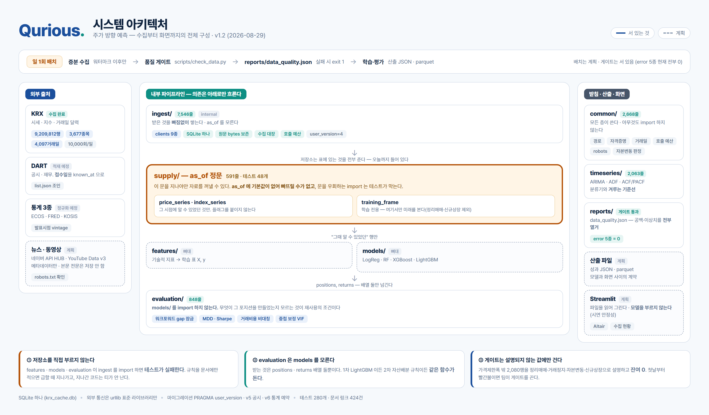

# Qurious · AlphaStack — 주가지수 등락 방향 예측과 성과 검증

> **"맞히는 것보다 어려운 건, 맞혔다고 말해도 되는지 아는 것"**


-yellow)


팀 **Qurious** 1차 프로젝트 · 2026-09-01(화) ~ 09-15(화) · 4인 · koreaIT 노원 B강의실

> 🖼️ **화면 스크린샷 자리** — Streamlit 대시보드가 나오면 여기에 넣습니다.
> 저장 위치 `docs/media/` · 폭 720~1200px · 1MB 이하로 압축 ·
> 움직이는 데모는 GIF 대신 mp4 를 권합니다(같은 내용에 GIF 가 약 8.5배 큽니다).
>
> 넣을 때는 `docs/media/hero.png` 를 가리키는 이미지 문법 한 줄이면 됩니다.

<p align="center">
  
  <br><sub>수집 → 저장 → 공급(as_of) → 피처 → 모델 → 검증 → 화면</sub>
</p>

---

## 한 문단 요약

주가지수와 개별 종목의 **5일 뒤 등락 방향**을 맞히는 모델을 만들고, 그 결과를
**믿어도 되는지 판별하는 검증 엔진**을 따로 세웁니다. 정확도 하나로 끝내지 않고
기준선 대비·거래비용 차감·워크포워드 분산까지 함께 냅니다. 자료는 KRX·DART·
공공데이터포털·한국은행에서 **시점 정합(as-of)** 을 지켜 모읍니다.

| | |
|---|---|
| **주제** | 주가지수 데이터 활용 머신러닝·딥러닝 |
| **GitHub** | https://github.com/devlee328288/Alpha_Stack (PUBLIC) |
| **화면** | Streamlit · Community Cloud 배포 예정 |
| **자료 전달** | HuggingFace private 데이터셋 (원자료는 저장소에 두지 않습니다) |
| **상태** | 🟢 수집·검사·공급 계층 가동 · 모델 실험 진행 · 화면 착수 전 |

---

## 📊 지금 무엇이 있나 — 2026-09-04 실측

| 자료 | 규모 | 기간 |
|---|---:|---|
| 일별시세 (수정주가 4칸 포함) | **9,223,644행** | 2010-01-04 ~ 2026-09-01 |
| 종목기본정보 (주권종류 정본) | 9,220,879행 | 2010-01-04 ~ 2026-08-31 |
| 종목 식별 (법인번호·ISIN) | 4,197,242행 | 2020-01-02 ~ |
| 지수 51종 | 196,119행 | 2010-01-04 ~ |
| 재무제표 | 662,933행 | 2015-09 ~ 2026-08 |
| 공시 목록 | 309,062행 *(수집 중)* | 2020-01 ~ |
| 거시지표 | 17,851행 | 2009-08 ~ |
| 업종 스냅샷 (사람이 받은 18장) | 16,650행 | 2024-01 ~ 2026-09 |

| 코드 | 규모 |
|---|---:|
| 전체 파이썬 | **56,540줄** (231파일) |
| 테스트 | 11,941줄 · **1,052 passed** |
| 설명 노트북 | 161권 · 셀 1,325개 |

> ⚠️ **모델 성능은 아직 기준선을 못 이겼습니다.** 조합 A~F × 모델 4종 × 피처 4구성으로
> 96개를 돌렸고, 하락 재현율이 특히 낮습니다. **못 이긴 것을 못 이겼다고 적는 것**이
> 이 프로젝트의 태도입니다 → [이슈 #37](https://github.com/devlee328288/Alpha_Stack/issues/37) ·
> [#33](https://github.com/devlee328288/Alpha_Stack/issues/33)

---

## 👥 팀 — 누가 무엇을 맡나

**2026-08-29 킥오프 확정 · 4인.** 각자의 작업은 PR 과 TIL 로 추적됩니다.

| 이름 | 역할 | 맡은 곳 | 대표 작업 |
|---|---|---|---|
| **이동원** | 팀장 · **데이터** 수집·저장·정제·전처리 | [ingest/](ingest/) · [common/](common/) · [supply/](supply/) · [scripts/](scripts/) · [docs/](docs/) | 수정주가 적재(v9) · `as_of` 정문 · 공공데이터포털 v10~v11 · 업종 스냅샷 · 데이터 품질 규약 |
| **오준영** | **모델** — 표 → 등락 방향 분류기 | [models/](models/) | 조합 A~F 96개 실험 · 2년 홀드아웃 재학습 · 피처 선정 |
| **강민석** | **백테스팅 · 성과지표 · 화면** | [evaluation/](evaluation/) · [backtest/](backtest/) | 5트랙 중첩 · 분할매매 3방식 · 비용 모델 4수준 · 기준선 3종 |
| **신장환** | **피처 · 품질** — 지표 계산 | [features/](features/) | RSI 결측 델타 수정 · 액면분할 재검증 · 유동 임계값 설계 |

**각자의 기록**
[TIL 이동원](docs/TIL/이동원/) · [TIL 오준영](docs/TIL/) · [TIL 강민석](docs/TIL/) · [TIL 신장환](docs/TIL/)
· [PR 목록](https://github.com/devlee328288/Alpha_Stack/pulls?q=is%3Apr) ·
[이슈](https://github.com/devlee328288/Alpha_Stack/issues)

> 파트 경계를 넘어야 할 때는 **먼저 담당자에게 묻고**, PR 본문에 왜 넘었는지 적고,
> 관련 문서에도 남깁니다. 화면과 공용 파일(루트 README·`pyproject.toml`·`conftest.py`)은
> 여러 사람이 함께 쓰므로 같은 절차를 따릅니다.

**코드 기반**: 이동원 개인 프로젝트 `data-service` 에서 필요한 것만 골라 이관 후 재구성
(2026-08-25 · 9,031줄 이관 + 734줄 신규).

---

## 🔴 알면서 아직 못 고친 것

정직하게 적습니다. 이 목록이 비어 보이는 저장소는 대개 **안 재 본 것**입니다.

| 무엇 | 크기 | 지금 영향 | 자세히 |
|---|---|---|---|
| FinanceDataReader 가 **감자를 조정하지 않는다** | 17자리 (개발구간 11) | 유니버스(시총 상위 50) 밖 · 전 종목 피처면 걸림 | [품질 규약 §6](docs/데이터파트/version3.3/데이터_품질_규약.md) |
| 극단 수익률 중 원인이 안 갈린 것 | 32행 | 학습에 그대로 들어감 | [품질 규약 §4.3](docs/데이터파트/version3.3/데이터_품질_규약.md) |
| 중기·장기 피처 | 통째로 없음 | 주간·월간 수익률이 빠져 있다 | — |
| 모델이 기준선을 못 이김 | — | 결과 보고에 그대로 적음 | [#37](https://github.com/devlee328288/Alpha_Stack/issues/37) |
| `ruff` 7건 | `backtest/` | 형식만 · 기능 영향 없음 | [#97](https://github.com/devlee328288/Alpha_Stack/issues/97) |

**반출 경로가 이걸 강제합니다.** `scripts/upload_to_hf.py` 가 검증기를 먼저 돌리고
하나라도 붉으면 **올리지 않습니다**. 알면서 내보내려면 `--skip-verify` 를 주고
데이터셋 카드에 그 사실을 적어야 합니다.

---
## 🚀 빠른 시작 — 5분 안에 돌려 보기

팀원이 클론한 뒤 **이 순서 그대로** 하면 됩니다. 막히면 그 자리에서 물어보세요.

```bash
git clone https://github.com/devlee328288/Alpha_Stack.git
cd Alpha_Stack

# 1) 파이썬 환경 (Python 3.12 필요)
#    uv 가 없으면: pip install uv
uv venv .venv --python 3.12
uv pip install --python .venv/Scripts/python.exe -e ".[dev]"
#    macOS/Linux 는 .venv/bin/python

# 2) 검증 엔진이 살아 있는지 확인 (외부 연결·API 키 없이 돕니다)
.venv/Scripts/python.exe -m pytest tests/ -q
#    → 1,052 passed · 3 xfailed 가 나오면 성공입니다 (2026-09-04 실측)

# 3) 코드 스타일 확인
.venv/Scripts/python.exe -m ruff check .
#    → 7건이 나옵니다. 전부 backtest/ 이고 형식만입니다 (이슈 #97)
```

**API 키 없이도 여기까지 됩니다.** 실제 수집만 `.env` 가 필요합니다.

> 📓 **자료가 실제로 어떻게 생겼는지** 보려면 [`notebooks/`](notebooks/) 를 보세요.
> 마크다운 설명 + 코드 + 실행된 출력이 한 장에 있고, GitHub 웹이 그대로 렌더링하므로
> 클론하지 않고 링크만 눌러도 읽힙니다.

```bash
# 4) (선택) 자격증명 — 아직 안 해도 됩니다
cp .env.example .env      # 값은 이동원에게 요청
```

> ⚠️ **`.env` 를 절대 커밋하지 마세요.** 이 저장소는 PUBLIC 입니다.
> `.gitignore` 가 막고 있지만, push 전에 `git status --short` 로 눈으로 확인합니다.

### 🔑 API 키 발급 안내

**KRX 하나만 있으면 1차 필수범위(시세·지수·백테스트)는 전부 돕니다.** 나머지는 선택입니다.

| 출처 | 쓰는 곳 | 발급 | 한도 |
|---|---|---|---|
| **KRX OpenAPI** ★필수 | 시세·지수 (F-01) | [openapi.krx.co.kr](https://openapi.krx.co.kr) | 문서상 10,000콜/일 — **아직 공식 확인 전** |
| DART | 공시·재무 (D-12) | [opendart.fss.or.kr](https://opendart.fss.or.kr) | 기본 20,000콜/일 (**키별로 다를 수 있음**) |
| ECOS · FRED · KOSIS | 거시 통계 (D-13) | 각 기관 사이트 | 여유 |
| **네이버 검색** | 뉴스·카페글 (D-20·D-21) | ⚠️ **신규 발급 중단** — 아래 참조 | 25,000콜/일 (앱별 합산) |
| **YouTube Data v3** | 동영상 (D-23) | [Google Cloud Console](https://console.cloud.google.com/apis/library/youtube.googleapis.com) | 10,000유닛/일 + `search.list` 별도 100콜 |

#### 🚨 네이버 검색 API — 2026-07-30 부로 신규 신청이 막혔습니다

> 개발자센터 약관 부칙 제2조 ①: *"2026년 7월 30일 24:00를 기점으로 (…) Search API (…)
> 신규 이용 신청 접수를 중단합니다."*

- **7/30 이전에 발급받은 키가 있다면** 그대로 씁니다. 단 **2027-06-30 24:00** 이 하드
  데드라인입니다(부칙 제2조 ②·④). 그래서 코드는 `base_url` 과 인증 헤더를 상수로 분리해
  **HUB 전환이 한 줄 교체**가 되도록 짭니다.
- **키가 없다면** [NAVER Cloud Platform 의 API HUB](https://www.ncloud.com) 로 가야 합니다.
  인증 헤더가 `X-NCP-APIGW-API-KEY-ID`/`X-NCP-APIGW-API-KEY` 로,
  경로가 `/v1/search/news.json` → `/search/v1/news` 로 바뀌고,
  한도가 일 25,000 이 아니라 **월 775,000건(월 단위 관리)** 이 됩니다.

⚠️ 한도는 **클라이언트 아이디(앱)별 합산**입니다 — 뉴스와 카페글이 같은 쿼터를 나눠 씁니다.
그리고 약관 7.3 ⑤ 가 **쿼터를 늘릴 목적의 다중 키 발급을 금지**하므로,
*"팀원마다 키를 받아 분산"* 은 설계에서 배제합니다.

#### 🚫 수집하지 않는 곳

**`finance.naver.com` 은 수집하지 않습니다.** `robots.txt` 를 직접 받아 확인한 결과,
`?code=*` 를 허용하는 규칙은 전부 `User-agent: yeti`(네이버 자체 크롤러) 그룹 소속이고,
우리 같은 제3자 봇이 매칭되는 `User-agent: *` 그룹은 `Disallow: /` 한 줄입니다.
RFC 9309 상 크롤러는 자신에게 매칭되는 **그룹 하나만** 따르므로 **사이트 전체가 불허**입니다.
→ 종목토론방 수집(D-22)은 **Won't** 로 내렸습니다.

---

---

## Why — 왜 이 문제인가

### 문제: "정확도 62%" 는 아무 말도 하지 않는다

주가 예측 프로젝트는 대개 정확도 몇 %로 끝난다. 그런데 그 숫자는 혼자서는 아무것도
증명하지 못한다.

- 상승이 62% 나오는 구간에서는 **언제나 "오른다"고 답하기만 해도** 62%가 나온다
- 시계열을 무작위로 섞어 나누면 미래로 과거를 예측하게 되어(look-ahead) 성능이 부풀어 오른다
- 거래비용을 빼지 않은 수익률은 **실현할 수 없는 숫자**다. 일간 매매는 왕복 비용이
  수익을 통째로 먹는 일이 흔하다

그래서 이 프로젝트는 "잘 맞히는 모델"보다 **"맞혔다고 말해도 되는지 판별하는 장치"** 를
먼저 만든다.

### 왜 검증 엔진을 따로 떼는가 — 세 차수가 같은 자를 쓴다

세 차수의 주제가 이미 정해져 있다.

| 차수 | 주제 |
|---|---|
| 1차 | 주가지수 데이터 활용 머신러닝·딥러닝 |
| 2차 | 나만의 로보 어드바이저 개발 **및 성과 검증** |
| 3차 | 나만의 투자 인디케이터 개발 **및 성과 검증** |

셋 다 "개발 및 성과 검증"으로 끝난다. 차수마다 새로 만드는 것은 **앞쪽**(신호 →
포트폴리오 → 지표)이고, **재는 방법은 바뀌지 않는다.** MDD 를 재는 법은 무엇이 그
수익률을 만들었든 같다.

검증 코드를 노트북 셀에 흩어 놓으면 1차는 통과하고 **2차에 전부 다시 짜게 된다.**
그 비용을 지금 없애는 것이 이 저장소 구조의 이유다.

---

---

## What — 무엇을 하는가

### 필수 범위 — 반드시 닫는다

| # | 항목 | 완료 조건 |
|---|---|---|
| ① | 기술적 지표 기반 등락 방향 예측 모델 | 예측 결과가 재현된다 |
| ② | ML 모델 성능 비교·평가 | 동일 조건 비교표가 나온다 |
| ③ | 롤링(walk-forward) 백테스팅 | 폴드별 성능과 **분산**이 나온다 |
| ④ | 재현 가능한 단일 파이프라인 | 한 명령으로 같은 결과 |
| ⑤ | **성과 검증 엔진 분리** (MDD·Sharpe·승률·거래비용) | 2·3차가 그대로 가져다 쓴다 |

### 선택 범위 — 관심사에 따라

⑥ 딥러닝(LSTM/GRU) 동일 조건 비교 · ⑦ 뉴스·공시 제목 감성 피처(무료 인코더만) ·
⑧ 유니버스 확장 350종목 횡단면 랭킹 · ⑨ ADF 정상성 검정(**기구현**) · ⑩~⑫ 인프라·팀원 제안

---

---

## How — 어떻게 만들었는가

### 계층 구조 — 의존은 아래로만 흐른다

```
common/       설정·경로·자격증명·거래일 계산. 아무것도 import 하지 않는다
  ↑
ingest/       바깥 세상과 통신하고 시세를 저장한다
  ├ clients/  외부 API 9종 (KRX·DART·ECOS·FRED·yfinance…)
  └ store/    수집한 것을 SQLite 하나에 넣고 꺼낸다 (`data/krx_cache.db`)
  ↑
supply/       ★ 팀원이 자료를 꺼내는 **정문**. `as_of` 를 여기서 강제한다
              밖에서 `ingest.store` 를 직접 import 하면 테스트가 실패한다
  ↑
features/     시세 → 기술적 지표 → 학습 가능한 표
  ↑
models/       표 → 등락 방향 분류기 (RF·XGBoost·LightGBM)
  ↑
evaluation/   ★ 예측 → 믿어도 되는가 (워크포워드·MDD·Sharpe·거래비용)
  ↑
화면          Streamlit 대시보드 (Community Cloud 배포)

timeseries/   ARIMA·ADF·ACF/PACF. numpy 로 손수 짠 시계열 도구 한 벌
              위 사슬과 나란히 선다 — 분류기와 겨룰 통계적 기준선
```

**`evaluation/` 은 `models/` 를 import 하지 않는다.** 받는 것은 포지션 배열과 수익률
배열뿐이다. 무엇이 그 포지션을 만들었는지 모르게 짜 두면 2·3차가 그대로 가져다 쓴다.
이 무지(無知)가 재사용의 조건이다.

> `evaluation` 안에서 models 를 import 하고 싶어지면 설계가 틀어진 신호다.
> import 를 추가하지 말고 **함수 인자를 늘린다.**

### 왜 원본을 통째로 복제하지 않았는가

원본 `data-service` 는 리서치 리포트 생성까지 하는 더 큰 서비스다(라우터 17파일 ·
엔드포인트 64개 · research 24파일 11,241줄). **1차 범위에 필요한 것만 골라 가져오고
구조는 목적에 맞게 다시 짰다.**

| 가져온 것 | 줄수 | 이유 |
|---|---|---|
| `common/` ← `app/core/` | 1,360 | 설정·경로·자격증명·거래일 |
| `ingest/clients/` ← `app/clients/` | 3,978 | 외부 API 9종. 팀원 B 검수 대상 |
| `ingest/store/` ← `app/repositories/` | 1,612 | krx 계열만. clip·report·user 는 뺐다 |
| `timeseries/` ← `app/services/timeseries/` | 2,063 | ARIMA·ADF·워크포워드 |
| `scripts/` | 532 | 수집·유니버스 구축 |
| `sql/init/` | 250 | 스키마 (clip 제외) |

**가져오지 않은 것**: `app/services/research/`(리포트 생성기 · 1차 범위 밖),
`app/routers/`(엔드포인트 64개), `app/main.py`

### 기술 스택 — 버전은 추측이 아니라 실측이다

```
Python 3.12.13
numpy 2.5.1 · pandas 3.0.5 · scipy 1.18.1
scikit-learn 1.9.0 · LightGBM 4.7.0 · XGBoost 3.4.1 · joblib 1.5.3
SQLAlchemy 2.0.52
nbformat 5.11.1 · nbclient 0.11.0 · ipykernel 7.3.0   (dev — notebooks/)
```

> ⚠️ numpy 2.5 / pandas 3.0 은 상당히 앞선 버전이라 ML 라이브러리와 ABI 가 어긋날
> 수 있습니다. **2026-08-25 에 실제로 설치해 7종 전부 import 되는 것을 확인한 뒤**
> 이 조합을 고정했습니다. 임의로 올리지 마세요.

### 학습을 어디서 돌리나 — 로컬이 기본이다

| 작업 | 실행처 | 근거 |
|---|---|---|
| **LightGBM 학습·그리드** | **로컬** | 배포판이 GPU 빌드가 아니다. 코어 수만 좌우한다 |
| sklearn RF · 보정 · bootstrap | 로컬 | 전부 CPU 경로 |
| 전처리 · 피처 · EDA | 로컬 | I/O 바운드이고 원자료가 로컬에 있다 |
| 딥러닝(⑥ LSTM/GRU) | Colab Pro | GPU 이득이 실재한다 |

> **"Colab 이니까 빠르겠지"로 판단하지 않습니다.** 로컬이 22코어라 CPU 바운드
> 작업은 Colab 런타임보다 **빠릅니다.**

---

---

## Impact — 무엇을 숫자로 잴 것인가

> 🟡 **모델 실험은 돌고 있으나 기준선을 아직 못 이겼습니다.**
> 여기에 추측값을 적지 않습니다 — 측정한 것만 적습니다.

### 지금까지 실제로 나온 것

**2026-09-04 실측**

| 항목 | 값 |
|---|---|
| 파이썬 코드 | **56,540줄** (231파일) |
| 테스트 | 11,941줄 · **1,052 passed · 3 xfailed** |
| 설명 노트북 | **161권** · 셀 1,325개 |
| 수집한 시세 | **9,223,644행** (수정주가 4칸 포함) |
| 스키마 마이그레이션 | **v11** |
| 모델 실험 | 조합 A~F × 모델 4종 × 피처 4구성 = **96개** |
| 🔴 기준선 대비 | **아직 못 이김** — 하락 재현율이 특히 낮다 |

**이관 세션 (2026-08-25 실측)**

| 항목 | 값 |
|---|---|
| 이관한 코드 | 9,031줄 (원본 약 15,000줄 후보 중 선별) |
| 신규 작성 | 734줄 (검증 엔진 478 + 테스트 159 + 계약 97) |
| 모듈 import 검증 | **32/32 성공** |
| 검증 엔진 테스트 | **20/20 통과** (0.23초) |
| 린트 (새 코드) | **0건** — 남은 36건은 전부 원본에서 물려받은 것 |
| 사용 가능한 유니버스 | KOSPI200 200 + KOSDAQ150 150 = **350종목** (2026-08-25 기준) |

### 1차 종료 시 보고할 숫자

- **① 예측 성능**: Accuracy · F1 · 방향 적중률 — **기준선 3종과 나란히**
- **② 모델 비교**: RF vs XGBoost vs LightGBM, 동일 폴드·동일 피처·동일 레이블
- **③ 폴드별 분산**: 평균이 아니라 **흔들림**. 이게 "믿어도 되는가"의 답이다
- **⑤ 성과 지표**: MDD · Sharpe · 승률 · **거래비용 차감 후** 수익률

> ⚠️ 기준선을 못 이기면 **못 이겼다고 적습니다.** 주가는 효율시장에 가까워서
> 못 이기는 것이 정상에 가깝고, 그 사실을 감추면 보고서가 거짓말이 됩니다.

---

---

## Proof — 깊이 볼 만한 것

팀원들이 코드 리뷰할 때 여기부터 보면 좋습니다.

### 1. 거래비용은 조용히 틀린다 — [evaluation/metrics.py](evaluation/metrics.py)

포지션이 바뀔 때만 비용이 든다. 그런데 **첫 시점의 진입 비용**을 빠뜨리기 쉽다.
`positions[0]` 이 0 이 아니면 아무것도 없던 상태에서 잡은 것이므로 비용이 드는데,
`np.diff` 로 짜면 첫 원소가 사라져 매 폴드마다 진입이 공짜가 된다.

```python
previous = np.concatenate(([0.0], pos[:-1]))   # 맨 앞에 0 을 덧대는 이유가 이것
turnover = np.abs(pos - previous)
```

→ [tests/test_evaluation.py](tests/test_evaluation.py) 의
`test_첫_시점_진입_비용을_빠뜨리지_않는다` 가 이걸 잡습니다.

### 2. gap 이 없으면 5일 레이블이 학습에 샌다 — [evaluation/walk_forward.py](evaluation/walk_forward.py)

"5일 뒤 상승" 레이블은 t 행이 t+5 가격을 알아야 만들어진다. 학습 구간 마지막 행의
레이블이 검증 구간 초반과 **겹친다** — 학습이 검증 답을 이미 본 셈이다.

레이블이 k 일 앞을 보면 `gap=k` 로 둔다. **이걸 빠뜨려도 에러가 나지 않는다.**
성능이 조용히 부풀어 오를 뿐이다.

### 3. 포지션 정렬 한 줄 — [evaluation/metrics.py](evaluation/metrics.py) 모듈 docstring

```python
signal   = model.predict(features)   # t 일 종가까지 보고 낸 신호
position = np.roll(signal, 1)        # t+1 일 수익률에 적용  ← 이 한 줄
position[0] = 0
```

이걸 빠뜨리면 정확도 60% 짜리 모델이 연 300% 를 벌어 준다.
**그런 결과가 나오면 기뻐하기 전에 이 정렬부터 의심합니다.**

### 4. 상장폐지 종목을 지우지 않는 이유 — [sql/init/01-schema.sql](sql/init/01-schema.sql)

```sql
is_delisted boolean NOT NULL DEFAULT false,
```

지우면 **생존 편향**이 생긴다. 망한 종목이 빠진 유니버스로 백테스트하면 실제보다
훨씬 좋은 결과가 나온다.

### 5. 원본이 numpy 로 손수 짠 ARIMA — [timeseries/](timeseries/)

`scipy` · `statsmodels` 없이 ADF(MacKinnon 임계값) · ACF(Bartlett) ·
PACF(Durbin-Levinson) · ARIMA(Hannan-Rissanen)를 직접 구현해 둔 2,063줄.
**⑨ 정상성 검정은 이미 구현되어 있고**, ARIMA 는 우리 트리 모델이 겨룰 통계적 기준선입니다.

---

---

## Learn — 배운 것 / 개선할 것

> 🟡 프로젝트 회고는 1차 종료 후 채웁니다. 아래는 **이관 세션에서 실제로 겪은 것**입니다.

### 겪은 것 ① — 경로 깊이는 조용히 깨진다

원본 `app/clients/krx_data.py` 의 `parents[2]` 는 `app` 을 건너뛰어 루트를 가리키도록
센 숫자였다. 폴더 구조를 바꾸자 **루트가 아닌 곳을 가리켰지만 import 는 멀쩡히
통과했다.** 파일을 실제로 읽는 순간에야 드러난다.

→ 그래서 [common/paths.py](common/paths.py) 에 기준점을 모았습니다. 새 코드는
깊이를 세지 말고 `DATA_DIR` · `ARTIFACTS_DIR` 을 씁니다.

### 겪은 것 ② — 상대 import 는 일괄 치환에서 빠진다

`from ..repositories import tmp_cache` 는 절대 경로 치환 규칙에 걸리지 않았다.
import 검증을 돌리지 않았다면 팀원이 9/1에 `ModuleNotFoundError` 를 봤을 것이다.

→ **"옮겼다"의 완료 조건은 "import 가 된다"입니다.** 32개 모듈 전부 확인했습니다.

### 겪은 것 ③ — "설치된다"와 "import 된다"는 다르다

`uv pip compile` 은 numpy 2.5.1 + sklearn 조합을 문제없이 해석했다. 하지만 의존성
해석 성공이 ABI 호환을 보장하지 않는다. **실제로 설치해서 import 해 봐야** 안다.

### 개선하고 싶은 것

숫자는 전부 **2026-08-31 실측**입니다.

- `common/settings.py`(497줄)에 1차가 쓰지 않는 원본 설정이 섞여 있다 → [회의안건 C-1](docs/회의안건/2026-09-01-킥오프.md)
- `ingest/store/krx_pg.py`(412줄)는 Postgres 경로라 1차에서 안 켠다. **지우지는 않는다** —
  `krx_store.py` 가 `krx_pg.CODE_PATTERN` 을 Postgres 분기 **밖에서** 쓰고 있어,
  지우면 한글 종목명 검색이 조용히 죽는다
- `ruff` 33건이 남아 있다 (전부 이관 코드의 한국어 주석 줄 길이). 손대는 파일만 정리한다
- `models/`(34줄)는 아직 계약만 있고 구현이 없다. `features/` 는 **564줄**로 채워졌다
  (지표 3종 — RSI·MACD·거래량·변동성)
- `api/`(28줄)는 빈 `__init__.py` 하나다. 화면을 Streamlit 으로 정해 **FastAPI 는 넣지
  않기로** 했는데 `pyproject.toml` 에는 fastapi·uvicorn·pydantic 이 아직 핀까지 박혀 있다

---

---

## 📁 문서

> 👉 **먼저 [docs/README.md](docs/README.md) 를 봅니다** — 문서 인덱스이자 버전 규약입니다.
> `docs/` 는 **도메인 폴더 + `versionN.N`** 으로 관리합니다. 옛 버전은 지우지 않습니다 —
> 개정 이력이 곧 이 프로젝트의 발전 과정입니다.

**팀 전체**

| 문서 | 내용 |
|---|---|
| [문제정의 v2.0](docs/문제정의/version2.0/문제정의.md) | ★ **왜 만드나 · 무엇이 성공인가** (계획서보다 앞섭니다) |
| [요구사항 v2.0](docs/요구사항/version2.0/요구사항.md) | ★ **무엇을 만드나** — 기능 29건 · 데이터 요구사항 12건 |
| [시장조사 v2.0](docs/시장조사/version2.0/시장조사.md) | 근거 — 국내외 서비스 · 선행연구 · 한국 제도 제약 |
| [아키텍처 v1.2](docs/아키텍처/version1.2/아키텍처.md) · [기능명세 v1.3](docs/기능명세/version1.3/) | 계층 구조와 설계 결정 · [시스템 구성도](docs/아키텍처/version1.2/시스템아키텍처.png) · [AI 에이전트 제안](docs/아키텍처/version1.2/AI에이전트구성.png) |
| [ERD v2.2](docs/erd/version2.2/ERD.md) | 데이터 모델 (표 20개 · v11) |

**데이터 파트** (수집 · 전처리 · 정제 · 마이닝 · 크롤링 · 화면)

| 문서 | 내용 |
|---|---|
| ★ [데이터 품질 규약 v3.3](docs/데이터파트/version3.3/데이터_품질_규약.md) | **이상치·결측·자본변동·편향** — 수업이 든 함정을 전량 실측과 대조. 🔴 FDR 이 감자를 조정하지 않는다 |
| [데이터파트 명세서 v3.3](docs/데이터파트/version3.3/명세서.md) | 이 파트가 무엇을 만드는가 (D-00~D-100) |
| [공공데이터포털 수집 설계](docs/데이터파트/version3.3/공공데이터포털_수집_설계.md) | 종목코드 ↔ 법인번호 ↔ ISIN 을 잇는 다리 |
| [모델 라이선스 대장](docs/데이터파트/version3.3/모델_라이선스_대장.md) | HF 모델 18종 전수 조회 — **5종이 라이선스 미표기** |
| [API 키 발급 가이드](docs/데이터파트/version3.3/API키_발급_가이드.md) | 팀원이 각자 키를 받는 법 (15종) |
| [데이터파트 버전 목록](docs/데이터파트/README.md) | v1.0 ~ v3.3 개정 이력 |

**버전이 없는 문서** (살아 있는 운영 문서)

| 문서 | 내용 |
|---|---|
| [docs/decisions/](docs/decisions/) | ADR — **번호가 곧 이력**이라 버전을 두지 않습니다 |
| [docs/회의안건/](docs/회의안건/) | 회의 안건과 결정 (킥오프 미결 사항은 전부 닫혔습니다) |
| [docs/합류전-준비물.md](docs/합류전-준비물.md) | 팀원이 킥오프 전에 할 것 (KRX 키 발급) |
| [docs/TIL/](docs/TIL/) | 작업 기록 — **작성자별 폴더** · 날짜가 곧 버전 |
| [docs/계획서/](docs/계획서/) | 강사님께 내는 계획서 — **v3.0 정본** (프로젝트명 Qurious 확정) |
| [AGENTS.md](AGENTS.md) | 팀 협업 규약 (Git·브랜치·코드 스타일) |
| [docs/AlphaStack_팀프로젝트_소개.html](docs/AlphaStack_팀프로젝트_소개.html) | 모집용 소개 (범위·일정 정본) |

문서를 옮기거나 버전 폴더를 새로 팔 때는 **반드시** 링크를 검사합니다 —
상대 경로가 전부 바뀌므로 사람 눈으로는 빠뜨립니다.

```bash
python scripts/check_doc_links.py      # 깨진 링크가 있으면 exit 1
```

---

---

## 📝 PR 작성 규칙 ★

**PR 본문은 아래 7절을 순서대로 채웁니다.** 빈 절은 지우지 말고 "해당 없음"이라고 적습니다 —
*"없음"* 과 *"안 썼음"* 은 다릅니다.

| 절 | 무엇을 적나 |
|---|---|
| **Why** (왜) | 왜 이 문제를 해결하려 했는가? 왜 이 주제를 택했는가? |
| **What** (무엇을) | 무엇을 수행했는가? **핵심 기능 설명** + **✅ 이번에 한 것** + **아직 안 한 것** |
| **Who** (누가) | 프로젝트 내에서 내 책임과 기여도는? 누구의 작업을 이어받았나? |
| **How** (어떻게) | 어떻게 해결했는가? **아키텍처·개발 프로세스**. **핵심 코드**를 붙인다 |
| **Impact** (결과) | **수치·성능·비용·속도.** 재지 않았으면 "미측정"이라 쓴다 |
| **Proof** (증명) | 심층적으로 다뤄볼 소재 — **트러블슈팅 기록**, 살펴볼 만한 코드 |
| **Learn** (회고) | 그래서 무엇을 배웠는가? 가장 크게 배운 점은? (F1·Accuracy 등 지표 해석 포함) |

### ✅ 체크리스트는 **빠뜨리지 않습니다** ★

What 절에는 **`✅` 한 줄짜리 완료 목록**이 반드시 들어갑니다. 산문만 쓰면 무엇이 끝났는지
읽는 사람이 세어야 하고, **팀에 공유할 때 그대로 붙여 넣을 수 있는 형태**가 없습니다.

```markdown
## What — 무엇을 했나

### N차 PR에서 진행한 항목

✅ 저장소 초기화 (기존 커밋 `be4e647` 위에 올라탐 — reset 없이)
✅ 원본 `data-service` 에서 9,031줄 선별 이관 + 목적에 맞게 구조 재구성
✅ 검증 엔진 신규 작성 (`evaluation/` 478줄) + 테스트 20개
✅ ML 스택 호환성 실측 후 버전 고정
✅ 문서 6종 (README · AGENTS · 아키텍처 · ERD · 회의안건 · ADR)

### 아직 안 한 것

D-02(워터마크) · D-01(원본 보존) 은 표가 먼저 서야 해서 다음 PR 로 갑니다.
```

한 줄에 **무엇을 · 얼마나** 가 같이 들어가게 씁니다.

```markdown
❌ ✅ 테스트 추가
✅ ✅ 검증 엔진 신규 작성 (evaluation/ 478줄) + 테스트 20개
```

**"아직 안 한 것" 도 같은 절에 씁니다.** 안 한 것을 적지 않으면 다음 사람이 그게 된 줄
알고 그 위에 쌓습니다. To-Do 를 미루는 게 아니라 **어디까지가 이번 PR 인지를 긋는 일**입니다.

### 왜 이 형식인가

이건 **포트폴리오이자 면접 자료**입니다. 채용 담당자와 강사님이 보는 것은 결과물만이
아니라 **과정**입니다. 위 7절은 *"무엇을 만들었나"* 가 아니라
***"무엇을 왜 그렇게 결정했고, 무엇을 배웠나"*** 를 답하게 만듭니다.

특히 **Impact 와 Proof** 가 이 형식의 핵심입니다.

- **Impact** — 숫자가 없으면 *"열심히 했다"* 로 끝납니다.
  ⚠️ **추측값을 적지 않습니다.** 재지 않은 것은 "미측정"입니다
- **Proof** — 트러블슈팅 기록이 **실력을 보여 주는 유일한 대목**입니다.
  잘 된 것보다 **막혔다가 푼 것**을 적으세요

### 함께 지킬 것

- 리뷰어가 **어디부터 읽어야 하는지** 맨 위에 적습니다
- **논의가 필요한 곳**은 `💬` 로 표시해 질문을 남깁니다
- 커밋 메시지도 같은 태도로 씁니다 — 무엇을 고민했고 **무엇을 버렸는지**
  ([AGENTS.md 1.3](AGENTS.md))

> 📌 참고 예시: [PR #1](https://github.com/devlee328288/Alpha_Stack/pull/1) ·
> [PR #2](https://github.com/devlee328288/Alpha_Stack/pull/2)

### 작업 기록은 TIL 로

PR 하나 = [TIL](docs/TIL/) 한 장이 기본입니다. PR 을 만들지 않은 작업(조사·회의 준비)도
남깁니다. 형식은 [docs/TIL/README.md](docs/TIL/README.md) 참조.

**파일은 `docs/TIL/<본인 이름>/` 아래에 둡니다** — 예: `docs/TIL/이동원/2026-09-03-rsi-피처.md`.
네 명이 같은 저장소에 쓰기 때문에 작성자로 갈라 두어야 *"이 사람이 2주 동안 무엇을
했나"* 가 폴더 하나로 보입니다. 첫 작업 때 본인 폴더를 만드세요.

---

---

## ⚠️ 이 저장소의 규칙 (짧게)

- **PUBLIC 입니다.** `.env` · API 키 · 데이터 원본을 커밋하지 않습니다
- **PR 로 올립니다.** `main` 직커밋 금지. 머지는 **사람이 GitHub 웹에서** 직접
- **`gh pr merge` 금지** — 계정 정지 이력이 있습니다
- **`gh` 는 폴더를 모릅니다** — `bash scripts/gh-team.sh pr create` 를 씁니다
- 파이썬은 `snake_case` · 4-space · line-length 100 · 주석과 문서는 한국어
- push 전 `git status --short` 로 PDF·ZIP·데이터·시크릿 혼입 확인

전문: [AGENTS.md](AGENTS.md)

