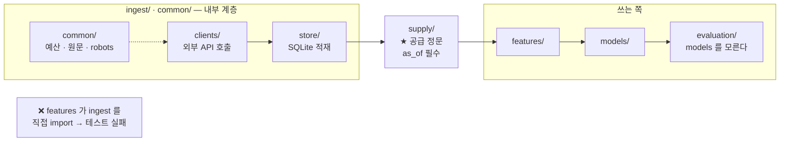

# 기능명세 — AlphaStack 1차 (v1.0)

> **이 문서가 답하는 것: "어떻게 만들었나 / 어떻게 만들 것인가".**
> *왜* 는 [문제정의](../../문제정의/version2.0/문제정의.md), *무엇* 은
> [요구사항](../../요구사항/version2.0/요구사항.md), *근거* 는 [조사/](../../조사/)에 있습니다.
>
> v1.0 · 2026-08-27 · 작성 이동원
>
> 📌 **범위**: **데이터 파트는 핵심 코드까지 상세히**, 다른 파트는 **입출력과 수용
> 기준만** 적습니다. 제가 만들지 않는 곳을 상세히 쓰면 담당자와 어긋납니다.
> **API 엔드포인트 명세와 ERD 는 이 문서에 넣지 않습니다** — 1차는 로컬 파일이라
> 엔드포인트가 없고, 스키마는 [ERD](../../erd/version1.0/ERD.md)가 정본입니다.

---

## 0. 지금 서 있는 것

| 계층 | 줄 수 | 상태 |
|---|---|---|
| `ingest/` 수집 클라이언트 9종 + 저장 | 7,305 | ✅ |
| `common/` 예산 · 원문보존 · robots · 시크릿 · 거래일 | 2,338 | ✅ |
| `supply/` 공급 정문 | 228 | ✅ |
| `evaluation/` 검증 엔진 | 572 | ✅ |
| `timeseries/` ARIMA · 정상성 · 워크포워드 백테스트 | 2,063 | ✅ |
| `tests/` | 2,528 | ✅ **186개 통과** |
| `features/` · `models/` | 69 | ⬜ **빈 껍데기** |
| 화면 | 0 | ⬜ |

---

## 1. 계층과 의존 방향



**규칙 둘이 코드로 강제됩니다.**

1. **`supply/` 밖에서 `ingest.store` 를 import 하면 테스트가 실패합니다**
   (`tests/test_supply_boundary.py`). 문서에만 적어 두면 급할 때 지나가고,
   지나간 코드는 티가 안 납니다.
2. **`evaluation/` 은 `models/` 를 import 하지 않습니다.** 무엇이 그 포지션을
   만들었는지 몰라야 2·3차가 같은 자를 씁니다.

---

## 2. 데이터 파트 — 상세

### 2.1 수집 대장 (D-02) — `ingest/store/collect_log.py` · 515줄

**푸는 문제**: *"안 받았다"* 에는 서로 다른 뜻이 섞여 있습니다. 하나로 뭉뚱그리면
두 방향으로 틀립니다 — 전부 재시도로 보면 **휴장일마다 영원히 같은 호출을 태우고**,
전부 완료로 보면 **진짜 실패가 조용히 묻힙니다.**

**상태를 다섯으로 가릅니다.**

| 상태 | 뜻 | 다시 받나 |
|---|---|---|
| `ok` | 받았다 | ❌ |
| `empty` | 0건 — **휴장일** | ❌ (단 최근 0건은 재확인) |
| `out_of_range` | 제공 시작일 이전이라 **요청하지 않았다** | ❌ |
| `error` | 실패 | ✅ `max_attempts` 까지 |
| `quota_exhausted` | 한도 소진 — **그 날짜의 잘못이 아니다** | ✅ |

**읽는 쪽은 함수 하나만 부르면 됩니다.**

```python
def should_collect(source: str, target: str, *,
                   max_attempts: int = DEFAULT_MAX_ATTEMPTS,
                   empty_recheck_days: int = 0,
                   db_path: Optional[Path] = None) -> bool:
    row = entry(source, target, db_path=db_path)
    if row is None:
        return True                              # 한 번도 안 받았다
    status = row["status"]
    if status == EMPTY and empty_recheck_days > 0:
        if _days_since(row["last_attempted_at"]) < empty_recheck_days:
            return True                          # 장 마감 전 0건일 수 있다
    if status in SETTLED:                        # ok · empty · out_of_range
        return False
    if status == ERROR:
        return int(row["attempts"] or 0) < max_attempts
    return True                                  # quota_exhausted — 예산이 풀리면 받는다
```

**설계에서 중요한 것 셋**

- **적재와 같은 트랜잭션에 얹습니다** (`conn` 을 받습니다). 따로 커밋하면 그 사이에
  죽었을 때 *"저장은 됐는데 대장에는 없는"* 어긋난 상태가 남습니다
- **한도 소진은 재시도 횟수를 먹지 않습니다.** 예산이 세 번 마르면 멀쩡한 날짜를
  영영 포기하게 됩니다
- `import_legacy()` 로 옛 이력 **8,686건**을 넘겨받았습니다. 안 옮기면 이미 받은
  4,343 거래일이 미수집으로 보여 **16년치를 다시 받습니다**

> 🐛 **고친 버그**: `attempts` 를 UPSERT 의 `ON CONFLICT` 쪽에서만 올리고 INSERT 자리에
> 0 을 박아 두어 **맨 처음 실패가 세어지지 않았습니다.** 재시도가 매번 한 번씩 더 돌고
> 있었고 테스트가 잡았습니다. *"새로 만드는 경로"* 와 *"고치는 경로"* 가 갈리는 자리에서는
> **양쪽 다** 확인해야 합니다.

---

### 2.2 원문 보존 (D-01) — `common/raw_store.py` · 300줄

**푸는 문제**: 정규화 로직을 고치면 **다시 받아야** 했습니다. KRX 는 과거를 다시 주지만
뉴스 API 는 1,000건 창이 있어 **한 번 놓치면 끝**입니다.

**응답 원문을 손대기 전에 그대로 남기고**, `raw → normalized` 를 **순수 함수**로 만듭니다.

```python
def save(source: str, target: str, body: bytes, *,
         charset: str = "utf-8", ...) -> None:
    """받은 그대로 저장한다. gzip 압축 후 (source, target, fetched_at) 로 키."""
```

| 항목 | 값 |
|---|---|
| 압축 | gzip — 지수 24.6% · 종목 18.7% 로 줄어듦 |
| 증가분 | **하루 약 58KB · 1년 약 21MB** (실측) |
| 상한 | `MAX_BODY_BYTES = 32MB` — 넘으면 `RawTooLarge` |
| 허용 출처 | `ALLOWED_SOURCES` 화이트리스트 — ⚠️ **크롤링 계열은 제외** |

> 🔴 **크롤링 계열을 화이트리스트에서 뺀 이유**: 네이버 약관 7.3 ③ 이 취득 정보의
> **저장·가공을 금지**합니다. 원문 보존은 좋은 습관이지만 **약관과 충돌하는 곳에서는
> 하지 않습니다.**

> 💡 **보험이 사고를 만들면 안 됩니다.** 원문 보존이 실패했다고 16년 백필이 멈추면
> 보험이 사고의 원인이 됩니다. **보존 실패는 경고만 남기고 수집은 계속합니다.**

**재정규화 CLI**: `python scripts/renormalize.py` — 외부 재호출 없이 원문만으로
다시 정규화합니다. ⚠️ 현재 **지수만** 되고 종목은 미완입니다.

---

### 2.3 공급 정문 · Point-in-Time (D-00) — `supply/` · 228줄

**푸는 문제**: 저장소는 **표에 있는 것을 전부** 줍니다. 표에는 오늘까지 들어 있습니다.
그걸 2020년 폴드 학습에 그대로 쓰면 **미래가 섞이고, 예외는 나지 않습니다.**

**이 문을 지나려면 `as_of` 를 내야 합니다. 기본값이 없으므로 빠뜨릴 수가 없습니다.**

```python
from supply import index_series

rows = index_series(as_of="2020-06-30")     # as_of 를 빼면 AsOfRequired
```

**핵심 규칙 — 시세는 T+1 0시부터 알 수 있다**

```python
def known_at(bas_dd: str) -> datetime:
    """거래일 YYYYMMDD 의 시세를 **언제부터 알 수 있었나.**

    T+1 의 0시(KST)를 돌려준다. 한 줄로 줄이면
    "실측하지 않은 값을 가정으로 쓰지 않는다" 이다.
    """
    day = date(int(bas_dd[:4]), int(bas_dd[4:6]), int(bas_dd[6:]))
    return datetime.combine(day + timedelta(days=1), time.min, tzinfo=KST)
```

**왜 하루를 통째로 미루나.** KRX 당일 자료가 **16:10 에도 아직 0행**이었습니다(실측).
언제 정확히 올라오는지 재지 않았으므로 **가정하지 않고 다음 날로 미룹니다.**
보수적 방향이라 틀려도 미래를 보지 않습니다.

| | `ingest/` | `supply/` |
|---|---|---|
| 관심사 | 받은 것을 **빠짐없이** 쌓는다 | 그 시점에 **알 수 있었던 것만** 낸다 |
| `as_of` | 모른다 (알 필요가 없다) | **필수로 받는다** |
| 부르는 쪽 | 수집 스크립트·화면 | 피처·모델·평가 |

`latest_known_day(as_of)` 는 문자열을 돌려줍니다 — SQL 에 `bas_dd <= ?` 로 바로 넣어
**4,097행을 파이썬으로 거르는 대신 DB 가 인덱스로 자르게** 하려는 것입니다.

---

### 2.4 `robots.txt` 가드 (D-03) — `common/robots.py` · 260줄

**푸는 문제**: 기술적으로 긁을 수 있는 것과 긁어도 되는 것은 다릅니다.
그리고 이 판단을 **나중에** 하면 이미 만든 것을 버려야 합니다.

**HTTP 상태 분기가 이 모듈의 핵심입니다.**

| 응답 | 판정 | 근거 |
|---|---|---|
| `2xx` | 파싱해서 규칙대로 | — |
| **`4xx`** (404 포함) | **전면 허용** | RFC 9309 — MAY access |
| **`5xx` · 네트워크 오류** | **전면 차단** | RFC 9309 — **MUST** assume complete disallow |

> 🔴 **흔한 실수가 5xx 를 허용으로 처리하는 것**인데 RFC 는 MUST 로 금지합니다.
> 그리고 **차단 가드가 반대 방향으로 틀리면 가드가 없는 것보다 나쁩니다** —
> 안전하다는 착각을 주기 때문입니다.

- 파서는 **`protego==0.6.2`**. 표준 `urllib.robotparser` 는 **fail-open** 이라 탈락
  (`<=0.6.1` 은 ReDoS 취약 CVE-2026-55520) → [조사/도구선정](../../조사/도구선정.md)
- 24시간 캐시. 단 5xx 로 갱신 실패 시 **직전 캐시를 계속** 씁니다
- ⚠️ 응답이 **`charset=euc-kr`** 입니다. UTF-8 로 가정하지 않습니다
- `require(url)` 은 불허 시 `RobotsBlocked` 를 던집니다 — **요청 자체를 안 합니다**

⬜ **아직 부르는 수집기가 0건입니다.** 크롤러를 만들 때 반드시 통과시킵니다.

---

### 2.5 호출 예산 (D-04) — `common/budget.py` · 296줄

**부르기 전에 셉니다.** 부르고 나서 세면, 응답을 못 받고 죽었을 때 이미 나간 호출이
장부에 안 남아 **한도를 넘겨 쓰게** 됩니다. 세고 나서 실패하면 손해는 1콜뿐입니다.

```python
if not budget.try_spend("krx"):
    break                      # 실패가 아니라 "오늘은 여기까지"
```

- **네트워크로 나가는 자리에서** 셉니다. 한 단계 위에서 세면 **간헐적 401 재시도분
  (실측 1.25배)이 통째로 누락**됩니다
- 80% 에서 경고, 100% 에서 **정상 종료** (예외 아님)
- `BEGIN IMMEDIATE` 로 잠금을 먼저 잡습니다 — 읽고 쓰는 사이에 다른 프로세스가
  끼어들면 **둘 다 "아직 여유 있다"** 고 판단해 한도를 넘깁니다
- ⚠️ `LIMITS` 의 KRX 10,000 · DART 20,000 은 **가정값**입니다. 주석에 그 사실을 적었습니다

---

### 2.6 스키마 마이그레이션 — `ingest/store/migrations.py` · 338줄

**900만 행이 든 DB 에 칸을 얹으려면** 버전 관리가 필요합니다. `PRAGMA user_version` +
자작 30줄로 갑니다. alembic 이 주는 batch 모드는 **19초짜리 경로**인데 우리가 쓸
`ADD COLUMN` 은 **0.16ms** 입니다 → [조사/도구선정](../../조사/도구선정.md)

**규약 4개 — 타협 불가**

1. **`BEGIN IMMEDIATE` 를 명시한다** — 파이썬 `sqlite3` 기본 모드는 DDL 을 암묵
   트랜잭션에 넣지 않는다
2. **`executescript()` 를 쓰지 않는다** — 열린 트랜잭션을 먼저 커밋해 롤백이 불가능해진다
3. **`PRAGMA user_version=N` 을 스키마 변경과 같은 트랜잭션에** — *"헤더라서 트랜잭션
   밖"* 이라는 통설은 실측으로 반증됐다
4. **`PRAGMA user_version` 만 쓴다** — `schema_version` 은 내부용이고 공식 문서가
   DB 손상을 경고한다

**스키마 규칙**: 새 컬럼에 **CHECK 제약 금지**(3만 배) · **`DROP COLUMN` 금지**(19초).
반대로 `NOT NULL DEFAULT <상수>` 는 마음껏.

---

### 2.7 수집 클라이언트 — `ingest/clients/` · 4,163줄

9종(DART · KRX · FRED · KOSIS · ECOS · yfinance · HF · FSS)이 이미 섰습니다.
**공통 규칙 D-00~D-04 를 지나는 것이 기본값**입니다.

**KRX 에서 겪은 것**

| 실측 | 대응 |
|---|---|
| 동시 호출 시 **401**(429 아님)을 반환 | 워커 **1 고정**. 재시도 로직이 *"키가 틀렸나?"* 로 오판하지 않게 주석에 명시 |
| 재시도 없으면 **깜빡임 하나가 남은 3,000일을 전멸** | 재시도 + 멱등 재개 |
| 당일 자료가 16:10 에도 0행 | 배치를 그 뒤로. `known_at` 은 T+1 |
| 2009년은 0행 | `DATA_START = "20100104"`. 그 이전은 `out_of_range` 로 대장에 이유를 남긴다 |

---

### 2.8 테스트가 진짜 DB 를 건드리지 못하게

`tests/conftest.py` 가 **프로세스 전체에서** 수집 DB 경로를 임시 폴더로 돌립니다.

**가상의 위험이 아니었습니다.** 대장 함수 한 곳에 DB 경로를 안 넘겨서 `pytest` 한 번에
`data/krx_cache.db` 에 20행이 들어갔습니다. 이번엔 내용이 사실이라 무해했지만,
**같은 구멍으로 백필 이력이 지워졌다면 16년치를 다시 받아야 했습니다.**

> 💡 **개별 테스트의 `monkeypatch` 를 믿지 않는 이유**: 경로를 갈아 끼우는 자리가 여러
> 곳이면 언젠가 하나를 빠뜨리고, **빠뜨려도 테스트는 통과합니다.**

---

### 2.9 저장 계층이 공유하는 것

**같은 DB 파일에 쓰는 모듈이 서로 다른 자물쇠를 쥐면 자물쇠가 없는 것과 같습니다.**
그리고 그 사고는 **동시 쓰기가 겹치는 순간에만** `database is locked` 로 나타나
재현이 안 됩니다.

`ingest/store/sqlite_db.py` 가 공유본을 냅니다.

```python
from ingest.store.sqlite_db import write_lock

with write_lock, connect() as conn:
    conn.executemany(INSERT_SQL, 값들)
    collect_log.mark_ok(SOURCE, target, rows=n, conn=conn)   # 같은 트랜잭션
```

**`connect()` 와 `DB_PATH` 는 옮기지 않았습니다.** 테스트가 `krx_store.DB_PATH` 를
`monkeypatch` 해서 임시 DB 로 갈아 끼우는데, 연결 함수를 옮기면 그 교체가 **아무 일도
하지 않게 되고 테스트는 그대로 통과**합니다.

**새 저장 모듈은 `DB_PATH` 모듈 전역을 만들지 않습니다.** `db_path` 키워드 인자 방식을
씁니다 — 갈아 끼울 자리가 하나뿐이라 빠뜨릴 수 없습니다.

### 마이그레이션 번호는 미리 배정합니다

`MIGRATIONS` 는 **이름이 아니라 인덱스로** 돕니다. 두 갈래가 각자 *"다음은 v5"* 로 붙인
채 합쳐지면 **이미 v5 를 적용한 DB 는 나중 항목을 영원히 건너뜁니다.** 예외도 경고도
없고, **새 DB 에서는 멀쩡해 보입니다.**

| 번호 | 무엇 | 상태 |
|---|---|---|
| v1~v4 | 기존 | 적용됨 |
| **v5** | 공시 시점정합 | **예약** |
| **v6** | 거시 통계 | **예약** |

`tests/test_sqlite_db.py` 가 예약 번호·이름 중복·자리 어긋남을 검사합니다.

---

## 3. 다른 파트 — 입출력과 수용 기준만

> 제가 만들지 않는 곳입니다. **무엇을 주고받는지**까지만 적습니다.

### 3.1 검증 엔진 `evaluation/` — 572줄 · ✅ 구현됨

| 모듈 | 무엇 | 핵심 |
|---|---|---|
| `walk_forward.py` | 시간순 분할 + **gap(purging)** | `gap` 기본값을 **horizon 으로 잠근다**. `gap=0` 은 `LeakageError` |
| `metrics.py` | 비용 반영 성과 | `apply_cost` · `cost_drag`. 대부분의 유사 프로젝트에 **아예 없다** |
| `baseline.py` | 기준선 3종 | `always_up` · `majority_class` · `previous_direction`. `majority_class` 가 **학습구간만 보도록** 막혀 있다 |
| `horizon.py` 🆕 | 기준선·손익분기·클래스 균형 | **DB 를 모른다** — 행 목록을 받아 숫자만 낸다. `split_dev` 가 **기본으로 봉인 구간을 뺀다** |

**입력** `positions`(0/1 배열) · `returns` · `dates` → **출력** 폴드별 지표 묶음.
⚠️ **`models/` 를 import 하지 않습니다.**

**남은 것**: 정확도 스칼라 API 폐기(F-10) · 시도 횟수 계측기(F-13) · 봉인 개봉(F-16).

### 3.2 시계열 `timeseries/` — 2,063줄 · ✅ 구현됨

정상성(ADF) · 상관도(ACF/PACF) · 분해 · **ARIMA 예측** · 워크포워드 백테스트.

> ⭐ **ARIMA 를 기준선으로 씁니다** (팀원 제안 채택). *"기존 방법보다 나아졌는가"* 에
> 직접 답하는 칸이고, 이미 구현돼 있어 **추가 비용이 거의 없습니다.**

### 3.3 피처 `features/` — ⬜ 비어 있음

| | |
|---|---|
| **입력** | `supply.index_series(as_of=...)` |
| **출력** | `dataset.parquet` — 행 수 == 거래일 수, `split_tag` ∈ {dev, holdout} |
| **수용 기준** | 지표마다 **10행짜리 손계산 테스트** + **shift 검사**(t+1 이후를 넣었다 빼도 값 불변) |
| ⚠️ | 레이블 진입은 **반드시 `open(t+1)`**. `open(t)` 이면 상관이 **10배** 부풀려진다 |

### 3.4 모델 `models/` — ⬜ 비어 있음

| | |
|---|---|
| **입력** | `dataset.parquet` |
| **출력** | `positions` ∈ {0, 1} · `model_comparison.csv` |
| **수용 기준** | 폴드별 (정확도+CI, **F1**, PT p, ΔSharpe, MDD, Turnover) + **기준선의 같은 지표**가 함께. 기준선 열을 빼면 렌더러가 **예외** |
| ⚠️ | θ를 **폴드 검증 구간으로 조정하려는 호출이 예외**를 던져야 한다 |

---

## 4. 아직 안 만든 것

| 무엇 | 어디 |
|---|---|
| 종목 재정규화 (지수만 됨) | `scripts/renormalize.py` |
| `robots.require()` 호출처 | 크롤러 자체가 없다 |
| 공시 `known_at` 적재 경로 | `list.json` 조인 → [조사/공시시점정합](../../조사/공시시점정합.md) |
| 일 1회 증분 배치 | D-11 |
| 공급 API 4종 (시세·지수·공시·통계) | `supply/` 에 지수만 있다 |
| 화면 | 전부 |
| `features/` · `models/` | 담당: 신장환 · 4번째 팀원 |

> ⚠️ **2026-08-26 이전에 받은 자료는 원문이 없습니다.** 그 구간은 재정규화가 안 됩니다.

---

## 5. 정리할 부채

| 무엇 | 왜 |
|---|---|
| ~~`check_index_data.py` 기준선 불일치~~ | ✅ **닫힘** — 계산을 `evaluation/horizon.py` 한 벌로 모았습니다 ([§3.1](#31-검증-엔진-evaluation--572줄--구현됨)) |
| 🔴 `scripts/check_data.py` 가 **없다** | F-03 수용 기준이 그 이름을 지목한다 |
| 🟡 `ruff` 33건 | 이관 코드의 한국어 주석 줄 길이. **손대는 파일만** |
| ~~`krx_index` 가 사적 이름 `_write_lock` 에 의존~~ | ✅ **닫힘** — `sqlite_db.write_lock` 공유본으로 ([§2.9](#29-저장-계층이-공유하는-것)) |
| 🟡 `common/settings.py` 437줄 · `krx_pg.py` 1,428줄 | 1차가 안 쓰는 **죽은 코드**. 지우진 않는다 |
