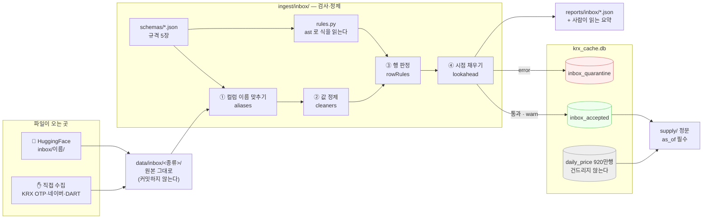
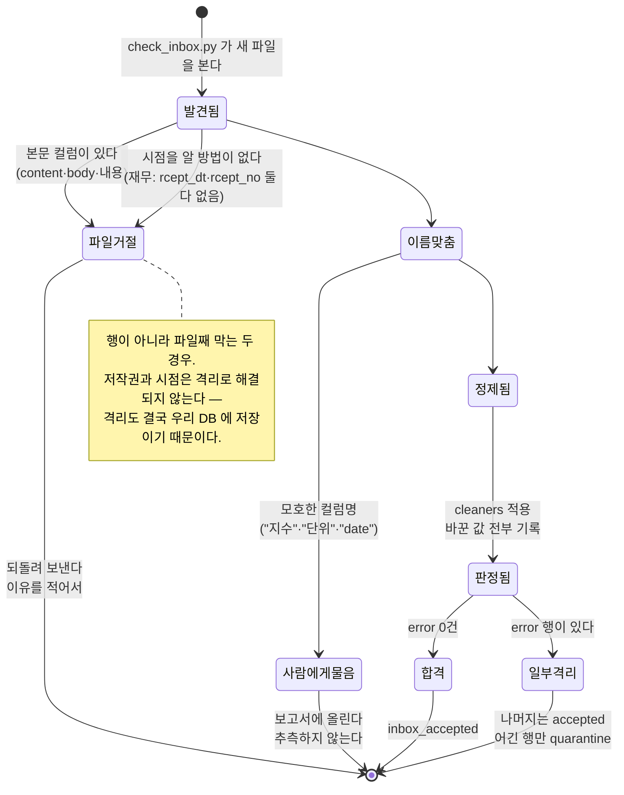
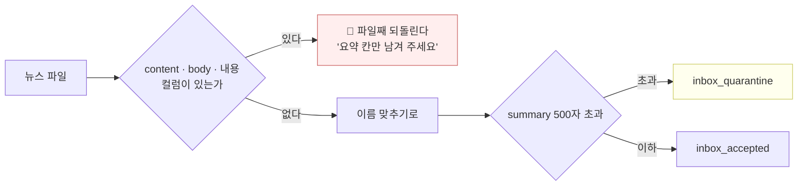
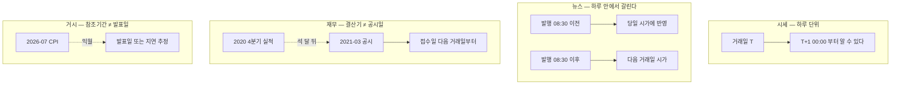
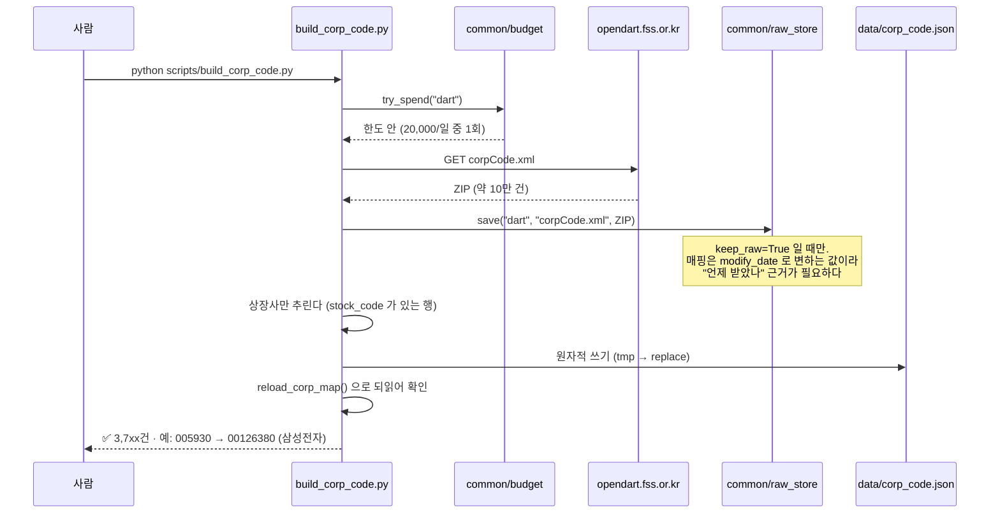
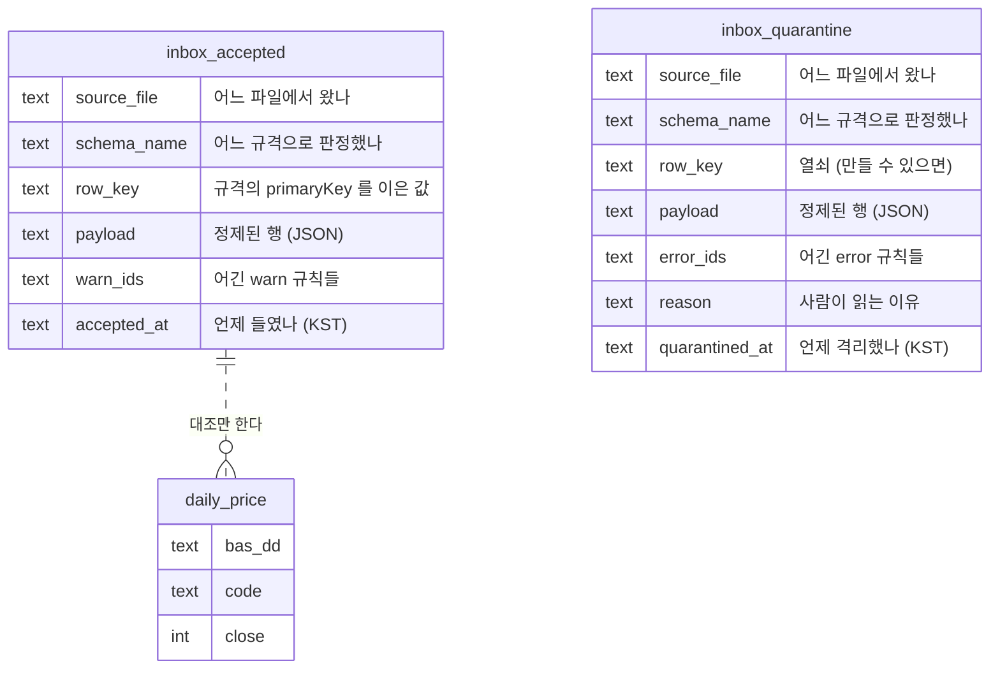

# 기능명세 — 반입 파이프라인 (v1.1)

> **한 줄로**: 팀원이 손으로 모은 파일을 우리 파이프라인에 들이되, **무엇을 무엇으로 바꿨는지
> 전부 기록하고**, 미래를 보는 행은 들이지 않는다.
>
> 이전 버전: [v1.0 기능명세](../version1.0/기능명세.md) · 관련: [반입 규격 README](../../../ingest/inbox/schemas/README.md)

---

## 0. 왜 이것을 만드는가

지금까지 우리 자료는 **우리가 KRX 에서 직접 받은 것**뿐이었습니다. 모양을 우리가 알고,
틀리면 수집기를 고치면 됐습니다.

이제 세 가지가 들어옵니다.

1. **팀원이 손으로 모은 파일** — 엑셀·CSV. 컬럼명이 한글이고 사람마다 다릅니다.
2. **팀장(이동원)이 직접 수집한 것** — 수업에서 배운 KRX OTP·네이버·DART 경로.
3. **아직 우리에게 없는 도메인** — 뉴스·재무·거시.

세 경우 모두 **모양을 우리가 정하지 못합니다.** 그래서 "무엇이 맞는 모양인가"를 먼저
문서로 못박고(규격), 그 규격으로 기계가 판정합니다(엔진).

### 그냥 받아서 쓰면 안 되는 이유

받아서 `pd.read_csv` 로 열고 컬럼명만 바꿔 쓰면 세 가지가 조용히 일어납니다.

| 무슨 일 | 왜 안 보이나 |
|---|---|
| 엑셀이 종목코드 `005930` 을 `5930` 으로 만든다 | 숫자로 보여서 오류가 안 난다. 조인만 조용히 실패한다 |
| 회계 표기 `(1,234)` 를 `1234` 로 읽는다 | 부호가 뒤집혀 **손실이 이익이 된다** |
| 재무 수치를 결산기에 붙인다 | 예외가 안 난다. **성능만 좋아진다** |

셋 중 마지막이 가장 위험합니다. 미래참조는 실패처럼 보이지 않고 **성공처럼 보입니다.**

---

## 1. 유스케이스

```mermaid
flowchart TB
    팀원(["👤 팀원<br/>오준영·강민석·신장환"])
    팀장(["👤 팀장 이동원<br/>데이터 파트"])
    모델(["🤖 모델·피처 계층"])

    subgraph 시스템["반입 파이프라인"]
        UC1["UC-1<br/>자료를 건네준다<br/>HF inbox/"]
        UC2["UC-2<br/>직접 수집한다<br/>KRX·네이버·DART"]
        UC3["UC-3<br/>새 파일이 있는지 본다<br/>세션마다"]
        UC4["UC-4<br/>규격에 맞는지 판정한다"]
        UC5["UC-5<br/>정제한다<br/>바꾼 것을 기록"]
        UC6["UC-6<br/>적재한다<br/>합격 · 격리"]
        UC7["UC-7<br/>판정 보고서를 읽는다"]
        UC8["UC-8<br/>as_of 로 꺼내 쓴다"]
    end

    팀원 --> UC1
    팀원 --> UC7
    팀장 --> UC2
    팀장 --> UC3
    팀장 --> UC7
    모델 --> UC8

    UC3 -.포함.-> UC4
    UC4 -.포함.-> UC5
    UC5 -.포함.-> UC6
    UC6 -.확장.-> UC7
    UC1 -.선행.-> UC3
    UC2 -.선행.-> UC3
    UC6 --> UC8
```



| 번호 | 누가 | 무엇을 | 성공했다는 것은 |
|---|---|---|---|
| UC-1 | 팀원 | HuggingFace `inbox/<이름>/` 에 파일을 올린다 | 팀장이 다음 세션에 그 파일을 본다 |
| UC-2 | 팀장 | 수업에서 배운 경로로 직접 수집한다 | `data/inbox/<종류>/` 에 원본 그대로 놓인다 |
| UC-3 | 팀장 | `python scripts/check_inbox.py` 한 줄 | 새 파일 목록과 판정 결과가 화면에 나온다 |
| UC-4 | 시스템 | 규격의 `rowRules` 로 행마다 판정 | `error` 행과 `warn` 행이 갈린다 |
| UC-5 | 시스템 | `cleaners` 로 값을 고친다 | **무엇을 무엇으로 바꿨는지 전부 기록된다** |
| UC-6 | 시스템 | `inbox_accepted` / `inbox_quarantine` 에 넣는다 | `daily_price` 920만 행은 건드리지 않는다 |
| UC-7 | 팀원·팀장 | `reports/inbox/` 를 읽는다 | 왜 격리됐는지 사람이 이해한다 |
| UC-8 | 모델·피처 | `supply/` 정문으로 꺼낸다 | `as_of` 이후 자료가 섞이지 않는다 |

---

## 2. 전체 흐름



---

## 3. 파일 하나가 겪는 일 — 상태로 보기



---

## 4. 기능 상세

### 4.1 규칙 해석기 — `ingest/inbox/rules.py` · 292줄

규격의 `rowRules[].expr` 을 표 전체에 한꺼번에 적용해 **참=통과** 인 불리언 시리즈를 돌려줍니다.

```python
from ingest.inbox.rules import evaluate_rule
통과여부 = evaluate_rule("high is null or high >= low", 표)
```

#### 🔴 왜 문자열 치환이 아니라 파서인가

처음에는 `and` → `&`, `or` → `|` 로 바꿔 pandas 에 넘겼습니다. 그런데 파이썬에서
**비트 연산자가 비교보다 먼저 묶입니다** — `a | b == 0` 이 `a | (b == 0)` 이 됩니다.

그 상태로 종목 규격을 우리 자료에 돌린 결과:

```
920만 행 중 892만 행이 위반
```

규격이 아니라 옮기는 쪽이 틀린 것이었는데, **숫자만 보고는 어느 쪽이 틀렸는지 알 수 없었습니다.**

`expr` 은 통째로 유효한 파이썬 식입니다(`high is null` 은 `Name('null')` 과의 `is` 비교로
파싱됩니다). 그래서 문법을 새로 만들지 않고 `ast.parse` 로 읽습니다 — 우선순위는
파이썬 파서가 이미 옳게 알고 있으므로 그것을 빌립니다.

**`eval` 은 쓰지 않습니다.** 규격 파일은 사람이 손으로 고치는 것이고, 거기 적힌 문자열을
그대로 실행하면 규격이 코드가 됩니다. 트리를 걸어가며 허용한 연산만 수행하고, 모르는
구문을 만나면 `RuleSyntaxError` 로 세웁니다.

| 허용하는 것 | |
|---|---|
| 비교 | `==` `!=` `<` `<=` `>` `>=` |
| 논리 | `and` `or` `not` |
| 산술 | `+` `-` `*` `/` |
| 결측 | `X is null` · `X is not null` |
| 특수 | `bas_dd is weekday` · `today` · `now` |
| 함수 (10개) | `abs` `len` `year` `month` `day` `date` `time` `starts_with` `contains` `matches` |

### 4.2 반입 규격 5장 — `ingest/inbox/schemas/`

| 규격 | 필드 | 규칙 | 대조할 표 |
|---|---|---|---|
| `ohlcv_stock` | 15 | 7 | `daily_price` (9,209,812행) |
| `ohlcv_index` | 12 | 10 | `index_price` (195,864행) |
| `news` | 11 | 11 | 아직 없음 |
| `financial` | 20 | 10 | 아직 없음 |
| `macro` | 13 | 14 | 아직 없음 |

바탕은 [Frictionless Table Schema](https://specs.frictionlessdata.io/table-schema/) 이고
우리에게만 필요한 것은 `x-alphastack` 아래에 모았습니다. 자세한 것은
[규격 README](../../../ingest/inbox/schemas/README.md) 를 보세요.

### 4.3 🔴 널 가드 — 이 파이프라인에서 가장 많이 틀린 곳

**비교하는 칸이 비어 있을 수 있으면 반드시 `is null` 가드를 답니다.**

```jsonc
{ "expr": "high >= low" }                                    // 틀림
{ "expr": "high is null or low is null or high >= low" }     // 맞음
```

널 비교는 참도 거짓도 아닌데 pandas 에서 **거짓**으로 떨어져 위반이 됩니다.
지수 규격 초안이 이 가드 없이 `high >= low` 를 `error` 로 두어

```
우리 자신의 자료 24,933행(12.73%)을 스스로 격리
```

했습니다. 격리는 "자료가 나쁘다"는 뜻인데 나쁜 것은 규칙이었습니다.

같은 결함이 **이미 머지된 `ohlcv_stock.json`(PR #28)에도** 있었습니다 —
`high >= open and high >= close` 에 `high == 0` 탈출구가 없어 거래정지 종목
**283,468행(3.1%)** 을 격리하고 있었습니다. 실측으로 확인하고 이번에 고쳤습니다.

### 4.4 별칭 불변식 — 한 이름은 한 필드에만

같은 이름이 두 필드의 별칭이면 검사기가 어디로 보낼지 정할 근거가 없습니다.
재무 규격 초안에서 `"당기"` 가 `thstrm_nm`(문자열 `'제 56 기'`)과 `thstrm_amount`(숫자)
양쪽에 있었고, 어디로 가든 뒤에서 조용히 깨지는 상태였습니다.

정할 수 없는 이름은 어느 쪽 별칭에도 넣지 않고 `ambiguousNames` 에 적어
**사람에게 묻는 항목으로 보고**합니다. 추측하지 않습니다.

### 4.5 저작권 — 격리가 아니라 파일 거절



처음에는 `content`·`body`·`내용` 을 `summary` 의 **별칭**에 넣어 두었습니다. 그러면
"본문 칸을 안 만들어서 못 들어온다"는 방어가 **별칭 한 줄로 뚫립니다** — 팀원이 본문을
`content` 컬럼에 담아 오면 자동으로 `summary` 에 매핑되고, 길이 규칙에 걸려 격리되더라도
**격리는 곧 `inbox_quarantine` 에 저장**이라 본문이 우리 DB 에 내려앉습니다.

저작권 방어는 격리가 아니라 반입 거절이어야 합니다.

### 4.6 미래참조 차단 — 도메인마다 다른 시점 기준



| 도메인 | 시점 기준 | 언제부터 |
|---|---|---|
| 시세(종목·지수) | `bas_dd` | 거래일 T → **T+1 0시** |
| 뉴스 | `pub_dt` | 08:30 이전 당일 / 이후 **다음 거래일** |
| 재무 | `rcept_dt` | **접수일 다음 거래일** |
| 거시 | `known_from` | 발표일, 없으면 (출처·주기)별 지연 |

원칙은 하나입니다 — **항상 진실보다 늦은 쪽으로만 틀린다.**
앞당기는 방향이 곧 누설 방향이라, 확실하지 않으면 늦춥니다.

> ⚠️ **거래일 판정을 계산으로 하지 마세요.** `common.trading_calendar.trading_days()` 는
> 주말만 건너뛰고 공휴일을 모릅니다. 실측하면 개발구간 평일 3,042일 중 실제 거래일은
> 2,880일로 **162일(5.3%)이 어긋납니다.** 진짜 거래일 달력은 `daily_price.bas_dd` 실측 집합입니다.

#### 재무 — 열을 가리지 않고 행을 지웁니다

초안은 금액 칸만 가리고 식별 칸은 남기려 했습니다. 그런데 `bsns_year`·`reprt_code` 가
남으면 `as_of` 시점에서 **"이 회사가 보고서를 낼 것이다"라는 제출 사실 자체**를 읽을 수
있고, 미제출·지연 제출은 감사의견 거절·관리종목 지정과 직결되는 강한 신호입니다.

그래서 열을 가리는 대신 **행을 지웁니다.** 행이 없으면 셀 것도 없습니다.

#### 거시 — 지연이 출처마다 다릅니다

팀이 합의한 월 32일·분기 115일은 **한국 공표 관행**에 맞춘 값입니다. 미국은 늦습니다.

| | 월간 | 분기 |
|---|---|---|
| ECOS·KOSIS | 32일 | 115일 |
| **FRED** | **45일** | **130일** |

미 CPI 에 32일을 쓰면 2026년 7월분 `known_from` 이 8월 2일이 되는데 실제 공표는
8월 11~13일이라 **9~11일을 미리 보게 됩니다.**

> ⚠️ **이것은 해결된 문제가 아니라 관리 중인 위험입니다.** FRED 계열마다 공표 일정이
> 다르고 우리는 그 달력을 계열 단위로 확인하지 못했습니다. 45일보다 늦게 나오는 계열이
> 있으면 그만큼 샙니다. `known_from_basis` 칸에 `release`/`estimate` 를 적어 두어,
> 나중에 **추정으로 채운 행만 빼고 다시 돌려 볼 수 있게** 했습니다.

### 4.7 DART 고유번호 매핑 — `scripts/build_corp_code.py` · 199줄

DART 는 회사를 6자리 종목코드가 아니라 **8자리 고유번호**로만 받습니다.



**왜 이 파일이 없었나.** `ingest/clients/dart_data.py:459` 가 매핑을 못 찾으면
*"`python scripts/build_corp_code.py` 로 만들 수 있습니다"* 라고 안내해 왔는데,
정작 그 스크립트가 없었습니다. 안내를 따라간 사람이 막다른 길에 도달했습니다.
실질 로직(`fetch_corp_code_rows`)은 이미 있었고 **JSON 으로 쓰는 래퍼만** 없었습니다.

만드는 것:

| 파일 | 담기는 것 |
|---|---|
| `data/corp_code.json` | 상장사만 — `dart_data` 가 읽는 파일 |
| `data/corp_code_all.json` | 전체 법인 — 비상장 모회사를 볼 일이 생길 때 |

---

## 5. 적재 — 기존 표를 건드리지 않습니다



`user_version` 을 **4 → 5** 로 올립니다. `daily_price` 920만 행은 건드리지 않습니다.

### ⚠️ "격리 테이블을 만들지 않는다"고 하지 않았나

[데이터파트 명세서 v2.1 §6](../../데이터파트/version2.1/명세서.md) 이 격리 테이블을 만들지
않는 이유를 적어 두었습니다. **어긋나지 않습니다 — 대상이 다릅니다.**

| | v2.1 §6 이 거부한 것 | 여기서 만드는 것 |
|---|---|---|
| 대상 | **우리가 KRX 에서 받은** 시세 | **팀원이 건네준** 외부 파일 |
| 왜 안 되나 | 거래정지행을 빼면 재개일 468행의 등락률 기준이 사라져 "설명 안 됨 0건"이 스스로 깨진다 | — |
| 왜 되나 | — | 출처를 우리가 통제하지 못한다. 어긴 행을 **보관해야 보낸 사람이 왜 거절됐는지 본다** |
| 크기 | 12,962행 · 1,002종목(27.2%) | 팀원 파일에서 어긴 행만 |

즉 §6 은 "**우리 자료**를 격리하지 않는다"이고, 여기는 "**남의 자료**를 들이기 전에
어긴 행을 따로 둔다"입니다. 우리 자료 쪽 원칙은 그대로 지킵니다 — 그 증거가
[§4.3 의 283,468행](#43--널-가드--이-파이프라인에서-가장-많이-틀린-곳)입니다.
자기 규칙에 자기 자료가 걸리면 **규칙을 고칩니다.**

---

## 6. 검사 — 통과만 보고는 믿지 않습니다

| 파일 | 무엇을 보나 | 개수 |
|---|---|---|
| `tests/test_inbox_schemas.py` | 규격 자체가 성한가 | 34 |
| `tests/test_inbox_rules_engine.py` | 해석기가 **실제로 잡는가** | 16 |

### 규격을 검사합니다

1. **문법** — 모든 `expr` 이 파싱되고 허용한 함수·이름만 쓰는가
2. **널 가드** — 필수가 아닌 칸을 비교할 때 가드가 있는가
3. **별칭 불변식** — 한 이름이 두 필드의 별칭이 아닌가
4. **자가 격리** — `error` 규칙이 **우리 자신의 자료를 한 행도 격리하지 않는가**

4번이 핵심입니다. 팀원 파일을 받기 전에 여기서 먼저 압니다.

### 일부러 버그를 주입합니다

통과만 보고는 검사가 도는지 알 수 없습니다. 그래서 반대로 **틀린 행을 만들어 넣고
잡히는지** 봅니다.

이 시험이 실제로 잡은 것:

| 무엇 | 어떻게 드러났나 |
|---|---|
| `starts_with(rcept_no, rcept_dt)` 가 아예 못 돈다 | 두 칸을 맞대는 형태를 해석기가 거부했다. **규격에는 멀쩡히 적혀 있어서 검사가 도는 줄 알았지만 안 돌고 있었다** |
| 뉴스 00:00 구멍 | 가드 없는 식에 0시 기사를 넣으니 그대로 통과했다 |
| 우선순위 뒤바뀜 | 문자열 치환 식에 널을 넣으니 위반이 됐다 |

규격 `note` 에 *"우리 자료에는 0건이라 한 번도 참이 된 적이 없다"* 고 적어 둔 가지들
(0 나눗셈 가드 같은 것)은 **여기서만 검증됩니다.**

---

## 7. 아직 안 만든 것

| 무엇 | 언제 |
|---|---|
| `scripts/check_inbox.py` — 세션마다 새 파일 확인 + 자동 적재 | PR② |
| `inbox_accepted` · `inbox_quarantine` 표 (`user_version` 4→5) | PR② |
| `cleaners` 실제 구현 (지금은 이름만 정해져 있다) | PR② |
| `reports/inbox/` 판정 보고서 | PR② |
| 뉴스·재무·거시 적재 표 | 각 도메인 수집이 시작될 때 |
| `budget.LIMITS` 에 `ecos`·`fred`·`kosis` | 그 출처를 쓸 때 (지금 부르면 터진다) |

---

## 8. 용어

| 말 | 뜻 |
|---|---|
| **반입(inbox)** | 우리가 만들지 않은 파일을 우리 파이프라인에 들이는 일 |
| **규격(schema)** | 무엇이 맞는 모양인가를 적은 JSON |
| **정제(cleaner)** | 값을 우리 형식으로 고치는 일. 고친 것을 전부 기록한다 |
| **판정(rowRule)** | 행 하나가 쓸 수 있는가를 보는 식 |
| **격리(quarantine)** | 규격을 어긴 행을 따로 두는 일. 버리는 것이 아니다 |
| **널 가드** | 비교 앞에 붙이는 `X is null or` |
| **미래참조(lookahead)** | 그 시점에 몰랐을 값을 쓰는 것. 예외가 안 나고 성능만 좋아진다 |
| **`as_of`** | "이 날짜 기준으로 알 수 있던 것만" — `supply/` 정문에서만 강제된다 |
