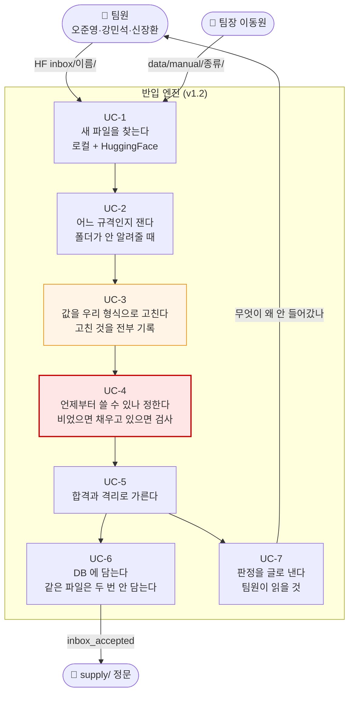
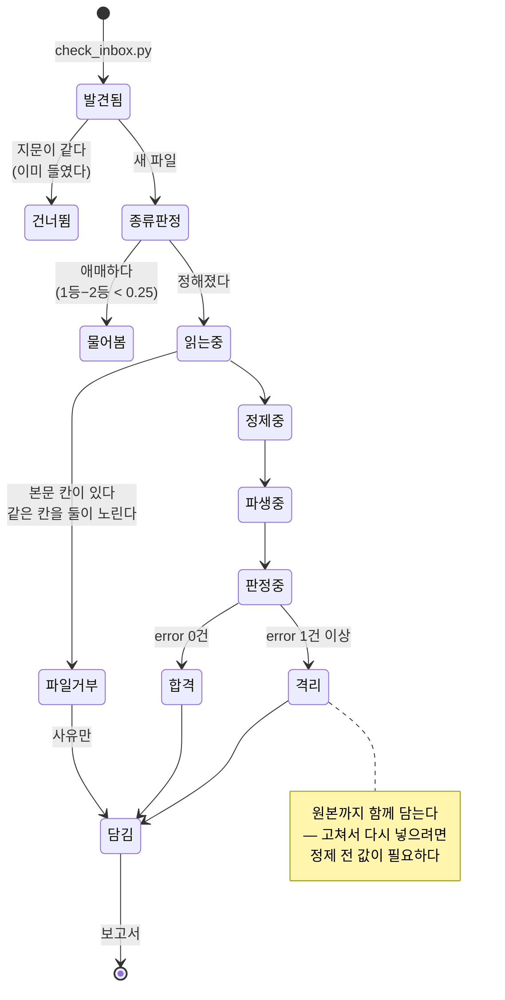
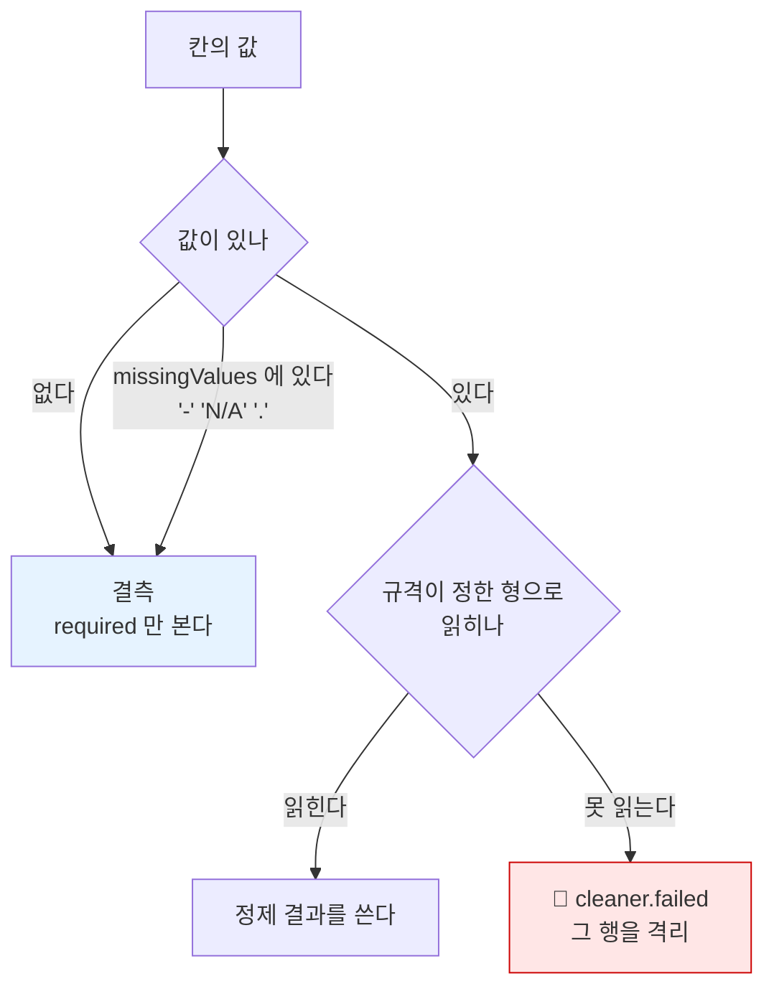
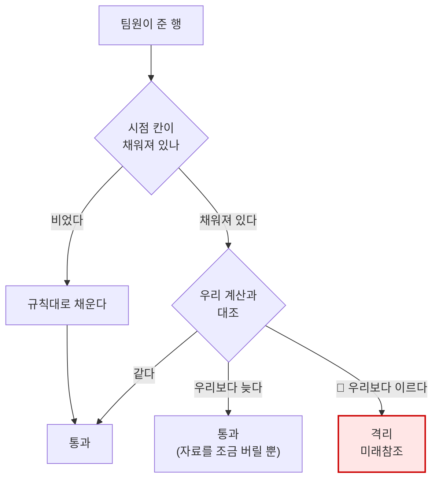
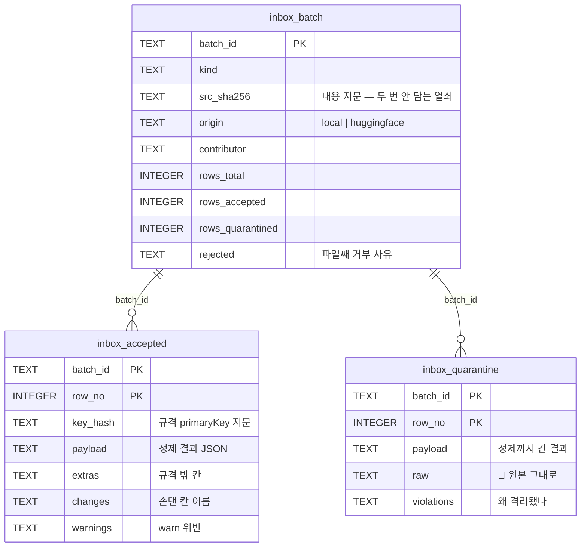

# 기능명세 — 반입 엔진 (v1.2)

> **한 줄로**: v1.1 이 세운 규격을 **실제로 집행하는 기계**. 정제기 20종을 구현하고, 시점을
> 파생해 미래참조를 잡고, 판정을 DB 에 담고, 팀원이 읽을 보고서를 낸다.
>
> 이전 버전: [v1.1 반입 파이프라인](../version1.1/반입_파이프라인.md) ·
> 관련: [반입 규격 README](../../../ingest/inbox/schemas/README.md) ·
> [노트북](../../../notebooks/02-품질·전처리/02.반입엔진을돌리다.ipynb)

---

## 0. v1.1 에서 무엇이 달라졌나

v1.1 은 **무엇이 맞는 모양인가**를 적었습니다. 규칙 52개, 별칭 459개, 정제기 이름 20개.
그런데 정제기는 **이름만** 있었고, 판정 결과를 담을 곳도 보고할 방법도 없었습니다.

| | v1.1 (PR #32) | v1.2 (이번) |
|---|---|---|
| 규격 | 5장 · 규칙 52 · 별칭 459 | 그대로 (+ 종목코드 패턴 수정) |
| 정제기 | **이름만** 20개 | **구현** 20종 + 변경 기록 |
| 시점 파생 | 규격에 규칙만 적힘 | `eff_dd`·`known_from` **계산 + 대조** |
| 거래일 달력 | 없음 (주말만 아는 함수) | `daily_price.bas_dd` **실측 4,097일** |
| 적재 | 없음 | `inbox_batch`·`inbox_accepted`·`inbox_quarantine` (v5) |
| 보고 | 없음 | `reports/inbox/` JSON + 사람이 읽는 마크다운 |
| 세션 진입점 | 없음 | `scripts/check_inbox.py` |

그리고 v1.1 규격을 **우리 자료에 왕복시켜 결함 하나를 찾았습니다** (→ 6절).

---

## 1. 유스케이스



`UC-4` 를 붉게 칠한 이유: **값이 틀린 파일은 규칙에 걸리지만 시점이 틀린 파일은 아무 데도
걸리지 않습니다.** 형식도 맞고 규칙도 통과하고 성능만 좋아집니다.

---

## 2. 여덟 단계 — 순서에 뜻이 있다


두 자리가 왜 거기 있는지가 이 설계의 전부입니다.

| 왜 | 안 그러면 |
|---|---|
| **③ 이 ④ 앞** | `"-"` 를 결측으로 안 보고 `to_int` 에 넘기면 *변환 실패*로 세어져 그 행이 격리된다. 출처가 결측을 그렇게 적었을 뿐인데 |
| **⑤ 가 ⑥ 앞** | 거시의 `known_from` 은 required 인데 **우리가 채워 주는 칸**이다. 채우기 전에 required 를 재면 멀쩡한 파일이 통째로 떨어진다 |

① 이 "전부 문자열로" 인 이유도 같습니다. `"005930"` 을 정수로 읽으면 그 순간 앞자리 0 이
사라져 **되살릴 방법이 없습니다.**

---

## 3. 파일 하나가 겪는 일



**파일째 거부**와 **행 격리**를 나눈 이유: 뉴스 본문 칸이 있는 파일은 행을 골라 봐야
소용이 없습니다. 행 격리는 그 행만 못 믿는 경우이고, 나머지는 들입니다.

---

## 4. 기능 상세

### 4.1 정제기 20종 — `ingest/inbox/cleaners.py`

| 갈래 | 정제기 |
|---|---|
| 문자열 | `strip` `collapse_space` `upper` `strip_comma` `strip_percent` `paren_to_negative` `zfill6` `zfill8` `drop_suffix_ks_kq` |
| 숫자 | `to_int` `to_float` |
| 날짜·시각 | `to_yyyymmdd` `to_kst_iso` `rfc1123_to_kst` |
| 텍스트 | `strip_html_tags` `unescape_html` `drop_tracking_params` |
| 값 맞추기 | `map_market` `map_freq` `map_source` |

**순서가 뜻을 갖습니다.** `["strip", "strip_comma", "to_int"]` 를 뒤집으면
`to_int("1,234")` 가 실패합니다.

몇 가지는 **하지 않는 일**이 더 중요합니다.

| 정제기 | 하지 않는 것 | 왜 |
|---|---|---|
| `strip_percent` | 100 으로 나누지 않는다 | `change_rate` 는 퍼센트 숫자 그대로다. 나누면 규격의 `minimum=-100` 과 어긋난다 |
| `strip_comma` | 유럽식 소수점 쉼표를 다루지 않는다 | `"1,234"` 가 천이백삼십사인지 일점이삼사인지 값만 보고 못 정한다 |
| `zfill6` | 숫자가 아니면 채우지 않는다 | ISIN `KR7005930003` 에 0 을 붙이면 없던 코드가 생긴다 |
| `to_int` | 소수부를 버리지 않는다 | 거래량에 소수가 붙어 왔다면 고칠 값이 아니라 **볼 값**이다 → 실패로 남긴다 |
| `map_*` | 모르는 값을 끼워 맞추지 않는다 | 모르는 값이 왔다는 사실 자체가 정보다. `enum` 검사가 잡게 둔다 |

### 4.2 🔴 무엇을 무엇으로 바꿨는지 기록한다

**기록 없는 정제는 정제가 아니라 훼손입니다.** 값이 이상할 때 *출처가 그랬는지 우리가
그랬는지* 알 방법이 없어집니다.

상세도는 [Great Expectations](https://greatexpectations.io) 의 기본 결과 형식(`SUMMARY`)을
따랐습니다.

| 무엇 | 얼마나 |
|---|---|
| 적용·변경·실패 **건수** | **전량** — 반올림하지 않는다 |
| before → after **실물** | **20건까지** (GX 의 `partial_unexpected_list` 기본값) |
| 행마다 남기는 것 | **손댄 칸 이름만** — 값은 위 표본에서 본다 |

전량 기록을 안 쓰는 이유는 팀원이 몇십만 행을 주면 기록이 원본보다 커지기 때문이고,
건수만 안 쓰는 이유는 *"318건 변경"* 이 `zfill6` 때문인지 엉뚱한 절단 때문인지 알 수
없기 때문입니다.

**그릇만 바뀐 것은 변경으로 세지 않습니다.** `"1234"` → `1234` 를 변경으로 세면 숫자 칸은
거의 모든 행이 변경이 되고, 표본 20칸이 `1234 → 1234` 로 다 차서 정작 봐야 할
`"1.5" → <NA>` 가 밀려납니다.

### 4.3 실패를 결측과 구별한다



`to_int("일이삼")` 을 그냥 NaN 으로 두면 그 행은 *"거래량이 비어 있는 행"* 이 되어 조용히
통과합니다. 값이 **있었는데** 못 읽은 것은 그 행을 믿을 수 없다는 뜻입니다.

### 4.4 🔴 시점 파생 — `ingest/inbox/derive.py`

비었으면 채우고, 채워져 있으면 검사합니다. **채워 온 값을 그대로 믿지 않습니다.**



**대조의 방향이 한쪽뿐**입니다. 늦게 잡은 것은 자료를 조금 버릴 뿐이지만, 이르게 잡은 것은
성능을 부풀립니다. 틀리더라도 **언제나 늦는 쪽으로만** 틀리게 둡니다.

#### 뉴스 `eff_dd` — 그 기사를 처음 쓸 수 있는 거래일

| 발행 시각 | 유효 거래일 | 왜 |
|---|---|---|
| 08:30 **미만** | 그날 | 시가 단일가 호가가 08:30 부터 쌓인다 |
| 08:30 **이상** | 다음 거래일 | 장중·장마감 후 기사가 여기로 모인다 |
| 비거래일 | 이후 첫 거래일 | 주말·공휴일 |
| 정확히 `00:00:00` | 다음 거래일 | 날짜만 있는 자료 — 모르는 쪽을 늦게 잡는다 |

#### 거시 `known_from` — 그 통계를 처음 알 수 있었던 날

`release_date` 가 있으면 그것(`basis=release`), 없으면
`period_start + delayFromPeriodStart[출처][주기]`(`basis=estimate`).

🔴 **지연이 출처마다 다릅니다.** 미 CPI 는 익월 11~13일에 나오는데 한국 관행(익월 2일)에
맞춘 32일을 쓰면 **9~11일을 미리 봅니다.**

| 출처 | 월 | 분기 |
|---|---:|---:|
| ECOS·KOSIS | 32일 | 115일 |
| FRED | **45일** | **130일** |

지연을 `period_end` 가 아니라 **`period_start` 에 더합니다.** `period_end` 에 더하면 한 달을
통째로 더 기다려, 누설은 없지만 쓸 수 있는 자료를 버립니다.

`known_from_basis` 는 **우리 판정을 씁니다.** 추정치에 `"release"` 라고 적어 오면 그 자료가
실제보다 믿을 만해 보이기 때문입니다.

**시세와 재무는 파생하지 않습니다.** 시세는 규격이 `enforcedAt: "supply 계층"` 이라고 못
박았고 실제로 `supply/clock.py` 의 `known_at()` 하나가 종목·지수를 함께 자릅니다. 여기서 또
계산하면 같은 규칙이 두 군데 살게 되고, 두 군데는 언젠가 어긋납니다. 재무의 시점 보정은
DART 를 다시 불러야 하는데 **반입 검사기가 네트워크를 타면 안 됩니다** — 팀원 파일을 검사하는
일이 하루 한도를 태웁니다.

### 4.5 🔴 거래일 달력 — 계산이 아니라 기록

`common/trading_calendar.py` 에 더했습니다.

| 함수 | 하는 일 |
|---|---|
| `load_session_days()` | `daily_price.bas_dd` 실측 집합 (**4,097일**, 20100104~20260825) |
| `is_session(날짜)` | 그 날이 거래일이었나 |
| `next_session(날짜)` | 그 날 이후 첫 거래일 |

기존 `trading_days()` 는 **주말만 건너뜁니다.** 개발구간에서 재 보면 평일 3,042일 중 실제
거래일은 2,880일이라 **162일(5.3%)이 어긋납니다.** 그 162일은 명절·공휴일이고, 하필 실적
발표와 뉴스가 몰리는 연휴 전후입니다.

```
2021-01-01 은 금요일이다 — 주말 규칙은 이 날을 거래일로 본다
next_session("20210101") = "20210104"   ← 실측 달력은 신정을 안다
```

**달력 밖을 물으면 답을 지어내지 않고 세웁니다.** 범위 밖에 `False` 를 주면 부르는 쪽이
*"휴장이었구나"* 로 읽는데, 휴장인 것과 우리가 아직 안 받은 것은 전혀 다른 사실입니다.

기존 `trading_days()` 는 지우지 않았습니다. 그쪽은 *"받아 볼 후보 날짜"* 를 고르는 용도라
주말만 걸러도 맞습니다(휴장이면 0건으로 돌아오고 그 사실이 대장에 남습니다).

### 4.6 어느 규격인가 — 폴더가 안 알려 줄 때

| 어디 | 경로 | 종류를 어떻게 아나 |
|---|---|---|
| 로컬 (팀원) | `data/inbox/<종류>/` | **폴더 이름이 알려 준다** |
| 로컬 (직접 받은 것) | `data/manual/<종류>/` | 같음. `contributor` 에 `직접수집` 이 남는다 |
| HuggingFace | `inbox/<이름>/` | 종류 폴더가 없다 → **규격 5장에 대 보고 잰다** |

파일 이름으로 찍지 않습니다 — `2026-08-31_거래대금상위.csv` 가 종목인지 지수인지 이름만
봐서는 모릅니다. 규격마다 `required` 를 얼마나 덮는지(75%)와 전체 칸 매핑률(25%)로 점수를
내고, **1등이 2등보다 0.25 이상 앞설 때만** 정합니다.

```
시세 → ohlcv_stock   0.98 · ohlcv_index 0.56 · financial 0.02
뉴스 → news          1.00 · financial 0.00 · macro 0.00
거시 → macro         0.98 · news 0.02 · financial 0.00
모르는 파일 → None (사람에게 묻는다)
```

**애매하면 정하지 않습니다.** 틀린 규격으로 검사하면 멀쩡한 파일이 통째로 격리되고, 팀원은
자기 자료가 잘못됐다고 오해합니다.

---

## 5. 적재 — `user_version` 4 → 5

### 5.1 표 셋



### 5.2 왜 JSON payload 인가

규격 5장의 칸이 서로 겹치지 않습니다(11~20칸, 이름이 같아도 뜻이 다릅니다 — `name` 은
종목명이지만 지수 파일에서는 지수명일 수 있습니다). 다 펴면 **71칸에 대부분이 NULL** 이 되고,
종류를 하나 더 받을 때마다 마이그레이션이 붙습니다.

[Airbyte Destinations V2 의 raw table](https://docs.airbyte.com/using-airbyte/core-concepts/typing-deduping)
이 같은 모양입니다 — `_airbyte_raw_id` · `_airbyte_data`(JSON) · `_airbyte_meta`(JSON).
거기서도 `_airbyte_meta.changes` 가 *"어느 칸을 왜 고쳤나"* 를 배열로 담습니다.

조회는 `json_extract(payload, '$.code')` 로 합니다.

### 5.3 마이그레이션 번호를 밀었다

`migrations.py` 는 v5=공시, v6=거시로 **예약**돼 있었는데, 실제로 먼저 온 것이 반입이라
한 칸씩 밀었습니다.

| 번호 | 무엇 | 상태 |
|---|---|---|
| v5 | **반입** (`inbox_batch`·`inbox_accepted`·`inbox_quarantine`) | 적용됨 |
| v6 | 공시 시점정합 | 예약 |
| v7 | 거시 통계 | 예약 |

밀 수 있었던 이유는 **그 번호를 적용한 DB 가 아직 없었기 때문**입니다. 예약은 자리를 비워
둔 것이지 배포된 것이 아닙니다. **이미 배포된 항목은 이렇게 못 밉니다** — `MIGRATIONS` 가
이름이 아니라 인덱스로 돌아서, 이미 v5 를 지난 DB 는 나중에 v5 자리에 들어온 항목을 영원히
건너뜁니다.

### 5.4 🔴 `daily_price` 는 건드리지 않는다

920만 행은 우리가 16년치를 받아 쌓은 것이고 반입은 남이 준 자료입니다. 한 표에 섞으면
*"이 값은 누가 어디서 가져왔나"* 를 되짚을 수 없습니다. 합격분을 우리 시세와 맞대 보는
일(규격의 `target.compareWith`)은 **적재 뒤에 따로** 합니다.

### 5.5 같은 파일을 두 번 담지 않는다

판단은 **내용 지문(SHA-256)** 입니다. 이름은 팀원이 바꿔 올리고, 수정 시각은 내려받을 때마다
새로 찍힙니다. `--force` 로 다시 검사할 수 있고, 그때 판정이 어떻게 달라졌는지가 곧 규격
개정의 근거입니다. 그래서 `src_sha256` 에 UNIQUE 를 걸지 않고 인덱스만 뒀습니다.

---

## 6. 🔴 우리 자료를 왕복시켜 결함을 찾았다

팀원 파일로만 시험하면 **검사기가 전부 격리해도 "안전하게" 보입니다.** 우리가 이미 갖고
있는 자료를 거부한다면, 팀원 자료도 같은 이유로 거부합니다.

`daily_price` 에서 무작위로 뽑아 팀원이 줄 법한 모양으로 내보낸 뒤 다시 들였습니다.

| 규격 | 표본 | 격리 | 사유 |
|---|---:|---:|---|
| v1.1 | 120,000행 | **421 (0.351%)** | `code.pattern` |
| v1.2 | 120,000행 | **0** | — |

### 종목코드가 여섯 자리 숫자가 아니었다

전체 구간에서 **56,190행(0.61%) · 84종**이 `^[0-9]{6}$` 에 걸리고 있었습니다. 값을 열어 보니
전부 실재하는 정상 종목이었습니다.

| 자리 | 실측 | 예 |
|---|---:|---|
| 1~4번째에 영문 | **0종** | — |
| 5번째에 영문 | 57종 | `0004Y0` 디비금융제14호스팩 · `0007C0` 아크릴 |
| 6번째에 영문 | 28종 | `00781K` 코리아써키트2우B · `08537M` 루트로닉3우C · `00341A` 쌍용양회4우B |

KRX 가 여섯 자리를 다 써서 **영문을 섞기 시작한 것**입니다. 신형우선주(2우B·3우C)는 끝자리가,
최근 상장·스팩은 다섯째 자리가 영문입니다. 길이는 3,677종 전부 6이었습니다.

→ `^[0-9]{6}$` **→ `^[0-9]{4}[0-9A-Z]{2}$`** (규격 3장: 종목·뉴스·재무)

**왜 `^[0-9A-Z]{6}$` 로 다 열지 않았나.** `pykrx`·`FinanceDataReader` 같은 라이브러리는
종목코드에 정규식을 **아예 걸지 않습니다** — KRX 가 주는 문자열을 그대로 씁니다. 그 관행대로면
패턴을 지우는 게 맞지만, 반입은 **남의 파일을 받는 자리**라 오타는 잡아야 합니다. 그래서
관행만큼 느슨하되 **실측이 보장하는 만큼만** 조였습니다.

`cleaners` 에 `upper` 도 더했습니다(`strip → upper → drop_suffix_ks_kq → zfill6`). 팀원이
`00781k` 로 적어 오면 v1.1 에서는 격리됐는데, KRX 원본이 전부 대문자라 올려도 잃는 정보가
없습니다.

### 경고는 격리가 아니다

| 규칙 | 12만 행 표본 | 판정 |
|---|---:|---|
| `zero_ohlc` | 3,259 (2.72%) | `warn` — 거래정지 종목이라 정상 |
| `zero_ohlc_but_traded` | 1 (0.001%) | `warn` |

`zero_ohlc` 를 `error` 로 두면 멀쩡한 자료 2.7% 가 통째로 격리됩니다.

---

## 7. 검사 — 일부러 틀린 것을 넣어 본다

| 파일 | 무엇을 보나 | 개수 |
|---|---|---:|
| `test_inbox_cleaners.py` | 정제기 20종이 무엇을 바꾸고 **무엇을 안 바꾸는지** | 39 |
| `test_inbox_derive.py` | 배정 규칙 5가지 · 지연표 · **미래참조 주입** | 22 |
| `test_inbox_engine.py` | 매핑·제약·규칙·가르기 · **우선주 코드** | 37 |
| `test_inbox_store.py` | 적재·되읽기·중복·보고서 | 19 |

두 방향을 함께 잽니다.

- **막는가** — 미래참조를 심고 잡히는지 (뉴스 `eff_dd`, 거시 `known_from` 둘 다)
- 🔴 **멀쩡한 것을 막지는 않는가** — 이쪽이 더 중요합니다. 검사기는 전부 격리해도 "안전하게"
  보이고, 그 상태로 배포되면 팀원 자료가 통째로 사라진 채 아무 예외도 안 납니다

특히 `test_영문이_섞인_종목코드도_통과한다` 는 6절에서 찾은 결함을 못박은 것입니다.

---

## 8. 아직 안 한 것

| 무엇 | 왜 / 언제 |
|---|---|
| `financial` 규격 **왕복 시험** | DART 재무제표를 아직 안 받았다 (3차로 미뤘다). 단위 시험은 있지만 실제 파일 왕복은 없다 |
| 합격분을 `daily_price` 와 **대조** | 규격의 `target.compareWith`. 적재까지가 이번 몫이고 대조는 다음 |
| `ingest/clients/dart_data.py` · `yf_data.py` 의 `^\d{6}$` | 같은 종목코드 가정이 아직 남아 있다. 이번 PR 범위 밖 |
| FRED 계열별 **실제 공표 일정** | 월 45일·분기 130일은 관행에 여유를 얹은 **추정**이다. 계열마다 다르다 |
| HuggingFace `inbox/` 실제 파일 | 지금 비어 있다 — 팀원이 아직 올린 것이 없다 |
| `budget.LIMITS` 에 `ecos`·`fred`·`kosis` | 그 출처를 쓸 때 (지금 부르면 터진다) |

---

## 9. 쓰는 법

```bash
python scripts/check_inbox.py            # 로컬 + HuggingFace 를 훑고 새 것만 들인다
python scripts/check_inbox.py --dry-run  # 검사만 하고 DB 에는 안 담는다
python scripts/check_inbox.py --local-only
python scripts/check_inbox.py --force    # 규격을 고친 뒤 다시 검사한다
python scripts/check_inbox.py --path 어떤.csv --kind ohlcv_stock
```

```python
from ingest.inbox.engine import inspect_file
from ingest.inbox.store import load_result

result = inspect_file("data/inbox/ohlcv_stock/시세.csv", kind="ohlcv_stock")
result.accepted       # 합격한 행
result.quarantined    # 격리된 행 + 사유 + 원본
batch_id = load_result(result, path)
```

---

## 10. 용어 (v1.1 에 더해)

| 말 | 뜻 |
|---|---|
| **묶음(batch)** | 파일 하나를 검사한 한 번. `batch_id` = `<끝난시각>-<지문 앞 12자>` |
| **파생(derive)** | 시점 칸을 규칙대로 계산하는 일. 비었으면 채우고 있으면 검사한다 |
| **거래일 달력** | `daily_price.bas_dd` 실측 집합. 계산이 아니라 기록이다 |
| **그릇만 바뀜** | `"1234"` → `1234`. 값이 아니라 담는 형이 바뀐 것 — 변경으로 세지 않는다 |
| **파일째 거부** | 행을 골라 봐야 소용없는 문제. 뉴스 본문 칸 등 |
