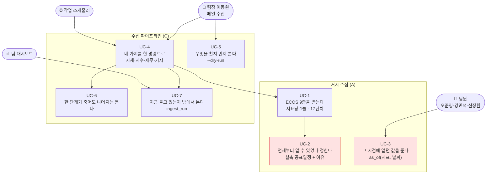
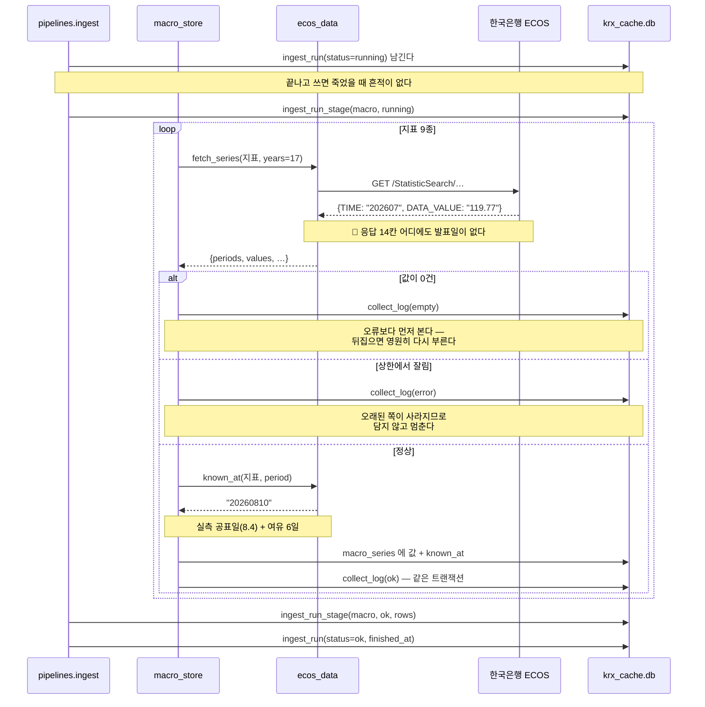
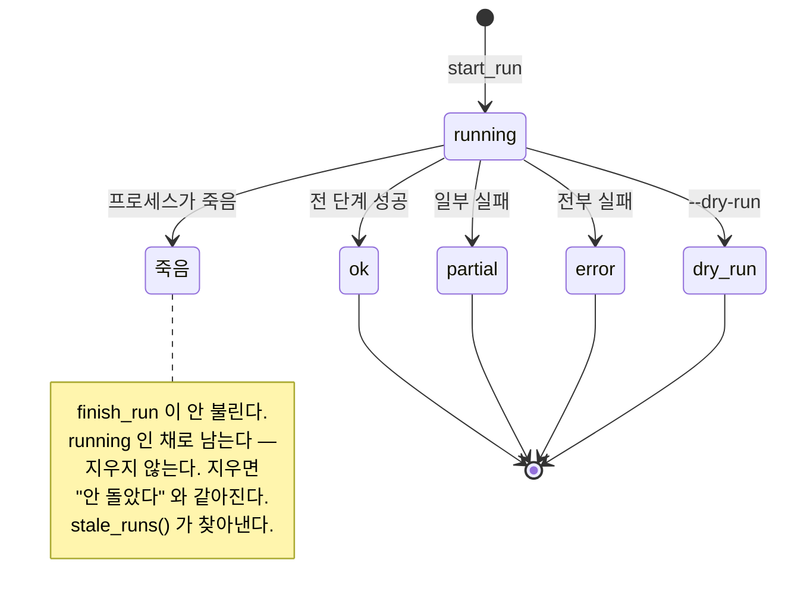

# 기능명세 — 거시 수집과 수집 파이프라인 (v1.3)

> **한 줄로**: 거시지표를 **기준월이 아니라 알게 된 날**로 담고, 흩어져 있던 수집 네 가지를
> **한 명령**으로 묶는다. 그리고 그 실행이 지금 돌고 있는지 밖에서 볼 수 있게 한다.
>
> 이전 버전: [v1.2 반입 엔진](../version1.2/반입_엔진.md) ·
> 관련: [노트북](../../../notebooks/01-데이터수집/04.거시를시점으로담다.ipynb) ·
> [ECOS 연동](../../../ingest/clients/ecos_data.py) ·
> [거시 저장](../../../ingest/store/macro_store.py) ·
> [파이프라인](../../../pipelines/ingest.py)

---

## 0. 무엇이 달라졌나

| | 이전 | v1.3 (이번) |
|---|---|---|
| 거시지표 | ECOS 연동 코드만 있고 **담을 곳이 없었다** | `macro_series` 표 (v7) · **17,851행** |
| 거시 시점 | 없음 | `known_at` — 실측 공표일정 + 안전 여유 |
| 수집 명령 | `fetch_krx` · `fetch_index` · `fetch_dart` **따로** | `python -m pipelines.ingest` **하나** |
| 실행 기록 | 없음 (대상별 `collect_log` 만) | `ingest_run` · `ingest_run_stage` (v8) |
| 죽은 실행 감지 | 불가능 | `stale_runs()` |

---

## 1. 왜 필요한가 — 가장 조용한 오류

> **"7월 물가를 7월 1일에 알 수 있었나?"**

없습니다. 실제 발표는 **8월 4일**입니다. 그런데 한국은행 ECOS 는 7월 물가를
`2026-07-01` 이라는 날짜에 얹어서 줍니다.

그대로 붙이면 **34일치 미래**가 학습에 들어갑니다. 경기지수는 7월분이 8월 31일에
나오므로 **61일**입니다. 그리고 이 오류는 **예외를 내지 않고 성능만 올립니다.**

재무에서 이미 같은 문제를 겪었습니다 — `bsns_year` 는 결산기이지 세상이 알게 된 날이
아니어서, `rcept_dt`(접수일)를 따로 받아 붙였습니다. 거시도 같은 구조인데
**출처가 그 날짜를 주지 않는다**는 점만 다릅니다.

---

## 2. 유스케이스



붉은 칸이 **이 작업의 핵심**입니다. 나머지는 그것을 나르는 관입니다.

---

## 3. 처리 흐름 — 값 하나가 담기기까지



---

## 4. `known_at` 은 어떻게 정하나

### 4.1 근거 — 실측 공표일정

2026-09-02 에 공식 출처에서 조사했습니다.

| 지표 | 공표 주체 | 공표 시점 | 2026년 7월분 |
|---|---|---|---|
| 소비자물가 | 국가데이터처 | 익월 초 (2~6일) | **8.4 (화)** |
| 생산자물가 | 한국은행 | 익월 하순 (18~24일) | **8.21 (금) 06:00** |
| 경기 선행·동행 | 국가데이터처 | 익월 말 (29~31일) | **8.31 (월)** |
| 기준금리 | 금통위 | 결정 당일 즉시 | — |
| 국고채·환율 | 한국은행 | 당일~익영업일 | — |

**여유가 필요한 직접적 이유**: 오늘(9/2) 8월 소비자물가가 발표됐는데 ECOS 최신은
아직 `202607` 이었습니다. **보도자료보다 ECOS 반영이 늦습니다.**

### 4.2 규칙

업계 표준(point-in-time 관행)도 같은 처방입니다 — 정확한 공표일을 모르면
*"즉시 이용 가능"* 을 가정하지 말고 **보수적 시차를 적용**하라.

| 지표 | `known_at` | 여유를 두는 이유 |
|---|---|---|
| `ktb3y` · `ktb10y` · `usdkrw` · `jpykrw` | 기준일 **+1일** | 국고채가 익영업일 반영 |
| `base_rate` | 익월 **1일** | 월별 시계열이라 월중 시점 불명 |
| `cpi` | 익월 **10일** | 주말 밀림 + ECOS 반영 지연 |
| `ppi` | 익월 **말일** | 공표일 변동폭이 일주일 |
| `leading` · `coincident` | 익익월 **5일** | 월말 발표라 달을 넘김 |

정의: [`ecos_data.RELEASE_RULES`](../../../ingest/clients/ecos_data.py)

### 4.3 검증 — 실제 공표일과 대조

**항등식이 되지 않게** 조사한 실제 공표일 20건을 코드 밖에 박아 두고 맞댑니다.

```
실제보다 앞서는 항목: 0건        (전부 4~12일 늦다)
막은 미래: base_rate 31일 · cpi 40일 · ppi 61일 · 경기 66일
```

시험: [`tests/test_ecos_known_at.py`](../../../tests/test_ecos_known_at.py)

---

## 5. 쓰는 법 — `period` 가 아니라 `known_at` 으로 거른다

```python
from ingest.store import macro_store

macro_store.as_of("cpi", "20260715")
# → {'period': '202606', 'value': 119.99, 'known_at': '20260710'}
#    202607 이 아니다. 7월 15일에는 아직 7월 물가를 몰랐다.
```

이 한 줄이 이 작업의 결과물입니다. 기준월으로 걸렀다면 여기서 `202607` 이 나옵니다.

---

## 6. 저장 구조

### 6.1 `macro_series` (마이그레이션 v7)

긴 형식(long)입니다. 지표마다 칸을 만들지 않는 이유는 주기가 섞여 있어서입니다 —
일별 4종과 월별 5종을 넓은 형식으로 두면 월별 칸이 대부분 빕니다.

| 칸 | 뜻 |
|---|---|
| `indicator_id` `period` | 기본키. `period` 는 ECOS 원문 그대로 (`202607` · `20260901`) |
| `cycle` | `D` · `M` · `Q` · `A` |
| `value` | 값. ECOS 가 `-` 를 주면 `NULL` |
| **`known_at`** | **이 값을 알게 된 날 (YYYYMMDD)** |
| `stat_code` `item_code` `unit` | 출처 추적 |

`period` 를 ECOS 원문으로 두는 이유: 통일해 버리면 어느 것이 원본이었는지 되찾을 수
없어 재수집 때 대조가 불가능해집니다.

### 6.2 `ingest_run` · `ingest_run_stage` (마이그레이션 v8)

**`collect_log` 와 무엇이 다른가.** 그 표는 *"무엇을 어디까지 받았나"* 를 대상별로
담습니다. 여기는 *"언제 돌렸고 지금 어디쯤인가"* 입니다.

이 구별이 필요한 이유는 대장만 보면 **지금 돌고 있는 중인지 죽은 것인지 알 수 없기
때문**입니다. 둘 다 "마지막 성공이 좀 됐다" 로 똑같이 보입니다.



---

## 7. 파이프라인 — 한 명령

```bash
python -m pipelines.ingest              # 시세 → 지수 → 재무 → 거시
python -m pipelines.ingest --only macro # 골라서
python -m pipelines.ingest --dry-run    # 무엇을 할지만
python -m pipelines.ingest --status     # 최근 실행 기록
```

### 설계 결정 셋

| 결정 | 왜 |
|---|---|
| **`subprocess` 가 아니라 직접 import** | 스크립트를 부르면 진행 상황이 문자열로만 오고 다시 파싱해야 합니다. 파싱은 언젠가 실패합니다. 저장 계층을 직접 부르면 결과를 자료구조 그대로 받아 표에 담습니다. |
| **한 단계가 실패해도 계속** | 거시가 실패했다고 시세까지 멈추면 하루치가 통째로 빕니다. `partial` 로 끝나고 종료 코드는 1 입니다 — 스케줄러가 알아채야 합니다. |
| **건너뛴 단계도 기록** | 안 남기면 "안 돌았다" 와 "실패했다" 가 같아 보입니다. `skipped` 는 실패가 아닙니다. |

실측 (2026-09-02): 전체 4단계 **12초**. 거시만 **5초 · 17,851행**.

---

## 8. 검증 — 행 수만 세지 않았다

> 🔴 **행 수 검증은 덮어쓰기를 못 잡습니다.** 기본키가 좁으면 서로 다른 값이 같은 칸에
> 들어가 사라지는데, **넣은 수와 담긴 수가 함께 줄어** 눈치채지 못합니다.
> 재무에서 `account_detail` 을 기본키에서 빼 **6.4%(22,436행)** 를 잃은 적이 있습니다.

| 검사 | 결과 |
|---|---|
| 출처 ↔ DB **값 단위** 대조 (9종 전부) | 사라진 기간 **0** · 값 불일치 **0** |
| 기본키 `(지표, 기간)` 겹침 | **0건** |
| `known_at < period` 시간 역행 | **0건** |
| 실제 공표일 20건 대조 | 앞서는 항목 **0건** |
| `as_of` look-ahead 차단 | 4지표 전부 **막음** |

시험 52개 추가 — `test_ecos_known_at.py`(27) · `test_macro_store.py`(15) ·
`test_run_log.py`(13). 전체 **795 passed**.

---

## 9. 한계 · 앞으로

| 항목 | 내용 |
|---|---|
| **vintage 는 없다** | 개정 **이력**은 담지 않습니다. ECOS 가 최신값만 주기 때문입니다. 진짜 point-in-time 을 하려면 매일 받은 값을 따로 쌓아야 하는데, 지금 범위 밖입니다. |
| **2029년경 상한** | 일별이 4,208행이고 `MAX_ROWS` 가 5,000 입니다. 연 250행씩 늘어 2029년경 닿습니다. 잘리면 **오래된 쪽이 사라져** 행 수로는 안 잡히므로, `sync()` 가 `truncated` 를 오류로 올립니다. |
| **규칙을 바꾸면 재수집** | 담긴 `known_at` 은 옛 규칙 값입니다. `RELEASE_RULES` 를 고치면 다시 받아야 합니다. |
| **공표일정은 해마다 바뀐다** | 규칙에 여유를 둔 이유이기도 합니다. 크게 바뀌면 재조사가 필요합니다. |
| **다음** | 공공데이터포털 5종(B) · FastAPI/Swagger + 작업 스케줄러(D) |
