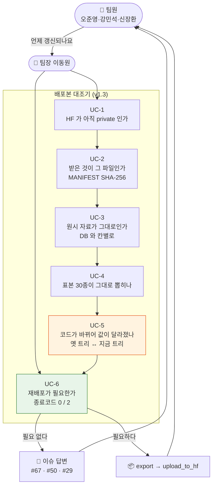
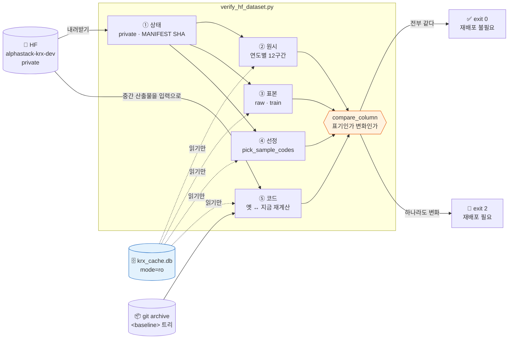
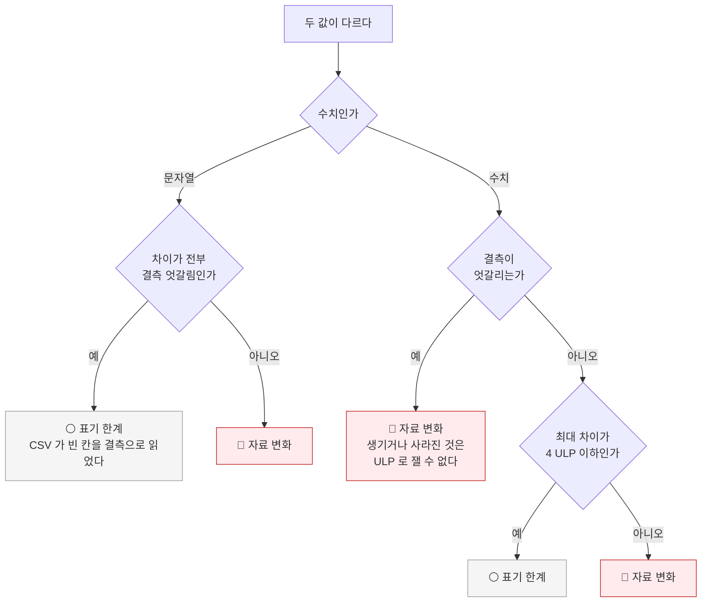
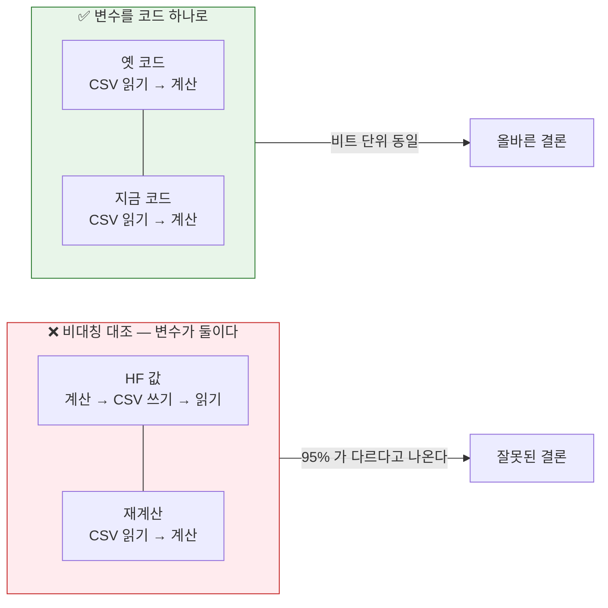

# 기능명세 — 배포본 대조기 (v1.3)

> **한 줄로**: 팀원에게 나간 HF 배포본이 **지금 DB·지금 코드와 같은지** 재서,
> 다시 올려야 하는지를 가른다. 확인하는 동안 공유 DB 를 한 바이트도 건드리지 않는다.
>
> 구현: [`scripts/verify_hf_dataset.py`](../../../scripts/verify_hf_dataset.py) ·
> 테스트: [`tests/test_verify_hf_dataset.py`](../../../tests/test_verify_hf_dataset.py) ·
> 실행 기록: [노트북](../../../notebooks/06-검토·발견/02.HF배포본이_정말_최신인가.ipynb) ·
> 답변: [이슈 #67](https://github.com/devlee328288/Alpha_Stack/issues/67)

---

## 0. 왜 만들었나

팀원이 물었습니다 — **"HF 의 KRX 자료는 언제 최신으로 업데이트되나요?"**

반출본을 만드는 길([`export_team_dataset.py`](../../../scripts/export_team_dataset.py))은
v1.0 에 있었지만, **나간 것이 아직 유효한지 되묻는 길은 없었습니다.** 그래서 질문이 올 때마다
사람이 코드 이력을 훑고 짐작해야 했고, 짐작이 틀리면 팀원이 낡은 자료로 모델을 학습합니다.

| | v1.2 까지 | v1.3 (이번) |
|---|---|---|
| 반출 | `export_team_dataset.py` · `upload_to_hf.py` | 그대로 |
| **되묻기** | **없음** — 사람이 코드 이력을 보고 짐작 | **`verify_hf_dataset.py`** · 종료코드로 판정 |
| 판정 기준 | 없음 | **1 ULP 안쪽 = 표기 · 결측 엇갈림 = 변화** (테스트 15건) |
| 갱신 규칙 | 없음 | **①경계 이동 ②값 변경 ③규격 변경** 셋만 재배포 |

---

## 1. 유스케이스



**UC-5 가 이 기계의 핵심입니다.** UC-3·4 는 *"DB 가 변했는가"* 를 보고, UC-5 는
*"코드가 변해서 같은 DB 로도 다른 결과가 나오는가"* 를 봅니다. **둘 다 아니어야** 재배포가 필요 없습니다.

---

## 2. 무엇을 어떻게 재는가



### 왜 "다시 만들어 SHA 대조" 가 아닌가

가장 단순한 방법인데 **두 군데서 막힙니다.**

| 막힘 | 무슨 일 | 어떻게 피했나 |
|---|---|---|
| **재생성은 DB 에 쓴다** | `export` → `supply/` → `init_db()` → `migrate_path()`. 확인만 하려는 작업이 스키마를 바꾼다 | **`mode=ro` URI 로만 연다.** 테스트가 `INSERT` 거부를 확인한다 |
| **SHA 는 한쪽으로만 강하다** | 큰 벌은 `ORDER BY` 없이 뽑아 행 순서가 안 정해진다. 자료가 같아도 SHA 는 달라질 수 있다 | **정렬 후 값을 칸별로** 본다. SHA 는 "받은 것이 그 파일인가" 에만 쓴다 |

SHA 비교의 비대칭성이 핵심입니다.

| 결과 | 알 수 있는 것 |
|---|---|
| 같다 | 확실히 같다 (강한 증거) |
| **다르다** | **아무것도 모른다** — 자료·순서·표기 중 무엇 때문인지 못 가른다 |

---

## 3. 판정 기준 — 무엇을 "같다" 고 부를 것인가

이 기계의 답은 결국 하나입니다. 그런데 **float 를 CSV 로 적었다 읽으면 끝자리가 흔들립니다.**
그 흔들림까지 "달라졌다" 로 세면 판정이 매번 참이 되어 아무것도 못 거릅니다.



### 왜 결측 엇갈림을 따로 두나

**값이 생기거나 사라지는 것은 크기로 잴 수 없는 종류의 변화**이기 때문입니다.
`NaN` 과 `0.0` 이 몇 ULP 떨어져 있다고는 말할 수 없습니다. 그래서 크기와 무관하게 변화로 셉니다.

**예외가 문자열 쪽에 하나 있습니다.** 차이가 *전부* 결측 엇갈림이면 표기 한계로 봅니다.
CSV 가 빈 칸을 결측으로 읽어서 생기는 일이고, 실제로 `sector` 32,226행이 이 경우였습니다
(DB 는 빈 문자열, CSV 는 `NaN`, 나머지 값 분포는 완전히 동일).

### `ULP_TOLERANCE = 4.0` 은 어디서 왔나

관측된 CSV 왕복 오차가 **정확히 1 ULP** 였습니다. 표준편차·차분 계산은 이를 증폭하므로
여유를 뒀되, 크게 잡으면 진짜 변화를 놓치므로 4 에서 멈췄습니다.
실측된 자료 변화(액면분할 1/50)는 상대차가 0.98 규모라 **열두 자릿수 떨어져 있어** 혼동되지 않습니다.

---

## 4. UC-5 — 코드 영향만 분리하는 법

가장 까다로운 부분입니다. 처음엔 이렇게 쟀다가 **틀렸습니다.**



비대칭 대조에서는 `hv_20` 53,964행(95.16%)·`bb_bandwidth` 39,686행(69.99%)이 달랐습니다.
**표기 오차가 표준편차·차분 계산에서 증폭된 것**을 코드 탓으로 읽은 것입니다.

### 어떻게 옛 코드를 불러오나

```python
tar = subprocess.run(["git", "archive", baseline], cwd=ROOT, ...).stdout
with tarfile.open(fileobj=io.BytesIO(tar)) as tf:
    tf.extractall(옛트리, filter="data")
ex = load_export_module(옛트리)      # importlib 로 그 시점 모듈을 읽는다
```

트리 경로만 바꾸면 **시점이 다른 코드를 나란히 세울 수 있습니다.**
외부 `tar` 명령을 부르지 않는 이유는 Windows 의 것이 stdin 을 읽으려면 `-f -` 가 필요해
플랫폼마다 인자가 갈리기 때문입니다.

**입력은 HF 의 중간 산출물을 씁니다** — `index_kospi200_dev.csv` 와
`stocks_sample30_train_dev.csv` 가 각각 피처 파일의 입력입니다. 그래서 DB 를 거치지 않고,
`supply/` 의 마이그레이션 가드에 막히지 않습니다.

---

## 5. 갱신 규칙 — 언제 재배포하나

**새 시세가 들어오는 것만으로는 재배포하지 않습니다.** 개발구간 상한(`dev_end`)이
`20210831` 이라 그 뒤의 시세는 반출본에 들어가지 않기 때문입니다.

| 재배포하는 경우 | 왜 | 관련 |
|---|---|---|
| **① 홀드아웃 경계를 옮길 때** | 개발구간이 늘어 자료가 실제로 추가된다 | [#63](https://github.com/devlee328288/Alpha_Stack/issues/63) |
| **② 개발구간 안의 값이 바뀔 때** | 액면분할 조정 적용 등. **행 수는 그대로고 값만 바뀐다** | [#51](https://github.com/devlee328288/Alpha_Stack/issues/51) |
| **③ 반출 규격이 바뀔 때** | 피처가 추가되면 칸이 늘어난다 | [#38](https://github.com/devlee328288/Alpha_Stack/issues/38) |

②가 **행 수 검사로는 안 잡히는** 경우라, 이 기계가 값을 보는 이유가 여기 있습니다.

---

## 6. 쓰는 법

```bash
# 전체 — 받아서 원시·표본·선정까지
python scripts/verify_hf_dataset.py

# 이미 받아 뒀다면 (149MB 재다운로드 생략)
python scripts/verify_hf_dataset.py --skip-download

# 코드 영향까지 (배포 시점 커밋을 준다)
python scripts/verify_hf_dataset.py --skip-download --baseline 5a52655
```

| 종료코드 | 뜻 |
|---|---|
| **0** | 재배포 불필요 — 배포본이 지금 DB·코드와 같다 |
| **2** | 재배포 필요 |
| 1 | 확인 자체를 못 했다 (토큰 없음 · MANIFEST 불일치) |

> 🔴 워크트리에서 돌릴 때는 `KRX_DB_PATH` 로 본 저장소 DB 를 가리켜야 합니다
> (`data/*.db` 가 gitignore 라 워크트리에 따라오지 않습니다).

---

## 7. 2026-09-02 실행 결과

| 대상 | 어떻게 쟀나 | 결과 |
|---|---|---|
| `full/daily_price_dev.parquet` | DB 와 직접 (연도별 12구간) | ✅ **5,989,308행 × 15칸 완전 일치** |
| `full/index_price_dev.parquet` | DB 와 직접 | ✅ 135,879행 × 12칸 완전 일치 |
| `small/index_kospi200_dev.csv` | DB 와 직접 | ✅ 2,880행 × 12칸 완전 일치 |
| `small/stocks_sample30_train_dev.csv` | 원시의 부분집합 + 값 | ✅ 58,791행 × 16칸 완전 일치 |
| `small/features_labels_kospi200_dev.csv` | 8/31 코드 ↔ 지금 코드 | ✅ 2,815행 × 37칸 **비트 동일** |
| `small/features_labels_stocks30_dev.csv` | 8/31 코드 ↔ 지금 코드 | ✅ 56,706행 × 40칸 **비트 동일** |
| MANIFEST 표본 선정 | 지금 DB 로 재현 | ✅ 30종 · 기준일 · 모집단 2,445 일치 |
| `small/index_all_dev.csv` | DB 와 직접 | ⚪ `market_cap` 388행 = 1 ULP |
| `small/stocks_sample30_raw_dev.csv` | DB 와 직접 | ⚪ `sector` 32,226행 = 빈문자열↔NaN |

**→ 종료코드 0. 재배포하지 않았습니다.**

---

## 8. 못 잰 것 · 다음

- **HF 배포 시각(17:29:56 KST)이 반출 스크립트 커밋(`5a52655`, 17:34 KST)보다 5분 빠릅니다.**
  배포에 쓴 코드가 그 커밋과 글자까지 같은지는 확인할 수 없습니다. 산출물이 전부 일치하므로
  실질적 차이는 없지만, 못 잰 것은 못 잰 대로 남깁니다.
- **`MANIFEST.json` 에 생성 커밋(git sha)이 없습니다.** 반출 스크립트는 *"같은 커밋에서
  다시 돌리면 같은 해시가 나와야 한다"* 고 적어두고 있는데, 어느 커밋이었는지 기록하지 않아
  그 약속을 검증할 수 없습니다. 위 항목이 생긴 원인이기도 합니다.
  → **다음 재배포 때 `git_commit` 을 넣습니다.** 넣으면 `--baseline` 을 손으로 주지 않아도
  MANIFEST 에서 읽어 자동으로 대조할 수 있습니다.
- `supply/` 를 거치는 재현은 마이그레이션 가드(DB v7 > 코드 v6)에 막혀 못 했습니다.
  대신 산출물을 DB 와 직접 대조하는 우회로로 메웠습니다.
