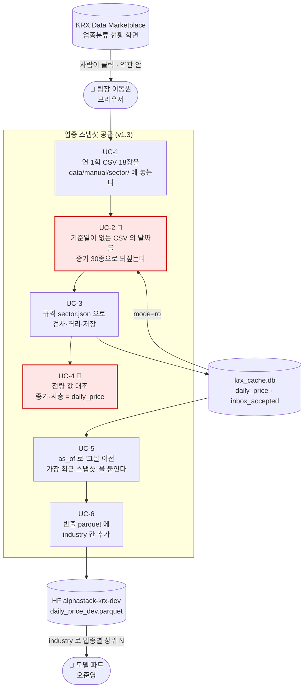
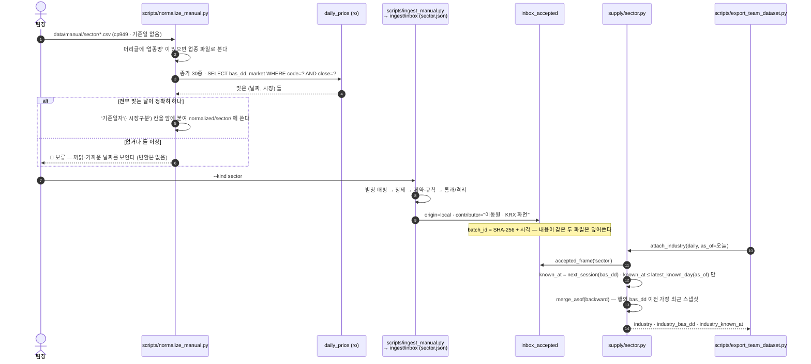

# 기능명세 — 업종 스냅샷 공급 (v1.3 부분판)

> **한 줄로**: 종목→업종 연결이 우리 자료 어디에도 없어서, 사람이 KRX 화면에서 내려받은
> **연 1회 스냅샷 18장**을 반입 엔진으로 들이고 `supply.sector` 가 *"그날 이전 가장 최근
> 스냅샷"* 으로 붙여 준다. 반출 parquet 에는 `industry` 칸이 새로 생긴다.
>
> 관련: [직접수집 가이드](../../데이터파트/version3.2/직접수집_가이드_업종분류현황.md) ·
> [노트북 07](../../../notebooks/01-데이터수집/07.업종은어디에도없었다.ipynb) ·
> [이슈 #92](https://github.com/devlee328288/Alpha_Stack/issues/92) ·
> [이슈 #94](https://github.com/devlee328288/Alpha_Stack/issues/94) ·
> TIL [되는 길과 써도 되는 길은 다르다](../../TIL/이동원/2026-09-03-되는-길과-써도-되는-길은-다르다.md)

---

## 0. 왜 생겼나

모델 파트 2안(2주 MVP)은 *"KOSPI200 방향 예측 → 시총 상위 10개 업종 → 업종마다 시총
상위 4~5 종목 → 40~50 종목 랭킹"* 이다. 그 가운데 **업종 → 종목** 연결이 없었다.

| 자료 | 실측 (2026-09-03) | 쓸 수 있나 |
|---|---|---|
| `daily_price.sector` | KOSPI 100% 빈 값 · KOSDAQ 은 **소속부**(중견기업부·벤처기업부) | ❌ 산업 업종이 아니다 |
| `index_price` | 업종지수 24종 + 시가총액 | △ 업종 상위 10 은 되지만 구성종목이 없다 |
| `corp_profile.sic_nm` | 표준산업분류 522종 · 73% · 시점 없음 | ❌ 소급 위험 |
| KRX `업종분류 현황` 화면 | 종목마다 업종 · 2010년부터 시점자료 | ✅ **단, 약관 제10조 ② 자동화 수집 금지** |

그래서 **사람이 화면에서 내려받는다.** 코드는 파일이 놓인 뒤부터 일한다.

---

## 1. 유스케이스

붉은 둘이 이 기능의 핵심이다. **UC-2**: 화면 CSV 에는 기준일 칸이 없고 파일명의 날짜는
내려받은 날이라, 파일명을 믿지 않고 값으로 되짚는다. **UC-4**: 행 수 검증은 되짚기가
하루 어긋난 것도 덮어쓰기도 못 잡으므로 모든 행의 값을 맞댄다.

---

## 2. 흐름

---

## 3. 규칙

| 규칙 | 내용 | 왜 |
|---|---|---|
| **시점** | 날짜 `d` 의 업종 = `d` 이전 가장 최근 스냅샷. 뒤 스냅샷을 앞으로 당기지 않는다 | 2026 분류로 2015 를 판정하면 미래참조이고 에러가 안 난다 (#92 3번) |
| **known_at** | 스냅샷 날짜의 **다음 거래일** — `stock_base_info` 와 같은 규칙, 실측 달력 | 마감 뒤 확정되는 표라 그날 안에는 몰랐다 |
| **as_of** | 키워드 전용 · 기본값 없음 | 빠뜨릴 수 없게 |
| **칸** | `industry` 를 **새로** 붙인다. `sector`(소속부)는 그대로 | 한 칸에 두 뜻을 섞지 않는다 |
| **지수명 대조** | `은행`·`기타금융`→`금융` · `전기·전자`→`전기전자` · `기타제조`→`제조`. 나머지 21개는 그대로 | 세 시점 실측. 🔴 `보험`·`증권`은 자기 지수가 있다 — 올리면 보험 지수에 종목 0 |
| **상위 묶음** | `제조`·`금융` 은 여러 업종의 합. "업종 상위 N" 에서 뺀다 (`UMBRELLA_INDICES`) | 넣으면 같은 종목을 두 번 세고, 그 자리에 `기타제조` 소형주가 뽑힌다 |
| **재배포** | 파일은 커밋도 HF 업로드도 안 한다. `industry` **칸**만 반출 | 약관 제12조 ② |

---

## 4. 검증 — `scripts/verify_sector.py` (2026-09-03 실측)

| 절 | 무엇 | 결과 |
|---|---|---|
| 1 | 스냅샷 18장 · (날짜,종목) 중복 | ✅ 가이드의 18개와 같다 · 중복 0 |
| 2 | **16,650행 전량** 종가·시가총액·시장 = `daily_price` | ✅ **다른 행 0 · 없는 행 0** |
| 3 | 새 업종이 처음 나타난 스냅샷 | `IT 서비스`·`부동산`·`오락·문화` 모두 **20250102** 부터 (20240701 은 옛 체계) |
| 4 | 지수명 조인 | ✅ 18장 전부 — 농업·광업만 지수 없음 |
| 5 | 2안 시연 (20240102) | 업종 상위 10 → 50종 · industry 없는 보통주 **0/839** |

---

## 5. 하지 않은 것 · 열린 것

- **KOSDAQ** 은 받지 않았다 — 2안이 KOSPI 기준. 필요하면 같은 절차로 18장 더.
- **개편일 좁히기** — 종목 분류가 바뀐 날은 2024-07-02 ~ 2025-01-02 사이. 2024-10-01 쯤 한 장
  더 받으면 반으로 준다.
- **KOSPI200 구성종목**(#94) — 같은 화면 계열(`지수구성종목`)이고 같은 약관이다. 사람이 받은
  오늘자 CSV 는 자동 수집본과 201종·종가가 완전히 같았다. 이력이 필요하면 같은 방식.
- **HF 반출** — `export_team_dataset.py` 는 준비됐다. 업로드는 카드 갱신과 함께 별도 결정.
