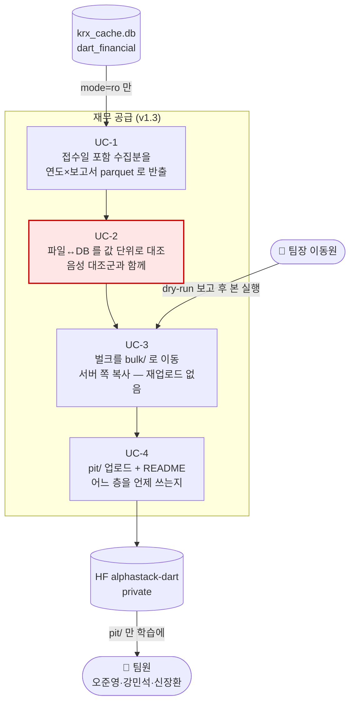
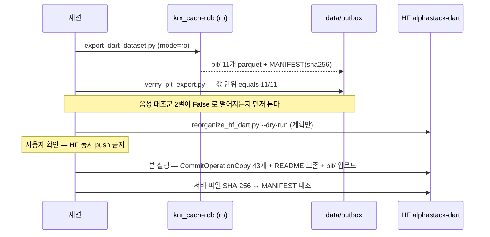

# 기능명세 — 재무 두 층 공급과 수정주가 결정 (v1.3)

> **한 줄로**: 팀이 받아 쓰는 HF 재무 저장소를 **접수일 있는 층(pit/)과 없는 층(bulk/)으로
> 갈라** 미래 누출을 구조로 막고, 수정주가는 원본을 덮지 않는 **4칸 신설**로 확정한다.
>
> 이전 버전: [v1.2 반입 엔진](../version1.2/반입_엔진.md) ·
> 관련: [노트북](../../../notebooks/02-품질·전처리/2026-09-02-HF두층과-수정주가-실측.ipynb) ·
> [이슈 #51](https://github.com/devlee328288/Alpha_Stack/issues/51) ·
> [이슈 #60](https://github.com/devlee328288/Alpha_Stack/issues/60)

---

## 0. v1.2 에서 무엇이 달라졌나

v1.2 까지는 **들어오는 것**(반입)을 다뤘습니다. 이번에는 **나가는 것** — 팀원이 학습에
쓸 재무를 어떤 모양으로 건네는가 — 을 정합니다.

| | 이전 | v1.3 (이번) |
|---|---|---|
| HF `alphastack-dart` | 루트에 parquet 43개 (접수일 없음) | **2층**: `bulk/`(참조) + `pit/`(학습 정본) |
| 재무 학습 자료 | 결산기(`bsns_year`)로 붙일 위험 상존 | `rcept_dt` 포함 662,933행 — as-of join 가능 |
| 반출 검증 | 행 수 비교 | **값 단위 `equals`** + 음성 대조군 2벌 |
| 수정주가 (#51) | 문제 확인만 | **방향 확정**: `adj_*` 4칸 신설, 소스 FDR+교차검증 |
| Kronos | 후보 선정만 (PR #62) | **T4 zero-shot 완주** — 로드 6.6초·예측 1.5초·VRAM 0.13GB |

---

## 1. 유스케이스

`UC-2` 를 붉게 칠한 이유: **행 수 검증은 덮어쓰기를 못 잡는다.** 전 컬럼 정렬 후
`DataFrame.equals` 로 모든 칸을 비교하고, 검증식 자체가 살아 있는지 음성 대조군
(값 1건 변조 → False · 연도 어긋난 쌍 → False)으로 먼저 확인한다.

---

## 2. 층 규칙 — 왜 두 층인가

| 층 | 접수일 | 용도 | 규칙 |
|---|---|---|---|
| `pit/` | ✅ `rcept_dt` | **학습 정본** | 거래일 t 에는 `rcept_dt <= t` 인 보고서만 붙인다 |
| `bulk/` | ❌ 없음 | EDA·대조·참조 | **학습 금지** — 결산기로 붙이면 석 달치 미래가 들어간다 |

- 홀드아웃 경계(`HOLDOUT_START`)는 **층에 굽지 않는다.** 경계가 재논의 중(#60)이므로
  dev/holdout 분할본 대신 pit/ 전 구간을 두고 쓰는 쪽이 자른다.
- 기본키에는 `account_detail` 이 반드시 들어간다 — 빼면 자본변동표에서 행이 조용히
  사라진다 (삼성전자 2023 실측 176→135줄).

## 3. 반출 → 검증 → 재구성 순서

## 4. 수정주가 결정 (#51) — v8 구현 규격

| 항목 | 결정 | 근거 (전부 실측) |
|---|---|---|
| 방식 | `adj_open/high/low/close` **4칸 신설** | `market_cap = close × shares` 는 원가격이어야 맞다. 수정주가는 소급 재계산되어 append-only 반입과 충돌. Kronos 입력이 OHLCV 6채널 |
| 소스 | **FDR(MIT) + 자체 교차검증** | 분할일 FDR 갭 = KRX `change_rate` (3/3 일치) · 조정계수 = 주식수 역산 배율 (50.000·4.993·4.982) |
| 검증식 | 적재 시 재사용 | `scripts/_probe_fdr_adjust.py` — 음성 대조군 2종에서 비율 1.0000 일정 |
| 커버리지 | 상폐 표본 5/5 정상 | 20200102 존재·20260820 부재 239종 중 5종 FDR 과거 구간 조회 성공 |

## 5. 병행 세션 교차 — 실제로 겪은 것

수집 세션이 같은 날 `v6_with_receipt_date/`(dev/holdout 분할본)를 올렸다가, 이 세션의
pit/ 업로드를 보고 **스스로 지웠다** ("같은 자료라 한 벌만 남긴다"). 루트 README 에
v6 안내가 잠시 남아 정정 커밋 1개가 더 들었다.

교훈: **HF 도 DB 처럼 동시 쓰기 자원이다.** push 전 사용자 확인 규칙은 저장소에도
적용하고, 세션 간 층 설계는 시작 전에 맞춘다.

## 6. 남은 것 (v8 로 넘긴다)

- `adj_*` 4칸 마이그레이션 + 적재 + #51 닫기
- `HOLDOUT_START` 20250901 제안의 팀 결정 (#60 코멘트)
- Kronos fine-tune VRAM · 다표본 평가 — adj 4칸 적재 후
