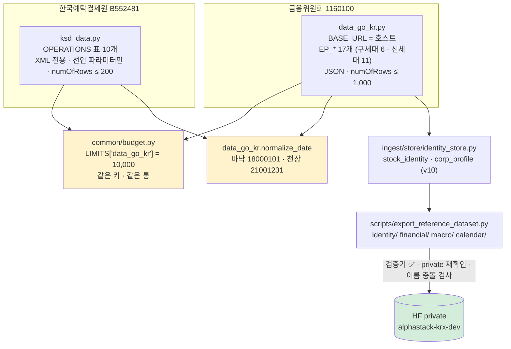
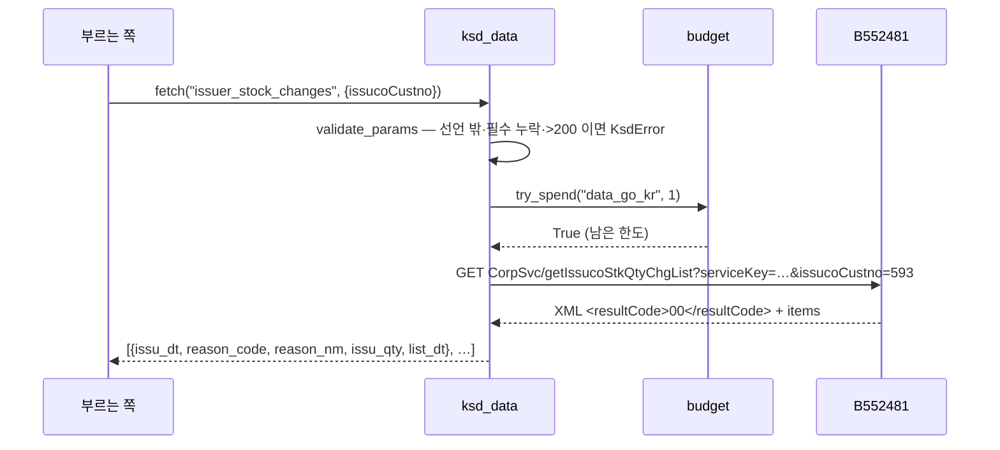
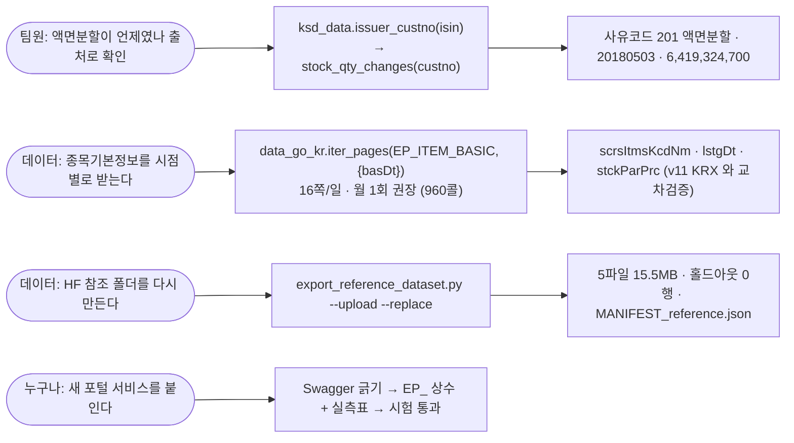

# 기능명세 — 공공데이터포털 경로 틀과 예탁결제원 클라이언트 (v1.4)

> **한 줄로**: 포털 경로 틀이 **둘**이라 호스트만 남기고 `EP_*` 가 경로를 갖게 하고,
> 규약이 다른 예탁결제원(`B552481`)은 **별도 클라이언트**로 두며, 어제 임시로 만든
> 참조 자료 반출을 **정본 스크립트**로 옮긴다.
>
> 이전 버전: [v1.3 부분판 4편](../version1.3/) ·
> 관련: [공공데이터포털 수집 설계 v3.3](../../데이터파트/version3.3/공공데이터포털_수집_설계.md) ·
> [조사보고(2026-09-03)](../../데이터파트/version3.3/변경사항.md) ·
> [금융위 연동](../../../ingest/clients/data_go_kr.py) ·
> [예탁결제원 연동](../../../ingest/clients/ksd_data.py) ·
> [참조 반출](../../../scripts/export_reference_dataset.py) ·
> [TIL](../../TIL/이동원/2026-09-04-경로-틀이-둘이면-이름으로는-알-수-없다.md)

---

## 0. 무엇이 달라졌나

| | 이전 (v3.3 · 2026-09-03) | v1.4 (이번) |
|---|---|---|
| `BASE_URL` | `…/1160100/service` — 구세대 틀이 박혀 있었다 | `https://apis.data.go.kr` **호스트만** |
| 엔드포인트 | 2개 (상장종목 · 기업개요) | **17개** · `EP_*` 가 기관코드부터 경로 전체를 갖는다 |
| 못 찾은 서비스 6개 | ⏳ "활용자 가이드를 받아야" | ✅ 전부 실호출 확인 · 상수로 등재 |
| 날짜 자리표시자 | 바닥선 `00010101` 만 | + **천장 `99991231`** (`_LATEST_PLAUSIBLE`) |
| 예탁결제원 | 없음 | `ksd_data.py` — XML · 선언 파라미터 표 · 상한 200 · ISIN 다리 |
| 하루 한도 | 호출부가 매번 `limit=10_000` 을 넘김 | `budget.LIMITS["data_go_kr"]` 정본 하나 |
| 참조 반출 | 스크래치패드 임시 스크립트 (정본 없음) | `scripts/export_reference_dataset.py` + 시험 6개 |

숫자는 전부 실측이다 — 실호출 5건(2026-09-04) · 시험 122건 · 반출 5파일 15.5MB.

---

## 1. 왜 필요한가 — 이름으로는 못 찾는다

v3.2 는 주식발행·배당·권리일정·대차·분포·지배구조 여섯 서비스를 `Get…InfoService/get…`
조합으로 수십 번 두드리고 전부 `NO_OPENAPI_SERVICE_ERROR` 를 받았다. 조합이 틀린 게
아니라 **틀이 둘**이었다.

| 세대 | 틀 | 예 |
|---|---|---|
| 구 | `1160100/service/<서비스>/<오퍼레이션>` | `GetCorpBasicInfoService_V2/getCorpOutline_V2` |
| 신 | `1160100/<서비스>/<오퍼레이션>` — `service` **없음** | `GetStocDiviInfoService_V2/getDiviInfo_V2` |
| 예탁결제원 | `B552481/<서비스>/<오퍼레이션>` — 기관코드가 다름 | `B552481/CorpSvc/getIssucoBasicInfo` |

두 예가 **둘 다 `_V2`** 다. 접미사로도 이름 모양으로도 세대를 알 수 없다. 그래서
"어느 틀인가" 를 규칙으로 계산하지 않고 **상수가 경로 전체를 말하게** 했다. 규칙이 없는
것을 규칙으로 만들면 다음 서비스에서 또 틀린다.

경로는 추측하지 않고 포털 상세페이지 HTML 에 박힌 Swagger 를 긁어 잰다:

```bash
curl -s "https://www.data.go.kr/data/<pk>/openapi.do" | grep -oE "apis\.data\.go\.kr[^\"'<> ]*"
```

> 🔴 Swagger 의 `parameters` 는 `get` **바깥**(경로 객체 아래)에 있다. `get` 안만 보면
> 필수 파라미터를 통째로 놓친다 — 예탁결제원 `CorpSvc` 덤프가 그래서 "필수 없음" 으로
> 잡혔고, 실호출은 `issucoCustno` 없이 돌지 않았다. **표는 실호출로 다시 맞춘다.**

---

## 2. 어떻게 만들었나

### 2.1 구조 — 클라이언트 둘, 예산 통 하나



`ksd_data.py` 를 `data_go_kr.py` 안에 넣지 않은 이유는 **규약이 셋 다 다르기** 때문이다.
한 클라이언트에 분기를 넣으면 "어느 쪽 규약인가" 를 호출마다 물어야 하고, 하나를
빠뜨려도 에러 없이 `10 INVALID` 만 돌아온다.

### 2.2 금융위 — `EP_*` 실측표 (2026-09-03 · 127콜로 응답 본문까지 열었다)

| 이름 | 세대 | 경로 (호스트 뒤) | 무엇 |
|---|---|---|---|
| `EP_LISTED` | 구 | `1160100/service/GetKrxListedInfoService/getItemInfo` | 상장종목 → `stock_identity` |
| `EP_CORP_OUTLINE` | 구 | `1160100/service/GetCorpBasicInfoService_V2/getCorpOutline_V2` | 기업개요 → `corp_profile` |
| `EP_GOV_SHAREHOLDER` 외 3 | 구 | `1160100/service/GetCorpGoveInfoService/…` | 주주·대표이사·임원보수·임원 |
| `EP_ITEM_BASIC` | 신 **`_V3`** | `1160100/GetStocIssuInfoService_V3/getItemBasiInfo_V3` | 보통주/우선주·상장일·액면가 **시점별** (하루 15,913행) |
| `EP_ISSUE_STAT` · `EP_ISSUE_HISTORY` · `EP_LOCKUP` | 신 `_V3` | 〃 | 발행현황·발행내역·보호예수 |
| `EP_DIVIDEND` | 신 | `1160100/GetStocDiviInfoService_V2/getDiviInfo_V2` | 배당 — `basDt` 는 적재일이라 빼고 부른다 (71,674행 · 72콜) |
| `EP_RIGHTS_SCHEDULE` | 신 | `1160100/GetStocRighScheService_V2/getRighExerReasSche_V2` | 권리일정 — 수정주가 chain 대조 후보 |
| `EP_LEND_BY_ITEM` · `EP_LEND_BY_PARTICIPANT` | 신 | `1160100/GetStocLendBorrInfoService_V2/…` | 대차잔고 · ⚠️ "업종별참여" 의 `sicNm` 은 참여자 구분 |
| `EP_DISTRIBUTION` · `EP_IRREGULAR_STOCK` | 신 | `1160100/GetStocTradInfoService_V2/…` | 주식분포 · 사고주권 |
| `EP_DEPOSIT_AVAILABLE` | 신 | `1160100/GetStocDepoInfoService_V2/getDepoAvaiWhet_V2` | 예탁가능 — `lstgAbolDt` 에 `99991231` |

`ENDPOINTS` 사전과 `endpoint_generation()` 이 있어 시험이 실측표와 대조한다. **상수를
더하면 시험의 실측표에도 세대를 적어야 통과한다** — 추측으로 넣을 수 없게 했다.

### 2.3 예탁결제원 — 규약 셋을 코드가 지킨다

| 규약 | 실측 | 코드 |
|---|---|---|
| XML 전용 | `resultType=json` 거절 | `_build_url` 이 `resultType` 을 붙이지 않는다 |
| 선언 안 된 파라미터 거절 | `10 INVALID_REQUEST_PARAMETER_ERROR` | `Operation(required, optional, paged)` 표 · `validate_params` 가 **예산 전에** 세운다 |
| `numOfRows` 상한 200 | 200 ✅ · 500 ❌ · 1,000 ❌ | `PAGE_SIZE=200` · 넘기면 부르기 전에 세운다 · `estimate_calls` 는 200 으로 나눈다 |

호출 순서는 **① 파라미터 검사 ② 예산 ③ 호출** 이다. 서버가 거절할 게 뻔한 호출에 하루
한도를 쓰지 않고, 응답을 못 받고 죽어도 나간 호출은 장부에 남는다.



**다리는 함수 하나다** — `issuer_custno(isin)`. `getIssucoCustnoByShortIsin` 은 종목코드를
어떤 모양으로 줘도 INVALID 라 쓸 수 없고, `getStkListInfoN1(isin=…)` 이 `issucoCustno` 를
준다 (삼성전자 `KR7005930003` → `593`). ISIN 은 `stock_identity` 에 전 종목 있다.

| 오퍼레이션 (이 모듈 이름) | 경로 | 파라미터 | 무엇 |
|---|---|---|---|
| `stock_list` | `StockSvc/getStkListInfoN1` | `isin` · 페이징 | ISIN → 발행회사번호 |
| `codes_by_market` | `StockSvc/getShotnByMartN1` | `martTpcd` · 페이징 | 시장 전체 종목(유가 943) — 구성종목 아님 (#94) |
| `new_deposits` | `StockSvc/getNewDepoSecnListN1` | `yyyymm` · 페이징 | 신규 예탁 — 업종은 KSIC 대분류·신규분뿐 (#92) |
| `issuer_basic` | `CorpSvc/getIssucoBasicInfo` | `issucoCustno` | 기업개요 28칸 · `99991231` → `None` |
| `issuer_stock_changes` | `CorpSvc/getIssucoStkQtyChgList` | `issucoCustno` | 🔴 액면분할·합병증자 **사유코드+발행일** |
| `distribution_dates` · `distribution_by_holder` | `CorpSvc/getStkDistribution…` | `issucoCustno` (+`rgtStdDt`) | 월별 주주 유형별 지분 — 종목×기준일 1콜 |

### 2.4 날짜 자리표시자 — 바닥과 천장

| 값 | 뜻 | 어디서 | 처리 |
|---|---|---|---|
| `00010101` | 해당 없음 | 코스닥 전용 회사의 유가상장일 | `_EARLIEST_PLAUSIBLE=18000101` 아래 → `None` |
| `99991231` | 아직 폐지 안 됨 | `getDepoAvaiWhet_V2.lstgAbolDt` · KSD `xpitDt`·`dlistDt`·`custXtinDt` | 🆕 `_LATEST_PLAUSIBLE=21001231` 위 → `None` |
| `0000000000000` | 법인번호 없음 (외국기업) | `crno` | `normalize_crno` → `None` |

천장을 2100 으로 둔 이유: 진짜 미래 날짜(예정 상장일·만기)는 그 안에 들고 자리표시자는
항상 그 밖이다. 두 자리 연도는 `_YY_PIVOT` 규칙상 2055 가 최대라 천장에 닿을 수 없다.

### 2.5 참조 자료 반출 — 정본 스크립트

```
python scripts/export_reference_dataset.py                    # data/outbox/reference_<오늘>/
python scripts/export_reference_dataset.py --upload --dry-run # 검증기 → 충돌 검사까지만
python scripts/export_reference_dataset.py --upload --replace # 기존 5파일을 갱신
```

| 단계 | 무엇 | 왜 |
|---|---|---|
| 읽기 | `mode=ro` | 수집 세션이 같은 DB 에 쓰고 있어도 안전하다 |
| 자르기 | `시간칸 < HOLDOUT_START` (`evaluation/horizon.py` 하나) | 2026-09-02 반출본이 자기 상수를 들고 197,068행을 빠뜨렸다 |
| 재검사 | **파일을 다시 열어** 경계 넘은 행 0 | 만드는 쪽을 믿지 않는다 |
| 이름 | `MANIFEST_reference.json` | `MANIFEST.json` 이면 시세 반출 이력을 덮는다 |
| 업로드 | private 재확인 · 검증기 3종(`upload_to_hf.run_verifiers` 를 빌려 씀) · 이름 충돌은 `--replace` 없이 거부 · 올린 뒤 서버 목록 재확인 | `upload_to_hf.py` 의 안전장치와 같다 |

`full/`·`small/` 은 건드리지 않는다. 팀원 코드가 그 경로를 그대로 쓴다.

---

## 3. 유스케이스



---

## 4. 검증 — 무엇으로 "맞다" 고 했나

| 무엇 | 어떻게 | 결과 |
|---|---|---|
| 구세대 경로가 여전히 도나 | 실호출 `page_count(EP_LISTED, 20240830)` | 3쪽 ✅ |
| 신세대 `_V3` 경로 | 실호출 `page_count(EP_ITEM_BASIC, 20240830)` | 16쪽 ✅ |
| KSD 다리 | 실호출 `issuer_custno("KR7005930003")` | `593` ✅ |
| KSD 파싱 | 실호출 `stock_qty_changes("593")` · `issuer_basic_info("593")` | 액면분할 20180503 · `dlistDt` `None` ✅ |
| 규약 셋 | `tests/test_ksd_data.py` 26건 | 통과 |
| 경로 틀 · 천장 · 한도 정본 | `tests/test_data_go_kr.py` +9건 | 통과 |
| 반출 | `tests/test_export_reference_dataset.py` 6건 + 실제 반출 | 5파일 · 홀드아웃 0 |

실호출은 예산 **5콜**. 시험 122건은 우리가 적은 응답으로 도는 것이라 서버와 맞는지는
못 잰다 — 실호출 한 줌이 그 구멍을 메운다.

**이 검증이 안 보는 축**: 17개 경로 중 실호출한 것은 2개다. 나머지 15개는 2026-09-03
조사 세션의 실호출(127콜)에 기대고 있다. 그 뒤 포털이 경로를 바꿨다면 `NO_OPENAPI_SERVICE`
로 드러난다 — 조용히 틀리지는 않는다.

---

## 5. 데이터파트 설계서에 반영할 것 (다음 버전업 때 · v3.4)

같은 워크트리에서 text_signal 세션이 함께 돌아 **여기서는 설계서를 버전업하지 않았다.**
버전업하는 쪽이 아래를 `공공데이터포털_수집_설계.md` 에 옮긴다.

1. §2 "실측 — 우리 키로 지금 열려 있는 것" 표에 신세대 11개 경로를 더하고, "아직 경로를
   못 찾은 것" 문단을 지운다 (전부 찾았다 · §2.2 표).
2. §6 mermaid 에 `ksd_data.py` 상자와 `budget.LIMITS["data_go_kr"]` 을 더한다.
   "예산 — 부르기 전에 셉니다" 에 KSD 는 **파라미터 검사가 예산보다 먼저**라고 적는다.
3. §6 "지켜야 할 것" 오류 표에 예탁결제원 `10 INVALID`(선언 밖 파라미터) 를 더한다.
4. §9-4 "못 찾은 엔드포인트 6개 → 아직 열려 있습니다 ⏳" 를 **닫음 ✅** 으로.
5. 자리표시자 절에 `99991231` 천장을 더한다 (품질 규약 §자리표시자 7종 표와 맞춘다).
6. 이용허락: 주식발행정보·주식권리일정정보는 **공공누리 2유형(상업적 이용 금지)** — 쓰기
   시작하면 반출·배포 조건이 달라진다. 지금은 안 쓴다.
7. 콜 비용 표(조사보고 §9): 종목기본정보 전 구간 26,000콜 → **월 1회 960콜** 제안 ·
   KSD 주주분포는 종목×기준일이라 표본 30종 × 24기준일 = 720콜로 먼저 값어치를 잰다.
