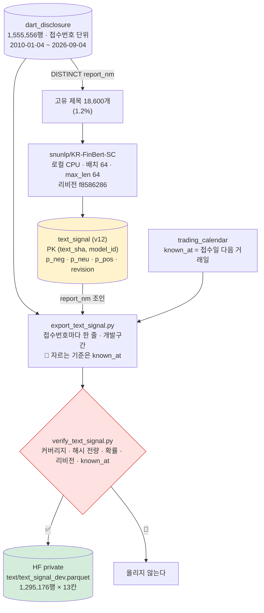
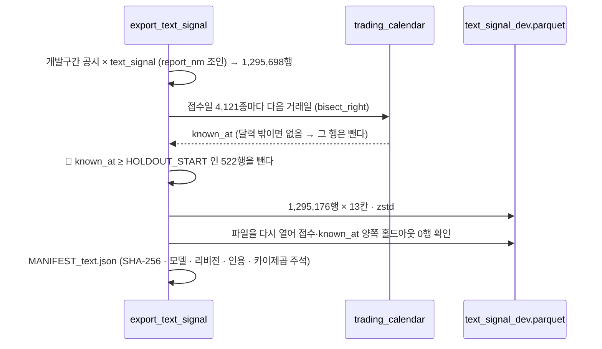
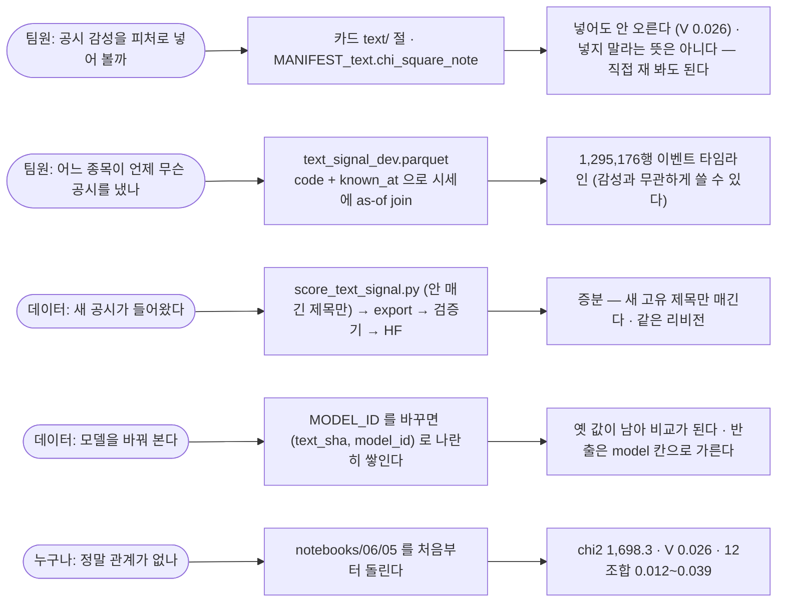

# 기능명세 — 텍스트 신호: 공시 제목 감성을 수치 3칸으로 (v1.5)

> **한 줄로**: 공시 제목 155만 건에 감성 모델을 **로컬 CPU** 로 돌려 확률 3칸을 만들고
> (v12 `text_signal` · 고유 제목 18,600개만), 접수번호 단위로 펴서 HF 에 올린다 — 그리고
> 그 신호가 5일 방향과 **관계가 없음**을 카이제곱으로 밝혀 재현 가능하게 남긴다.
>
> 이전 버전: [v1.4 포털 경로 틀과 예탁결제원](../version1.4/공공데이터포털_경로틀과_예탁결제원.md) ·
> 설계 원문: [고도화 설계 §2](../../데이터파트/version3.4/고도화_설계.md) ·
> 결과 반영: [데이터파트 v3.4 명세서 §2.8](../../데이터파트/version3.4/명세서.md) ·
> 코드: [`score_text_signal.py`](../../../scripts/score_text_signal.py) ·
> [`export_text_signal.py`](../../../scripts/export_text_signal.py) ·
> [`verify_text_signal.py`](../../../scripts/verify_text_signal.py) ·
> [마이그레이션 v12](../../../ingest/store/migrations.py) ·
> 시험: [`tests/test_text_signal.py`](../../../tests/test_text_signal.py) ·
> 재현: [노트북 06/05](../../../notebooks/06-검토·발견/05.신호가-없다도-재현-가능해야-한다.ipynb) ·
> 팀 알림: [이슈 #105](https://github.com/devlee328288/Alpha_Stack/issues/105) · PR #108

---

## 0. 설계와 무엇이 달라졌나

[고도화 설계 §2](../../데이터파트/version3.4/고도화_설계.md)(2026-09-03)가 정한 것과 실제로 만든 것이
네 곳에서 다르다. 전부 **실측이 설계를 고친** 자리다.

| | 설계 (v3.2 · 09-03) | 실제 (v12 · 09-04) | 왜 달라졌나 |
|---|---|---|---|
| 실행처 | 원격 추론 (`hf_data.classify`) · 제로샷 `xlm-roberta-large-xnli` | **로컬 CPU** · `snunlp/KR-FinBert-SC` (금융 감성 파인튜닝 모델) | 원격은 건당 $0.01~0.03 이라 18,600건이면 상한($1.50)을 넘는다. 로컬은 0원·7분. 설계서 §5 "모델 로컬 다운로드 Won't" 를 **개정**했다 |
| 저장 단위 | 접수번호마다 한 행 (`code`·`rcept_no`·`known_at` 포함) | **고유 제목마다** 한 행 (`text_sha`, `model_id`) — 시점 칸 없음 | 155만 행의 고유 제목이 18,600개(1.2%). 행마다 매기면 같은 문장을 84번씩 읽는다 |
| `known_at` 자리 | 표에 저장 | **반출할 때** 접수일에서 만든다 | 표가 제목 단위라 시점이 없다. 시점은 접수번호에 붙는다 |
| 게이트 | 라벨 셋 다 15~45% · 카이제곱 p < 0.05 | 분포 게이트 **미달**(8.3·73.4·18.3%) → **효과크기**로 판정 | 공시는 원래 대부분 중립이라 분포 전제가 안 맞고, 126만 행에서 p 는 언제나 유의하다 |

마이그레이션 번호도 설계의 v11 이 아니라 **v12** 다 — v11 은 종목기본정보가 먼저 가져갔다(선착순).

숫자는 전부 실측이다 — 고유 제목 18,600 · 반출 1,295,176행 × 13칸 · 카이제곱 12조합 · 시험 20건.

---

## 1. 왜 필요한가 — 그리고 왜 "없다" 도 결과인가

텍스트를 수치로 바꾸는 첫 갈래다(#89 ①). 원료는 DART 공시 **제목**(`report_nm`) — 짧고,
접수일이 기록값이라 시점 정합이 계산이 아니며, 약관에 저장·재배포 제한이 없다.

만들고 재 보니 **5일 방향과 관계가 없었다** (Cramer's V = 0.026). 그런데도 이 기능을 지우지
않고 반출까지 한 이유가 셋이다.

1. **"없다" 도 재현 가능해야 한다.** 나중에 누가 이 칸을 피처로 넣으려 할 때 "왜 안 넣었나" 를
   다시 잴 수 있어야 한다. 숫자만 남기면 재현이 아니다 — 노트북 05 와 시험 20건이 그 자리다.
2. **이벤트 타임라인으로서 값이 있다.** 어느 종목이 어느 날 무슨 공시를 냈는지가 접수번호
   단위로 정리된 파일은 감성과 무관하게 쓸 데가 있다(거래정지·정기보고서 제출 시점 등).
3. **다음 텍스트 원료의 틀이다.** 제목이 아니라 본문·뉴스로 갈 때 같은 표·같은 반출 규격·
   같은 검증기를 쓴다. 모델을 바꿔도 `(text_sha, model_id)` 가 나란히 쌓인다.

---

## 2. 어떻게 만들었나

### 2.1 구조 — 캐시 표 하나, 반출에서 편다



**표를 `dart_disclosure` 에 칸으로 붙이지 않은 이유** 셋: ① 모델을 바꾸면 155만 행을 다시
써야 한다(이 표는 18,600행) ② 모델 둘을 나란히 두고 비교할 수 없다 ③ 어느 리비전이 낸
값인지 남길 자리가 없다. HF 모델은 주인이 가중치를 갈아 끼울 수 있어 **리비전이 곧 재현성**이다.

### 2.2 매기기 — `score_text_signal.py`

| 규칙 | 코드 | 왜 |
|---|---|---|
| 흔한 제목부터 | `안매긴_제목()` 이 `COUNT(*) DESC` | 도중에 멈춰도 많이 덮는다 — 상위 200개가 공시 행의 85.5% |
| 라벨은 자리가 아니라 이름 | `model.config.id2label` 에서 `negative·neutral·positive` 를 찾는다 · 없으면 멈춘다 | 자리로 가정하면 모델을 바꿨을 때 확률이 조용히 뒤집힌다 |
| 리비전 기록 | `model_info(MODEL_ID).sha` · 오프라인이면 `None` 으로 남긴다 | 재현성 · 검증기가 리비전이 하나인지 본다 |
| 확률 제약은 DB 가 | `CHECK (ABS(p_neg+p_neu+p_pos-1) < 0.01)` · 범위 [0,1] | softmax 를 빠뜨리면 INSERT 에서 걸린다 |
| 비용 0원 | 모델을 내려받아 로컬로 · 44건/초 | 원격은 건당 $0.01~0.03 · GPU 이득도 없는 규모 |

라이선스: 카드에 표기가 없다(HF 모델 약 70%가 그렇다). 관례대로 **인용**으로 대신하고 임의로
"오픈소스" 라 적지 않는다 — [모델 라이선스 대장 §3.1](../../데이터파트/version3.4/모델_라이선스_대장.md).

### 2.3 시점 — `known_at` 은 접수일 **다음** 거래일



`rcept_dt` 에는 시각이 없다. 15:00 접수 공시를 그날 신호로 쓰면 장 마감 30분 전에 알던 것이
된다. **접수일이 거래일이어도 그날이 아니라 다음 거래일**이다(`known_rule = rceptDt+1session`).

**자르는 기준은 접수일이 아니라 `known_at` 이다.** 접수일이 개발구간 마지막 며칠(20240830)이면
`known_at` 이 봉인 구간(20240902)으로 넘어간다. 접수일로만 자르면 그 행이 "개발구간 자료" 얼굴로
들어오는데 실제로 쓸 수 있는 날은 봉인 구간이다 — **실측 522행**. 달력 밖(마지막 거래일 이후)
접수는 다음 거래일을 모르므로 행을 만들지 않는다. 지어낸 시점은 미래참조다.

### 2.4 반출 규격 — `text/text_signal_dev.parquet`

| 칸 | 뜻 |
|---|---|
| `code` · `rcept_no` · `rcept_dt` | 종목 · 접수번호(고유) · 접수일 |
| `known_at` · `known_rule` | 접수일 다음 거래일 · `rceptDt+1session` |
| `source` | `dart:list.json` |
| `report_nm` | 제목 원문 — **사람이 확인하기 위한 것이지 피처가 아니다** (§4) |
| `model` · `model_rev` | `snunlp/KR-FinBert-SC` · `f8586286…` |
| `p_pos` · `p_neg` · `p_neu` | 확률 3칸 |
| `text_sha256` | 제목 해시 앞 16자 |

붙이는 법: `code + bas_dd ≥ known_at` as-of join. 기존 `features_labels_*.csv` 에 칸을 더하지 않고
**별도 파일**로 낸 이유는 재배포 3조건 ③(반출 규격 변경)에 걸리지 않기 위해서다. 피처와 붙이는
코드는 `features/`(신장환) 경계다.

### 2.5 검증기 — 게이트에 등록해야 게이트가 본다

`verify_text_signal.py` 를 `upload_to_hf.VERIFIERS` 에 넣었다. 등록하지 않으면 반출 경로가 보지
않는다. 무엇을 재나:

| 절 | 무엇 | 실측 (2026-09-04) |
|---|---|---|
| 1 | 커버리지 — 채울 수 있는 제목이 전부 채워졌나 | 18,600 / 18,600 · 공시 행 100% |
| 2 | `text_sha` **전량 재계산** 대조 | 어긋남 0 |
| 3 | 확률 [0,1] · 합 1 · 빈 값 | 0 · 0 · 0 |
| 4 | 모델 리비전이 하나인가 | `f8586286` 18,600 |
| 5 | `known_at` 규칙 — 접수일보다 뒤 · 사이에 다른 거래일 없음 | 위반 0 · 달력 밖 접수일 4 |
| 6 | 라벨 분포 | 8.3 · 73.4 · 18.3% — 설계서 §2.7 게이트 미달 (아래) |

**이 검사가 안 보는 축**: 모델이 뜻을 맞게 읽는가. "투자설명서(일괄신고)" 가 긍정 0.93 인 것이
타당한지는 규격 검사로 알 수 없다. 그건 바깥 기준으로만 잰다 — §3.

---

## 3. 검증 — 신호가 있는가를 바깥 기준으로 쟀다

### 3.1 카이제곱 — 감성 × 5일 방향 (수업 04단원)

개발구간 1,265,118행. 방향은 `adj_close(known_at) → adj_close(+5거래일)` · 밴드 ±2%
(`features.stock_model_dataset.STOCK_NEUTRAL_BAND`) · 5일 뒤가 홀드아웃이면 제외.

```
chi2 = 1,698.3 · 자유도 4 · p < 1e-300 · Cramer's V = 0.026
기준선 상승 30.54% · 부정 28.83% · 중립 31.06% · 긍정 29.20%
```

**p 값은 표본 크기를 따라간다.** 126만 행에서는 아주 작은 차이도 유의하다. 효과크기 Cramer's V
0.026 은 관례상 "작음"(0.1)의 4분의 1이고, **긍정이 중립보다 상승을 덜 맞힌다** — 방향조차
맞지 않는다.

설정을 12번 바꿔 봤다(밴드 0·1·2% × 수익률 정의 4가지). V 는 0.012~0.039 사이고 10/12 에서
긍정이 중립보다 못하다. **결론이 설정에 매달려 있지 않다.**

### 3.2 설계서 §2.7 분포 게이트를 왜 안 썼나

"라벨 셋 다 15~45%" 는 **라벨(5일 방향)** 이 한쪽으로 쏠리지 않았는지 보는 게이트지 피처 분포를
보는 것이 아니다. 공시는 원래 대부분이 중립(73%)이라 그 전제가 이 자료에 맞지 않는다. 맞지 않는
게이트를 억지로 통과시키는 대신 "무엇을 알고 싶었는지"(바깥 기준과의 관계)로 돌아가 카이제곱을
골랐다.

### 3.3 재현

카이제곱을 계산한 코드가 처음엔 저장소에 없었다(숫자만 커밋 메시지와 대장에). 설정을 12조합으로
되찾아 노트북 05 에 고정했다 — `chi2` 와 감성별 상승 비율이 소수점까지 같다(행 수는 6 차이).

| 무엇 | 어떻게 | 결과 |
|---|---|---|
| 규격 | `tests/test_text_signal.py` 20건 | 통과 (전체 1,120) |
| 값 | `verify_text_signal.py` 전량 | ✅ |
| 반출본 = HF | 파일 SHA-256 = 로컬 대장 = HF 대장 | ✅ |
| 522행 | 노트북 05 §2 | 재현 ✅ |
| 카이제곱 | 노트북 05 §3 · 12조합 | 재현 ✅ |

---

## 4. 🔴 제목을 그대로 피처로 쓰면 시점이 새어 들어온다

감성으로는 무관한데 **제목별로** 5일 상승 비율을 재면 4.6% 에서 81.0% 까지 벌어진다. 상위·하위가
전부 정기보고서다. 감성 차이인지 시점인지는 **같은 제목 가족 안에서** 갈린다.

| 제목 가족 | 감성 | 5일 상승 비율 |
|---|---|---|
| `사업보고서 (YYYY.12)` 15개 연도 | **전부 중립** | **11.1% ~ 81.0%** — 2019.12 는 2020년 3월 제출(코로나 반등) |
| `반기보고서 (YYYY.06)` 15개 연도 | 2010~2019 부정 · 2020~ 중립 | 4.6% ~ 49.8% — 2015.06 은 2015년 8월(중국발 폭락) |

같은 문장인데 연도에 따라 갈리니 감성이 아니라 **연월이 가리키는 시장 국면**이다. 제목을 원-핫이나
임베딩으로 넣으면 모델은 "지금이 몇 년 몇 월인가" 를 외운다 — 개발구간에서 오르는 것처럼 보이고
홀드아웃에서 무너진다. 덤으로, 감성 모델조차 연도 숫자에 라벨이 흔들린다(`반기보고서` 2010~2019
부정 → 2020~ 중립). 카드와 대장에 🔴 로 적었다.

---

## 5. 유스케이스



---

## 6. 안 하는 것 · 다음

| 무엇 | 판정 | 왜 |
|---|---|---|
| `p_*` 를 1차 모델 피처로 편입 | **안 한다** | 신호가 없다. 편입은 `features/`(신장환) 결정이고 근거는 이 문서·노트북 05 |
| `report_nm` 원-핫·임베딩 | 🔴 **금지 권고** | 시점이 샌다 (§4) |
| 공시 본문(`document.xml`) 감성 | 3차 | 길어서 배치가 다르다 · 같은 표·검증기를 그대로 쓴다 |
| 뉴스 제목 | 2차 (팀 법적 판단 후) | 네이버 약관 7.3 ③ 저장 금지 — 점수만 남기는 안도 판단이 먼저 |
| 다른 모델로 재판정 | 열려 있음 | `(text_sha, model_id)` 가 나란히 쌓인다 · 모델 라이선스 대장 확인 후 |
