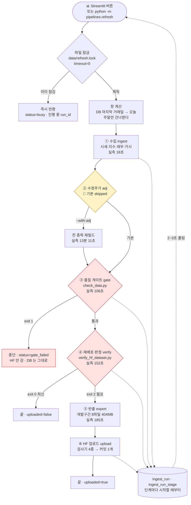
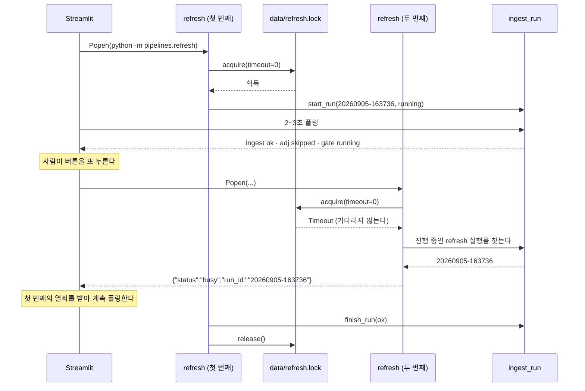
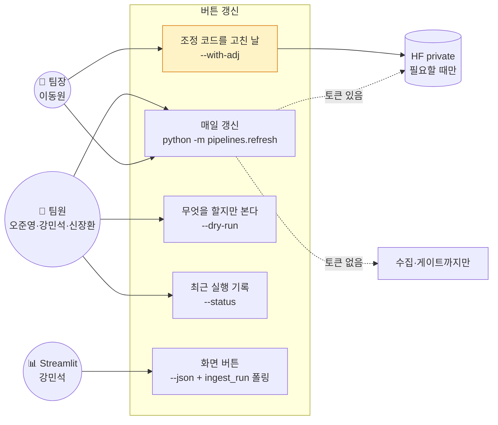

# 기능명세 — 버튼 갱신 파이프라인: 여섯 번 치던 것을 한 번으로 (v1.6)

> **한 줄로**: 수집 → 수정주가 → 품질 게이트 → 재배포 판정 → 반출 → HF 업로드를
> `python -m pipelines.refresh` 한 명령으로 잇는다. 두 번 눌러도 한 번만 돌고,
> 판정이 "필요하다" 고 할 때만 올린다. 그리고 **수정주가는 기본으로 끈다** —
> 매번 돌리면 자료가 좋아지는 게 아니라 나빠지기 때문이다.
>
> 이전 버전: [v1.5 텍스트 신호](../version1.5/텍스트_신호.md) ·
> 설계 원문: [고도화 설계 §3](../../데이터파트/version3.6/고도화_설계.md) ·
> 코드: [`pipelines/refresh.py`](../../../pipelines/refresh.py) ·
> [`pipelines/ingest.py`](../../../pipelines/ingest.py) ·
> [`pipelines/README.md`](../../../pipelines/README.md) ·
> 시험: [`tests/test_pipelines_refresh.py`](../../../tests/test_pipelines_refresh.py) (25건) ·
> 팀 알림: [이슈 #89 ②](https://github.com/devlee328288/Alpha_Stack/issues/89)

---

## 0. 설계와 무엇이 달라졌나

[고도화 설계 §3](../../데이터파트/version3.6/고도화_설계.md)(2026-09-05 오전)이 정한 것과 실제로 만든 것이
네 곳에서 다르다. **넷 다 돌려 보고서 알게 된 것**이다.

| | 설계 | 실제 | 왜 달라졌나 |
|---|---|---|---|
| 단계 수 | 다섯 (`ingest`·`gate`·`verify`·`export`·`upload`) | **여섯** — `adj` 를 넣었다 | 손으로 돌린 순서에는 수정주가 재빌드가 있었는데 설계가 그걸 빠뜨렸다. 다만 **기본은 끈다** (§3) |
| 판정 호출 | `verify_hf_dataset --skip-download` | **받아서** 대조한다 (`--reuse-snapshot` 일 때만 건너뜀) | 스냅샷이 없으면 `--skip-download` 는 파일을 못 찾고 죽는다. 실제로 이 PC 에 스냅샷이 없었다 |
| 진행 표시 | (언급 없음) | 부모·자식 **양쪽**의 출력 버퍼를 푼다 | 첫 실행에서 4분 37초 동안 **한 줄도 안 나왔다**. 파이프로 받으면 파이썬이 8KB 씩 모은다 |
| `--force-export` | (언급 없음) | 깃발을 **실행을 열 때** 세운다 | 판정 단계 안에서 세우면 `--only export --force-export` 가 조용히 아무것도 안 한다 |

숫자는 전부 실측이다 — 전체 4분 37초 · 반출 185초 · 수정주가 13분 11초 · 시험 25건.

---

## 1. 왜 필요한가

2026-09-05 오전에 손으로 이 순서를 쳤다.

```
scripts/build_adj_prices.py      →  전 종목 수정주가          13분 11초
scripts/verify_base_info.py      →  종목기본정보 검사
scripts/export_team_dataset.py   →  개발구간 반출              185초
(검사기 4종)                     →  반출 전 게이트
scripts/upload_to_hf.py          →  HF private 업로드
(데이터셋 카드)                  →  README.md 갱신
```

여섯 번을 순서대로 쳐야 하고, **하나를 빠뜨려도 아무 일도 일어나지 않는다.** 그날 실제로
겪은 사고가 정확히 그 종류였다 — 감자 보정 코드를 고쳤는데 좁은 범위에만 먹여서, 저장소에는
고친 코드가 있는데 나간 자료는 안 고쳐진 채였다. 사람이 기억해서 잇는 순서는 바쁠 때 끊긴다.

그리고 화면(강민석 님)에는 **버튼 하나**가 필요하다. 버튼이 여섯 명령을 알 필요는 없다.

---

## 2. 어떻게 만들었나

### 2.1 구조



### 2.2 단계마다 무엇을 하나

| 단계 | 부르는 것 | 통과 조건 | 실측 |
|---|---|---|---:|
| ① 수집 | `python -m pipelines.ingest --days <창>` | 종료코드 0 | 18초 |
| ② 수정주가 | `scripts/build_adj_prices.py` | 검증 ①~④ 통과 | 13분 11초 |
| ③ 품질 게이트 | `scripts/check_data.py` | `error` 항목 전부 0 | 106초 |
| ④ 재배포 판정 | `scripts/verify_hf_dataset.py` | 0 최신 · 2 필요 · 그 밖은 오류 | 152초 |
| ⑤ 반출 | `scripts/export_team_dataset.py` | 홀드아웃 누수 0 | 185초 |
| ⑥ HF 업로드 | `scripts/upload_to_hf.py` | 검사기 4종 통과 · private 재확인 | — |

기본 실행(②를 끈 상태)은 **4분 37초**다.

### 2.3 창을 어떻게 세나 — 며칠 안 눌러도 구멍이 없게

고정 `--days 10` 이면 열흘 넘게 안 눌렀을 때 그 앞이 조용히 빈다. 그리고 **그 구멍은 다음에
눌러도 안 메워진다** — 창이 언제나 "오늘부터 10일" 이기 때문이다.

그래서 창을 `daily_price` 의 마지막 날짜에서 거꾸로 잰다.

```
창 = max(3, DB 마지막 거래일 ~ 오늘 사이의 평일 수)
```

⚠️ **공휴일은 빼지 않는다.** `common.trading_calendar.trading_days` 가 주말만 건너뛰는
방식이라 여기서 공휴일을 빼면 그 함수가 만드는 날짜 목록보다 창이 짧아져 받아야 할 날이
밖으로 밀린다. 며칠 넉넉한 것은 공짜지만(이미 받은 날은 건너뛴다) 모자란 것은 구멍이 된다.

최소 3을 두는 이유는 방금 받았어도 마지막 며칠은 다시 확인하기 위해서다 — 장중에 받았다면
그날 자료가 확정 전일 수 있다. 상한은 250거래일이고, 그보다 넓으면 그건 버튼이 할 일이
아니라 대량 수집이라 **무엇을 하라고 알려 준 뒤 세운다.**

### 2.4 두 번 눌러도 한 번만



🔴 **`busy` 에 `run_id` 를 함께 주는 것이 요점이다.** 열쇠 없이 "돌고 있음" 만 돌려주면
화면은 무엇을 폴링해야 할지 모른다.

---

## 3. 🔴 왜 수정주가는 기본으로 끄나 — 매번 돌리면 나빠진다

이 파이프라인에서 가장 헷갈리는 자리다. "최신으로 맞춘다" 가 여기서는 반대로 작동한다.

FinanceDataReader 는 종목마다 **최근 3,000거래일**만 수정주가를 준다. 그 창은 날마다 앞으로
밀리고, 밀려난 행은 FDR 이 준 값에서 우리가 앵커에서 이어 붙인 계산값(`chain`)으로 넘어간다.
`chain` 은 오차 상한이 **0.39%** 로 실측돼 있다.

실측 2026-09-05 (창이 20140617 에 걸려 있고 1,594종이 그 자리다):

| 창이 밀린 정도 | 출처가 바뀌는 행 | 반출본(7,888,945행) 대비 |
|---|---:|---:|
| 20거래일 (약 한 달) | 11,502 | 0.146% |
| 60거래일 (약 세 달) | 38,339 | 0.486% |
| 250거래일 (약 한 해) | 158,996 | 2.02% |

반출 구간의 출처 분포도 함께 재 두었다.

| 출처 | 행 |
|---|---:|
| `fdr` | 6,152,027 |
| `chain` | 1,692,787 |
| `fdr+ca_fix` | 32,553 |
| `chain+ca_fix` | 11,578 |

그리고 **새로 들어오는 시세는 전부 홀드아웃 구간(20240901~)** 이라 반출본(~20240830)을
건드리지 않는다. 그러니 날마다 수정주가를 다시 만들 이유가 애초에 없다. 다시 만들면
그때마다 옛 행이 원본에서 근삿값으로 내려앉고, 판정이 "재배포 필요" 를 내고, 팀원이 404MB 를
다시 받는다.

**수정주가를 다시 만들어야 하는 때는 조정 코드가 바뀐 날이다** (2026-09-05 의 감자 관문 ③처럼).
그건 사람이 아는 사건이므로 `--with-adj` 로 켠다.

끈 실행도 **까닭과 함께** `skipped` 로 남는다.

```
adj  skipped  조정 코드가 안 바뀌었다 (--with-adj 로 켠다).
              매번 돌리면 FDR 창이 밀린 만큼 자료가 chain 으로 내려앉는다
```

"안 돌렸다" 와 "돌았는데 실패했다" 가 구별돼야 하고, **왜 껐는지**가 안 남으면 다음 사람이
"켜는 게 낫겠지" 로 간다. 그 반대다.

### 3.1 ⚠️ 끄면 새 행에 수정주가가 안 채워진다 — 언제 한 번은 켜야 하나

끈 채로 돌리면 그날 받은 시세에 `adj_close` 가 **빈 채로 남는다.** 2026-09-05 첫 실행 뒤
실측이다.

| 날짜 | 행 | `adj_close` 결측 |
|---|---:|---:|
| 20260901 (이전에 받음) | 2,765 | 0 |
| 20260902 (이번에 받음) | 2,765 | 2,765 |
| 20260903 | 2,764 | 2,764 |
| 20260904 | 2,765 | 2,765 |
| **반출 구간 ≤20240830** | **7,888,945** | **0** |

반출 구간은 그대로 0 이라 **팀에 나가는 자료에는 영향이 없다.** 빈 것은 전부 홀드아웃
구간(20240901~)이고, 그 구간은 아직 열지 않는다.

🔴 **그래서 "영영 안 켠다" 가 아니다.** 홀드아웃을 열어 최종 평가를 할 때는 그 구간에도
수정주가가 있어야 하므로 그 직전에 `--with-adj` 를 한 번 켠다. 날마다 켜는 것과 필요할 때
켜는 것의 차이지, 안 켜도 된다는 뜻이 아니다.

---

## 4. 화면에 주는 계약

```json
{
  "run_id": "20260905-163736",
  "status": "ok",
  "stages": {
    "ingest": {"status": "ok", "seconds": 18.4, "note": "창 4거래일 · DB 20260901 → 오늘 20260905 · 평일 4일"},
    "adj":    {"status": "skipped", "note": "조정 코드가 안 바뀌었다 (--with-adj 로 켠다) …"},
    "gate":   {"status": "ok", "seconds": 106.2, "note": "✅ 게이트 통과 — error 항목이 전부 0 입니다."},
    "verify": {"status": "ok", "seconds": 151.9, "note": "재배포가 필요 없다 — 배포본이 지금 DB·코드와 같다"},
    "export": {"status": "skipped", "note": "판정이 '최신' 이라 반출하지 않는다"},
    "upload": {"status": "skipped", "note": "판정이 '최신' 이라 올리지 않는다"}
  },
  "uploaded": false
}
```

`--json` 을 주면 이 한 줄이 표준출력 **마지막 줄**에 온다.

### 4.1 `status` 는 넷이다 — 그리고 셋으로 갈라 보여 준다

| 값 | 뜻 | 화면이 할 일 |
|---|---|---|
| `ok` | 전부 끝났다 | 초록 |
| `busy` | 이미 돌고 있다 | 회색 · 함께 온 `run_id` 로 계속 폴링 |
| `gate_failed` | 자료가 구조적으로 못 쓸 상태다 | 🔴 **사람이 봐야 한다** — 다시 눌러도 같은 곳에서 막힌다 |
| `error` | 수집·판정이 실패했다 | 🔴 다시 눌러 볼 만하다 |

`gate_failed` 를 `error` 와 갈라 놓은 이유는 **다시 눌러 소용이 있는지**가 다르기 때문이다.
둘을 같은 붉은색으로 보여 주면 사람은 일단 다시 누른다.

⚠️ `ingest_run.status` 는 다섯 값(`running`·`ok`·`partial`·`error`·`dry_run`)으로 제한돼
있다. `gate_failed`·`busy` 는 그 다섯에 없으므로 **표에는 `error` 로 적고 `note` 에 까닭을
남긴다.** 그 값들은 표의 사정이 아니라 이 파이프라인의 사정이라 표의 CHECK 를 넓히지 않았다.

### 4.2 토큰이 없는 PC

HF 쓰기 토큰은 팀장 PC 에만 있다. 팀원 PC 에서 버튼을 누르면 판정·반출·업로드가 `skipped`
로 남고 수집·게이트까지는 정상으로 끝난다. **실패로 칠하지 않는다** — 팀원 화면이 늘
붉으면 진짜 실패를 못 알아본다.

---

## 5. 진행 상황은 어디에 남나

`ingest_run` · `ingest_run_stage` 에 **시작할 때부터** 남긴다. 끝나고 한꺼번에 쓰면 중간에
죽었을 때 아무 흔적도 없어서 *"애초에 안 돌았다"* 와 구별되지 않는다.

두 파이프라인이 같은 표를 나눠 쓰므로 `ingest_run.args` 의 `pipeline` 값으로 가른다.

```sql
SELECT run_id, status, started_at FROM ingest_run
WHERE args LIKE '%"pipeline": "refresh"%'
ORDER BY started_at DESC LIMIT 1;
```

⚠️ **2026-09-05 이전 행에는 그 열쇠가 없다** — 그때는 수집만 이 표를 썼다. 열쇠가 없는
행은 수집으로 읽는다.

### 5.1 진행이 보이게 하는 데 두 곳을 풀어야 했다

첫 실행에서 4분 37초 동안 **한 줄도 안 나왔다.** 파이썬은 표준출력이 터미널이 아닐 때
(파일·파이프로 받을 때) 8KB 씩 모아서 쓴다. 화면은 이 명령을 `subprocess.Popen` 으로
부르므로 정확히 그 경우다.

| 어디 | 무엇을 | 안 하면 |
|---|---|---|
| 이 프로그램 | `sys.stdout.reconfigure(line_buffering=True)` | 화면이 진행을 못 받는다 |
| 자식 프로세스 | `PYTHONUNBUFFERED=1` (+ `PYTHONIOENCODING=utf-8`) | 말수 적은 단계가 통째로 침묵한다 |

수정주가를 켠 실행은 13분짜리라 그 침묵이 "멈춘 것" 처럼 보인다. 사람은 그때 버튼을 다시
누르거나 창을 닫는다.

---

## 6. 유스케이스



팀원이 눌러도 **수집과 게이트까지는 돈다.** 자료를 최신으로 만드는 일과 팀에 내보내는 일은
다르고, 뒤엣것만 토큰이 필요하다.

---

## 7. 무엇을 시험하나 (25건)

| 무엇 | 왜 그것을 보나 |
|---|---|
| 창 계산 6건 | 며칠 안 눌러도 구멍이 없나 · 주말을 세지 않나 · 방금 받았어도 최소 창은 보나 · DB 가 비었거나 미래를 담고 있을 때 지어내지 않나 |
| 단계 구성 3건 | 수집이 수정주가보다 먼저인가(새 시세를 덮어야 한다) · 판정이 반출보다 먼저인가 · 모든 단계에 한국어 이름이 있나 |
| 수정주가 2건 | 끄면 `skipped` 로 남나 · **왜 껐는지**가 기록에 남나 |
| 토큰 없는 PC 3건 | 판정·반출·업로드가 실패가 아니라 건너뜀인가 |
| 판정 갈림 2건 | 최신이면 안 올리나 · 게이트 실패가 보통 실패와 다른 예외인가 |
| 강제 반출 1건 | `--only export --force-export` 로 불러도 먹나 (조용히 아무것도 안 하면 안 된다) |
| 잠금 2건 | 두 번째가 기다리지 않고 `busy` + `run_id` 를 주나 · 끝나면 놓나 |
| 진행 중 찾기 3건 | 수집 실행을 버튼 갱신으로 세지 않나 · 끝난 실행을 진행 중으로 세지 않나 |
| 계약 1건 | 네 칸이 다 있나 (화면이 `KeyError` 를 만나지 않게) |
| 출력 버퍼 2건 | 자식이 곧바로 뱉게 했나 · 한글이 UTF-8 인가 |

바깥 스크립트(`check_data.py` 등)는 부르지 않는다. 여기서 보려는 것은 **잇는 방식**이지
그 스크립트들이 아니다. 그것들에는 각자의 시험이 있다.

---

## 8. 안 한 것 — 그리고 왜

| 안 한 것 | 왜 |
|---|---|
| Streamlit 버튼 배선 | 화면은 강민석 님 경계다. 여기서는 **계약과 폴링 대상**까지만 낸다 |
| 학습·평가 단계 | `pipelines.train`·`pipelines.evaluate` 는 아직 계획이다. 모델·평가 파트가 정해야 부를 것이 생긴다 |
| `ingest_run.status` 에 `gate_failed` 추가 | 표의 사정이 아니라 이 파이프라인의 사정이다. `note` 로 충분하고, 마이그레이션은 되돌리기 어렵다 |
| 스케줄 실행(cron·작업 스케줄러) | 1차는 **사람이 누르는 버튼**이 요구사항이다. 자동 실행은 누가 언제 눌렀는지가 흐려진다 |
| 실패한 단계만 이어서 돌리기 | 매력적이지만 "어디까지가 유효한가" 를 판단할 근거가 없다. 지금은 처음부터 다시 도는 것이 4분 37초라 충분히 싸다 |

---

## 9. 관련

- 이슈 [#89 ②](https://github.com/devlee328288/Alpha_Stack/issues/89) — 네 갈래 중 마지막으로 남았던 것
- 설계 [고도화 설계 §3](../../데이터파트/version3.6/고도화_설계.md)
- [`pipelines/README.md`](../../../pipelines/README.md) — 쓰는 법과 실측 시간
- 재배포 규칙 — [배포본 대조기 (v1.3)](../version1.3/배포본_대조기.md)
