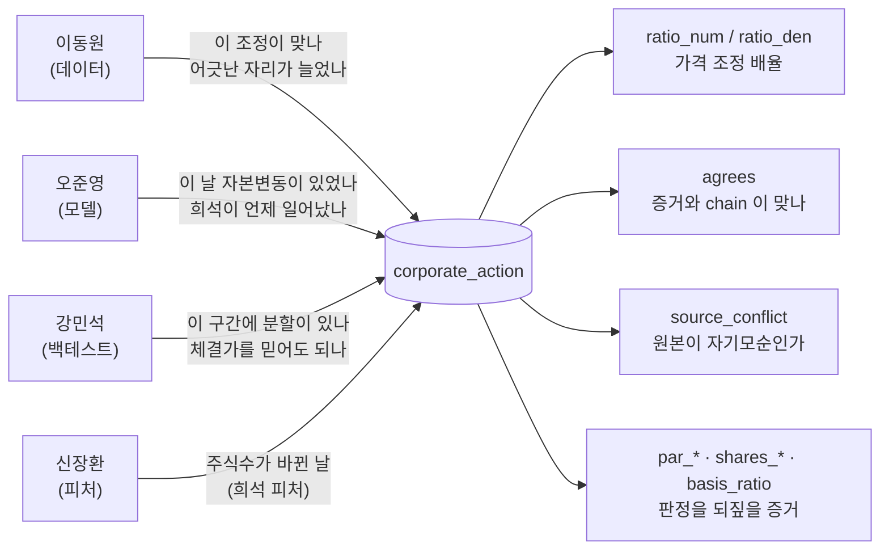
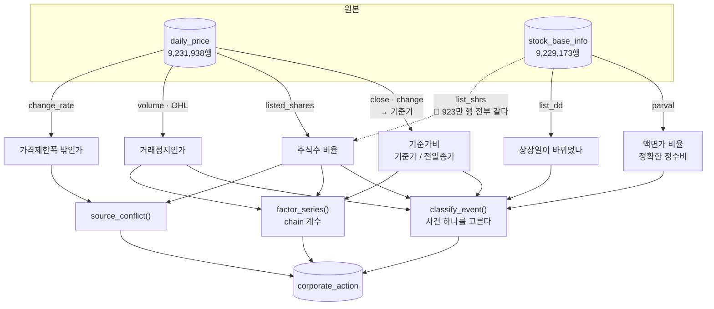
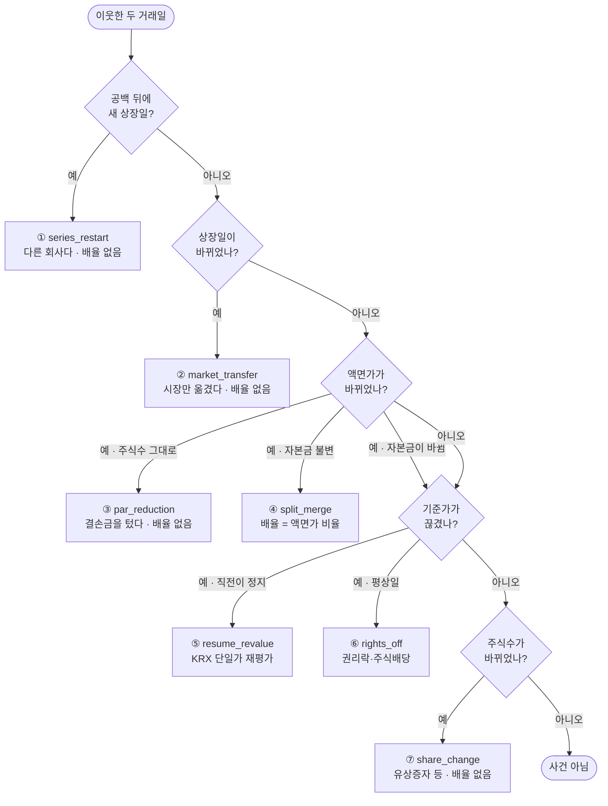
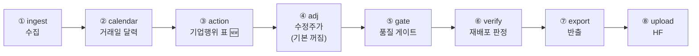

# 기능명세 — 기업행위 이벤트 표: 결과만 있고 사건이 없었다 (v1.8)

> **한 줄로**: 자본변동을 **사건 단위 표**(`corporate_action` · 스키마 v16)로 세우고,
> 기존 조정 판정(chain)과 **독립 증거로 대조**해 어긋난 자리를 표 안에 남긴다.
> 44,290건 · 2,946종 · 판정 가능 730건 중 **어긋남 8건** · 원본 자기모순 **17건(17/17 정리매매)**.
>
> 관련 문서: [ERD v2.6 §2.11](../../erd/version2.6/ERD.md) ·
> [데이터파트 v4.4 D-24](../../데이터파트/version4.4/명세서.md) ·
> [노트북 02/09](../../../notebooks/02-품질·전처리/09.결과만-있고-사건이-없었다.ipynb)(실행본 · 그림 3장) ·
> 이전 판: [v1.7 버튼 갱신 파이프라인](../version1.7/버튼_갱신_파이프라인.md)(7단계 → **8단계**로 늘었다)
>
> 코드: [`common/corporate_actions.py` §6](../../../common/corporate_actions.py)(판정) ·
> [`ingest/store/action_store.py`](../../../ingest/store/action_store.py)(적재) ·
> [`ingest/store/migrations.py` v16](../../../ingest/store/migrations.py)(스키마) ·
> [`scripts/build_corporate_actions.py`](../../../scripts/build_corporate_actions.py)(실행·보고) ·
> 시험: [`tests/test_corporate_action_events.py`](../../../tests/test_corporate_action_events.py) (**28건**)

---

## 0. 왜 만들었나 — 조정된 가격과 조정을 일으킨 사건은 다른 자료다

우리 시세에는 **결과만** 있었다.

| 있던 것 | 무엇을 말하나 |
|---|---|
| `daily_price.adj_close` 외 3칸 | 이미 펴진 값 |
| `daily_price.adj_source` | 그 값이 `fdr` 에서 왔나 `chain` 에서 왔나 |

*"무슨 일이 언제 얼마만큼 일어났나"* 는 어디에도 없었다. 물을 때마다
`common.corporate_actions.adjustment_factor` 로 923만 행을 훑어 **역산**해야 했고,
그 한 번이 4분이다.

zipline 이 `splits`·`mergers`·`dividends` 세 표를 따로 두는 이유가 이것이다. 배당은
[v14](../../erd/version2.6/ERD.md) 에서 이미 표가 됐으므로, 여기서 나머지 자본 사건을 세운다.

⚠️ **이름이 겹치는 것과 헷갈리지 않는다.** `supply/training.py` 의
`CORPORATE_ACTION_COLUMNS`(`is_liquidation`·`is_halted`·`is_first_listing`)는 *"이 행의
가격을 믿어도 되나"* 를 말하는 **행 단위 깃발**이고, 이 표는 *"무슨 사건이 있었나"* 를
말하는 **사건 단위 기록**이다. 둘은 같은 자리에서 만나지만 답하는 질문이 다르다.

---

## 1. 유스케이스 — 누가 무엇을 묻나



**전에는** 이 질문마다 923만 행을 훑었다. **지금은** `code`·`ex_date` 로 조회한다.

---

## 2. 어디서 나오나 — 증거의 출처



🔴 **`stock_base_info.list_shrs` 는 독립 출처가 아니다.** 설계할 때는 다른 API 에서 오니
대조에 쓸 수 있으리라 봤는데, 겹치는 **9,229,173행 전부 `daily_price.listed_shares` 와
같았다**(불일치 0). 대조가 아니라 복사였다. 이 표가 홀로 주는 것은 **액면가와 상장일**
둘뿐이다(`isin_cd` 는 우리 구간에서 한 번도 안 바뀐다 — 0건).

---

## 3. 사건을 어떻게 고르나 — 갈래 일곱, 먼저 맞는 것 하나



### 왜 ③④를 ⑤⑥보다 먼저 보나

**액면분할은 전부 재개일에 있다.** 주권 교체 때문에 KRX 가 반드시 거래를 정지시킨다.
재개일이라는 이유로 ⑤에 넘기면 판정이 기준가로 가는데, KRX 가 기준가를 안 고친 자리에서는
**사건이 통째로 사라진다** — 그러면 어긋남을 셀 수가 없다(§6 의 17건이 그 자리다).

### 왜 자본금으로 가르나 — 액면가만 보면 42건을 10배 망친다

액면가 변경 792건을 자본금(`액면가 × 주식수`)으로 가르면 성격이 셋으로 갈린다.

| 갈래 | 건수 | 가격이 움직이나 |
|---|---:|---|
| 순수 분할·병합 (자본금 불변) | **666** | 액면가 비율만큼 정확히 |
| 동시사건 (자본금이 바뀜) | **84** | 액면가로는 설명 못 함 → ⑤⑥으로 넘김 |
| **액면가 감액** (주식수 그대로) | **42** | **안 움직인다** — 결손금을 턴 것뿐 |

액면가 감액 42건에 액면가 비율(1/10)을 적용하면 멀쩡한 과거를 10배 망친다.
**42건 전부에서 chain 도 조정하지 않았다** — 42/42 맞음.

### 왜 배율이 유리수 두 칸인가

1/50 · 1/1500 같은 계수가 한 종목의 수천 행에 누적으로 곱해진다. `REAL` 로 담으면
반올림이 다시 들어온다(`adjustment_factor` 가 `Fraction` 을 주는 것과 같은 이유).
쓰는 쪽에서 **마지막에 한 번만** `float` 로 바꾼다.

### 왜 한 거래일에 행이 하나인가

액면분할과 유상증자가 같은 날 날 수 있다. 그래도 행은 하나다 — 증거 칸
(`par_before/after` · `shares_before/after`)에 둘 다 남으므로 희석은 그대로 보이고,
종류를 둘로 쪼개면 **"이 날의 가격 배율" 이 두 줄이 되어 쓰는 쪽이 곱해 버린다.**

---

## 4. 표 — `corporate_action` (스키마 v16)

| 칸 | 형 | 무엇 |
|---|---|---|
| `code` · `ex_date` · `event_type` | TEXT | **기본키.** `ex_date` 는 사건이 **가격에 반영된 첫 거래일** — 공시일도 결의일도 아니다 |
| `ratio_num` · `ratio_den` | INTEGER | 가격 조정 배율(유리수). **가격이 연속인 사건은 비운다** |
| `source` | TEXT | 무엇을 보고 정했나 — `par`·`shares`·`basis`·`listing`·`none` |
| `par_before` · `par_after` | **TEXT** | ⚠️ 액면가는 숫자가 아닐 수 있다 — `'무액면'` 73,713행 · 주식예탁증권의 `'0'` 7,616행 · 외국주의 `'.5'`. 숫자로 강제하면 그 행이 조용히 결측이 된다 |
| `shares_before` · `shares_after` | INTEGER | 상장주식수 |
| `basis_ratio` | REAL | KRX 기준가 / 전일종가 |
| `chain_num` · `chain_den` | INTEGER | `adj_price` 가 **실제로 쓴** 계수 (`factor_series`) |
| `agrees` | INTEGER | 증거와 chain 이 맞나 (§5) |
| `source_conflict` | INTEGER | 원본 두 칸이 서로 모순인가 (§6) |
| `is_liquidation` | INTEGER | 그 날이 정리매매 구간인가 — 어긋남의 해명 |
| `built_at` | TEXT | 만든 시각 |

인덱스 둘: `idx_ca_date(ex_date, code)`(일별 점검) · `idx_ca_type(event_type, agrees)`
(붉은불 조회가 전수 훑기가 되면 아무도 안 본다).

### 실측 (2026-09-10 · 적재 264초)

| 종류 | 행 | 배율 | 맞음 | 어긋남 | 못 잼 |
|---|---:|---:|---:|---:|---:|
| `share_change` | 39,584 | 0 | — | — | 39,584 |
| `rights_off` | 3,191 | 3,191 | — | — | 3,191 |
| `resume_revalue` | 783 | 783 | — | — | 783 |
| `split_merge` | 666 | 666 | 662 | **4** | 0 |
| `par_reduction` | 42 | 0 | 42 | 0 | 0 |
| `market_transfer` | 22 | 0 | 18 | **4** | 0 |
| `series_restart` | 2 | 0 | — | — | 2 |
| **합계** | **44,290** | 4,640 | 722 | **8** | 43,560 |

2,946종 · `20100105`~`20260904`.

---

## 5. 🔴 초록 3,974건이 무의미했다 — `agrees` 를 아무 데나 매기지 않는 이유

처음에는 배율이 있는 사건을 **전부** chain 과 대조했다. `rights_off` 3,191건과
`resume_revalue` 783건이 **전부 "맞음"** 으로 나왔다.

당연하다. 이 둘은 배율을 `adjustment_factor` 에서 얻는데 그것을 다시 `factor_series` 와
견줬다. **검사가 대상과 같은 값을 쓴다.** 초록이 아무것도 뜻하지 않는다.

이 함정은 이미 아는 것이었다 — `series_restart` 에는 피해 놓고(같은 `is_series_restart`
를 공유하므로) 바로 옆자리에서 밟았다. 그래서 **chain 이 배율 계산에 쓰지 않는 축만**
재도록 좁혔다.

| 증거 축 | chain 이 이 축을 쓰나 | 판정 |
|---|---|---|
| `par` (액면가) | 안 쓴다 | ✅ 독립 — 708건 |
| `listing` (상장일) | 재시작 판정에만 쓴다 (이전상장은 안 쓴다) | ✅ 이전상장 22건만 |
| `basis` (기준가) | **이것이 곧 chain 이다** | ❌ 순환 |
| `shares` (주식수) | ㉠ 갈래에서 쓴다 · 애초에 배율을 예고하지 않는다 | ❌ 예고 없음 |

### 문턱은 분포가 정했다

`split_merge` 666건에서 `|chain / 액면가배율 − 1|` 을 전수로 재니 **8.408e-06 과
7.457e-01 사이가 통째로 비어 있다 — 88,700배다.**

아래 662건은 전부 **단수주**다. chain 은 재개일에 주식수 배율을 쓰는데(`㉠`) 그 비율이
정수가 아니다.

```
417180  액면가배율 0.2   ·  주식수비 0.1999999658   (4주 차이)
```

액면가 비율만 KRX 가 정한 **정확한 정수비**다. 같은 사건을 두 축이 마지막 자리까지 다르게
부르는 것이므로 어긋남이 아니다. 빈 구간의 낮은 쪽에 붙여 **`AGREE_TOLERANCE = 1e-4`**
로 뒀다 — 정상 자리를 잃는 것이 오검출보다 비싸다
([`adj_price.CA_BASIS_TOLERANCE`](../../../ingest/store/adj_price.py) 와 같은 판단).

### 어긋난 8건 — 네 갈래

| 자리 | 무엇인가 | 판정 |
|---|---|---|
| `084810` 아이알디 · `055250` 다휘 | 정리매매 재개일 — KRX 가 기준가를 안 고쳤다 | §6 |
| `221610` 자안 · `309930` 조이웍스앤코 | 재개일 재평가 — 액면분할 **말고도** 무슨 일이 더 있었다 | chain 이 맞다 |
| `030790` 동양시스템즈 · `035720` 카카오 · `068270` 셀트리온 | 이전상장 — 기준가가 **1 틱** 다르다 (0.04~0.4%) | 호가단위 차이 |
| `031440` 신세계푸드 | 이전상장인데 기준가가 **8.2%** 다르다 | 남겨 둔다 |

앞의 셋은 사건을 **더 잘 설명한 쪽이 chain** 이라 표가 배율을 고치지 않는다. 이 표의 일은
판정을 바꾸는 것이 아니라 **어긋난 자리를 남기는 것**이다.

---

## 6. `source_conflict` — chain 을 안 쓰고 재는 축

§5 에서 `basis` 갈래는 순환이라 못 잰다고 했다. 그러면 그쪽은 아무것도 못 보나 —
**원본 두 칸이 서로 모순인지**는 chain 과 무관하게 잴 수 있다.

> 주식수가 **1.5배 밖**으로 바뀌었는데, 그 날 KRX 등락률이 **가격제한폭 밖**이다.

같은 원본이 *"주식수가 1,500분의 1 이 됐는데 가격은 그 폭만큼 움직였다"* 고 말하는 셈이다.

### 실측 17건 — 17/17 정리매매 · 17/17 기준가비가 정확히 1

| code | 적용일 | 종류 | 주식수비 | 등락률 |
|---|---|---|---:|---:|
| 047940 | 20100120 | share_change | 0.05 | +163.16% |
| 084810 | 20100323 | split_merge | 0.1 | −66.67% |
| 068770 | 20100608 | share_change | 0.0333 | +266.67% |
| … | | | | |
| **052670** 제일바이오 | **20260209** | share_change | **0.000667** | **+29,948.08%** |

**17건 모두 그 종목의 마지막 7거래일에서 시작한다.** 우연이 아니다 — `LIQUIDATION_DAYS`
주석이 이미 적어 둔 사실이다:

> 한국은 상장폐지가 확정되면 통상 **7거래일간 정리매매**를 하는데 **그 구간만
> 가격제한폭이 적용되지 않는다.**

### 그래서 값을 고치지 않는다 — 셋을 확인하고 내린 결론

1. **원본 오류가 아니다.** 정리매매 구간에는 가격제한폭이 없다. KRX 가 그 구간의 기준가를
   안 고칠 뿐이다.
2. **이미 덮여 있다.** 17건 전부 `is_liquidation` 이고 `training_frame` 이 기본으로
   덜어낸다 — **학습 표본으로 새는 것은 0건**이다.
3. **고치면 손해다.** 수정주가를 다시 만들면 FDR 창이 밀린 만큼 옛 행이 `chain` 으로
   내려앉는다. 전부 상장폐지된 종목이라 얻는 것이 없다.

빌더는 *"정리매매로 설명되지 않는 자리가 있으면"* 그 자리에서 붉은불을 켠다. 지금은 0 이다.

---

## 7. 언제 다시 까나 — `refresh` 의 8번째 단계



`action` 이 `calendar` **뒤**이고 `adj` **앞**인 데 뜻이 있다.

| | 왜 |
|---|---|
| 달력 **뒤** | `is_series_restart` 가 거래일 공백을 세는 데 달력이 든다. 달력이 낡으면 공백을 못 세고 사건 종류가 바뀐다 |
| 수정주가 **앞** | chain 계수를 `adj_close` 가 아니라 `factor_series` 에서 **직접** 얻으므로 `adj` 에 안 기댄다. 평소에 꺼 두는 `adj` 와 운명을 같이하지 않게 앞에 둔다 |

이것은 [v1.7](../version1.7/버튼_갱신_파이프라인.md) 이 `calendar` 를 `adj` 에서 떼어낸 것과
같은 판단이다 — **값이 싼 일을 비싼 일 옆에 두면 같이 꺼진다.** 그때는 사흘 동안 달력만
뒤에 남았다.

**끄는 스위치가 없다.** `trading_calendar` 와 같은 파생물이라 시세가 늘면 곧바로 낡는데,
낡아도 예외가 안 난다 — 새 액면분할이 표에 없을 뿐이다. 비용은 4분이고 원가격은 안 건드린다.

---

## 8. 시험 — 28건

| 묶음 | 무엇을 못 박나 |
|---|---|
| 갈래마다 하나 (8건) | 일곱 종류 + "아무 일도 없으면 사건이 아니다" |
| 액면가가 숫자가 아닐 때 (2건) | `'무액면'`·`'0'` · 기본정보가 없는 날 |
| 대조 `agrees` (3건) | 배율 있음 · 연속 예고 · 못 재는 종류 |
| 시계열 (3건) | 한 거래일에 행 하나 · 첫 행은 사건 아님 · chain 1 을 안 적음 |
| 🆕 문턱 (3건) | 단수주는 어긋남이 아니다 · 문턱 밖은 어긋남 · **문턱이 빈 구간 안에 있다** |
| 🆕 순환 (2건) | 기준가 배율은 대조하지 않는다 · 재는 축은 셋뿐이다 |
| 🆕 자기모순 (4건) | 주식수만·등락률만으로는 모순이 아니다 · 모르면 안 친다 |
| 계약 (3건) | `EVENT_TYPES` ↔ CHECK · 칸 목록 ↔ 튜플 길이 |

`test_문턱은_빈_구간_안에_있다` 는 상수를 옮길 때 막는 시험이다 — 문턱이 빈 구간
밖으로 나가면 662건이 붉어지거나(아래) 4건을 놓친다(위).

---

## 9. 남은 것

| | 무엇 | 왜 지금 안 했나 |
|---|---|---|
| 🔵 | 반출(HF)에 `corporate_action` 을 싣기 | 팀원이 쓸 자리가 정해지면. 지금은 DB 조회로 충분하다 |
| 🔵 | `031440` 이전상장의 기준가 8.2% | 한 건이고 2010년 · 유니버스 밖. 표에 남겨 뒀다 |
| 🔵 | `adjustment_factor` docstring 의 낡은 결함 기록 | 지금 DB 의 101970 은 이미 고쳐져 있다(배율 0.685~1.000). 다음 세션 |
| 🔵 | DART 공시로 사건 종류를 교차확인 | 3,899건(권리락·감자)은 우리 DB 에 독립 증거가 없다 |
