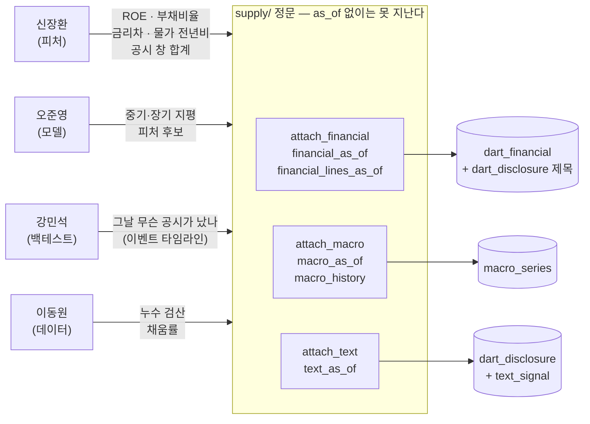
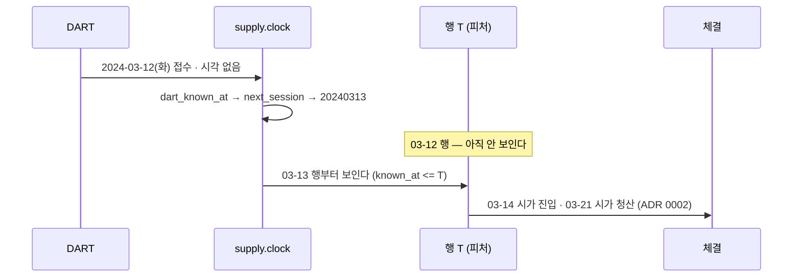
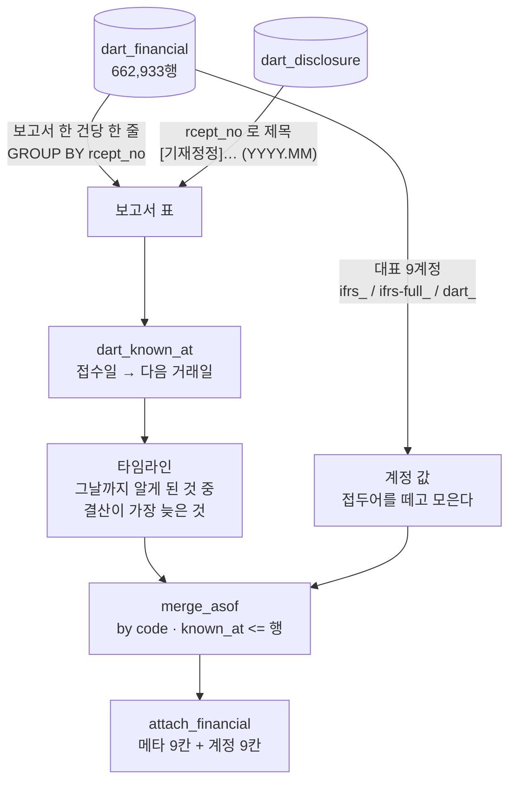
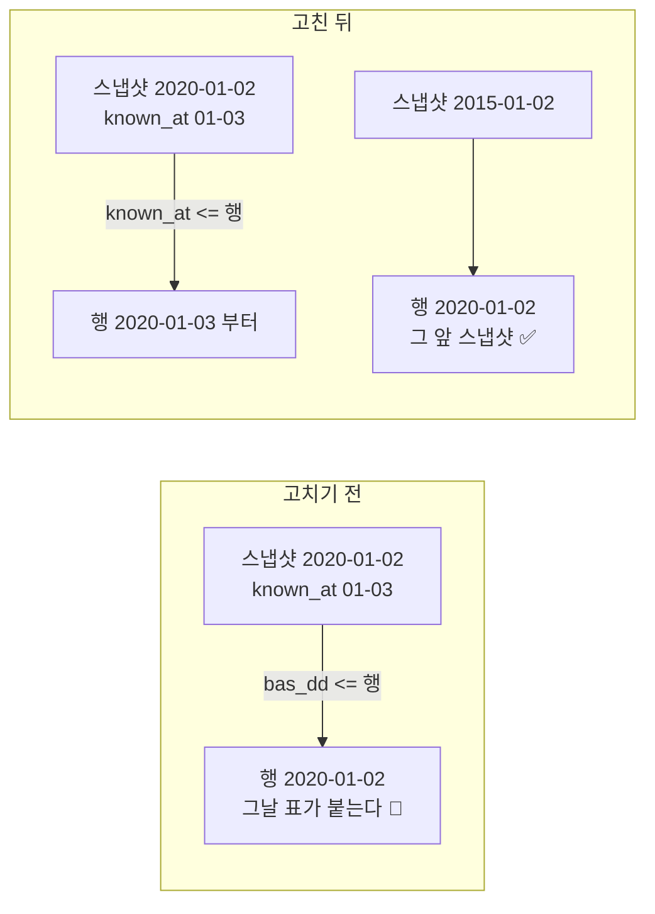

# 기능명세 — 중기·장기 원천 정문: 모아 둔 것을 팀이 꺼내 쓰게 연다 (v1.9)

> **한 줄로**: 재무·거시·공시 텍스트 — 모아 두기만 했던 원천 넷에 `as_of` 정문 셋을 열었다.
> 규칙은 하나다 — **행 T 에 보이는 것은 `known_at <= T` 인 것뿐.** 여는 도중 같은 종류의
> **하루 누수**를 업종·주권종류 붙이기에서 찾아 함께 고쳤다.
>
> 관련 문서: [데이터파트 v4.5 §2.3](../../데이터파트/version4.5/명세서.md) (D-33 ~ D-36) ·
> [ERD v2.7 §1.5](../../erd/version2.7/ERD.md) · [핵심코드 v1.4 ③ §7~§8](../../핵심코드/version1.4/03-공급-정문-asof.md) ·
> [노트북 01/09](../../../notebooks/01-데이터수집/09.모아둔-것을-정문으로-연다.ipynb)(실행본 · 그림 7장) ·
> 이전 판 [v1.8 기업행위 이벤트 표](../version1.8/기업행위_이벤트_표.md)
>
> 코드: [`supply/clock.py`](../../../supply/clock.py)(`row_day` · `dart_known_at`) ·
> [`supply/financial.py`](../../../supply/financial.py) · [`supply/macro.py`](../../../supply/macro.py) ·
> [`supply/text.py`](../../../supply/text.py) · 하루 누수 [`supply/sector.py`](../../../supply/sector.py) ·
> [`supply/universe.py`](../../../supply/universe.py) · [`scripts/verify_hf_dataset.py`](../../../scripts/verify_hf_dataset.py)
>
> 시험: `test_supply_financial.py` **21** · `test_supply_macro.py` **14** · `test_supply_text.py` **15** ·
> `test_supply_sector.py` +1 · `test_export_judgment_columns.py` +3 — 전체 **1,715 passed · 3 xfailed** ·
> PR [#243](https://github.com/devlee328288/Alpha_Stack/pull/243) (머지 2026-09-11)

---

## 0. 왜 만들었나 — 원천은 다 있는데 정문이 없었다

| 원천 | 규모 (실측 2026-09-11) | 시점 칸 |
|---|---:|---|
| `dart_financial` 재무 | 662,933행 · 350종 · FY2015~2025 · 보고서 3,209건 | `rcept_dt` 접수일 |
| `macro_series` 거시 | 17,864행 · 9종 · 2009-08 ~ | `known_at` (계산값) |
| `dart_disclosure` 공시 목록 | 1,555,556행 · 2010-01-04 ~ 2026-09-04 | `rcept_dt` 접수일 |
| `text_signal` 제목 감성 | 18,600행 · 고유 제목마다 | **없음** — 공시에서 온다 |

`supply/` 에서 이 넷을 읽는 곳은 품질 원장(건수 세기) 하나뿐이었고, `features/` 에서는 **0건**이었다
(2026-09-10 grep). 피처 파트가 쓰려면 저장소를 직접 부르거나 HF 파일을 받아 각자 시점을 맞춰야
했다 — 그리고 각자 맞추는 시점은 조용히 갈라진다.

🔴 **지평이 길어지면 미래참조가 더 위험하다.** t+61 을 예측하면서 재무를 **결산기**에 붙이면
석 달 미래가 들어간다. 5일 지평이면 우연히 안 겹칠 수 있지만 길어지면 반드시 겹친다.

---

## 1. 유스케이스 — 누가 무엇을 묻나



---

## 2. 규칙 하나 — `known_at <= 행 날짜`

| 원천 | `known_at` | 예 |
|---|---|---|
| 재무 | 접수일 **다음 거래일** (`dart_known_at`) | 2024-03-12(화) 접수 → **03-13 행**부터 → 03-14 시가 진입 |
| 공시 텍스트 | 접수일 다음 거래일 — **HF 텍스트 반출과 같은 규칙** (`rceptDt+1session`) | 금요일 접수 → 월요일이 휴장이면 **화요일** |
| 거시 | 발표 규칙으로 계산한 날 (`ecos_data.RELEASE_RULES`) | 7월 CPI → 8월 10일 · 경기지수 → 9월 5일 |
| 🆕 업종 | 스냅샷 날짜의 다음 거래일 (**고침**) | 2020-01-02 스냅샷 → 01-03 행부터 |
| 🆕 주권종류 | 기본정보 날짜의 다음 거래일 (**고침**) | 상장 첫날 행은 빈다 |



**왜 다음 거래일인가 (2026-09-11 합의).** `rcept_dt` 에는 시각이 없다. 당일 규칙(행 T 가 T일 접수까지
본다)도 누수는 아니지만 — 행 T 의 `as_of` 가 T+1 0시라 T일 17시 접수는 알 수 있었다 — 이미 HF 에
배포한 텍스트 반출이 다음 거래일 규칙이고, 조사 [`공시시점정합.md` §4.1](../../조사/공시시점정합.md) 도
같다. **같은 DART 접수일에 규칙이 둘이 되지 않게** 하루를 잃는 쪽을 골랐다. 두 곳의 규칙 이름과
계산이 같은지는 시험이 대조한다(`test_텍스트_반출과_시점_규칙이_같다`).

---

## 3. 재무 정문 — 결정 넷

### 3.1 흐름



### 3.2 🔴 정정본 26% — 정정일 그대로 (2026-09-11 합의)

DART 재무 API 는 판(vintage)을 고를 수 없어 **마지막 정정본**을 준다. `dart_financial.report_nm` 은
전부 "사업보고서" 라 안 보이는데, 접수번호로 공시 목록에 붙이면 드러난다.

| | 값 |
|---|---:|
| 보고서 | 3,209 |
| `[기재정정]` 으로 받은 보고서 | **835 (26.0%)** (`[첨부추가]` 6건까지 841) |
| 정정일 − 원본 최초 접수일 | 중앙값 **61일** · 최대 **2,378일** (두산 FY2017: 2018-03-30 → 2024-10-02) |
| 결산기 끝 → 저장된 접수일 1년 초과 | 148건 — **전부 정정본** |

원본 접수일로 당기면 채움률은 오르지만 **정정된 숫자를 원본 날짜에 붙인다** — 재작성 누수다. 그래서
저장된 접수일(정정일)을 그대로 쓰고, 그 해는 정정일까지 안 보이며, 잃는 몫은 노트북에서 센다.
`fin_amended` 는 붙인 보고서가 첫 제출본이 아니라는 표시로, **그 보고서 자신의 제목**에서 읽으므로
접수 시점에 알 수 있던 사실이다.

### 3.3 🔴 "가장 최근" 은 알게 된 순서가 아니라 결산 순서다

정정본은 옛 해를 늦게 드러낸다. 현대자동차 FY2015 는 2022-02-17 정정본이다. `merge_asof` 를 접수일에
그대로 걸면 *"가장 최근에 알게 된 보고서"* 가 붙어서 **2022-02 에 FY2020 자리를 FY2015 가 차지한다.**
예외는 안 난다. 그래서 알게 된 순서대로 훑으며 결산이 가장 늦은 것을 들고 가는 타임라인(`_timeline`)을
만들고 그것을 `merge_asof` 로 붙인다(`test_늦게_드러난_옛_해가_최신_해를_밀어내지_않는다`).

### 3.4 계정 — 넓은 표 + 긴 표 (2026-09-11 합의)

표준계정 id 접두어가 **FY2018 까지 `ifrs_` · FY2019 부터 `ifrs-full_`** 이다(실측). 뒷부분으로 모으면:

| 칸 | 계정 | 보고서 기준 채움 |
|---|---|---:|
| `fin_total_assets` · `fin_total_liabilities` | 자산 · 부채 | 99.9% |
| `fin_total_equity` | 자본 | 99.4% |
| `fin_net_income` | 당기순이익 (IS 먼저 · CIS 와 값이 다른 보고서 0) | 98.5% |
| `fin_operating_cash_flow` | 영업현금흐름 | 97.8% |
| `fin_operating_income` | 영업이익 (`dart_`) | 97.4% |
| `fin_revenue` | 매출 (은행·보험의 "영업수익" 은 빈 칸) | 95.9% |
| `fin_equity_parent` · `fin_net_income_parent` | 지배지분 · 지배순이익 | 87.6% · 81.0% |

메타 9칸 — `fin_bsns_year` · `fin_reprt_code` · `fin_fs_div` · `fin_period_end`(제목의 `(YYYY.MM)` 말일 ·
**12월로 가정하지 않는다** — 6월 결산 2건) · `fin_rcept_no` · `fin_rcept_dt` · `fin_known_at` ·
`fin_amended` · `fin_report_nm`. 다른 계정은 `financial_lines_as_of` 의 `account_key`(접두어를 뗀 id).
**비율은 만들지 않는다** — 원값까지가 정문의 몫이다.

---

## 4. 거시 정문

| 결정 | 무엇 | 왜 |
|---|---|---|
| 시점 | `known_at <= 행` · 기간이 가장 늦은 값 | ECOS 는 기준월 1일로 준다 — 붙이면 물가 한 달, 경기지수 두 달 미래 |
| 🔴 순환변동치 기본 제외 (합의) | `leading`·`coincident` 는 `indicators=` 로 이름을 적어야 나온다 | 추세를 새로 추정할 때마다 과거 값이 고쳐지는 계열인데 우리는 **2026-09 판 하나**뿐이고 `raw_response` 에 ECOS 원문이 없어 개정을 **잴 수 없다** |
| 모양 (합의) | 지표마다 `macro_<id>` + `macro_<id>_period` · 전년비는 `macro_history` | 월별 값은 한 달 내내 이어진다 — 기간 칸이 없으면 낡은 값인지 모른다 |
| 빈 기간 | ECOS 가 `-` 를 준 기간은 건너뛴다 | 저장 계층 `macro_store.as_of` 와 같은 규칙 · 기간 칸이 그 사실을 드러낸다 |

⚠️ CPI·PPI 는 기준연도 개편(2020=100)으로 옛 **수준값**이 당시 발표치와 다르다. 비율로 쓴다.

---

## 5. 공시 텍스트 정문

| 결정 | 무엇 |
|---|---|
| 시점 | 날짜 없는 제목 점수를 **공시의 접수일**로 — `text_sha = sha256(제목)[:16]`(200/200 확인) · 공시 155만 행 **100% 조인** |
| 종목 배정 | 공시의 `stock_code` — 공시의 **주인**. 제출인(`flr_nm`)이 증권사·대주주여도 그 회사에 붙는다 |
| 🔴 `rm` 으로 거르지 않는다 | '정'(뒤에 정정됨 · 해마다 6,725~15,601건)·'철'(철회됨 · 8~99건)은 **나중에 붙는 표시**다. 거르면 그 자체가 미래참조 |
| 결측 | 공시가 없던 날은 `text_n = 0`(사실) · **수집 구간 밖은 결측** — 안 받은 날을 "공시 없음" 으로 읽지 않는다 |
| 🔴 신호 | 5일 방향과 **Cramér's V 0.026** — 이벤트 타임라인으로 연다. 제목을 그대로 피처로 쓰면 결산연월(시점)을 외운다 |

---

## 6. 🔴 하루 누수 — 여는 도중 찾았다 (2026-09-11 합의 · 같은 PR 에서 고침)

재무 정문을 "행마다 `known_at <= 행`" 으로 만들다가, 이미 있던 붙이기 둘이 **전역 `as_of` 하나로만**
자르고 **날짜로** 조인하고 있는 것을 찾았다. `as_of` 를 넉넉히 주는 반출 경로에서는 그날 마감 뒤에
나온 표가 그날 행에 붙는다. 점 조회 `common_stocks` 는 처음부터 `known_by` 로 막고 있었고 **붙이기만
어긋나 있었다.**



| 칸 | 새 정보를 하루 먼저 본 행 (실측 2026-09-11) |
|---|---|
| 업종 | 스냅샷 당일 40,857행 중 **5,300** (처음 실림 3,630 · 업종 바뀜 1,670) |
| 주권종류 | 소속부 바뀜 **6,276**(중견기업부 → 관리종목 363 포함) · 증권그룹 4 · 주권종류 0 · 상장 첫날 **3,677** |
| 팀 유니버스 | 스냅샷 날 15일 중 **12일** 후보가 바뀌고 합계 **25종목** (가장 많은 날 2018-01-02 · 7종) |

HF 판정기 `verify_hf_dataset._attach_export_derived` 는 주권종류를 **반출과 다른 코드**(같은 날 조인)로
붙이고 있었다 — 반출만 고치면 판정기가 옛 규칙으로 남을 뻔했다. 같은 함수를 부르게 했다.

조합 K 피처는 업종을 쓰지 않으므로 **값은 그대로이고 표본에 드는 행만 바뀐다.** 그래도 개봉 전 동결
원칙상 반출본을 다시 올리고 최종모델 드라이런을 다시 한다(이슈 #240).

---

## 7. 음성 대조군 — 검사가 대상과 같은 계산을 쓰지 않게

누수 검사는 정문의 `known_at` 을 믿지 않고 **달력을 따로 이분탐색**해 센다. 그리고 **시점 규칙 하나만**
바꾼 틀린 구현을 같은 자리에서 돌려 실제로 붉어지는지 본다.

| 정문 | 틀린 구현 | 시험 | 실데이터 (노트북 01/09) |
|---|---|---|---|
| 재무 | ① 결산기 끝 | 1,369행 · 최대 1,873일 미래 | 후보 행의 **23.2%**(1,324행) |
| 재무 | ② 접수일 당일 | **정확히 6행** (정정본 접수일은 안 샌다 — 그날도 결산이 더 늦은 보고서가 이긴다) | — |
| 재무 | ③ 원본 최초 접수일 | 1,020행 = 기대 1,020 | **9.1%**(516행) |
| 거시 | 기간 시작일 | cpi 9행 · ppi 2행 | 기준월 1일이면 월말 행에 그달 값 |
| 텍스트 | 접수일 당일 | 4행 · 토요일 접수는 붙일 행이 없어 놓침 | — |
| 업종 | 스냅샷 날짜로 자르기 | 그 자리에서 대조군을 만들어 '새' 가 붙는 것 확인 | 스냅샷 날 12일 후보 변화 |
| 주권종류 | 같은 날짜 조인 | 대조군 쿼리로 `known_at > 행` 확인 | — |

**무엇이 같은가** — 대조군은 시점만 달라야 대조군이다. 모든 보고서가 드러난 마지막 날에 정문과 ①이
같은 보고서를 붙이는지 센다: 시험 **4/4** · 실데이터 **98.0%**.

---

## 8. 쓰는 법 — 신장환 님께

```python
from supply import attach_financial, attach_macro, attach_text

panel = attach_financial(prices, as_of="2024-09-01")   # 18칸
panel = attach_macro(panel, as_of="2024-09-01")        # 기본 7지표 × 값·기간
panel = attach_text(panel, as_of="2024-09-01")         # text_n · text_p_neg/neu/pos
```

| 하고 싶은 것 | 이렇게 | 조심할 것 |
|---|---|---|
| ROE · 부채비율 | `fin_net_income_parent / fin_equity_parent` | 분모 결측·0 |
| 낡은 재무 거르기 | `(bas_dd − fin_period_end).days > 456` | 정정본은 정정일까지 안 보인다 |
| 다른 계정 | `financial_lines_as_of(..., codes=...)` 의 `account_key` | 접두어는 이미 떼어 두었다 |
| 물가 전년비 | `macro_history("cpi", as_of=...)` 에서 기간끼리 | 결과의 시점은 **늦은 기간의 `known_at`** |
| 경기 순환변동치 | `indicators=("leading",)` | 과거 값이 개정된 2026-09 판 |
| 공시 창 합계 | `text_n` 종목별 롤링 합 | 확률에는 신호가 없다 |

후보 표(`build_sector_candidate_frame`)의 `code` 가 pandas `string` 이어도 `attach_*` 다섯은 돈다(실DB 확인).

---

## 9. 채움률 — 실제 팀 유니버스 (노트북 01/09 · 월말 116일 × 후보 5,703행)

| | 값 |
|---|---|
| 재무가 붙은 행 | **70.8%** — 2015년 0%(FY2014 미수집 · 정상) · 2017~2023년 72~87% · 2024년 92.5% |
| 15개월 넘은 낡은 보고서 | 4.5%(257행 · 32종) — LG화학 2017-07-31 행에 FY2015 (FY2016 은 정정본 2017-08-14 뿐) |
| 붙은 행 중 정정본 | 15.4% (2024년 35.0%) |
| 거시 | 9지표 **100%** · 월말 행의 값은 기간 시작 기준 중앙값 1일(일별) · 60일(금리·물가) · 90일(경기) 전 |
| 공시 텍스트 | 그날 새 공시가 있는 후보 행 **20~36%** · 공시가 있으면 확률 100% |
| 속도 | `attach_financial` 143,500행 4.3초 · `financial_as_of` 한 날짜 3.3초 |

---

## 10. 안 한 것 · 남은 것

- 재무는 **사업보고서만** — 분기·반기를 받으면 정문은 그대로(`REPORT_ORDER` 가 결산 순서를 안다)
- 정정 전 판은 XBRL 원문 파싱이 필요 — 1차 범위 밖(조사 §4.3)
- 거시 옛 판이 없다 — 받을 때마다 `raw_response` 에 원문을 쌓으면 다음부터 개정을 잰다
- 재무·거시·텍스트를 HF 반출에 **실을지** 는 아직 정하지 않았다 (지금은 DB 정문으로만)
- 비율·창 합계 같은 **피처화는 피처 파트** — 이 문서 §8 이 넘기는 자리다
