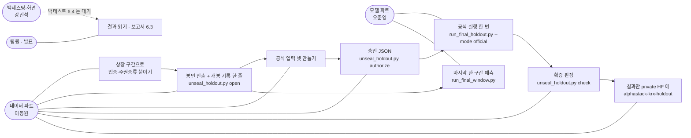
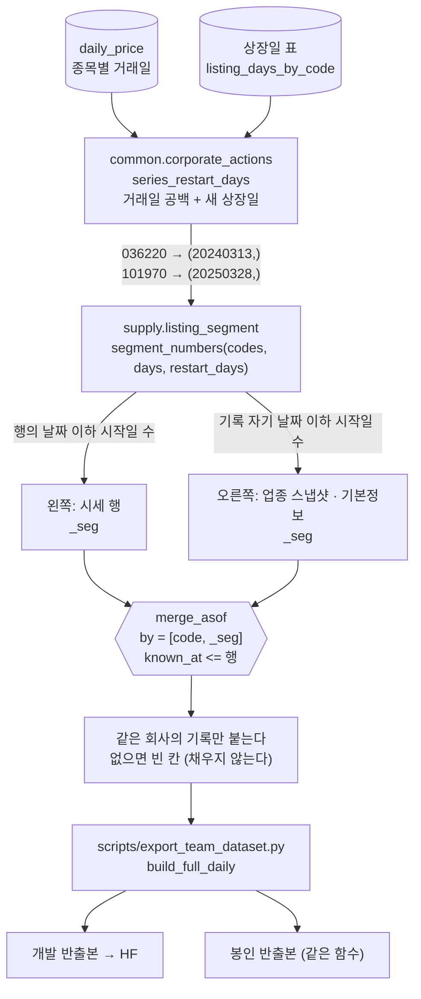
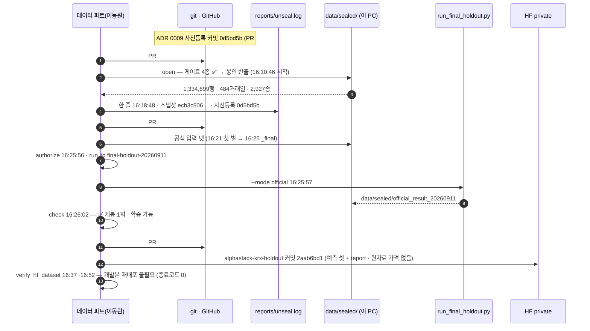
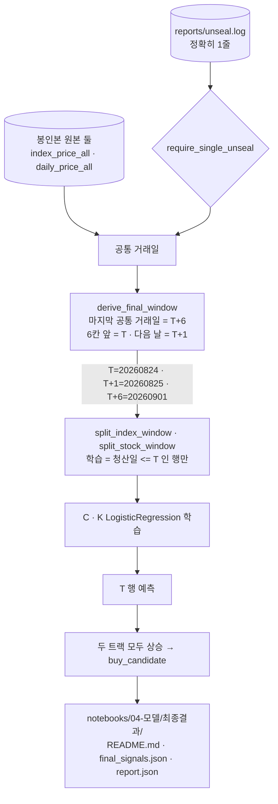

# 상장 구간 판정과 홀드아웃 개봉·실행 — 기능명세 v2.0 (부분판)

> 2026-09-14 · 이동원 · 실측은 2026-09-11 로그와 2026-09-14 재대조
> 코드 [`supply/listing_segment.py`](../../../supply/listing_segment.py) ·
> [`supply/sector.py`](../../../supply/sector.py) `attach_industry` ·
> [`supply/universe.py`](../../../supply/universe.py) `attach_security_type` ·
> [`supply/holdout.py`](../../../supply/holdout.py) · [`scripts/unseal_holdout.py`](../../../scripts/unseal_holdout.py) ·
> [`scripts/run_final_window.py`](../../../scripts/run_final_window.py) · [`models/final_window.py`](../../../models/final_window.py)
> 근거 [ADR 0009 최종 홀드아웃 실행설정 — 개봉 전에 봉인한 설정](../../decisions/0009-최종-홀드아웃-실행설정.md) ·
> [ADR 0010 개봉 후 마지막 T+1→T+6 한 구간 평가](../../decisions/0010-개봉후-마지막-예측구간.md) ·
> 절차 전문 [데이터파트 v4.6 홀드아웃 개봉 절차](../../데이터파트/version4.6/홀드아웃_개봉_절차.md)
> PR #253(상장 구간) · #255(개봉 기록) · #256(승인·결과) · #257~#259(마지막 구간 실행기 · 오준영) · 이슈 #240

**Major 판입니다.** v1.x 는 *"자료를 어떻게 모으고 꺼내나"* 였고, 이 판부터는 **그 자료로 한 번뿐인 평가를
어떻게 치렀나**를 적습니다. 두 기능이 한 판에 들어간 이유는 **앞의 것이 뒤의 것의 전제조건**이었기
때문입니다 — 상장 구간을 고치기 전에는 홀드아웃을 열 수 없었습니다.

---

## 0. 한 줄

| 기능 | 한 줄 |
|---|---|
| 상장 구간 판정 | 한 종목코드 안에 회사가 둘이면 **같은 회사의 기록만** 붙인다 |
| 홀드아웃 개봉·실행 | **한 번** 열고, 열었다는 사실을 **한 줄**로 남기고, 봉인해 둔 설정으로 **한 번** 돌린다 |
| 마지막 한 구간 (ADR 0010) | 연 자료의 끝에서 T+1→T+6 **한 구간**을 예측해 종목표로 공유한다 — 2년 확증 평가와 따로 적는다 |

---

## 1. 유스케이스

| 유스케이스 | 누가 | 입력 | 산출 |
|---|---|---|---|
| 상장 구간으로 붙이기 | 데이터 | `daily_price` · 상장일 표 | 반출본·봉인본의 업종·주권종류 칸 |
| 개봉 | 데이터 · 팀 합의 뒤 | DB · 사전등록 커밋 | `data/sealed/holdout_20240901_20260901/` · `reports/unseal.log` 1줄 |
| 공식 입력 넷 | 데이터(모델 파트 경로 그대로) | 봉인본 | `index_dev` · `index_holdout` · `stock_dev` · `stock_holdout` |
| 승인 | 데이터 | 기록 · 설정 · 입력 넷 | `reports/holdout_authorization.json` |
| 공식 실행 | 모델 파트 실행기 | 승인 · 입력 넷 | 예측 parquet 셋 · `report.json` |
| 확증 판정 | 데이터 | 기록 · 승인 · 결과 | "확증 가능" / "확증 불가" |
| 마지막 한 구간 | 모델 파트 | 봉인본 원본 둘 · 기록 | `notebooks/04-모델/최종결과/` 셋 |

---

## 2. 상장 구간 판정

### 2.1 무엇이 틀렸었나

상장폐지된 종목의 코드를 몇 년 뒤 다른 회사가 다시 받습니다. 우리 자료에서는 두 곳입니다
(`daily_price` 9,231,938행 · 같은 코드 안에서 거래일 공백이 있는 곳이 이 둘뿐 · 2026-09-11 실측).

| 코드 | 앞 회사 | 뒤 회사 |
|---|---|---|
| `036220` | 인포피아 (~2016-05-04) | 오상헬스케어 (2024-03-13 상장) |
| `101970` | 우양에이치씨 (~2015-03-16) | 우양에이치씨 (2025-03-28 상장) |

업종(`attach_industry`)과 주권종류(`attach_security_type`)는 *"그 행의 날짜까지 알게 된 가장 최근 기록"* 을
붙였고, 그 기록이 **얼마나 오래됐는지는 묻지 않았습니다.**

| 칸 | 개발구간 (반출본) | 홀드아웃 (봉인본) |
|---|---:|---:|
| 업종 4칸 | **74행** · `036220` 2024-03-13 ~ 07-01 · 2016-01-04 스냅샷 | **187행** · `101970` 2025-03-28 ~ 2026-01-02 · 2015-01-02 스냅샷 |
| 주권종류 3칸 | 1행 · 상장일 (업종이 바뀐 첫 행과 **같은 행**) | 1행 · 상장일 |
| 바뀐 행 (어느 칸이든) | **74** | **187** |

🔴 **값으로 대조해도 안 보였습니다.** 붙어 있던 옛 값('제약' · '금속' · '보통주')이 새 회사의 나중 값과
우연히 같았고, 재배포 판정기(`verify_hf_dataset`)는 반출과 **같은 함수**로 붙여서 같은 잘못을 공유했습니다.
그래서 수정 확인은 판정기가 아니라 **구간을 지키는 단순 루프**(다른 코드)로 기대값을 만들어 했습니다 —
두 종목 전 행 불일치 0 (PR #253 · `logs/measure_code_reuse_out.txt`).

### 2.2 구간번호 — 어떻게 가르나

| 규칙 | 왜 |
|---|---|
| 구간번호 = **그 날짜 이하의 구간 시작일 수** · 시작일 당일은 새 구간 | `merge_asof` 의 `by` 에 넣으면 다른 구간의 기록은 후보에 오르지 않는다 |
| 기록은 `known_at` 이 아니라 **자기 날짜**(`bas_dd`)로 구간을 센다 | 상장일보다 앞선 기본정보가 전 종목 0행 — 기록의 날짜가 곧 그 기록이 말하는 회사다 |
| 시작일은 `is_series_restart` 와 같은 판정 | 반출본의 `is_first_listing` 과 같은 날이 된다 |
| **빼기만** 한다 | 옛 기록을 버려 빈 칸을 만들 뿐, 새 기록을 앞당겨 붙이지 않는다 — 미래를 보지 않는다 |

⏱ `restart_days_from_db` 약 9초(거의 전부 상장일 표). 반출처럼 상장일 표를 이미 가진 쪽은 표를 넘깁니다.

---

## 3. 홀드아웃 개봉·실행 — 2026-09-11 에 실제로 일어난 순서

### 3.1 개봉 게이트 (`open`)

| 확인 | 2026-09-11 값 |
|---|---|
| 달력이 끝날까지 있다 | ✅ 달력 끝 20260904 |
| 시세가 끝날까지 있다 | ✅ `daily_price` 끝 20260904 |
| 지수가 끝날까지 있다 | ✅ `index_price` 끝 20260904 |
| 구간의 수정주가가 비지 않았다 | ✅ `adj_close` 빈 행 0 — **끝을 20260901 로 당겼기 때문** |

🔴 **끝이 20260904 가 아니라 20260901 인 이유.** 09-02 ~ 09-04 사흘은 수정주가 계산 전이었습니다(`adj_close`
빈 행 8,294 · 전부 홀드아웃). 채우려면 `pipelines.refresh --with-adj` 로 수정주가를 다시 만들어야 하는데,
그러면 FDR 창이 밀린 만큼 개발구간 옛 행이 원본에서 우리 계산값(`chain`)으로 내려앉아 **HF 개발본까지 바뀝니다.**
개봉 직전에 개발 자료를 흔들지 않으려고 끝을 당겼습니다(기록 줄의 이유 칸: *"끝은 수정주가가 채워진 20260901"*).

### 3.2 공식 입력 넷

모델 파트 경로를 **코드 수정 없이** 따랐습니다. 개발구간을 막는 경계만 봉인본 끝 다음 날(`20260902`)로
**인자로** 넘겼습니다 (정본 스크립트 사본 `data/sealed/official_run_20260911_provenance/scripts/build_official_inputs.py` · gitignore).

| 트랙 | 순서 |
|---|---|
| 종목 | KOSPI 시세 3,778,720행 → `build_sector_candidate_frame`(업종 시총 10 × 업종별 5) → 기업행위 표본 제외(510행 · 정리매매 101 · 거래정지 409) → 수정주가 의심 제외 → `build_sector_stock_model_dataset` → 조합 K |
| 지수 | `build_model_dataset(조합 C)` — 드라이런 준비기와 같다 |
| 분할 | 평가 = `20240901` 이후 공통 거래일 전부 · 그 앞 **5거래일(gap)** 은 학습에서 뺀다 |

| 파일 | 행 | 기간 | 라벨 (하락 · 중립 · 상승) |
|---|---:|---|---|
| `index_dev` | 3,580 | 20100219 ~ 20240823 | 993 · 1,383 · 1,204 |
| `index_holdout` | 478 | 20240902 ~ 20260824 | 138 · 79 · 261 |
| `stock_dev` | 160,002 | 20110127 ~ 20240823 | 50,971 · 60,837 · 48,194 |
| `stock_holdout` | 23,567 | 20240902 ~ 20260824 | 8,217 · 6,736 · 8,614 |

**입력은 두 벌 만들어졌습니다** (2026-09-14 재대조).

| 벌 | 시각 | 종목 파일 칸 | 쓰였나 |
|---|---|---:|---|
| `official_inputs_20260911` | 16:21 | 75 | 아니오 |
| `official_inputs_20260911_final` | 16:25 | **73** | ✅ 승인·실행 (지문이 `report.json` 과 같다) |

두 벌의 차이는 종목 파일의 **총수익 두 칸(`adj_close_tr` · `adj_dividend`)** 뿐입니다 — 행 수 · 키 · 나머지 칸 값이
전부 같고, 지수 두 파일은 지문까지 같습니다. `_final` 은 오전 드라이런 입력과 **같은 73칸**입니다.
🔴 왜 뺐는지는 로그에 남지 않았습니다(총수익 칸은 피처가 아니라는 규약과 드라이런 칸 구성에 맞춘 것으로 보입니다).

**드라이런 입력과의 대조** — 같은 날짜·같은 키에서 등록 피처와 라벨의 **값 차이 0**. 한쪽에만 있는 키 **29행**은
전부 업종 스냅샷 반영일(하루 누수 수정 PR #243 의 효과)입니다. 입력을 만드는 방식이 모델 파트와 같다는 증거입니다.

### 3.3 승인 → 실행 → 확인

| 단계 | 결과 |
|---|---|
| `authorize` | 계약 여섯 칸 · 설정 지문 `5299a08f…`(`models.final_holdout` 계산) · 입력 넷 SHA-256 |
| `run_final_holdout.py --mode official` | 지수 478행 · 종목 23,567행 · 결합 23,567행 · 매수 후보 **7,397** |
| `check` | ✅ 개봉 1회 · 사전등록이 개봉보다 앞섬 · 승인·결과 지문 일치 · 산출물에 원자료 가격·시크릿 없음 — **확증 가능** |

### 3.4 결과 — 2년 전체 (평가 478거래일 · 2024-09-02 ~ 2026-08-24)

`reports/final_holdout/final-holdout-20260911_report.json` 에서 읽은 값입니다.

| 지표 | 지수 C · LogisticRegression | 종목 K · LogisticRegression |
|---|---:|---:|
| Accuracy | 0.4331 | 0.3807 |
| Macro F1 | 0.3126 | 0.3740 |
| 하락 재현율 | 0.1087 | 0.4498 |
| 핵심 조화평균 | 0.2040 | 0.3987 |
| Balanced accuracy | 0.3285 | 0.3741 |
| MCC | −0.0114 | 0.0585 |

🔴 **이 결과를 보고 모델·피처·임계값을 다시 고르지 않습니다**(ADR 0009).

### 3.5 데이터 — 개발본은 그대로, 결과만 따로

| | 값 |
|---|---|
| 봉인본 개발구간 vs HF 개발본 | 37칸 · 7,888,945행 · **바뀐 행 0** (`compare_sealed_dev`) |
| 재배포 판정기 | 16:52 종료코드 0 · 2010~2024년 37칸 완전히 같음 · ⚪ 표기 한계만(CSV ULP · 표본 30종 업종 결측 표기) → **재배포 불필요** |
| HF 개발본 | `qurious-quant/alphastack-krx-dev` `b5e3d52c` (오후 재배포 · PR #253 반영) |
| HF 결과 | `qurious-quant/alphastack-krx-holdout` `2aab6bd1` — 예측 셋 + `report.json` · 원자료 가격 칸 없음 · **학습에 섞지 않는다** |
| 봉인본 | 규칙상 올리지 않는다 (`data/sealed/` gitignore · KRX 약관 제11조 ②) |

---

## 4. 마지막 한 구간 — ADR 0010 (모델 파트 · 개봉 후)

개봉 뒤 최종 목적을 다시 확인한 모델 파트가 **"개봉 자료의 끝에서 마지막 5거래일 보유 구간 하나를 예측"** 을
최종 산출물로 정했습니다(ADR 0010 · 오준영 · 2026-09-11). 설정(조합 C · K · class weight · 상승 임계값)은
ADR 0009 그대로입니다.

| | KOSPI200 | 개별종목 (업종 10 × 5) |
|---|---|---|
| 예측 / 실제 | 상승 / 상승 (1일) | 50종목 · Accuracy 0.5200 · Macro F1 0.3837 · MCC 0.2451 |
| 매수 후보 | — | **33** |

⚠️ 단일 판단일 표본입니다. 장기 성능으로 읽지 않고, **2년 확증 결과(§3.4)와 직접 비교하거나 확증이라 부르지 않습니다**(ADR 0010).

---

## 5. 알려진 한계 (고치지 않고 적는다)

| 무엇 | 실측 | 영향 |
|---|---|---|
| **gap 5 와 T+6 라벨의 하루 겹침** | 학습 마지막 T=20240823 → T+1=20240826 · **T+6=20240902 = 평가 첫날** (달력 2026-09-14 재확인) | 학습 마지막 행의 라벨 청산가(20240902 시가)와 평가 첫날이 같은 날짜다. 평가 라벨을 보지는 않지만 gap 이 라벨 지평(6)보다 하루 짧다. 드라이런 준비기와 같은 규칙이라 그대로 두었다 |
| 끝을 20260901 로 당김 | 09-02 ~ 09-04 수정주가 빈 행 8,294 | 홀드아웃 마지막 사흘을 평가에서 뺐다 (§3.1) |
| 점 조회 `universe_rows` 도 상장 구간을 건넌다 | 상장 다음 날 `as_of` 에서 `036220` · `101970` 에 앞 회사 기본정보 | 이슈 #252 — **닫음(고치지 않음)**. 붙이기(§2)는 고쳤고 점 조회는 공식 경로에서 안 쓴다 |
| 입력 두 벌의 이유가 기록에 없음 | §3.2 | 값은 같다 — 결과에 영향 없음 |
| ADR 0010 실행의 입력 경로가 다른 PC | `report.json` 의 경로 `D:\Alpha\data\sealed\…` | 봉인본 사본이 모델 파트 PC 에도 있었다. 지문 셋(`daily a4f91026…` · `index 20c16d99…` · `unseal.log fc41a64c…`)이 이 PC 봉인본과 **같다**(2026-09-14) — [데이터파트 v4.6 개봉 절차 §8.5](../../데이터파트/version4.6/홀드아웃_개봉_절차.md) |
| 백테스트 결과 (비용 차감 수익률·Sharpe·MDD) | 결과 보고서 6.4 빈칸 | 강민석 님 파트 · 대시보드 논의 이슈 #263 · #264 · #265 · #267 · #268 |

---

## 6. 코드 지도

| 파일 | 무엇 |
|---|---|
| [`supply/listing_segment.py`](../../../supply/listing_segment.py) | `restart_days_from_db` · `segment_numbers` — 구간번호 |
| [`supply/sector.py`](../../../supply/sector.py) · [`supply/universe.py`](../../../supply/universe.py) | `attach_industry` · `attach_security_type` 가 `by=[code, _seg]` 로 붙인다 |
| [`scripts/export_team_dataset.py`](../../../scripts/export_team_dataset.py) | `build_full_daily` — 개발 반출과 봉인 반출이 같은 함수 |
| [`supply/holdout.py`](../../../supply/holdout.py) | `read_unseal_log` · `unseal_verdict` · `append_unseal_row` · `load_holdout_snapshot` |
| [`scripts/unseal_holdout.py`](../../../scripts/unseal_holdout.py) | `open` · `authorize` · `check` |
| [`models/final_window.py`](../../../models/final_window.py) · [`scripts/run_final_window.py`](../../../scripts/run_final_window.py) | 마지막 한 구간 — `derive_final_window` · `split_*_window` · 공유 결과표 |
| [`reports/unseal.log`](../../../reports/unseal.log) · [`reports/holdout_authorization.json`](../../../reports/holdout_authorization.json) · [`reports/final_holdout/`](../../../reports/final_holdout/) | 기록 · 승인 · 결과 사본 (저장소에 커밋) |
