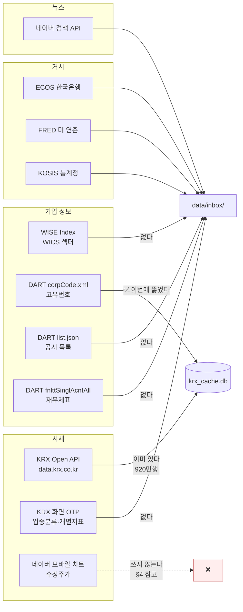
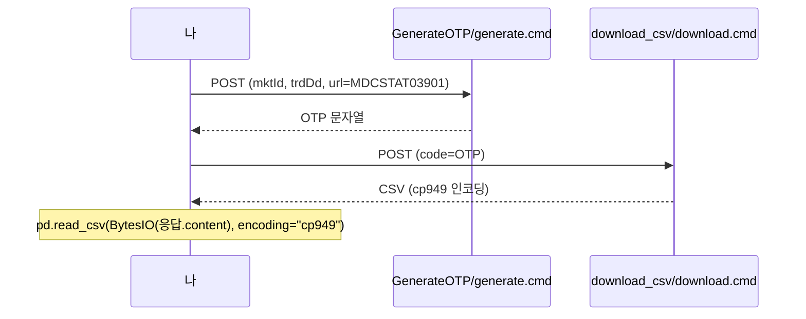
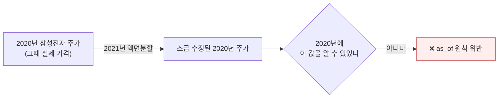
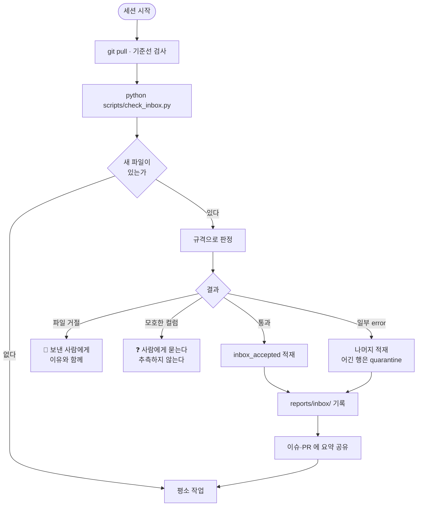
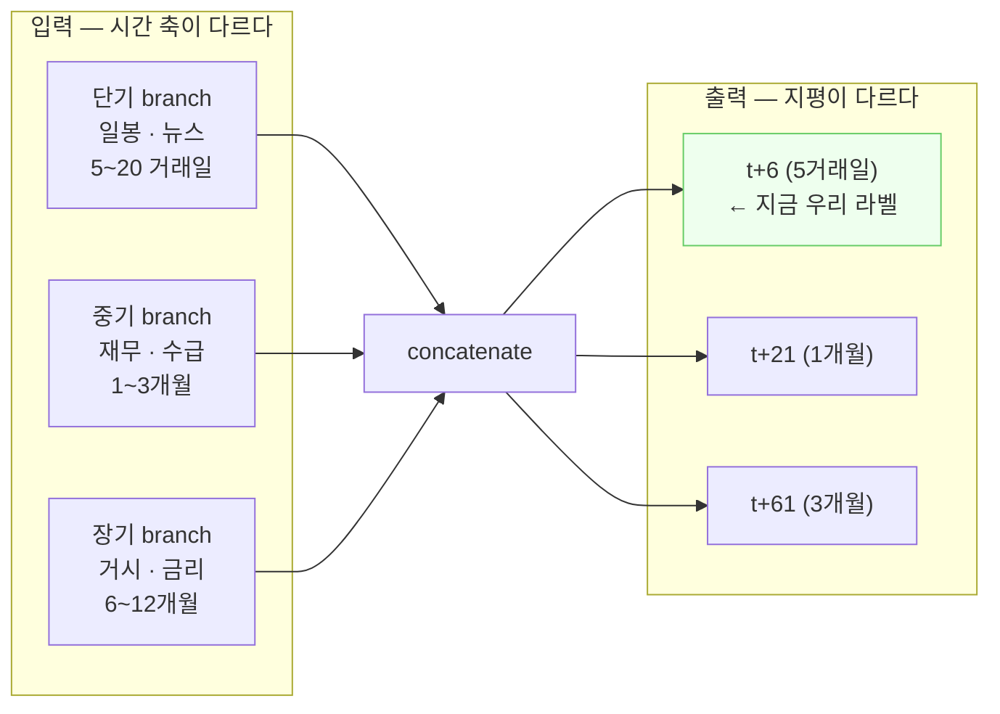

# 자동 수집 가이드 — 코드로 받아 오는 것

> **누구를 위한 문서인가**: 코드를 돌려 자료를 모을 때 봅니다. API 를 부르고, 예산을
> 세고, 원문을 남기는 **프로그램이 하는 수집**을 다룹니다.
>
> 🔴 **사람이 브라우저를 열고 클릭해서 받는 것은 여기가 아닙니다.**
> → [직접 수집 가이드](직접수집_가이드.md)
>
> 근거는 대부분 **수업자료**입니다 — `learning/06-data-crawling/7.국내주식데이터수집.ipynb`
> 에 실제로 돌려 본 코드가 있고, 여기서는 그것을 우리 규격·예산·출처보존 규칙에 맞춰
> 다시 정리했습니다.
>
> 관련: [직접 수집 가이드](직접수집_가이드.md) ·
> [반입 규격 README](../../../ingest/inbox/schemas/README.md) ·
> [반입 파이프라인 기능명세](../../기능명세/version1.1/반입_파이프라인.md) ·
> [팀원 HuggingFace 가이드](../version2.1/팀원_HuggingFace_가이드.md)

---

## 이 문서가 v2.2 에서 이름이 바뀐 이유

v2.2 에서는 이 문서 이름이 `직접수집_가이드.md` 였습니다. 그런데 내용은 **코드로 API 를
부르는 방법**이었습니다. 그래서 *"사람이 사이트에서 직접 받는 법을 알려 달라"* 는 요청과
이름이 어긋났습니다.

이름을 실제 내용에 맞춰 **자동 수집**으로 바꾸고, 원래 뜻의 직접 수집은
[별도 문서](직접수집_가이드.md)로 새로 만들었습니다.

| | 자동 수집 (이 문서) | [직접 수집](직접수집_가이드.md) |
|---|---|---|
| 누가 | 코드 | 사람 |
| 어떻게 | API 호출 · 크롤링 | 브라우저에서 클릭 |
| 파일을 거치나 | 아니오 — 곧장 `krx_cache.db` | 예 — `data/manual/` 에 놓고 검사기를 돌린다 |
| 예산 | `budget.try_spend()` 로 센다 | 사람이 누른 만큼 |

---

## 0. 먼저 읽을 것 — 세 가지 규칙

### ① 원본 그대로 놓습니다

받은 파일을 **고치지 말고** 종류별 폴더에 그대로 둡니다.
무엇을 어떻게 고쳤는지는 검사기가 기록으로 남깁니다. 손으로 고치면 그 기록이 사라집니다.

**어느 폴더인가는 누가 가져왔느냐로 갈립니다.**

```text
data/inbox/     팀원 3명이 HuggingFace 로 보낸 것
data/manual/    팀장이 사이트에서 손으로 받아 온 것   ← 직접 수집은 이쪽
  ohlcv_stock/    종목 시세
  ohlcv_index/    지수 시세
  news/           뉴스
  financial/      재무·공시
  macro/          거시 지표
  reference/      참고표 (상장법인목록 · 상장폐지 이력)
```

검사기(`scripts/check_inbox.py`)는 **두 폴더를 다 훑습니다.**

이 폴더의 **파일은 커밋되지 않습니다** (`.gitignore`). 커밋하는 것은 규격과 판정 기록뿐입니다.

### ② 한도를 먼저 셉니다

| 출처 | 하루 한도 | 우리 코드가 세고 있나 |
|---|---|---|
| KRX Open API | 10,000회 | ✅ `budget.try_spend("krx")` |
| DART | 20,000회 | ✅ (`build_corp_code.py` 부터) |
| 네이버 검색 | 월 25,000 | ✅ |
| ECOS·FRED·KOSIS | — | ❌ **`budget.LIMITS` 에 항목이 없어 부르면 터집니다** |

> ⚠️ 웹 화면 크롤링(KRX OTP·네이버 금융·WISE)은 공식 API 가 아니라 한도가 명시돼
> 있지 않습니다. **그래서 마음대로 해도 된다는 뜻이 아닙니다** — `time.sleep(1)` 을
> 넣고, 필요한 만큼만 받고, 같은 것을 두 번 받지 않습니다.

### ③ 받은 것은 남깁니다

공공·금융 **API 응답**은 `common/raw_store.py` 에 원문을 남깁니다
(`ALLOWED_SOURCES`: krx·dart·ecos·fred·kosis·fss).
정규화는 틀립니다. 원문이 없으면 고치는 방법이 **다시 받는 것뿐**입니다.

> ⚠️ **크롤링으로 받은 문서 본문은 남기지 않습니다.** 저작권 문제이고,
> 뉴스 검색 API 응답도 요약문이 들어 있어 지금은 빼 둡니다.

---

## 1. 어디서 무엇을 받나



| 출처 | 주는 것 | 우리에게 | 규격 |
|---|---|---|---|
| KRX Open API | 종목·지수 일별 시세 | ✅ 920만행 있음 | `ohlcv_stock`·`ohlcv_index` |
| KRX 화면 OTP `MDCSTAT03901` | 업종분류 현황 | ❌ 없음 | — (기업정보) |
| KRX 화면 OTP `MDCSTAT03501` | 개별종목 지표(PER·PBR) | ❌ 없음 | — (기업정보) |
| WISE Index | WICS 섹터 분류 | ❌ 없음 | — (기업정보) |
| DART `corpCode.xml` | 고유번호 매핑 | ✅ **이번에 뚫었다** | — |
| DART `list.json` | 공시 목록 | 부분 | `financial` |
| DART `fnlttSinglAcntAll.json` | 재무제표 213계정 | ❌ 없음 | `financial` |
| 네이버 검색 API | 뉴스 제목·요약·링크 | ❌ 없음 | `news` |
| ECOS·FRED·KOSIS | 거시 지표 | ❌ 없음 | `macro` |

---

## 2. KRX 화면에서 받기 — OTP 두 단계

수업자료 `7.국내주식데이터수집.ipynb` `[code 8~23]` 에 있는 방식입니다.
KRX 통계 화면은 **바로 내려받을 수 없고 OTP 를 먼저 받아 제출**해야 합니다.



| 무엇 | `url` 파라미터 | 시장 |
|---|---|---|
| 업종분류 현황 | `dbms/MDC/STAT/standard/MDCSTAT03901` | `mktId=STK`(코스피) / `KSQ`(코스닥) |
| 개별종목 지표 | `dbms/MDC/STAT/standard/MDCSTAT03501` | `mktId=ALL` |

**주의할 것 셋**

1. **`referer` 헤더가 없으면 거절합니다.** 브라우저에서 온 요청인 척해야 합니다.
2. **인코딩이 `cp949`** 입니다. `utf-8` 로 읽으면 한글이 깨집니다.
3. **최근 영업일을 먼저 알아야 합니다** — `trdDd` 에 휴장일을 넣으면 빈 응답이 옵니다.
   수업자료는 네이버 금융에서 가져옵니다:
   `finance.naver.com/sise/sise_deposit.naver` 의 `span.tah` 에서 날짜를 뽑습니다.
   우리에게는 더 나은 방법이 있습니다 — **`daily_price` 의 `MAX(bas_dd)`** 가 곧 최근 영업일입니다.

### ⚠️ 수업자료에 있는 버그 하나

`[code 72]` 의 WICS 섹터 반복문이 이렇게 돼 있습니다.

```python
for i in sector_code:
    url = f"...&sec_cd=G10"    # ← i 를 안 쓴다
```

`sec_cd` 가 `G10` 으로 고정돼 있어 **10개 섹터를 다 돌아도 같은 자료만 10번** 받습니다.
쓸 때는 `sec_cd={i}` 로 고쳐야 합니다. (강사님 자료는 읽기 전용이라 고치지 않고 여기 적습니다.)

---

## 3. DART — 고유번호부터

DART 는 회사를 **6자리 종목코드가 아니라 8자리 고유번호**로만 받습니다.
그래서 무엇을 하든 매핑표가 먼저입니다.

```bash
python scripts/build_corp_code.py            # data/corp_code.json + corp_code_all.json
python scripts/build_corp_code.py --dry-run  # 받아서 세어만 본다
```

만들어지면 `dart_data.get_corp_code("005930")` → `"00126380"` 이 됩니다.

| 다음 단계 | 엔드포인트 | 규격 |
|---|---|---|
| 공시 목록 | `list.json` (`bgn_de`·`end_de`·`page_no`·`page_count`) | `financial` |
| 재무제표 | `fnlttSinglAcntAll.json` (`corp_code`·`bsns_year`·`reprt_code`·`fs_div`) | `financial` |
| 기업 개황 | `company.json` | — |

> ⚠️ **`page_count=101` 은 조용히 100 으로 잘립니다.** 오류가 아니라 잘림이라
> 눈치채기 어렵습니다. 100 씩 끊어 `page_no` 를 올리며 받습니다.

> 🔴 **재무를 받을 때 `rcept_dt` 를 반드시 함께 챙깁니다.** `fnlttSinglAcntAll` 응답의
> 계정 줄에는 접수일이 안 실립니다 — 응답 최상위에 한 번만 붙습니다. 그걸 놓치면
> 그 파일은 시점을 알 수 없어 통째로 되돌아갑니다. 자세한 것은
> [`financial.json` 의 `fileMeta`](../../../ingest/inbox/schemas/financial.json) 를 보세요.

---

## 4. 수정주가 — 받을 수 있지만 **쓰지 않습니다**

수업자료 `[code 88~90]` 에 네이버 모바일 차트로 수정주가를 받는 방법이 있습니다.

```text
m.stock.naver.com/front-api/external/chart/domestic/info
  ?symbol=005930&requestType=1&startTime=...&endTime=...&timeframe=day
```

우리 `daily_price` 는 **원주가**라 액면분할·유상증자에서 수익률이 튑니다.
그러니 수정주가로 바꾸면 좋아 보입니다. **그런데 쓰지 않습니다. 이유가 둘입니다.**

### ① 이미 다르게 풀었고, 남은 문제가 22행입니다

`common/corporate_actions.py` 가 실측으로 정리해 두었습니다. 가격제한폭을 넘는
2,080행이 네 원인으로 **하나도 남김없이** 설명됩니다.

| 원인 | 행 수 |
|---|---|
| 정리매매 | 1,923 (92.5%) |
| 거래정지 재개 | 468 (22.5%) |
| **자본변동(액면병합·감자·증자)** | **22 (1.1%)** |
| 신규상장 첫날 | 155 (7.5%) |
| 설명 안 됨 | **0** |

수정주가가 풀어 주는 것은 셋째 줄, **920만 행 중 22행**입니다.
그리고 `supply/training.py` 가 `is_basis_adjusted` 로 이미 걸러 냅니다.

### ② 🔴 수정주가는 미래참조를 만듭니다

이쪽이 더 중요합니다.



**2021년 액면분할을 반영한 2020년 주가는 2020년에 존재하지 않던 값입니다.**
우리는 `as_of` 경계와 `HOLDOUT_START=20210901` 로 "그 시점에 알 수 있던 것만"을
지키는데, 소급 수정된 가격은 그 원칙을 정면으로 깹니다.

920만 행을 다시 받아 **얻는 것이 22행의 정확도**이고 **잃는 것이 홀드아웃의 신뢰**라면
안 하는 쪽이 맞습니다.

> 나중에 개별 종목으로 넓힐 때 다시 볼 수는 있습니다. 그때는 원주가를 정본으로 두고
> **조정계수를 시점과 함께 따로 보관**해야 합니다 — 가격 자체를 덮어쓰면 되돌릴 수 없습니다.

---

## 5. 받은 다음 — 세션마다 도는 흐름



이 흐름은 [기능명세 v1.1](../../기능명세/version1.1/반입_파이프라인.md) 에 자세히 있고,
`scripts/check_inbox.py` 는 **아직 만들지 않았습니다**(PR②).

---

## 6. 정제는 수업에서 배운 순서 그대로

`learning/02-preprocessing/4. 판다스_데이터전처리.ipynb` 의 목차가 우리 엔진 순서와 같습니다.

| 수업 | 우리 엔진 | 어디서 |
|---|---|---|
| 누락 데이터 확인 | `missingValues` 로 '없음' 판정 | 규격 |
| 누락 데이터 제거·치환 | **하지 않습니다** — 채우면 없던 값이 생깁니다 | — |
| 누락이 NaN 이 아닌 경우 | `""`·`"-"`·`"N/A"`·`"."` 를 결측으로 | `missingValues` |
| 중복 확인·제거 | `primaryKey` 중복 판정 | 규격 |
| 단위 환산 | `strip_comma`·`strip_percent`·`paren_to_negative` | `cleaners` |
| 자료형 변환 | `to_int`·`to_float`·`to_yyyymmdd` | `cleaners` |
| 범주형 처리 | `map_market`·`map_source`·`map_freq` | `cleaners` |
| 정규화 | **반입 단계에서 하지 않습니다** — 피처 계층의 일입니다 | — |

**결측을 채우지 않는 이유**: 수업에서는 `fillna(평균)` 을 배웁니다. 그런데 시계열에서
평균으로 채우면 **그 평균에 미래가 들어 있습니다.** 반입 단계는 결측을 결측으로 두고,
채울지 말지는 `as_of` 를 아는 피처 계층이 정합니다.

---

## 7. 체크리스트 — 새 자료를 들일 때

- [ ] 이 자료가 어느 **규격**에 해당하는가 (`ohlcv_stock`·`ohlcv_index`·`news`·`financial`·`macro`)
- [ ] 규격에 없는 종류라면 **규격을 먼저 만든다** — 자료가 규격을 정하게 두지 않는다
- [ ] **시점 칸**이 있는가 (`bas_dd`·`pub_dt`·`rcept_dt`·`known_from`). 없으면 되찾을 방법이 있는가
- [ ] 하루 **한도**를 확인했는가. 크롤링이면 `sleep` 을 넣었는가
- [ ] 공공·금융 API 면 **원문을 `raw_store` 에** 남겼는가
- [ ] `data/inbox/<종류>/` 에 **원본 그대로** 놓았는가 (고치지 않았는가)
- [ ] 개인정보·자격증명·비공개 원본이 섞이지 않았는가
- [ ] PUBLIC 레포다 — `git status --short` 로 혼입을 눈으로 확인했는가

---

## 8. 앞으로 — 단기·중기·장기로 나누면 무엇이 더 필요한가

강사님이 **단기/중기/장기를 나눠 함수형 API(Keras Functional API)로 잇는** 구성도
가능하다고 하셨습니다. 아직 그 단계는 아니지만, **무엇을 더 모아야 하는지**가 달라지므로
미리 적어 둡니다.



### 라벨은 더 모을 것이 없습니다

`t+21`·`t+61` 라벨은 **지금 있는 시세로 만들 수 있습니다.** 4,097 거래일이 있으니
지평만 바꿔 다시 세면 됩니다. 다만 지평이 길수록 **겹침(overlap)이 커져** 유효 표본이
줄어듭니다 — 5일 지평의 유의 임계가 iid 54.99% / 중첩보정 57.22% 였는데, 61일 지평은
보정 폭이 훨씬 커집니다. 그 계산을 먼저 해야 합니다.

### 피처는 모을 것이 많습니다

| 축 | 지금 있는 것 | 더 있어야 하는 것 |
|---|---|---|
| **단기** | 일봉 22칸(sma·rsi·macd·볼린저·ATR·OBV 등) | 뉴스(제목·요약) · 투자자별 매매동향 |
| **중기** | — | 재무(분기 실적·성장률) · 업종 분류 · 수급 |
| **장기** | — | 금리·물가·환율(ECOS·FRED·KOSIS) |

즉 **중기·장기 축이 통째로 비어 있습니다.** 그래서 "데이터 수집만 집중해서 하는 세션"이
따로 필요합니다. 이번에 세운 규격 5장이 그 세션의 받침입니다 —
`financial`(중기)·`macro`(장기)·`news`(단기)가 이미 서 있으니, 그때는 **모으는 일만** 하면 됩니다.

> ⚠️ **지평이 길어지면 미래참조가 더 위험해집니다.** `t+61` 을 예측하는데 재무를
> 결산기에 붙이면 석 달 미래가 그대로 들어갑니다. 지평이 짧을 때는 우연히 안 겹칠 수도
> 있지만, 길어지면 반드시 겹칩니다. 규격의 `lookahead` 절이 그래서 중요합니다.

---

## 9. 아직 못 하는 것

| 무엇 | 왜 | 언제 |
|---|---|---|
| `scripts/check_inbox.py` | 아직 안 만들었다 | PR② |
| `cleaners` 실제 동작 | 이름만 정해져 있다 | PR② |
| ECOS·FRED·KOSIS 수집 | `budget.LIMITS` 에 항목이 없어 **부르면 터진다** | 그 출처를 쓸 때 |
| 뉴스 과거 소급 | 네이버 검색이 과거로 못 간다. 개발구간(2010~2021)과 안 겹친다 | 구조적으로 불가 |
| 종목토론방 | `robots.txt` 가 제3자 크롤러에게 사이트 전체를 막는다 | Won't |
