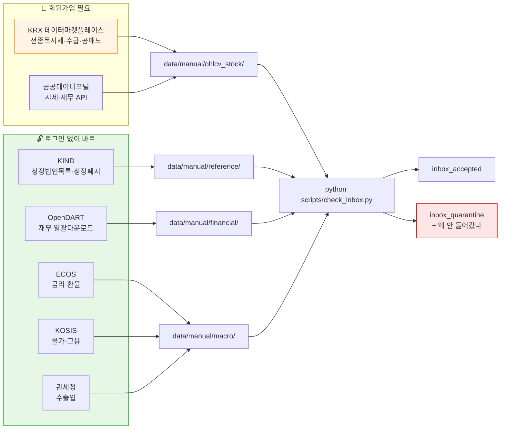

# 직접 수집 가이드 — 브라우저에서 손으로 받아 오기

> **누구를 위한 문서인가**: 사이트를 열고 클릭해서 자료를 내려받을 때 봅니다.
> 코드를 돌리지 않습니다. 회원가입·로그인·다운로드 버튼 위치까지 적었습니다.
>
> 🔴 **코드로 API 를 부르는 것은 여기가 아닙니다.** → [자동 수집 가이드](자동수집_가이드.md)
>
> 관련: [`data/manual/` README](../../../data/manual/README.md) ·
> [반입 규격](../../../ingest/inbox/schemas/README.md) ·
> [팀원 HuggingFace 가이드](../version2.1/팀원_HuggingFace_가이드.md)

---

## 0. 세 줄 요약

1. 아래 표에서 필요한 곳을 골라 **클릭해서 받습니다.**
2. `data/manual/<종류>/` 에 **원본 그대로** 놓습니다. 엑셀로 열어 저장하지 않습니다.
3. `python scripts/check_inbox.py` 를 돌립니다. 판정은 `reports/inbox/<날짜>/` 에 남습니다.

---

## 1. 어디서 무엇을 받나 — 한눈에



**초록은 지금 바로 받을 수 있는 곳**이고, **주황(KRX)은 2025-12-27부터 로그인이
필요해진 곳**입니다. 붉은 것은 값이 규격에 안 맞아 격리된 행인데, 왜 그랬는지가
보고서에 남으니 그걸 보고 다시 받으면 됩니다.

---

## 2. 우선순위 — 지금 우리에게 없는 것부터

우리 저장소에 **통째로 비어 있는 축**을 먼저 적었습니다. 이미 920만 행이 있는
일별 시세를 또 받을 필요는 없습니다.

| 순위 | 무엇 | 왜 지금 필요한가 | 어디서 |
|---|---|---|---|
| 1 | **상장폐지 이력** | 우리 3,677종은 **살아남은 종목만**입니다. 생존편향이 그대로 들어가 있습니다 | [KIND](#31-kind--상장법인목록--상장폐지-이력-로그인-불필요) |
| 2 | **종목 마스터** | 업종·상장일·결산월이 없습니다 | [KIND](#31-kind--상장법인목록--상장폐지-이력-로그인-불필요) |
| 3 | **재무제표** | DART 를 아직 한 번도 안 받았습니다 | [OpenDART 일괄다운로드](#32-opendart-재무정보-일괄다운로드-로그인-불필요) |
| 4 | **거시 지표** | 중기·장기 피처가 비어 있습니다 | [ECOS](#33-ecos--금리환율-로그인-불필요) · [KOSIS](#34-kosis--물가고용) · [관세청](#35-관세청-수출입--kospi-대표-거시피처) |
| 5 | 투자자별 수급 | 수급 피처가 없습니다 | [KRX](#36-krx-데이터마켓플레이스-로그인-필요) |
| 6 | 공매도 | 2016-06-30 부터만 있어 우리 구간 40%가 결측 | [KRX](#36-krx-데이터마켓플레이스-로그인-필요) |

---

## 3. 사이트별 받는 법

### 3.1 KIND — 상장법인목록 · 상장폐지 이력 (로그인 불필요)

**우리에게 가장 값진 곳입니다.** KRX 데이터마켓플레이스가 로그인을 걸었는데도
KIND 는 아직 열려 있고, 생존편향 보정에 필요한 상장폐지 이력이 여기 있습니다.

**① 상장법인목록 (종목 마스터)**

```text
https://kind.krx.co.kr/corpgeneral/corpList.do?method=loadInitPage
```

1. 시장구분에서 **전체** 선택
2. 검색유형 **상장법인**
3. \[검색] → 결과 아래 \[EXCEL] 버튼

받는 컬럼: 회사명 · **종목코드** · 업종 · 주요제품 · 상장일 · 결산월 · 대표자명 · 홈페이지 · 지역

**② 상장폐지 이력**

```text
https://kind.krx.co.kr/investwarn/delcompany.do
```

1. 시장구분 · 폐지일 범위 지정 (2010-01-01 ~ 오늘)
2. \[검색] → \[EXCEL]

받는 컬럼: 종목코드 · 회사명 · 시장구분 · 상장일 · **폐지일** · **폐지사유**

> 🔴 **받은 파일을 엑셀로 열지 마세요.** 확장자는 `.xls` 지만 실제로는 **HTML 표**입니다.
> 엑셀로 열면 종목코드 `005930` 이 숫자 `5930` 으로 바뀌고, 우리 84종(`0009K0` 등)은
> 더 이상하게 깨집니다. 그대로 `data/manual/reference/` 에 놓으면 검사기가 읽습니다.
>
> 파이썬으로 직접 볼 일이 있으면 `pandas.read_html(path)` 을 쓰고 `dtype=str` 을 줍니다.

---

### 3.2 OpenDART 재무정보 일괄다운로드 (로그인 불필요)

**전 상장사 재무제표를 연도·분기 단위로 한 번에** 받습니다. 인증키도 필요 없습니다.

```text
https://opendart.fss.or.kr/disclosureinfo/fnltt/dwld/main.do
```

1. 연도와 보고서 구분을 고릅니다
   - `11011` 사업보고서(연간) · `11012` 반기 · `11013` 1분기 · `11014` 3분기
2. 해당 행의 다운로드 링크 클릭

받는 것: **ZIP 안에 탭 구분 TXT**

> ⚠️ **압축을 풀어서 넣어야 합니다.** 검사기는 `.zip` 을 건너뜁니다.
> 풀고 나서 확장자를 `.tsv` 로 바꿔 `data/manual/financial/` 에 놓으세요.

> 🔴 **정정공시로 과거 수치가 바뀝니다.** 금감원이 *"제출인의 책임하에 작성"* 이라고
> 고지합니다. 즉 **오늘 받은 2020년 재무는 2020년에 알 수 있던 값이 아닐 수 있습니다.**
> 그래서 파일 옆에 받은 날짜를 적어 두세요 — 우리 `as_of` 경계가 그 값을 씁니다.
>
> ```text
> data/manual/financial/
>   2023_사업보고서.tsv
>   2023_사업보고서.txt   ← "OpenDART 일괄다운로드 · 2026-09-01 받음"
> ```

> ⚠️ 제공 시작 연도가 화면에 JS 로 렌더링돼 있어 문서로 확정하지 못했습니다.
> **직접 열어서 어느 연도부터 있는지 확인하고 알려 주세요** — 그 값을 이 문서에 적겠습니다.

---

### 3.3 ECOS — 금리·환율 (로그인 불필요)

```text
https://ecos.bok.or.kr/
```

1. \[100대 통계지표] 로 들어가면 핵심 지표가 바로 보입니다
2. 또는 통계표명 검색 → \[통계검색] → 기간·주기 지정 → \[조회] → 하단 다운로드

받을 만한 것: **기준금리 · 국고채 3년/10년 · 원/달러 환율 · 회사채 스프레드**

> ✅ **재배포 가능** — ECOS 저작권 안내 원문: *"한국은행이 작성한 통계정보는 출처를
> 명시하는 한 상업적 용도를 포함하여 무료로 자유롭게 사용, 가공 및 재배포할 수 있습니다."*
>
> ⚠️ 단 **한국은행이 작성한 것**에 한합니다. ECOS 에는 다른 기관 통계도 들어 있으니
> 통계표를 받을 때 **작성기관을 확인**하세요.

---

### 3.4 KOSIS — 물가·고용

```text
https://kosis.kr/index/index.do
```

1. \[국내통계] 또는 검색창
2. 통계표 조회화면에서 항목·기간 설정 → \[다운로드] → EXCEL/CSV

받을 만한 것: **소비자물가지수 · 산업활동동향 · 고용률**

> ✅ **국내통계는 재배포 가능** — 이용지침 원문: *"이용자는 KOSIS 통계정보를 자유롭게
> 사용, 재사용 및 재배포할 수 있으며 비상업적 또는 상업적 활용이 모두 가능합니다."*
> (단 *"별도의 가공절차 없이 유료로 판매하는 행위"* 는 금지)
>
> 🔴 **국제통계·북한통계는 다릅니다** — 비상업적만 가능하고 **재배포 금지**입니다.
> 국내통계 탭에서만 받으세요.

---

### 3.5 관세청 수출입 — KOSPI 대표 거시피처

```text
https://tradedata.go.kr/cts/index.do?menuId=ETS_MNU_00000134
```

로그인 없이 받을 수 있고, 2026년 7월 데이터까지 있습니다.

**한국 수출 증감률은 KOSPI 방향 예측에서 가장 많이 쓰이는 거시 지표 중 하나**인데
우리 저장소에 통째로 없습니다. 중기·장기 피처가 비어 있는 문제에 바로 맞습니다.

> ⚠️ 월 단위 집계라 일별로 쓰려면 forward-fill 이 필요합니다.
> ⚠️ 공공누리 유형을 아직 확정하지 못했습니다 — 하단 \[저작권보호정책] 을 확인해 주세요.

---

### 3.6 KRX 데이터마켓플레이스 (로그인 필요)

> 🔴 **2025-12-27 부터 로그인이 필요합니다.** 네이버·카카오 간편가입이 되고
> 공동인증서는 필요 없습니다. 조회 자체는 **여전히 무료**입니다.

```text
https://data.krx.co.kr/
```

| 무엇 | 경로 | 화면 ID |
|---|---|---|
| 전종목 시세 | \[통계]→\[기본통계]→\[주식]→\[종목시세]→'전종목 시세' | MDCSTAT015 |
| 상장폐지종목 | \[통계]→\[기본통계]→\[주식]→\[종목정보] | MDCSTAT238 |
| 투자자별 거래실적 | \[통계]→\[기본통계]→\[주식]→\[거래실적] | MDCSTAT022 |
| 공매도 | 좌측 \[공매도 통계] | MDC02030101 |

조회 조건 지정 → \[조회] → 표 우측 **다운로드 아이콘** → CSV/XLS

> 🔴 **KRX 자료는 우리 저장소·발표자료에 값을 실을 수 없습니다.**
> 이용약관 제12조 원문: *"이용자는 당 사이트의 정보를 거래소의 사전 허락 없이
> 복사·복제·배포·전송·공중송신하여서는 아니 됩니다."* 제13조로 저작권도 거래소 귀속입니다.
>
> 그래서 문서·발표에는 **건수와 비율만** 적습니다. 값 자체는 `data/manual/` 과 DB 에만
> 두고 둘 다 커밋되지 않습니다.

> ⚠️ 조회 조건 1건 = 파일 1개라 **대량 백필에는 맞지 않습니다.** 이미 있는 920만 행의
> 정합성을 표본으로 확인하거나, 우리에게 없는 축(수급·공매도)을 받는 데 씁니다.

---

### 3.7 공공데이터포털 — 재배포 가능한 유일한 시세·재무

**우리 저장소가 PUBLIC 이라는 제약에서 가장 값진 곳입니다.** 이용허락범위가
**제한 없음**이라 발표자료에 값을 실을 수 있습니다.

| 데이터셋 | 번호 | 주의 |
|---|---|---|
| 금융위원회_주식시세정보 | [15094808](https://www.data.go.kr/data/15094808/openapi.do) | 시작 연도가 화면에 안 적혀 있음 — 시험 호출 필요 |
| 금융위원회_기업 재무정보 | [15043459](https://www.data.go.kr/data/15043459/openapi.do) | 조회 키가 **법인등록번호**라 매핑표가 먼저 필요 |
| 금융위원회_지수시세정보 | [15094807](https://www.data.go.kr/data/15094807/openapi.do) | 🔴 **2020-01-01 부터만** — 우리 2010년 지수를 대체 못 함 |

**받는 법** (API 라 코드가 필요하지만 키 발급은 사람이 합니다)

1. data.go.kr 회원가입
2. 데이터셋 페이지 → \[활용신청] → **자동승인**
3. 마이페이지에서 서비스키 발급 → `.env` 에 넣기

> 개발계정 일 10,000회. 갱신은 하루 1회이고 **기준일 다음 영업일 오후 1시 이후**에
> 반영됩니다 — 실시간이 아닙니다.

---

## 4. 받은 뒤에 하는 일

### 4.1 놓기

```text
data/manual/
  reference/     KIND 상장법인목록 · 상장폐지 이력
  financial/     OpenDART 일괄다운로드
  macro/         ECOS · KOSIS · 관세청
  ohlcv_stock/   KRX 전종목 시세
```

폴더가 없으면 만들면 됩니다. **파일 이름은 바꾸지 않아도 됩니다.**

출처를 같은 이름 `.txt` 로 남겨 두면 나중에 되짚을 수 있습니다.

### 4.2 검사

```bash
python scripts/check_inbox.py
```

검사기는 `data/inbox/`(팀원 것)와 `data/manual/`(직접 받은 것)을 **둘 다** 훑습니다.
보는 확장자는 `.csv` `.tsv` `.xlsx` `.xls` `.parquet` `.json` 입니다.
**`.zip` 은 건너뜁니다** — 풀어서 넣으세요.

### 4.3 판정 읽기

```text
reports/inbox/<날짜>/
  요약.md                        그날 들인 것 전부
  <종류>_<파일>.md               왜 안 들어갔나 (사람이 읽는 것)
  <종류>_<파일>.json             집계 (기계가 읽는 것)
```

격리됐다고 자료를 잃는 게 아닙니다. **정제 전 원본이 통째로 보관**되고,
규격을 고친 뒤 다시 검사하면 그때 들어옵니다.

---

## 5. 자주 걸리는 것

| 증상 | 원인 | 어떻게 |
|---|---|---|
| 파일을 넣었는데 **0건** | 확장자를 안 봅니다 (`.zip`·`.txt`·`.xml`) | 풀어서 `.tsv`·`.csv` 로 |
| 종목코드가 전부 격리 | 엑셀이 앞자리 0 을 지웠습니다 | 원본을 다시 받고 엑셀로 열지 않습니다 |
| 84종만 격리 | 5·6번째 자리 영문 (`0009K0`) | 규격은 이미 고쳐졌습니다. 안 되면 알려 주세요 |
| 종류를 못 알아봅니다 | 폴더 이름이 규격 이름과 다릅니다 | `ohlcv_stock`·`financial`·`macro`·`news`·`ohlcv_index` 중 하나로 |
| 날짜가 이상하게 읽힙니다 | 엑셀이 `20100104` 를 날짜로 바꿨습니다 | 원본 CSV 로 받습니다 |

---

## 6. 아직 확인 못 한 것

정직하게 적어 둡니다. **직접 열어 보시고 알려 주시면 이 문서에 채우겠습니다.**

| 무엇 | 왜 못 했나 |
|---|---|
| OpenDART 일괄다운로드 **제공 시작 연도** | 연도 표가 JS 렌더링이라 문서에서 못 읽었습니다 |
| KRX OPEN API **요금·한도** | 페이지에 요금 문구가 아예 없습니다. 신청 화면에서 확인해야 합니다 |
| 공매도 **순보유잔고 시작일** | 화면 본문을 못 읽었습니다 (2016-06-30 은 2차 출처) |
| SEIBro **배당정보** 엑셀 버튼 | WebSquare UI 라 조회 조건·버튼을 확인 못 했습니다 |
| 관세청 **공공누리 유형** | 하단 저작권 링크를 확인해야 합니다 |

> ⚠️ **FRED(미국 금리·VIX)는 이 PC 에서 타임아웃으로 열리지 않았습니다.**
> 거시 피처에 미국 지표를 넣으려면 다른 경로가 필요합니다.

---

## 7. 계획에 넣지 말 것

| 무엇 | 왜 |
|---|---|
| KRX 유료 데이터 상품 | 가격·개인 구매 가능 여부 모두 미확인. 실시간 재배포는 코스콤 별도 계약 |
| 증권사 HTS 내보내기 | 실효성을 확인하지 못했습니다 |
| 네이버·다음 금융 화면 | `robots.txt` 가 제3자 봇에게 **사이트 전체 불허** (→ [v2.0 변경사항](../version2.0/변경사항.md)) |
| 코스콤 데이터몰 | 사이트가 HTTP 500 으로 죽어 있습니다 |
