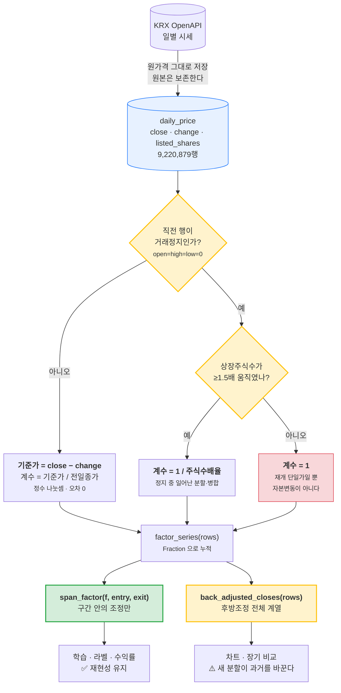
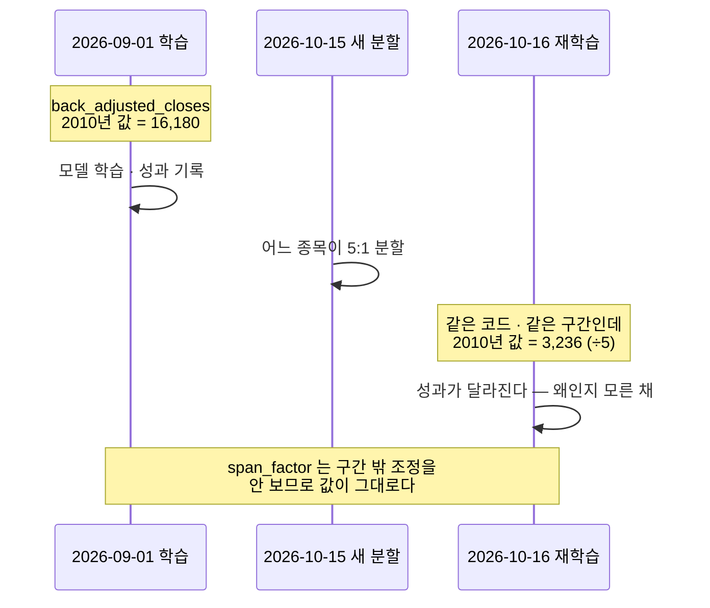
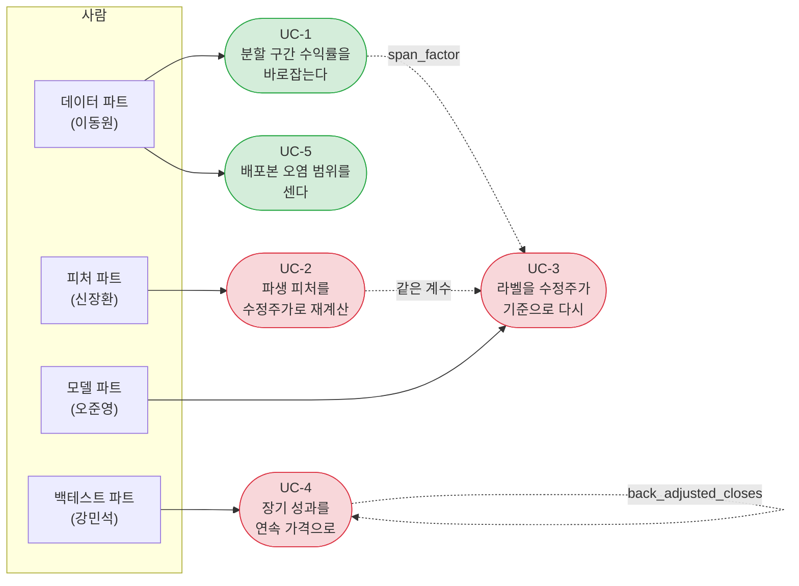

# 수정주가 기능 명세 — 끊긴 가격을 이어 붙인다

> version 2.4 · 2026-09-01 · 이동원
> 관련 이슈 [#51](https://github.com/devlee328288/Alpha_Stack/issues/51) ·
> [#44](https://github.com/devlee328288/Alpha_Stack/issues/44) ·
> [#38](https://github.com/devlee328288/Alpha_Stack/issues/38)

---

## 1. 무엇을 푸는가

우리 `daily_price.close` 는 **수정주가가 아니다.** 액면분할·병합·주식배당이 있으면
가격이 그 날 뚝 끊긴다. 그 앞뒤를 그대로 이어 붙여 수익률을 계산하면 존재하지 않는
폭락·폭등이 만들어진다.

```
삼성전자 2018-05-04 (액면분할 50:1)

  20180503  종가 2,650,000        ← 이 앞 3거래일은 거래정지였다
  20180504  종가    51,900        close 로 계산 → -98.04%
                                  KRX 가 준 등락률 → -2.08%   ← 이쪽이 사실
```

이 값이 파생 피처(이동평균·RSI·볼린저 …)와 라벨로 그대로 전파된다.

---

## 2. 🔴 핵심 — 가격이 끊기는 이유가 둘이다

| 유형 | 무엇 | 어떻게 재나 |
|---|---|---|
| **평상일 조정** | 무상증자 · 주식배당 권리락 | `기준가 = close − change` |
| **재개일 조정** | 거래정지 뒤 재개 (분할 · 병합이 전부 여기 있다) | **상장주식수 배율** |

이 둘을 한 방식으로 재려 하면 반드시 틀린다. 실측이 그렇게 말한다.

### 재개일에 기준가를 믿으면 안 되는 이유

정지 중 종가는 직전 값을 붙들고 있고, 재개일에 KRX 는 **단일가로 기준가를 새로 잡는다.**

```
111610  20150817   전일종가(정지) 145 → 기준가 17,400   계수 120.0
                   그런데 상장주식수 배율은 0.9818 — 주식수는 그대로다
```

이 계수를 믿으면 **과거 전체가 120배 부풀어난다.**
기준가 조정 5,246건 중 **2,057건(39.2%)이 이 재개일**이었다.

### ⚠️ 그렇다고 재개일을 버리면 분할을 전부 잃는다

```
거래정지일을 뺀 '진짜 자본변동' 3,189건 중
  액면분할·병합 = 0건
```

KRX 가 주권 교체 때문에 분할·병합 때 **반드시 거래를 정지시키기 때문**이다.
삼성전자도 20180430~0503 이 정지였다.

→ 두 방식은 대안이 아니라 **상호보완**이다.

---

## 3. 규모 (2026-09-01 전수 실측 · 9,220,879행)

| 항목 | 값 |
|---|---|
| 기준가가 전일종가와 다른 행 | **5,246행 · 2,181종** (전체의 0.057%) |
| 그중 거래정지 재개일 | **2,057행 (39.2%)** ← 자본변동이 아니다 |
| 재개일 중 주식수로 자본변동 인정 | **1,406건** |
| 재개일 중 조정하지 않음 | **282,166건** |
| 조정계수 범위 | 최소 **0.0019배** · 중앙 0.9542배 · 최대 **120.0배** |

월별로 **12월에 1,045건**이 몰린다 — 12월 결산법인의 주식배당 권리락이다.

**세 사건은 서로 다르다**

| 무엇이 바뀌나 | 건수 | 사건 | 가격이 끊기나 |
|---|---|---|---|
| 기준가 **와** 주식수 | 1,516 | 액면분할 · 병합 | **예** |
| 기준가만 | 3,730 | 주식배당 · 권리락 | **예** |
| 주식수만 | **39,515** | 유상증자 등 | **아니오** |

---

## 4. 왜 이 방식인가 — 네 방식 실측 비교

세 종목의 16년 누적 오차다.

| 방식 | 005930 | 000100 | 024830 | 판정 |
|---|---|---|---|---|
| `change_rate` 누적 | −0.1235% | −0.2834% | **+90.95%** | 재개일에서 무너진다 |
| `listed_shares` 배율 | 0.0000% | **+48.52%** | 0.0000% | 권리락을 놓친다 |
| `close − change` 기준가 | 0.0000% | 0.0000% | 0.0000% | 재개일에 가짜 계수 |
| **기준가 + 재개일만 주식수** | **0.0000%** | **0.0000%** | **0.0000%** | ✅ **채택** |

`close`·`change` 는 둘 다 `INTEGER` 라 기준가 계수는 **정확한 유리수**다.
반면 `change_rate` 는 소수 2자리로 반올림돼 있다(실측: 005930 4,101행 중 3,534행이 2자리).

---

## 5. 효과 — 실측

```
ret_1 ≤ −50% 인 행 : 1,355 → 745   (610행 제거, 45.0%)

미조정 최악 8            조정후 최악 8
  008080 20130822          008080 20130822
  150840 20260115          150840 20260115
  152550 20221214          057880 20260113
  057880 20260113          065560 20240718
  055250 20100917          222810 20260305
  005935 20180504  ←       263540 20241028
  005930 20180504  ←       268600 20250225
  065560 20240718          136510 20240716
```

**삼성전자·삼성전자우 20180504 가 최악 목록에서 사라졌다** — 팀원이 발견한 바로 그 자리다.

남은 745행은 **장기 거래정지 뒤 재개**로, 수정주가가 아니라 **표본 선택**으로 다뤄야 하는 것들이다.
(828~1,131 거래일 정지 뒤 재개가 상위를 차지한다.)

### 독립 검증

```
비교 8,933,630행 (재개일 제외 — 그날은 기준가를 안 쓴다)
  |조정 수익률 − KRX 등락률|  0.01%p 초과 0행 · 최대 0.005000 %p
```

최대 오차 0.0050%p 는 **KRX 가 등락률을 소수 2자리로 반올림한 한계**와 정확히 같다.

> ⚠️ **앞선 검증은 무효였다.** 처음에는 재개일 처리 없이 `adj[i]/adj[i-1]` 을 KRX 등락률과
> 비교했는데, 그것은 `close[i]/기준가[i] ≡ change[i]/기준가[i] + 1` 이라 **항등식**이었다.
> 정의상 항상 맞으므로 아무것도 증명하지 못한다. 위 숫자는 재개일에 기준가를 쓰지 않게
> 고친 **뒤**의 것이라 더 이상 항등식이 아니다.

---

## 6. 자료 흐름



---

## 7. 왜 함수가 둘인가 — 재현성

후방조정은 **현재를 기준점으로 과거를 나눈다.** 새 액면분할이 하나 생기면
**과거 전체 값이 바뀌고, 에러는 나지 않는다.**



| 함수 | 보는 범위 | 쓰는 자리 | 재현성 |
|---|---|---|---|
| `span_factor` | **구간 안만** | 학습 · 라벨 · 수익률 | ✅ 유지 |
| `back_adjusted_closes` | 그 뒤 **전부** | 차트 · 장기 비교 | ⚠️ 깨진다 |

---

## 8. 유스케이스



🟢 초록 = 이번 PR 범위(데이터 파트) · 🔴 빨강 = **다른 파트 · 먼저 물어야 한다**

---

## 9. 제공 함수

| 함수 | 하는 일 | 반환 |
|---|---|---|
| `adjustment_factor(prev_row, row)` | 그 날의 조정 배율 | `Fraction` (없으면 `1`) |
| `factor_series(rows)` | 행마다 배율 | `List[Fraction]` |
| `span_factor(factors, entry, exit)` | 구간 안 조정의 누적 | `float` |
| `back_adjusted_closes(rows)` | 후방조정 종가 계열 | `List[float]` |

**쓰는 법**

```python
from common.corporate_actions import factor_series, span_factor

factors = factor_series(rows)                    # 종목 전 구간, bas_dd 오름차순
span = span_factor(factors, entry_i, exit_i)     # 진입~청산 사이 조정
수익률 = rows[exit_i]["open"] / (rows[entry_i]["open"] * span) - 1
```

**왜 `Fraction` 인가** — 1/50 · 1/3 같은 계수가 4,000행에 걸쳐 곱해진다.
부동소수로 누적하면 반올림 잡음이 다시 들어온다. **마지막에 한 번만** `float()` 한다.

**경계 규칙** — 진입일 **당일**의 조정은 세지 않는다. 그 날 시가는 이미 조정된 기준으로
붙기 때문이다. 세면 한 번 더 나눠 값이 배로 틀린다. (테스트로 못박음)

---

## 10. 아직 적용하지 않은 곳 — 🔴 다른 파트

수익률을 계산하는 자리가 **4곳**이고 전부 아직 조정을 반영하지 않는다.

| 위치 | 하는 일 | 파트 |
|---|---|---|
| `evaluation/horizon.py::returns_1d_close` | 종가→종가 | 백테스트 |
| `evaluation/horizon.py::returns_1d_open` · `returns_5d_open` | 시가→시가 (지수용) | 백테스트 |
| `evaluation/horizon.py::returns_5d_open_gapless` | 시가→시가 (종목용) | 백테스트 |
| `scripts/export_team_dataset.py::forward_returns_aligned` | 배포본 라벨 | **데이터** |

이번 PR 은 **함수를 만들고 검증까지만** 한다. 적용은 파트 경계를 넘으므로 팀에 묻는다.
(팀 규칙: "내 파트 밖은 건드리지 않는다 — 건드려야 하면 먼저 묻고 문서에 남긴다")

---

## 11. 못 잰 것

- 2026년 기준가 조정이 다른 해보다 많은 **이유** — 확인하지 못했다
- 남은 745행(장기 정지 뒤 재개)을 **표본에서 뺄지** — 결정하지 않았다
- 배당 조정(total return) — 넣지 않았다. 지금은 **price return** 만이다
- 거래정지 행(등락 0 · 거래량 0 · 종가 복사) 자체를 어떻게 다룰지 — 데이터 파트 일인지 피처 파트 일인지 미정
- `SHARE_RATIO_MIN = 1.5` 문턱의 근거는 "실측에서 진짜 분할은 ×2 이상, 잡음은 ×1.1 아래"인데,
  그 사이 구간(1.1~2.0)에 실제로 무엇이 있는지 **끝까지 세지 않았다**
- 배포본 오염 범위의 재계산 — 이번 PR 에서는 함수만 냈고 배포본은 손대지 않았다
