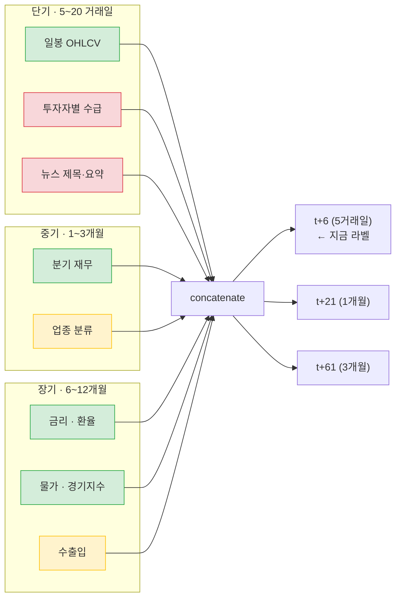
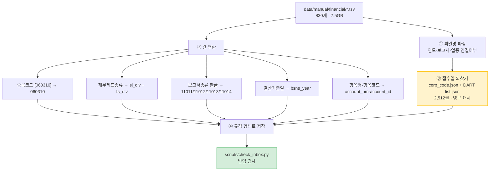

# 직접 수집 가이드 v2.4 — 단기 · 중기 · 장기로 나눠 받는다

> 2026-09-01 · 이동원
> v2.3 을 보고 실제로 받아 보니 **화면이 문서와 달라 막힌 곳이 많았습니다.**
> 이 판은 **실측한 것만** 적고, 확인 못 한 것은 확인 못 했다고 적습니다.

---

## 0. 🔴 v2.3 의 가장 큰 잘못 — 손으로 받을 필요가 없는 것을 받으라고 했습니다

v2.3 은 ECOS·KOSIS·FRED 를 **직접 수집 대상**으로 적었습니다. **틀렸습니다.**
이 저장소에는 그 셋의 **자동 수집기가 이미 있고, 인증키도 있습니다.**

| 자료 | 자동 수집기 | 줄 수 | 실측 |
|---|---|---|---|
| KRX 시세 | `ingest/clients/krx_data.py` | — | ✅ 이미 **9,220,879행** 보유 |
| KRX 지수 | `ingest/store/krx_index.py` | — | ✅ 이미 **196,068행** 보유 |
| **ECOS** 금리·환율·물가 | `ingest/clients/ecos_data.py` | **398** | ✅ **2026-09-01 호출 성공** (지표 9종) |
| **KOSIS** | `ingest/clients/kosis_data.py` | **421** | ✅ 클라이언트 존재 |
| **FRED** 미국 거시 | `ingest/clients/fred_data.py` | **452** | ⚠️ 이 PC 에서 타임아웃 이력 |
| DART 재무 | `ingest/clients/dart_data.py` | — | ✅ 2026-09-01 규격 문제(#43) 해결 |

**ECOS 는 이렇게 한 줄이면 됩니다.**

```python
from ingest.clients import ecos_data
r = ecos_data.fetch_series("base_rate", years=2)   # 기준금리 24개월
```

실제로 돌린 결과입니다.

```
id: base_rate · cycle: M · unit: 연% · count: 24 · truncated: False
fetched_at: 2026-09-01 22:43:43 KST
```

받을 수 있는 지표 9종 — `ecos_data.list_indicators()` 로 확인했습니다.

| id | 주기 | 단위 | 무엇 |
|---|---|---|---|
| `base_rate` | 월 | 연% | 한은 기준금리 |
| `ktb3y` | 일 | % | 국고채 3년 |
| `ktb10y` | 일 | % | 국고채 10년 |
| `usdkrw` | 일 | 원 | 원/달러 |
| `jpykrw` | 일 | 원 | 원/엔 |
| `cpi` | 월 | 지수 | 소비자물가 |
| `ppi` | 월 | 지수 | 생산자물가 |
| `leading` | 월 | 지수 | 선행종합지수 |
| `coincident` | 월 | 지수 | 동행종합지수 |

> 💡 **그래서 ECOS 화면에서 막히신 것은 문제가 아닙니다.** 애초에 안 들어가도 됩니다.

---

## 1. 이미 받으신 것 — 다시 받지 마세요

2026-09-01 기준 `data/manual/` 실측입니다.

| 폴더 | 개수 | 용량 | 무엇 |
|---|---|---|---|
| `financial/` | **830** | **7.5 GB** | OpenDART 재무정보 일괄다운로드 TSV |
| `macro/` | 5 | 278 MB | 수출입 총괄 CSV 4개 + `주제별통계.xls` |
| `reference/` | 2 | 1.5 MB | 상장법인목록 · 상장폐지현황 |
| `ohlcv_stock/` | 0 | — | (비어 있음 — **받을 필요 없습니다**, 위 0절) |

### `financial/` 830개의 실제 구성

```
{연도}_{보고서}_{번호}_{재무제표종류}[_{업종}][_연결]_{받은날짜}.tsv
```

| 축 | 값 |
|---|---|
| 보고서 | 사업 206 · 반기 222 · 1분기 206 · 3분기 196 |
| 재무제표 | 01재무상태표 186 · 02손익계산서 86 · 03포괄손익 186 · 04현금흐름 186 · 05자본변동 186 |
| 업종 | (일반) 430 · 금융기타 104 · 보험 96 · 은행 96 · 증권 104 |
| 연결/별도 | 415 / 415 |
| 기간 | **2015 ~ 2026** |

연도 × 보고서 교차표입니다. `10` 은 5재무제표 × 연결/별도, `42` 는 업종까지 갖춰진 해입니다.

| 연도 | 사업 | 반기 | 1분기 | 3분기 |
|---|---|---|---|---|
| 2015 | 10 | 0 | 0 | 0 |
| 2016~2022 | 10 | 10 | 10 | 10 |
| 2023 | 42 | 26 | 10 | 42 |
| 2024·2025 | 42 | 42 | 42 | 42 |
| 2026 | 0 | 42 | 42 | 0 |

> ⚠️ **2016~2022 는 업종별 파일이 빠져 있습니다**(10개 = 일반만).
> 은행·보험·증권·금융기타를 그 해에도 받으시려면 그 연도로 다시 들어가야 합니다.
> **다만 급하지 않습니다** — 우선순위는 3절을 보세요.

---

## 2. 🔴 단기 · 중기 · 장기 — 무엇을 왜 받는가

팀 설계(`자동수집_가이드.md` §8)의 세 축입니다. 예측 지평이 다르면 **필요한 자료의 시간 축도 다릅니다.**



🟢 초록 = 이미 있음 · 🟡 노랑 = 받았지만 정리 필요 · 🔴 빨강 = **없음**

### 축별 현황 — 실측

| 축 | 자료 | 상태 | 어떻게 |
|---|---|---|---|
| **단기** | 일봉 OHLCV | 🟢 9,220,879행 (2010-01-04~2026-08-31) | 자동 — `scripts/fetch_krx.py` |
| | 지수 | 🟢 196,068행 · 51개 지수 | 자동 — `scripts/fetch_index.py` |
| | **투자자별 수급** | 🔴 **없음** | ⚠️ KRX OpenAPI 에 없음 → 4.4절 |
| | **뉴스** | 🔴 **없음** (규격만 있음) | 네이버 API HUB 키 보유 → 4.5절 |
| **중기** | 분기 재무 | 🟡 830개 받음 · **반입 불가 상태** | → 5절이 핵심 |
| | 업종 분류 | 🟡 재무 TSV 안에 `업종`·`업종명` 칸으로 들어 있음 | 5절에서 함께 뽑음 |
| **장기** | 금리·환율·물가·경기 | 🟢 **자동** (ECOS 지표 9종) | 0절 — 한 줄 |
| | 수출입 | 🟡 4개 CSV 받았으나 각 1.2KB | → 4.3절 |
| | 미국 거시 | ⚠️ FRED 클라이언트 있으나 이 PC 타임아웃 | → 7절 |

### 🔴 우선순위 — 지금 무엇부터 하면 가장 이득인가

지금 팀은 **t+6(5거래일) 라벨**로 학습 중이고 성능이 기준선 아래입니다(#37).

| 순위 | 무엇 | 왜 |
|---|---|---|
| **1** | 받은 재무 830개를 **반입되게** 만들기 | 7.5GB 를 이미 받아 두고 못 쓰고 있습니다. **중기 축이 통째로 열립니다** |
| **2** | ECOS 거시 9종 적재 | 코드가 이미 있어 **비용이 거의 0**. 장기 축이 바로 채워집니다 |
| **3** | 투자자별 수급 | 단기·중기 양쪽에 걸리고, 국내 주식에서 신호가 강한 축입니다 |
| **4** | 뉴스 | 규격은 서 있으나 수집기가 미완이라 품이 가장 많이 듭니다 |

> 💡 **1번과 2번은 새로 받을 것이 없습니다.** 이미 있는 것을 쓸 수 있게 만드는 일입니다.

---

## 3. 받은 자료가 쓸 만한지 확인하는 법

> 사용자 피드백: *"세밀하지 못해서 실제로 유용한 데이터인지 확인도 잘 안 됨"*

받자마자 **세 가지를 확인**하세요. 각각 명령 한 줄입니다.

### 3.1 파일이 열리는가 — 인코딩

```bash
.venv/Scripts/python.exe -c "print(open(r'파일경로', encoding='utf-8').readline()[:200])"
```

- 한글이 깨지면 인코딩이 다릅니다. `cp949` · `utf-8-sig` 를 차례로 대 보세요.
- **OpenDART 일괄다운로드는 UTF-8 입니다.** `cp949` 로 열면 `UnicodeDecodeError` 가 납니다.
  (v2.3 은 이걸 안 적었습니다.)

### 3.2 몇 행 · 몇 종목인가 — 규모

```bash
.venv/Scripts/python.exe - <<'PY'
import pandas as pd
df = pd.read_csv(r"파일경로", sep="\t", encoding="utf-8", nrows=200000)
print(f"{len(df):,}행 × {len(df.columns)}칸")
print("칸:", list(df.columns))
if "종목코드" in df: print("종목", df["종목코드"].nunique(), "종")
PY
```

기준: **2023 사업보고서 재무상태표(일반·별도)는 2,512종**이 들어 있습니다.
이보다 훨씬 적으면 잘못 받으신 것입니다.

### 3.3 우리 규격에 들어가는가 — 반입 검사

```bash
python scripts/check_inbox.py
```

`data/inbox` 와 `data/manual` 을 함께 훑고, 판정 결과를 `reports/inbox/<날짜>/` 에 남깁니다.

> 🔴 **지금 재무 830개는 이 검사를 통과하지 못합니다.** 5절에서 그 이유와 해결을 다룹니다.

---

## 4. 사이트별 — 받는 법

> ⚠️ 아래 절차 중 **제가 화면을 직접 열어 확인한 것**과 **파일에서 역추론한 것**을 구분해 표시했습니다.
> 저는 이 사이트들이 자바스크립트로 화면을 그려서 **본문을 읽지 못했습니다.**
> 실제로 눌러 보신 분이 알려 주시면 그 문구로 고치겠습니다.

### 4.1 OpenDART 재무정보 일괄다운로드 — 🟡 **이미 성공하신 곳**

```
https://opendart.fss.or.kr/disclosureinfo/fnltt/dwld/main.do
```

**확인한 것** (페이지 메타데이터에서 읽음)
- 제공 대상: *"상장법인(유가증권, 코스닥) 및 주요 비상장법인"* 의 XBRL 재무제표
- 제공 형식: **텍스트(TXT) 파일**

**파일명에서 역추론한 선택 축** (받으신 830개를 분해해 얻었습니다)

| 골라야 하는 것 | 값 |
|---|---|
| 연도 | 2015 ~ 2026 |
| 보고서 | 사업보고서 · 반기보고서 · 1분기보고서 · 3분기보고서 |
| **업종** | (일반) · 금융기타 · 보험 · 은행 · 증권 |
| **연결/별도** | 파일이 **따로** 나옵니다 (`_연결_` 유무) |

> ⚠️ **재무제표 5종(재무상태표·손익계산서·포괄손익계산서·현금흐름표·자본변동표)은
> 한 번에 같이 나오는 것으로 보입니다** — 파일명 번호가 `01`~`05` 로 붙어 있고
> 같은 날짜로 묶여 있기 때문입니다. **다만 화면에서 확인하지는 못했습니다.**

**받은 뒤**
1. 압축을 풉니다 (검사기는 `.zip` 을 건너뜁니다)
2. 확장자를 `.tsv` 로 바꿉니다
3. `data/manual/financial/` 에 놓습니다
4. **파일명은 바꾸지 마세요** — 연도·보고서·업종·연결여부가 파일명에만 있습니다

> 🔴 **정정공시로 과거 수치가 바뀝니다.** 오늘 받은 2020년 재무는 2020년에 알 수 있던 값이
> 아닐 수 있습니다. 그래서 파일명 끝의 **받은 날짜가 중요합니다.**

### 4.2 KIND — 상장법인목록 · 상장폐지현황 — 🟢 **이미 성공하신 곳**

```
https://kind.krx.co.kr
```

받으신 것: `상장법인목록.xls` (1.26MB) · `상장폐지현황.xls` (212KB)

> 🔴 **상장폐지현황이 특히 값집니다.** 우리 `daily_price` 에는 중도 소멸 종목이 있는데,
> 그 목록이 있어야 **생존편향**을 보정할 수 있습니다. 이건 API 로는 잘 안 나옵니다.

⚠️ 이 두 파일의 칸 구성은 **아직 열어 보지 못했습니다.** 다음 세션에서 확인하겠습니다.

### 4.3 관세청 수출입무역통계 — 🟡 **받았으나 기간이 짧습니다**

받으신 것: `수출입 총괄_20260901.csv` 외 3개, **각 1.2KB**.
1.2KB 면 수십 행입니다 — 장기 축(6~12개월) 피처로 쓰기엔 짧습니다.

**무엇을 바꿔야 하는가**
- 조회 화면에서 **기간을 연 단위로 넓혀** 다시 받으세요.
- 우리 시세가 2010-01-04 부터이므로 **2010년 1월 ~ 현재** 를 목표로 하세요.
- 한 번에 안 되면 **연도별로 나눠** 받고 파일명에 연도를 넣으세요.

⚠️ 화면의 기간 선택 위젯 이름은 확인하지 못했습니다.

### 4.4 투자자별 매매동향(수급) — 🔴 **없는 것 · 받아야 하는 것**

**왜 화면에서 받아야 하나** — 우리 KRX 클라이언트를 읽어 확인했습니다.

```python
# ingest/clients/krx_data.py:280
url = f"{KRX_BASE_URL}/{path}?{urlencode({'basDd': bas_dd})}"
```

**KRX OpenAPI 는 인자가 `basDd`(날짜) 하나뿐입니다.** 종목별·투자자별 조회가 없습니다.
그래서 수급은 이 경로로 못 받습니다.

```
https://data.krx.co.kr
```

> ⚠️ **2025-12-27 부로 로그인이 필수가 되었다는 조사가 있습니다**(이전 세션).
> 저는 로그인 뒤 화면을 볼 수 없어 **여기서부터는 확인하지 못했습니다.**
>
> **여쭙고 싶은 것**: 가입은 하셨나요? 로그인 뒤에 [투자자별 매매동향] 메뉴가 보이나요?
> 보이면 그 화면의 선택 항목(기간·시장·투자자 구분)을 알려 주시면 절차를 채우겠습니다.

### 4.5 뉴스 — 🔴 **없는 것 · 코드로 받습니다**

손으로 받지 마세요. **네이버 API HUB 키가 이미 `.env` 에 있습니다.**

`scripts/probe_naver_paging.py` 의 조사 결과(2026-08-27 실측):

| | 개발자센터 (구) | **API HUB (우리 키)** |
|---|---|---|
| 호스트 | `openapi.naver.com` | **`naverapihub.apigw.ntruss.com`** |
| 경로 | `/v1/search/news.json` | **`/search/v1/news`** |
| 헤더 | `X-Naver-Client-Id` 외 | **`X-NCP-APIGW-API-KEY-ID`·`X-NCP-APIGW-API-KEY`** |
| 한도 | 일 25,000 | **월 775,000** |

> ⚠️ 아직 **정식 수집기가 없습니다**(탐침 스크립트만 있습니다).
> 저작권 때문에 **본문은 쓰지 않고 제목·요약만** 씁니다.

### 4.6 KOSIS — 🟡 **278MB 를 받으셨는데 자동 경로가 있습니다**

`ingest/clients/kosis_data.py` (421줄)가 이미 있습니다. `주제별통계.xls` **278MB** 를
통째로 받으실 필요가 없었습니다.

⚠️ 다만 이 클라이언트는 ECOS 와 구조가 달라 (`list_indicators` 가 없습니다)
**어떤 지표를 어떻게 부르는지 아직 확인하지 못했습니다.** 다음 세션 과제입니다.

---

## 5. 🔴 받은 재무 830개를 쓸 수 있게 만들기 — 이번 가이드의 핵심

**7.5GB 를 받으셨는데 지금 그대로는 한 행도 반입되지 않습니다.** 이유를 실측했습니다.

### 5.1 무엇이 안 맞는가

TSV 의 칸 15개를 우리 규격(`financial.json`)에 대 봤습니다.

| TSV 칸 | 규격 필드 | 상태 |
|---|---|---|
| 종목코드 | `stock_code` | ⚠️ 값이 `[060310]` — **대괄호를 떼야** 합니다 |
| 회사명 | `corp_name` | ✅ |
| 통화 | `currency` | ✅ |
| 당기 / 전기 / 전전기 | `thstrm_amount` / `frmtrm_amount` / `bfefrmtrm_amount` | ✅ |
| 재무제표종류 | `fs_div` | 🔴 **잘못 매핑됩니다** (아래) |
| 항목명 | `account_nm` | 🔴 **별칭에 "항목명"이 없습니다** |
| 항목코드 | `account_id` | 🔴 별칭에 없습니다 |
| 결산기준일 | `bsns_year` | 🔴 매칭 없음 — 여기서 연도를 뽑아야 |
| 보고서종류 | `reprt_code` | 🔴 값이 한글 `"사업보고서"` — 코드 변환 필요 |
| — | `sj_div` | 🔴 **칸이 없습니다** — 재무제표종류에서 뽑아야 |
| — | **`rcept_dt`·`rcept_no`** | 🔴 **아예 없습니다** |

**`재무제표종류` 가 특히 문제입니다.** 값이 이렇습니다.

```
재무상태표, 유동/비유동법-별도재무제표
```

이 한 칸에 **재무제표 구분(BS)과 연결/별도(OFS)가 섞여** 있습니다.
그런데 규격 별칭이 이걸 `fs_div` 로 보내고, `fs_div` 는 `CFS`/`OFS` enum 이라 **전량 거부**됩니다.

### 5.2 🔴 접수일 문제 — 그리고 해결책

규격은 **공시 접수일(`rcept_dt`)** 을 시점 기준으로 못 박았습니다. 없으면
`has_time_anchor` 규칙이 행을 격리합니다. 이건 규격이 *"이 프로젝트에서 가장 조용한 오류"* 라고
부르는 것을 막으려는 장치입니다 — 결산기에 값을 붙이면 **석 달치 미래가 학습에 들어갑니다.**

**파일명의 날짜(`20260814`)는 접수일이 아니라 받으신 날입니다.** 쓸 수 없습니다.

**되찾을 수 있는지 계산했습니다.**

| 방식 | 콜 수 | 하루 한도(20,000) 대비 | 판정 |
|---|---|---|---|
| A. (회사 × 연도·보고서)마다 1콜 | 2,512 × 43 = **108,016** | 5.4배 | ❌ 불가능 |
| **B. 회사마다 1콜로 전 기간** | **2,512** | **12.6%** | ✅ **가능** |
| C. 접수번호로 역조회 | — | — | ❌ TSV 에 `rcept_no` 가 없음 |

**B 가 되는 이유**: DART `list.json` 은 기간(`bgn_de`~`end_de`) 조회라 한 번에 여러 공시를 줍니다.
정기공시(`pblntf_ty=A`)로 좁히면 한 회사의 12년치가 사업 12 + 반기 12 + 분기 24 ≈ **48건**이라
`page_count=100` 안에 들어갑니다.

**그리고 종목코드 → 고유번호 매핑이 100% 됩니다** (실측).

```
매핑표 3,988개 · 파일 안 종목 2,512종
  매핑됨   2,511종 (100.0%)
  매핑안됨     1종  ← 값이 'null' 인 빈 행
```

> ✅ **결론: 접수일 되찾기는 가능합니다.** 회사당 1콜 · 총 2,512콜 · 하루 한도의 12.6%.
> 접수일은 불변이라 **한 번 받아 영구 캐시**하면 다시 받을 일이 없습니다.

### 5.3 그래서 무엇을 만들어야 하는가

**변환기 하나**가 필요합니다. 별칭만으로는 안 됩니다 (파싱과 코드 변환이 필요).



**아직 만들지 않았습니다.** 다음 세션(전처리·정제 세션)의 첫 과제로 두겠습니다.

> ⚠️ 별칭(`financial.json` 의 `aliases`)만 고쳐서 되는 부분도 있습니다 —
> `항목명`·`항목코드`·`결산기준일` 등. 다만 규격에
> `aliasInvariant`("한 이름은 한 필드에만 속한다")가 있어 `재무제표종류` 를 어디에 둘지는
> **규격을 고쳐야** 합니다. 그건 별도 이슈로 다루겠습니다.

---

## 6. 받은 뒤에 하는 일

### 6.1 놓기

| 자료 종류 | 폴더 |
|---|---|
| 재무 | `data/manual/financial/` |
| 거시 | `data/manual/macro/` |
| 참조(목록·폐지) | `data/manual/reference/` |
| 시세 | `data/manual/ohlcv_stock/` |

> 🔴 **`data/manual/` 은 `.gitignore` 로 막혀 있습니다.** README 만 커밋됩니다.
> 이 저장소는 **Public** 이고 KRX 이용약관이 제3자 제공을 금지하기 때문입니다.
> 파일은 커밋하지 말고, **만드는 방법만** 저장소에 남깁니다.

### 6.2 검사

```bash
python scripts/check_inbox.py
```

`data/inbox` 와 `data/manual` 을 함께 훑고 `.csv`·`.tsv`·`.json` 등을 봅니다.

### 6.3 판정 읽기

결과는 `reports/inbox/<날짜>/요약.md` 에 남습니다.

| 표시 | 뜻 | 할 일 |
|---|---|---|
| 합격 | 규격을 통과 | 없음 |
| 격리(quarantine) | 규칙 위반 행 | 사유를 보고 **자료가 틀렸는지 규칙이 틀렸는지** 가릅니다 |
| 파일 거절 | 시점을 알 수 없는 파일 | 5.2절 |

> 🔴 **이 저장소의 원칙**: 규칙이 우리 자료를 격리하면 **자료가 아니라 규칙을 고칩니다.**
> 규칙이 멀쩡한데 빨간불이 반복되면 팀은 규칙을 고치지 않고 검사를 꺼 버립니다.

---

## 7. 자주 막히는 곳

| 증상 | 원인 | 해결 |
|---|---|---|
| 한글이 깨진다 | OpenDART TSV 는 **UTF-8** | `encoding="utf-8"`. `cp949` 는 에러가 납니다 |
| 검사기가 파일을 안 본다 | `.zip` 은 건너뜁니다 | 풀어서 `.tsv` 로 |
| 파일이 1KB 밖에 안 된다 | 조회 기간이 짧게 잡혔다 | 기간을 연 단위로 넓혀 다시 |
| 278MB 가 받아졌다 | 지표를 안 좁히고 주제 전체를 받았다 | 자동 클라이언트를 쓰거나 지표를 좁혀서 |
| FRED 가 안 열린다 | 이 PC 에서 타임아웃 이력 | 대안 필요 — 미확인 |
| KRX 화면에서 막힌다 | 2025-12-27 로그인 필수화 | 4.4절 — 확인 못 했습니다 |
| 재무가 전량 격리된다 | 접수일이 없다 | 5.2절 |

---

## 8. 🔴 아직 확인하지 못한 것 — 정직하게

이 문서를 쓰면서 **화면을 직접 열지 못한 것**들입니다. v2.3 이 틀린 이유가 바로 이걸
확인 안 하고 적었기 때문이라, 이번에는 표시해 둡니다.

| 무엇 | 왜 못 했나 | 알려 주시면 |
|---|---|---|
| OpenDART 일괄다운로드 **화면 구성** | 자바스크립트 렌더링 | 선택 항목과 버튼 이름을 문서에 넣겠습니다 |
| KIND 메뉴 경로 | 같음 | 4.2절을 채우겠습니다 |
| **KRX 로그인 뒤 화면** | 로그인이 필요 | 4.4절 수급 절차를 완성하겠습니다 |
| KOSIS 지표 좁히기 | 클라이언트 구조를 아직 안 읽음 | 다음 세션에 직접 확인하겠습니다 |
| 관세청 기간 선택 위젯 | 화면 못 읽음 | 4.3절을 채우겠습니다 |
| `상장법인목록.xls`·`상장폐지현황.xls` 칸 구성 | 아직 안 열어 봄 | 다음 세션에 확인 |
| `주제별통계.xls` 278MB 내용 | 아직 안 열어 봄 | 다음 세션에 확인 |

> 💡 **막히신 화면의 메뉴 이름만 알려 주셔도** 그 절차를 정확히 채울 수 있습니다.

---

## 9. 계획에 넣지 말 것

| 무엇 | 왜 |
|---|---|
| ECOS·KOSIS·FRED 를 손으로 받기 | **자동 클라이언트가 있습니다** (0절) |
| KRX 시세를 화면에서 받기 | 이미 920만 행이 있습니다 |
| 코스콤 데이터몰 | 서비스 중단 (HTTP 500) — 이전 세션 확인 |
| KRX·KIND 자료를 저장소에 커밋 | 이용약관이 제3자 제공을 금지합니다 |
| 뉴스 **본문** 수집 | 언론사 저작물입니다. 제목·요약만 |

---

## 부록. 이 문서가 근거로 삼은 실측

| 무엇 | 언제 | 결과 |
|---|---|---|
| `data/manual/` 전수 | 2026-09-01 | 830 + 5 + 2 파일 · 7.8GB |
| financial TSV 인코딩 | 〃 | UTF-8 (cp949 는 `UnicodeDecodeError`) |
| TSV 칸 구성 | 〃 | 15칸 + 줄끝 탭으로 생기는 빈 16번째 칸 |
| 규격 매핑 | 〃 | required 5칸 중 사실상 0칸 충족 |
| 접수일 되찾기 비용 | 〃 | 회사당 1콜 · 2,512콜 · 한도의 12.6% |
| 종목코드→고유번호 | 〃 | 2,512종 중 2,511종 (100.0%) |
| ECOS 실호출 | 〃 22:43 KST | `base_rate` 24개월 수신 성공 |
| KRX OpenAPI 인자 | 〃 | `basDd` 하나뿐 (수급 조회 불가) |
