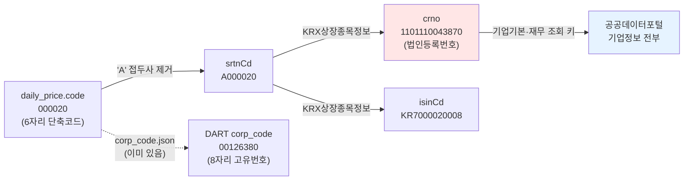
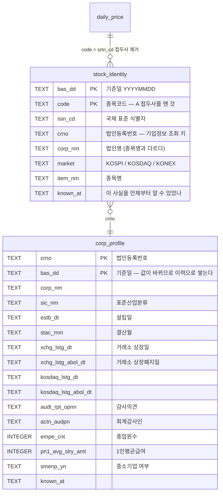
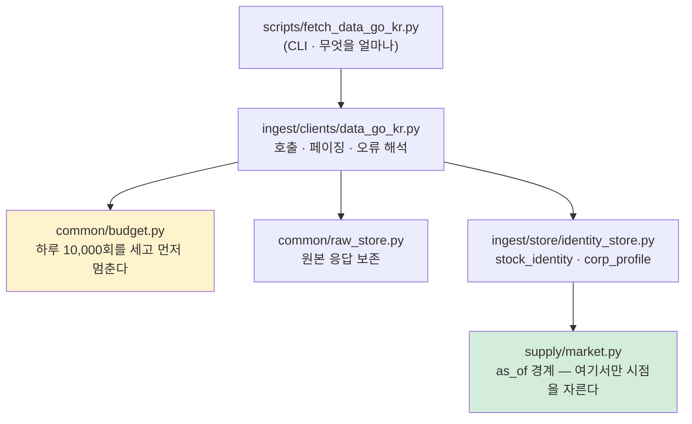

# 공공데이터포털 수집 설계 — 무엇을 왜 가져오나

> `docs/데이터파트/version3.1/공공데이터포털_수집_설계.md` · 2026-09-03 · 이동원
> 상태: **설계** (구현은 다음 세션) · 실측 근거는 전부 2026-09-03 이 문서 작성 중 확인

---

## 0. 한 줄 요약

공공데이터포털에서 가져올 가치가 있는 것은 **시세도 재무도 아니라 "다리"** 입니다 —
`종목코드 ↔ 법인등록번호 ↔ ISIN` 매핑과, **상장일·상장폐지일·감사의견** 같은 종목의
일생 기록입니다. 시세는 KRX 가, 재무는 DART 가 이미 더 자세히 줍니다.

---

## 1. 왜 이 질문부터 하나 — 우리는 이미 수집원이 많다

| 수집원 | 담당 | 지금 담긴 것 |
|---|---|---|
| KRX OpenAPI | 시세·지수 | `daily_price` 9,223,644행 · `index_price` 196,119행 |
| OpenDART | 공시·재무 | `dart_financial` 662,933행 |
| ECOS (한국은행) | 국내 거시 | `macro_series` 17,851행 |
| FRED | 미국 거시 | 〃 |
| KOSIS | 통계청 | 조회만 |
| 금감원 finlife | 예·적금 금리 | 조회만 |
| FinanceDataReader | 수정주가 | `adj_*` 4칸 (fdr 81.6% · chain 18.4%) |
| yfinance | 해외 시세 | 조회만 |

여덟 곳입니다. 그러니 아홉 번째를 더할 때 물어야 할 것은 **"쓸 수 있나"가 아니라
"겹치지 않고 새로 얻는 게 무엇인가"** 입니다. 겹치는 것을 더하면 **관리 비용만 늘고,
두 출처가 어긋날 때 어느 쪽이 옳은지 정하는 일**이 새로 생깁니다.

---

## 2. 전수 조사 — 금융위원회가 여는 것

금융위원회는 공공데이터포털에 **9개 주제 · 91개 API · 298개 테이블**을 개방하고
있습니다(금융위 [개방 현황](https://www.fsc.go.kr/in060301) · 2023-06 기준 공식 집계).
주제별 목록입니다.

<details>
<summary><b>금융위원회 개방 API 전체 목록</b> — 펼쳐 보기</summary>

### 기업정보
기업기본정보(기업개요·계열회사·연결대상종속기업) · 지배구조정보(주주·대표이사 외 2) ·
**기업 재무정보**(요약재무제표·재무상태표·손익계산서) · 차입투자정보(부실채권회생·파산 외 2) ·
**KRX상장종목정보**(종목정보) · 주식발행공시정보(주식총수현황) ·
기업지배구조공시정보(소액주주현황·미등기임원 보수·개인별 보수지급)

### 금융회사정보
금융회사기본정보 · 금융회사지배구조정보 · 금융회사재무신용정보 · 금융회사부보정보 ·
파산금융회사 기본정보/재무상태표/손익계산서 · 금융회사 자금지원및회수정보

### 공시정보
공시정보(배당공시·유상증자결정 외 31개) · 금융회사공시정보(외 28개) ·
자금조달공시정보(공모/사모자금사용내역·채무증권발행실적 외 5)

### 자본시장정보
주식발행정보 · 주식등록예탁가능정보 · **주식배당정보** · **주식권리일정정보** ·
주식분포 및 사고주권정보 · 채권기본/권리행사/권리일정/발행정보 · 신주인수권증권 발행정보 ·
단기금융증권 발행/거래정보 · **주식대차정보**(6기능) · 채권대차정보 · REPO종목/거래정보 ·
국제거래종목정보 · 국제거래외화증권예탁결제정보 · 크라우드펀딩(발행사·중개업자) ·
모기지론 8종

### 시세정보
**주식시세정보** · **지수시세정보** · 채권시세정보 · 증권상품시세정보

</details>

### 실측 — 우리 키로 지금 열려 있는 것

문서를 옮겨 적지 않고 **직접 호출해서** 확인했습니다(2026-09-03).

| API | 엔드포인트 | 결과 | 칸 |
|---|---|---|---|
| KRX상장종목정보 | `GetKrxListedInfoService/getItemInfo` | ✅ 하루 2,694건 | 7 |
| 기업기본정보 | `GetCorpBasicInfoService_V2/getCorpOutline_V2` | ✅ 누적 1,291,424건 | 37 |
| 기업 재무정보 | `GetFinaStatInfoService_V2/getSummFinaStat_V2` | ✅ 누적 2,138,128건 | 15 |
| 주식시세정보 | `GetStockSecuritiesInfoService/getStockPriceInfo` | ✅ 하루 2,832건 | 15 |
| 지수시세정보 | `GetMarketIndexInfoService/getStockMarketIndex` | ✅ 하루 144건 | 21 |
| 금융회사기본정보 | `GetFnCoBasiInfoService/getFnCoOutl` | ✅ 누적 2,317,488건 | — |

**아직 경로를 못 찾은 것** — 주식발행정보 · 주식배당정보 · 주식권리일정정보 ·
주식대차정보 · 주식분포정보 · 지배구조정보. 서비스명 규칙(`Get…InfoService/get…`)을
여러 조합으로 때려 봤지만 전부 `NO_OPENAPI_SERVICE` 였습니다. 포털 상세 페이지의
활용자 가이드(`.docx`)에 정확한 경로가 있으므로, 구현할 때 그것부터 받습니다.

> ⚠️ 포털 공지: **지수시세정보는 2026-06-26 기준 데이터부터 제공이 지연 중**입니다.
> 과거 구간(2024년)은 정상적으로 나옵니다.

---

## 3. 겹침 분석 — 무엇이 새로운가

### 겹치는 것 (가져올 이유가 약하다)

| API | 우리가 이미 가진 것 | 판단 |
|---|---|---|
| 주식시세정보 (15칸) | KRX `daily_price` (20칸, `adj_*` 포함) | **KRX 가 더 낫다.** 백업 경로로만 |
| 지수시세정보 | KRX `index_price` | 〃 · 게다가 지금 제공 지연 |
| 기업 재무정보 (15칸) | DART `dart_financial` (662,933행) | **DART 가 더 자세하다.** 교차검증용 |
| 채권·REPO·모기지론 | — | **범위 밖.** 주식 예측에 안 쓴다 |

### 새로 얻는 것 (여기가 본론)

#### ① 종목코드 ↔ 법인등록번호 ↔ ISIN 매핑 — **다리**

`GetKrxListedInfoService/getItemInfo` 의 실제 한 행입니다.

```json
{
  "basDt": "20240830",
  "srtnCd": "A000020",
  "isinCd": "KR7000020008",
  "mrktCtg": "KOSPI",
  "itmsNm": "동화약품",
  "crno": "1101110043870",
  "corpNm": "동화약품(주)"
}
```

이게 왜 중요한가 — **식별자가 계층마다 다르기 때문**입니다.



공공데이터포털의 **기업기본정보·재무정보는 전부 `crno`(법인등록번호)로 조회**합니다.
우리 `daily_price` 에는 `crno` 가 없습니다. 이 매핑이 없으면 **그 두 API 를 종목에
붙일 방법이 아예 없습니다.** 그래서 이게 첫 번째로 가져와야 할 것입니다.

덤으로 `isinCd` 도 들어옵니다 — 우리 DB 에 없는 국제 표준 식별자이고, 외부 자료와
맞출 때 종목코드보다 안전합니다(종목코드는 재사용되지만 ISIN 은 안 됩니다).

> ⚠️ `srtnCd` 는 `A000020` 처럼 **`A` 접두사가 붙습니다.** 우리 `code` 는 `000020`
> 입니다. 그냥 붙여 놓으면 조인이 0행이 되는데 에러는 안 납니다. 반입 규칙에서
> 접두사를 떼는 것을 **명시적으로** 해야 합니다.
> 그리고 종목코드는 **숫자가 아닙니다** — 5·6번째에 영문이 오는 종목이 84종
> (`0001B0`) 있습니다. `int()` 로 바꾸면 그 자리에서 깨집니다.

#### ② 종목의 일생 — 상장일 · 상장폐지일 · 감사의견

`GetCorpBasicInfoService_V2` 의 37칸 중 우리에게 필요한 것들입니다.

| 칸 | 뜻 | 왜 쓸모 있나 |
|---|---|---|
| `enpXchgLstgDt` / `enpXchgLstgAbolDt` | 거래소 상장일 / 폐지일 | **생존 편향**을 자료 끊김으로 추정하지 않아도 된다 |
| `enpKosdaqLstgDt` / `enpKosdaqLstgAbolDt` | 코스닥 상장 / 폐지일 | 〃 |
| `audtRptOpnnCtt` | 감사의견 | **상장폐지 선행 신호.** 의견거절·한정은 실제 위험 표지 |
| `actnAudpnNm` | 회계감사인 | 감사인 교체가 신호가 되기도 한다 |
| `enpEmpeCnt` | 종업원수 | 규모 대리 변수 |
| `enpPn1AvgSlryAmt` | 1인평균급여 | 인건비 구조 |
| `empeAvgCnwkTermCtt` | 평균근속연수 | 〃 |
| `smenpYn` | 중소기업 여부 | 층화 기준 |
| `sicNm` | 표준산업분류 | **KRX `sector` 보다 안정적.** 지금 `sector` 는 46.4%가 빈 값이다 |
| `enpEstbDt` | 설립일 | 업력 |
| `enpStacMm` | 결산월 | 재무 시점 정합에 필요 |

**지금 우리가 추정으로 하고 있는 것을 사실로 바꿔 줍니다.** 표본 30종목을 고를 때
"개발구간 끝보다 90일 앞에서 자료가 끊기면 중도 소멸로 본다" 는 어림을 쓰고 있는데
(`export_team_dataset.py`), 상장폐지일이 있으면 어림이 필요 없습니다.

#### ③ 요약재무 — DART 교차검증

`fnclDebtRto`(부채비율)가 **계산돼서** 옵니다. DART 원장에서 우리가 계산한 값과
맞대어 보면, 계산 규칙이 맞는지 확인할 수 있습니다. 새 정보를 얻는 게 아니라
**우리 계산을 검증**하는 용도입니다.

---

## 4. 무엇을 어떤 순서로 가져오나

| 순서 | 무엇 | 왜 이 순서인가 |
|---|---|---|
| **1** | KRX상장종목정보 → `stock_identity` | 다른 모든 것의 **조회 키**다. 이게 없으면 ②③을 못 붙인다 |
| **2** | 기업기본정보 → `corp_profile` | 상장·폐지일·감사의견. `crno` 가 있어야 조회된다 |
| **3** | 기업 재무정보 → 대조만 | 저장하지 않고 DART 와 **맞대어 보기만** 한다 |
| — | 주식시세·지수시세 | **가져오지 않는다.** KRX 가 더 낫다 |
| 보류 | 배당·권리일정·대차 | 엔드포인트를 못 찾았다. 활용자 가이드 확보 후 |

### 왜 재무는 저장하지 않나

DART `dart_financial` 이 이미 662,933행이고 계정과목 단위로 훨씬 자세합니다. 같은
사실을 두 표에 두면 **어긋났을 때 어느 쪽이 옳은지 정하는 일**이 생깁니다. 그 비용이
얻는 것보다 큽니다. 대신 **검증 스크립트에서 한 번씩 맞대어** 보고, 어긋나면 이슈로
남깁니다.

---

## 5. 저장 설계 — 마이그레이션 v10

> 🔴 현재 스키마는 **v9** 입니다 (실측 · `scripts/check_db.py`).
> 마이그레이션 번호는 **선착순**입니다 — v7·v8 을 거시·실행기록이 가져갔고 수정주가가
> v9 였습니다. v10 을 쓰기 전에 다른 작업이 먼저 가져갔는지 확인해야 합니다.

### 표 두 개



### 기본키를 왜 이렇게 잡나

**`stock_identity` 는 `(bas_dd, code)` 입니다.** 종목명은 바뀌고, 코드가 재사용되기도
합니다. 날짜를 키에 넣어야 "그때는 이 코드가 이 회사였다"가 남습니다.

**`corp_profile` 도 `(crno, bas_dd)` 입니다.** 종업원수·감사의견은 해마다 바뀝니다.
덮어쓰면 과거 시점의 값을 잃습니다.

> 🔴 **기본키에서 칸 하나를 빼면 조용히 사라집니다.** 재무 수집에서 `account_detail`
> 을 빼는 바람에 자본변동표의 6.4%가 사라진 적이 있습니다. 행 수만 세는 검사로는
> 잡히지 않습니다 — 덮어쓰기라 행 수가 그대로이기 때문입니다.

### `known_at` — 시점 정합

우리 규약은 **`as_of` 경계가 `supply/` 정문에만 있다**는 것입니다. `ingest`·`store` 는
내부 계층이라 `as_of` 를 모릅니다. 대신 **행마다 `known_at`** 을 남겨, 공급 계층이
"이 시점에 알 수 있었던 것만" 을 고를 수 있게 합니다.

공공데이터포털은 **기준일자(`basDt`)를 주지만 "언제 공개됐나"는 주지 않습니다.**
포털 공지에 따르면 *"데이터 갱신은 기준일자로부터 영업일 하루 뒤 오후 1시 이후"* 입니다.
그러니 `known_at = basDt 의 다음 영업일` 로 계산합니다.

> ⚠️ 이건 **계산값이지 관측값이 아닙니다.** ECOS 거시에서 같은 문제를 이미 겪었습니다.
> 규칙을 바꾸면 **다시 수집해야 합니다.** 그래서 규칙을 코드 한 곳에 두고, 어떤 규칙으로
> 계산했는지를 `collect_log` 에 남깁니다.

### 거래일 다음 날은 달력으로 센다

"다음 영업일" 을 날짜 계산으로 하면 안 됩니다. 공휴일·임시휴장이 있습니다.
`trading_calendar`(12,306행 · 4,102거래일 실측)의 `next_session()` 을 씁니다.

> ⚠️ `next_session()` 은 지금 4,102개를 **선형 스캔**하고 행마다 불립니다.
> 대량 수집 전에 이진탐색으로 바꿔야 합니다. (별건 · 아래 §8)

---

## 6. 클라이언트 설계

`ingest/clients/data_go_kr.py` 하나로 금융위 API 전체를 다룹니다. 엔드포인트마다
파일을 나누면 인증·페이징·오류 처리가 복사됩니다.



### 지켜야 할 것

**표준 라이브러리 `urllib` 만 씁니다.** 기존 클라이언트 8개가 전부 그렇습니다
(`requests`·`httpx` 를 안 씁니다). 새 의존성을 들이지 않습니다.

**🔴 서비스키를 다시 인코딩하지 않습니다.**

```python
# 🔴 %3D 가 %253D 로 두 번 인코딩돼 인증이 실패한다
url = BASE + "?" + urlencode({"serviceKey": key, **params})

# ✅ 서비스키는 그대로 잇고 나머지만 인코딩한다
url = f"{BASE}?serviceKey={key}&" + urlencode(params)
```

**오류를 세 갈래로 갈라 보고합니다.** 겉으로는 다 "안 된다" 지만 할 일이 다릅니다.

| 응답 | 뜻 | 할 일 |
|---|---|---|
| `SERVICE_KEY_IS_NOT_REGISTERED` | 키가 틀렸다 | 키 확인 (Encoding/Decoding?) |
| `SERVICE_ACCESS_DENIED_ERROR` | 키는 맞고 **활용신청**이 없다 | 포털에서 신청 |
| `NO_OPENAPI_SERVICE_ERROR` | **경로**가 틀렸다 | 엔드포인트 확인 |
| `LIMITED_NUMBER_OF_SERVICE_REQUESTS` | 한도 초과 | 내일 |

**막다른 길로 만들지 않습니다** — 멈출 때는 예외만 던지지 말고 *무엇을 해야 하는지*
까지 출력합니다. 기존 클라이언트가 전부 그렇게 돼 있습니다.

### 페이징

`numOfRows` 최대 1,000 · `pageNo` 로 넘깁니다. 한 날짜에 2,694건이면 3콜입니다.
전 구간(2010~) 을 하루씩 훑으면 4,102거래일 × 3콜 ≈ **12,306콜** — 하루 한도
10,000회를 넘습니다. **이틀에 나눠 받거나, 종목 마스터는 변화가 느리므로 월 단위로
샘플링**하는 것을 검토합니다(설계 시점 미결).

---

## 7. 검증 계획 — 무엇으로 "맞다"고 할 것인가

행 수만 세는 검사는 **덮어쓰기를 못 잡습니다.** 실제로 이번 세션에 반출본이 행 수
80,439로 똑같은데 SHA-256 만 달랐습니다(값이 통째로 바뀐 경우).

| 무엇 | 어떻게 |
|---|---|
| 매핑이 맞나 | `stock_identity` 로 이은 종목 수 vs `daily_price` 의 고유 종목 수. **못 이은 종목을 이름으로 출력** |
| `A` 접두사 처리 | 접두사가 남은 행이 **0인지** 단정. 있으면 조인이 조용히 0행이 된다 |
| 영문 낀 코드 | `0001B0` 같은 84종이 살아남았는지 **명시적으로** 확인 |
| 상장폐지일 | 우리가 "중도 소멸" 로 추정한 종목과 **공식 폐지일**을 맞대어 정확도 측정 |
| 재무 | `fnclDebtRto` vs DART 원장에서 계산한 부채비율. 어긋나면 이슈 |
| `known_at` | 계산 규칙이 바뀌면 재수집이 필요하므로, 규칙 버전을 `collect_log` 에 남긴다 |

> 🔴 **검증식이 항등식이 아닌지 확인합니다.** "우리가 넣은 값 == 우리가 넣은 값" 은
> 아무것도 못 잡습니다. 기대값은 **다른 경로에서** 와야 합니다.

---

## 8. 이 설계가 건드리지 않는 것

- **`evaluation/`** — 평가 계층은 강민석 팀원 담당입니다. 손대지 않습니다.
- **`features/`** — 피처 계층은 신장환 팀원 담당입니다. 새 칸을 피처로 쓰는 것은
  그쪽에서 정합니다. 우리는 **쓸 수 있게 담아 두기까지**입니다.
- **시세** — KRX 가 정본입니다. 공공데이터포털 시세는 백업 경로로만 봅니다.

### 함께 해야 하는 별건

- `trading_calendar.next_session()` **이진탐색 전환** — 지금 4,102개 선형 스캔이고
  행마다 불립니다. `known_at` 계산이 행마다 이걸 부르므로, 대량 수집 전에 필요합니다.
- **마이그레이션 번호 확인** — v10 을 쓰기 전에 다른 작업이 가져갔는지 봅니다.
  배정표가 세 곳에 있어 **동시에** 고쳐야 합니다.

---

## 9. 열린 질문 (다음 세션에 정할 것)

1. **종목 마스터를 얼마나 촘촘히 받나** — 매 거래일이면 12,306콜로 한도를 넘습니다.
   월 1회? 분기 1회? 변화가 있을 때만? 신규상장·폐지를 놓치지 않는 최소 주기를 재야
   합니다.
2. **과거 구간이 어디까지 있나** — 2010년치가 나오는지 실측해야 합니다.
   KRX상장종목정보의 `basDt` 최소값을 확인합니다.
3. **`corp_profile` 을 이력으로 쌓을 것인가 최신만 둘 것인가** — 이력이면 정확하지만
   행이 늘고, 최신만이면 과거 시점 재현이 안 됩니다. 지금 설계는 이력 쪽입니다.
4. **못 찾은 엔드포인트 6개** — 활용자 가이드(`.docx`)를 받아 경로를 확정합니다.
   특히 **주식권리일정정보**는 우리 수정주가의 `chain` 계산 근거를 공식 자료로
   대조할 수 있어 가치가 큽니다.

---

## 부록 — 실측 재현

이 문서의 숫자는 전부 아래로 재현됩니다.

```bash
python scripts/check_keys.py --live     # 키가 통하는지
python scripts/check_db.py              # 지금 스키마 버전·행 수
```

엔드포인트 실측은 `scripts/_probe_data_go_kr.py`·`_probe_data_go_kr2.py` 로 했습니다
(`scripts/_*.py` 는 `.gitignore` 라 저장소에 없습니다 — 필요하면 이 문서의 표를 보고
다시 만듭니다).
