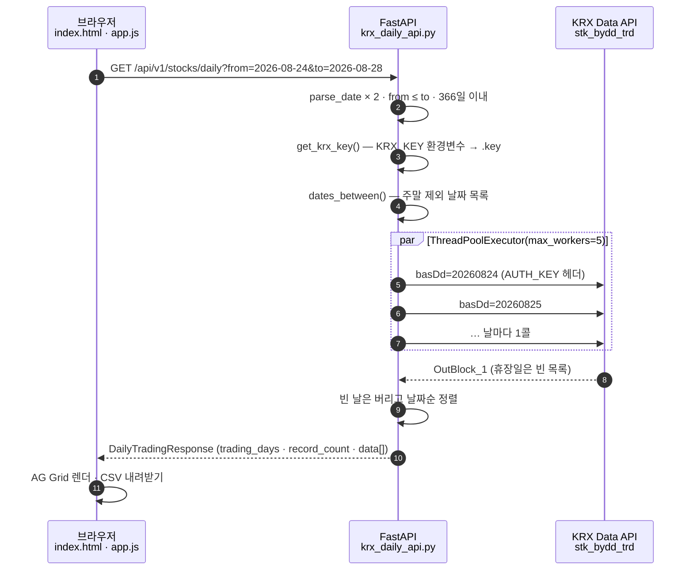
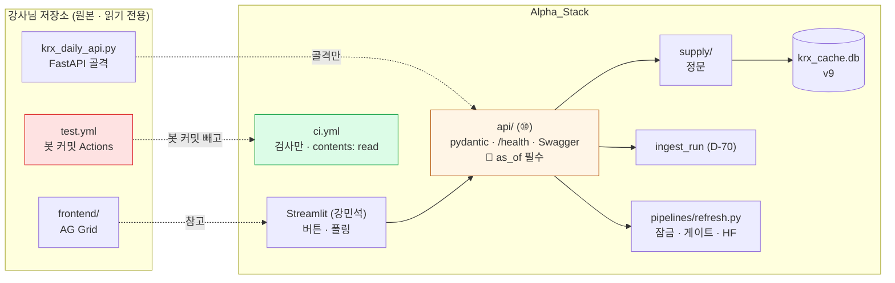

# 강사님 저장소 분석과 도입 설계 — `edumgt/quant-test-20260828` (v3.2)

> 2026-09-03 · 이동원 · 원본은 `learning/th05-quant-krx/lecture/` (읽기 전용 서브모듈 · 커밋 `8684a2b`) ·
> 강사님이 *"가져다 우리 프로젝트에 맞게 커스터마이징해도 된다"* 고 하신 저장소입니다.
> 이 문서는 **① 무엇이 들어 있나 → ② 어떻게 도나 → ③ 우리에 무엇을 어떻게 붙이나** 순서입니다.
> GitHub Actions 는 팀이 커밋·PR 을 많이 내는 구조라 **계정 제한(flagged) 위험을 따로 조사**했습니다(4절).

---

## 0. 한 줄

강사님 저장소는 **KRX 기간 조회 FastAPI + AG Grid 화면 + "자기 저장소에 봇 커밋하는" Actions 실습** 셋입니다.
FastAPI 골격은 우리 로드맵 ⑩ 과 그대로 겹쳐 가져오고, 화면은 강민석 님 Streamlit 으로 대응되며,
**Actions 는 봇 커밋 패턴을 빼고 "검사만 하는 CI" 로 좁혀서** 들입니다.

---

## 1. 무엇이 들어 있나 (실측 2026-09-03)

| 파일 | 줄 | 무엇 | 우리와의 관계 |
|---|---:|---|---|
| `krx_daily_api.py` | 160 | FastAPI. `GET /api/v1/stocks/daily?from&to` 가 KRX `stk_bydd_trd` 를 **날마다 1콜씩** 병렬(5워커)로 부른다. 최대 366일 · 주말만 건너뜀 · 휴장일은 빈 응답 | 로드맵 ⑩ FastAPI 의 **골격 원본** |
| `frontend/` (3파일) | ~60 | Vanilla JS + **AG Grid Community 36.1.0**(jsDelivr CDN). 정렬·필터·페이지·CSV 내려받기 | 화면 파트(강민석) 참고. 우리는 Streamlit 으로 합의 |
| `.github/workflows/test.yml` | 52 | `push main`·`pull_request`·수동 트리거 → 파일 존재 확인 → `test.md` 생성 → **`github-actions[bot]` 이름으로 자기 저장소에 커밋·push** (`[skip ci]`) | **4절**. 봇 커밋은 도입하지 않는다 |
| `gh.md` | 55 | `gh` CLI 실습 기록 — 저장소 생성 · `gh secret set` · Codespaces secret | 우리 규약과 겹치는 것만 (AGENTS.md 1.5) |
| `test_krx_daily_api.py` | 20 | `get_krx_key()` 두 경로(환경변수 → `.key`) 단위 테스트 | 우리 `common/secrets.py` 가 같은 순서(환경변수 → `.env` → `.key`) |
| `capture_naver.py` | 15 | Playwright 로 naver.com 캡처 | 우리 D-03 `robots.txt` 가드 기준으로 **naver.com 은 제3자 봇 불허** — 참고만 |
| `lotte_construction_cashflow_2023.py` | 30 | DART `fnlttSinglAcntAll` 로 받은 롯데건설 2023 현금흐름표 **값을 상수로** 적어 둔 예시 | 우리 `dart_financial` 이 같은 값을 갖는지 **대조 소재** |
| `requirements.txt` | 2 | `fastapi` · `uvicorn[standard]` | 우리 `pyproject.toml` 이 이미 핀으로 갖고 있다 (0.141.1 / 0.52.0) |

기술 스택은 강사님 README 표 그대로입니다 — Python 3 · FastAPI · Pydantic · Uvicorn · `urllib` · `ThreadPoolExecutor` · AG Grid · Playwright · Actions · `gh`.
**자동화 테스트 프레임워크는 없고** Actions 는 "저장소 점검 + 리포트 커밋" 실습입니다(README 원문).

### 우리에게 없는 것 · 있는 것

| | 강사님 | 우리 (2026-09-03) |
|---|---|---|
| 시세를 어디서 읽나 | **요청마다 KRX 호출** (캐시 없음) | SQLite `daily_price` 9,223,644행 · 하루 1회 증분 |
| 휴장일 처리 | 주말만 건너뜀 → 휴장일은 **빈 콜** | `trading_calendar` 12,306행 (실측 달력) |
| 한도 | 없음 (366일 요청이면 최대 262콜) | `call_budget` 10,000/일 (약관 제8조 ④) |
| 시점 정합 | 없음 | `supply` 정문 `as_of` 필수 |
| 키 | `KRX_KEY` 환경변수 → `.key` | `check_keys.py` 10종 · 실호출 검사 |
| API | ✅ 있다 (`/docs` Swagger) | ❌ `api/__init__.py` 하나 (28줄) |
| 화면 | ✅ AG Grid | ⏳ Streamlit (강민석) |
| CI | ✅ Actions (봇 커밋) | ❌ `.github/` 없음 |

**가져올 것은 오른쪽 아래 두 칸입니다.** 왼쪽 위는 우리가 이미 더 멀리 와 있습니다.

---

## 2. 어떻게 도나 — 요청 하나의 흐름



Actions 쪽 흐름은 강사님 README 의 다이어그램이 정확합니다 — `push main` → `test.md` 생성 → **봇 커밋·push** → (`[skip ci]` 로 재귀 차단).
`gh run list` 로 실측한 실행 이력은 7건이고(2026-08-27~28), PR 이벤트에서는 커밋 단계를 건너뛰어 실패 1건이 났습니다.

---

## 3. 세 요소를 우리에 대입

| 요소 | 강사님 방식 | 우리에 맞춘 방식 | 판정 | 담당 |
|---|---|---|---|---|
| **① 조회 API** | KRX 를 매번 호출 | **DB 를 읽고 `supply` 정문을 지난다.** pydantic 응답 모델 · `/health` · Swagger 는 그대로 가져온다 | ✅ 도입 (로드맵 ⑩) | 이동원 |
| **② 화면** | AG Grid (정렬·필터·CSV) | Streamlit `st.dataframe` 이 같은 기능을 준다. AG Grid 는 참고만 | 🟡 참고 | 강민석 |
| **③ Actions** | 봇이 `test.md` 를 커밋 | **검사만** (ruff · pytest) · 봇 커밋 없음 · `contents: read` | 🟡 **재설계 후 도입** (4절) | 이동원 → 팀 합의 |
| ④ `gh secret` / Codespaces | 키를 Codespaces secret 으로 | 우리는 로컬 `.env` 만. **Actions 에는 어떤 키도 올리지 않는다** — 테스트가 실호출을 하지 않는다 | ✅ 그대로 | — |
| ⑤ Playwright 캡처 | naver.com 스크린샷 | D-03 가드가 막는 대상. 크롤링 계획 없음 | ❌ 안 함 | — |
| ⑥ DART 예시 | 값을 상수로 | `dart_financial` 과 대조하는 **검증 소재**로만 | 🟡 검증에 활용 | 이동원 |

### ① 조회 API 설계 (로드맵 ⑩ 을 강사님 골격으로 다시 적음)

```
api/
├─ main.py            FastAPI(title="Qurious 데이터 API") · /health · /docs
├─ routes/
│   ├─ prices.py      GET /api/v1/prices/{code}?as_of=&start=&end=    ← supply.price_series
│   ├─ index.py       GET /api/v1/index/{name}?as_of=                  ← supply.index_series
│   ├─ runs.py        GET /api/v1/runs?limit=3                          ← ingest_run (D-70 폴링)
│   └─ refresh.py     POST /api/v1/refresh                              ← pipelines.refresh (잠금 포함 · 고도화 설계 §2)
└─ schemas.py         pydantic 응답 모델 (강사님 DateResult · DailyTradingResponse 꼴)
```

강사님 코드에서 **그대로 쓰는 것**: 날짜 두 형식 허용(`YYYYMMDD` · `YYYY-MM-DD`) · `from > to` 422 · 기간 상한 422 · 응답에 `trading_days`·`record_count` 요약 · 키 없을 때 500 대신 **무엇을 하라고** 말하는 메시지.
**바꾸는 것**: 외부 호출 자리를 DB 조회로 · `as_of` 를 **필수 쿼리**로(빠뜨리면 422) · 한도는 `call_budget` 이 아니라 조회라서 필요 없음.

> CLI 가 정본이고 API 는 **얇은 껍데기**입니다(v3.0 §7). API 안에 로직을 두면 CLI 와 두 벌이 됩니다.

---

## 4. GitHub Actions 도입 설계 — "flagged" 를 먼저 조사했다

우리는 10일 동안 커밋 181건 · 머지 62건 · PR 58건을 냈습니다(2026-08-25~09-03 실측 · devlee328288 35 · GoonGuMa 11 · janghwan-god 6 · rkdalstjr 6).
그리고 **이 팀 계정은 2026-07-28 에 정지된 이력이 있습니다**(AGENTS.md 1.5). 그래서 Actions 를 붙이기 전에 무엇이 계정을 막는지부터 봤습니다.

### 4.1 무엇이 계정을 막나 — 문서로 확인된 것

| 출처 | 확인된 내용 |
|---|---|
| GitHub Acceptable Use Policies §4 | 금지: *"automated excessive bulk activity and coordinated inauthentic activity, such as spamming"* · *"using our servers for any form of excessive automated bulk activity, to place undue burden on our servers through automated means"* · *"rank abuse, such as automated starring or following"* |
| 커뮤니티 토론 #31353 · #191536 | **개별 계정이 왜 막혔는지는 공개되지 않는다.** 스태프 답변은 *"account-specific should go to our support team"* 뿐. 사용자들이 든 예: 하루에 gist 를 여러 개 만듦 · 자동 대량 활동 |
| `GITHUB_TOKEN` 문서 | *"events triggered by the GITHUB_TOKEN will not create a new workflow run"* (예외: `workflow_dispatch`·`repository_dispatch`, 그리고 PR `opened/synchronize/reopened` 는 승인 대기 상태로). **재귀 실행 방지는 GitHub 설계**다 — 강사님의 `[skip ci]` 는 이중 안전장치 |
| Actions 요금 문서 | *"GitHub Actions usage is free for self-hosted runners and for public repositories that use standard GitHub-hosted runners."* — 우리 저장소는 Public 이라 **분(minute) 걱정은 없다** |

> 🔴 **판정 기준이 비공개**라는 것이 핵심입니다. "이 정도면 괜찮다" 를 문서로 증명할 수 없으므로 **보수적으로** 설계합니다 — 자동으로 *무언가를 만드는*(커밋·이슈·PR·댓글·별) 워크플로는 하나도 두지 않습니다.

### 4.2 한도 실측표 (GitHub 문서 · 2026-09-03 조회)

| 무엇 | 한도 | 우리 사용량 (10일 실측 환산) |
|---|---|---|
| Actions 분 — Public 저장소 | **무료** (Free 플랜 Private 은 2,000분/월) | 해당 없음 |
| `GITHUB_TOKEN` REST 호출 | 1,000 회/시간/저장소 | CI 가 API 를 부르지 않는다 → 0 |
| 사용자 토큰 REST 호출 | 5,000 회/시간 | `gh pr create`·`gh issue` 하루 10회 안팎 |
| 콘텐츠 생성 요청 | 80 회/분 · 500 회/시간 | 하루 6 PR + 댓글 몇 개 |
| 동시 요청 | 100 | 1 |
| 워크플로 트리거 | 1,500 이벤트/10초 · 500 런/10초 큐 | 하루 ~25 런 (커밋 18 + PR 6) |
| 동시 잡 (Free) | 20 | 최대 2~3 |

한도 대비로는 **어느 칸도 1% 가 안 됩니다.** 위험은 한도가 아니라 4.1 의 "자동 대량 활동" 판정입니다.

### 4.3 위험 순위 — 무엇이 우리를 그 판정에 가깝게 하나

| 순위 | 패턴 | 왜 위험한가 | 우리 규약 |
|---|---|---|---|
| 1 | **봇이 자기 저장소에 커밋** (강사님 `test.yml`) | push 마다 커밋이 하나 더 생긴다 → 4명 × 하루 18 커밋이 **36** 이 되고, 전부 "자동 생성 콘텐츠" 다. `contents: write` 권한도 필요 | ❌ 도입 안 함 |
| 2 | 자동 이슈·PR·댓글 생성 | 콘텐츠 생성 한도(500/시간)에 직접 걸리는 종류 | ❌ (AGENTS.md 1.5 — `gh api` 루프 금지) |
| 3 | `schedule`(cron) 로 수집을 Actions 에서 | 키를 secret 으로 올려야 하고, 수집 자체가 KRX 약관(키 양도 금지·제3자 제공 금지)에 걸린다 | ❌ 수집은 **로컬**(22코어 · 키는 로컬에만) |
| 4 | 저장소·gist 대량 생성 | 토론에서 반복 언급 | ❌ (AGENTS.md 1.5) |
| 5 | **검사만 하는 CI** (ruff · pytest) | 아무것도 만들지 않는다. 읽기 권한만 | ✅ **이것만 도입** |

### 4.4 설계 — `.github/workflows/ci.yml` 초안

```yaml
name: CI
on:
  pull_request:
    branches: [main]
    paths-ignore: ["docs/**", "notebooks/**", "**.md", "reports/**"]   # 문서만 바뀐 PR 은 돌지 않는다
  push:
    branches: [main]
    paths-ignore: ["docs/**", "notebooks/**", "**.md", "reports/**"]
permissions:
  contents: read                    # 🔴 write 를 주지 않는다 — 봇 커밋 자체가 불가능해진다
concurrency:
  group: ci-${{ github.ref }}       # 같은 브랜치에 연속 push 하면 앞 실행을 취소한다 → 런 수가 줄어든다
  cancel-in-progress: true
jobs:
  check:
    runs-on: ubuntu-latest
    timeout-minutes: 20             # 로컬 pytest 291초(848건) · CI 는 코어가 적어 여유를 둔다
    steps:
      - uses: actions/checkout@v4
      - uses: actions/setup-python@v5
        with: { python-version: "3.12", cache: pip }
      - run: pip install -e ".[dev]"
      - run: ruff check .
      - run: pytest -q
        env:
          KRX_DB_PATH: ${{ runner.temp }}/krx_cache.db   # conftest 가 어차피 임시 경로로 덮지만 명시한다
```

**왜 이렇게인가**

- `paths-ignore` — 우리 PR 의 큰 몫이 문서·노트북·TIL 입니다(58건 중 docs 계열이 절반 안팎). 그 PR 에서 CI 가 돌면 런 수만 늘고 얻는 것이 없습니다.
- `concurrency` — 한 PR 에 push 를 여러 번 하는 습관(오늘도 한 브랜치에 3~4 커밋)에서 앞 런을 취소해 **큐에 쌓이지 않게** 합니다.
- `contents: read` — 4.3 의 1순위를 **구조적으로** 막습니다. 나중에 누가 커밋 단계를 넣어도 권한이 없어 실패합니다.
- 키가 없습니다. 테스트 848건은 `conftest.py` 가 임시 DB 로 강제하고 실호출을 하지 않으므로 secret 이 필요 없습니다. **secret 을 안 올리니 유출할 것도 없습니다.**

### 4.5 검증 순서 — push 없이 먼저 돌린다

| 순서 | 무엇 | 왜 |
|---|---|---|
| 1 | **`nektos/act`** (MIT · 71,765 Stars) 로 로컬에서 `ci.yml` 실행 | GitHub 에 push 하지 않고 워크플로를 돌려 본다. **런 0회로 설계를 검증** |
| 2 | 테스트 시간 실측 — 로컬 22코어 291초가 CI 2코어에서 몇 초인가 | `timeout-minutes` 를 실측으로 정한다 |
| 3 | 브랜치 `ci/checks-only` 에서 PR 1건으로 1회 실행 | 실제 런너에서 1회만 |
| 4 | **팀 합의**(이슈) 뒤 main 머지 | 4명 전원의 PR 에 걸리는 일이다 |

### 4.6 안 하는 것

| 무엇 | 왜 |
|---|---|
| 봇 커밋 (`test.md`·배지·자동 포맷 커밋) | 4.3 1순위 |
| `schedule` 수집 | 키·약관·코어 수 셋 다 로컬이 맞다 |
| 자동 머지 · 자동 라벨 · 자동 리뷰 요청 | AGENTS.md 1.5 (계정 정지 이력) |
| Dependabot 자동 PR | PR 을 **더** 만든다. 핀은 손으로 올리고 실측으로 확인한다(`pyproject.toml` 규약) |
| 커버리지 업로드 · 외부 서비스 | 외부 토큰이 생긴다 |

### 4.7 팀에 묻는 것 (이슈로)

1. CI 를 붙이는 것 자체에 찬성하나 — 붙이면 **PR 마다 ruff 0건·pytest 통과가 머지 조건**이 됩니다(지금은 로컬 약속).
2. `paths-ignore` 범위 — 노트북 PR 도 제외해도 되나(노트북은 ruff 가 검사하지만 실행은 안 함).
3. 실패한 CI 를 누가 고치나 — PR 낸 사람이 원칙. 남의 파트 코드가 실패시키면 이슈로.

---

## 5. 커스터마이징 순서 (로드맵 ⑩ 을 다시 적음)

| 순서 | 무엇 | 크기 | 선행 |
|---|---|---|---|
| ⑩-1 | `api/main.py` + `/health` + `/api/v1/runs` (D-70 표 읽기) | 반나절 | 없음 |
| ⑩-2 | `/api/v1/prices`·`/index` — `supply` 정문 껍데기 · `as_of` 필수 | 반나절 | ⑩-1 |
| ⑩-3 | `POST /api/v1/refresh` — `pipelines.refresh` 호출 (잠금 · 고도화 설계 §2) | 반나절 | refresh 파이프라인 |
| CI-1 | `ci.yml` + `act` 로컬 검증 + 팀 합의 | 반나절 | 이슈 합의 |
| 화면 | Streamlit 이 `/runs` 를 폴링하고 버튼이 `/refresh` 를 부른다 | — | 강민석 |

---

## 6. 우리 구조 안에서 강사님 요소가 앉는 자리



붉은 칸이 **가져오지 않는 것**, 초록 칸이 그 대신 만드는 것입니다.

---

## 7. 이 문서가 답하지 않는 것

- Streamlit 화면의 구체 설계 — 강민석 님 파트입니다. 이 문서는 화면이 부를 **API 계약**까지만 적었습니다.
- CI 에서 테스트가 실제로 몇 초 걸리는가 — `act` 로컬 실행 뒤에 적습니다(미측정).
- 계정 제한의 정확한 기준 — GitHub 이 공개하지 않습니다. 그래서 4.3 처럼 **가장 가까운 패턴을 피하는 설계**로 대신했습니다.

## 출처

- GitHub Docs — Actions usage limits · GITHUB_TOKEN · About billing for GitHub Actions · REST API rate limits · Acceptable Use Policies (2026-09-03 조회)
- GitHub Community — Discussion #31353 · #191536 (계정 flagged)
- `gh run list --repo edumgt/quant-test-20260828` · `gh pr list --state all` · `git log --since=2026-08-25` (2026-09-03 실측)
