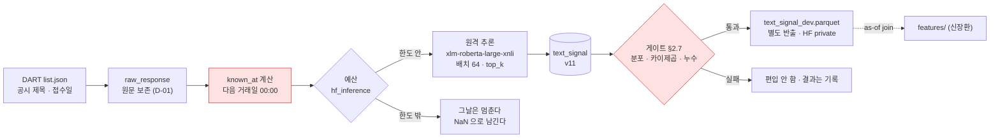
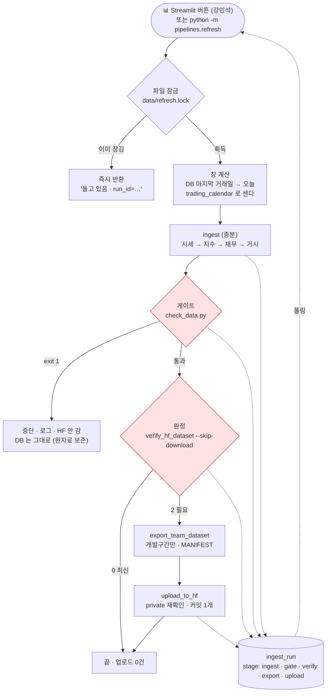

# 데이터 파트 고도화 설계 — HF 인코더 · 버튼 갱신 파이프라인 · 에이전트 상태 벡터 · Stars 벤치마킹 (v3.2)

> 2026-09-03 · 이동원 · **설계만** (구현 0줄) · 팀장 조사 자료를 기준으로 우리 제약에 맞춰 잘랐습니다.
> 근거는 전부 실측입니다 — `reports/hf_inference_probe.json` · `reports/github_stars_probe.json` ·
> [노트북 06/03](../../../notebooks/06-검토·발견/03.HF원격추론과-Stars를-재다.ipynb).
> 팀 의견은 우산 이슈에서 받습니다. 강사님 저장소 도입은 [별도 문서](강사님저장소_분석과_도입설계.md).

---

## 0. 한 장 요약

| 갈래 | 1차(~9/15)에 하는 것 | 2·3차 | 팀에 묻는 것 |
|---|---|---|---|
| ① HF 인코더 | DART **공시 제목**을 원격 추론으로 긍/부/중 확률 3칸으로 바꿔 `text_signal` 표에 쌓는다. 뉴스는 안 한다 | 뉴스(약관 미결) · 본문 · 임베딩 중복제거 | 텍스트 신호를 피처에 넣을지(신장환) · 파인튜닝 예외를 열지 |
| ② 버튼 갱신 | 수집 → 게이트 → 판정 → (필요할 때만) HF 를 **한 명령**으로. 파일 잠금 | 스케줄러 | 버튼이 HF 업로드까지 하나(토큰은 팀장 PC 에만) |
| ③ 상태 벡터 | **명세만** — `supply` 정문을 재사용하는 고정 차원 관측 배열 규격 | Gymnasium 환경 (RL 에이전트) | 보상·비용은 검증 파트 것이 맞나(강민석) |
| ④ Stars | 벤치마킹 18곳 실측 → 잠금·CI 로컬 실행·env 설계에 **셋 채택** | GitHub 활동 팩터(조사 §7) | 팩터 트랙을 2차에 열지 |

**실측이 바꾼 것 둘.** 첨부의 라이선스 표기가 모델 카드와 **8/18건** 달랐고(표기 불일치 7 + 카드 없음 1), 우리 HF 토큰에 **원격 추론 권한이 빠져 있어** 호출한 인코더 14종이 전부 403 이었습니다(§1.2·§1.3). 팀장이 같은 날 권한을 켠 뒤 재실측해 **라이선스 명시 6종이 실제로 돌았습니다**(§1.5 · 한국어 제로샷 긍정 0.988).

---

## 1. 제약이 후보를 어떻게 자르나

고도화라도 바뀌지 않는 것: 홀드아웃(20240901~)을 열지 않는다 · **생성형 API 를 쓰지 않는다** · **모델을 로컬에 내려받지 않는다**(원격 추론) · KRX 원자료를 public 으로 내지 않는다 · 파트 밖은 먼저 묻는다.

### 1.1 첨부 후보 → 남는 것 (2026-09-03 실측 · 카드 API + 원격 추론 호출)

```
첨부 4표 후보 18종 + 저장소 클라이언트가 쓰던 3종 = 21종
  ├─ 생성형(텍스트를 만든다)          5종  ❌  ReaderLM · NuExtract · nougat · whisper · GOT-OCR
  ├─ 라이선스가 카드에 없다            5종  ❌  finbert · finbert-tone · ko-sroberta · KR-FinBert-SC · gliner-relex(카드 404)
  ├─ 라이선스는 있는데 원격 제공 없음  5종  ❌  gliner_medium · table-transformer · klue-roberta-news-sentiment · koelectra · bge-m3(흔들림)
  └─ 라이선스 명시 + hf-inference 제공  6종  ✅  아래 표
```

| 모델 | 카드 라이선스 | 파이프라인 | 원격 제공자 | 쓸 자리 |
|---|---|---|---|---|
| `joeddav/xlm-roberta-large-xnli` | MIT | zero-shot-classification | hf-inference | **감성 라벨 (길 A)** — 저장소 클라이언트 기본값. 재실측 200 · 1.0초 · 한국어 문장에 **긍정 0.988** (§1.5) |
| `nlpai-lab/KURE-v1` | MIT | feature-extraction · 1024차원 | hf-inference | **임베딩 (길 B)** — 조사 §5 선정 · 재실측 200 · 콜드 24.9초 |
| `intfloat/multilingual-e5-large` | MIT | feature-extraction · 1024차원 | hf-inference · deepinfra | 임베딩 대안 (제공자가 둘) · 재실측 200 · 0.46초 |
| `sentence-transformers/paraphrase-multilingual-MiniLM-L12-v2` | Apache-2.0 | sentence-similarity · 384차원 | hf-inference | 경량 임베딩 대안 · 기본 경로 400 → `/pipeline/feature-extraction` 으로 200 · 0.3초 |
| `HuggingFaceFW/fineweb-edu-classifier` | Apache-2.0 | text-classification | hf-inference | 저정보 필터 — **영문 웹 교육성 점수**라 한국어 공시엔 안 맞는다. 재실측 200 · 콜드 12.0초 · 보류 |
| `kakaobank/kf-deberta-base` | MIT | fill-mask | hf-inference | 금융 인코더 **베이스** — 재실측 200(6.7초) 이지만 그대로는 라벨을 못 낸다. 파인튜닝은 다운로드 제약에 걸려 **예외 승인 필요** |

> 🔴 **한국어 금융 감성을 바로 주는 모델 중 세 제약을 다 통과하는 것은 0개입니다.**
> `snunlp/KR-FinBert-SC` 는 첨부가 CC-BY-NC-SA 라 적었지만 카드에 라이선스 태그가 **없고**,
> `FISA-conclave/klue-roberta-news-sentiment` 는 라이선스는 있는데 원격 제공자가 없습니다.

### 1.2 첨부와 카드가 다른 라이선스 — 8건 (표기 불일치 7 + 카드 없음 1)

| 모델 | 첨부 | 카드(실측) |
|---|---|---|
| knowledgator/gliner-relex-large | Apache-2.0 | **카드 자체가 없다 (404)** |
| ProsusAI/finbert | MIT | **미표기** |
| yiyanghkust/finbert-tone | MIT | **미표기** |
| jhgan/ko-sroberta-multitask | Apache-2.0 | **미표기** (조사 §5 와 같음) |
| snunlp/KR-FinBert-SC | CC-BY-NC-SA-4.0 | **미표기** (조사 §5 와 같음) |
| rbehzadan/ReaderLM-v2 | MIT | **미표기** |
| facebook/nougat-base | MIT | **cc-by-nc-4.0** |
| openai/whisper-large-v3 | MIT | apache-2.0 |

원칙(조사/도구선정 §4)대로 **카드 값만 믿습니다.** 검색 결과·블로그·GitHub 저장소 LICENSE 는 모델 가중치의 라이선스가 아닙니다.

### 1.3 🔴 토큰에 원격 추론 권한이 없다

인코더 16종 중 시험 문장이 있는 14종을 호출했고(비전 모델·베이스 인코더 2종 제외) **전부 `403`**, 본문은 하나였습니다.

```
This authentication method does not have sufficient permissions to call Inference Providers on behalf of user data-student
```

`whoami-v2` 로 확인한 우리 토큰(`qurious-quant-token` · fine-grained)의 권한은 `repo.content.read · repo.access.read · repo.write · discussion.write` 뿐입니다.
**모델이 아니라 토큰 문제**이고, 서버는 위 6종을 "제공한다(live)"고 답했습니다.

| 해결 | 누가 | 어떻게 |
|---|---|---|
| 토큰에 **"Make calls to Inference Providers"** 권한 추가 | 팀장 (HF 웹) | huggingface.co → Settings → Access Tokens → 해당 토큰 편집 → Inference 권한 체크 → ✅ **2026-09-03 11:5x 완료** · 재실측은 §1.5 |
| 가이드에 항목 추가 | 이 판 | [API키 발급 가이드 v3.2](API키_발급_가이드.md) §HuggingFace 에 "권한 두 종류" 를 적었다 |
| 검사기 확장 | 다음 세션 | `check_keys.py --live` 가 HF 는 지금 `whoami` 만 본다. **추론 권한까지** 보게 한다 |

무료 크레딧은 월 **$0.10**(Free) · PRO **$2.00** 이고(HF 문서 2026-09-03), `hf-inference` 는 CPU 초 × 단가로 과금됩니다. 크레딧이 다하면 호출이 멈추지 과금이 자동으로 붙지 않습니다(크레딧 구매 필요). **팀장이 2026-09-03 PRO 를 구독**해 월 $2.00 이 들어오고, 필요하면 충전하되 **상한을 두기로** 했습니다 → §2.5.

### 1.4 제공자 표시는 흔들린다

`BAAI/bge-m3` 가 11:2x 조회에서는 `hf-inference: live`, 11:27 이후 세 번 재조회에서는 모두 `status: error` 였습니다. `yiyanghkust/finbert-tone` 도 `error` 입니다.
→ 설계는 **한 번 조회한 값에 걸지 않고**, 호출 실패를 값으로 돌려주는 기존 클라이언트 규약(`{"available": False}`)을 그대로 씁니다. 신호가 없으면 그 날 칸은 NaN 이지 0 이 아닙니다.

### 1.5 권한을 켠 뒤 — 재실측 (2026-09-03 11:53 · 같은 스크립트)

| 모델 | 카드 | 호출 | 지연 | 응답 |
|---|---|---|---|---|
| `joeddav/xlm-roberta-large-xnli` | MIT | **200** | 1,035ms | `긍정 0.988 · 부정 0.007 · 중립 0.005` ("삼성전자 2분기 영업이익이 시장 예상을 웃돌았다.") |
| `intfloat/multilingual-e5-large` | MIT | **200** | 458ms | vector[1024] |
| `nlpai-lab/KURE-v1` | MIT | **200** | 24,864ms (콜드) | vector[1024] |
| `kakaobank/kf-deberta-base` | MIT | **200** | 6,704ms | `[MASK]` → "증가" 0.258 |
| `HuggingFaceFW/fineweb-edu-classifier` | Apache-2.0 | **200** | 11,986ms (콜드) | LABEL_0 −0.03 (영문 교육성 점수) |
| `sentence-transformers/paraphrase-multilingual-MiniLM-L12-v2` | Apache-2.0 | 기본 경로 400 → **`/pipeline/feature-extraction` 200** | 302ms | vector[384] |
| `ProsusAI/finbert` · `snunlp/KR-FinBert-SC` | **미표기** | 200 | 322 · 3,682ms | 돌긴 하지만 라이선스가 없어 못 쓴다 |
| `jhgan/ko-sroberta-multitask` | **미표기** | 경로 바꿔 200 | 5,822ms | 위와 같음 |
| `BAAI/bge-m3` | MIT | 경로 바꿔도 **504** | 120초 초과 | 2.2GB 모델의 콜드 스타트가 게이트웨이 한도를 넘는다 → 안 쓴다 |
| `gliner_medium` · `gliner-relex` · `klue-roberta-news-sentiment` | — | 400 | — | `Model not supported by provider hf-inference` — **정말 제공 안 함** |
| `yiyanghkust/finbert-tone` | 미표기 | 400 | — | `config.json` 에 `model_type` 없음 |

세 가지를 배웠습니다.

- **400 도 둘로 갈라집니다.** "제공 안 함" 과 "경로가 다르다". `sentence-similarity` 로 등록된 모델은 기본 경로가 `missing 'sentences'` 로 400 을 내고, `/pipeline/feature-extraction` 으로 부르면 됩니다 — 저장소 클라이언트 `hf_data.py` 가 2026-08-04 에 같은 것을 실측해 둔 그대로입니다. 400 만 보고 버리면 멀쩡한 모델을 잃습니다.
- **콜드 스타트가 25초까지** 갑니다(`KURE-v1`). 갱신 파이프라인(§3)과 예산(§2.5)의 타임아웃은 이 값으로 정합니다. `wait_for_model` 은 기다려 주지만 게이트웨이는 120초에서 끊습니다(`bge-m3` 504).
- **한국어 제로샷은 한국어를 읽습니다.** 길 A 가 종이 위에서 내려왔습니다 — 다음은 단가(크레딧 소모) 실측과 배치 64건 한 콜 확인입니다.

---

## 2. 갈래 ① HF 인코더 — 텍스트를 수치 칸으로

### 2.1 원료가 먼저다 — 텍스트는 지금 0행

| 원료 | 지금 | 시점 정합 | 약관 | 판정 |
|---|---|---|---|---|
| **DART 공시 목록** (`list.json`) | 클라이언트 있음(`fetch_disclosures`) · `dart_disclosure` 표는 v6 에 있고 **0행** | `rcept_dt`(접수일) **기록값** | 금감원 공공데이터 · 저장·재배포 제한 없음 | ✅ **1차 원료** |
| 네이버 뉴스 (API HUB) | 키 있음 · 실호출 1,099건 확인 | `pubDate` 기록값 | 약관 7.3 ③ **"저장(캐시 행위 포함)" 금지** → 계획서 부록 G ④ 미결 | ⏳ 2차 (법적 판단은 팀) |
| DART 공시 **본문** (`document.xml`) | 클라이언트 있음(`dart_report.py`) | 접수일 | 위와 같음 | ⏳ 3차 — 길어서 원격 추론 60초 안에 안 든다 |
| 빅카인즈 | 승인제 · 신청 안 함 | 기록값 | 크롤링 금지 명문 | ⏳ 2차 |

**1차 원료는 DART 공시 제목**(`report_nm`)입니다. 짧아서 배치 64건이 원격 추론 한 콜에 들어가고, 접수일이 기록값이라 시점 정합이 계산이 아닙니다.
규모는 350종 × 개발구간 14.7년입니다. 종당 연 30~60건이면 **5,000~21,000건**(추정 · 미측정)이고, `list.json` 이 페이지당 100건이라 콜 수는 **1,000콜 안팎**(추정)으로 DART 일 한도 20,000 안입니다. 실측은 v11 마이그레이션 세션에서 합니다.

### 2.2 모델 — 두 길, 둘 다 학습 없이 시작한다

| 길 | 무엇 | 실행처 | 왜 |
|---|---|---|---|
| **A. 제로샷** | `xlm-roberta-large-xnli` 에 후보 라벨 `["긍정","부정","중립"]` → 확률 3칸 | 원격 (HTTP) | 학습 0 · 클라이언트 `hf_data.classify()` 가 이미 있다 · 한국어 정답 실측 있음 |
| **B. 임베딩 + 얕은 분류기** | `KURE-v1` 1024차원 → 개발구간 5일 방향 라벨로 **로지스틱 회귀** 학습 | 임베딩은 원격 · 분류기는 **로컬**(sklearn · 수업 기법) | 파인튜닝이 아니라 다운로드 제약을 지킨다 · 도메인 신호를 라벨에서 배운다 |

**A 로 시작**합니다. A 가 §2.7 게이트를 못 넘으면 B 로 갑니다. B 도 못 넘으면 "공시 제목에는 5일 방향 신호가 없다"가 결론이고, 그것도 발표할 수 있는 실측입니다.

못 쓰는 것을 적어 둡니다 — `gliner`(원격 없음 · 로컬 필요) · `kf-deberta` 파인튜닝(다운로드 + Colab) · `NuExtract` 류 JSON 추출(생성형). 셋 다 **예외 승인** 없이는 안 합니다.

### 2.3 시점 정합 — 접수일에 시각이 없다

`list.json` 은 `rcept_dt`(YYYYMMDD)만 주고 접수 **시각**을 주지 않습니다. 15:00 접수 공시를 그날 신호로 쓰면 장 마감 30분 전에 알던 것이 되어 시세 T+1 0시 규약보다 앞섭니다.

```
known_at(공시) = rcept_dt 의 다음 거래일 00:00 (KST)      ← trading_calendar 로 센다
```

거시(D-13)와 같은 **계산값**입니다. 규칙을 바꾸면 재수집이 아니라 **재계산**이면 됩니다 — 원문(`raw_response`)이 남아 있으니까(D-01).

### 2.4 저장 — `text_signal` 표 (마이그레이션 **v11**)

v10 은 공공데이터포털 매핑이 예약했습니다(선착순 규약). 칸은 이렇습니다.

| 칸 | 뜻 |
|---|---|
| `code` · `rcept_no` · `rcept_dt` | 종목 · 접수번호(고유) · 접수일 |
| `known_at` | §2.3 계산값 |
| `source` | `dart_title` (뉴스가 들어오면 `naver_news` 등 — 뉴스는 **원문 저장 없이 점수만**) |
| `model` · `model_rev` | 어느 모델, 어느 리비전으로 판정했나 (모델이 바뀌면 값이 바뀐다) |
| `p_pos` · `p_neg` · `p_neu` | 확률 3칸 (라벨 하나가 아니라 분포를 남긴다) |
| `text_sha256` | 원문 해시 — DART 제목은 `raw_response` 에 있으니 여기엔 해시만 |

### 2.5 예산 — HF 호출도 우리가 먼저 센다 (D-04 · D-83)

팀장이 PRO 를 구독해 **월 $2.00** 크레딧이 들어옵니다(2026-09-03). 그 안에서 **상한을 두고**, 상한에 닿으면 멈추고 사람에게 충전 여부를 묻습니다 — 크레딧은 자동 과금이 아니라 "다 쓰면 거절" 이라 멈춤 자체는 안전하지만, 그 사실을 **우리가 먼저 알아야** 텍스트 신호가 조용히 비지 않습니다.

| 규칙 | 값 (제안 · 팀장 확인) | 왜 |
|---|---|---|
| 월 상한 | **$1.50** (크레딧의 75%) | 다른 실험·노트북이 쓸 여유 25% |
| 알림선 | 상한의 **80%** ($1.20) | `ingest_run` note 와 일지 이슈 댓글로 "충전 필요" 를 남긴다 — 사람이 충전한다 |
| 센 단위 | 호출 수 + **응답 지연(초)** 을 CPU 초의 대리값으로 | HF 가 잔액 조회 API 를 주지 않아 우리 쪽 장부가 정본이다(`call_budget` · 출처 `hf_inference`) |
| 단가 | **미측정** — 다음 세션에 배치 64건 한 콜을 보내고 billing 페이지에서 차감액을 읽어 정한다 | 추정으로 상한을 잡으면 상한이 거짓이 된다 |
| 거절 응답 | 크레딧 소진 응답(HTTP 402 로 추정 · 미확인)을 잡아 그날은 멈추고 `available: False` 로 남긴다 | 기존 클라이언트 규약 |

배치 64 로 5,000~21,000건이면 **80~330콜**(추정)이고, 콜드 스타트(§1.5 최대 24.9초)를 빼면 콜당 1초 안팎이라 월 상한 안에 들 것으로 **예상**합니다 — 단가 실측 뒤 이 문단의 숫자를 고칩니다.

### 2.6 반출 — 칸을 늘리지 않고 파일을 하나 더 낸다

`features_labels_*.csv` 에 칸을 더하면 SHA-256 이 바뀌어 **재배포 3조건 ③(반출 규격 변경)** 에 걸립니다. 그래서 `text_signal_dev.parquet` 를 **별도 파일**로 내고, 피처와 붙이는 것은 `code + bas_dd ≥ known_at` as-of join 입니다.
붙이는 코드는 `features/` 이라 **신장환 님 경계**입니다 — 우산 이슈에서 묻습니다.

### 2.7 검증 게이트 — 편입 전 통과 조건 (조사 §7.3 재사용)

| 검사 | 도구 (수업 기법) | 통과 기준 |
|---|---|---|
| 라벨 분포 | 셋 다 15~45% 인가 | 한 라벨이 70% 를 넘으면 신호가 아니라 상수다 |
| 개발구간 유의성 | **카이제곱** (감성 라벨 × 5일 방향 3분류) | p < 0.05 · 홀드아웃은 열지 않는다 |
| 누수 | `known_at` 이후 시세만 붙였나 | 위반 0행 (테스트) |
| 안정성 | 모델 리비전 고정 · 같은 입력 → 같은 출력 | 1주 간격 재판정 일치율 |

### 2.8 흐름



---

## 3. 갈래 ② 버튼 갱신 파이프라인 — `pipelines/refresh.py`

### 3.1 이미 있는 것 · 없는 것

| 필요한 것 | 있나 | 어디 |
|---|---|---|
| 증분 수집 (워터마크) | ✅ | `pipelines/ingest.py` — `fetch_log`·`collect_log` 로 받은 날을 건너뜀 |
| 품질 게이트 (exit 1) | ✅ | `scripts/check_data.py` → `reports/data_quality.json` |
| "이미 최신인가" 판정 | ✅ | `scripts/verify_hf_dataset.py --skip-download` → 0 최신 · 2 재배포 필요 |
| 반출 · HF 업로드 | ✅ | `export_team_dataset.py` · `upload_to_hf.py` (private 재확인 · `--dry-run`) |
| 진행 상태를 밖에서 보는 표 | ✅ | `ingest_run` · `ingest_run_stage` (D-70) |
| **넷을 잇는 한 명령** | ❌ | 없다 |
| **중복 실행 잠금** | ❌ | 없다 |
| **며칠 안 눌러도 구멍 없음** | 🟡 | `--days` 기본 **10** — 열흘 넘게 안 누르면 그 앞이 빈다 |

### 3.2 흐름



### 3.3 설계 결정

| 결정 | 무엇으로 | 왜 |
|---|---|---|
| 잠금 | `filelock` (MIT · 975★ · tox-dev) · `data/refresh.lock` · `timeout=0` | Windows·macOS 둘 다 · 프로세스가 죽으면 OS 가 푼다 · **기다리지 않고 즉시 "돌고 있음"** 을 돌려준다 — 버튼을 두 번 누르면 두 번째는 첫 번째의 `run_id` 를 본다 |
| 창 | `trading_calendar` 로 **DB 마지막 거래일 ~ 오늘** 거래일 수를 세서 `--days` 로 넘긴다 | 첨부의 "3일 뒤 눌러도 누락 없음" 이 이것이다. 고정 10일은 구멍이 난다 |
| 게이트 실패 | 중단 · exit 1 · `ingest_run` 에 `gate=error` · **DB 롤백 안 함** | 수집은 원자료 보존이라 되돌릴 이유가 없다. 막아야 하는 것은 **반출**이다 |
| HF 업로드 조건 | `verify_hf_dataset` 가 **2** 일 때만 | 🔴 첨부의 "게이트 통과 시 즉시 push" 와 다르다 — 반출본은 개발구간(~20240831)이라 새 시세로는 안 바뀐다. 재배포는 세 경우뿐(D-62) |
| 원자성 | HF `upload_folder` 는 **커밋 1개** · 로컬 outbox 는 날짜 폴더 | 부분 업로드가 없다. 실패하면 HF 는 이전 커밋 그대로 |
| 기록 | `ingest_run_stage` 에 `gate · verify · export · upload` 를 더한다 (D-70 확장) | 화면이 폴링하는 표를 늘리지 않는다 |
| 반환 계약 | `{"run_id", "status": ok|busy|gate_failed|error, "stages": {...}, "uploaded": bool}` | API(⑩-3)·화면이 같은 것을 읽는다 |
| 토큰 없는 PC | 업로드 단계를 `skipped(권한 없음)` 로 남기고 정상 종료 | HF 쓰기 토큰은 팀장 PC 에만 있다. 팀원이 눌러도 수집·게이트까지는 돈다 |

### 3.4 Streamlit 쪽 계약 (강민석 님께)

- 버튼은 `subprocess.Popen([sys.executable, "-m", "pipelines.refresh"])` 로 **비동기** 실행하고, `ingest_run` 을 2~3초마다 폴링합니다(D-70).
- 두 번 눌러도 안전합니다 — 잠금이 막고, 두 번째 호출은 `busy` 와 진행 중 `run_id` 를 돌려줍니다.
- 실패는 셋으로 갈라 보여 줍니다: `gate_failed`(자료 문제 · 사람이 봐야 함) · `error`(수집 실패 · 재시도) · `busy`.

---

## 4. 갈래 ③ 비LLM 에이전트 상태 벡터 — 2·3차 계약 (명세만)

LLM 을 쓰지 않는 에이전트(PPO·DDPG 같은 강화학습, 국면 기반 규칙)는 텍스트 프롬프트가 아니라 **고정 차원 숫자 배열**을 관측으로 받습니다. 1차에서 데이터 계층의 입출력 계약을 굳혀 두면 2·3차에서 데이터 코드를 안 고칩니다.

### 4.1 규격

```
supply.observation(target, *, as_of, window=W) -> np.ndarray[float32]  shape (W, F)      ← 계획 · 기본값 없음
```

| 항목 | 규격 |
|---|---|
| `W` | lookback 거래일 수. 기본 60 (개발구간 `sma_60` 과 같은 창) |
| `F` | 칸 목록을 **문서에 고정** — 순서가 곧 계약이다. ① `adj_*` 로그수익률 4 ② 거래량·거래대금 z-점수 2 ③ 지표 22칸(신장환 · `features_labels_*` 와 같은 이름) ④ 거시 9종(`known_at` 정합) ⑤ `text_signal` 3칸 ⑥ **마스크 채널** |
| 결측 | `NaN → 0` 으로 채우고 **마스크 채널에 1** — 0 이 "값" 인지 "없음" 인지 에이전트가 구분한다 (D-6 정합) |
| 스케일 | 학습구간에서 `fit` 한 스케일러를 **동봉** (QFRS-4). `as_of` 이후 자료로 fit 하면 누수 |
| 누수 | `as_of` 정문 재사용 — `step(t)` 마다 `as_of = t`. 정리매매·신규상장 제외는 학습 경로(`training_frame`)만 |
| Gymnasium | `observation_space = Box(-inf, inf, shape=(W, F), float32)` · `action_space` 와 보상·비용은 **검증 파트(강민석)** |

### 4.2 참고 구현 (Stars 실측 · 라이선스 전부 MIT)

| 저장소 | Stars | 무엇을 가져오나 |
|---|---:|---|
| `AI4Finance-Foundation/FinRL` | 16,200 | `StockTradingEnv` 의 관측 구성(잔고 + 보유 + 가격 + 지표) — 지표 자리를 우리 22칸으로 |
| `AminHP/gym-anytrading` | 2,388 | 가장 단순한 env — `_process_data` 가 (가격, 신호) 배열을 미리 만든다. **우리 `observation()` 이 그 자리** |
| `Farama-Foundation/Gymnasium` | 12,451 | `Env`·`Box` 계약 |

### 4.3 1차 산출

명세(이 절) + 계약 테스트 파일 이름 예약 `tests/test_observation_contract.py`(칸 순서 · shape · NaN/마스크 · `as_of` 없이는 안 열림). 구현은 2차.

---

## 5. 갈래 ④ GitHub Stars — 벤치마킹과 팩터 트랙

### 5.1 벤치마킹 실측표 (GraphQL 단발 1회 · 2026-09-03)

| 저장소 | Stars | 라이선스 | 최근 push | 판정 |
|---|---:|---|---|---|
| `fastapi/fastapi` | 102,040 | MIT | 2026-09-01 | ✅ 이미 핀 (0.141.1) · 로드맵 ⑩ |
| `nektos/act` | 71,765 | MIT | 2026-08-09 | ✅ **채택** — Actions 를 로컬에서 돌려 push 없이 검증 ([도입설계 §4.5](강사님저장소_분석과_도입설계.md)) |
| `microsoft/qlib` | 48,214 | MIT | 2026-09-02 | 🟡 Alpha158 피처 목록 참고 (신장환) — 프레임워크 도입은 무겁다 |
| `streamlit/streamlit` | 45,671 | Apache-2.0 | 2026-09-03 | ✅ 화면 합의 스택 (강민석) |
| `PrefectHQ/prefect` | 23,765 | Apache-2.0 | 2026-09-03 | ❌ 오케스트레이터 — 우리 `pipelines/` 300줄이 그 역할. 서버가 하나 더 생긴다 |
| `AI4Finance-Foundation/FinRL` | 16,200 | MIT | 2026-07-13 | 🟡 §4.2 참고 |
| `Farama-Foundation/Gymnasium` | 12,451 | MIT | 2026-08-29 | 🟡 §4.1 계약 |
| `fivetran/great_expectations` | 11,766 | Apache-2.0 | 2026-09-02 | ❌ 품질 게이트 — `check_data.py` 가 이미 "설명되지 않는 값" 에만 건다. 도구가 무겁고 저장소 주인이 fivetran 으로 바뀌었다 |
| `huggingface/text-embeddings-inference` | 5,036 | Apache-2.0 | 2026-07-24 | ❌ 자체 호스팅 — 다운로드 제약 |
| `unionai-oss/pandera` | 4,447 | MIT | 2026-09-02 | 🟡 **2차 후보** — 반출 파일·관측 배열의 스키마 계약을 코드로. 지금은 `tests/` 계약 테스트가 대신한다 |
| `huggingface/huggingface_hub` | 3,867 | Apache-2.0 | 2026-09-02 | ✅ 이미 핀 (1.29.0) |
| `urchade/GLiNER` | 3,601 | Apache-2.0 | 2026-08-10 | ❌ 원격 제공 없음 → 로컬 필요 |
| `AminHP/gym-anytrading` | 2,388 | MIT | 2024-03-14 | 🟡 §4.2 참고 (갱신 멎음) |
| `ProsusAI/finBERT` | 2,219 | Apache-2.0 | 2022-09-09 | ❌ **저장소는 Apache 인데 HF 모델 카드는 미표기** — 이 어긋남이 §1.2 의 예 |
| `FinanceData/FinanceDataReader` | 1,537 | MIT | 2026-05-13 | ✅ 이미 사용 (v9 수정주가) |
| `tox-dev/filelock` | 975 | MIT | 2026-09-01 | ✅ **채택** — §3.3 잠금 |
| `FinanceData/OpenDartReader` | 473 | MIT | 2026-08-10 | 🟡 보조 (우리 `dart_data.py` 가 직접 부른다) |
| `edumgt/quant-test-20260828` | 0 | **미표기** | 2026-08-28 | ✅ 강사님 허락으로 골격 도입 ([별도 문서](강사님저장소_분석과_도입설계.md)) |

**채택 셋** — `filelock`(잠금) · `act`(CI 로컬 검증) · Gymnasium 계약. 나머지는 참고이거나 우리에게 이미 있는 것입니다.

### 5.2 팩터 트랙 — GitHub 활동을 데이터로 (2차 후보)

[조사/모델벤치마킹 §7](../../조사/모델벤치마킹.md) 초안 그대로입니다. 1차에 열지 않는 이유는 하나 — **KRX 상장사 중 공개 GitHub 조직이 실재하는 곳이 몇인지 아직 재지 않았습니다.** 네이버·카카오·라인 급 소수로 추정(미측정)되고, 그러면 350종 유니버스에 붙는 칸이 대부분 NaN 입니다.
2차에 연다면 순서는 ① 매핑표 개수 실측 → ② 주 1회 GraphQL 단발 스냅샷 → ③ 봇 필터 전/후 둘 다 저장 → ④ §2.7 과 같은 게이트입니다. **API 반복 호출은 규약상 금지**라 스냅샷은 항상 단발 쿼리 1회입니다.

---

## 6. 어디에 반영했나

| 문서 | 무엇 |
|---|---|
| [명세서 v3.2](명세서.md) §2.8·§7 | D-80~D-84(텍스트 신호) · D-90~D-92(갱신 파이프라인) · D-100(관측 규격) 을 🔴 계획으로 등재 · 로드맵 재배열 |
| [계획서 v3.0](../../계획서/version3.0/) | 부록 A 선택범위 ⑪ 을 실측으로 고쳐 쓰고 ⑭·⑮·⑯ 추가 · 부록 C 이동원 열 9/2~ · 부록 H 에 "데이터 계층 계약" 열 · **HTML 산출 추가** (프로젝트명 확정과 같은 판) |
| [API키 가이드 v3.2](API키_발급_가이드.md) | HF 토큰 권한 두 종류 |
| 우산 이슈 · Actions 이슈 | 팀 의견 |

## 7. 남은 것

| 무엇 | 언제 |
|---|---|
| ~~HF 토큰에 추론 권한 추가 → 6종 실호출 재실측~~ | ✅ 2026-09-03 (§1.5) |
| 단가(크레딧 소모) 실측 · 배치 64건이 한 콜에 드는지 · 콜드 스타트 대비 타임아웃 | 다음 세션 첫 작업 |
| `check_keys.py --live` 가 HF 추론 권한까지 보게 | 다음 세션 |
| v10 공공데이터포털 매핑 → v11 `text_signal` | 순서대로 |
| `pipelines/refresh.py` + `filelock` 핀 + 테스트 | v11 전에 가능 (의존 없음) |
| CI `ci.yml` — `act` 로컬 검증 → 이슈 합의 → PR | 팀 합의 후 |
| 관측 규격 계약 테스트 | 2차 |
