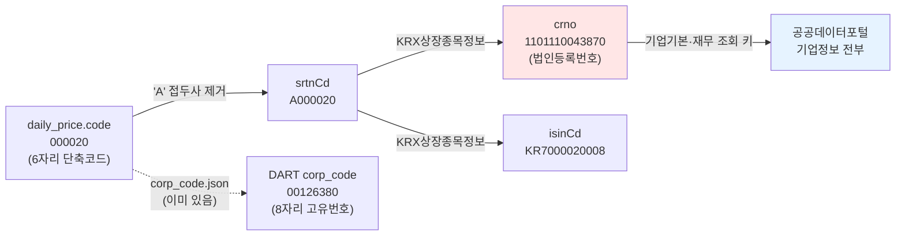
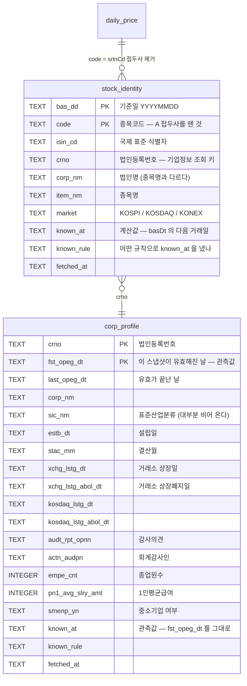
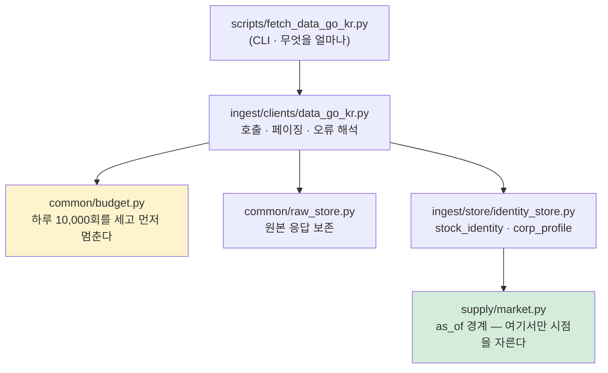

# 공공데이터포털 수집 설계 — 무엇을 왜 가져오나

> `docs/데이터파트/version3.2/공공데이터포털_수집_설계.md` · 2026-09-03 · 이동원
> 상태: **전량 수집 완료** (마이그레이션 v10 · 클라이언트 · 저장소 · CLI · 검증 · 테스트 90개)
> 실측 2026-09-03: `stock_identity` **4,197,242행**(1,635일 · 3,165종) ·
> `corp_profile` **40,573행**(법인 3,142곳) · 하루 8,124콜 / 한도 10,000
>
> 🔴 **v3.1 설계는 세 군데가 틀렸습니다.** 구현하며 API 를 실제로 불러 보고서야
> 드러났습니다 — 과거 구간·기본키·칸 이름. 무엇이 어떻게 틀렸고 왜 그렇게
> 됐는지는 [§10](#10-설계가-실측에-부딪힌-자리)에 남깁니다.
>
> 이 문서의 숫자는 전부 실측입니다. 재현 방법은 부록에 있습니다.

---

## 0. 한 줄 요약

공공데이터포털에서 가져올 가치가 있는 것은 **시세도 재무도 아니라 "다리"** 입니다 —
`종목코드 ↔ 법인등록번호 ↔ ISIN` 매핑과, **상장일·상장폐지일·감사의견** 같은 종목의
일생 기록입니다. 시세는 KRX 가, 재무는 DART 가 이미 더 자세히 줍니다.

**구현하고 나서 알게 된 가장 중요한 것 하나**를 먼저 적습니다.

> 🔴 **포털의 `basDt` 목록은 그 시점의 상장 목록이 아닙니다.**
>
> `basDt=20200102` 로 받은 2,334종 안에 **그날 이후에야 상장된 종목이 33종** 있었습니다.
> 가장 늦은 것은 듀켐바이오(176750)로 첫 시세가 **2024-12-20**, 4년 뒤입니다.
> 포털은 최신에 가까운 목록에 기준일 딱지만 붙여 주는 것으로 보입니다.
>
> 그래서 `stock_identity` 로 유니버스를 그대로 만들면 **아직 없던 종목이 섞입니다.**
> 미래참조이고, 에러 없이 성능만 좋아집니다. 반드시 `daily_price` 와 **교집합**을
> 내서 씁니다. 이 표의 쓸모는 *"그날 무엇이 상장돼 있었나"* 가 아니라 **다리**이고,
> 다리로 쓰는 데는 이 성질이 해가 되지 않습니다.

## 1. 왜 이 질문부터 하나 — 우리는 이미 수집원이 많다

| 수집원 | 담당 | 지금 담긴 것 |
|---|---|---|
| KRX OpenAPI | 시세·지수 | `daily_price` 9,223,644행 · `index_price` 196,119행 |
| OpenDART | 공시·재무 | `dart_financial` 662,933행 |
| ECOS (한국은행) | 국내 거시 | `macro_series` 17,851행 |
| FRED | 미국 거시 | 〃 |
| KOSIS | 통계청 | 조회만 |
| 금감원 finlife | 예·적금 금리 | 조회만 |
| FinanceDataReader | 수정주가 | `adj_*` 4칸 (fdr 81.6% · chain 18.4%) |
| yfinance | 해외 시세 | 조회만 |

여덟 곳입니다. 그러니 아홉 번째를 더할 때 물어야 할 것은 **"쓸 수 있나"가 아니라
"겹치지 않고 새로 얻는 게 무엇인가"** 입니다. 겹치는 것을 더하면 **관리 비용만 늘고,
두 출처가 어긋날 때 어느 쪽이 옳은지 정하는 일**이 새로 생깁니다.

---

## 2. 전수 조사 — 금융위원회가 여는 것

금융위원회는 공공데이터포털에 **9개 주제 · 91개 API · 298개 테이블**을 개방하고
있습니다(금융위 [개방 현황](https://www.fsc.go.kr/in060301) · 2023-06 기준 공식 집계).
주제별 목록입니다.

<details>
<summary><b>금융위원회 개방 API 전체 목록</b> — 펼쳐 보기</summary>

### 기업정보
기업기본정보(기업개요·계열회사·연결대상종속기업) · 지배구조정보(주주·대표이사 외 2) ·
**기업 재무정보**(요약재무제표·재무상태표·손익계산서) · 차입투자정보(부실채권회생·파산 외 2) ·
**KRX상장종목정보**(종목정보) · 주식발행공시정보(주식총수현황) ·
기업지배구조공시정보(소액주주현황·미등기임원 보수·개인별 보수지급)

### 금융회사정보
금융회사기본정보 · 금융회사지배구조정보 · 금융회사재무신용정보 · 금융회사부보정보 ·
파산금융회사 기본정보/재무상태표/손익계산서 · 금융회사 자금지원및회수정보

### 공시정보
공시정보(배당공시·유상증자결정 외 31개) · 금융회사공시정보(외 28개) ·
자금조달공시정보(공모/사모자금사용내역·채무증권발행실적 외 5)

### 자본시장정보
주식발행정보 · 주식등록예탁가능정보 · **주식배당정보** · **주식권리일정정보** ·
주식분포 및 사고주권정보 · 채권기본/권리행사/권리일정/발행정보 · 신주인수권증권 발행정보 ·
단기금융증권 발행/거래정보 · **주식대차정보**(6기능) · 채권대차정보 · REPO종목/거래정보 ·
국제거래종목정보 · 국제거래외화증권예탁결제정보 · 크라우드펀딩(발행사·중개업자) ·
모기지론 8종

### 시세정보
**주식시세정보** · **지수시세정보** · 채권시세정보 · 증권상품시세정보

</details>

### 실측 — 우리 키로 지금 열려 있는 것

문서를 옮겨 적지 않고 **직접 호출해서** 확인했습니다(2026-09-03).

| API | 엔드포인트 | 결과 | 칸 |
|---|---|---|---|
| KRX상장종목정보 | `GetKrxListedInfoService/getItemInfo` | ✅ 하루 2,694건 | 7 |
| 기업기본정보 | `GetCorpBasicInfoService_V2/getCorpOutline_V2` | ✅ 누적 1,291,424건 | 37 |
| 기업 재무정보 | `GetFinaStatInfoService_V2/getSummFinaStat_V2` | ✅ 누적 2,138,128건 | 15 |
| 주식시세정보 | `GetStockSecuritiesInfoService/getStockPriceInfo` | ✅ 하루 2,832건 | 15 |
| 지수시세정보 | `GetMarketIndexInfoService/getStockMarketIndex` | ✅ 하루 144건 | 21 |
| 금융회사기본정보 | `GetFnCoBasiInfoService/getFnCoOutl` | ✅ 누적 2,317,488건 | — |

**아직 경로를 못 찾은 것** — 주식발행정보 · 주식배당정보 · 주식권리일정정보 ·
주식대차정보 · 주식분포정보 · 지배구조정보. 서비스명 규칙(`Get…InfoService/get…`)을
여러 조합으로 때려 봤지만 전부 `NO_OPENAPI_SERVICE` 였습니다. 포털 상세 페이지의
활용자 가이드(`.docx`)에 정확한 경로가 있으므로, 구현할 때 그것부터 받습니다.

> ⚠️ 포털 공지: **지수시세정보는 2026-06-26 기준 데이터부터 제공이 지연 중**입니다.
> 과거 구간(2024년)은 정상적으로 나옵니다.

---

## 3. 겹침 분석 — 무엇이 새로운가

### 겹치는 것 (가져올 이유가 약하다)

| API | 우리가 이미 가진 것 | 판단 |
|---|---|---|
| 주식시세정보 (15칸) | KRX `daily_price` (20칸, `adj_*` 포함) | **KRX 가 더 낫다.** 백업 경로로만 |
| 지수시세정보 | KRX `index_price` | 〃 · 게다가 지금 제공 지연 |
| 기업 재무정보 (15칸) | DART `dart_financial` (662,933행) | **DART 가 더 자세하다.** 교차검증용 |
| 채권·REPO·모기지론 | — | **범위 밖.** 주식 예측에 안 쓴다 |

### 새로 얻는 것 (여기가 본론)

#### ① 종목코드 ↔ 법인등록번호 ↔ ISIN 매핑 — **다리**

`GetKrxListedInfoService/getItemInfo` 의 실제 한 행입니다.

```json
{
  "basDt": "20240830",
  "srtnCd": "A000020",
  "isinCd": "KR7000020008",
  "mrktCtg": "KOSPI",
  "itmsNm": "동화약품",
  "crno": "1101110043870",
  "corpNm": "동화약품(주)"
}
```

이게 왜 중요한가 — **식별자가 계층마다 다르기 때문**입니다.



공공데이터포털의 **기업기본정보·재무정보는 전부 `crno`(법인등록번호)로 조회**합니다.
우리 `daily_price` 에는 `crno` 가 없습니다. 이 매핑이 없으면 **그 두 API 를 종목에
붙일 방법이 아예 없습니다.** 그래서 이게 첫 번째로 가져와야 할 것입니다.

덤으로 `isinCd` 도 들어옵니다 — 우리 DB 에 없는 국제 표준 식별자이고, 외부 자료와
맞출 때 종목코드보다 안전합니다(종목코드는 재사용되지만 ISIN 은 안 됩니다).

> ⚠️ `srtnCd` 는 `A000020` 처럼 **`A` 접두사가 붙습니다.** 우리 `code` 는 `000020`
> 입니다. 그냥 붙여 놓으면 조인이 0행이 되는데 에러는 안 납니다. 반입 규칙에서
> 접두사를 떼는 것을 **명시적으로** 해야 합니다.
> 그리고 종목코드는 **숫자가 아닙니다** — 5·6번째에 영문이 오는 종목이 84종
> (`0001B0`) 있습니다. `int()` 로 바꾸면 그 자리에서 깨집니다.

#### ② 종목의 일생 — 상장일 · 상장폐지일 · 감사의견

`GetCorpBasicInfoService_V2` 의 37칸 중 우리에게 필요한 것들입니다.

| 칸 | 뜻 | 왜 쓸모 있나 |
|---|---|---|
| `enpXchgLstgDt` / `enpXchgLstgAbolDt` | 거래소 상장일 / 폐지일 | **생존 편향**을 자료 끊김으로 추정하지 않아도 된다 |
| `enpKosdaqLstgDt` / `enpKosdaqLstgAbolDt` | 코스닥 상장 / 폐지일 | 〃 |
| `audtRptOpnnCtt` | 감사의견 | **상장폐지 선행 신호.** 의견거절·한정은 실제 위험 표지 |
| `actnAudpnNm` | 회계감사인 | 감사인 교체가 신호가 되기도 한다 |
| `enpEmpeCnt` | 종업원수 | 규모 대리 변수 |
| `enpPn1AvgSlryAmt` | 1인평균급여 | 인건비 구조 |
| `empeAvgCnwkTermCtt` | 평균근속연수 | 〃 |
| `smenpYn` | 중소기업 여부 | 층화 기준 |
| `sicNm` | 표준산업분류 | **KRX `sector` 보다 안정적.** 지금 `sector` 는 46.4%가 빈 값이다 |
| `enpEstbDt` | 설립일 | 업력 |
| `enpStacMm` | 결산월 | 재무 시점 정합에 필요 |

**지금 우리가 추정으로 하고 있는 것을 사실로 바꿔 줍니다.** 표본 30종목을 고를 때
"개발구간 끝보다 90일 앞에서 자료가 끊기면 중도 소멸로 본다" 는 어림을 쓰고 있는데
(`export_team_dataset.py`), 상장폐지일이 있으면 어림이 필요 없습니다.

#### ③ 요약재무 — DART 교차검증

`fnclDebtRto`(부채비율)가 **계산돼서** 옵니다. DART 원장에서 우리가 계산한 값과
맞대어 보면, 계산 규칙이 맞는지 확인할 수 있습니다. 새 정보를 얻는 게 아니라
**우리 계산을 검증**하는 용도입니다.

---

## 4. 무엇을 어떤 순서로 가져오나

| 순서 | 무엇 | 왜 이 순서인가 |
|---|---|---|
| **1** | KRX상장종목정보 → `stock_identity` | 다른 모든 것의 **조회 키**다. 이게 없으면 ②③을 못 붙인다 |
| **2** | 기업기본정보 → `corp_profile` | 상장·폐지일·감사의견. `crno` 가 있어야 조회된다 |
| **3** | 기업 재무정보 → 대조만 | 저장하지 않고 DART 와 **맞대어 보기만** 한다 |
| — | 주식시세·지수시세 | **가져오지 않는다.** KRX 가 더 낫다 |
| 보류 | 배당·권리일정·대차 | 엔드포인트를 못 찾았다. 활용자 가이드 확보 후 |

### 왜 재무는 저장하지 않나

DART `dart_financial` 이 이미 662,933행이고 계정과목 단위로 훨씬 자세합니다. 같은
사실을 두 표에 두면 **어긋났을 때 어느 쪽이 옳은지 정하는 일**이 생깁니다. 그 비용이
얻는 것보다 큽니다. 대신 **검증 스크립트에서 한 번씩 맞대어** 보고, 어긋나면 이슈로
남깁니다.

---

## 5. 저장 설계 — 마이그레이션 v10 (적용 완료)

> 스키마는 **v9 → v10** 으로 올렸습니다. 배정표 세 곳을 함께 고쳤고, 어긋나면
> 테스트가 잡습니다(`test_다음_번호_상수가_실제_최신과_맞는다`). 다음 빈 번호는 **v11** 입니다.

### 표 두 개



### 🔴 `corp_profile` 의 기본키가 설계와 달라졌습니다

v3.1 은 `(crno, bas_dd)` 로 잡았습니다. **그런데 응답에 `basDt` 칸이 아예 없습니다.**

대신 `fstOpegDt` ~ `lastOpegDt` 가 **그 스냅샷이 유효한 구간**이고, 한 법인의 여러
행이 겹치지 않게 이어집니다. 동화약품(1101110043870)은 17행이었고, 표본 12개 법인
182행에서 **겹침 0 · 빈값 0** 이었습니다.

이게 우리에게 **이득**인 이유가 둘 있습니다.

1. **`known_at` 이 계산값이 아니라 관측값이 됩니다.** 거시(ECOS)는 발표일을 주지
   않아 "기준일의 다음 영업일" 로 계산할 수밖에 없었고, 그래서 *규칙을 바꾸면
   재수집* 이라는 짐이 남았습니다. 여기서는 출처가 직접 "이 값은 이 날부터
   유효했다" 를 말해 줍니다. 그 짐이 없습니다.
2. **날짜별 반복 호출이 필요 없습니다.** 한 번 부르면 그 법인의 전 이력이 옵니다 —
   법인 수만큼(약 2,700콜)만 부르면 됩니다.

### 기본키를 왜 이렇게 잡나

**`stock_identity` 는 `(bas_dd, code)` 입니다.** 종목명은 바뀌고(쓰리원 → UCI),
코드가 재사용되기도 합니다. 날짜를 키에 넣어야 "그때는 이 코드가 이 회사였다" 가
남습니다.

**`corp_profile` 은 `(crno, fst_opeg_dt)` 입니다.** 종업원수·감사의견은 해마다
바뀝니다. 최신이 과거를 덮으면 2021년 모델이 2026년 감사의견을 보게 됩니다 —
미래참조이고, 에러 없이 성능만 좋아집니다.

> 🔴 **기본키에서 칸 하나를 빼면 조용히 사라집니다.** 재무 수집에서 `account_detail`
> 을 빼는 바람에 자본변동표의 6.4%가 사라진 적이 있습니다. 행 수만 세는 검사로는
> 잡히지 않습니다 — 덮어쓰기라 행 수가 그대로이기 때문입니다.

### 종목코드 CHECK 를 어떻게 걸었나

```sql
CHECK (length(code) = 6),
CHECK (code GLOB '[0-9][0-9][0-9][0-9]*')
```

**코드 전체가 숫자라고 단정하지 않습니다.** 5·6번째에 영문이 오는 종목이 84종
있습니다(`0001A0`·`00088K` 등 신형우선주 · 우리 DB 3,677종 중 실측). `code GLOB
'[0-9]*'` 로 막으면 그 84종이 통째로 격리되는데, **격리는 조용해서** 한참 뒤에나
눈치챕니다.

대신 **앞 4자리는 항상 숫자**입니다(3,677종 전수 확인). 이걸로 접두사를 안 뗀 값을
잡습니다 — `A000020` 을 6자로 자른 `A00002` 가 걸립니다. 접두사가 그대로면 7자라
길이 검사에서 먼저 걸립니다.

### `known_at` — 두 표의 기준이 다릅니다

| 표 | `known_at` | 성질 |
|---|---|---|
| `stock_identity` | `bas_dd` 의 **다음 거래일** | 🔴 계산값 — 규칙을 바꾸면 재수집 |
| `corp_profile` | `fstOpegDt` 그대로 | ✅ 관측값 — 출처가 직접 준다 |

앞엣것은 포털이 발표 시각을 주지 않아 계산합니다. 포털 안내가 *"기준일자로부터
영업일 하루 뒤 오후 1시 이후 갱신"* 이므로 기준일 당일에는 볼 수 없었습니다.

행마다 `known_rule` 을 남깁니다 — 규칙을 바꿨을 때 **어느 행이 옛 규칙인지** 알 수
있어야 하기 때문입니다. 거시에서 이 칸이 없어 애를 먹었습니다.

### 거래일 다음 날은 달력으로 셉니다 (이분탐색으로 바꿨습니다)

"다음 영업일" 을 날짜 계산으로 하면 안 됩니다. 개발구간 평일 3,042일 중 실제
거래일은 2,880일이라 **162일(5.3%)이 어긋납니다.**

`common.trading_calendar.next_session()` 이 그 일을 하는데, 예전에는 4,102개를
**선형 스캔**했고 이 함수가 행마다 불립니다. 정렬본 + `bisect` 로 바꿨습니다.

| | 1,000번 호출 |
|---|---|
| 옛 (선형 스캔) | 176.4 ms |
| 새 (이분탐색) | **0.4 ms** — 422배 |

답이 같은지는 옛 구현을 되살려 **4,206개 날짜(거래일 + 휴장일)를 전부 맞대어**
확인했습니다 — 어긋난 날 0. 범위 밖 예외도 그대로입니다.

> ⚠️ 정렬본은 집합에서 파생된 **사본**이라, 집합만 갈아 끼우면 조용히 옛 달력으로
> 답할 수 있습니다. 테스트가 실제로 `_SESSION_CACHE` 를 monkeypatch 하므로 이 경우가
> 실제로 일어납니다. 그래서 갱신 책임을 갈아 끼우는 쪽에 맡기지 않고 **읽는 쪽 한
> 곳**에서 지킵니다(`_sorted_days`). 회귀 테스트로 잠갔습니다.

---

## 6. 클라이언트 설계

`ingest/clients/data_go_kr.py` 하나로 금융위 API 전체를 다룹니다. 엔드포인트마다
파일을 나누면 인증·페이징·오류 처리가 복사됩니다.



### 🔴 응답 칸 이름 — 실측이 정본입니다

v3.1 이 적어 둔 이름은 **추측이었습니다.** 실제로는 `enp` 접두사가 붙은 것이 많습니다.
칸 이름이 하나 틀리면 **그 칸이 조용히 NULL 로 들어갑니다** — 에러가 안 납니다.

**KRX상장종목정보** — 칸이 7개뿐입니다.

| 응답 | 우리 칸 | 예시 |
|---|---|---|
| `basDt` | `bas_dd` | `20240822` |
| `srtnCd` | `code` | `A000020` → **`000020`** (접두사를 뗀다) |
| `isinCd` | `isin_cd` | `KR7000020008` |
| `crno` | `crno` | `1101110043870` |
| `corpNm` | `corp_nm` | `동화약품(주)` |
| `itmsNm` | `item_nm` | `동화약품` |
| `mrktCtg` | `market` | `KOSPI` |

**기업기본정보** — 칸이 37개고 그중 16개를 담습니다.

| 응답 | 우리 칸 | 비고 |
|---|---|---|
| `crno` · `fstOpegDt` · `lastOpegDt` | `crno` · `fst_opeg_dt` · `last_opeg_dt` | 앞 둘이 기본키 |
| `corpNm` | `corp_nm` | |
| `sicNm` | `sic_nm` | ⚠️ 대부분 비어 온다 |
| `enpEstbDt` | `estb_dt` | `18970925` (YYYYMMDD) |
| `enpStacMm` | `stac_mm` | `12` |
| `enpXchgLstgDt` | `xchg_lstg_dt` | 🔴 `76/03/24` (**두 자리 연도**) |
| `enpXchgLstgAbolDt` | `xchg_lstg_abol_dt` | 🔴 폐지일 — 사라진 법인 8곳 **전부** 채워져 왔다 |
| `enpKosdaqLstgDt` · `enpKosdaqLstgAbolDt` | `kosdaq_lstg_*` | |
| `audtRptOpnnCtt` | `audt_rpt_opnn` | `적정의견` |
| `actnAudpnNm` | `actn_audpn` | `한울회계법인` |
| `enpEmpeCnt` | `empe_cnt` | `838` |
| `enpPn1AvgSlryAmt` | `pn1_avg_slry_amt` | `72000000` |
| `smenpYn` | `smenp_yn` | ⚠️ 대부분 비어 온다 |

⚠️ `enpKrxLstgDt`·`enpKrxLstgAbolDt` 는 표본에서 **전부 비어** 있었습니다. 상장일은
`enpXchgLstgDt` 에만 들어옵니다.

### 🔴 날짜 형식이 한 응답 안에 세 가지입니다

```
enpEstbDt          18970925      YYYYMMDD
enpXchgLstgDt      76/03/24      YY/MM/DD     ← 두 자리 연도
fssCorpChgDtm      2025/08/07    YYYY/MM/DD
```

`normalize_date()` 가 구분자를 떼고 자릿수로 가릅니다. 6자리면 두 자리 연도이고
`56~99 → 1900대` · `00~55 → 2000대` 로 풉니다(§7 참고).

**읽을 수 없는 값은 지어내지 않고 `None` 을 줍니다.** 비어 있는 것은 눈에 띄지만,
아무 값이나 넣으면 그 뒤로 아무도 못 찾습니다.

### 지켜야 할 것

**표준 라이브러리 `urllib` 만 씁니다.** 기존 클라이언트 8개가 전부 그렇습니다
(`requests`·`httpx` 를 안 씁니다). 새 의존성을 들이지 않습니다.

**🔴 서비스키를 다시 인코딩하지 않습니다.**

```python
# 🔴 %3D 가 %253D 로 두 번 인코딩돼 인증이 실패한다
url = BASE + "?" + urlencode({"serviceKey": key, **params})

# ✅ 서비스키는 그대로 잇고 나머지만 인코딩한다
url = f"{BASE}?serviceKey={key}&" + urlencode(params)
```

**오류를 세 갈래로 갈라 보고합니다.** 겉으로는 다 "안 된다" 지만 할 일이 다릅니다.

| 응답 | 뜻 | 할 일 |
|---|---|---|
| `SERVICE_KEY_IS_NOT_REGISTERED` | 키가 틀렸다 | 키 확인 (Encoding/Decoding?) |
| `SERVICE_ACCESS_DENIED_ERROR` | 키는 맞고 **활용신청**이 없다 | 포털에서 신청 |
| `NO_OPENAPI_SERVICE_ERROR` | **경로**가 틀렸다 | 엔드포인트 확인 |
| `LIMITED_NUMBER_OF_SERVICE_REQUESTS` | 한도 초과 | 내일 |

**막다른 길로 만들지 않습니다** — 멈출 때는 예외만 던지지 말고 *무엇을 해야 하는지*
까지 출력합니다. 기존 클라이언트가 전부 그렇게 돼 있습니다.

### 페이징 — 실측으로 확인했습니다

`numOfRows` 최대 1,000 · `pageNo` 로 넘깁니다. `totalCount` 와 실제로 받은 행 수가
**정확히 맞았습니다** (20200102 → 2,334 / 20250102 → 2,728).

```
1,636 거래일 × 3페이지 ≈ 4,908콜   (하루 한도 10,000 · 여유 5,092)
```

v3.1 이 걱정한 12,306콜은 **전 구간을 4,102거래일로 본 탓**이었습니다. 과거가
2020년부터라 절반 이하로 줄었고, 샘플링할 이유가 없어졌습니다(§9-1).

⚠️ **`totalCount` 만 믿고 페이지 수를 계산하지 않습니다.** 빈 페이지가 오면 거기서
멈춥니다 — `totalCount` 가 실제 행보다 크면 무한히 돌기 때문입니다. 반대로 총건수에
닿으면 한 번 더 부르지 않습니다 — 그 한 콜이 날마다 쌓이면 한도가 됩니다.

### 예산 — 부르기 전에 셉니다

`common.budget.try_spend()` 를 **호출 직전**에 부릅니다. 부르고 나서 세면, 응답을
못 받고 죽었을 때 이미 나간 호출이 장부에 안 남아 한도를 넘겨 씁니다. 포털이 한도
초과를 알려 줄 때는 이미 늦었습니다 — 그날은 더 못 받습니다.

`--plan` 이 받기 **전에** 총 콜 수와 남은 한도를 보여 줍니다. 절반쯤 받다 멈추면
어디까지 받았는지 맞추는 일이 생기기 때문입니다.

### 이어받기

`collect_log` 에 대상마다 한 줄을 남깁니다. `empty`(휴장)도 **받은 것으로 칩니다** —
안 그러면 휴장일마다 영원히 다시 요청합니다. 시세 수집이 쓰는 방식과 같습니다.

---

## 7. 검증 — 무엇으로 "맞다"고 했나 (`scripts/verify_identity.py`)

행 수만 세는 검사는 **덮어쓰기를 못 잡습니다.** 이번 세션에도 반출본이 행 수
80,439로 똑같은데 SHA-256 만 다른 일이 있었습니다.

그리고 **검증식이 항등식이면 아무것도 못 잡습니다.** "우리가 넣은 값 == 우리가 넣은
값" 은 검사가 아닙니다. 그래서 기대값은 **다른 경로**에서 옵니다 — 포털이 준 신원을
우리가 KRX 에서 따로 받은 `daily_price` 와 맞대어 봅니다.

### 실제로 돌린 결과 (전량 · 신원 4,197,242행 · 법인 3,142곳 40,573행)

```
✅ 'A' 접두사가 남은 행 0          ← 남으면 조인이 조용히 0행이 된다
✅ 코드 길이가 6이 아닌 행 0

구간 20200102 ~ 20260831
  시세 3,127종 · 신원 3,165종 · 못 이은 135종
    우선주    129  ← 포털이 안 준다 (알려진 사실)
    외국기업    6  ← 포털이 안 준다 (알려진 사실)
    그 밖       0  ← 여기가 커지면 우리 잘못을 의심한다
✅ 우선주·외국기업 말고 못 이은 비율 0.0%

🔴 시점 정합 — 20200102 목록 2,334종 중
   그날 이후에야 상장된 종목 : 33종
     176750  듀켐바이오  첫 시세 20241220
   → 유니버스를 만들 때는 반드시 daily_price 와 교집합을 낸다

✅ known_at 규칙이 한 가지다 (basDt+1session · 4,197,242행 전부)
✅ known_at 이 기준일보다 이르거나 같은 행 0
✅ 상장일·설립일이 2030년보다 미래인 행 0
✅ KRX 개장(1956-03)보다 이른 상장·폐지일 0
   가장 이른 유가증권 상장일 : 19560303 (KRX 개장 19560303)
✅ 법인 개요의 known_at 은 관측값이다
```

### 🔴 표본으로 재면 틀린다 — 전량이 세 곳을 뒤집었다

표본(3일 7,000행 · 법인 5곳)에서는 **전부 통과**였습니다. 전량을 받고서야 드러났습니다.

| 무엇 | 표본 | 전량 | 무엇이 달랐나 |
|---|---|---|---|
| 못 이은 외국기업 | 21종 | **6종** | 포털이 안 주는 게 아니라 **그날 목록에 없었을 뿐** |
| 못 이은 우선주 | 120종 | 129종 | 6년치라 우선주가 더 나온다 (예상대로) |
| 1956-03 이전 상장일 | 0행 | **93행** | 🔴 아래 |

#### `00010101` — "해당 없음" 이 서기 1년으로 들어왔다

포털은 값이 없는 날짜 칸에 `00010101` 을 넣어 줍니다. **여덟 자리라 모양이 멀쩡해서**
`normalize_date` 를 그대로 통과했습니다. 코스닥에만 상장한 회사의 `유가상장일` 자리에
오는 값이라, 그대로 두면 *"서기 1년에 상장한 회사"* 가 생기고 상장 경과일 같은 계산이
**에러 없이** 틀어집니다. 유가 51행 · 코스닥 42행 · 법인 65곳이었습니다.

바닥선을 어디에 둘지는 실측이 갈랐습니다.

| 값 | 행 | 정체 |
|---|---:|---|
| `00010101` | 93 | 포털의 "해당 없음" 자리표시자 |
| `11111111` | 1 | 쓰레기값 ((주)케이씨씨 본부영업소) |
| `18970925` | 16 | 🔴 **진짜다** — 동화약품(1897-09-25), 국내 최고령 등록법인 |

그래서 `_EARLIEST_PLAUSIBLE = "18000101"` 입니다. 1900 으로 올리면 동화약품이 사라지고,
`0001` 만 콕 집으면 `11111111` 이 남습니다. **거르는 것과 잃는 것을 가르는 자리**라
상수로 못 박고 테스트로 지킵니다.

고친 뒤에는 값을 손으로 바꾸지 않고 **65곳을 지우고 다시 받았습니다.** `UPDATE` 로
흉내 내면 코드가 옳은지는 여전히 모르기 때문입니다. 71곳 907행이 들어왔고 총계가
40,573행으로 정확히 돌아왔습니다.

#### 검증기도 한 칸만 보고 있었다

`xchg_lstg_dt` 만 봐서 **코스닥 쪽 42행을 놓쳤습니다.** 네 칸(상장·폐지 × 유가·코스닥)을
다 보게 고쳤고, **가장 이른 유가 상장일을 함께 찍습니다** — "없다" 만으로는 지나치게
걸러 진짜 옛 상장일까지 버렸는지 알 수 없기 때문입니다. 실측값 `19560303` 은
KRX 개장일과 정확히 같습니다.

### 시세 표와의 대차대조 (전 구간)

| 구분 | 종수 | 무엇 |
|---|---:|---|
| 공통 | **2,992** | 다리가 이어진 것 |
| 신원에만 | 173 | **전부 KONEX** — 우리가 KONEX 시세를 안 받는다 (범위 차이) |
| 시세에만 | 135 | 우선주 129 + 외국기업 6 |

ISIN 결측 **0행** · `crno` 가 있는 종목 **3,145종**입니다. 나머지 20종(외국기업)은
포털이 `crno` 자리에 **`0000000000000`** 을 줍니다 — 아래를 보십시오.
끝내 안 나오는 외국계 6종(`900040`·`900080`·`900140`·`900280`·`950110`·`950180`) 중
**900140 코라오홀딩스는 20260901 까지 거래 중**이라 진짜 결측입니다.

### 🔴 마지막 하루(20260901)는 받을 수 없다 — 경계 조건이다

1,636일 중 1,635일이 들어오고 마지막 날에서 멈췄습니다. **지어내기를 거부한 것입니다.**

```
20260901 의 다음 거래일을 몰라 known_at 을 정할 수 없다.
  달력이 20260901 까지밖에 없다.
  왜 세우나: 다음 거래일을 지어내면 아직 열리지 않은 장에 자료를 붙이게 된다.
```

`known_at` 이 `basDt` 의 **다음 거래일**이라, 달력의 마지막 날은 언제나 받을 수 없습니다.
`fetch_log` 를 보니 20260902 시세를 어제 14:05 에 받으려 했으나 **0행**이었습니다 —
그날 장이 끝나기 전이었습니다. 다음 시세 수집이 달력을 넓히면 **저절로 풀립니다.**
개발구간(~20240831)과 홀드아웃 경계 밖이라 지금 막는 것은 없습니다.

### 🔴 "영문 낀 코드가 신원에 0종" 은 우리 잘못이 아니었습니다

처음에는 이걸 실패로 찍었습니다 — 시세에는 84종 있는데 신원에는 0종이었으니까요.
그런데 갈라 보니 **포털의 목록이 우선주를 아예 안 줍니다.** 못 이은
135종의 내역이 우선주 129 · 외국기업(900·950 계열) 6 이었고, 신형우선주 84종은
그 우선주 안에 들어 있습니다.

우리가 거른 것과 출처가 안 준 것을 섞으면 **없는 버그를 쫓게 됩니다.** 그래서
검사를 갈랐습니다 — "우선주·외국기업 말고 못 이은 것" 이 5% 를 넘을 때만 실패로
봅니다. 지금은 0% 입니다.

> 검증기가 거짓 경보를 내면 사람이 곧 무시합니다. 그래서 **알려진 사실은 사실로
> 보고하고, 판정은 우리가 책임질 수 있는 것에만** 겁니다.

### 두 자리 연도를 어떻게 잠갔나

`enpXchgLstgDt` 는 `76/03/24` 처럼 **두 자리 연도**로 옵니다. `56~99 → 1900대` ·
`00~55 → 2000대` 로 풀었습니다. 근거는 도메인입니다 — KRX(당시 대한증권거래소)가
**1956년 3월** 개장이라 그보다 이른 상장일이 없습니다. 2055년까지 안전합니다.

"올해를 기준으로" 같은 규칙은 쓰지 않았습니다. 해가 바뀌면 **같은 원문이 다른 값으로**
읽혀서, 작년에 받은 행과 올해 받은 행이 조용히 어긋납니다.

검증기가 양쪽에서 잡습니다 — 2030년보다 미래면 2000대로 잘못 푼 것입니다.
1956-03 보다 이른 쪽은 처음에 *"1900대로 잘못 풀었다"* 로 적었는데, 전량을 받고 보니
**실제 원인은 자리표시자 `00010101`** 이었습니다(§7). 사유 문구를 그렇게 고쳤습니다 —
검증기가 엉뚱한 원인을 말하면 고치는 사람이 엉뚱한 곳을 판다.

---

## 8. 이 설계가 건드리지 않는 것

- **`evaluation/`** — 평가 계층은 강민석 팀원 담당입니다. 손대지 않습니다.
- **`features/`** — 피처 계층은 신장환 팀원 담당입니다. 새 칸을 피처로 쓰는 것은
  그쪽에서 정합니다. 우리는 **쓸 수 있게 담아 두기까지**입니다.
- **시세** — KRX 가 정본입니다. 공공데이터포털 시세는 백업 경로로만 봅니다.

### 함께 해야 했던 별건 — 둘 다 끝냈습니다

- ✅ **`trading_calendar.next_session()` 이분탐색 전환.** 선형 스캔이 행마다
  불려서 대량 수집 전에 필요했습니다. 1,000번 호출이 176.4ms → **0.4ms**(422배)
  이고, 옛 구현을 되살려 4,206개 날짜를 전부 맞대어 답이 같음을 확인했습니다.
  회귀 테스트 17개를 새로 붙였습니다(§5 마지막 참고).
- ✅ **마이그레이션 번호 확인.** v9 가 마지막이었고 v10 이 비어 있어 그대로
  가져갔습니다. 배정표 세 곳을 함께 고쳤고, **어긋나면 테스트가 잡습니다**
  (`test_다음_번호_상수가_실제_최신과_맞는다`). 이 검사는 예전에 없었습니다 —
  `NEXT_MIGRATION_VERSION` 이 코드 어디서도 쓰이지 않아 어긋나도 아무 일이
  일어나지 않는 상태였습니다.

---

## 9. 열린 질문 — 넷 중 셋이 닫혔습니다

### 1. 종목 마스터를 얼마나 촘촘히 받나 → **전 구간 매일** ✅

v3.1 은 4,102 거래일 × 3콜 = 12,306콜로 보고 *"하루 한도를 넘으니 월 단위 샘플링"* 을
검토했습니다. **전제가 틀렸습니다** — 과거가 2020년부터라 거래일이 1,636일뿐입니다.

```
1,636일 × 3페이지 ≈ 4,908콜   (하루 한도 10,000 · 여유 5,092)
```

샘플링으로 얻을 게 없어졌습니다. 매일 받으면 신규상장·폐지 날짜를 거래일 단위로
정확히 잡습니다. `--plan` 이 받기 전에 이 계산을 보여 줍니다.

### 2. 과거 구간이 어디까지 있나 → **2020-01-02 부터** ✅

| `basDt` | `totalCount` |
|---|---|
| 2010·2012·2015·2018·2019 각 초 | **0** |
| 2020-01-02 | **2,334** |
| 2021-01-04 / 2022-01-03 / 2023-01-02 | 2,389 / 2,463 / 2,547 |
| 2024-01-02 / 2025-01-02 | 2,647 / 2,728 |

2020년 안에서 월별로도 훑었고 1월부터 계속 나옵니다. 우리 시세는 2010년부터라
**2010~2019 의 10년은 이 수집원으로 못 채웁니다.**

`EARLIEST_BAS_DD = "20200102"` 를 상수로 두어 그보다 이르면 **호출조차 하지
않습니다.** 모르고 2010년부터 훑으면 2,500콜을 0건에 쓰고 하루 한도의 4분의 1이
사라집니다.

### 3. `corp_profile` 을 이력으로 쌓을 것인가 → **이력이고, 출처가 구간을 준다** ✅

응답에 `basDt` 가 없고 `fstOpegDt`~`lastOpegDt` 가 유효구간입니다. 고민할 것이
없어졌습니다 — 이력으로 쌓되 그 구간을 출처에서 그대로 받습니다. §5 참고.

### 4. 못 찾은 엔드포인트 6개 → **아직 열려 있습니다** ⏳

활용자 가이드(`.docx`)를 받아 경로를 확정해야 합니다. 특히 **주식권리일정정보**는
우리 수정주가의 `chain` 계산 근거를 공식 자료로 대조할 수 있어 가치가 큽니다.

---

## 10. 설계가 실측에 부딪힌 자리

v3.1 을 쓸 때도 실측을 했습니다. 그런데 **엔드포인트가 열려 있는지**까지만 쟀고,
**응답이 무엇을 담고 있는지**는 한 건도 안 봤습니다. 그래서 세 가지가 틀렸습니다.

| 설계(v3.1) | 실제 | 무엇이 갈렸나 |
|---|---|---|
| 전 구간 4,102 거래일 | **1,636일** (2020~) | 콜 수가 12,306 → 4,908. 샘플링이 불필요해졌다 |
| `corp_profile` PK `(crno, bas_dd)` | **`(crno, fst_opeg_dt)`** | 응답에 `basDt` 가 없다. 대신 `known_at` 이 관측값이 됐다 |
| 칸 이름 `estb_dt`·`xchg_lstg_dt`… | **`enpEstbDt`·`enpXchgLstgDt`…** | `enp` 접두사. 하나 틀리면 그 칸이 조용히 NULL 이 된다 |

그리고 설계가 **아예 몰랐던 것** 둘을 구현 중에 만났습니다.

1. **`basDt` 목록이 시점 목록이 아니다** (§0). 이건 설계 단계에서 물어볼 생각조차
   못 한 질문입니다. "기준일 파라미터가 있으니 기준일 목록이겠지" 로 넘어갔습니다.
2. **날짜 형식이 한 응답 안에 세 가지다** — `18970925` · `76/03/24` · `2025/08/07`.

배운 것은 이렇습니다 — **"열려 있나" 와 "무엇이 들어 있나" 는 다른 질문이고, 설계는
뒤엣것 위에 서야 합니다.** 앞엣것만 재고 설계하면 문서가 그럴듯한 채로 틀립니다.

---

## 부록 — 실측 재현

이 문서의 숫자는 전부 아래로 재현됩니다.

```bash
python scripts/check_keys.py --live               # 키가 통하는지 (8종)
python scripts/check_db.py                        # 스키마 v10 · 행 수
python scripts/fetch_data_go_kr.py --plan         # 콜 수 계산 (4,908콜)
python scripts/fetch_data_go_kr.py --status       # 지금 무엇이 담겼나
python scripts/fetch_data_go_kr.py --listed --limit 3   # 3일치 받아 보기
python scripts/fetch_data_go_kr.py --profile --limit 5  # 법인 5곳
python scripts/verify_identity.py                 # 값 검증 (§7 출력 그대로)
python -m pytest tests/test_data_go_kr.py tests/test_identity_store.py \
                 tests/test_trading_calendar.py -q          # 73개
```

응답 칸·과거 구간 실측은 `scripts/_probe_dgk_fields*.py` 로 했습니다
(`scripts/_*.py` 는 `.gitignore` 라 저장소에 없습니다 — 필요하면 이 문서의 표를 보고
다시 만들거나 요청하세요).

### 이 세션에 쓴 포털 호출

| 무엇 | 콜 |
|---|---|
| 응답 칸·과거 구간·PK 유일성 실측 | 약 60 |
| 종목 목록 3일 (7,000행) | 9 |
| 법인 개요 5곳 (82행) | 5 |
| **합계** | **약 74** (하루 한도 10,000) |

---

## 관련 문서

- [데이터파트 문서 색인](../README.md) — 명세서·변경사항의 **최신 판**은 여기서 찾습니다
- [ERD](../../erd/) — 표 구조
- [API키 발급 가이드](API키_발급_가이드.md) — 공공데이터포털 키는 하나면 된다
- [명세서](명세서.md) · [변경사항](변경사항.md) — 같은 판의 전문과 이력
- [고도화 설계](고도화_설계.md) — 이 다리가 받쳐 줄 다음 것(텍스트 신호 D-80~84)
- `ingest/clients/data_go_kr.py` · `ingest/store/identity_store.py` — 구현
- `scripts/fetch_data_go_kr.py` · `scripts/verify_identity.py` — 실행·검증
