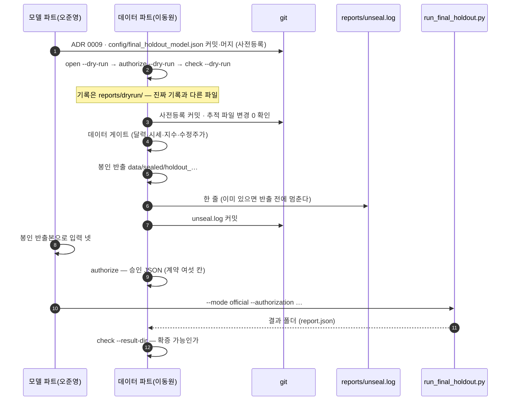

# 홀드아웃 개봉 절차 — 한 번만, 기록과 함께

> 데이터파트 v4.6 · 2026-09-14 · 이동원 · 이슈 [#240](https://github.com/devlee328288/Alpha_Stack/issues/240)
> 🆕 v4.6 — §8 **실제 개봉 기록**(2026-09-11 16:18 · 확증 가능)을 더했습니다. §1 ~ §7 은 v4.5 그대로입니다.
> 코드 [`supply/holdout.py`](../../../supply/holdout.py) ·
> [`scripts/export_holdout_dataset.py`](../../../scripts/export_holdout_dataset.py) ·
> [`scripts/unseal_holdout.py`](../../../scripts/unseal_holdout.py)
> 근거 [ADR 0004 사전등록](../../decisions/0004-사전등록.md) ·
> [ADR 0007 최종 모델 선정과 홀드아웃](../../decisions/0007-최종-모델-선정과-홀드아웃.md) ·
> [ADR 0009 최종 홀드아웃 실행설정](../../decisions/0009-최종-홀드아웃-실행설정.md)

## 0. 한 줄

홀드아웃(2024-09-01 부터)은 **한 번 열면 끝**입니다. 결과를 보고 무엇이든 한 번 고치면 그 뒤의
숫자는 확증이 아니라 탐색입니다. 그래서 여는 일을 **명령 하나로만** 하게 하고, 연 사실을
`reports/unseal.log` 에 **한 줄**로 남깁니다.

| 기록 줄 수 | 판정 |
|---:|---|
| 0 | 미개봉 |
| 1 | 개봉 1회 — 확증 가능 |
| 2 이상 | 🔴 **"홀드아웃 {n}회 개봉 — 확증 불가"** — 리포트 표지에 그대로 싣는다 |

🔴 **두 번째 개봉은 반출하기 전에 거부됩니다.** "쓰고 나서 알린다" 로는 되돌릴 수 없기 때문입니다.
그래도 누가 손으로 줄을 더하면 읽는 쪽(`unseal_verdict`)이 확증 불가를 알립니다 — 막는 것과
알리는 것을 둘 다 둡니다.

---

## 1. 누가 무엇을 — 순서가 곧 계약이다



| 단계 | 누가 | 무엇 | 남는 것 |
|---|---|---|---|
| ⓪ 사전등록 | 모델 파트 | ADR 0009 · `config/final_holdout_model.json` 을 **커밋·머지** — ✅ 2026-09-11 승인(PR #245) | 커밋 |
| ① 드라이런 | 데이터 파트 | `open --dry-run` → `authorize --dry-run` → `check --dry-run` | `reports/dryrun/` (gitignore) |
| ② 개봉 | 데이터 파트 · **팀 합의 뒤** | `open` | `reports/unseal.log` 한 줄 · `data/sealed/holdout_…/` |
| ③ 입력 넷 | 모델 파트 | `index_dev` · `index_holdout` · `stock_dev` · `stock_holdout` | 파일 넷 |
| ④ 승인 | 데이터 파트 | `authorize` | `reports/holdout_authorization.json` |
| ⑤ 실행 | 모델 파트 | `run_final_holdout.py --mode official` | 결과 폴더 |
| ⑥ 확인 | 데이터 파트 | `check --result-dir` | 판정 |

🔴 **⓪ 이 ② 보다 먼저 커밋돼 있어야 합니다.** `open` 은 사전등록 파일 넷(ADR 0004 · 0007 · 0009 ·
설정 JSON) 중 **가장 늦은 커밋**을 기록 줄에 적습니다. `check` 는 그 커밋 시각이 개봉 시각보다
앞서는지, 그리고 개봉 **뒤에** 사전등록 파일이 다시 커밋되지 않았는지 봅니다(ADR 0004 §9 · 개봉 후
수정 금지). ADR 0009 도 같은 말입니다 — *"개봉 후에는 값이 기대와 달라도 설정을 바꾸지 않고 그대로
최종 결과로 기록한다."*

---

## 2. 드라이런 — 진짜 봉인은 한 줄도 읽지 않는다

ADR 0009 는 승인 전까지 *"개발구간 마지막 공통 60거래일을 이용한 드라이런만"* 하라고 적었고,
2026-09-11 에 승인됐습니다(PR #245 · 오준영). 승인 뒤에도 진짜 개봉은 **드라이런이 끝까지 초록인 것을
본 뒤에** 합니다. 드라이런은 개발구간 끝(`20240831`)에서 **60거래일 전**을 가짜 홀드아웃 시작으로 삼고
`20240831` 까지만 읽습니다.

```powershell
# ① 입력 넷 먼저 — 모델 파트 준비기가 index_dev · index_holdout · stock_dev · stock_holdout .parquet 을 쓴다
python scripts/prepare_final_holdout_dry_run.py --output-dir data/sealed/dryrun_inputs_<날짜>
#    🔴 index_holdout 의 첫날을 확인한다 (2026-09-11 실측 20240529)

# ② 가짜 개봉 — 시작일을 준비기의 평가 첫날로 맞춘다 · 기록은 reports/dryrun/unseal.log
python scripts/unseal_holdout.py open --dry-run --start 20240529 --requested-by 이동원 --reason "통합 드라이런"

# ③ 가짜 승인 — run_id 는 실행기 드라이런이 결과에 쓰는 값(dry-run)과 같게
python scripts/unseal_holdout.py authorize --dry-run `
  --snapshot data/sealed/dryrun_20240529_20240831 --run-id dry-run `
  --index-dev <입력>/index_dev.parquet --index-holdout <입력>/index_holdout.parquet `
  --stock-dev <입력>/stock_dev.parquet --stock-holdout <입력>/stock_holdout.parquet

# ④ 실행기 드라이런 (같은 입력 넷)
python scripts/run_final_holdout.py --mode dry-run `
  --index-dev … --index-holdout … --stock-dev … --stock-holdout … `
  --output-dir data/sealed/dryrun_result_<날짜>

# ⑤ 확인
python scripts/unseal_holdout.py check --dry-run --result-dir data/sealed/dryrun_result_<날짜>
```

🔴 **시작일을 `--start` 로 맞추는 이유.** 준비기는 라벨(T+6) 때문에 평가가 20240822 에 끝나 **20240529** 에 시작하고,
`open --dry-run` 기본값은 달력으로 "개발구간 끝에서 60거래일 전" 입니다. 기본값으로 열면 `authorize` 가 *"홀드아웃 입력이
봉인 구간 밖"* 으로 거부합니다 — 검사는 맞게 막습니다. 진짜 개봉은 둘 다 `20240901` 이라 영향이 없습니다(팀장 결정
2026-09-11: 코드 기본값은 그대로 두고 `--start` 로 맞춘다).

**2026-09-11 통합 드라이런** — 위 ①~⑤ 전부 초록. `open` 616초(게이트 4종 ✅ · 봉인본 7,888,945행 · 기록 한 줄 ·
사전등록 `0d5bd5b`) → `authorize` 계약 여섯 칸 → 실행기 매수 후보 520 → `check` **✅ 확증 가능**. 봉인본
`daily_price_all.parquet` 은 같은 날 개발본 반출과 SHA-256 이 같았다(PR #248).

| 드라이런이 막는 것 | 어디서 |
|---|---|
| 가짜 시작이 `20240901` 이상 | `validate_range` — **DB 를 읽기 전에** |
| 끝이 `20240831` 을 넘음 | 〃 |
| 반출 파일에 봉인 구간 행 | `verify_no_holdout` — 파일을 **다시 열어** 전수 |
| 드라이런 반출본을 진짜 기록으로 열기 · 그 반대 | `verify_holdout_snapshot` — 기록 파일이 다르면 거부 |

드라이런은 커밋 안 된 변경이 있어도 ⚠️ 경고만 하고 계속합니다. 진짜 개봉은 거기서 멈춥니다.

⚠️ `scripts/export_holdout_dataset.py --dry-run` 을 따로 돌리면 반출본은 생기지만 **기록이 없어서
`load_holdout_snapshot` 으로 열리지 않습니다.** 통합 드라이런은 `unseal_holdout.py open --dry-run` 으로 합니다.

---

## 3. 진짜 개봉 — 명령 하나

```powershell
git switch main; git pull --ff-only origin main
git status --short        # 추적 파일 변경이 0 이어야 한다
python scripts/unseal_holdout.py open --requested-by 이동원 --reason "최종 모델 1회 평가"
```

`open` 이 차례로 확인하는 것:

| # | 확인 | 못 넘으면 |
|---|---|---|
| 1 | `reports/unseal.log` 가 비어 있다 | 🔴 반출도 기록도 안 한다 (종료코드 2) |
| 2 | 사전등록 파일 넷이 있고 커밋됐다 | 커밋·머지 뒤 다시 (종료코드 1) |
| 3 | 추적 파일에 커밋 안 된 변경이 없다 | 〃 |
| 4 | 달력·시세·지수가 끝날까지 있다 | `python -m pipelines.refresh` |
| 5 | 구간의 `adj_close` 빈 행이 0 | `python -m pipelines.refresh --with-adj` |
| 6 | 시작이 코드 정본 `20240901` | `--start` 로 못 바꾼다 |

넘으면 `data/sealed/holdout_20240901_<끝>/` 에 봉인 반출본을 쓰고 **곧바로** 기록 한 줄을 씁니다.

```text
# reports/unseal.log — 한 줄 = 한 번의 개봉. 행이 2개가 되는 순간 프로젝트는 실패로 보고한다.
unsealed_at_kst | git_commit | snapshot_sha256 | preregistration_commit | requested_by | reason
```

| 칸 | 값 |
|---|---|
| `unsealed_at_kst` | 개봉 시각 (KST · 초까지) |
| `git_commit` | 반출한 코드의 커밋 |
| `snapshot_sha256` | `MANIFEST_holdout.json` 의 지문 — 대장 안에 파일 둘의 SHA-256 이 있다 |
| `preregistration_commit` | 사전등록 파일 넷 중 가장 늦은 커밋 |
| `requested_by` · `reason` | 누가 왜 — 칸 구분자(세로줄)와 줄바꿈이 들어 있으면 거부 |

봉인 반출본은 개발구간 반출과 **같은 함수**(`build_full_daily`)로 만듭니다. 개발구간을 함께 싣는
이유는 피처가 롤링 창이라 홀드아웃 첫날에도 그 앞 행이 필요하기 때문입니다.
🔴 **반출본을 다시 만들면 지문이 달라져 기록과 어긋나므로** 이미 무언가 든 폴더에는 쓰지 않습니다.

🔴 `reports/unseal.log` 는 **곧바로 커밋**합니다. `.gitignore` 가 `*.log` 를 막지만 이 파일만
`!reports/unseal.log` 로 풀어 두었습니다 — ADR 0004 의 증거가 *"사전등록 커밋 시각이 이 파일 첫 행보다
앞선다"* 이고, 그 대조는 git 이력으로만 됩니다.

---

## 4. 승인 JSON — 실행기 계약 여섯 칸

`scripts/run_final_holdout.py`(오준영 님)의 `official` 모드가 이 파일을 봅니다. ADR 0009 — *"개봉 승인
JSON 에 같은 설정 지문과 입력 파일 네 개의 SHA-256 이 있을 때만 허용한다."*

| 칸 | 값 | 어디서 오나 |
|---|---|---|
| `schema_version` | `1` | 계약 |
| `authorized` | `true` | 계약 |
| `run_id` | 결과 · 백테스트 원장 · 화면을 잇는 ID | 모델 파트와 합의 |
| `holdout_start` | `"20240901"` | 코드 정본 `evaluation/horizon.py` |
| `config_sha256` | 설정 JSON 지문 | 실행기 모듈이 있으면 **그 계산** · 없으면 정렬 JSON(`sort_keys` · 구분자 `,` `:` · `ensure_ascii=False`) |
| `source_sha256` | 입력 넷의 SHA-256 | 파일에서 계산 |

그 뒤에 **되짚기 위한 칸**을 더합니다(실행기는 안 봅니다) — `dry_run` · `evaluation_range` ·
`authorized_at_kst` · `git_commit` · `config_path` · `config_sha256_method` · `source_path` ·
`snapshot_sha256` · `unseal`.

`authorize` 가 거부하는 경우:

| 경우 | 왜 |
|---|---|
| 기록이 0줄 또는 2줄 이상 | 열지 않았거나 확증 불가 |
| 봉인 반출본의 지문이 기록과 다르다 | 다른 반출본으로 승인하려 한다 |
| `*_dev` 의 마지막 날이 `20240901` 이후 | 개발 입력에 봉인 구간이 섞였다 |
| `*_holdout` 이 봉인 구간 밖 | 〃 |
| `run_id` 가 비었다 | 결과를 잇지 못한다 |
| 승인 파일이 이미 있다 | 덮어쓰지 않는다 |

실행(모델 파트):

```powershell
python scripts/run_final_holdout.py --mode official --authorization reports/holdout_authorization.json `
  --index-dev <경로> --index-holdout <경로> --stock-dev <경로> --stock-holdout <경로> `
  --output-dir <결과 폴더>
```

---

## 5. 확인 — 확증 가능인가

```powershell
python scripts/unseal_holdout.py check --result-dir <결과 폴더>
```

| 확인 | 붉으면 |
|---|---|
| 기록이 정확히 한 줄 | 2줄 이상이면 배너로 끝 (종료코드 2) |
| 사전등록 커밋 시각 < 개봉 시각 | ADR 0004 무효 |
| 개봉 뒤 사전등록 파일 커밋 없음 | 개봉 후 수정 금지 위반 |
| 승인 파일에 계약 여섯 칸 · 스냅샷 지문이 기록과 같음 | 다른 개봉의 승인 |
| 승인 뒤 입력 파일이 안 바뀜 | 승인한 것과 돌린 것이 다르다 |
| 결과 `report.json` 의 `run_id` · 입력 지문 넷이 승인과 같음 | 〃 |
| 결과 폴더에 `.db`·`.zip`·`.pdf`·`.key`·`.env` 없음 · 시크릿 값 없음 · 원자료 가격 칸 없음 | 원자료 재배포 (KRX 약관) · 키 유출 |

시크릿은 **값을 출력하지 않고** 들어 있는지만 봅니다.

---

## 6. 읽는 쪽 — 봉인 반출본을 여는 유일한 문

```python
from supply.holdout import load_holdout_snapshot, read_unseal_log, unseal_verdict

snap = load_holdout_snapshot("data/sealed/holdout_20240901_<끝>")   # 기록과 지문이 맞을 때만 열린다
snap.daily, snap.index, snap.manifest, snap.unseal
print(unseal_verdict(read_unseal_log())["status"])                  # 미개봉 · 개봉 1회 · 확증 불가
```

개발본을 읽는 `supply.hf_model_data` 는 **홀드아웃 행이 있으면** 거부하고, `supply.holdout` 은
**개봉 기록이 없으면** 거부합니다 — 두 문이 서로의 반대편을 막습니다.

---

## 7. 하면 안 되는 것

| 하지 말 것 | 왜 |
|---|---|
| `export_holdout_dataset.py` 로 진짜 반출 | CLI 는 드라이런만 받는다 — 반출이 곧 개봉이라 기록과 함께여야 한다 |
| `reports/unseal.log` 를 손으로 고치거나 줄을 지우기 | 기록이 곧 증거다. 칸 수가 다르면 읽는 쪽이 세운다 — **고치는 것 자체가 개봉 이력** |
| 드라이런을 진짜 기록에 남기기 | 진짜 개봉이 **두 번째**가 된다 |
| 개봉 뒤 설정 · ADR 수정 | ADR 0009 — 기대와 달라도 그대로 최종 결과로 기록 |
| 봉인 반출본을 HF · 드라이브에 올리기 | `data/sealed/` 는 gitignore · KRX 약관 제11조 ② |

---

## 8. 🆕 실제 개봉 기록 — 2026-09-11 (v4.6)

위 절차를 **한 번** 실제로 밟았습니다. 로그 원문은 이 PC 의 `data/sealed/official_run_20260911_provenance/logs/`
(gitignore)에 있고, 저장소에는 기록·승인·결과 사본만 커밋했습니다(PR #255 · #256).

### 8.1 시간순

| KST | 단계 | 결과 |
|---|---|---|
| 13:12 | 상장 구간 수정 머지 (PR #253) | 코드 재사용 자리에서 앞 회사 기록이 안 붙는다 — [기능명세 v2.0 §2](../../기능명세/version2.0/상장구간과_홀드아웃_개봉실행.md) |
| 16:10:46 | `open` 시작 · HEAD `9c87be9` · 추적 파일 변경 0 | 게이트 4종 ✅ (달력·시세·지수 끝 20260904 · 구간 `adj_close` 빈 행 0) |
| 16:18:48 | 봉인 반출 → **기록 한 줄** | `daily_price_all` 9,223,644행 · `index_price_all` 196,119행 · 구간 **1,334,699행 · 484거래일 · 2,927종** · 상장 구간 시작 2곳(`036220` 20240313 · `101970` 20250328) |
| 16:21 → 16:25 | 공식 입력 넷 (§8.3) | 첫 벌 → `_final` |
| 16:24 | PR #255 머지 | `reports/unseal.log` 1줄 |
| 16:25:56 | `authorize` | run_id `final-holdout-20260911` · 설정 `5299a08f…` |
| 16:25:57 | `run_final_holdout.py --mode official` | 결과 `data/sealed/official_result_20260911` |
| 16:26:02 | `check` | ✅ **개봉 1회 · 사전등록이 앞섬 · 승인·결과·산출물 확인 — 확증 가능** |
| 16:31 | PR #256 머지 | 승인 JSON · `report.json` 사본 |
| 16:37 ~ 16:52 | `verify_hf_dataset --skip-download` | 종료코드 0 · 2010~2024년 37칸 완전히 같음 · **개발본 재배포 불필요** |

기록 줄 원문:

```text
2026-09-11T16:18:48+09:00 | 9c87be990c81c47e95ba6794b8d6e6e4e7e71cb4 | ecb3c806dd777caffee3cafa2a419f2a2da2bb44543b3a44ee13e4304de1a920 | 0d5bd5bffcff8c7d7735f9ddc9507686d4d9bc04 | 이동원 | 최종 모델 1회 평가 — 팀 합의 2026-09-11 · 끝은 수정주가가 채워진 20260901
```

### 8.2 끝이 20260904 가 아니라 20260901 인 이유

| 선택지 | 무엇이 일어나나 | 판단 |
|---|---|---|
| 끝 20260904 | 게이트 5(구간 `adj_close` 빈 행 0)에서 멈춘다 — 09-02 ~ 09-04 사흘 **8,294행**이 수정주가 계산 전 | ❌ |
| `pipelines.refresh --with-adj` 로 채우고 20260904 | 수정주가를 다시 만들면 FDR 창이 밀린 만큼 **개발구간 옛 행이 원본에서 `chain` 으로 내려앉는다** → 봉인본 개발구간이 HF 개발본과 달라진다 | ❌ 개봉 직전에 개발 자료를 흔든다 |
| **끝 20260901** | 사흘을 평가에서 뺀다 · 개발구간은 한 행도 안 바뀐다 | ✅ **팀 합의** |

### 8.3 공식 입력 넷을 만든 법

`--mode official` 실행기는 입력 파일 넷을 받습니다. **모델 파트의 경로를 코드 수정 없이** 따랐고, 개발구간을 막는
경계만 봉인본 끝 다음 날 `20260902` 를 **인자로** 넘겼습니다(인자가 없는 한 곳 — `features/stock_model_dataset.py`
의 모듈 상수 `HOLDOUT_START`, 업종·시장 상대강도 — 만 실행 중에 바꿨습니다).
스크립트 사본 `provenance/scripts/build_official_inputs.py`.

| 트랙 | 모델 파트의 어느 경로 | 순서 |
|---|---|---|
| 종목 | `scripts/run_stock_model_experiment.py::load_stock_model_dataset` | 업종 10×5 후보 → 기업행위 표본 제외(510행) → 수정주가 의심 제외 → 전 피처 → 조합 K |
| 지수 | `scripts/prepare_final_holdout_dry_run.py` | `build_model_dataset(조합 C)` |
| 분할 | `split_dry_run_frames` 와 같은 규칙 | 평가 = `20240901` 이후 공통 거래일 전부(478일 · 20240902 ~ 20260824) · 그 앞 5거래일(gap 20240826 ~ 0830)은 학습에서 뺀다 |

🔴 **입력은 두 벌 만들어졌습니다** — 2026-09-14 에 값으로 다시 쟀습니다.

| 벌 | 종목 파일 칸 | 쓰였나 | 차이 |
|---|---:|---|---|
| `official_inputs_20260911` (16:21) | 75 | 아니오 | — |
| `official_inputs_20260911_final` (16:25) | **73** | ✅ 승인·실행 | 총수익 두 칸(`adj_close_tr` · `adj_dividend`)만 없다 · 행·키·나머지 칸 값 **전부 같다** · 지수 파일은 지문까지 같다 |

`_final` 은 드라이런 입력(73칸)과 같은 칸 구성입니다. 왜 뺐는지는 로그에 남지 않았습니다 — 결과에는 영향이 없습니다.

**드라이런 입력과의 대조** (`validate_official_inputs.py` · 09-14 에 `_final` 로 다시) — 같은 날짜·같은 키에서 등록 피처·
라벨의 **값 차이 0**. 한쪽에만 있는 키 29행(21 + 6 + 1 + 1)은 전부 업종 스냅샷 반영일입니다(하루 누수 수정 PR #243 의 효과).

### 8.4 결과는 private 레포 하나에만

| | 값 |
|---|---|
| 레포 | `qurious-quant/alphastack-krx-holdout` — 개발본(`alphastack-krx-dev`)과 **따로** |
| 커밋 | `2aab6bd1` · 서버 SHA-256 = 로컬 |
| 파일 | `final-holdout-20260911/` — `index_predictions` 478행 · `stock_predictions` 23,567행 · `combined_predictions` 23,567행(매수 후보 7,397) · `report.json` |
| 들어가지 않는 것 | 원자료 가격 칸 · 봉인본 · 입력 넷 |
| 🔴 쓰는 법 | **학습에 섞지 않는다.** 결과를 보고 모델·피처·임계값을 다시 고르지 않는다 (ADR 0009) |

### 8.5 개봉 뒤 — 마지막 한 구간 (ADR 0010 · 모델 파트)

오준영 님이 개봉 자료의 끝에서 T+1→T+6 **한 구간**을 예측하는 실행기(`scripts/run_final_window.py` · PR #257~#259)를 냈고,
그 `report.json` 이 기록한 입력 지문 셋은 **이 PC 의 봉인본과 같습니다**(2026-09-14 대조).

| 입력 | `report.json` 지문 | 이 PC |
|---|---|---|
| `daily_price_all.parquet` | `a4f91026…` | 같다 |
| `index_price_all.parquet` | `20c16d99…` | 같다 |
| `reports/unseal.log` | `fc41a64c…` | 같다 (CRLF 그대로 읽은 값) |

⚠️ 그 `report.json` 의 입력 경로는 다른 PC(`D:\Alpha\data\sealed\…`)입니다 — **봉인본 사본이 모델 파트 PC 에도 있었습니다.**
§7 이 막는 것은 HF·드라이브 업로드이고 팀 안 사본은 막지 않지만, "봉인본은 한 PC 에만" 이라는 설명은 틀렸으므로 여기서 정정합니다.

### 8.6 알려진 한계

| 무엇 | 실측 | 판단 |
|---|---|---|
| **gap 5 와 T+6 하루 겹침** | 학습 마지막 T=20240823 → **T+6 = 20240902 = 평가 첫날** (달력 재확인 2026-09-14) | 학습 마지막 행의 라벨 청산가와 평가 첫날이 같은 날짜다. 평가 라벨을 보지는 않는다. 드라이런 준비기와 같은 규칙이라 개봉 뒤 바꾸지 않는다 |
| 점 조회 `universe_rows` | 상장 다음 날 `as_of` 에서 `036220` · `101970` 에 앞 회사 기본정보 | 이슈 #252 닫음(고치지 않음) — 공식 경로는 붙이기(§8.1 PR #253)만 쓴다 |
| 끝을 당긴 사흘 | 09-02 ~ 09-04 | §8.2 |
