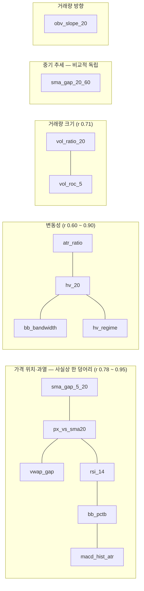
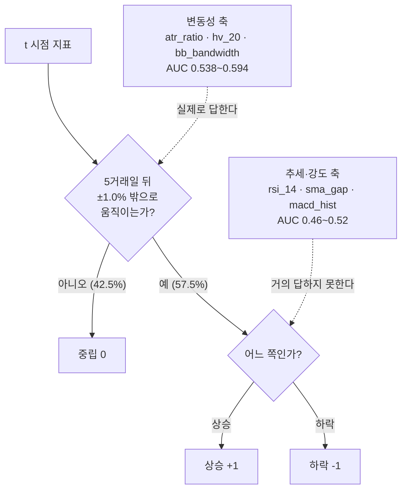

# X(독립변수) 조합 선정 검토 — 오준영님 질문에 대한 회신

> **작성** 이동원 (데이터 파트 · 팀장) · **2026-09-01**
> **질문** 오준영 (모델 파트) — "조합 A·B 가 둘 다 기준선 아래고 하락을 못 맞힙니다.
> 기준과 가설이 적절한지, 어떤 피처를 쓰면 좋을지 검토 부탁드립니다"
> **관련** [ADR-AS-0002 예측대상과 레이블](../../decisions/0002-예측대상과-레이블.md) ·
> [ADR-AS-0004 사전등록](../../decisions/0004-사전등록.md) · 이슈 #33
> **재현 노트북** [`notebooks/06-검토·발견/01.X조합-피처선정-검토.ipynb`](../../../notebooks/06-검토·발견/01.X조합-피처선정-검토.ipynb)

---

## 0. 한 줄로

**조합 A·B 를 정확히 재현했고, 준영님이 세운 기준 5개와 가설 4개를 개발구간 자료로
하나씩 대조했습니다.** 결론은 *"피처를 잘못 골랐다"* 가 아니라 **"세 가지가 서로 다른
문제인데 하나로 보였다"** 입니다 — ① 피처의 중복·정상성 ② 모델의 클래스 쏠림
③ 평가축이 우리 실행 규칙과 어긋나 있다는 것.

셋 중 **하락 예측이 안 나오는 원인은 ②** 였습니다. 피처를 한 줄도 바꾸지 않고
모델만 바꿔도 하락 Recall 이 **0.0% → 23.5%** 로 올라갑니다.

---

## 1. 먼저 — 재현했습니다

준영님 노트북(`notebooks/04-모델/실험/`)의 설정을 그대로 썼습니다.

```python
expanding_splits(n_samples=2815, n_folds=12, min_train=750,
                 horizon=60, gap=5, label_horizon=5)
```

| | 준영님 보고 | 제 재현 | |
|---|---|---|---|
| 조합 A · Accuracy | 0.3958 | **0.3958** | ✅ |
| 조합 A · Macro F1 | 0.2971 | **0.2971** | ✅ |
| 조합 A · 하락 예측 | 0개 | **0개** | ✅ |
| 조합 B · Accuracy | 0.3792 | **0.3792** | ✅ |
| 조합 B · Macro F1 | 0.2965 | **0.2965** | ✅ |
| 조합 B · 하락 Recall | 1.96% | **1.96%** (204개 중 4개) | ✅ |

**검증 구간**은 2013-04-09 ~ 2021-08-23, 12폴드 × 60행 = **720행**입니다.
분포는 하락 204(28.33%) · 중립 306(**42.50%**) · 상승 210(29.17%) 입니다.

> 📌 **이 구간의 최빈 기준선은 42.50%(항상 중립)입니다.**
> 전체 개발구간(38.69%)도, 계획서 여러 곳에 적힌 52.64%도 아닙니다.
> 52.64% 는 *일간* `change > 0` 비율이라 우리 5거래일 3분류와는 다른 숫자입니다
> (→ 이슈 #33). 조합 A(39.58%)·B(37.92%)는 **기준선 42.50% 아래**입니다.

---

## 2. 기준 5개를 자료와 대조합니다

준영님이 세운 기준은 다섯 개였습니다. 순서대로 채점하면 이렇습니다.

| 준영님 기준 | 판정 | 근거 |
|---|---|---|
| ① 방향을 판단할 수 있는 피처 | ⚠️ **부호가 반대** | §2.4 |
| ② 유지(중립) 구간을 판단할 수 있는 피처 | ✅ **정확** — 가장 강한 축 | §2.5 |
| ③ 신호 강도를 확인할 수 있는 피처 | ⚠️ 방향축과 **한 덩어리** | §2.3 |
| ④ 비슷한 피처를 중복해서 넣지 않기 | 🔴 **가장 크게 걸림** | §2.1 |
| ⑤ 미래 데이터가 들어간 피처 금지 | ✅ **통과** (다른 문제가 남음) | §2.2 |
| ⑥ 전체 5~8개 | ✅ 다만 개수보다 **축**이 문제 | §2.3 |
| ⑦ 하락·중립·상승을 모두 예측하는지 | 🔴 **평가축을 바꿔야 함** | §4 |

### 2.1 기준 ④ — 정의상 **완전히 같은 열**이 들어 있습니다

가장 크게 걸리는 항목입니다. 비슷한 정도가 아니라 **수학적으로 같은 열**이 있습니다.

| 쌍 | 상관 | 실측 차이 | 왜 |
|---|---|---|---|
| `bb_mid` ≡ `sma_20` | **+1.0000** | **최대 0.000** | 볼린저 중심선의 **정의**가 20일 SMA |
| `macd` ≡ `ema_12 − ema_26` | — | 최대 **1.14e-13** | MACD 의 **정의**가 두 EMA 의 차 |
| `vwap_20` ↔ `sma_20` | +0.9999 | — | 거래량 가중이 지수에선 거의 무의미 |
| `ema_12` ↔ `ema_26` | +0.9973 | — | 같은 가격의 평활만 다름 |
| `sma_5` ↔ `sma_20` | +0.9918 | — | 같은 가격의 평활만 다름 |
| `sma_20` ↔ `sma_60` | +0.9805 | — | 같은 가격의 평활만 다름 |
| `macd` ↔ `macd_signal` | +0.9541 | — | 신호선이 MACD 의 EMA |
| `hv_20` ↔ `parkinson_20` | +0.9267 | — | 같은 변동성의 다른 추정량 |
| `atr_14` ↔ `hv_20` | +0.8127 | — | 같은 변동성의 다른 척도 |

`macd`·`ema_12`·`ema_26` 셋을 함께 넣으면 **완전한 선형종속**이라
로지스틱 계수가 유일하게 결정되지 않습니다. 22개를 전부 넣었을 때 VIF 는 **10⁹** 로
발산합니다. `sklearn` 의 L2 규제가 예외를 막아 주지만, **계수의 부호가 폴드마다
뒤집혀 해석이 불가능해집니다.**

> 💡 수업 자료 `learning/07-ml/12.다중회귀규제.ipynb`
> 가 다룬 그 문제입니다 — 릿지가 "터지지 않게" 해 줄 뿐, **중복 자체를 없애 주지는
> 않습니다.** 발표에서 "이 피처가 왜 중요한가"를 설명하려면 중복을 먼저 걷어야 합니다.

### 2.2 기준 ⑤ — 미래 누수는 없습니다. 대신 **"학습이 본 적 없는 값"** 이 남습니다

`features/` 의 모든 함수는 과거→현재 방향으로만 누적하고 `shift(-1)` 을 쓰지 않습니다.
누수는 통과입니다. 다만 **다른 문제**가 있습니다.

원본 22개 중 10개는 **가격·거래량 수준값 그 자체**라, 확장창 워크포워드에서
검증 행의 상당수가 **학습 구간이 한 번도 본 적 없는 범위**로 나갑니다.

| 피처 | 전반부 평균 | 후반부 평균 | 학습 범위 밖 검증행 |
|---|---|---|---|
| `obv` | 3.32e+09 | 1.01e+10 | **21.4%** |
| `sma_60` · `ema_26` | 252 | 296~298 | **14.3%** |
| `vwap_20` | 252.5 | 298.4 | 13.6% |
| `sma_20` · `bb_mid` | 252.5 | 298.4 | 13.3% |
| `bb_lower` | 244.0 | 288.2 | 12.8% |
| `ema_12` | 252.5 | 298.9 | 11.5% |
| `sma_5` · `bb_upper` | 252.6 / 260.9 | 299.3 / 308.5 | 9.5% |
| `vol_sma_20` | 8.96e+07 | 1.19e+08 | 8.6% |
| — 아래는 이미 비율/유계 — | | | |
| `rsi_14` | 51.4 | 53.5 | 0.3% |
| `vol_ratio_20` | 1.001 | 1.010 | 0.3% |
| `hv_20` · `bb_bandwidth` | — | — | 1.4% / 1.1% |

🔴 **트리 모델에서 특히 위험합니다.** 트리는 **외삽을 못 합니다** — 학습에서 배운
분할 임계값(예: `sma_20 <= 290`)이 검증 구간 값 전체를 한쪽으로만 보냅니다.
준영님이 이 조합을 그대로 RandomForest·XGBoost·LightGBM 에 적용하실 계획이라
**이 부분이 로지스틱보다 더 크게 영향을 줍니다.**

👍 준영님이 이미 `sma_gap_5_20 = sma_5/sma_20 − 1`, `macd_hist_ratio = macd_hist/close`
로 **비율화**하신 판단이 정확히 이 문제를 피한 것입니다. 그 원칙을 나머지에도 적용하면 됩니다.

### 2.3 기준 ③·⑥ — 개수가 아니라 **축**이 문제입니다

"5~8개"는 맞는 감각인데, **서로 다른 축인 5~8개**여야 의미가 있습니다.
후보들의 스피어만 상관을 재 보면 이렇게 뭉칩니다.



주요 상관값입니다.

| | `rsi_14` | `bb_pctb` | `sma_gap_5_20` | `macd_hist_atr` | `atr_ratio` |
|---|---|---|---|---|---|
| `rsi_14` | — | **0.91** | **0.83** | 0.65 | −0.27 |
| `bb_pctb` | **0.91** | — | **0.81** | **0.80** | −0.17 |
| `sma_gap_5_20` | **0.83** | **0.81** | — | 0.78 | −0.15 |
| `px_vs_sma20` | **0.92** | **0.95** | 0.89 | 0.82 | −0.17 |
| `vwap_gap` | **0.92** | **0.95** | 0.88 | 0.83 | −0.16 |
| `atr_ratio` ↔ `hv_20` | | | | | **0.90** |

**즉 "방향·강도"라고 이름 붙인 피처 여섯 개가 사실상 한 축입니다.**
"현재가가 최근 평균보다 얼마나 위에 있나"의 변주일 뿐입니다.
`rsi_14` 와 `bb_pctb` 를 같이 넣는 것은 기준 ④ 를 정면으로 어깁니다(r=0.91).

실제로 독립적인 축은 **다섯 개**입니다 — 단기 위치 · 중기 추세 · 변동성 · 거래량 크기 ·
거래량 방향. 그래서 **5~6개가 상한에 가깝고, 8개를 채우려면 억지로 중복을 넣게 됩니다.**

### 2.4 기준 ① — 방향 피처의 **부호가 가설과 반대**입니다

각 피처와 미래 5거래일 수익률의 스피어만 상관(IC)입니다.

| 피처 | IC | 중립 판별 AUC | 방향 판별 AUC | 3분류 KW p |
|---|---|---|---|---|
| `sma_gap_20_60` | **−0.0634** | 0.465 | 0.460 | 1.4e-04 |
| `px_vs_sma60` | **−0.0577** | 0.444 | 0.465 | 2.1e-07 |
| `rsi_14` | **−0.0459** | 0.438 | 0.472 | 2.7e-08 |
| `ret_5` | **−0.0427** | 0.461 | 0.475 | 4.3e-04 |
| `macd_norm` | **−0.0398** | 0.446 | 0.478 | 2.9e-06 |
| `px_vs_sma20` | −0.0191 | 0.448 | 0.491 | 1.8e-05 |
| `sma_gap_5_20` | −0.0011 | 0.449 | 0.505 | 2.6e-05 |
| `macd_hist_norm` | **+0.0222** | 0.471 | 0.519 | 1.4e-02 |
| `obv_slope_20` | −0.0288 | 0.464 | 0.480 | 2.3e-03 |

**추세 피처가 거의 전부 음수입니다.** 이동평균 위에 있을수록, RSI 가 높을수록,
최근 5일이 올랐을수록 **다음 5거래일 수익률이 낮았습니다.** 추세 지속(모멘텀)이 아니라
**단기 평균회귀**입니다. 지수의 주 단위 구간에서는 흔한 현상입니다.

> 준영님 가설 1 — *"단기·장기 이동평균 차이와 MACD로 상승·하락 흐름을 구분할 수 있다"*
> 는 **구분은 되지만 부호가 예상과 반대**입니다. 그리고 `macd_hist` 만 +0.022 로
> 혼자 반대 부호라, MACD 계열과 이동평균 계열을 **같은 방향 신호로 묶으면 서로 상쇄**됩니다.
> 조합 B 가 `sma_gap_5_20`(−0.001)과 `macd_hist_ratio`(+0.022)를 함께 넣었는데,
> 이 둘은 r=0.78 로 강하게 붙어 있으면서 라벨과의 부호는 반대입니다.

또 하나 — **방향 판별 AUC 가 전부 0.46~0.52** 입니다. 0.5 가 "정보 없음"이므로
어느 피처도 상승/하락을 의미 있게 가르지 못합니다.

### 2.5 기준 ② — 이건 **정확히 맞습니다**

중립 판별 AUC 를 보면 상위가 전부 변동성입니다.

| 피처 | 중립 판별 AUC | 3분류 KW p |
|---|---|---|
| **`atr_ratio`** (= `atr_14`/`close`) | **0.594** | **2.7e-20** |
| `hv_20` | 0.583 | 2.4e-16 |
| `parkinson_20` | 0.575 | 6.7e-14 |
| `bb_bandwidth` | 0.538 | 1.3e-04 |
| `hv_regime` | 0.527 | 4.0e-02 |
| `vol_ratio_20` | 0.491 | **0.60** ← 무정보 |
| `vol_roc_5` | 0.495 | **0.68** ← 무정보 |

모델 없이 자료 그 자체로 봐도 선명합니다. `hv_20` 5분위별 이후 5거래일 라벨 분포입니다.

| 변동성 분위 | N | 중립 | 상승 | 하락 | 평균 5일수익 |
|---|---|---|---|---|---|
| 1 (최저) | 563 | **47.42%** | 26.29% | 26.29% | +0.03% |
| 2 | 563 | 42.63% | 25.58% | 31.79% | −0.27% |
| 3 | 563 | 42.27% | 34.28% | 23.45% | +0.14% |
| 4 | 563 | 33.57% | 40.14% | 26.29% | +0.36% |
| 5 (최고) | 563 | **27.53%** | 43.69% | 28.77% | +0.43% |

**중립 비율이 47.4% → 27.5% 로 단조 감소합니다. 반면 하락 비율은 26.3% → 28.8% 로
거의 평평합니다.** 변동성은 *"움직일 것인가"* 를 예측하지 *"어느 쪽인가"* 를
예측하지 않습니다.

### 2.6 왜 그런가 — 중립밴드가 곧 변동성 질문이기 때문입니다

개발구간 실측입니다.

```
5거래일 수익률 표준편차  σ₅ = 2.422%
E|5거래일 수익률|            = 1.752%
중립밴드 ±1.0%              = ±0.413 σ₅
손익분기 방향정확도(왕복 0.05%) = 51.43%
```

ADR-AS-0002 가 √5 근사로 적어 둔 **±0.40σ** 가 실측 **±0.413σ** 와 거의 일치합니다
(👍 근사가 맞았습니다). 그런데 밴드가 1σ 안쪽이라는 것은 곧,
**"중립이냐"가 방향 문제가 아니라 크기 문제**라는 뜻입니다.



이 그림이 조합 A·B 가 왜 비슷하게 실패했는지 설명합니다.
**두 조합 다 Q1 에 답하는 피처(변동성)는 있었지만, Q2 에 답하는 피처는 아무도 없었습니다.**
그리고 Q2 에 답하는 피처는 **우리가 가진 22개 안에는 없습니다** (§6).

---

## 3. 가설 4개 채점

| 가설 | 판정 | 실측 |
|---|---|---|
| ① 이동평균 차이·MACD 로 상승·하락 흐름 구분 | ⚠️ **부호 반대** | IC 전부 음수 (−0.063 ~ −0.001). MACD 만 +0.022 로 상충 |
| ② RSI·볼린저 위치로 강도와 유지 구간 확인 | 🔴 **중복** | `rsi_14` ↔ `bb_pctb` r=**0.91**. 하나만 쓰면 된다 |
| ③ 변동성이 낮으면 유지, 높으면 움직임 | ✅ **맞음** | 중립 47.4% → 27.5% 단조 감소. AUC 0.594 |
| ④ 거래량 비율·OBV 로 신호 동반 확인 | ⚠️ **절반** | `vol_ratio_20` p=**0.60**(무정보). `obv_slope_20` 은 p=0.002 로 살아남음 |

가설 ③ 이 이 자료에서 가장 잘 맞습니다. 가설 ② 는 방향이 맞았는데
**두 피처를 같이 쓰신 것**이 기준 ④ 와 충돌합니다.

---

## 4. 그런데 — "하락을 못 맞힌다"의 원인은 피처가 아니었습니다

### 4.1 피처를 한 줄도 안 바꾸고, 모델만 바꿔 봤습니다

**조합 A 그대로** (`rsi_14 · bb_bandwidth · hv_20 · vol_ratio_20`), 같은 워크포워드입니다.

| 모델 | Accuracy | Macro F1 | **하락 Recall** | 중립 R | 상승 R |
|---|---|---|---|---|---|
| Logistic (현행) | 0.3958 | 0.2971 | **0.0%** | 63.4% | 43.3% |
| XGBoost | 0.4083 | 0.3446 | **6.4%** | 59.5% | 47.1% |
| LightGBM | 0.3667 | 0.3471 | **20.1%** | 45.8% | 39.5% |
| RandomForest | 0.3736 | 0.3585 | **23.5%** | 44.1% | 41.0% |

**같은 피처인데 하락 Recall 이 0.0% → 23.5% 입니다.**
조합 B 도 같습니다 (1.96% → 20.6%).

즉 **"하락 예측 0개"는 피처가 방향 정보를 못 담아서가 아니라, 로지스틱이
클래스 사전확률(중립 42.5%)에 눌려 소수 클래스를 아예 안 부르기 때문**입니다.
준영님 노트북 출력이 그것을 그대로 보여 줍니다 — 폴드 5·6 은 60개 **전부 중립**,
폴드 1·2 는 거의 전부 상승, 하락 8개는 **폴드 10 한 곳에서만** 나왔습니다.

### 4.1-b `class_weight="balanced"` 한 줄 — 여기서 가장 크게 바뀝니다

같은 모델(Logistic), 같은 피처, 같은 분할입니다. **인자 하나만 추가했습니다.**

| | Accuracy | Macro F1 | 하락 Recall | 하락 예측 수 |
|---|---|---|---|---|
| 조합 A (현행) | 0.3958 | 0.2971 | 0.0% | 0개 |
| **조합 A + balanced** | **0.4028** ▲ | **0.3570** ▲ | **11.8%** ▲ | 63개 |
| 조합 B (현행) | 0.3792 | 0.2965 | 2.0% | 8개 |
| **조합 B + balanced** | 0.3792 = | **0.3258** ▲ | **7.8%** ▲ | 54개 |

**조합 A 는 Accuracy 와 Macro F1 이 둘 다 올라갑니다.** 보통 balanced 는
정확도를 내주고 소수 클래스를 얻는 거래인데, 여기서는 그 거래조차 없었습니다 —
**로지스틱이 하락을 아예 안 부르는 것이 정확도에도 손해였다**는 뜻입니다.

> 💡 **피처 탐색을 더 하기 전에 이 한 줄을 먼저 확인해 보시길 권합니다.**
> 조합 A 를 그대로 두고 `build_logistic_baseline()` 에 `class_weight` 인자만
> 열어 두면, 지금까지의 실험 결과가 전부 다시 계산됩니다.

### 4.2 그리고 — 하락 Recall 은 우리 실행 규칙상 성과에 영향이 없습니다

이게 가장 중요한 발견입니다.

[ADR-AS-0002](../../decisions/0002-예측대상과-레이블.md) 는 포지션을 **`{0, +1}`** 로
못 박았고, 그 근거는 *"재개 후 6개월 개인 공매도 비중이 1.2%"* 였습니다.
그래서 **"하락 예측은 보유하지 않음(현금)으로만 실행"** 합니다.

> 하락으로 부르든 중립으로 부르든, **그날의 포지션은 똑같이 0** 입니다.

실측으로 확인했습니다. 조합 B 의 예측에서 하락을 전부 중립으로 바꿔 봤습니다.

```
조합 A · 현행 3분류        보유일수 = 282    평균 5일수익 = -0.0513%
조합 A · 하락 → 중립 병합   보유일수 = 282    평균 5일수익 = -0.0513%   ← 동일
조합 B · 현행 3분류        보유일수 = 293    평균 5일수익 = +0.0448%
조합 B · 하락 → 중립 병합   보유일수 = 293    평균 5일수익 = +0.0448%   ← 동일
```

**하락 Recall 을 1.96% 에서 20% 로 올려도 매매 결과는 한 줄도 바뀌지 않습니다.**

그러므로 준영님 기준 ⑦ *"하락·중립·상승을 모두 예측하는지 확인"* 은
**리포트의 진단 지표로는 유효하지만, 피처 선정의 합격 조건으로 쓰면 안 됩니다.**
실행상 유일하게 중요한 구분은 **"상승이냐 아니냐"** 입니다.

### 4.3 조합 A 와 B 의 차이는 애초에 측정할 수 없습니다

우리 라벨은 매일 5거래일 앞을 봅니다. 이웃한 관측이 4일을 공유하므로
적중 여부가 자기상관을 갖습니다. `evaluation/horizon.py::overlap_vif(5)` 가
그 분산팽창계수를 **3.78** 로 계산합니다.

```
검증 720행 ÷ VIF 3.78 = 유효표본 190행
정확도 표준오차 = √(0.425 × 0.575 / 190) = ±3.59%p
```

**조합 A(0.3958)와 조합 B(0.3792)의 차이 1.66%p 는 표준오차의 절반도 안 됩니다.**
지금 표본으로는 두 조합의 우열을 가릴 수 없습니다. 조합을 하나 더 시험해서
1~2%p 좋아지더라도 그것은 **선택의 근거가 되지 못합니다.**

---

## 5. 조합 메뉴 — 여섯 가지 안과 실측 성적

준영님이 고르실 수 있게, **축을 다르게 조합한 여섯 안**을 같은 워크포워드로 돌렸습니다.
모델 4종 평균입니다(정확도는 4모델 평균, 괄호는 최고값).

| 안 | 피처 | 개수 | Acc 평균 | MacroF1 평균 | 하락R 평균 | 비용차감 5일수익 |
|---|---|---|---|---|---|---|
| **A** 현행 | `rsi_14` `bb_bandwidth` `hv_20` `vol_ratio_20` | 4 | 0.3861 | 0.3369 | 12.5% | +0.001% |
| **B** 현행 | `sma_gap_5_20` `macd_hist_ratio` `rsi_14` `hv_20` | 4 | 0.3694 | 0.3268 | 13.8% | −0.143% |
| **1안** 균형 | `sma_gap_20_60` `rsi_14` `macd_hist_atr` `atr_ratio` `obv_slope_20` | 5 | 0.3767 | 0.3330 | 13.6% | −0.025% |
| **2안** 변동성 강조 ⭐ | `sma_gap_20_60` `rsi_14` `atr_ratio` `bb_bandwidth` `hv_regime` `obv_slope_20` | 6 | 0.3816 | **0.3525** | 18.8% | **+0.147%** |
| **3안** 가설 충실 | `sma_gap_5_20` `sma_gap_20_60` `macd_hist_atr` `rsi_14` `hv_regime` `vol_ratio_20` | 6 | 0.3431 | 0.3162 | 16.8% | +0.010% |
| **4안** 방향만 | `sma_gap_20_60` `sma_gap_5_20` `macd_hist_atr` `rsi_14` | 4 | 0.3490 | 0.3181 | 15.7% | −0.036% |
| **5안** 변동성만 | `atr_ratio` `bb_bandwidth` `hv_regime` | 3 | **0.3899** | 0.3504 | **24.3%** | −0.004% |
| **6안** 최대 ⭐ | 2안 + `sma_gap_5_20` `macd_hist_atr` | 8 | 0.3847 | **0.3592** | 22.1% | **+0.184%** |
| 참고 | 원본 22개 전량 | 22 | 0.3622 | 0.3467 | 27.6% | +0.063% |

새로 쓴 파생 피처의 정의입니다(전부 t 시점까지의 자료만 씁니다).

```python
sma_gap_20_60 = sma_20 / sma_60 - 1          # 중기 추세 — 단기 축과 r=0.29 로 독립적
macd_hist_atr = macd_hist / atr_14           # 신호 강도를 변동성으로 정규화 (수준값 제거)
atr_ratio     = atr_14 / close               # 변동성 — 중립 판별 AUC 최고 0.594
hv_regime     = hv_20 / hv_20.rolling(250).mean()   # 지금이 평소보다 시끄러운가
obv_slope_20  = (obv - obv.shift(20)) / (vol_sma_20 * 20)   # 거래량 방향 (수준값 제거)
bb_pctb       = (close - bb_lower) / (bb_upper - bb_lower)  # %B — rsi_14 와 r=0.91, 둘 중 하나만
```

### 어느 것을 고를지 — 목적에 따라 다릅니다

| 목적 | 추천 | 왜 |
|---|---|---|
| **리포트에 실을 대표 조합** | **2안 (6개)** | 축이 겹치지 않고, MacroF1·수익이 모두 상위. 6개라 설명이 된다 |
| **Macro F1 최대** | **6안 (8개)** | 0.3592 로 최고. 다만 `sma_gap_5_20` ↔ `rsi_14` r=0.83 이 남는다 |
| **가설 ③ 을 정면으로 검정** | **5안 (3개)** | "변동성만으로 어디까지 되나"의 답. 하락 R 24.3% 로 가장 높다 |
| **대조군(방향 피처의 기여 측정)** | **4안 vs 2안** | 4안이 2안보다 낮으면 "방향 축은 기여하지 않는다"가 실측으로 남는다 |
| 쓰지 않기를 권함 | 원본 22개 전량 | VIF 10⁹ · 수준값 10개 · 계수 해석 불가 |

> 🔴 **다만 정직하게 적습니다 — 36개(조합 9 × 모델 4) 중 최빈 기준선 42.50% 를
> 넘은 것은 하나도 없습니다.** 최고가 41.11% 입니다.
> 단일 검정 유의선은 48.39%, 9개 조합 본페로니 보정선은 51.60%, 36개 보정선은 53.25% 입니다.
> **지금 단계에서 "어느 조합이 낫다"는 통계적으로 말할 수 없습니다.**
> 위 표는 *선택의 근거*가 아니라 *어디를 더 파야 하는지의 지도*입니다.

---

## 6. 그래서 무엇을 하면 되는가 — 발전 방향 네 가지

### ① 평가축을 실행에 맞춥니다 (가장 빠르고, 가장 크게 바뀝니다)

지금 우리가 보는 Accuracy·Macro F1 은 **하락을 맞히는 데 점수를 주지만, ADR 상
그 점수는 돈이 되지 않습니다.** 실행에 맞춘 지표를 함께 보시면 그림이 달라집니다.

| 지금 보는 것 | 함께 볼 것 | 왜 |
|---|---|---|
| Accuracy | **상승 예측의 정밀도(precision)** | 우리가 사는 날에 실제로 올랐나 |
| Macro F1 | **상승 예측일의 평균 5일수익 − 비용** | 손익분기 51.43% 를 넘나 |
| 하락 Recall | **보유 비중(전체 대비 상승 예측일 수)** | 얼마나 자주 시장에 있나 |
| — | **상승 vs 비상승 이진 AUC** | 확률이 순서를 맞히나 (임계값과 무관) |

수업에서 배운 ROC/AUC(`learning/07-ml/14.로지스틱회귀.ipynb` ·
`learning/09-finance-ml-dl/4.분류모델_상승하락예측.ipynb`)
를 그대로 쓸 수 있습니다. **AUC 는 임계값을 안 정해도 되므로, 클래스 쏠림 문제를
피해서 "피처에 정보가 있나"만 따로 볼 수 있습니다.** 지금 상황에 정확히 맞는 도구입니다.

> ⚠️ 평가 코드는 `evaluation/` = 강민석님 파트라 제가 고치지 않았습니다.
> 이슈 #33 에 이미 올린 `hit_rate`·`majority_class` 문제와 같은 자리입니다.

### ② 클래스 쏠림을 먼저 정리합니다

`class_weight="balanced"` · 트리 모델 · 확률 임계값 조정 — 셋 중 무엇을 쓰든
**피처를 바꾸지 않고도** 세 클래스가 다 나옵니다(§4.1).

보통 balanced 는 *"정확도를 내주고 소수 클래스를 얻는"* 거래입니다. 그런데
우리 자료에서는 **조합 A 가 Accuracy·Macro F1 을 둘 다 얻었습니다**(§4.1-b).
잃은 것이 없는 경우라 먼저 해 보실 값어치가 있습니다.
2안처럼 정확도를 조금 내주는 조합도 있으니(0.3917 → 0.3806, Macro F1 0.3362 → 0.3565),
**무엇을 얻고 무엇을 잃었는지 조합마다 함께 적으시면 그 자체가 좋은 리포트 재료입니다.**

### ③ 정보 원천을 늘립니다 — 지금 22개는 **전부 한 계열의 함수**입니다

이게 근본입니다. 가용 피처 22개는 모두 **KOSPI200 의 OHLCV 한 계열**에서
나왔습니다. 22개처럼 보이지만 독립적인 축은 다섯 개고(§2.3), 그중 방향을 가르는
축은 사실상 **없습니다**(AUC 0.46~0.52).

| 축 | 지금 | 늘릴 수 있는 것 | 담당 |
|---|---|---|---|
| 가격·거래량 | 22개 (한 계열) | — | 신장환 |
| **수익률 계열** | **없음** 🔴 | 1일·5일·20일 수익률. 수업 자료가 쓴 형태 | 신장환 (별도 이슈) |
| 수급 | 없음 | 투자자별 매매동향 (개인·외국인·기관) | 이동원 (3차) |
| 거시 | 없음 | 금리·환율·미국 지수 전일 종가 | 이동원 (3차) |
| 공시 | 없음 | DART | 이동원 (3차) |

> 🔴 **가용 피처 22개에 수익률 계열이 통째로 없습니다.**
> 수업 자료 `09-finance-ml-dl/4.분류모델_상승하락예측.ipynb` 가 쓴 피처 목록은
> `['MA5_MA20_Diff', 'Daily_Return', '5Day_Return', 'Volatility_20', 'RSI14',
> 'MACD', 'MACD_Hist', 'HL_Percent', ...]` 입니다 — **`Daily_Return`·`5Day_Return`
> 이 들어 있습니다.** 이동평균 차이(`MA5_MA20_Diff`)를 쓴 것은 준영님과 같고,
> 거기에 **수익률을 따로 넣은 것**이 다릅니다. 피처 파트에 요청드렸습니다(별도 이슈).

### ④ 시도 횟수를 장부에 적습니다

[ADR-AS-0004 사전등록](../../decisions/0004-사전등록.md)이 요구하는 것입니다.
지금까지 조합 A·B 두 번, 이 문서에서 여섯 안 × 모델 4종을 더 시험했습니다.
**시험할수록 우연히 좋은 것이 나올 확률이 올라가므로, 횟수를 세지 않으면
마지막에 고른 조합의 성적을 믿을 수 없습니다.** 본페로니 보정선이 42.50% → 53.25%
로 올라가는 것이 그 대가입니다.

---

## 7. 하지 않기로 한 것

| 유혹 | 왜 하지 않나 |
|---|---|
| 중립밴드 ±1.0% 를 조정해 클래스 균형 맞추기 | **사전등록 이후에는 되돌리지 않습니다**(ADR-AS-0002 §되돌리려면). 세 클래스가 전부 15~45% 안에 있어(27.3/38.7/34.0) 조정 조건도 성립하지 않습니다. 굳이 바꾼다면 `trials.jsonl` 에 1행을 남기고 팀 합의를 거쳐야 합니다 |
| 봉인 홀드아웃(2021-09~)으로 조합 고르기 | 그 순간 봉인이 하는 일이 없어집니다 |
| 원본 22개를 그대로 트리 모델에 넣기 | 트리는 외삽을 못 합니다(§2.2). 수준값 10개가 검증 구간의 9~21% 를 학습 범위 밖으로 보냅니다 |
| 2단계(중립 여부 → 방향) 계층 분류 | **시험해 봤고 더 나빴습니다.** 1단계 변동성 3개 → 2단계 추세 4개로 나눴더니 Acc **0.2806** · Macro F1 **0.2429** 로 평면 3분류(2안 0.3917 / 0.3362)보다 크게 떨어집니다. 1단계 오차가 2단계로 그대로 전파되고, 두 단계가 각각 쏠립니다(중립 Recall 7.5%). 기록만 남깁니다 |
| 조합을 하나 더 찾아 1~2%p 올리기 | 유효표본 190행에서 표준오차가 ±3.59%p 입니다(§4.3) |

---

## 8. 참고

**수업 자료**

| 무엇 | 어디 | 이 문서의 어디에 |
|---|---|---|
| 다중공선성과 규제 | `07-ml/12.다중회귀규제.ipynb` | §2.1 |
| 로지스틱 다중분류 · ROC/AUC | `07-ml/14.로지스틱회귀.ipynb` | §6① |
| 교차검증의 함정 | `07-ml/18.교차검증_그리드서치.ipynb` | §4.3 |
| 상승·하락 예측 피처 구성 | `09-finance-ml-dl/4.분류모델_상승하락예측.ipynb` | §6③ |
| 금융 데이터 비정상성 | `09-finance-ml-dl/2.금융데이터전처리.ipynb` | §2.2 |

**외부 문헌**

- [Feature selection and deep neural networks for stock price direction forecasting using technical analysis indicators](https://www.sciencedirect.com/science/article/pii/S266682702100030X) — 기술적 지표의 "중첩"이 다중공선성·과적합을 낳으므로 피처 선택이 필수라는 내용. §2.1·§2.3 과 같은 문제의식
- [Key technical indicators for stock market prediction](https://www.sciencedirect.com/science/article/pii/S2666827025000143) — 123개 지표를 놓고 피처 선택이 표본 외 성능을 실제로 개선함을 보인다
- [Stock Price Prediction Using Triple Barrier Labeling and Raw OHLCV Data: Evidence from Korean Markets](https://arxiv.org/pdf/2504.02249) — **한국 시장** 3분류(상승·중립·하락) + Macro F1 평가. 우리와 문제 설정이 가장 가깝다
- [Advances in Financial Machine Learning (López de Prado)](https://toc.library.ethz.ch/objects/pdf03/e01_978-1-119-48208-6_01.pdf) — 중첩 라벨의 평균 고유도(average uniqueness)와 표본 가중. §4.3 의 VIF 보정이 다루는 문제
- [Range-based volatility, expected stock returns, and the low volatility anomaly](https://www.ncbi.nlm.nih.gov/pmc/articles/PMC5708639/) — 변동성은 군집해 예측 가능하지만 방향은 그렇지 않다. §2.5·§2.6 의 배경

---

## 부록 — 재현

```bash
# 노트북 (팀 HuggingFace 데이터셋에서 자료를 받습니다)
.venv/Scripts/python.exe -m jupyter notebook \
  notebooks/06-검토·발견/01.X조합-피처선정-검토.ipynb
```

노트북은 **실행된 출력을 담은 채로** 커밋돼 있어, 받지 않고 GitHub 웹에서 그대로 읽힙니다.
