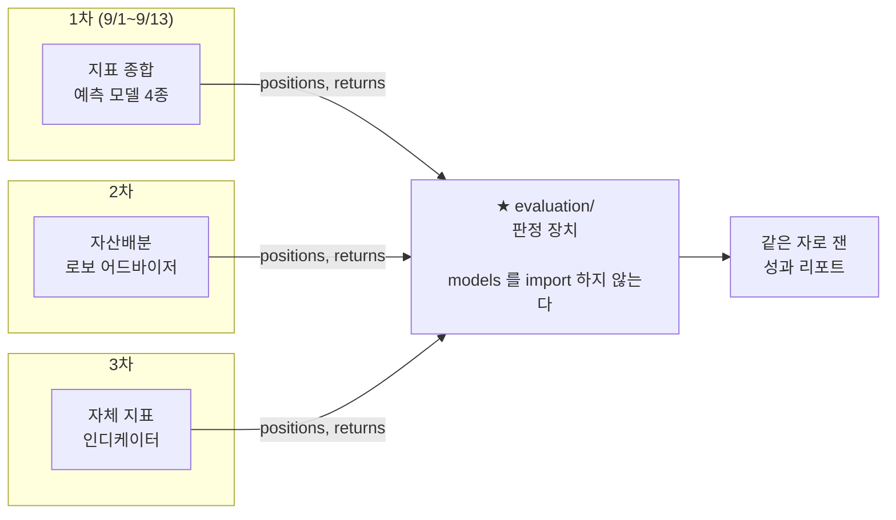

# 문제 정의 — AlphaStack 1차 프로젝트 (v2.0)

> **이 문서가 계획서보다 앞섭니다.** 계획서가 "무엇을 만드나"를 적는다면 이 문서는
> **"왜 만드나, 무엇이 성공인가"** 를 정합니다. 둘이 어긋나면 이 문서가 맞습니다.
>
> v2.0 · 2026-08-27 · 이전 판 [v1.0](../version1.0/문제정의.md) · [변경사항](변경사항.md)
> 근거는 [시장조사](../../시장조사/version2.0/시장조사.md)·[조사/](../../조사/) · 미결은 [회의안건](../../회의안건/2026-09-01-킥오프.md)

---

## 0. 한 줄

> 개인 투자자는 RSI·MACD·이동평균을 함께 켜 두지만, **셋이 서로 다른 말을 할 때
> 무엇을 따를지 정할 근거가 없습니다.** 우리는 여러 지표를 종합하는 예측 모델과,
> 룩어헤드 편향 없이 그 모델을 판정하는 검증 엔진을 함께 만들어
> **"유효한가 아닌가"에 거래비용을 반영한 숫자로 답합니다.**

### 심사자가 물을 세 가지, 그리고 우리 답

| 질문 | 답 |
|---|---|
| **누구의 어떤 문제인가** | 지표가 엇갈릴 때 판정할 방법이 없다. 1차 사용자는 **2·3차의 우리 자신**이고, 2차 사용자가 그 개인 투자자다 |
| **성공과 실패를 무슨 숫자로 가르는가** | 봉인 홀드아웃 1회 평가의 **비용 반영 ΔSharpe와 그 p값**. 임계는 9/1 이전 커밋에 박혀 있다 |
| **결론은 어떤 형식으로 나오는가** | [§6](#6-결론-문장--데이터를-보기-전에-둘-다-씁니다)의 결론 문장 템플릿 두 개 중 하나. **데이터를 보기 전에 둘 다 써 두었다** |

---

## 1. 문제 진술

### 1.1 누구의 문제인가

개인 투자자가 쓰는 도구는 **지표를 보여 주지만 그 조합이 유효한지 판정해 주지 않습니다.**
국내 리테일 퀀트 서비스 5종을 조사한 결과:

- 슬리피지 기본값이 **0이거나 사용자 입력**입니다
- 폴드별 재학습 워크포워드와 purging 을 **공개 기능으로 제공하는 곳을 찾지 못했습니다**
- **"몇 개 조합을 시도해 이 숫자를 골랐는가"를 세는 곳은 한 곳도 없습니다**

### 1.2 왜 그 공백이 비싼가 — 숫자로

| 사실 | 값 | 출처 |
|---|---|---|
| KOSPI200 에서 매일 "상승"만 찍은 적중률 | **52.64%** | KRX 원자료 실측 · 개발구간 N=2,880 |
| 실력이 0인 전략이 250일 구간에서 **20번 시도**하면 나오는 최고 정확도 | **56.0%** | López de Prado *False Strategy* 정리 |
| 슬리피지 가정 하나가 어느 상용 백테스트 CAGR 을 움직인 폭 | **75.30% → 48.94%** | 외부 재현 검증 |
| 2026년 개별주 왕복 거래비용 하한 | **0.23%** | 거래세 0.20% + 수수료 0.03% |

👉 **"정확도 55%" 는 기준선·신뢰구간·시도 횟수·거래비용 없이는 정보량이 0입니다.**

### 1.3 그래서 무엇을 만드는가

우리 산출물은 **또 하나의 예측기가 아니라 판정 장치**입니다.
어떤 전략이 들어와도 `positions`·`returns` 두 배열만 받아 룩어헤드 없이 재고,
**그 판정이 옳게 작동한다는 것을 정답을 아는 가짜 데이터로 증명합니다.**



> **이 무지(無知)가 재사용의 조건입니다.** `evaluation` 은 무엇이 그 포지션을 만들었는지
> 모릅니다. 그래서 세 차수가 같은 함수를 씁니다.

---

## 2. 확정값 — 킥오프에서 '확정'만 하고 '토론'하지 않습니다

| 항목 | 확정값 | 근거 |
|---|---|---|
| **예측 대상** | **KOSPI200 지수** | 과제명 "주가지수" 요건과 일치. 지수는 유니버스를 구성하지 않아 **생존 편향이 구조적으로 발생하지 않는다** |
| **예측 지평** | **5거래일** | 1일 지평은 손익분기 정확도가 **65.03%** 인데 문헌 상한이 55%대다. **설계상 이미 진다** → [조사/예측지평](../../조사/예측지평.md) |
| **`walk_forward` gap** | **5** (= horizon) | 레이블이 t→t+5 를 보므로 학습 끝과 검증 시작 사이 5시점을 버려야 한다 |
| **레이블** | 시가(t+1)→시가(t+6) 수익률의 **±1.0% 3분류** | 클래스 균형 **실측 확인** — 상승 34.03% · 중립 38.66% · 하락 27.31%. ADR 이 요구한 15~45% 안이라 **임계값 조정 불필요** |
| **실행 가정** | T일 **종가**까지의 정보 → **T+1일 시가** 단일가 체결 | "종가에 사서 다음 종가에 판다"는 실행 불가 |
| **포지션** | `{0, +1}` — **공매도 없음** | 재개 후 6개월 개인 공매도 비중 **1.2%** (대주 재원 부족) |
| **주 지표** | **거래비용 반영 ΔSharpe vs Buy&Hold** | 정확도는 보조 칸으로 강등 |
| **거래비용** | KOSPI200 **ETF 왕복 0.05%** 가 주 시나리오 | ETF 는 증권거래세 면제 → 5일 손익분기가 **51.43%** 로 내려간다. **"거래세를 이기는가"가 아니라 "예측력이 있는가"를 검정하게 만든다** |
| **데이터** | 2010-01-04 ~ · **4,097거래일** | KRX Open API 제공 시작일 (실측: 2009년은 0행) |
| **분할** | 개발 2010-01-04~2021-08-31 (2,880일) / **봉인 홀드아웃** 2021-09-01~ (**1,217일**) | 홀드아웃은 **한 번만** 연다 |

### ⚠️ 왜 지평을 5일로 늘렸나 — 이 한 칸이 프로젝트의 생사입니다

```
손익분기 방향정확도 = 0.5 + 왕복비용 / (2 × E|수익|)
```

| 조건 | 손익분기 | 문헌 상한 | 판정 |
|---|---|---|---|
| 개별주 · **1일** · 왕복 0.23% | **65.03%** | 55%대 | 🔴 **설계상 진다** |
| KOSPI200 ETF · **5일** · 왕복 0.05% | **51.43%** | 55%대 | 🟢 검정할 여지가 있다 |

🔬 개발구간 실측 E\|일수익\| **0.765%** · E\|5일수익\| **1.753%**.
재현: `python scripts/measure_horizon.py`

1일 지평으로 갔다면 우리는 **"정확도가 얼마 나오든 진다"** 는 실험을 2주 동안 했을 것입니다.

---

## 3. 성공 기준 — 전부 검증 가능해야 합니다

### 3.1 임계가 있는 기준 (합격/불합격)

| # | 기준 | 측정 방법 |
|---|---|---|
| **1. 주 검정** | 봉인 홀드아웃 1회 평가에서 왕복 0.05% 반영 후 (전략−B&H) 일간 초과수익 평균의 **stationary block bootstrap 단측 p < 0.05** | 블록 평균 10거래일 · 재표본 10,000회 · 시드 20260901 |
| **2. 검증기 자기검증** | 레이블만 블록 셔플한 **잡음 전략 100건 중 '통과' 판정 비율 ≤ 10%** | 통과 = (PT p<0.05) AND (ΔSharpe>0). 이 비율을 **리포트 표지에 인쇄** |
| **3. 봉인 증명** | `reports/unseal.log` 행 수 **== 1** | 사전등록 ADR 커밋 시각이 그 행보다 앞섬을 `git log` 로 대조 |
| **4. 시도 횟수 정직성** | `trials.jsonl` 행 수 **== 학습 러너 `fit` 호출 수** (누락 0건) | 성능표에 [기준선·Wilson CI·표본수·N·E[max]] 중 하나라도 비면 **리포트 생성기가 예외를 던진다** |
| **5. 재현성** | 동일 커밋·시드·스냅샷으로 2회 실행 시 주 지표가 **소수점 6자리까지 일치** | `make reproduce` 가 불일치 시 `exit 1` |
| **6. 비용 손익분기** | ΔSharpe = 0 이 되는 왕복 비용을 **0.01% 간격 이분탐색**으로 소수점 2자리까지 | 실측 비용 구간이 그 임계의 어느 쪽인지 명시 |

### 3.2 임계 **없이** 실측치만 보고하는 칸

- 무작위 K-fold vs gap=5 워크포워드의 **정확도 차이(pp)**
- **MDE** (방향정확도 검출 한계, pp)

> **왜 일부러 임계를 안 거나.** 여기에 합격선을 걸면 **"누수를 크게 만들어야 통과하는"
> 역인센티브**가 생깁니다. 지수 5일 레이블에서 차이가 작게 나오는 것은 결함이 아니라
> 측정 결과일 수 있습니다. 수치 게이트는 §3.1 의 기준 2 가 맡습니다.

---

## 4. 무엇을 하지 않는가 — 범위 밖

> 범위가 선명해지려면 **안 하는 것**이 적혀 있어야 합니다.

| 하지 않는 것 | 왜 |
|---|---|
| **인터랙티브 예측 신호 대시보드** | `api/` 가 빈 `__init__.py` 하나다. 검증 엔진 완성과 웹 서버 구축을 이틀에 함께 넣으면 발표 이틀 전 시연물이 없다 → **정적 HTML 5화면**으로 대체 |
| **뉴스·공시 감성 피처** | 공시 시점 정합을 룩어헤드 없이 2주에 붙이는 것은 함정을 새로 여는 일이다. **우리 프레이밍이 정확히 그 지점에서 무너진다** |
| **350종목 횡단면 랭킹** | 현 `walk_forward` 는 평탄 인덱스 기반이라 **같은 거래일이 학습·검증으로 쪼개진다** → 3차 |
| **CPCV** (Combinatorial Purged CV) | 다중 경로 집계와 embargo 구현이 추가로 필요하다. 2주 규모에서 감당이 안 된다 |
| **[시장 균열 스코어](../../조사/시장균열스코어.md)** | 조사는 끝났으나 구현이 **2.5~3 인일**. 모델링을 밀어낸다 → 2차 |
| **실거래·실계좌 연동 · 증권사 API** | 교육 프로젝트이고, 증권사 API 는 계좌 개설이 전제이며 조회 제한이 백필에 부적합하다 |

---

## 5. 이 프레이밍의 약점 — 심사자가 찌를 곳

정직하게 적습니다. 미리 알고 답을 준비하는 것이 목적입니다.

| 약점 | 우리 답 |
|---|---|
| **"성공 기준을 너희가 정했고 나중에 고칠 수 있지 않나"** | 그래서 **사전등록 ADR** 을 데이터 보기 전에 커밋했습니다. git 이력은 우리가 조작할 수 없는 유일한 증거입니다 |
| **"1차 사용자가 너희 자신이면 그게 무슨 사용자인가"** | 맞습니다. 그래서 **사용자 인터뷰를 했다고 주장하지 않습니다.** 2·3차가 실제로 이 패키지를 import 하는 것으로 증명합니다 |
| **"개인 투자자 얘기를 하면서 왜 지수를 예측하나"** | 도입 30초만 그 서사를 쓰고 더 끌지 않습니다. 지수를 고른 이유는 [§2](#2-확정값--킥오프에서-확정만-하고-토론하지-않습니다)에 있습니다 |
| **"결국 못 이겼다는 거 아닌가"** | 아노말리 재현 실패율이 **65~82%** 인 분야입니다. 완료 기준은 "이겼다"가 아니라 **"기준선 대비 어디였는지를 재현 가능하게 보였다"** 입니다 |

---

## 6. 결론 문장 — 데이터를 보기 전에 둘 다 씁니다

> ✅ **커밋했습니다** — [`decisions/0004-사전등록.md`](../../decisions/0004-사전등록.md) (2026-08-26).
> 정본은 그 ADR §8 이며 리포트 생성기는 그쪽을 읽습니다.
> 그래야 9/13 에 숫자를 예쁘게 만들려는 압력이 생기지 않습니다.

**기각(예측력이 있었다)**

> "지표 종합 모델은 KOSPI200 5거래일 방향에서 왕복 0.05% 반영 후 Buy&Hold 대비
> 연율 **X%** 초과수익을 냈다 (block bootstrap p=**Y**, DSR=**Z**, 시도 **N**회,
> 우연 기대 최고 정확도 **W%**)."

**기각 실패(예측력이 없었다)**

> "…초과수익을 내지 못했다 (p=**Y**). 결론은 **'이 피처·이 지평에서는 유효하지 않다'** 이며,
> 그것을 편향 없이 확증한 절차 — 누수 제거 폭 **A** pp, 검증기 거짓 양성률 **B%**,
> 시도 횟수 **N**, 검출 한계 **C** pp — 가 이 프로젝트의 산출물이다."

Arnott·Harvey·Markowitz (2019) *A Backtesting Protocol* 이 적은 그대로입니다 —
*"Researchers should be rewarded for good science, not good results. (…)
**most experiments will fail** to uncover a positive result."*

**"유효하지 않다"는 결론도 성공한 프로젝트입니다.** 지금 못 박아 두지 않으면 발표
이틀 전에 유리한 구간·지표를 고르게 됩니다.

---

## 7. 발표 5분 — 이 순서로 리허설합니다

| 시각 | 내용 |
|---|---|
| 0:00 | **지표 불일치 한 줄** — RSI 매수 / MACD 매도 / 20일선 매수 → *"이 셋 중 무엇을 따르는가"* |
| 0:30 | 우리가 만든 것은 **예측기가 아니라 자**다. `evaluation` 은 `models` 를 import 하지 않는다 — 코드 한 줄을 띄운다 |
| 1:00 | **자가 옳게 작동한다는 증거 두 장** — 무작위 K-fold vs gap=5 정확도 차이 / 음성 대조군 거짓 양성률 |
| 2:00 | **모델 4종 비교표** — 기준선·Wilson CI·시도 횟수 N·우연 기대 최고 정확도가 같은 표에 |
| 3:00 | **홀드아웃 1회 결과** + 사전등록 커밋 해시 + `wc -l unseal.log` = 1 + 손익분기 비용 |
| 4:00 | **결론 문장**(둘 중 하나를 그대로 읽는다) + 2·3차 인터페이스 한 줄 |

> ⚠️ 도입 30초를 제외하면 개인 투자자 서사를 더 끌지 않습니다 — "인터뷰했나"에 걸립니다.

---

## 8. 계획서와 어긋나는 곳

> v1.0 §8 이 계획서 수정 지침을 **57줄**로 적었는데, 그중 대부분이 실행됐습니다.
> 남은 것만 여기 적고, 당시 지침 전문은 [v1.0 §8](../version1.0/문제정의.md) 에 있습니다.

| 계획서 | 실제 | 상태 |
|---|---|---|
| 목표 ①이 *"예측 모델 개발"*, 검증 엔진이 필수 ⑤ 맨 끝 | **검증 엔진이 ①이어야 한다** — 같은 과제를 받은 모든 팀이 ① 문장을 쓴다 | 🔲 계획서 수정 필요 |
| 산출물 ① 인터랙티브 대시보드 | 정적 HTML 5화면 | 🔲 계획서 수정 필요 |
| *"선택 범위는 합류 팀원의 관심사에 따라 추가·수정·삭제한다"* | 모집 공고의 미덕이고 **심사의 감점**이다 → *"필수가 닫힌 뒤에만 착수하며 9/8 중간 점검에서 한 번만 결정한다"* 로 | 🔲 계획서 수정 필요 |
| *"착수 첫날부터 학습 가능"* · *"ML 라이브러리가 하나도 없다"* | 백필 완료(**9,209,812행**) · ML 스택 5종 확정 | ✅ 해소 |
| 부록 D *"엔드포인트 51개·화면 10개"* | **이동원 개인 원본 수치**였다 | ✅ 정정 |
| 부록 B 역할표와 회의안건 C-3 이 **같은 사람에게 다른 일**을 준다 | 팀 4명 확정 · 담당 배정 완료 | ✅ 해소 |

---

## 9. 남은 미결

이 문서가 닫지 **못한** 것입니다 → [회의안건](../../회의안건/2026-09-01-킥오프.md)

- **팀장** 선정 · **화면 스택**(Streamlit vs 정적 HTML) · **산업 분류 기준**
- 확장창 vs 롤링창, 폴드 수 — 사전등록 시점에 고정
- 포지션 임계 θ 기본값과 조정 허용 범위
- 딥러닝 채택 여부 — 9/8 중간 점검에서
- **강사의 실제 평가 기준·배점·발표 시간** — 킥오프 전에 짧게 질의할 것

> ✅ **닫힌 것**: 팀 저장소(**SQLite 하나** · Supabase 안 씀) · `features/`·`models/` 담당
> (신장환 · 4번째 팀원) · 레이블 클래스 균형(조정 불필요).
