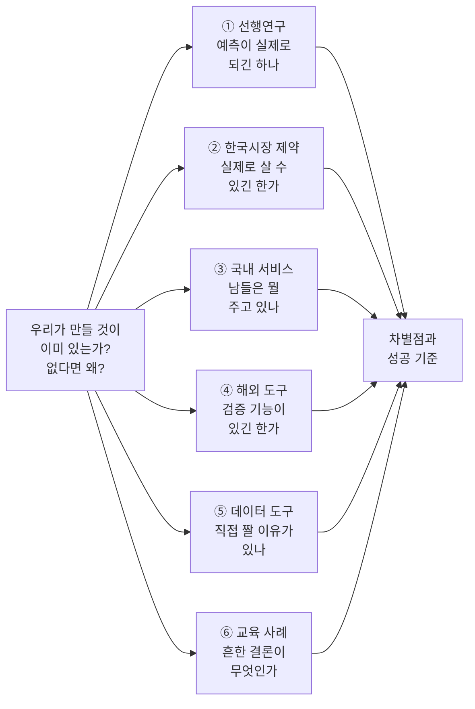
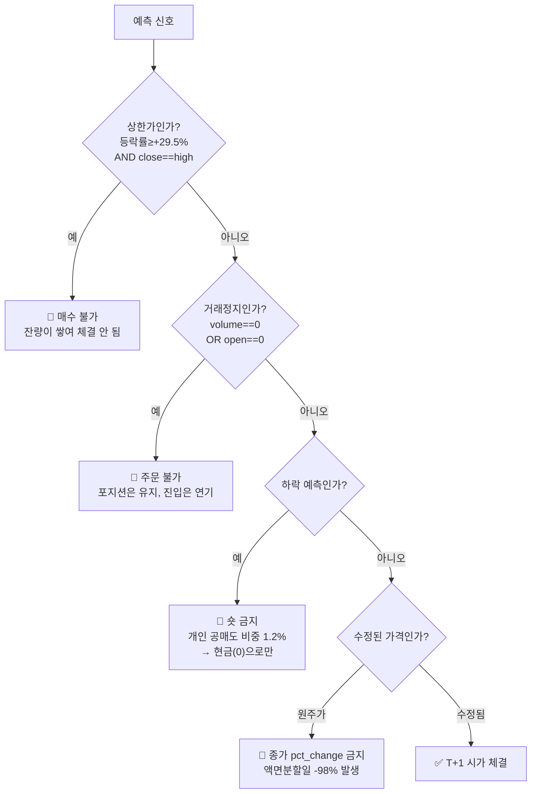
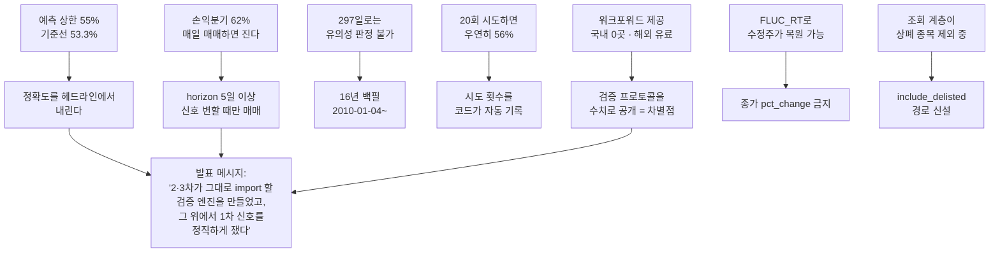

# 시장 조사 — AlphaStack 1차 프로젝트

> **이 문서를 왜 읽어야 하나.** 우리가 만들려는 것이 이미 세상에 있는지, 없다면 왜 없는지,
> 그리고 "주가를 맞힌다"는 일이 실제로 어디까지 가능한지를 **숫자로** 확인한 기록입니다.
>
> 조사 2026-08-26 · 6개 각도 · 출처 링크는 각 항목에 답니다.
> **2026-08-26 갱신**: 백필 완료 후 기준선·손익분기를 KRX 원자료로 재측정했습니다 (§2.1 · §2.4).
> 여기서 나온 결정은 [ADR](../../decisions/)로, 아직 못 정한 것은 [회의안건](../../회의안건.md)으로 갑니다.

---

## 0. 세 줄 요약

1. **일간 주가 방향 예측의 현실적 정확도 상한은 55% 안팎이다.** 그런데 KOSPI200에서
   아무 생각 없이 "매일 오른다"고만 찍어도 **52.72%**가 나온다 (KRX 원자료 실측,
   2010-01-04~2026-08-25, N=4,097). 즉 우리가 55%를 얻어도 그건 거의 아무 말도 아니다.
2. **2026년 한국 거래비용을 넣으면 매일 사고파는 전략의 손익분기 정확도는 62.72%다.**
   상한이 55%인데 손익분기가 62%다 — **1일 지평 개별주 매매는 설계상 이미 진다.**
   그래서 지평을 5일로, 거래 대상을 KOSPI200 ETF로 옮겼다 (손익분기 51.24%).
3. 그래서 우리 프로젝트의 값어치는 "얼마나 맞혔나"가 아니라 **"어떻게 쟀나"**에 있다.
   조사해 보니 그 자리가 실제로 비어 있었다.

---

## 1. 어떻게 조사했나

여섯 각도로 나눠 동시에 조사했습니다. 한 각도가 놓치는 것을 다른 각도가 잡게 하려는 배치입니다.



**숫자 원칙**: 이 문서의 모든 수치는 **잰 것**입니다. 재지 않은 것은 "미측정"이라 적었습니다
([AGENTS.md 5.4](../../../AGENTS.md)). 우리가 직접 실행해 잰 것은 🔬로 표시했습니다.

---

## 2. ① 주가 방향 예측은 실제로 어디까지 되나

> 이 절이 이 문서에서 가장 중요합니다. **발표에서 강사님이 반드시 묻는 지점**이기 때문입니다.

### 2.1 기준선부터 — "아무것도 안 하면 몇 %인가"

> ✅ **2026-08-26 갱신 — KRX 원자료로 재측정했습니다.** 조사 당시에는 Yahoo Finance
> `^KS200`밖에 없었지만, 이제 우리 저장소에 KOSPI200 4,097거래일이 들어왔습니다.
> **아래 KRX 값이 정본입니다.** 재현: `python scripts/check_index_data.py`

🔬 **KRX Open API 원자료** (2010-01-04 ~ 2026-08-25, N=**4,097**거래일)

| 기준선 | **KOSPI200 (KRX)** | 참고: Yahoo `^KS200` | 참고: S&P500 |
|---|---|---|---|
| **항상 "오른다"** | **52.72%** | 53.30% | 54.53% |
| 전일 방향 지속 | **49.85%** | 49.88% | 47.97% |
| 무작위 | 50% | 50% | 50% |
| 상승/하락/보합 | 2,160 / 1,910 / 27 | — | — |
| **E\|일수익\|** | **0.904%** | 0.956% | — |

> 📌 **두 값이 0.58%p 다릅니다.** 구간이 다르고(KRX 2010~ vs Yahoo 2006~) 출처도
> 다릅니다(KRX 원자료 vs Yahoo 재계산본). **발표에는 KRX 값을 씁니다** — 우리가
> 학습에 쓸 바로 그 데이터에서 나온 숫자여야 합니다.

주식은 장기적으로 오르는 날이 더 많습니다. 그래서 **"매일 오른다"고만 찍는 바보 모델이
이미 52.72%**입니다. 흔한 프로젝트가 자랑하는 "정확도 55%"는 이 바보보다 **2.3%p** 위입니다.

> ⚠️ `evaluation/baseline.py` 에 이 세 기준선이 이미 구현돼 있습니다
> (`always_up` · `majority_class` · `previous_direction`). 성능표에 **반드시 함께** 싣습니다.

### 2.2 그 2.3%p는 통계적으로 의미가 있나 — 표본이 작으면 없다

정확도는 동전을 N번 던져 앞면 비율을 재는 것과 같습니다. N이 작으면 그 비율 자체가 흔들립니다.

| 검증 표본 | 1 표준오차 | 55% vs 52.72% 의 z |
|---|---|---|
| 250일 (1년) | 3.16%p | 0.54 |
| **297일** (원본 보유량) | **2.89%p** | **0.59** |
| 500일 (2년) | 2.24%p | 0.76 |
| 1,250일 (5년) | 1.41%p | 1.20 |
| **2,500일 (10년)** | 1.00%p | **1.70** ← 겨우 유의 |

**297거래일로는 55%와 53.3%를 구분할 수 없습니다.** z=0.59는 "둘이 다르다"고 말할 근거가
전혀 안 되는 값입니다(단측 5% 유의는 z>1.645).

👉 **이것이 백필을 16년치로 잡은 이유입니다.**

### 2.3 더 나쁜 것 — 실력이 0이어도 55%는 나온다

여러 번 시도해서 제일 좋은 걸 고르면, 실력이 전혀 없어도 좋은 숫자가 나옵니다.
López de Prado의 *False Strategy* 정리로 계산한 값입니다 (검증표본 250일 기준).

| 시도 횟수 | 실력이 0일 때 우연히 나오는 최고 정확도 |
|---|---|
| 5회 | 53.77% |
| 10회 | 54.98% |
| **20회** | **56.01%** |
| 50회 | 57.20% |
| 100회 | 58.00% |

우리는 모델 4종(로지스틱·RF·XGBoost·LightGBM) × 하이퍼파라미터 탐색을 계획하고 있습니다.
**20회는 순식간에 넘습니다.**

> 📌 그래서 **시도 횟수를 세서 보고**해야 합니다. 시도 횟수를 밝히지 않은 55%는
> 정보량이 0입니다. 이건 우리가 코드로 자동화할 수 있습니다 (→ 7절).

### 2.4 거래비용을 넣으면 — 62.72%를 넘어야 본전이다

> ✅ **2026-08-26 갱신 — KRX 원자료 실측으로 다시 계산했습니다.**

🔬 KOSPI200의 하루 평균 절대수익률 E|r| = **0.904%** (KRX, N=4,097).
2026년 왕복 거래비용 하한은 **0.23%** (→ 3절).

```
손익분기 방향정확도 = 0.5 + 왕복비용 / (2 × E|r|)
```

| 왕복비용 | **1일 지평** | **5일 지평** |
|---|---|---|
| **0.05%** (KOSPI200 ETF) | 52.76% | **51.24%** |
| **0.23%** (개별주 2026 하한) | **62.72%** | 55.69% |
| 0.30% (현재 코드 가정) | 66.59% | 57.42% |
| 0.50% (코스닥 중소형) | 77.64% | 62.36% |

> ⚠️ 5일 지평은 "증분이 독립"이라는 가정 위의 √5 근사입니다. **실제 5일 절대수익
> 분포로 다시 재야 합니다 — 아직 미측정.**

### 이 표 한 장이 프로젝트 설계를 결정했습니다

| 조합 | 손익분기 | 문헌상 상한 | 판정 |
|---|---|---|---|
| 개별주 · 1일 지평 · 0.23% | **62.72%** | 55%대 | 🔴 **설계상 진다** |
| KOSPI200 ETF · 5일 지평 · 0.05% | **51.24%** | 55%대 | 🟢 검정할 여지가 있다 |

👉 **예측 지평을 1일이 아니라 5일로, 거래 대상을 개별주가 아니라 ETF로 잡아야 하는 이유입니다.**
그리고 신호가 **바뀔 때만** 매매하는 구조여야 합니다.

1일 지평으로 갔다면 우리는 *"정확도가 얼마 나오든 진다"*는 실험을 2주 동안 했을 것입니다.

### 2.5 논문들이 실제로 보고한 값

| 연구 | 대상 | 방향 정확도 |
|---|---|---|
| Int. J. Data Science & Analytics (2025) 대규모 리뷰 | 다국가 | **평균 51%** (SVM 51.64 · GB 51.61 · ANN 51.60) |
| Kim (2003) *Neurocomputing* | **KOSPI** | 최고 57.83% — 단, 같은 표에서 50.09~57.83%로 흔들림 |
| Fischer & Krauss (2018) LSTM | S&P500 | 50.9~54.3%. Sharpe 5.8은 **비용 전**이고 2010년 이후 초과수익 소멸 |
| Gu·Kelly·Xiu (2020) | 미국 개별주 월간 | out-of-sample **R² 0.40%** ← 최고 수준의 천장 |
| MDPI AI (2025) | S&P500 | test 최고 55.04~55.88% |

> ⚠️ **인용하면 위험한 논문**: 정확도 85~95%를 보고하는 것들(예: Khaidem et al. 2016의
> 83.9~92.1%). 그들은 **지수평활한 시계열** 위에서 지표와 레이블을 만들었고 예측 지평도
> 3~10일입니다. 평활하면 레이블이 과거의 거의 결정론적 함수가 되어 문제가 쉬워집니다.
> **팀원이 이런 논문을 근거로 목표 정확도를 잡지 않도록 합니다.**

### 2.6 이 분야 자체가 재현이 안 된다

| 연구 | 결과 |
|---|---|
| Hou·Xue·Zhang (2020) *Replicating Anomalies* | 452개 아노말리 중 **65%가 t>1.96도 못 넘음**. 기준을 t>2.78로 올리면 **82% 실패** |
| Harvey·Liu·Zhu (2016) | 새 발견을 주장하려면 **t > 3.0**을 요구. 이미 316개 이상의 팩터가 같은 데이터에 시도됨 |
| Novy-Marx & Velikov (2016) | 월 편도 회전율 50% 초과 전략 중 **순 스프레드가 유의한 것은 단 2개** |
| Chen & Velikov (2023) | 비용·공표 후 감쇠를 반영하면 평균 아노말리 수익성은 **사실상 소멸** |

**아노말리 재현 실패율이 65~82%인 분야**에서, 2주짜리 학생 프로젝트가 진짜 알파를 찾을
확률은 사실상 0입니다. 이건 비관이 아니라 **출발선**입니다.

### 2.7 그래서 성공 기준을 어디에 둬야 하나

Arnott·Harvey·Markowitz (2019) *A Backtesting Protocol*의 문장을 그대로 옮깁니다.

> "Researchers should be rewarded for good science, not good results.
> A healthy culture will also set the expectation that **most experiments will fail**
> to uncover a positive result."

👉 완료 기준을 **"이겼다"가 아니라 "기준선 대비 어디였는지를 재현 가능하게 보였다"**로
미리 정의해야 합니다. 이걸 킥오프에서 못 박지 않으면, 발표 이틀 전에
숫자를 예쁘게 만들려는 압력이 생깁니다.

---

## 3. ② 한국 시장이 실제로 허용하는 것

> "백테스트에서는 벌었는데 실제로는 못 사는 거래"를 하고 있지 않은지 확인한 절입니다.

### 3.1 거래비용 — 2026년에 세율이 **올랐습니다**

| 시행일 | 코스피 실효세율 | 비고 |
|---|---|---|
| ~2019-05-29 | 0.30% | |
| 2019-05-30~ | 0.25% | |
| 2021-01-01~ | 0.23% | |
| 2023-01-01~ | 0.20% | |
| 2024-01-01~ | 0.18% | |
| 2025-01-01~ | **0.15%** | 본세 0% + 농특세만 |
| **2026-01-01~** | **0.20%** | 본세 0.05% + 농특세 0.15% — **환원** |

증권거래세는 **매도할 때만** 붙습니다. 여기에 위탁수수료(키움 0.015%)와 유관기관수수료
(0.0036%)를 왕복으로 더하면 **하한 0.23%**입니다. 슬리피지는 별도입니다.

> 🔴 **백테스트 구간이 16년이므로 세율을 날짜 함수로 만들어야 합니다.**
> 2025년 한 해만 0.15%였다는 사실이 성과를 왜곡할 수 있습니다.

### 3.2 현재 코드의 "왕복 0.3%"는 맞나 — 무엇을 거래하는지에 달렸다

`evaluation/metrics.py`의 `DEFAULT_ROUND_TRIP_COST = 0.003`을 판정한 결과입니다.

| 거래 대상 | 실측 왕복비용 | 0.3% 가정은 |
|---|---|---|
| KOSPI200 **ETF** | 약 0.05% (거래세 0 + 수수료 0.03% + 스프레드 0.01%) | **6배 과대계상** |
| 코스피 **개별주** (저수수료) | 약 0.40% (세금 0.20% + 수수료 0.037% + 1틱 0.167%) | **과소계상** |
| 코스닥 **중소형주** | 0.55% 이상 | 크게 과소계상 |

👉 **"0.3%는 틀렸다"가 아니라 "무엇을 거래하는지 안 정해서 판정 불가"**입니다.
예측 대상([회의안건 A-2](../../회의안건.md))이 정해져야 거래비용([B-2](../../회의안건.md))이 닫힙니다.
어느 쪽이든 틀리므로 "보수적 가정"이라는 변명이 성립하지 않습니다.

### 3.3 백테스트에서 **금지**해야 할 8가지

이게 없으면 우리 백테스트는 실제로 불가능한 거래를 하게 됩니다.



| # | 금지 | 왜 |
|---|---|---|
| 1 | **상한가 진입** | 매수 잔량이 쌓인 종목은 개인이 그날 체결 못 시킴. 기준가×1.30을 호가단위로 절사하므로 정확히 30%가 아니라 29.8x%가 나온다 — **정확한 30% 비교를 쓰면 안 잡힌다** |
| 2 | **거래정지일 매매** | KRX는 정지 기간에도 종가만 직전값으로 채운 행을 준다. 필터 없으면 "정지 중에 매매"한다 |
| 3 | **미수정 가격으로 수익률** | 액면분할일 −98%가 그대로 들어간다 (→ 6절에 해법) |
| 4 | **개인의 숏 포지션** | 재개 후 6개월 개인 공매도 비중 **1.2%**(대주 재원 부족). `positions ∈ {0, +1}`로 제한 |
| 5 | **생존 편향** | 상장폐지 종목을 빼면 "살아남은 것들"만 보고 과거를 잰다 |
| 6 | **체결 불가 상태 무시** | 투자경고·투자위험(증거금 100%)·단기과열(30분 단일가)·정리매매 구간 |
| 7 | **종가 매수 가정** | "종가에 사서 다음 종가에 판다"는 실행 불가. 유일하게 가능한 형태는 **T일 종가 정보로 신호 → T+1일 시가 단일가 체결** |
| 8 | **NXT 시간외 가격 혼입** | 프리마켓(08:00~08:50)·애프터마켓(15:30~20:00) 가격은 다음날 기준가에 영향을 주지 않고 유동성이 얕다 |

### 3.4 배당 — 섞으면 안 된다

KRX 일별매매정보에는 배당이 없습니다. 두 갈래 중 **하나를 택하고 명시**해야 합니다.

- (a) 가격수익만 재고 "배당 미반영"을 못 박는다 (KOSPI 배당수익률 2026-05 기준 0.83% → 연 0.8%p 과소평가)
- (b) KOSPI200 TR(총수익)지수를 기준선으로 함께 쓴다

> 🔴 **Buy & Hold 기준선을 가격수익으로 재면서 우리 전략을 총수익으로 재는 혼용은 절대 금지.**

---

## 4. ③ 국내 서비스는 무엇을 주고 무엇을 안 주나

### 4.1 지형

| 서비스 | 가격 | 백테스트 | 생존편향 | 룩어헤드 | 워크포워드 |
|---|---|---|---|---|---|
| **퀀트킹** | 올인원 $200 / 국가별 $140 | 무제한 | 2021년엔 **미반영**(지적받음) → 2026 개선 | 미공개 | ❌ |
| **젠포트**(뉴지스탁) | 월 47,000~170,000원 | 일봉 2007~ · 틱 2017~ | 미공개 | 미공개 | ❌ |
| **퀀터스** | 월 49,900~109,000원 | 10분위 백테스트 | **"20년 이상 사후편향 없는 데이터"** 명시 | 미공개 | ❌ |
| **인텔리퀀트** | 무료 / 월 21,000 / 70,000원 | JavaScript 코딩 | 명시 | **국내 유일 명시** (단, 지연일수 미공개) | ❌ |
| **알파스퀘어** | 프리미엄 구독 | 유사차트 기반 "AI예측" | — | — | ❌ |
| **씽크풀** | 월 39,800~55,000원 | "적중률 상위종목" | — | — | ❌ |

> 🔴 **조사 범위에서 워크포워드(폴드별 재학습) + gap을 표준 기능으로 제공·공개하는
> 국내 리테일 서비스를 찾지 못했습니다.** 룩어헤드 처리를 문장으로라도 밝히는 곳은
> 인텔리퀀트 하나이고, 그마저 구체적 지연일수는 공개하지 않습니다.

### 4.2 거래비용 가정 하나가 결과를 26%p 바꾼다

외부 검증자가 퀀트킹 결과를 파이썬으로 재현한 표입니다.

| 조건 | CAGR |
|---|---|
| 퀀트킹 원본 (슬리피지 0% · 월말 리밸런싱) | **75.30%** |
| 파이썬 재현 (정합성 확인) | 75.37% |
| 실제 리밸런싱일 적용 | 70.93% |
| 슬리피지 1% | 55.08% |
| 슬리피지 2% | **48.94%** |

같은 전략인데 **26%p 이상** 벌어집니다. 게다가 퀀트킹은 월봉 기준이라
"일봉으로 보면 −80~−90%가 될 MDD가 −20%로 표시"된다는 지적이 남아 있습니다.

👉 **우리는 MDD를 일별 종가 기준으로 계산하고, 그 사실을 README에 한 줄 적습니다.**
남들이 못 한 걸 우리가 했다고 말할 수 있는 가장 싼 항목입니다.

👉 **거래비용 민감도 표**(왕복 0.23% / 0.30% / 0.50% / 1.00%)를 필수 산출물로 올립니다.
구현 비용은 함수 인자 하나이고, 발표에서 가장 강한 슬라이드가 됩니다.

### 4.3 증권사 API는 백필에 쓸 수 없다

| API | 제약 |
|---|---|
| 한국투자증권 KIS | 기간별시세 **1회 100건**, 일자별 **30일** 제한, 과거 분봉 **미제공** |
| 키움 Open API+ | Windows **32bit** COM 종속, 시간당 1,000건, **3개월 미접속 시 자동 해지** |
| 키움 REST (2025-03~) | 국내주식 한정 |
| 대신 CREON / LS xingAPI | 32bit 파이썬 + 관리자 권한 + HTS 선행 로그인 |

셋 다 **계좌 개설이 전제**입니다. 👉 1차 범위에서 명시적으로 제외합니다.

---

## 5. ④ 해외 오픈소스 도구 — 검증 기능이 있긴 한가

### 5.1 우리 `gap`은 업계 표준 개념이다

`evaluation/walk_forward.py`의 `gap` 인자는 **sklearn `TimeSeriesSplit(gap=...)`와 의미가 정확히 같습니다.**

> sklearn 문서: *"Number of samples to exclude from the end of each train set before the test set."*

이름 계보도 확인했습니다.

| 이름 | 출처 |
|---|---|
| **h-block cross-validation** | Burman·Chow·Nolan (1994) *Biometrika* — 원조 |
| **purging** | López de Prado (2017/2018) — 금융 쪽 명명 |
| `gap` | sklearn 0.24 (2020-12) |
| `purged_size` | skfolio |
| `purge_td` | vectorbt **PRO**(유료) |

> ⚠️ **용어를 정확히 씁시다.** 우리 `gap`은 **purging**이고 **embargo가 아닙니다.**
> embargo는 검증 구간 **뒤**의 버퍼로, 학습이 검증보다 뒤에 오는 배치(CPCV 등)에서만 발생합니다.
> 워크포워드는 학습이 항상 앞이라 embargo가 구조적으로 생기지 않습니다.
> **[회의안건 A-2](../../회의안건.md)의 "gap=5" 표현을 `gap(=purging)`으로 고쳐야 합니다.**

### 5.2 백테스트 프레임워크 7종 중 purged CV 기본 제공은 **0개**

| 도구 | 워크포워드 | purged CV | 상태 |
|---|---|---|---|
| Backtrader | ❌ | ❌ | 마지막 릴리스 **2023-04-19** |
| PyAlgoTrade | ❌ | ❌ | **2023-11 아카이브** |
| zipline-reloaded | ❌ | ❌ | 유지보수 중이나 바이너리 의존 무거움 |
| vectorbt (OSS) | ✅ 분할기 3종 | ❌ | purge/embargo 인자 없음 |
| vectorbt **PRO** | ✅ | ✅ | **유료 구독** |
| NautilusTrader · LEAN · bt | ❌ | ❌ | |
| **skfolio** (BSD-3, 무료) | ✅ | ✅ **CombinatorialPurgedCV** | 실재함 |

이 계층의 도구는 "주문 체결·손익 시뮬레이터"이고, 교차검증 분할은 sklearn 계열이 맡도록
**역할이 갈려 있습니다.**

> ⚠️ **"우리만 있다"고 말하면 안 됩니다.** skfolio가 무료로 CPCV를 제공합니다.
> 방어 가능한 서술은 이것입니다 —
> *"무료 대안도 있으나, 레이블 정의(horizon)와 gap이 한 화면에서 맞물려 보이게 하려고
> numpy로 직접 구현했다."*

### 5.3 거래비용은 어떤 도구를 가져와도 우리가 만들어야 한다

LEAN조차 브로커별 fee model에 **한국 증권사가 없고**(인도 Zerodha는 있음),
기본 슬리피지는 `NullSlippageModel`(=0)입니다.

👉 "왕복 0.3% 가정"은 **도구 선택으로 해결되는 항목이 아닙니다.**

---

## 6. ⑤ 우리 수집 코드는 직접 짤 값어치가 있었나

> 🔬 이 절의 수치는 **2026-08-26 우리 저장소 클라이언트로 직접 호출해 잰 것**입니다.

### 6.1 KRX Open API의 성질 — 세 가지 실측

| 실측 | 결과 |
|---|---|
| **제공 시작 경계** | 2009-01-02 → 0행 · 2009-12-30 → 0행 · **2010-01-04 → 1,961행** |
| **수정주가** | 안 준다. 005930은 2018-04-27 종가 2,650,000원 → 05-04 51,900원. 단순 비교 **−98.04%** |
| **상장폐지 종목** | **자동 포함.** 2018-05-04 KOSPI 892종목 중 **87종목**이 2026년엔 없다 |

⚠️ **범위 밖 날짜가 에러가 아니라 빈 응답(0행)으로 조용히 돌아옵니다.**
백필 스크립트가 0행을 정상으로 적재할 수 있으니 경계 검사가 필요합니다.

### 6.2 수정주가 문제는 **이미 풀렸습니다** — 별도 도구가 필요 없다

KRX가 원주가만 주지만, **등락률 필드 `FLUC_RT`는 분할 조정된 기준가 대비**로 계산돼 있습니다.

🔬 검증 (005930, 2018년 50:1 액면분할):

| 계산 방법 | 2018-04-23 ~ 05-11 수익률 |
|---|---|
| 종가 단순 비교 (❌) | **−98.02%** |
| 50:1 보정 원주가 | −1.16% |
| **`FLUC_RT` 누적** | **−1.15%** ← 차이 0.01%p |

분할일 `FLUC_RT` = −2.08%이고, 기준가 2,650,000/50 = 53,000원 대비
(51,900−53,000)/53,000 = −2.075%로 **정확히 일치**합니다.
상장주식수도 128,386,494 → 6,419,324,700(정확히 ×50)으로 함께 와서 교차검증 경로가 하나 더 있습니다.

> 🔴 **`features/`는 종가 비율이 아니라 `FLUC_RT` 누적으로 수익률 시계열을 만들어야 합니다.**
> "종가 `pct_change` 금지"를 코드 리뷰 체크리스트에 넣습니다. 이건 ADR감입니다.
> (단, 이건 **가격수익률**이라 배당은 반영되지 않습니다 → 3.4절)

### 6.3 직접 짠 것의 값어치 — 세 가지

**① 안정성.** pykrx·FinanceDataReader·marcap은 전부 KRX 웹을 **스크래핑**합니다.
KRX가 2025-12-27 회원제 "KRX Data Marketplace"로 전환하며 로그인을 필수화했고
(사유: AI 봇 무단 수집으로 인한 서버 과부하), **pykrx는 실제로 깨져** 이슈 #244와
마일스톤 "KRX 로그인 방식 변경 대응"이 열렸습니다.
우리는 처음부터 **공식 Open API**(`AUTH_KEY` 헤더)를 써서 이 개편에 영향받지 않았고,
**KRX 비밀번호를 저장하지 않습니다.**

**② 생존 편향.** 날짜 스냅샷 방식이라 **시점별 유니버스가 수집 구조에 내장**돼 있습니다.
워크포워드 백테스트가 요구하는 바로 그것입니다.

**③ 약관을 읽었다.** 남의 래퍼를 쓰면 제10조·제11조를 읽을 일이 없습니다.

### 6.4 그러나 정직하게 — 직접 짠 것이 **손해**인 5가지

발표에서 이걸 **먼저** 말하고 나서 위 셋을 대면, 방어가 아니라 설계 판단으로 들립니다.

| # | 손해 |
|---|---|
| 1 | **지수구성종목(KOSPI200 편입 이력)이 공식 API에 없다.** pykrx `get_index_portfolio_deposit_file`이 유일한 무료 경로 |
| 2 | **2010-01-04 이전이 통째로 없다.** FinanceDataReader·marcap은 1995-05-02부터 준다 |
| 3 | **상장폐지 "사유·폐지일" 메타데이터가 없다.** 스냅샷 차집합으로 추론해야 하고, 87종목에 실제 폐지·합병·전환상장이 섞여 구분이 안 된다 |
| 4 | **수정주가 복원을 직접 짜야 한다.** pykrx는 `get_market_ohlcv` 한 줄이면 기본값이 수정주가 |
| 5 | **1종목 장기 시계열을 얻으려면 그 기간 전 거래일을 다 받아야 한다** (pykrx는 1콜) |

> 다만 5번은 실무상 병목이 아닙니다 — 🔬 실측 **0.66초/콜**, 16년 전구간 8,686콜이
> 6워커로 약 16~25분입니다.

### 6.5 백필 비용 실측

🔬 콜당 0.66초 (KOSPI 1일 스냅샷 6회 평균).

| 범위 | 평일 | 콜 | 1일 한도(10,000) 대비 |
|---|---|---|---|
| 3년 | ~735 | 1,470 | 15% |
| 5년 | ~1,225 | 2,450 | 24% |
| **16년 (2010-01-04~)** | **4,343** | **8,686** | **87%** |

### 6.6 🔴 우리 코드가 회의안건과 **반대로** 되어 있습니다

`ingest/store/krx_pg.py:91`:

```python
_JOIN = "ohlcv o JOIN securities s ON s.security_id = o.security_id AND NOT s.is_delisted"
```

같은 파일 `:228` · `:376` · `:389`도 같은 필터를 겁니다.

[회의안건 A-3](../../회의안건.md)은 *"상장폐지 종목을 포함해야 한다. 스키마는 이미 `is_delisted`로
지원한다"*고 적었지만, **실제로는 수집이 아니라 조회 계층에서 생존 편향이 들어옵니다.**

이 필터는 **의도적**입니다 — `securities_code_active_uq`가 부분 유니크라
상장폐지 종목이 채워지기 시작하면 필터 없는 JOIN이 **행을 두 배로 냅니다**
([코드 주석 :32-35](../../../ingest/store/krx_pg.py)).

👉 그냥 지우면 안 되고, **학습 데이터셋용 조회를 `include_delisted=True` 경로로 따로 열어야**
합니다. 킥오프 전에 안건에 넣지 않으면 2주 내내 편향된 데이터로 학습하게 됩니다.

### 6.7 KRX 이용약관이 우리에게 요구하는 것

| 조항 | 내용 | 우리가 할 일 |
|---|---|---|
| 제6조 ② | 비상업적 이용만 | 교육 프로젝트 — README에 명시 |
| 제7조 ⑤ | **인증키 양도·증여 금지** | **팀원별 각자 발급** → [합류 전 준비물](../../합류전-준비물.md) |
| 제8조 ④ | 인증키당 **1일 10,000회** | 16년 백필이 87% |
| 제10조 ③ | 화면에 **"한국거래소 통계정보"** 표기 의무 | 대시보드 푸터 |
| 제11조 ② | **제3자 제공 금지** | PUBLIC 레포에 시세 커밋 금지 (`.gitignore`가 이미 막음) |

---

## 7. ⑥ 흔한 주가예측 프로젝트와 무엇이 다른가

### 7.1 흔한 것들이 도달하는 결론

조사한 부트캠프·교육기관 프로젝트들은 거의 예외 없이 이렇게 끝납니다.

> *"정확도 5x%가 나왔고, 외부 변수를 더 넣으면 개선될 것으로 보인다."*

한 최우수상 프로젝트조차 정확도 0.50에 "향후 계획"으로 끝났습니다.
**이게 가장 흔한 결론입니다.** 우리가 이걸로 끝나면 상은 받아도 구별되지 않습니다.

### 7.2 우리가 **이미** 가진 것 (이관·구현 완료)

| 가진 것 | 어디에 | 왜 값진가 |
|---|---|---|
| **기준선 3종** | `evaluation/baseline.py` | 채용 루브릭 "Evaluation Rigor"의 핵심. `majority_class`가 학습구간만 보도록 막아 둔 것까지 되어 있음 |
| **시간순 분할 + gap** | `evaluation/walk_forward.py` | 채용담당자가 전량 탈락시키는 "무작위 80/20 분할"을 구조적으로 차단 |
| **비용 차감** | `evaluation/metrics.py` (`apply_cost` · `cost_drag`) | 대부분의 유사 프로젝트에 **아예 없다** |
| **`evaluation`이 `models`를 import 하지 않는 설계** | [아키텍처 2절](../../아키텍처/version1.0/아키텍처.md) | 2·3차가 그대로 가져다 쓴다는 서사의 기술적 근거 |

### 7.3 우리에게 **없는** 것 — 채워야 할 7가지

| # | 없는 것 | 비용 |
|---|---|---|
| 1 | **purging** (검증구간 레이블 형성기간과 겹치는 학습 관측치 제거) | `walk_forward.py`에 인자 하나 · 반나절 |
| 2 | 거래비용 **실측 근거** | 이 문서 3.1절로 해결됨 |
| 3 | **폴드별 Turnover 보고** | `metrics.py`가 이미 계산 중 — 리포트에 열 추가만 |
| 4 | **실행 가정 명시** ("T+1 시가 체결, 슬리피지 X bp") | 문장 한 줄 |
| 5 | **시도 횟수 보고** | 학습 스크립트가 `trials.jsonl`에 append |
| 6 | **재현성 물증** (시드 + config + git hash + 라이브러리 버전 스탬프) | JSON 한 줄. MLflow 불필요 |
| 7 | **"이 신호를 보고 누가 무엇을 결정하는가"** | 기권 규칙 — 신뢰구간이 기준선을 못 넘으면 현금 |

### 7.4 절대 하지 말 것 3가지

| 🚫 | 왜 |
|---|---|
| **가격 회귀 + R²/RMSE 보고** | R²=0.95는 "전날 종가를 답한 모델"의 점수다. 이 장르에서 가장 확실한 탈락 신호. **딥러닝(선택 ⑥)을 넣더라도 목표변수는 방향 분류로 유지** |
| **"외부 변수를 더 넣으면 개선될 것"으로 끝내기** | 가장 흔한 결론. 대신 "무엇을 더 넣어봤고 안 됐다" 또는 "왜 안 되는 것이 정상인지"로 끝낸다 |
| **정확도 하나로 발표 표 채우기** | 반드시 `[모델 × 폴드 × (정확도, 기준선 대비, 비용 후 수익률, MDD, Sharpe, Turnover)]` 형태 |

### 7.5 나쁜 폴드를 감추지 않는다

유안타 리서치가 폴드별 표에 Sharpe −0.98을 그대로 적으면서 벤치마크 대비로 방어한 사례가
있습니다. **나쁜 폴드를 감추지 말고 기준선과 나란히 놓습니다.**

---

## 8. 조사가 우리에게 요구하는 것 — 종합



### 조사가 **닫은** 회의안건

| 안건 | 조사가 준 답 |
|---|---|
| **A-3** 백필 범위 | **16년 (2010-01-04~)** — 유의성에 2,500일 필요. KRX가 그 이전은 안 준다 |
| **B-2** 거래비용 | 2026-01-01 기준 **왕복 하한 0.23%**. 0.3%는 "실비 0.23% + 슬리피지 0.07%"로 분해해 적는다. 단 대상이 정해져야 최종 확정 |
| 수정주가 | `FLUC_RT` 누적으로 복원 (오차 0.01%p) — 별도 도구 불필요 |
| 상장폐지 | KRX 스냅샷에 자동 포함. 단 조회 계층 수정 필요 |

### 조사가 **못 닫은** 것 → 여전히 회의안건

- **A-1** 팀 저장소(Supabase) — 용량·권한·커넥션 공유
- **A-2** 예측 대상 — 지수 / 개별종목 / 350 횡단면
  - 다만 조사는 **KOSPI200 지수 하나**를 권합니다. 지수를 예측하면 생존 편향이 구조적으로
    발생하지 않아(유니버스를 구성하지 않으므로) 2주 안에 편향 논쟁을 닫을 수 있습니다.
    대신 "지수 구성종목 변경 편향은 남는다"를 명시해야 합니다.
- **C-3** `features/`·`models/` 담당 — **필수범위 ①②의 전부**가 미정 담당입니다. 일정상 최대 리스크

---

## 9. 확인하지 못한 것 — 정직하게

이 문서가 **재지 않은 것**입니다. 근거로 쓰면 안 됩니다.

| 항목 | 상태 |
|---|---|
| ~~KOSPI200 기준선 53.30%~~ | ✅ **해소 (2026-08-26).** KRX 원자료로 재측정해 **52.72%** 확정 (N=4,097). 재현: `python scripts/check_index_data.py` |
| 손익분기 정확도 62.72% | "방향 적중 여부와 수익 크기가 독립"이라는 **가정** 위에 있다. 큰 변동일이 예측하기 어렵다면 실제 손익분기는 **더 높다** |
| **5일 지평 손익분기** | **미측정.** √5 근사다. 실제 5일 절대수익 분포로 다시 재야 한다 |
| 슬리피지 | **미측정.** 0.07%p는 0.3% − 0.23%의 잔차일 뿐 실측이 아니다 |
| Fischer & Krauss 정확도의 모델 대응 | 구간(50.9~54.3%)은 확실하나 "최고치 54.3% = LSTM k=10" 대응은 추정 |
| Gu·Kelly·Xiu R² 0.40% | 2차 문헌 2경로로 교차확인. 원 논문 Table은 페이월 |
| marcap 실제 다운로드 시간·수정주가 여부 | 미측정. README에 명시가 없다 |
| 우리 저장소의 실제 데이터 규모 | 백필 진행 중 (2026-08-26 시작) |

---

## 참고 — 인용해도 안전한 숫자 / 위험한 숫자

**안전** (팀원이 자유롭게 인용해도 됨)

- 다국가 대규모 리뷰 평균 **51%**
- Gu·Kelly·Xiu 월간 OOS **R² 0.40%**
- Fischer & Krauss **50.9~54.3%**
- Kim(2003) KOSPI **57.83%** — 단, "하이퍼파라미터에 따라 50.09~57.83%로 흔들린 **최댓값**"임을 반드시 병기

**위험** (인용 금지)

- 정확도 **80~95%**를 보고하는 논문들 — 지수평활 + 중첩 레이블 + 무작위 분할의 결과
