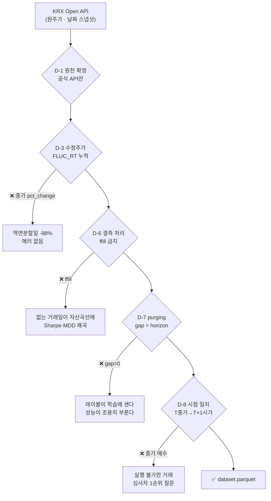

# 요구사항 정의 — AlphaStack 1차 프로젝트

> **이 문서가 "무엇을 만드나"의 정본입니다.** [문제정의](../../문제정의/version1.0/문제정의.md)가 "왜"라면 여기는 "무엇".
> 근거는 [시장조사](../../시장조사/version1.0/시장조사.md), 미결은 [회의안건](../../회의안건.md)에 있습니다.
>
> 작성 2026-08-26 · 기능 29건 · 우선순위는 MoSCoW

---

## 0. 읽는 법

| 표시 | 뜻 |
|---|---|
| **Must** | 2주 안에 반드시 끝낸다. 이게 안 되면 발표가 성립하지 않는다 |
| **Should** | 있으면 프로젝트가 확실히 좋아진다. 필수가 닫힌 뒤 착수 |
| **Could** | 여유가 있으면. **9/8 중간 점검에서 한 번만** 채택 여부를 정한다 |
| **Won't** | **1차에서 하지 않는다.** 안 하는 이유를 적는 것이 범위를 선명하게 만든다 |

**수용 기준(acceptance)은 전부 검증 가능해야 합니다.** "잘 동작한다"는 기준이 아닙니다.

### 이미 있는 것은 "만들 것"에 넣지 않았습니다

| 이미 서 있는 것 | 규모 |
|---|---|
| `evaluation/` (walk_forward · metrics · baseline) | 478줄 + 테스트 20개 |
| `ingest/clients/` 수집 클라이언트 | 9종 3,978줄 |
| `ingest/store/` 저장 계층 | 1,612줄 (+ 이번 `krx_index.py`) |
| `timeseries/` ARIMA·ADF·ACF/PACF | 2,063줄 |

---

## 1. Must — 18건

### 1.1 데이터 (`ingest/`)

| ID | 기능 | 수용 기준 |
|---|---|---|
| **F-01** | KOSPI200 지수 일별시세 백필 | 최초 행 == `2010-01-04`, 최종 행 == 직전 영업일. 임의 20영업일을 KRX 공식 화면 종가와 대조해 일치. `20091230` 조회가 0행임을 로그로 남겨 경계를 문서화 |
| **F-02** | 데이터 스냅샷 박제 + SHA-256 고정 | `data/snapshots/kospi200_YYYYMMDD.parquet` 과 `snapshot_meta.json`(행 수·시작·종료·SHA-256·수집 시각 KST). **다른 날 두 번 돌려도 두 산출 JSON의 스냅샷 해시가 같다** |
| **F-03** | 거래일 캘린더 정렬 · 결측/이상치 게이트 | `scripts/check_data.py` 실행 시 `reports/data_quality.json` 생성. 누락 거래일이 0건이거나, 아니면 **그 날짜가 전부 열거된다.** 검사 실패 시 `exit 1` |

> ⚠️ **F-03이 왜 Must인가.** 계획서는 "결측·이상치 리포트가 나온다"를 완료 기준으로 적었지만
> **리포트의 항목이 정의돼 있지 않았습니다.** 아래 §4에서 항목을 못 박습니다.

### 1.2 검증 엔진 (`evaluation/`) ★ 이 프로젝트의 척추

| ID | 기능 | 수용 기준 |
|---|---|---|
| **F-04** | 개발 / **봉인 홀드아웃** 분리 로더 | 홀드아웃을 `--unseal` 없이 요청하면 `SealedRangeError`. 최종 시점에 `unseal.log` 행 수 **== 1**. 사전등록 커밋 시각이 그 행보다 앞섬을 `git log`로 대조 |
| **F-05** | **사전등록 ADR** (귀무가설·주 지표·기각 임계·결론 문장) | 파일이 존재하고 커밋 시각이 `unseal.log` 첫 행보다 **앞선다**. 결론 문장 2종이 자리만 비운 완성 문장. 최종 리포트의 결론이 이 템플릿과 **문자열 수준으로 일치** |
| **F-09** | `walk_forward` **gap 잠금** — 기본값을 horizon으로 | gap 미지정 호출이 `gap==horizon`으로 동작. `gap=0`은 `LeakageError`를 던지고 `allow_leakage=True`일 때만 통과. **기존 테스트 20개가 그대로 통과** |
| **F-10** | 정확도 **스칼라 API 폐기** — CI·표본수·PT p값 묶음 반환 | 정확도를 스칼라로 반환하는 공개 함수가 **하나도 없다**(grep 확인). PT 검정이 "항상 상승" 퇴화 예측기에 p>0.5를 반환. Wilson CI가 N=250·p=0.55에서 알려진 값과 일치 |
| **F-11** | 거래비용 **프리셋 함수 + 민감도 표** | `reports/cost_sensitivity.csv` 4행. 각 행에 (왕복비용, **내역 분해 문자열**, 연율 초과수익, Sharpe, MDD, Turnover). 손익분기 왕복비용이 소수점 2자리 단일 숫자로 인쇄 |
| **F-13** | **시도 횟수 계측기** (`trials.jsonl`) + 우연 최고 정확도 | `trials.jsonl` 행 수 == `fit` 호출 수(누락 0건). 성능표 렌더러가 [기준선 3종·Wilson CI·표본수·N·E[max]] 중 **하나라도 비면 예외를 던져 HTML을 만들지 않는다** |
| **F-16** | 봉인 홀드아웃 **1회 개봉** + 주 검정 | `reports/holdout_run.json`에 (p값·연율 초과수익·Sharpe·MDD·Turnover·PT p·n_days·n_eff·mde_pp·커밋 해시·스냅샷 SHA-256). `unseal.log` 행 수 == 1 |

> 🔴 **F-10이 가장 논쟁적일 겁니다.** "정확도를 반환하는 함수를 없앤다"는 강한 조치인데,
> 근거가 있습니다 — 정확도를 스칼라로 돌려주는 API가 남아 있으면 **누군가는 반드시
> 그 숫자만 발표 표에 씁니다.** 기준선 52.72%(KRX 실측) 위 2.3%p가 아무 말도 아니라는 것을
> 코드가 강제하게 만듭니다.

### 1.3 피처·레이블 (`features/`)

| ID | 기능 | 수용 기준 |
|---|---|---|
| **F-06** | 기술적 지표 세트 (numpy 직접 구현) | 지표마다 ① 손계산 가능한 **10행짜리** 단위 테스트 통과 ② **shift 검사** — 마지막 행 계산 시 t+1 이후 데이터를 넣었다 빼도 값이 불변. 워밍업 NaN이 학습 인덱스에서 제외됨을 테스트 |
| **F-07** | 레이블 생성기 — 시가→시가 5거래일 **±1.0% 3분류** | 클래스 분포가 리포트에 인쇄되고 **세 클래스 모두 15~45%**. 마지막 5행이 NaN(미래 미확정)으로 남고 제외됨을 테스트. config의 horizon을 5→10으로 바꾸면 **gap이 따라 움직인다** |
| **F-08** | 학습용 데이터셋 스키마 | `dataset.parquet` 생성. 행 수 == 거래일 수, `trade_date` 오름차순 유일값, `split_tag` 값이 `dev`/`holdout` 둘뿐, **dev 최대 날짜 < holdout 최소 날짜** |

### 1.4 모델 (`models/`)

| ID | 기능 | 수용 기준 |
|---|---|---|
| **F-12** | **신호→포지션 변환 규칙** | `positions` 유일값이 `{0, 1}`뿐임을 테스트. θ를 **폴드 검증 구간 데이터로 조정하려는 호출이 예외**를 던짐을 테스트. 회전율이 폴드별로 인쇄 |
| **F-14** | 로지스틱 베이스라인 + **기준선 3종 동반 강제** | `baseline_run.json`에 폴드별 (정확도+CI, PT p, ΔSharpe, MDD, Turnover)와 **기준선 3종의 같은 지표**가 함께. 기준선 열을 뺀 채 렌더러를 부르면 **예외** |
| **F-15** | 모델 4종 동일 조건 비교 | `model_comparison.csv` (모델 4종 × 폴드 × 6지표). 4종이 **같은 dataset SHA-256·같은 split 인덱스·같은 시드**를 썼음이 각 행 메타로 확인. 각 `fit`이 `trials.jsonl`에 기록 |

> ⚠️ **F-12가 계획서에 없던 항목입니다.** 목표 ①은 분류(방향 예측)인데 산출물 ②는
> 수익률 지표(MDD·Sharpe·CAGR)입니다. **그 사이를 잇는 규칙이 계획서 어디에도 없었습니다.**
> 더 나쁜 것은, 이 규칙을 나중에 고르면 **그 선택 자체가 성과를 결정한다**는 점입니다 —
> 룩어헤드를 차별점으로 내세운 계획서가 사후 최적화 통로를 열어 두고 있었습니다.

### 1.5 리포트·파이프라인

| ID | 기능 | 수용 기준 |
|---|---|---|
| **F-17** | **정적 HTML** 성과 리포트 5화면 | 브라우저로 열면 **외부 네트워크 요청 없이** 5화면 렌더. 결과 JSON을 지우면 "데이터 없음"을 표시하고 **빈 그래프를 그리지 않는다.** MDD가 **일별 종가 기준** 자산곡선에서 계산됨을 코드와 README에 명시 |
| **F-18** | 단일 명령 재현 파이프라인 + 실행 스탬프 | `make reproduce`가 `exit 0`, 두 실행의 주 지표가 **소수점 6자리까지 일치.** 라이브러리 버전이 핀과 다르면 **시작 전에** 중단하고 무엇을 설치해야 하는지 출력 |

**5화면**: ① 자산곡선 + 벤치마크 ② 폴드별 성능 분산 ③ MDD·Top-10 drawdown ④ 모델 비교표 ⑤ **거래비용 민감도**

> ⑤가 우리 고유입니다. 국내 도구들이 공통으로 내놓는 것은 ①~④까지입니다.

---

## 2. Should — 5건

| ID | 기능 | 왜 |
|---|---|---|
| **F-19** | **누수 시연** — K-fold vs gap=0 vs gap=5 비교표 | 우리가 막았다는 것을 **숫자로** 보인다. 발표 슬라이드에 그대로 실린다 |
| **F-20** | **음성 대조군 하네스** — 검증기 거짓 양성률 측정 | 정답을 아는 가짜 데이터로 **우리 검증기 자신을 시험**한다. 국내 5종·해외 7종 어디도 이 숫자를 공개하지 않는다. 10% 초과 시 어디가 새는지 분해해 보고한다(**숨기지 않는다**) |
| **F-21** | 지표 기여도 — permutation importance | 계획서에 **빠져 있던 항목.** LightGBM·XGBoost는 공짜로 나온다. 이게 있어야 이력서에 쓸 문장이 생긴다 |
| **F-22** | 발표 도입용 **지표 불일치 화면** | 실제 데이터에서 뽑은 불일치 날짜 3건 이상. **하드코딩 금지** — 스크립트가 재검증 |
| **F-23** | `include_delisted` 조회 경로 개방 | 회의안건 A-3과 코드가 **정반대**다. 부분 유니크 인덱스 때문에 붙은 필터라 지우지 말고 별도 경로를 연다 |

---

## 3. Could / Won't

### Could — 9/8 중간 점검에서 한 번만 결정

| ID | 기능 | 판단 기준 |
|---|---|---|
| **F-24** | Deflated Sharpe Ratio | 문헌 예시 입력에서 알려진 값과 소수점 3자리 일치. numpy로 구현 가능 |
| **F-25** | 딥러닝(LSTM/GRU) 동일 조건 비교 | **목표변수는 방향 분류를 유지한다.** 가격 회귀로 가는 순간 모든 함정에 들어간다. Colab Pro, 로컬 `.ipynb`가 정본 |
| **F-26** | 삼중배리어 레이블링 | 고정기간 라벨을 먼저 닫은 뒤. `label_def` 열로 구분해 나란히 싣고 시도 횟수 N이 그만큼 는다 |
| **F-30** | **시장 균열 스코어** (팀원 제안) | 조사 완료 — **조건부 채택(목적 변경)**. 방향 기여 ≈ 0, 크기 기여 상대 +15%. **채택 범위는 제안자와 상의 후 확정** → §6 |

### Won't — 1차에서 하지 않습니다

| ID | 안 하는 것 | 이유 |
|---|---|---|
| **F-27** | 인터랙티브 예측 신호 대시보드 | `api/`가 빈 `__init__.py` 하나다. 부록 D의 "엔드포인트 51개·화면 10개"는 **팀장 개인 원본 수치**다. F-17(정적 HTML)로 대체하고 2차 확장 후보로 |
| **F-28** | 뉴스·공시 감성 피처 (선택 ⑦) | 공시 시점 정합을 룩어헤드 없이 2주에 붙이는 것은 새 함정을 여는 일. **우리 프레이밍이 정확히 그 지점에서 무너진다** |
| **F-29** | 350종목 횡단면 랭킹 (선택 ⑧) | 현 `walk_forward`가 평탄 인덱스 기반이라 **같은 거래일이 학습·검증으로 쪼개진다.** 그룹 인식형으로 고치기 전에는 켜지 않는다 → 3차 |

---

## 4. 데이터 요구사항 ★ 수집·전처리 담당이 읽을 곳

> 이 절이 이번 세션의 다음 작업입니다. 12개 항목 전부 **어기면 에러가 안 나는** 것들입니다.

### 4.1 원천과 편향

| # | 요구 | 왜 |
|---|---|---|
| **D-1** | KOSPI200 지수를 **KRX Open API 공식 엔드포인트**로 받는다. pykrx·FinanceDataReader를 정본 경로로 쓰지 않는다 | KRX가 2025-12-27 회원제 전환으로 로그인을 필수화해 **pykrx가 실제로 깨졌다**(이슈 #244). 지금 pykrx로 받으려면 KRX 비밀번호를 환경변수에 넣어야 하는데, PUBLIC 저장소를 4명이 쓰는 구성에서 부담이 다르다 |
| **D-2** | 지수는 유니버스를 구성하지 않아 **생존 편향이 발생하지 않는다**는 사실과, 대신 **지수 구성종목 변경 편향**이 남고 **그 크기를 잴 수조차 없다**는 사실을 **둘 다** 명시한다 | 한쪽만 적으면 심사에서 걸린다. KRX Open API에 구성종목 이력이 없다 |
| **D-3** | 수익률을 **종가 `pct_change`로 계산하지 않는다.** `FLUC_RT` 누적으로 만든다 | 실측: 005930 2018-04-27 2,650,000원 → 05-04 51,900원, 단순 비교 **−98.04%**. `FLUC_RT` 누적은 −1.15%로 50:1 보정값 −1.16%와 **0.01%p 이내 일치**. 지수엔 분할이 없지만 규칙을 먼저 박아야 확장 때 안 깨진다. ⚠️ 이건 **가격수익률**이라 배당 미반영(KOSPI 배당수익률 0.83%) |

### 4.2 실행 가능성

| # | 요구 | 왜 |
|---|---|---|
| **D-4** | `volume == 0` 또는 `open == 0` 행에서는 **어떤 주문도 체결시키지 않는다.** 포지션은 유지하되 진입·청산을 다음 거래 가능일로 미룬다 | KRX는 거래정지 기간에도 **종가만 직전값으로 채운 행**을 준다. 보합 거래일로 읽으면 백테스트가 정지 중에 매매한다 |
| **D-5** | 등락률 **+29.5% 이상 AND `close == high`** 면 신규 매수 금지. **−29.5% 이하 AND `close == low`** 면 신규 매도 금지 | 기준가×1.30을 호가단위로 절사하므로 실제 등락률이 **29.8x%**다. **정확한 30% 비교를 쓰면 필터에 안 걸린다** |
| **D-8** | **T일 종가 정보 → T+1일 시가 체결 → T+6일 시가 평가.** 레이블도 시가→시가. 배열 인덱스가 아니라 **날짜로 조인**하고 인덱스 기반 shift를 금지 | "종가에 사서 다음 종가에 판다"는 실행 불가. 시가 단일가(08:30~09:00 접수)는 개인도 가능한 **유일한 형태** |

### 4.3 누수

| # | 요구 | 왜 |
|---|---|---|
| **D-6** | 없는 거래일을 **`ffill`로 만들어 내지 않는다.** 결측을 (a)거래일 누락 (b)값 NaN (c)워밍업 셋으로 **구분**해 각각 다르게 처리. **조용히 버리는 경로를 만들지 않는다** | `ffill`이면 존재하지 않는 거래일이 자산곡선에 들어가 Sharpe·MDD가 왜곡된다. 워밍업 NaN을 0으로 채우면 초기 폴드가 망가진다 |
| **D-7** | **gap = horizon = 5**를 강제. 모든 피처는 t까지의 데이터만 쓰고 **shift 검사**로 자동 확인. **스케일러를 학습 구간 안에서만 fit** | 현재 `walk_forward`의 gap 기본값이 **0**이다. 스케일러를 분할 전에 fit하는 것이 금융 누수의 가장 흔한 경로이고, **금융 데이터는 누수가 있어도 성능이 극적으로 튀지 않아 탐지되지 않는다** |
| **D-9** | 개발 `2010-01-04~2021-08-31` / **봉인 홀드아웃** `2021-09-01~`. `split_tag`로 고정하고 겹치지 않음을 테스트 | 워크포워드는 **선택용**, 홀드아웃은 **보고용**. 같은 폴드에서 모델·하이퍼파라미터·임계값을 반복 선택하면 폴드 과적합이 생긴다 |

> 📌 **용어**: 우리 `gap`은 **purging**이고 **embargo가 아닙니다.** embargo는 학습이 검증보다
> 뒤에 오는 배치(CPCV 등)에서만 생깁니다. [회의안건 A-2](../../회의안건.md)의 "gap=5" 표현을
> `gap(=purging)`으로 고쳐야 합니다.

### 4.4 비용·운영

| # | 요구 | 왜 |
|---|---|---|
| **D-10** | 증권거래세를 **날짜 함수**로. 코스피 실효세율 `~2019-05-29` 0.30% / `2019-05-30~` 0.25% / `2021~` 0.23% / `2023~` 0.20% / `2024~` 0.18% / `2025~` **0.15%** / `2026-01-01~` **0.20%**. ETF는 매도 거래세 **면제** | 백테스트가 2010년부터 뻗는데 상수로 두면 과거가 틀린다. **2025년 한 해만 본세가 0%**였다 |
| **D-11** | 팀원 전원이 **8월 안에** KRX 인증키를 각자 신청·승인받고 **서비스별 이용신청까지** 마친다. 백필 스크립트에 **콜 카운터**를 둔다 | 발급과 이용신청이 **별개 2단계**이고 승인이 보통 익일이다. 9/1에 신청하면 그날 아무도 데이터를 못 받는다. 약관 제7조⑤ 양도 금지 · 제8조④ 1일 10,000회 |
| **D-12** | 수집한 시세를 **PUBLIC 저장소에 커밋하지 않는다.** `.gitignore`를 코드보다 **먼저** 박는다. Colab 반출은 **파생 parquet만**, `data/interim/colab/`에 SHA-256과 함께 | 약관 제11조②가 제3자 제공을 금지하고 ④는 위반 시 **이용승인 철회**를 규정한다 |

---

## 5. 비기능 요구사항

| 항목 | 요구 | 측정 |
|---|---|---|
| **비용** | 유료 LLM API **0원**. 매매 신호 경로에 생성형 LLM 없음 | 유료 API 클라이언트 호출 0건을 grep으로 확인 |
| **실행처** | 학습·검정·리포트는 **로컬 22코어**. Colab Pro는 F-25 채택 시에만 | LightGBM 배포판이 GPU 빌드가 아님이 실측 확정. **Colab에 올리면 코어가 줄어 느려진다** |
| **소요 시간** | `make reproduce` 전체가 **30분 이내**. 음성 대조군 100회는 별도 30분 | `reports/timing.json`. 넘으면 폴드 수를 줄이고 **줄인 사실과 이유를 ADR에** |
| **재현성** | 동일 커밋·시드·스냅샷으로 2회 실행 시 주 지표 **소수점 6자리 일치** | `make reproduce`가 2회 실행 후 diff, 불일치 시 `exit 1`. **발표장에서 그 자리에서 실행해 보인다** |
| **약관 준수** | 시세·`.env`·커넥션 문자열 커밋 금지. 리포트에 **"한국거래소 통계정보"** 표기 | `.gitignore` 선행 + push 전 `git status --short` |
| **코드 품질** | 새 코드 `ruff` **0건**. 이관 부채 35건은 **별도 커밋**으로 | 기능 커밋과 섞지 않는다 |
| **테스트** | 기존 20개 계속 통과. F-04·F-06·F-09·F-10·F-12·F-13은 **테스트 없이 병합하지 않는다** | 교차 검수자가 acceptance의 테스트가 실재하는지 확인 |
| **설명 책임** | 자기 기능을 **5분 안에 설명**할 수 있어야 한다 | 교차 검수자가 "이 함수가 왜 이 값을 쓰는가"를 묻고 답 없으면 승인 안 함 |
| **문서 정직성** | 실측 아닌 수치를 실측이라 적지 않는다 | 리포트 `assumptions` 블록에 (슬리피지=미실측, 기준선 52.72%=KRX 원자료 실측 N=4,097, MDE=백필 후 재계산) 명시 |

---

## 6. 팀원 제안 — 시장 균열 스코어 (F-30)

> **상태: 조사 완료 · 채택 범위 미정 — 제안한 팀원과 상의해 정합니다.**
> 조사 2026-08-26 · 3각도 문헌 조사 + **우리 데이터로 직접 계산**
>
> 기술적 판정은 **"조건부 채택 — 목적을 바꿔서"** 입니다. 다만 비용이 **2.5~3 인일**이라
> 범위(컴포넌트 5개 전부 / 2개로 축소 / 9-08로 보류)는 사람이 정할 몫입니다.

### 6.0 제안한 팀원에게 먼저 전할 말

> 아이디어 자체가 좋습니다. **기존 지표는 전부 가격 하나에서 나오는데 이건 시장 내부
> 구조라는 다른 정보원을 씁니다** — *"지표를 합치면 예측력이 오르는가"*라는 1차 질문에
> 정확히 맞는 형태입니다. 그래서 **문헌만 보지 않고 우리 데이터로 직접 재 봤습니다.**
>
> 결과가 둘로 갈렸습니다.
>
> - **방향 예측** — 기여가 사실상 0이고, 게다가 **부호가 예상과 반대**입니다.
>   괴리가 큰 날 뒤가 오히려 더 올랐습니다(+2.04% vs 전체 +0.28%).
>   문헌도 같은 방향이고, 거래량 축은 **최상위 저널 두 편이 반대 부호**를 보고합니다.
> - **크기(변동성) 예측** — 여기는 **실제로 기여합니다**(상대 +15%).
>   우리 레이블이 ±1% 3분류라 **중립 밴드가 37%**를 차지하니, 이건 실제로 채점되는 부분입니다.
>
> **그래서 버리자는 게 아니라 목적을 바꿔 넣자는 제안입니다.** 그리고 이건 발표에서
> *"통념을 우리 데이터로 검정해 기각했다"*는 유일한 사례가 됩니다 — 흔한 프로젝트에는
> 없는 대목입니다.
>
> **물어볼 것**: 위 결과를 보고도 방향 축을 살려 두고 싶은지, 아니면 크기 축으로
> 재배치하는 데 동의하는지. 그리고 컴포넌트 5개 중 몇 개까지 갈 것인지(§6.7 비용 참조).

**제안 내용**: 지수 가격은 오르는데 상승 종목 수는 줄어들거나, 가격은 오르는데 거래량이
빠지는 **내부 괴리**를 점수화한 피처.

### 6.1 결론 한 줄

> **방향 예측은 기각. 크기(변동성) 예측은 채택.**

우리 데이터(KOSPI200 3,063 유효표본)로 직접 잰 결과입니다.

| 타깃 | 폭 피처의 증분 | 판정 |
|---|---|---|
| **방향** (3분류) | ΔR² ≈ **1e-5** | 🔴 사실상 0 |
| **크기** (\|수익률\|) | R² 0.1792 → **0.2053** (ΔR² **+0.026**, 상대 **+15%**) | 🟢 실질적 |

겉보기 상관(+0.048)은 **폭이 아니라 그 안에 든 모멘텀 성분**이었습니다.
모멘텀을 통제하면 방향 상관이 **−0.0061**(0)로 죽고, 크기 상관은 **−0.169**로 남습니다 — **28배 차이**입니다.

### 6.2 🔴 부호가 팀원 가설과 반대입니다

*"괴리가 커지는 구간이 조정 직전"*이라는 통념을 우리 데이터로 검정했습니다.

| | 괴리 상위 5% (154일) | 전체 |
|---|---|---|
| 이후 5일 평균수익 | **+2.04%** | +0.28% |
| 승률 | **65.6%** | 55.0% |
| 하위 20분위 손실 | −1.58% | −1.57% |

**괴리 뒤가 오히려 좋았습니다.** 하방 꼬리도 두꺼워지지 않았습니다.

문헌도 같은 방향입니다.

| 근거 | 내용 |
|---|---|
| Fang·Qin·Jacobsen (2014) *JBEF* | 시장 폭 지표 **93개**를 검정 — *"little evidence that they predict stock market returns"* |
| Potomac (S&P500 1968~) | 약세 다이버전스 1,726건 중앙값 **+1.14%**, 승률 58.5% — **플러스** |
| Bespoke | 극단적 괴리 12일 이후 1년 **+9.84%**, 80% 플러스 |
| CXO Advisory | McClellan **R² < 0.01**. 매도 신호 후 수익이 매수 신호 후보다 **높음** |
| SentimenTrader (업계 1위 벤더) | *"divergences are among the least consistent"* — **자사 인정** |
| Chen·Hong·Stein (2001) *JFE* | 크래시를 예고하는 건 거래량 **감소가 아니라 추세 대비 증가** ← **부호 반대** |
| Gervais et al. (2001) *JF* | 고거래량 수익 **프리미엄** — 거래량 많으면 이후 오름 ← **부호 반대** |
| OBV | 동료심사 검정 문헌을 **찾지 못함**. 검정된 게 아니라 전승된 통념 |

> ⚠️ 특히 **거래량 축은 최상위 저널 두 편이 반대 부호**를 보고합니다.
> 이걸 모르고 넣으면 발표에서 그대로 찔립니다.

### 6.3 그런데 이게 왜 좋은 결과인가

1차의 질문이 *"지표를 합치면 예측력이 오르는가"*입니다.
**"이 지표는 방향에 안 오른다"는 답도 답입니다.** 그리고 우리는 그걸
**남의 말이 아니라 우리 데이터로** 보일 수 있습니다.

게다가 **크기 예측에는 실제로 기여**합니다. 우리 레이블이 ±1% 3분류라
**중립 밴드가 37.0%**를 차지하므로, "밴드를 벗어날 것인가"는 그냥 부수적 관심이
아니라 **실제로 채점되는 부분**입니다.

> 📌 CXO Advisory가 RSP/SPY에 대해 낸 결론과 정확히 같습니다 —
> *"수익률 예측력은 없으나 큰 하락은 변동성 상승을 예고할 수 있다."*

### 6.4 🔴 조사가 찾아낸 가장 비싼 것 — 라벨 정렬이 상관을 **10배** 부풀린다

이게 이번 조사의 진짜 수확입니다.

| 라벨 | corr(폭, 라벨) |
|---|---|
| `open(t)` → `open(t+5)` (오염) | **+0.1709** |
| `open(t+1)` → `open(t+6)` (정상) | **+0.0171** |

**정확히 10.0배**입니다. 원인은 `open(t)`→ 라벨에 **t일 장중 수익률이 들어 있어서**입니다
(당일 종가수익률과 오염 라벨의 상관 +0.272 vs 정상 라벨 −0.041).

> 이 한 줄을 틀리면 **"기술적 지표가 놀랍도록 잘 맞는다"**가 나오고,
> 프로젝트 논지가 통째로 무너집니다. 그리고 **에러는 나지 않습니다.**
>
> 👉 이건 [F-19 누수 시연](요구사항.md)의 재료로 그대로 씁니다.

### 6.5 채택 조건 셋

1. 레이블을 **`open(t+1)` → `open(t+6)`**으로 못 박는다
2. 이 피처군의 **사전등록 목적을 "방향 예측"이 아니라 "중립 밴드 이탈(\|수익률\|>1%) 판별"로** 재배치한다. 방향 기여는 **"기각 대상 통념의 검정"**으로만 보고한다
3. 컴포넌트를 **5개로 고정**하고 파라미터 탐색 예산을 사전에 적는다 (룩백 `{20}` 하나. 5일·60일 변형을 시도하지 않는다)

### 6.6 컴포넌트 5개

| 이름 | 무엇을 잡나 |
|---|---|
| `breadth_rana_ma20_z` | 폭 **수준** 자체. `(A−D)/(A+D)`의 20일 이동평균을 expanding z |
| `breadth_div_20` | **팀원의 괴리 축.** `z(20일 지수수익) − z(20일 폭)` |
| `volume_div_20` | 거래량 축. 지수 회전율 `log(value/market_cap)` 기반 |
| `breadth_cap_eq_gap_z` | **등가중 − 시총가중 상승비율.** 삼성전자+SK하이닉스 쏠림을 잡는다 |
| `inactive_ratio_z` | 보합 비율 = 유동성 고갈 대리변수 |

> ⭐ `breadth_cap_eq_gap_z`가 **우리 데이터로만 만들 수 있는 축**입니다.
> KOSPI200은 개별 종목 비중 상한이 없어(30% CAP은 2019-06 도입 → 2020-04 폐지)
> 쏠림이 실제로 큽니다. 팀원 아이디어를 *"기존 지표의 재발명"*이 아니라
> **독자 피처**로 만들어 주는 유일한 축입니다.

### 6.7 ⏱️ 비용 — 이게 결정 지점입니다

**2.5~3 인일**로 추정합니다.

| | |
|---|---|
| 현재 확정 인원 1명 기준 | 전체 예산의 **25~30%** |
| 팀원 3명 합류 시 (40인일) | **7%** — 감당 가능 |

> 🔴 **합류가 늦어지면 이 피처군이 모델링·평가·발표자료를 밀어냅니다.**

**자를 때의 순서** (2주가 빡빡해지면)

1. `inactive_ratio_z` 폐기 (기여 근거 가장 약하고 표류 위험 최대)
2. `volume_div_20` 폐기 (문헌 부호가 반대이고 실측 증분 ΔR² +0.0002)
3. **절대 자르면 안 되는 것: 누수 테스트 7종** — 피처를 다 버려도 이건 남깁니다.
   **라벨 정렬 하나만 잡아도 10배짜리 오류를 막습니다**

### 6.8 미리 못 박는 성공 기준

- **주 타깃** — 밴드 이탈 이진. OOS ROC-AUC가 baseline 대비 **+0.010 이상**이고 블록 부트스트랩 95% CI 하한이 0을 넘으면 "기여 있음"
- **부 타깃** — 3분류 방향. 균형정확도 **+1.0%p 이상**. ⚠️ **통과하지 못하는 것이 기본 시나리오**입니다
- 🚨 **+0.05 AUC나 +5%p처럼 크게 나오면 성공이 아니라 누수 경보**로 취급하고 누수 테스트 7종을 전부 재실행한 뒤에만 보고합니다

> ⚠️ **위 실측치는 전부 인샘플·선형·전체구간 회귀입니다.** 아웃오브샘플 증분은
> 이보다 작을 것으로 보는 게 정직합니다. 모멘텀 통제 잔차(−0.169)도 전체구간
> 회귀라 미세한 누수가 있어 **expanding으로 다시 재야 합니다.**
> 다중검정 보정도 하지 않았습니다.

### 6.9 F-29(350종목 횡단면)와 무엇이 다른가

F-30은 개별종목을 **집계해서 지수 피처 한 줄로** 만듭니다. `walk_forward`의
**그룹 인식 문제를 건드리지 않습니다.** 횡단면 랭킹과는 다른 작업입니다.

---

## 7. 리스크

| 리스크 | 영향 | 대응 |
|---|---|---|
| **`features/`·`models/` 담당 미정** ([C-3](../../회의안건.md)) | **필수범위 ①②의 전부**가 무주공산 | 계획서에 "**팀장이 겸임하다 합류 시 이관**"으로 명시. 심사자에게 심장이 비어 보이면 안 된다 |
| 팀원 3명 미확정 | 2주 일정이 1인 기준이 된다 | Must 18건이 4명 기준. 인원이 적으면 Should를 전부 내린다 |
| KRX 인증키 발급 지연 | 킥오프 첫날 아무도 데이터를 못 받는다 | [합류 전 준비물](../../합류전-준비물.md) 배포. **8월 안에** 신청 |
| **KRX API 간헐적 401** | 백필이 도중에 멈춘다 | 실측 2026-08-26: 재시도 없으면 깜빡임 하나가 남은 3,000일을 전멸시킨다. **재시도 + 멱등 재개**를 구현했다 |
| 홀드아웃이 "기각 실패"로 나온다 | 발표 결론이 빈다 | **두 시나리오 슬라이드를 미리 만든다.** 결론 문장은 이미 커밋돼 있다 |
| 대시보드 일정 병목 | 발표 이틀 전 시연물 없음 | 인터랙티브를 Won't로 내리고 **정적 HTML**로 낮췄다 |
| 시도 횟수가 45개를 넘는다 | MinBTL 기준 통계적으로 무효 | `trials.jsonl`이 자동으로 센다. 넘으면 **그 사실을 리포트에 적는다** |

---

## 8. 아직 사람이 정해야 하는 것

> 조사로 답이 나온 것은 여기 없습니다. **진짜로 결정이 필요한 것만** 남겼습니다.

| # | 질문 | 조사의 권고 |
|---|---|---|
| 1 | 팀 Supabase를 팔 것인가 | **1차는 parquet 스냅샷 + 로컬 SQLite만.** DB 결정을 2차로 미룬다 |
| 2 | `features/`·`models/` 담당 | 팀장 겸임을 **계획서에 문장으로 박는다** |
| 3 | 확장창 vs 롤링창, 폴드 수 | 개발 구간에서 **둘 다 돌려 보고**, 홀드아웃에 쓸 하나를 **사전등록 시점에 고정** |
| 4 | 포지션 임계 θ 기본값·조정 범위 | θ 고정(0.55/0.50)으로 시작해 **시도 횟수 N을 최소화**. 9/8에 전환 여부 결정 |
| 5 | 딥러닝(F-25) 채택 여부 | 9/8 중간 점검에서 필수가 닫혔는지 보고 결정 |
| 6 | **강사의 실제 평가 기준·배점·발표 시간** | **킥오프 전에 짧게 질의한다.** "모호하다"의 원문도 함께 |
| 7 | 홀드아웃이 기각 실패면 발표를 어떻게 | **두 벌을 미리 만든다** |
| 8 | 이관 부채 정리 시점 | **손대는 파일만** 정리하고 나머지는 2·3차 자산으로 둔다 |
