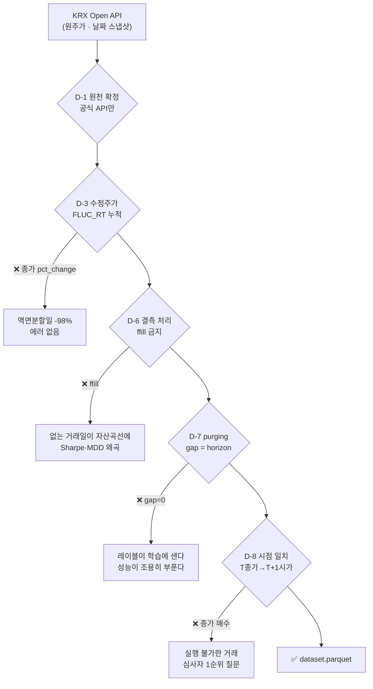

# 요구사항 정의 — AlphaStack 1차 프로젝트 (v2.0)

> **이 문서가 "무엇을 만드나"의 정본입니다.** [문제정의](../../문제정의/version2.0/문제정의.md)가
> "왜"라면 여기는 "무엇". 근거는 [시장조사](../../시장조사/version2.0/시장조사.md)·[조사/](../../조사/),
> 미결은 [회의안건](../../회의안건/2026-09-01-킥오프.md)에 있습니다.
>
> v2.0 · 2026-08-27 · **1차 = Must 18건** · 이전 판 [v1.0](../version1.0/요구사항.md) · [변경사항](변경사항.md)

---

## 0. 읽는 법

**v2.0 에서 범위를 다시 그었습니다.** v1.0 은 기능 29건을 MoSCoW 로 늘어놓았는데,
2주에 다 못 합니다. **1차는 Must 18건이고 나머지는 [§2](#2-2차3차로-미룬-것) 로 내렸습니다.**

**수용 기준(acceptance)은 전부 검증 가능해야 합니다.** *"잘 동작한다"* 는 기준이 아닙니다.

### 이미 서 있는 것은 "만들 것"에 넣지 않았습니다

| 이미 서 있는 것 | 규모 |
|---|---|
| `evaluation/` (walk_forward · metrics · baseline) | 572줄 |
| `ingest/` 수집 클라이언트 9종 + 저장 계층 | 7,305줄 |
| `common/` 예산·원문보존·robots·시크릿·거래일 | 2,338줄 |
| `supply/` 공급 정문 (`as_of` 강제) | 228줄 |
| `timeseries/` ARIMA·ADF·ACF/PACF·워크포워드 백테스트 | 2,063줄 |
| **테스트** | **186개** (ruff 33건은 이관 부채) |

⬜ **`features/`(35줄) · `models/`(34줄) 는 아직 빈 껍데기입니다.** 1차의 절반이 여기 있습니다.

> ⚠️ **이 문서의 줄 수는 이 판(v2.0)을 쓰던 시점의 것이고, 일부는 애초에 틀렸습니다.**
> 2026-08-31 재측정 기준으로 아래와 같습니다. 본문을 고치지 않는 것은 이 판이
> *그때 우리가 무엇을 알았는가* 를 기록하기 때문입니다. 최신 값은
> [데이터파트 v2.1 명세서](../../데이터파트/version2.1/명세서.md) 부록 B 를 보세요.
>
> | 이 문서 | 2026-08-31 재측정 | 왜 달라졌나 |
> |---|---|---|
> | `supply/` 228줄 | **591줄** | PR #10 이후 자랐다 |
> | `features/` 35줄 · "빈 껍데기" | **564줄** | 신장환이 지표 3종을 넣었다 |
> | 테스트 186개 | **330개** | |
> | `krx_pg.py` 1,428줄 (236행) | **412줄** | 1,428 은 그 파일 하나가 아니라 Postgres 경로 **세 파일 합계**였다 (`krx_pg` 412 + `krx_bundle` 304 + `common/db` 712). 숫자가 아니라 귀속이 틀렸다 |
> | `common/settings.py` 437줄 (236행) | **497줄** | 그 뒤 늘었다 |

---

## 1. Must — 18건

### 1.1 데이터 (`ingest/`)

| ID | 기능 | 수용 기준 |
|---|---|---|
| **F-01** | KOSPI200 지수 일별시세 백필 | 최초 행 == `2010-01-04`, 최종 행 == 직전 영업일. 임의 20영업일을 KRX 공식 화면 종가와 대조해 일치. `20091230` 조회가 0행임을 로그로 남겨 경계를 문서화 |
| **F-02** | 데이터 스냅샷 박제 + SHA-256 고정 | `data/snapshots/kospi200_YYYYMMDD.parquet` 과 `snapshot_meta.json`(행 수·시작·종료·SHA-256·수집 시각 KST). **다른 날 두 번 돌려도 두 산출 JSON 의 스냅샷 해시가 같다** |
| **F-03** | 거래일 캘린더 정렬 · 결측/이상치 게이트 | 품질검사 실행 시 `reports/data_quality.json` 생성. 누락 거래일이 0건이거나, 아니면 **그 날짜가 전부 열거된다.** 검사 실패 시 `exit 1` |

### 1.2 검증 엔진 (`evaluation/`) ★ 이 프로젝트의 척추

| ID | 기능 | 수용 기준 |
|---|---|---|
| **F-04** | 개발 / **봉인 홀드아웃** 분리 로더 | 홀드아웃을 `--unseal` 없이 요청하면 `SealedRangeError`. 최종 시점에 `unseal.log` 행 수 **== 1**. 사전등록 커밋 시각이 그 행보다 앞섬을 `git log` 로 대조 |
| **F-05** | **사전등록 ADR** (귀무가설·주 지표·기각 임계·결론 문장) | 파일이 존재하고 커밋 시각이 `unseal.log` 첫 행보다 **앞선다**. 결론 문장 2종이 자리만 비운 완성 문장. 최종 리포트의 결론이 이 템플릿과 **문자열 수준으로 일치** |
| **F-09** | `walk_forward` **gap 잠금** — 기본값을 horizon 으로 | gap 미지정 호출이 `gap==horizon` 으로 동작. `gap=0` 은 `LeakageError` 를 던지고 `allow_leakage=True` 일 때만 통과. **기존 테스트가 그대로 통과** |
| **F-10** | 정확도 **스칼라 API 폐기** — CI·표본수·PT p값 묶음 반환 | 정확도를 스칼라로 반환하는 공개 함수가 **하나도 없다**(grep 확인). PT 검정이 "항상 상승" 퇴화 예측기에 p>0.5 를 반환. Wilson CI 가 N=250·p=0.55 에서 알려진 값과 일치 |
| **F-11** | 거래비용 **프리셋 함수 + 민감도 표** | `reports/cost_sensitivity.csv` 4행. 각 행에 (왕복비용, **내역 분해 문자열**, 연율 초과수익, Sharpe, MDD, Turnover). 손익분기 왕복비용이 소수점 2자리 단일 숫자로 인쇄 |
| **F-13** | **시도 횟수 계측기** (`trials.jsonl`) + 우연 최고 정확도 | `trials.jsonl` 행 수 == `fit` 호출 수(누락 0건). 성능표 렌더러가 [기준선·Wilson CI·표본수·N·E[max]] 중 **하나라도 비면 예외를 던져 HTML 을 만들지 않는다** |
| **F-16** | 봉인 홀드아웃 **1회 개봉** + 주 검정 | `reports/holdout_run.json` 에 (p값·연율 초과수익·Sharpe·MDD·Turnover·PT p·n_days·n_eff·mde_pp·커밋 해시·스냅샷 SHA-256). `unseal.log` 행 수 == 1 |

> 🔴 **F-10 이 가장 논쟁적일 겁니다.** *"정확도를 반환하는 함수를 없앤다"* 는 강한 조치인데
> 근거가 있습니다 — 정확도를 스칼라로 돌려주는 API 가 남아 있으면 **누군가는 반드시 그
> 숫자만 발표 표에 씁니다.** 기준선 **52.64%** 위 2.4%p 가 아무 말도 아니라는 것을 코드가
> 강제하게 만듭니다.

### 1.3 피처·레이블 (`features/`)

| ID | 기능 | 수용 기준 |
|---|---|---|
| **F-06** | 기술적 지표 세트 (numpy 직접 구현) | 지표마다 ① 손계산 가능한 **10행짜리** 단위 테스트 통과 ② **shift 검사** — 마지막 행 계산 시 t+1 이후 데이터를 넣었다 빼도 값이 불변. 워밍업 NaN 이 학습 인덱스에서 제외됨을 테스트 |
| **F-07** | 레이블 생성기 — **시가(t+1)→시가(t+6) ±1.0% 3분류** | 클래스 분포가 리포트에 인쇄되고 **세 클래스 모두 15~45%**. 마지막 5행이 NaN(미래 미확정)으로 남고 제외됨을 테스트. config 의 horizon 을 5→10 으로 바꾸면 **gap 이 따라 움직인다** |
| **F-08** | 학습용 데이터셋 스키마 | `dataset.parquet` 생성. 행 수 == 거래일 수, `trade_date` 오름차순 유일값, `split_tag` 값이 `dev`/`holdout` 둘뿐, **dev 최대 날짜 < holdout 최소 날짜** |

> ✅ **F-07 의 클래스 균형은 이미 실측 통과했습니다** — 개발구간에서 상승 34.03% ·
> 중립 38.66% · 하락 27.31%. **임계값을 조정할 이유가 없고**, 따라서 `trials.jsonl` 에
> 조정 1행을 쓰지 않아도 됩니다 → [조사/예측지평 §3](../../조사/예측지평.md)

> ⚠️ **진입은 반드시 `open(t+1)` 입니다.** `open(t)` 으로 잡으면 t일 장중 수익률이 라벨에
> 들어가 **상관이 10배 부풀려집니다**(실측 +0.1709 vs +0.0171). 에러는 나지 않습니다.

### 1.4 모델 (`models/`)

| ID | 기능 | 수용 기준 |
|---|---|---|
| **F-12** | **신호→포지션 변환 규칙** | `positions` 유일값이 `{0, 1}` 뿐임을 테스트. θ를 **폴드 검증 구간 데이터로 조정하려는 호출이 예외**를 던짐을 테스트. 회전율이 폴드별로 인쇄 |
| **F-14** | 로지스틱 베이스라인 + **기준선 동반 강제** | `baseline_run.json` 에 폴드별 (정확도+CI, **F1**, PT p, ΔSharpe, MDD, Turnover)와 **기준선의 같은 지표**가 함께. 기준선 열을 뺀 채 렌더러를 부르면 **예외** |
| **F-15** | 모델 4종 동일 조건 비교 | `model_comparison.csv` (모델 4종 × 폴드 × 7지표). 4종이 **같은 dataset SHA-256·같은 split 인덱스·같은 시드**를 썼음이 각 행 메타로 확인. 각 `fit` 이 `trials.jsonl` 에 기록 |

> ⭐ **기준선 목록에 확률보행과 ARIMA 를 넣습니다** (팀원 제안 채택).
> `always_up` · `majority_class` · `previous_direction` 에 더해, `timeseries/` 에 이미 있는
> **ARIMA 예측의 동기간 방향 적중률**을 같은 표에 싣습니다. *"기존 방법보다 나아졌는가"* 에
> 직접 답하는 칸입니다.

> ⚠️ **F-12 가 계획서에 없던 항목입니다.** 목표는 분류(방향 예측)인데 산출물은 수익률
> 지표(MDD·Sharpe·CAGR)입니다. **그 사이를 잇는 규칙이 계획서 어디에도 없었습니다.**
> 더 나쁜 것은, 이 규칙을 나중에 고르면 **그 선택 자체가 성과를 결정한다**는 점입니다.

### 1.5 리포트·파이프라인

| ID | 기능 | 수용 기준 |
|---|---|---|
| **F-17** | **정적 HTML** 성과 리포트 5화면 | 브라우저로 열면 **외부 네트워크 요청 없이** 5화면 렌더. 결과 JSON 을 지우면 "데이터 없음"을 표시하고 **빈 그래프를 그리지 않는다.** MDD 가 **일별 종가 기준** 자산곡선에서 계산됨을 코드와 README 에 명시 |
| **F-18** | 단일 명령 재현 파이프라인 + 실행 스탬프 | `make reproduce` 가 `exit 0`, 두 실행의 주 지표가 **소수점 6자리까지 일치.** 라이브러리 버전이 핀과 다르면 **시작 전에** 중단하고 무엇을 설치해야 하는지 출력 |

**5화면**: ① 자산곡선 + 벤치마크 ② 폴드별 성능 분산 ③ MDD·Top-10 drawdown
④ 모델 비교표 ⑤ **거래비용 민감도**

> ⑤가 우리 고유입니다. 국내 도구들이 공통으로 내놓는 것은 ①~④까지입니다.

---

## 2. 2차·3차로 미룬 것

> **v2.0 에서 접었습니다.** v1.0 은 Should 5 · Could 4 · Won't 3 을 절 셋으로 나눠 적었는데,
> 1차에서 **전부 안 한다는 점은 같습니다.** 차이는 *언제 다시 볼 것인가* 뿐입니다.

| ID | 무엇 | 언제 | 왜 지금이 아닌가 |
|---|---|---|---|
| **F-19** | 누수 시연 — K-fold vs gap=0 vs gap=5 비교표 | 9/8 재검토 | 있으면 발표가 세진다. **재료는 이미 있다**([라벨 정렬 10배](../../조사/시장균열스코어.md)) |
| **F-20** | 음성 대조군 하네스 — 검증기 거짓 양성률 | 9/8 재검토 | 국내외 어디도 이 숫자를 공개하지 않는다. 다만 100회 실행에 30분 |
| **F-21** | 지표 기여도 — permutation importance | 9/8 재검토 | LightGBM·XGBoost 는 공짜로 나온다 |
| **F-22** | 발표 도입용 지표 불일치 화면 | 9/8 재검토 | 하드코딩 금지라 스크립트가 필요하다 |
| **F-23** | `include_delisted` 조회 경로 개방 | 2차 | 지수 예측에는 안 쓴다. 개별종목으로 갈 때 필요 |
| **F-24** | Deflated Sharpe Ratio | 2차 | 시도 횟수 N 이 충분히 쌓인 뒤에 의미가 있다 |
| **F-25** | 딥러닝(LSTM/GRU) 동일 조건 비교 | 2차 | 기준선이 서기 전에는 비교 대상이 없다. **목표변수는 방향 분류를 유지** |
| **F-26** | 삼중배리어 레이블링 | 2차 | 고정기간 라벨을 먼저 닫은 뒤. 시도 횟수 N 이 그만큼 는다 |
| **F-30** | **시장 균열 스코어** (팀원 제안) | 2차 | 조사 완료 · **방향 기각 / 크기 채택**. 구현이 **2.5~3 인일**이라 모델링을 밀어낸다 → [조사 전문](../../조사/시장균열스코어.md) |
| **F-27** | 인터랙티브 예측 신호 대시보드 | 2차 | `api/` 가 빈 `__init__.py` 하나다. F-17(정적 HTML)로 대체 |
| **F-28** | 뉴스·공시 감성 피처 | 3차 | 공시 시점 정합을 룩어헤드 없이 2주에 붙이면 **우리 프레이밍이 그 지점에서 무너진다** |
| **F-29** | 350종목 횡단면 랭킹 | 3차 | 현 `walk_forward` 는 평탄 인덱스 기반이라 **같은 거래일이 학습·검증으로 쪼개진다** |

> 📌 **미룬 것도 근거를 남겼습니다.** F-30 은 조사 전문이 [docs/조사/](../../조사/)에 있고,
> 거기서 찾은 **라벨 정렬 규칙(F-07)은 1차에 그대로 적용**됩니다.

---

## 3. 데이터 요구사항 ★ 수집·전처리 담당이 읽을 곳

> 12개 항목 전부 **어기면 에러가 안 나는** 것들입니다.

### 3.1 원천과 편향

| # | 요구 | 왜 |
|---|---|---|
| **D-1** | KOSPI200 을 **KRX Open API 공식 엔드포인트**로 받는다. pykrx·FinanceDataReader 를 정본 경로로 쓰지 않는다 | KRX 가 2025-12-27 회원제 전환으로 로그인을 필수화해 **pykrx 가 실제로 깨졌다**(이슈 #244) |
| **D-2** | 지수는 유니버스를 구성하지 않아 **생존 편향이 없다**는 사실과, 대신 **지수 구성종목 변경 편향**이 남고 **그 크기를 잴 수조차 없다**는 사실을 **둘 다** 명시한다 | 한쪽만 적으면 심사에서 걸린다. KRX Open API 에 구성종목 이력이 없다 |
| **D-3** | 수익률을 **종가 `pct_change` 로 계산하지 않는다.** `FLUC_RT` 누적으로 만든다 | 실측: 005930 액면분할 단순 비교 **−98.04%** vs `FLUC_RT` 누적 −1.15%(보정값과 **0.01%p 이내**). ⚠️ 가격수익률이라 **배당 미반영**(KOSPI 배당수익률 0.83%) |

### 3.2 실행 가능성

| # | 요구 | 왜 |
|---|---|---|
| **D-4** | `volume == 0` 또는 `open == 0` 행에서는 **어떤 주문도 체결시키지 않는다.** 포지션은 유지하되 진입·청산을 다음 거래 가능일로 미룬다 | KRX 는 거래정지 기간에도 **종가만 직전값으로 채운 행**을 준다 |
| **D-5** | 등락률 **+29.5% 이상 AND `close == high`** 면 신규 매수 금지. **−29.5% 이하 AND `close == low`** 면 신규 매도 금지 | 기준가×1.30 을 호가단위로 절사하므로 실제 등락률이 **29.8x%** 다. **정확한 30% 비교를 쓰면 필터에 안 걸린다** |
| **D-8** | **T일 종가 정보 → T+1일 시가 체결 → T+6일 시가 평가.** 레이블도 시가→시가. 배열 인덱스가 아니라 **날짜로 조인**하고 인덱스 기반 shift 를 금지 | *"종가에 사서 다음 종가에 판다"* 는 실행 불가. 시가 단일가(08:30~09:00 접수)는 개인도 가능한 **유일한 형태** |

### 3.3 누수

| # | 요구 | 왜 |
|---|---|---|
| **D-6** | 없는 거래일을 **`ffill` 로 만들어 내지 않는다.** 결측을 (a)거래일 누락 (b)값 NaN (c)워밍업 셋으로 **구분**해 각각 다르게 처리. **조용히 버리는 경로를 만들지 않는다** | `ffill` 이면 존재하지 않는 거래일이 자산곡선에 들어가 Sharpe·MDD 가 왜곡된다 |
| **D-7** | **gap = horizon = 5** 를 강제. 모든 피처는 t까지의 데이터만 쓰고 **shift 검사**로 자동 확인. **스케일러를 학습 구간 안에서만 fit** | 스케일러를 분할 전에 fit 하는 것이 금융 누수의 가장 흔한 경로이고, **금융 데이터는 누수가 있어도 성능이 극적으로 튀지 않아 탐지되지 않는다** |
| **D-9** | 개발 `2010-01-04~2021-08-31`(2,880일) / **봉인 홀드아웃** `2021-09-01~`(**1,217일**). `split_tag` 로 고정하고 겹치지 않음을 테스트 | 워크포워드는 **선택용**, 홀드아웃은 **보고용** |

> 📌 **용어**: 우리 `gap` 은 **purging** 이고 **embargo 가 아닙니다.**
> embargo 는 학습이 검증보다 뒤에 오는 배치(CPCV 등)에서만 생깁니다.

### 3.4 비용·운영

| # | 요구 | 왜 |
|---|---|---|
| **D-10** | 증권거래세를 **날짜 함수**로. `~2019-05-29` 0.30% / `2019-05-30~` 0.25% / `2021~` 0.23% / `2023~` 0.20% / `2024~` 0.18% / `2025~` **0.15%** / `2026-01-01~` **0.20%**. ETF 는 매도 거래세 **면제** | 백테스트가 16년이라 상수로 두면 과거가 틀린다. **2025년 한 해만 본세가 0%** 였다 |
| **D-11** | 팀원 전원이 KRX 인증키를 각자 신청·승인받고 **서비스별 이용신청까지** 마친다. 백필 스크립트에 **콜 카운터**를 둔다 | 발급과 이용신청이 **별개 2단계**이고 승인이 보통 익일이다. ✅ **일 10,000회는 약관 제8조 ④ 명문입니다** — 단 **계정이 아니라 키당**이고, 제8조 ① 이 거래소에 재지정 재량을 줍니다 |
| **D-12** | 수집한 시세를 **PUBLIC 저장소에 커밋하지 않는다.** `.gitignore` 를 코드보다 **먼저** 박는다. Colab 반출은 **파생 parquet 만**, SHA-256 과 함께 | 약관 제11조②가 제3자 제공을 금지하고 ④는 위반 시 **이용승인 철회**를 규정한다 |

---

## 4. 비기능 요구사항

| 항목 | 요구 | 측정 |
|---|---|---|
| **비용** | 유료 LLM API **0원**. 매매 신호 경로에 생성형 LLM 없음 | 유료 API 클라이언트 호출 0건을 grep 으로 확인 |
| **실행처** | 학습·검정·리포트는 **로컬 22코어**. Colab Pro 는 딥러닝 채택 시에만 | LightGBM 배포판이 GPU 빌드가 아님이 실측 확정. **Colab 에 올리면 코어가 줄어 느려진다** |
| **소요 시간** | `make reproduce` 전체가 **30분 이내** | `reports/timing.json`. 넘으면 폴드 수를 줄이고 **줄인 사실과 이유를 ADR 에** |
| **재현성** | 동일 커밋·시드·스냅샷으로 2회 실행 시 주 지표 **소수점 6자리 일치** | `make reproduce` 가 2회 실행 후 diff, 불일치 시 `exit 1`. **발표장에서 그 자리에서 실행해 보인다** |
| **약관 준수** | 시세·`.env`·커넥션 문자열 커밋 금지. 리포트에 **"한국거래소 통계정보"** 표기 | `.gitignore` 선행 + push 전 `git status --short` |
| **코드 품질** | 새 코드 `ruff` **0건**. 이관 부채 33건은 **별도 커밋**으로 | 기능 커밋과 섞지 않는다 |
| **테스트** | 기존 **186개** 계속 통과. F-04·F-06·F-09·F-10·F-12·F-13 은 **테스트 없이 병합하지 않는다** | 교차 검수자가 acceptance 의 테스트가 실재하는지 확인 |
| **설명 책임** | 자기 기능을 **5분 안에 설명**할 수 있어야 한다 | 교차 검수자가 *"이 함수가 왜 이 값을 쓰는가"* 를 묻고 답 없으면 승인 안 함 |
| **문서 정직성** | 실측 아닌 수치를 실측이라 적지 않는다 | 리포트 `assumptions` 블록에 (슬리피지=미실측, 기준선 52.64%=KRX 원자료 실측 N=2,880, KRX 한도=약관 명문 10,000/키·일, DART 한도=미확인) 명시 |

---

## 5. 리스크

| 리스크 | 영향 | 대응 |
|---|---|---|
| 🔴 **`features/`·`models/` 가 비어 있다** | 1차의 절반이 미착수 | 담당은 정해졌다(신장환 · 4번째 팀원). **둘이 같은 자리를 만지므로 경계를 킥오프에서 긋는다** |
| 🟡 발표 이틀 전 시연물이 없다 | 발표가 빈다 | 화면을 9/10 에 시작하는 게 늦다. **수집 현황 화면 하나만 먼저** 만들어 둔다 |
| 🟡 홀드아웃이 "기각 실패"로 나온다 | 발표 결론이 빈다 | **두 시나리오 슬라이드를 미리 만든다.** 결론 문장은 이미 커밋돼 있다 |
| 🟡 시도 횟수가 45개를 넘는다 | MinBTL 기준 통계적으로 무효 | `trials.jsonl` 이 자동으로 센다. 넘으면 **그 사실을 리포트에 적는다** |
| 🟡 KRX API 간헐적 401 | 백필이 도중에 멈춘다 | 실측: 재시도 없으면 깜빡임 하나가 남은 3,000일을 전멸시킨다. **재시도 + 멱등 재개**를 구현했다 |

---

## 6. 남은 미결과 정리할 부채

### 사람이 정해야 하는 것

| # | 질문 | 조사의 권고 |
|---|---|---|
| 1 | **팀장** 선정 | — |
| 2 | **화면 스택** (Streamlit / 정적 HTML) | 수집 현황 화면은 정적으로 **원리적으로 불가능**. 데이터 파트만 예외를 제안 |
| 3 | **산업 분류 기준** (KRX 업종 / GICS / 직접 매핑) | 뉴스를 산업 단위로 모으기로 해서 필요 |
| 4 | 확장창 vs 롤링창, 폴드 수 | 개발 구간에서 **둘 다 돌려 보고** 홀드아웃에 쓸 하나를 사전등록 시점에 고정 |
| 5 | 포지션 임계 θ 기본값·조정 범위 | θ 고정(0.55/0.50)으로 시작해 **시도 횟수 N 을 최소화** |
| 6 | 딥러닝 채택 여부 | 9/8 중간 점검에서 필수가 닫혔는지 보고 결정 |
| 7 | **강사의 평가 기준·배점·발표 시간** | **킥오프 전에 짧게 질의한다** |

### 정리할 부채

| 무엇 | 상태 |
|---|---|
| ~~`check_index_data.py` 기준선 불일치~~ | ✅ **닫힘** — 계산을 `evaluation/horizon.py` 한 벌로 모으고 그 스크립트는 품질 검사 전용으로 좁혔습니다 |
| ~~`scripts/check_data.py` 가 **없다**~~ | ✅ **닫힘** — `check_index_data.py` 를 그 이름으로 옮기고 시세(920만 행) 검사를 얹었습니다. 게이트는 *"이상한 값"* 이 아니라 *"설명되지 않는 값"* 에 겁니다 |
| 🟡 `ruff` 33건 | 이관 코드의 한국어 주석 줄 길이. **손대는 파일만** 정리 |
| ~~`krx_index` 가 사적 이름 `_write_lock` 에 의존~~ | ✅ **닫힘** — `ingest/store/sqlite_db.py` 로 공개 이름을 냈습니다. 새 저장 모듈이 자기 쓰기 자물쇠를 만들면 **테스트가 잡습니다** |
| 🟡 `common/settings.py` 437줄에 1차가 안 쓰는 원본 설정 | Postgres 경로 1,428줄과 함께 **죽은 코드**. 지우진 않는다 |

> ✅ **닫힌 것**: 팀 저장소(**SQLite 하나** · Supabase 안 씀) · `features/`·`models/` 담당 ·
> 레이블 클래스 균형(조정 불필요) · 5일 손익분기(√5 근사 검증됨).
