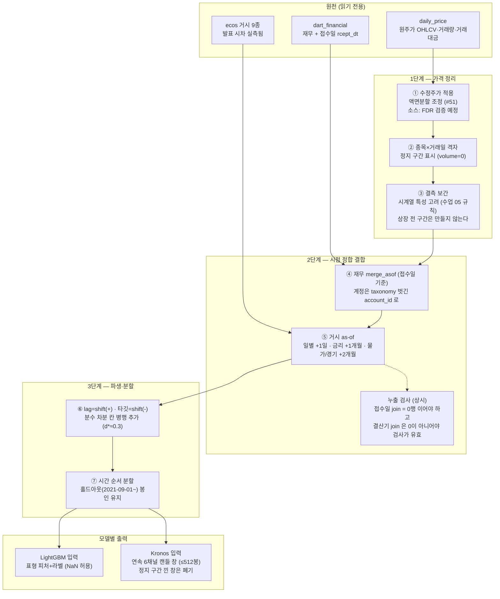
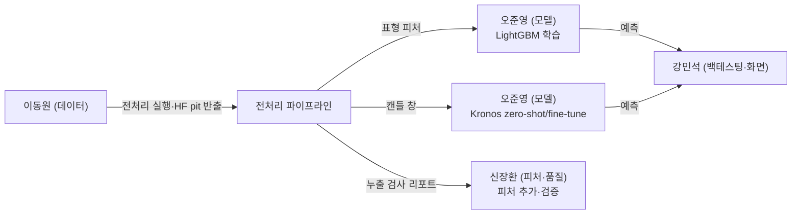

# 전처리 설계 명세서 — version 1.0 (2026-09-02)

> **무엇을 만드나**: 1차 모델(**LightGBM + Kronos**, 팀장 확정)의 입력 규격에 맞춘
> 전처리 파이프라인. 근거 수치는 전부
> [조사/모델벤치마킹](../../조사/모델벤치마킹.md)과
> [실측 노트북](../../../notebooks/02-품질·전처리/2026-09-02-전처리-설계-실측.ipynb)에 있다.
>
> **원칙**: 모델을 먼저 정하고, 그 입력 규격에서 전처리를 역산한다. 순서를 뒤집지 않는다.

## 1. 파이프라인 전체 구조

## 2. 유스케이스

## 3. 단계별 규격

| 단계 | 규격 | 실측 근거 (노트북 절) |
|---|---|---|
| ① 수정주가 | 조정 없는 종가는 분할일에 -98.04% 갭 (삼성전자 2018-05-04 실측). Kronos 는 캔들 자체를 학습하므로 **필수 전제**. 소스는 FinanceDataReader(MIT) 를 다음 수집 세션에서 검증 | 3절 |
| ② 격자 | 3,677종 × 4,102거래일. 512봉 이상 보유 3,224종(87.7%) — Kronos 대상. 거래정지 이력 2,136종 | 4절 |
| ③ 보간 | 결측은 시계열 보간, 상장 전 구간 생성 금지. `dropna` 는 최후 수단 (수업 05 규칙) | 4절 |
| ④ 재무 결합 | `merge_asof(direction="backward", on=접수일)`. 계정 매칭은 `account_id` 의 taxonomy 접두사(`ifrs_`/`ifrs-full_`)를 벗긴 suffix 로 — 이름·코드 둘 다 연도마다 흔들린다 (삼성전자 실측) | 6절 |
| ⑤ 거시 결합 | ECOS 발표 시차: 일별 4종 +1일 · 기준금리 +1개월 · 물가/경기지수 +2개월 | 기존 실측 |
| ⑥ 파생 | lag 는 `shift(+)`, 타깃은 `shift(-)`. 가격·거시 수준 계열에 분수 차분 칸 병행 (삼성전자 log 종가 d*=0.3: ADF p=0.001 · 원계열 상관 0.930) | 5절 |
| ⑦ 분할 | 시간 순서 분할만. `HOLDOUT_START=20210901` 봉인 유지 (변경은 이슈 #60 팀 논의) | 2절 |

## 4. 검증 규칙 — 항등식 금지

누출 검사는 **음성 대조군과 함께** 돌린다:

- 접수일 join 결과에서 `붙은 값의 접수일 > 거래일` 행 수 = **0** 이어야 한다
- 같은 검사를 결산기 join 에 적용하면 **0 이 아니어야** 한다 (삼성전자 실측 86행+)
  — 대조군이 0 이면 검사 자체가 무의미한 것이므로 실패로 처리한다

## 5. 팀 데이터 전달 (HF)

`qurious-quant/alphastack-dart` 를 2층으로 재구성한다 (팀장 승인 2026-09-02):

| 층 | 내용 | 용도 |
|---|---|---|
| `pit/` | 접수일 포함 API 재수집분 (`scripts/export_dart_dataset.py`) | **학습용 정본** |
| `bulk/` | 기존 일괄다운로드 묶음 43개 (2015~2026 · 접수일 없음) | 참조·대조만, 학습 금지 |

- 이동은 `scripts/reorganize_hf_dart.py` — `CommitOperationCopy` 라 443MB 재업로드 없음
- 루트 `MANIFEST.json` 은 krx-dev 와 같은 스키마 (path·rows·sha256·size_mb·note·columns)
- 실행 시점: **FY2010~2020 추가 수집(#60) 완료 후**, 사용자 확인 받고 (HF 동시 push 금지)

## 6. 미결·후속

- 수정주가 소스 확정 (#51 — FDR 검증, 다음 수집 세션)
- DEV_END 재논의 (#60 — 팀 결정 사항)
- Kronos fine-tune VRAM·Colab 실측 (colab-mcp 규약은 조사 문서 8절)
- 분수 차분 d* 종목별 분포 — 수정주가 확보 후 전 종목 스윕
