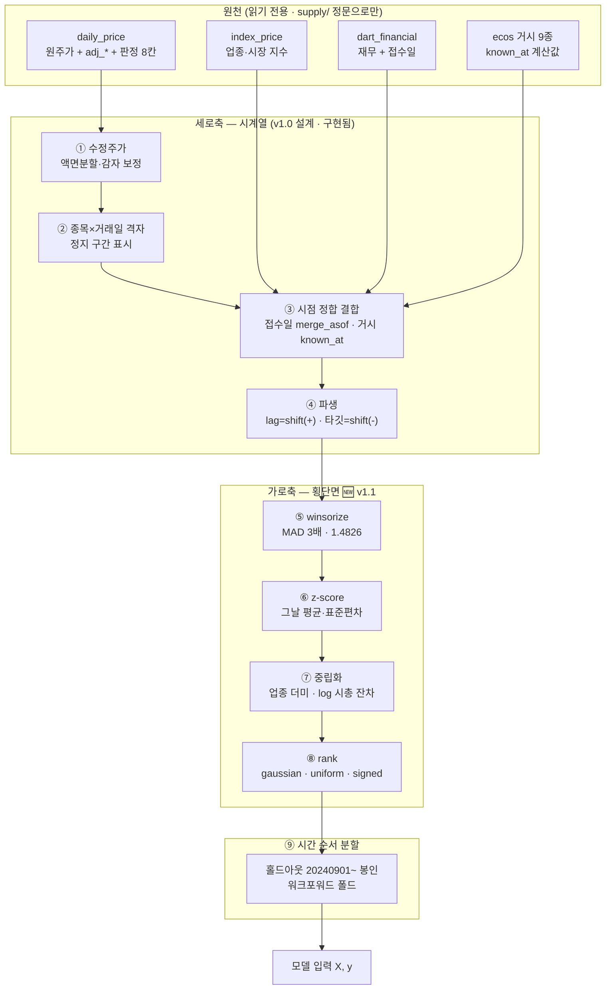
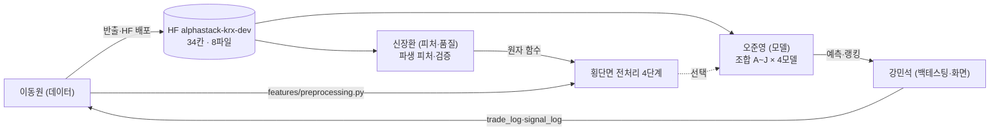

# 전처리 설계 명세서 — version 1.1 (2026-09-09)

> **무엇을 만드나**: 모델에 들어가기 전 자료를 다듬는 두 축의 규격.
> **세로축**(시계열 정리·시점 정합 결합)은 v1.0 이 설계했고 대부분 구현됐습니다.
> 🆕 **가로축**(그날 종목들끼리의 횡단면 전처리)을 v1.1 에서 만들었습니다 —
> [`features/preprocessing.py`](../../../features/preprocessing.py).
>
> **원칙**: 모델을 먼저 정하고 그 입력 규격에서 전처리를 역산한다. 순서를 뒤집지 않는다.
>
> 🔴 **v1.0 의 전제 셋이 바뀌었습니다.** [§0](#0-v10--v11-무엇이-바뀌었나) 을 먼저 보세요.
> 근거 수치는 전부 실행된 노트북에 있습니다 —
> [02/05 횡단면 전처리는 날짜 안에서 끝난다](../../../notebooks/02-품질·전처리/05.횡단면-전처리는-날짜-안에서-끝난다.ipynb) ·
> [02/06 군집은 업종을 얼마나 따라가나](../../../notebooks/02-품질·전처리/06.군집은-업종을-얼마나-따라가나.ipynb) ·
> [v1.0 실측](../../../notebooks/02-품질·전처리/2026-09-02-전처리-설계-실측.ipynb)

---

## 0. v1.0 → v1.1 무엇이 바뀌었나

| | v1.0 (2026-09-02) | v1.1 (2026-09-09) | 왜 |
|---|---|---|---|
| **모델** | LightGBM + **Kronos** | LogReg · RF · XGBoost · LightGBM (+ARIMA 기준선) | Kronos 는 채택되지 않았습니다. 개별종목 조합 A~J × 모델 4종으로 정리됐고, 현재 1위는 **조합 J LogisticRegression**(Accuracy 0.4196 · 학습 최빈 기준선 대비 **+2.27%p** · 12폴드 중 10승 · [PR #188](https://github.com/devlee328288/Alpha_Stack/pull/188), 오준영 님) |
| **홀드아웃** | `20210901` | **`20240901`** (`evaluation/horizon.py:34`) | 최근 2년으로 확정 — [ADR 0005](../../decisions/0005-홀드아웃-2년.md) · [이슈 #63](https://github.com/devlee328288/Alpha_Stack/issues/63) |
| **수정주가** | "FDR 검증 예정" | **완료** · `adj_*` 4칸 + 품질 플래그 4칸이 반출본에 실림 | FDR 은 감자를 조정하지 않아 직접 보정했습니다 (17자리 43,777행) — [데이터 품질 규약 §6](../../데이터파트/version4.1/데이터_품질_규약.md) |
| **가로축** | 없음 | 🆕 **네 단계 신설** (winsorize · z-score · 중립화 · rank) | 이 판의 본체. 아래 §4 |
| **512봉 격자** | Kronos 입력용 필수 | **보류** | 쓰는 모델이 없습니다. 딥러닝 계열을 다시 볼 때 되살립니다 |

**v1.0 을 지웠다고 보지 마십시오.** ①~⑦ 세로축 설계는 그대로 유효하고, 대부분 구현됐습니다
(§3 상태표). v1.1 은 **가로축을 더한 판**입니다.

---

## 1. 파이프라인 전체 구조 — 축이 둘



### 두 축을 왜 가르나 — 누수의 방향이 다릅니다

| | 세로축 (시계열) | 가로축 (횡단면) |
|---|---|---|
| 무엇을 보나 | **한 종목의 과거** | **그날의 다른 종목들** |
| 누수 위험 | t 행이 t+1 을 보면 누수 | 다른 **날짜**를 보면 누수 |
| 언제 계산하나 | 패널 조립 때 (t 이하만) | 패널 조립 때 (그날 안에서만) |
| 스케일링은? | 🔴 **폴드 안에서만** (`models/` Pipeline) | ✅ 폴드 밖에서 해도 된다 |

마지막 줄이 핵심입니다. `StandardScaler().fit(X_all)` 은 검증 구간의 평균·분산을 학습에 흘리므로
**폴드 안에서** 해야 합니다([`features/__init__.py`](../../../features/__init__.py) 경고 2 ·
[`models/logistic.py`](../../../models/logistic.py) 가 Pipeline 으로 지킵니다). 횡단면 변환은
**그날 종목들끼리**의 통계라 미래를 볼 수 없고, 그래서 조립 단계에서 해도 됩니다. 이 사실을
시험으로 못박았습니다 — `test_다른_날짜의_값을_바꿔도_오늘_결과는_같다`(네 함수 전부).

---

## 2. 유스케이스



`PIPE` 가 점선인 이유 — **아직 학습 경로에 기본으로 꽂히지 않았습니다.** §5 를 보십시오.

---

## 3. 세로축 상태표 (v1.0 ①~⑦ 의 지금)

| v1.0 단계 | 지금 | 어디에 |
|---|---|---|
| ① 수정주가 | ✅ **구현·검증** — FDR + 감자 보정 · 품질 플래그 4칸 반출 | `scripts/build_adj_prices.py` · [`supply/adj_quality.py`](../../../supply/adj_quality.py) |
| ② 격자·정지 구간 | ✅ 판정 3칸 반출(`is_liquidation`·`is_halted`·`is_first_listing`) · 🔴 **512봉 연속 격자는 보류** | [`common/corporate_actions.py`](../../../common/corporate_actions.py) |
| ③ 결측 보간 | ✅ **안 채우기로 확정** — 준비구간 NaN 은 정상 | [데이터 품질 규약 §5](../../데이터파트/version4.1/데이터_품질_규약.md) |
| ④ 재무 as-of | ✅ 접수일 `merge_asof` · account_detail 포함 기본키 | `supply/` · [ERD v2.4](../../erd/version2.4/ERD.md) |
| ⑤ 거시 as-of | ✅ `known_at` 계산 규칙 확정 | [기능명세 v1.2](../../기능명세/version1.2/) |
| ⑥ 파생·분수 차분 | 🟡 lag·타깃 ✅ · **분수 차분은 미채택** (쓰는 모델이 없음) | `features/` |
| ⑦ 시간 순서 분할 | ✅ 홀드아웃 `20240901` 봉인 · 워크포워드 | [`evaluation/horizon.py`](../../../evaluation/horizon.py) |

---

## 4. 🆕 가로축 규격 — 네 단계

전부 [`features/preprocessing.py`](../../../features/preprocessing.py) 의 순수 함수입니다.
입력과 같은 인덱스로 **요청한 칸만** 담은 새 표를 돌려주고, 입력은 바꾸지 않습니다.

### 4.0 공통 규약

| 규약 | 내용 |
|---|---|
| 계산 단위 | `date_col`(기본 `bas_dd`)로 묶은 **그날 안에서만** |
| 결측 | 채우지 않는다. 그날 통계에서 빼고 결측으로 남긴다 |
| 최소 종목 수 | 그날 3종 미만이면 손대지 않는다 (`DEFAULT_MIN_COUNT`) |
| 🔴 **받지 않는 칸** | 라벨 · 수익률 · 가격 · 진입/청산가 · 플래그 — `PROTECTED_PREFIXES`/`PROTECTED_NAMES` 가 `ValueError` 로 거부 |

마지막 줄이 [`is_extreme_return` 원칙](../../데이터파트/version4.1/데이터_품질_규약.md)과의 접점입니다.
*"진짜 극단 사건은 행을 남긴다"* 와 충돌하지 않습니다 — winsorize 는 **값을 당길 뿐 행을 지우지
않고**, 애초에 수익률·플래그 칸은 인자로 받지도 않습니다.

### 4.1 ① winsorize — 기본 MAD 3배

```python
median ± k × 1.4826 × MAD          # method="mad" (기본) · k=3
mean   ± k × std                    # method="sigma"    (Barra USE4)
[q_lo, q_hi] 분위                    # method="quantile" (국내 학술 관행 1%/99%)
```

**왜 MAD 인가 — 실측이 갈랐습니다** (모델 표본 159,936행 · 날짜별 46~50종).

| 피처 (첨도) | 분위 1/99 | 3σ | MAD 3 |
|---|---:|---:|---:|
| `turnover_20` (245) | 4.18% | 2.10% | **6.84%** |
| `ret_20` (34) | 4.18% | 0.87% | **2.65%** |
| `range_20` (11) | 4.18% | 1.23% | **3.07%** |

- **분위는 꼬리 길이와 무관하게 늘 4.18%** 입니다. 횡단면이 49종이라 1% 는 **0.49종** — 양끝 한
  개씩이라는 *개수*를 정한 것이지 극단값을 정한 게 아닙니다. MSCI 품질지수가 5/95 를 200종 예시로
  설명하는 것과 표본 크기가 다릅니다.
- **3σ 는 꼬리가 길수록 덜 잡습니다.** 평균·표준편차가 극단값 자체에 끌려 경계가 밖으로 밀립니다.
- **MAD 만 첨도 순서를 따라갑니다.** 중앙값 기준이라 극단값에 안 끌립니다.

정의는 qlib `RobustZScoreNorm`(microsoft/qlib `79633dd`)과 같고, `1.4826` 은 정규분포에서 MAD 를
σ 로 맞추는 상수입니다.

### 4.2 ② z-score — 날짜 안

```python
(x − 그날 평균) / 그날 표준편차       # ddof=1 (pandas 기본 · sklearn 은 ddof=0)
(x − 그날 중앙값) / (1.4826 × MAD)   # robust=True
```

**왜 전 구간이 아닌가** — `ret_5` 로 재면 그날 표준편차가 **최대/최소 13.5배** 흔들립니다. 전 구간
값과 2배 넘게 다른 날이 **3.1%** 이고, 2020-03(코로나)에는 |전 구간 z| 중앙 1.44 가 |날짜 안 z|
중앙 **0.61** 로 바뀝니다. "그날 종목들 중 어디쯤인가" 를 묻는 것이 횡단면 z-score 입니다.

### 4.3 ③ 중립화 — 회귀 잔차

```python
neutralize_cross_section(f, cols, groups="industry")                        # 업종 안 평균 빼기
neutralize_cross_section(f, cols, groups="industry", controls=("log_cap",))  # 업종 + 시총
neutralize_cross_section(f, cols, groups=None,       controls=("log_cap",))  # 시총만
```

그날 안에서 설계행렬(그룹 더미 + 연속 통제)에 최소제곱으로 회귀하고 **잔차**를 돌려줍니다.
`groups` 만 주면 Kakushadze `indneutralize`(그룹 안 평균 빼기)와 같습니다. 자유도가 없는 날
(완전한 행이 매개변수 수 + 2 미만)은 그날 전체가 NaN 입니다.

**기본 축은 업종입니다.** 근거는 IC 가 아니라 **ICIR** 입니다.

| 파이프라인 | \|IC\| 평균 | \|ICIR\| 평균 |
|---|---:|---:|
| 원값 | **0.0211** | 0.1050 |
| winsor+z | 0.0211 | 0.1050 |
| **+업종** | 0.0191 | **0.1144** |
| +시총 | 0.0211 | 0.1063 |
| +업종+시총 | 0.0180 | 0.1085 |

- **`winsor+z` 가 원값과 같습니다.** 우연이 아닙니다 — IC 는 순위상관이고 ①② 는 그날 안에서
  순서를 보존하는 변환이라 순위가 그대로입니다. **IC 로는 winsorize 효과를 잴 수 없습니다.**
  ①② 의 값어치는 값의 크기를 쓰는 모델(로지스틱)과 극단값 방어에서 옵니다.
- **중립화는 IC 를 9.5% 줄이고 ICIR 을 8.9% 늘립니다.** 방향이 반대입니다.
- 🔴 **그래서 축을 먼저 정해야 합니다.** long-only Top-K 랭킹에서는 한 번 크게 맞히는 것보다
  매일 조금씩 맞히는 것이 낫고, 그 기준이 ICIR 입니다. 시총까지 더하면 ICIR 이 도로 내려가므로
  기본에서 뺍니다 — `log_amihud_20`(시총 순위상관 −0.875)·`range_20`(−0.211) 처럼 시총이 실제로
  들어 있는 피처를 쓸 때만 `controls=("log_cap",)` 을 켭니다.

> 이것은 [선정 축이 순위를 지배한](../../TIL/이동원/) 또 한 사례입니다. |IC| 로 고르면 "중립화하지
> 말라", ICIR 로 고르면 "업종 중립화하라" 입니다. **어느 축을 쓰는지 적지 않으면 다음 사람이
> 다른 답을 얻습니다.**

### 4.4 ④ rank

| method | 식 | 범위 | 출처 |
|---|---|---|---|
| `uniform` | (순위 − 0.5) / n | (0, 1) | Kakushadze `rank(x)` · 우리 `*_rank` 5칸 |
| `gaussian` (기본) | Φ⁻¹(uniform) | ≈ N(0,1) | qlib `CSRankNorm` 의 목적 |
| `signed` | 2 × 순위 / (n+1) − 1 | (−1, 1) | Gu·Kelly·Xiu (RFS 2020) |

동률은 평균 순위입니다. 결측은 순위에서 빠지고 결측으로 남습니다(GKX 는 0 으로 채우지만, 채울지는
모델이 정합니다).

---

## 5. 🔴 기본값과 아직 안 한 것 — 정직하게

`preprocess_cross_section` 의 기본은 **①② 만 켜져 있습니다.** ③④ 는 인자를 줘야 켜집니다.
그렇게 둔 이유가 있습니다.

**조합 G + RandomForest 로 재니 ③④ 가 성능을 낮췄습니다** (단일 분할 · 학습 104,001행 · 검증
55,935행).

| 입력 | 정확도 | 상승 precision | 원값과 다른 예측 |
|---|---:|---:|---:|
| 원값 | **0.3938** | **0.4042** | 0 |
| 전 표본 로그 | 0.3939 | 0.4043 | 9 (0.02%) |
| 전 표본 z | 0.3932 | 0.4026 | 331 (0.59%) |
| 날짜 안 gaussian rank | 0.3806 | 0.3418 | 15,312 (27%) |
| 날짜 안 winsor+z+중립화 | 0.3731 | 0.3531 | 18,502 (33%) |

**유력한 설명 — 라벨이 절대 기준이라서.** 우리 라벨은 T+1→T+6 수익률의 **±2% 절대 밴드**입니다
([ADR 0006](../../decisions/0006-개별종목-중립대와-평가기준선.md)). 피처를 "그날 안에서 몇 등인가"
로 바꾸면 전부 오른 날의 1등과 전부 내린 날의 1등이 같은 값을 받아, 절대 임계로 그은 라벨과 축이
어긋납니다. **가설이고, 이 판에서 검증하지 않았습니다.**

이 표에서 함께 확인된 것 하나 — **전 표본 단조 변환은 트리에 사실상 무의미합니다**(0.02~0.59%).
"트리에 `StandardScaler` 가 필요 없다" 는 통념이 우리 자료에서도 맞습니다. 그런데 **횡단면 변환은
다릅니다**(27~33%) — 날짜가 다른 두 행의 순서를 바꾸기 때문입니다.

### 다음 판에서 할 것

| | 무엇 | 무엇을 만들면 끝인가 |
|---|---|---|
| A | 라벨 축 실험 (모델 파트 결정) | 라벨을 횡단면 순위(그날 상위 N%)로 둔 조합 하나 · 같은 12폴드에서 A~J 와 비교 |
| B | 폴드별 워크포워드로 §5 재측정 | 단일 분할이 아니라 12폴드 평균·표준편차 |
| C | 로지스틱에서 ①② 효과 측정 | 값의 크기를 쓰는 모델에서는 IC 로 안 잡히는 이득이 있을 것 |
| D | 시장 구조 마이닝을 피처로 | [노트북 02/06](../../../notebooks/02-품질·전처리/06.군집은-업종을-얼마나-따라가나.ipynb) 의 군집·흡수비를 국면 피처로 |

---

## 6. 검증 규칙 — 항등식 금지 (v1.0 유지 + 추가)

**누수 검사는 음성 대조군과 함께** 돌립니다.

- 접수일 join 결과에서 `붙은 값의 접수일 > 거래일` 행 수 = **0** 이어야 한다
- 같은 검사를 결산기 join 에 적용하면 **0 이 아니어야** 한다 — 대조군이 0 이면 검사 자체가
  무의미하므로 실패로 처리한다

🆕 **횡단면 전처리에도 같은 원칙을 걸었습니다.** *"다른 날짜의 값을 바꿔도 오늘 결과는 같다"* 를
네 함수 전부에 시험으로 두고, **일부러 틀린 구현**(전 표본 z-score)을 같은 시험에 넣어 그 시험이
실제로 붉어지는지 확인합니다 — `test_주입_전_표본_z_score_는_누수_시험이_잡는다`.
검사와 대상이 같은 잘못을 공유하면 초록은 무의미하기 때문입니다
([TIL 09-08](../../TIL/이동원/2026-09-08-검사와-대상이-같은-잘못을-공유하면-초록이-나온다.md)).

---

## 7. 팀 데이터 전달 (HF)

반출본은 [`qurious-quant/alphastack-krx-dev`](https://huggingface.co/datasets/qurious-quant/alphastack-krx-dev)
(private) 8파일 · **34칸**입니다. 전처리 결과는 **HF 에 올리지 않습니다** — 파라미터가 바뀌면
다시 만들어야 하고, 원본 + 함수로 언제든 재현되기 때문입니다. 받아 쓰는 쪽에서 이렇게 부릅니다.

```python
from features.preprocessing import preprocess_cross_section

X = preprocess_cross_section(panel, feature_cols)                       # ①② (기본)
X = preprocess_cross_section(panel, feature_cols,
                             neutralize={"groups": "industry"},         # ③
                             rank="gaussian")                            # ④
```

DART 층(`qurious-quant/alphastack-dart`)의 `pit/`·`bulk/` 2층 구조는 v1.0 그대로입니다.

---

## 8. 참고

- 코드: [`features/preprocessing.py`](../../../features/preprocessing.py) ·
  시험 [`tests/test_features_preprocessing.py`](../../../tests/test_features_preprocessing.py) (47건)
- 노트북: [02/05 횡단면 전처리](../../../notebooks/02-품질·전처리/05.횡단면-전처리는-날짜-안에서-끝난다.ipynb) ·
  [02/06 시장 구조 마이닝](../../../notebooks/02-품질·전처리/06.군집은-업종을-얼마나-따라가나.ipynb)
- 외부 원문: Barra USE4 (MSCI 2011) · MSCI 품질지수 방법론 (2014) · Gu·Kelly·Xiu, *Empirical Asset
  Pricing via Machine Learning* (RFS 2020) · Kakushadze, *101 Formulaic Alphas* (2016) ·
  microsoft/qlib `processor.py` (`79633dd`) · goldmansachs/gs-quant `statistics.py` (`a1427df`)
- 수업 자료: 07단원 3·10·22·23장(스케일링·VIF·KMeans·PCA) · 09단원 1·2·5장(금융 전처리·시장 구조)
- 우리 문서: [데이터 품질 규약](../../데이터파트/version4.1/데이터_품질_규약.md) ·
  [퀀트기준 대조](../../데이터파트/version4.1/퀀트기준_대조.md) ·
  [ADR 0006 중립대와 기준선](../../decisions/0006-개별종목-중립대와-평가기준선.md)
