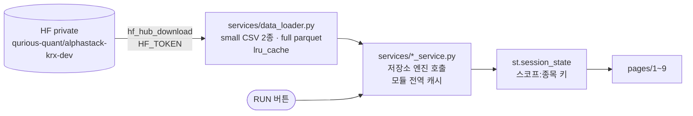

# 대시보드 9페이지와 배포 — 화면 안에서 학습하는 구조

> 평가파트 v1.3 · 2026-09-14 · 문서화 이동원 · 코드는 강민석 님 (PR #261 · #262) · 배포 준비 PR #266
> 코드와 PR 이 정본입니다. 여기 적힌 것과 코드가 다르면 **코드가 맞습니다.**
> 실측 기준 main `c9cb120` (§1 Baseline 줄 · §4 상태 열은 main `694d9b3` · 11:16 KST 보강 → 🆕 §1 Baseline · Model Lab 줄 · §4 #263 · #280 은 main `5e70ee1` · HF Space 화면 14:06 KST 로 다시 보강) · 대시보드 공개 URL https://alphastack-qurious.streamlit.app/ (Streamlit Cloud) ·
> https://huggingface.co/spaces/data-student/alphastack-qurious (HF Space · Docker · 14:06 KST 화면에서 PR #279 반영 확인)
> ⚠️ PR #279 는 Model Lab · Comparison · Backtest · Cost Sens · Universe 페이지와 서비스도 함께 바꿨습니다(13파일). §1 의 그 줄들과 §5 는 `c9cb120` 기준 그대로라 다음 판에서 다시 잽니다.

---

## 0. 한 줄

**대시보드는 파일을 읽어 그리는 화면이 아니라, 버튼을 누르면 서버에서 학습을 돌리는 연구 단말입니다.**
그래서 무료 배포 CPU 에서는 제한에 걸리고, 같은 설정의 결과는 **서버 메모리 캐시**로만 재사용됩니다.

---

## 1. 페이지 지도

| 페이지 | 무엇을 돌리나 | 엔진 (저장소 코드) |
|---|---|---|
| `app.py` Overview | 네 단계(Baseline · Model Lab · Backtest · Cost Sens) 결과를 모아 보여 준다 — 계산 없음 | `comparison_service` |
| `1_Baseline` | **ADAPTIVE** — 6-파라미터 동적 기준선 · 12폴드 · CMA-ES QUICK(30) / FULL(300) · 임계 1% / 2% (폴드마다 α/β 재최적화). ~~FROZEN CLASSIFIER~~(전체 구간에서 CMA-ES 한 번 → 고정 α/β · PR #269 · 이슈 #263 1차 구현)는 ⛔ **제외 결정**(2026-09-14 11:10 KST · 강민석 · [#263](https://github.com/devlee328288/Alpha_Stack/issues/263)) → ✅ **제거됨(PR #279 · 12:38 KST 머지)** — HF Space 화면(14:06 KST)에도 ADAPTIVE 만 보인다 | `evaluation/threshold_tuning/step5_optimize_6params.py` — `run_walkforward_6params` · `make_band_labels` (`find_frozen_6params` · `make_baseline_labels` 는 PR #279 에서 삭제. Model Lab 의 Adaptive 라벨은 `baseline_service.make_adaptive_labels_from_baseline` → `make_band_labels` 로 만든다. `dashboard/pages/2_Model_Lab.py:333` 의 같은 이름 함수는 아직 `make_baseline_labels` 를 import 하지만 어디서도 호출되지 않아 실행에는 영향이 없다) |
| `2_Model_Lab` | LogReg · RF · XGBoost · LightGBM 중첩 워크포워드 · 조합 E · `five_day_return` · 🆕 화면의 **BEST MODEL** 은 조합 E · 조화평균(정확도 · Macro F1 · 하락 재현율) 기준의 별도 실험이라 **공식 최종 모델(KOSPI200 조합 C · 개별종목 조합 K · 둘 다 LogisticRegression)과 다르다** — [#280](https://github.com/devlee328288/Alpha_Stack/issues/280) (오준영 12:41) · `DEFAULT_COMBINATION = "E"` 는 main `5e70ee1` 에도 그대로 → 강민석 14:17 *"K와 C로 수정하겠습니다"* (코드 PR 대기) | `models/experiment.py` · `features/model_dataset_stock.py` |
| `3_Comparison` | Baseline 과 모델을 표 둘로 — 서로의 지표 칸은 `—` | `comparison_service` |
| `4_Backtest` | 전략 A · B · C · predictor = Random 또는 Model Lab OOS 예측 · Trade Cost 직접 입력 | `backtest/backtest_strategies.py` |
| `5_Risk` | 백테스트 · 모델 결과로 위험·분류·회귀 지표 | `evaluation/evaluation_risk.py` · `evaluation_backtest.py` |
| `6_Cost_Sensitivity` | 비용 프리셋 4종 × 전략 3종 · 손익분기 비용 | `backtest/run_cost_sensitivity.py` |
| `7_System` | HF 스냅샷 메타 · 패키지 · 결과 키 | `system_service` |
| `8_Universe` | 30종목(stocks30) 또는 전종목(full parquet 444 MB) 랭킹 · joblib 병렬 | `universe_service` |
| `9_QFRS` | Risk + Backtest 탭 요약 | `risk_service` |

사이드바 스코프 — MARKET(KOSPI200) · STOCK(30종목 중 하나) · UNIVERSE. 결과는 `st.session_state` 에 `스코프:종목` 키로 저장됩니다(`dashboard/state.py`).

---

## 2. 데이터와 계산의 흐름

| 층 | 캐시 | 사라지는 때 |
|---|---|---|
| `data_loader` | `functools.lru_cache` — 프로세스 전역 | 앱 재시작 |
| `baseline_service` · `model_service` · `backtest_service` | 모듈 전역 dict (`_BASELINE_CACHE` · `_MODEL_CACHE` · `_BT_CACHE`) — **모든 접속자 공유** | 앱 재시작 · 재배포 · 절전 |
| `st.session_state` | 브라우저 세션마다 | 새로고침 · 세션 종료 |

🔴 **한 번 계산하면 다른 접속자도 같은 설정에서는 즉시 받습니다.** 시연 전에 예열하고, 시연 전까지 재배포하지 않는 것이 이 구조에서의 운영 방법입니다.

---

## 3. 배포 기록 (2026-09-14)

### 3.1 Streamlit Community Cloud

| 시각 (KST) | 일 | 원인 · 조치 |
|---|---|---|
| 09:1x | 첫 배포 · 첫 화면 `ModuleNotFoundError: huggingface_hub` | Cloud 는 **진입점 폴더의 `dashboard/requirements.txt` 를 루트보다 먼저** 쓴다. 거기 huggingface-hub · datasets · cma · tqdm · torch 가 없었다 → **PR #266** (파일 하나 · 파이썬 코드 무수정) |
| 09:26 | PR #266 머지 · 재배포 | Baseline 은 `focal_classifier`(torch)를 같은 import 묶음에 넣어 torch 가 없으면 페이지 전체가 멈춘다 → torch 는 `--find-links …/whl/cpu/torch/` 로 CPU wheel. `--extra-index-url` 은 uv 가 다른 패키지까지 그 인덱스에서 찾아 datasets 를 2.19 로 끌어내렸다 |
| 09:30 | Model Lab · Baseline 이 **HF 401** | 사이드바 HF 메타는 성공(`repo_sha b5e3d52c`) — 토큰은 유효. Secrets 키 이름이 `HUGGINGFACE_ACCESS_TOKEN` 이었고 `hf_hub_download` 는 **`HF_TOKEN` 만** 읽는다 → 이름 변경 · 재시작 |
| 09:33 | STOCK 버튼 → 종목 선택칸 | ✅ HF 데이터 연결 확인 |
| 09:4x | **CPU throttle** (12:37 까지) | RUN 이 서버에서 학습한다 — 무료 CPU 한도 |

### 3.2 HF Space (Docker) — Cloud 와 함께 둔다

두 배포는 서로 독립입니다 — Cloud 는 GitHub `main` 에 커밋이 들어오면 스스로 다시 배포하고, Space 는 **Factory rebuild** 를 눌러야 새 코드를 받습니다.
정본 파일 `deploy/hf-space/`(PR #272).

| 항목 | 값 |
|---|---|
| 상태 (09:54) | `NO_APP_FILE` — 파일 없음 · 하드웨어 요청 `cpu-upgrade`(8 vCPU · 32 GB · 유료) · 절전 1시간 · Secret `HF_TOKEN` 등록 완료 |
| 방식 | Space 에 `Dockerfile` + README 두 파일 — 빌드할 때 GitHub `main` 을 `git clone` · 새 코드는 **Factory rebuild** |
| 로컬 검증 (10:02) | 빌드 178초 · 이미지 3.32 GB · 헬스 2초 · 컨테이너 안 HF 데이터 3,553행 · AppTest 예외 0 · 엔진 import 전부 성공 |
| 안내 | 이슈 [#271](https://github.com/devlee328288/Alpha_Stack/issues/271) — Space 에 올릴 Dockerfile · README 전문 · 체크리스트 · 캐시 예열과 rebuild 순서 |

---

## 4. 논의 이슈 5건 (2026-09-14 · 팀장 정리)

| # | 문제 | 협업 파트 | 상태 (2026-09-14 · 14:17 댓글까지 재확인 · 댓글 시각 KST) |
|---|---|---|---|
| [#263](https://github.com/devlee328288/Alpha_Stack/issues/263) | Baseline 고정 분류기 부재 — 폴드마다 α/β 재최적화 | ML · 백테스팅 | ⛔ **제외 결정** — 강민석 11:10 · ✅ 코드 제거 **PR #279 머지 12:38** (ML 의견 10:13) |
| [#264](https://github.com/devlee328288/Alpha_Stack/issues/264) | Comparison 기준 불일치 — ML 라벨 상수 밴드 vs Baseline dynamic band | 피처 · ML · 백테스팅 | 🟡 ML 의견 10:26 · 피처 동의 10:42 — 백테스팅 답 대기 |
| [#265](https://github.com/devlee328288/Alpha_Stack/issues/265) | Backtest Trade Cost ↔ Cost Sens 관계 불명확 | 백테스팅 · ML | 🟡 ML 의견 10:40 — 백테스팅 답 대기 |
| [#267](https://github.com/devlee328288/Alpha_Stack/issues/267) | Cost Sens 독립/공유 미결 | 백테스팅 · ML | 🟡 ML 의견 10:57 — 백테스팅 답 대기 |
| [#268](https://github.com/devlee328288/Alpha_Stack/issues/268) | Comparison 지표 확장 미구현 — 서로 다른 지표만 계산해 `—` | ML · 백테스팅 | ⚪ 답 없음 |
| [#280](https://github.com/devlee328288/Alpha_Stack/issues/280) 🆕 | 배포 Model Lab 의 BEST MODEL(조합 E · 조화평균 → LightGBM)이 공식 최종 모델(C · K LogisticRegression)과 조합 · 선정 기준이 다르다 | ML · 백테스팅 | 🟡 오준영 12:41 제기 → 강민석 14:17 *"노트북에 E를 가장 좋은 모델로 사용한다는 것만 보고 E로 진행했는데, K와 C로 수정하겠습니다"* — 코드 수정 PR 대기 · 위 5건 밖에서 새로 열린 알림 |

이슈마다 코드 근거(파일:줄)와 결정할 것 체크박스를 달았습니다. 🟡 는 의견만 있고 결정은 아직입니다 — 내용은 이슈 댓글이 정본입니다.

**#263 결정 — 강민석 님 댓글 원문 (11:10)**

> baseline이 예측이 아니라 분류의 목적이라 생각하고 frozen을 생각해보았는데, 아무래도 전문성도 떨어지고 발표에서 공격을 받기 너무 쉬워 제외하겠습니다

- 그 전에 오준영 님(ML)은 *"최초 학습구간에서 1회 최적화 → JSON 으로 동결 → 이후 OOS 검증과 백테스트에 동일한 규칙 적용"* 을 제안했고, 지금 `Frozen Classifier` 는 전체 기간의 T+1→T+6 정답으로 최적화한 뒤 같은 기간에서 성능을 계산하므로 *"OOS 성능이나 고정 벤치마크 성능으로 사용하면 안 된다"* 는 의견을 남겼습니다(10:13). 결정의 이유는 위 원문입니다.
- 🔴 (11:16 KST 기준) 결정과 코드는 따로였습니다 — main `694d9b3` 의 `dashboard/pages/1_Baseline.py` 에 Frozen 이 그대로 있었고, HF Space 빌드(10:36 clone · main `c95ef6f` — #269 포함)에도 들어 있었습니다.
- ✅ **12:38 KST PR #279(강민석) 머지로 코드도 따라왔습니다** — `1_Baseline.py` −190줄 · `step5_optimize_6params.py` 에서 `find_frozen_6params` 가 빠졌습니다. Streamlit Cloud 는 자동 반영이고, HF Space 는 사용자가 **Factory rebuild** 한 뒤 14:06 KST 화면에서 FROZEN 이 없고 ADAPTIVE 만 보이는 것을 확인했습니다([#274](https://github.com/devlee328288/Alpha_Stack/issues/274)).

---

## 5. 코드 상태 — 관찰만 (고치지 않았다)

| 무엇 | 실측 (09-14) |
|---|---|
| ruff | `dashboard/` **199건**(E402 가 대부분 — `st.set_page_config` 뒤 import) · 그 밖 **10건**은 PR #262 의 네 파일(`backtest_strategies.py` · `evaluation_backtest.py` · `step1_core_features.py` · `model_dataset_stock.py`) |
| 옛 파일 | `_legacy/` 로 6개 옮김 (`_mock.py` · `app_streamlit_data.py` · `data_service.py` · `feature_service.py` · `probe.py` · `probe2.py`) |
| `backtest_strategies.py` | 666줄 삭제 · 107줄 추가 · `load_data()` → `load_data(ticker=None)` |
| STOCK 스코프 라벨 | `build_model_dataset_any` 가 `neutral_band` 를 넘기지 않아 **종목도 ±1.0%(지수 밴드)** — 공식 종목 트랙은 ±2.0% (#264 근거) |
| 최종 결과와의 관계 | Model Lab 은 조합 E 로 **새로 학습**한다 — 최종 결과(조합 C · K · [모델파트 v1.3](../../모델파트/version1.3/최종결과-2년과-마지막-구간.md))와 숫자가 다르다 |
| Focal MLP 체크박스 | `step7_focal_walkforward` 모듈이 없어 비활성 — 선택 기능이라 페이지는 동작 |

---

## 6. 발전 가능성

- **미리 계산한 결과를 읽기만 하는 화면** — 로컬(22코어)에서 계산한 결과를 파일로 싣고 화면은 읽기만. 아키텍처 v1.2 가 적었던 *"화면은 모델을 부르지 않는다(시연 안정성)"* 로 돌아가는 길이고, 배포 CPU 제한과 캐시 소실을 함께 푼다.
- 공통 지표 스펙과 비용 규격(#265 · #267 · #268)이 정해지면 Comparison 의 `—` 칸이 채워진다.
