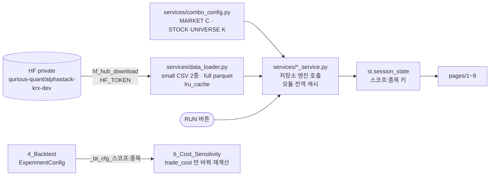

# 대시보드 9페이지와 배포 — 화면 안에서 학습하는 구조

> 평가파트 v1.4 · 2026-09-15 · 문서화 이동원 · 코드는 강민석 님 (PR #261 · #262 · #269 · #279 · #287 · #289 · #300 · #301) · 배포 준비 PR #266 · #272
> 코드와 PR 이 정본입니다. 여기 적힌 것과 코드가 다르면 **코드가 맞습니다.**
> 실측 기준 main **`cff6715`** (2026-09-15 09:31 KST · `dashboard/` · `backtest/` 는 #301 머지 `9cf3f2c` 뒤 바뀌지 않았다) · HF Space 화면 2026-09-15 09:44~09:47 KST ([캡처 10장](../../media/배포화면/2026-09-15/README.md))
> 공개 URL https://alphastack-qurious.streamlit.app/ (Streamlit Cloud) · https://huggingface.co/spaces/data-student/alphastack-qurious (HF Space · Docker)
> v1.3 이 *"다음 판에서 다시 잰다"* 고 남긴 §1 페이지 줄과 §5 를 이 판에서 다시 쟀습니다 — [변경사항](변경사항.md)

---

## 0. 한 줄

**대시보드는 파일을 읽어 그리는 화면이 아니라, 버튼을 누르면 서버에서 학습을 돌리는 연구 단말입니다.**
그래서 무료 배포 CPU 에서는 제한에 걸리고, 같은 설정의 결과는 **서버 메모리 캐시**로만 재사용됩니다.

🆕 09-14 오후에 머지된 네 PR 로 **Model Lab 의 피처 조합이 공식 최종 모델과 같아졌고**(KOSPI200 C · 개별종목 K),
**Backtest 와 Cost Sensitivity 는 설정 하나를 함께 씁니다.** 다만 최고 모델은 여전히 **조화평균**으로 고릅니다.

---

## 1. 페이지 지도 (main `cff6715`)

| 페이지 | 무엇을 돌리나 | 엔진 (저장소 코드) | 🆕 v1.3 뒤 바뀐 것 |
|---|---|---|---|
| `app.py` Overview | 네 단계(Baseline · Model Lab · Backtest · Cost Sens) 결과를 모아 보여 준다 — 계산 없음 | `comparison_service` | 머리 `COMBINATION C` · 최고 모델 칸 이름은 **`BEST MODEL` 그대로**(`app.py:168`) · Backtest 줄과 머리 글자는 `A/B/C`(`:109` · `:283`)인데 표에는 전략 6개가 나온다 |
| `1_Baseline` | **ADAPTIVE** — 6-파라미터 동적 기준선 · 12폴드 · CMA-ES QUICK(30) / FULL(300) · 임계 1% / 2% (폴드마다 α/β 재최적화). FROZEN CLASSIFIER 는 PR #279 로 제거(09-14) | `evaluation/threshold_tuning/step5_optimize_6params.py` — `run_walkforward_6params` · `make_band_labels`(`baseline_service.py:45` 가 import) | **#300** — `make_band_labels`(`step5:172`)가 *"종가가 가격 밴드 밖인가"* 에서 *"미래 5일 수익률이 밴드 폭(기준값 대비 비율)을 넘는가"* 로 바뀌었다. 🔴 주석은 `t+1 시가 → t+6 시가` 인데 코드는 **종가** `close.shift(-6) / close.shift(-1)`(`:182-183`) — 같은 파일의 다른 라벨은 시가 `open_.shift(-6) / open_.shift(-1)`(`:49`). 화면 숫자 09-14 Sharpe 0.2679 · Macro F1 0.3083 → 09-15 **0.0815 · 0.2973** |
| `2_Model_Lab` | LogReg · RF · XGBoost · LightGBM 중첩 워크포워드 · 라벨 `fwd_return ±1%` 또는 Adaptive · **조합은 스코프별 자동** — MARKET **C**(6) · STOCK · UNIVERSE **K**(14) (`services/combo_config.py:41-60`) · 최고 모델은 **조화평균**(정확도 · Macro F1 · 하락 재현율) 정렬(`comparison_service.py:41`) | `models/experiment.py` · `features/model_dataset_baseline_labeled.py` → `model_dataset_stock.build_model_dataset_any` → `model_dataset.build_model_dataset` | **#287 · #289** 조합 E → C · K · **#300** 칸 이름 `BEST HARMONIC MODEL`(`2_Model_Lab.py:257`). 🔴 공식 최종 모델을 고르는 규칙([ADR 0007](../../decisions/0007-최종-모델-선정과-홀드아웃.md))과 선정 기준이 달라, 09-15 화면의 최고 모델은 **XGBoost**(Harmonic 0.3447) — 공식은 KOSPI200 C · 개별종목 K 의 LogisticRegression |
| `3_Comparison` | Baseline 라벨 분포 · 라벨 소스별 ML 성능 · Baseline 판정 재현(Agreement · Kappa) | `comparison_service` | 코드 변경 없음(`5e70ee1..cff6715`). 09-15 화면: fwd_return 상승 33.63% · 중립 38.46% · 하락 27.91%(N 3,547) · Adaptive 18.68% · 38.71% · 42.61%(N 756) |
| `4_Backtest` | 전략 **A ~ F** — D · E · F = A · B · C + **5거래일 락**(거래가 난 날부터 5거래일 동안 신규 · 청산 금지 · `backtest_strategies.py:209` · 판정 `:315-317`) · predictor = Model Lab OOS 예측 4종 · 라벨 fwd_return / adaptive · 설정은 `ExperimentConfig` 하나(`4_Backtest.py:168`) · 실행하면 설정을 `st.session_state["_bt_cfg_<스코프>:<종목>"]` 에 저장(`:207`) | `backtest/backtest_strategies.py` · `services/backtest_service.py` · `services/experiment_config.py` | **#301** — 설정 공유(§2.1) · 전략 3 → 6 |
| `5_Risk` | 백테스트 · 모델 결과로 위험·분류·회귀 지표 | `evaluation/evaluation_risk.py` · `evaluation_backtest.py` | 코드 변경 없음 |
| `6_Cost_Sensitivity` | Backtest 가 저장한 설정을 받아(`6_Cost_Sensitivity.py:46-61`) 비용 프리셋 4종 × 전략 6종 · 손익분기 비용(Sharpe = 0 · 이분 탐색 0.01% ~ 2%) · 설정이 없으면 `NO CONFIG` 로 멈춘다 · 결과를 만든 설정과 지금 설정이 다르면 다시 실행하라고 경고(`:138`) | `backtest/run_cost_sensitivity.py`(프리셋 · `find_breakeven_cost`) · `backtest_service.run_cost_grid` · `run_breakeven` | **#301** — predictor · 기간을 이 페이지에서 고르던 칸이 빠졌다 |
| `7_System` | HF 스냅샷 메타 · 패키지 · 결과 키 | `system_service` | 코드 변경 없음 |
| `8_Universe` | 30종목(stocks30) 또는 전종목(full parquet) 랭킹 · joblib 병렬 · 모델 조합은 K 자동(`universe_service.py:24`) | `universe_service` | **#287** 조합 E → K |
| `9_QFRS` | Risk + Backtest 탭 요약 | `risk_service` | 코드 변경 없음 · 09-15 화면 전략 A 16/100 POOR |

사이드바 스코프 — MARKET(KOSPI200) · STOCK(30종목 중 하나) · UNIVERSE. 결과는 `st.session_state` 에 `스코프:종목` 키로 저장됩니다(`dashboard/state.py`).

---

## 2. 데이터와 계산의 흐름

| 층 | 캐시 | 사라지는 때 |
|---|---|---|
| `data_loader` | `functools.lru_cache` — 프로세스 전역 | 앱 재시작 |
| `baseline_service` · `model_service` | 모듈 전역 dict (`_BASELINE_CACHE` · `_MODEL_CACHE`) — **모든 접속자 공유** | 앱 재시작 · 재배포 · 절전 |
| `backtest_service` 🆕 | `_BT_CACHE`(키 = 설정 전체 + 전략) · `_COST_GRID_CACHE` · `_BE_CACHE`(키 = 비용을 뺀 설정) · `_PREDICT_FUNC_CACHE` — **모든 접속자 공유** | 앱 재시작 · 재배포 · 절전 |
| `st.session_state` | 브라우저 세션마다 — 🆕 Backtest 설정 `_bt_cfg_*` · Cost Sens 결과 설정 `_cost_cfg_*` | 새로고침 · 세션 종료 |

🔴 **한 번 계산하면 다른 접속자도 같은 설정에서는 즉시 받습니다.** 시연 전에 예열하고, 시연 전까지 재배포하지 않는 것이 이 구조에서의 운영 방법입니다.
🆕 실측(09-15) — 09:44 KST 에 누른 RUN 이 9초 이하로 끝났고, Overview 에 적힌 결과 시각은 UTC `2026-09-14 23:21:49`(Baseline) · `23:22:25`(Model Lab) = KST 08:21 · 08:22 였다. 먼저 계산돼 있던 결과를 받은 것이다.

### 2.1 🆕 Backtest ↔ Cost Sensitivity 설정 공유 (#301)

`dashboard/services/experiment_config.py` 의 `ExperimentConfig`(frozen dataclass) 하나를 두 페이지가 씁니다.

| 칸 | 기본값 | `cache_key()` | `signal_key()` |
|---|---|:---:|:---:|
| `scope` · `ticker` · `start` · `end` | 화면 입력 | ✅ | ✅ |
| `source` | `stocks30` | ✅ | ✅ |
| `predictor` · `model_revision` · `baseline_kind` | 화면 입력 · `v1` · 화면 입력 | ✅ | ✅ |
| `initial_cash` · `trade_cost` | 100.0 · 0.001 | ✅ | — |
| `seed` | None | ✅ | ✅ |

- **Backtest** 는 이 설정으로 전략 6개를 한 번 돌리고, 설정을 `session_state` 에 둡니다.
- **Cost Sensitivity** 는 그 설정을 되살려 `with_cost()` 로 비용만 프리셋 4개로 바꿉니다. 예측 · 신호는 `signal_key()` 가 같으면 재사용합니다.
- 오준영 님(ML)은 #267 에서 이렇게 제안했습니다(2026-09-14 10:57 KST):

  > Backtest와 Cost Sens를 완전히 독립된 실행으로 두기보다 **공통 실험 설정을 SSOT로 공유**하는 것이 적절하다고 생각합니다.

  #301 은 본문 · 댓글이 없어 이 제안을 따른 것인지는 적혀 있지 않습니다. 같은 댓글이 *"Streamlit `session_state` 자체를 설정의 정본으로 삼는 것은 피하는 것이 좋겠습니다"* 라고 했는데, 지금 Cost Sens 는 `session_state` 에 저장된 Backtest 설정을 읽습니다(`6_Cost_Sensitivity.py:46-47`) — 관찰만 적습니다.

---

## 3. 배포 기록

### 3.1 Streamlit Community Cloud (2026-09-14)

| 시각 (KST) | 일 | 원인 · 조치 |
|---|---|---|
| 09:1x | 첫 배포 · 첫 화면 `ModuleNotFoundError: huggingface_hub` | Cloud 는 **진입점 폴더의 `dashboard/requirements.txt` 를 루트보다 먼저** 쓴다. 거기 huggingface-hub · datasets · cma · tqdm · torch 가 없었다 → **PR #266** (파일 하나 · 파이썬 코드 무수정) |
| 09:26 | PR #266 머지 · 재배포 | Baseline 은 `focal_classifier`(torch)를 같은 import 묶음에 넣어 torch 가 없으면 페이지 전체가 멈춘다 → torch 는 `--find-links …/whl/cpu/torch/` 로 CPU wheel. `--extra-index-url` 은 uv 가 다른 패키지까지 그 인덱스에서 찾아 datasets 를 2.19 로 끌어내렸다 |
| 09:30 | Model Lab · Baseline 이 **HF 401** | 사이드바 HF 메타는 성공(`repo_sha b5e3d52c`) — 토큰은 유효. Secrets 키 이름이 `HUGGINGFACE_ACCESS_TOKEN` 이었고 `hf_hub_download` 는 **`HF_TOKEN` 만** 읽는다 → 이름 변경 · 재시작 |
| 09:33 | STOCK 버튼 → 종목 선택칸 | ✅ HF 데이터 연결 확인 |
| 09:4x | **CPU throttle** (12:37 까지) | RUN 이 서버에서 학습한다 — 무료 CPU 한도 |

### 3.2 HF Space (Docker) — Cloud 와 함께 둔다 (2026-09-14)

두 배포는 서로 독립입니다 — Cloud 는 GitHub `main` 에 커밋이 들어오면 스스로 다시 배포하고, Space 는 **Factory rebuild** 를 눌러야 새 코드를 받습니다.
정본 파일 `deploy/hf-space/`(PR #272).

| 항목 | 값 |
|---|---|
| 상태 (09:54) | `NO_APP_FILE` — 파일 없음 · 하드웨어 요청 `cpu-upgrade`(8 vCPU · 32 GB · 유료) · 절전 1시간 · Secret `HF_TOKEN` 등록 완료 |
| 방식 | Space 에 `Dockerfile` + README 두 파일 — 빌드할 때 GitHub `main` 을 `git clone` · 새 코드는 **Factory rebuild** |
| 로컬 검증 (10:02) | 빌드 178초 · 이미지 3.32 GB · 헬스 2초 · 컨테이너 안 HF 데이터 3,553행 · AppTest 예외 0 · 엔진 import 전부 성공 |
| 안내 | 이슈 [#271](https://github.com/devlee328288/Alpha_Stack/issues/271) — Space 에 올릴 Dockerfile · README 전문 · 체크리스트 · 캐시 예열과 rebuild 순서 |

### 3.3 🆕 수정 뒤 빌드 확인 (2026-09-15)

| 확인한 것 | 결과 |
|---|---|
| 공개 API `api/spaces/data-student/alphastack-qurious` | `RUNNING` · `cpu-basic` · Space 저장소 sha `d02c9d3`(Dockerfile 커밋 · 2026-09-14 01:36 UTC) — **빌드 시각은 알려 주지 않는다** |
| 화면 글자 (09:35 · RUN 없이) | Model Lab `COMBINATION C` · Backtest `RUN ALL (A~F)` · `EXPERIMENT CONFIG · SSOT` · Cost Sens `NO CONFIG` → #301 뒤 빌드 |
| 캡처 (09:44~09:47) | 10장 · 설정은 화면 기본값 · Universe RUN 없음 — [2026-09-15](../../media/배포화면/2026-09-15/README.md) |
| 이슈 | #271(Space 이전) · #274(사용설명서)는 2026-09-15 09:00 KST 에 닫혔다(닫는 댓글 없음) |

---

## 4. 논의 이슈 (2026-09-15 09:40 KST 재확인)

| # | 문제 | 상태 | 지금 코드 (main `cff6715`) |
|---|---|---|---|
| [#263](https://github.com/devlee328288/Alpha_Stack/issues/263) | Baseline 고정 분류기 부재 — 폴드마다 α/β 재최적화 | ⛔ 제외 결정(강민석 09-14 11:10) · ✅ PR #279 로 제거(12:38) | FROZEN 없음 — 09-15 화면에도 ADAPTIVE 만 |
| [#264](https://github.com/devlee328288/Alpha_Stack/issues/264) | Comparison 기준 불일치 — ML 라벨 상수 밴드 vs Baseline dynamic band | ✅ **닫힘** 09-15 09:00 · 닫는 댓글 없음 · 의견 ML 10:26 · 피처 10:42 | 🔴 Model Lab 의 **STOCK 라벨은 여전히 ±1.0%** — `build_model_dataset_any` 가 중립 구간을 넘기지 않아 `features/model_dataset.py:190` 의 기본값 `NEUTRAL_BAND = 0.01`(`evaluation/horizon.py:37`)을 쓴다. 공식 종목 트랙은 `STOCK_NEUTRAL_BAND = 0.02`(`features/stock_model_dataset.py:44`) |
| [#265](https://github.com/devlee328288/Alpha_Stack/issues/265) | Backtest Trade Cost ↔ Cost Sens 비용 단위 | ✅ **닫힘** 09-15 09:00 · 닫는 댓글 없음 · 의견 ML 10:40 | 🔴 프리셋 이름 · 주석은 **왕복**(`run_cost_sensitivity.py:15` · `:21-24`)인데 엔진은 매수 · 매도 때 **각각** 곱한다(`backtest_strategies.py:353` · `:377`) — 바뀌지 않았다 |
| [#267](https://github.com/devlee328288/Alpha_Stack/issues/267) | Cost Sens 독립/공유 | ✅ **닫힘** 09-15 09:00 · 닫는 댓글 없음 · 의견 ML 10:57 | ✅ #301 로 설정 하나를 공유(§2.1) |
| [#268](https://github.com/devlee328288/Alpha_Stack/issues/268) | Comparison 지표 확장 미구현 | ✅ **닫힘** 09-15 09:00 · 댓글 0 | `comparison_service.py` · `3_Comparison.py` 는 `5e70ee1..cff6715` 에서 바뀌지 않았다 |
| [#280](https://github.com/devlee328288/Alpha_Stack/issues/280) | 배포 Model Lab 의 BEST MODEL 이 공식 최종 모델과 조합 · 선정 기준이 다르다 | 🟡 **열림** — 강민석 14:17 *"노트북에 E를 가장 좋은 모델로 사용한다는 것만 보고 E로 진행했는데, K와 C로 수정하겠습니다"* | ✅ 조합 C · K(#287 · #289) · 🔴 정렬은 조화평균 그대로(`comparison_service.py:41`) · 칸 이름만 `BEST HARMONIC MODEL`(#300) · Overview 는 `BEST MODEL` |
| [#276](https://github.com/devlee328288/Alpha_Stack/issues/276) | HF Space 실측 다섯 (시각 UTC 등) | 🟡 열림 · 댓글 0 | 화면 시각은 여전히 UTC — System 머리 `2026-09-15 00:46:59` |

**닫은 이유는 이슈에 적혀 있지 않습니다.** 이 표의 "지금 코드" 열은 닫힌 뒤의 코드를 읽은 것이지, 닫은 이유가 아닙니다. 내용은 이슈 댓글이 정본입니다.

**#263 결정 — 강민석 님 댓글 원문 (09-14 11:10)**

> baseline이 예측이 아니라 분류의 목적이라 생각하고 frozen을 생각해보았는데, 아무래도 전문성도 떨어지고 발표에서 공격을 받기 너무 쉬워 제외하겠습니다

---

## 5. 코드 상태 — 관찰만 (고치지 않았다 · 2026-09-15)

| 무엇 | 실측 |
|---|---|
| ruff | 저장소 **220건** = `dashboard/` **206**(E402 85 · E701 33 · I001 31 · E702 15 · E741 10 · W292 10 · 그 밖 22) + 그 밖 **14**(`features/model_dataset_stock.py` 6 · `features/model_dataset_baseline_labeled.py` 5 · `evaluation/evaluation_backtest.py` 2 · `evaluation/threshold_tuning/step1_core_features.py` 1). 09-14 는 209(199 + 10) |
| 조정 라벨의 시간축 | `step5_optimize_6params.py:182-183` 는 종가, 주석과 같은 파일 `:49` 는 시가 (§1 Baseline 줄) |
| STOCK 스코프 라벨 | ±1.0% — 공식 종목 트랙 ±2.0% 와 다르다 (§4 #264) |
| 화면 LogisticRegression 정확도 | 09-15 화면 **0.3736** — 공식 개발구간 결과 **0.4542**(같은 조합 C · 12폴드 · 표본 밖 720행)와 다르다. 원인은 판정하지 않았다 |
| 손익분기 탐색 상한 | `find_breakeven_cost(cost_max=0.02)`(`run_cost_sensitivity.py:44`) — 09-15 화면 D · E **1.996%** 는 상한 바로 아래, 상한까지 Sharpe 가 0 을 넘었다는 뜻 |
| 비용이 오를 때 Sharpe | 09-15 화면 D 0.4123(0.05%) → 0.3795 → 0.3667 → **0.4145**(0.50%) · E 0.3851 → 0.3511 → 0.3379 → **0.4152** — 비용이 가장 클 때 다시 오른다. 판정하지 않았다 |
| `dashboard/services/backtest_5day_service.py` | #287 로 들어온 311줄 · **어느 페이지 · 서비스도 import 하지 않는다** · 하락 신호에 −0.20 · −0.30 · −0.50 비중(`:36-37`) → 보유 0 에서 음수 주식을 들고 5일 뒤 되산다(`:129-133`) = 공매도 · 공식 포지션 {0, +1} 과 다르다 |
| Focal MLP | System 화면 `focal_available=False` — 선택 기능이라 페이지는 동작 |
| `exchange-calendars` | System 화면 `(not installed)` |

---

## 6. 발전 가능성

- **미리 계산한 결과를 읽기만 하는 화면** — 로컬(22코어)에서 계산한 결과를 파일로 싣고 화면은 읽기만. 아키텍처 v1.2 가 적었던 *"화면은 모델을 부르지 않는다(시연 안정성)"* 로 돌아가는 길이고, 배포 CPU 제한 · 캐시 소실 · "누른 RUN 이 남의 결과를 받는" 문제를 함께 푼다.
- **최고 모델 칸을 공식 선정 규칙으로** — 공식 결과 파일(`reports/final_holdout/…_report.json`)을 읽어 보여 주거나 ADR 0007 순서로 정렬하면 Model Lab · Overview · 결과 보고서가 같은 모델을 가리킨다(#280).
- **비용 단위를 이름에** — `round_trip_cost` 처럼 단위를 드러내고 엔진에서 한 번만 매수 · 매도로 나누면 프리셋 값과 실제 차감이 같아진다(#265 ML 의견).
- **공식 홀드아웃 예측을 Backtest 입력으로** — 지금 화면은 2010 ~ 2025 개발 자료로 Model Lab OOS 예측을 쓴다. 공식 예측 파일을 같은 `ExperimentConfig` 로 넣으면 결과 보고서의 빈자리(비용 차감 성과)를 같은 엔진으로 잴 수 있다.
