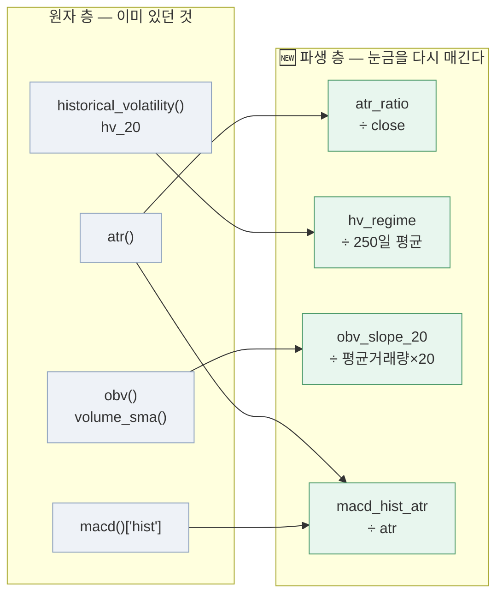

# 파생 피처 4개 — 무엇을 재고, 언제까지의 자료를 쓰나 (v1.1)

> 2026-09-07 · 문서 이동원 · **코드는 신장환 님**([PR #147](https://github.com/devlee328288/Alpha_Stack/pull/147) · 머지됨)
> 코드와 PR 이 정본입니다. 여기 적힌 것과 코드가 다르면 **코드가 맞습니다.**
> 이 문서가 보태는 것은 ① docstring 에 흩어진 **시점 규칙을 한자리에** 모은 것과
> ② 데이터 파트가 **직접 돌려 재현한 실측**입니다.

---

## 0. 한 줄로

`atr_ratio` · `hv_regime` · `obv_slope_20` · `macd_hist_atr` 넷은 전부 **"이미 있는 지표를
비교 가능한 눈금으로 다시 매긴 것"** 입니다. 원자 지표는 종목마다·시기마다 스케일이 달라
그대로 모델에 넣으면 삼성전자의 ATR 3,000원과 소형주의 ATR 300원이 같은 축에서 비교됩니다.
넷 다 **자기 자신의 다른 값으로 나눠** 그 문제를 지웁니다.

넷 다 **미래를 보지 않습니다.** 다만 **워밍업 길이가 크게 다릅니다** — 특히 `hv_regime` 은
앞 **269행**이 비어 개발구간의 7.6%가 학습에서 빠집니다(§3).

---

## 1. 무엇으로 무엇을 나누나

| 피처 | 어디 | 식 | 나누는 이유 |
|---|---|---|---|
| `atr_ratio` | `features/volatility.py:226` | `atr_t / close_t` | ATR 은 **가격 단위(원)** 다. 종가로 나누면 "가격의 몇 %가 하루에 움직이나" 가 된다 |
| `hv_regime` | `features/volatility.py:247` | `hv20_t / mean(hv20, 250일)` | 자기 자신의 **최근 이력**으로 나눈다. 1보다 크면 평소보다 시끄러운 국면 |
| `obv_slope_20` | `features/volume.py:153` | `(obv_t − obv_{t-20}) / (vol_sma20_t × 20)` | OBV 는 **누적값**이라 거래대금 규모에 비례한다. 하루 평균 거래량으로 나눈다 |
| `macd_hist_atr` | `features/indicators.py:269` | `macd_hist_t / atr_t` | 분모가 **가격이 아니라 변동성**이다. "이 신호가 그날 출렁임에 비해 얼마나 센가" |



🔴 `macd_hist_atr` 만 **화살표가 둘**입니다. `indicators.py` 는 `volatility.py` 를 import
하지 않는다는 원칙(세 원자 파일이 서로 독립)이라, `atr` 을 **인자로 받습니다.** 부르는 쪽이
같은 창으로 만든 `atr` 을 넘겨야 합니다.

```python
from features.volatility import atr
from features.indicators import macd_hist_atr

a = atr(high, low, close, window=14)
x = macd_hist_atr(close, a)          # ← atr 을 넘긴다. 안에서 만들지 않는다
```

---

## 2. 시점 규칙 — 넷 다 미래를 안 본다

`supply/` 의 `as_of` 규약과 별개로, **피처 계산 자체가 t 시점까지만 보는가**를 봅니다.
아래는 각 함수 docstring 에 적힌 근거를 옮긴 것입니다.

| 피처 | t 시점에 쓰는 것 | 근거 |
|---|---|---|
| `atr_ratio` | `atr_t`(t 까지의 True Range 를 Wilder 평활) ÷ `close_t`(자기 자신) | 둘 다 t 이하 |
| `hv_regime` | `hv20_t`(t 까지 로그수익률) ÷ `mean(hv20)`(t 까지의 **과거 hv20** 250개) | **두 단계 모두** t 이하 |
| `obv_slope_20` | `obv_t` · `obv_{t-20}`(t 까지 누적) ÷ `vol_sma20_t`(t 까지 평균) | 전부 t 이하 |
| `macd_hist_atr` | `hist_t`(EMA 재귀 — 형태상 t 까지 전체 이력에 의존하나 미래는 아님) ÷ `atr_t` | 인자로 받는 `atr` 도 t 이하여야 **부르는 쪽 책임** |

🔴 `macd_hist_atr` 만 **호출하는 쪽이 규칙을 깰 수 있습니다.** `atr` 을 밖에서 만들어 넘기므로,
거기에 미래가 섞인 값을 넣으면 이 함수는 막지 못합니다. 조립 층에서 같은 창의 `atr` 을
넘기는 것이 규약입니다.

---

## 3. 🔬 데이터 파트 재현 — 워밍업이 크게 다르다

코스피200 개발구간 **3,553행**(20100330 ~ 20240822 · HF `small/features_labels_kospi200_dev.csv`)
으로 직접 돌렸습니다.

| 피처 | 유효행 | **워밍업(첫 유효 인덱스)** | 최소 | 최대 | 평균 |
|---|--:|--:|--:|--:|--:|
| `atr_ratio` | 3,540 | **13** | 0.0068 | 0.0536 | 0.0135 |
| `hv_regime` | 3,284 | 🔴 **269** | 0.3696 | 4.3681 | 1.0257 |
| `obv_slope_20` | 3,533 | **20** | −0.6612 | 0.8591 | 0.0455 |
| `macd_hist_atr` | 3,520 | **33** | −0.7039 | 0.6998 | 0.0022 |

### 🔴 `hv_regime` 은 앞 269행을 버린다 — 개발구간의 7.6%

docstring 이 예고한 그대로입니다 — `window + regime_window − 1 = 20 + 250 − 1 = 269`.
`hv_20` 의 워밍업 구간(`nan`)이 250일 평균 창에 섞이면 그 창도 `nan` 이 되기 때문입니다.

**무엇을 뜻하나** — `hv_regime` 을 X조합에 넣으면 **2010-03-30 부터 약 13개월치**가 학습에서
빠집니다. 다른 셋(13·20·33행)과 섞어 쓰면 **유효 표본이 가장 짧은 것에 맞춰집니다.**

| 조합 | 유효 표본 |
|---|--:|
| `hv_regime` 없이 셋만 | 3,520행 (99.1%) |
| `hv_regime` 포함 넷 | **3,284행 (92.4%)** |

236행 차이입니다. 모델 파트가 조합을 정할 때 **정확도만이 아니라 표본 손실도 함께** 보시면
됩니다. `regime_window` 를 줄이면(예: 120일) 워밍업이 139행으로 짧아집니다 — 다만 "평소"를
재는 기준 기간이 짧아지니 그건 모델 파트 판단입니다.

### 🔬 `atr_ratio` ↔ `hv_20` 상관 — 재현했습니다

신장환 님이 [#37 댓글](https://github.com/devlee328288/Alpha_Stack/issues/37)에서 **0.926**
이라고 하신 것을 같은 자료로 다시 쟀습니다.

```
atr_ratio ↔ hv_20 (annualize=False)  상관계수 0.9321   유효 3,533행
```

**0.9321 vs 0.926 — 결론은 같습니다.** 소수 셋째 자리 차이는 표본 구간·유효행 처리에서 옵니다.
둘 다 "최근 며칠간 얼마나 출렁였나" 를 재는 **같은 변동성 축**이고, X조합에 함께 넣으면 같은
정보를 두 번 넣는 셈이라는 판단이 실측으로 확인됩니다.

> 🔴 **어느 하나를 고르는 것은 모델 파트 결정**입니다(#37). 데이터 파트는 재현까지만 합니다.

---

## 4. 시험

| 파일 | 무엇 |
|---|---|
| `tests/test_features_volatility.py` | `atr_ratio` · `hv_regime` |
| `tests/test_features_indicators.py` | `macd_hist_atr` (길이 불일치 `ValueError` 포함) |
| `tests/test_features_volume.py` | `obv_slope_20` |
| `tests/test_supply_features_contract.py` | 조립 층 계약 |

네 파일 **216 passed · 3 xfailed** (2026-09-07 · anaconda 3.12.13).

---

## 5. 남은 것

| 무엇 | 누구 | 어디 |
|---|---|---|
| `atr_ratio` 와 `hv_20` 중 **어느 하나를 고를지** | 모델 파트 | [#37](https://github.com/devlee328288/Alpha_Stack/issues/37) |
| `hv_regime` 의 `regime_window` 를 250 그대로 둘지 (표본 236행 손실) | 모델 파트 | 이 문서 §3 |
| 넷을 **반출 피처 표에 넣을지** — 넣으면 HF 반출 규격이 바뀐다 | 데이터 파트 · 합의 후 | — |
