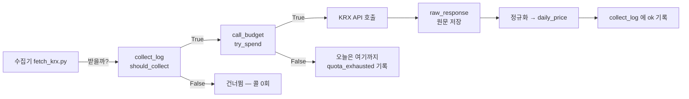

# 핵심코드 ① — 수집: 대장·예산·원문 보존

> 이 문서는 코드를 안 열어 본 팀원이 **줄 단위로 따라 읽을 수 있게** 쓴 해설입니다.
> 발췌는 실제 코드 그대로이고, 정본은 링크된 파일입니다 (2026-09-02 기준).
> 전체 그림: [데이터파트 v3.0 명세서](../../데이터파트/version3.0/명세서.md)

수집 계층이 답하는 질문은 세 가지입니다.

1. **이걸 지금 받아야 하나?** → 수집 대장 `collect_log`
2. **오늘 더 불러도 되나?** → 호출 예산 `call_budget`
3. **나중에 규칙이 틀린 걸 알면?** → 응답 원문 `raw_response`

---

## 1. "이미 받은 것은 다시 받지 않는다" — `should_collect`

정본: [`ingest/store/collect_log.py`](../../../ingest/store/collect_log.py)

16년치 백필은 시장당 4,343콜입니다. 중간에 죽거나 한도에 걸려 다시 돌릴 때,
**받은 날짜를 다시 요청하면 한도만 낭비**됩니다. 그래서 모든 수집기는 요청 전에
이 함수에게 먼저 물어봅니다.

```python
def should_collect(source: str, target: str, *,
                   max_attempts: int = DEFAULT_MAX_ATTEMPTS,
                   empty_recheck_days: int = 0,
                   db_path: Optional[Path] = None) -> bool:
    row = entry(source, target, db_path=db_path)   # 대장에서 이 대상의 줄을 찾는다
    if row is None:
        return True                                # ① 한 번도 안 받았다 → 받는다

    status = row["status"]
    if status == EMPTY and empty_recheck_days > 0:
        if _days_since(row["last_attempted_at"]) < empty_recheck_days:
            return True                            # ② 최근의 0건은 아직 못 믿는다 → 다시
    if status in SETTLED:
        return False                               # ③ 답을 이미 들었다 → 안 받는다
    if status == ERROR:
        return int(row["attempts"] or 0) < max_attempts   # ④ 실패는 3회까지만
    return True                                    # ⑤ 한도 소진 — 예산이 풀리면 받는다
```

한 줄씩 풀면:

- **①** `row is None` — 대장에 줄이 없으면 시도한 적이 없는 것입니다. 받습니다.
- **②** 가 이 함수에서 가장 미묘한 줄입니다. `EMPTY`(받아 봤더니 0건)는 보통
  휴장일이라 다시 안 받는 게 맞는데, **장 마감 전에 받은 0건**은 휴장이 아니라
  "아직 안 올라온 것"일 수 있습니다. 그 0건을 영원한 휴장으로 굳히면 그날 자료가
  평생 비게 됩니다. `empty_recheck_days=1` 처럼 주면 최근 0건만 한 번 더 열어 봅니다.
- **③** `SETTLED` 는 `ok`(받았다) · `empty`(휴장 확정) · `out_of_range`(출처가 그
  기간을 안 준다)의 묶음입니다. 셋 다 **"다시 물어도 답이 같은"** 상태라 건너뜁니다.
- **④** 실패(`error`)만 재시도 대상이고 3회에서 끊습니다. 무한 재시도는 같은 벽을
  계속 두드리는 것이라, 3회 뒤에는 사람이 원인을 봐야 합니다.
- **⑤** `quota_exhausted`(한도 소진)는 **우리 잘못이 아니므로** 시도 횟수를 먹지
  않습니다. 예산이 다시 생기는 내일이 되면 그냥 받습니다.

> 💡 **왜 다섯 상태나 두나?** `empty` 와 `error` 를 하나로 합치면 휴장일마다 "실패니까
> 재시도"가 되어 매일 헛 호출이 나갑니다. 상태를 가르는 것이 곧 호출을 아끼는 것입니다.

---

## 2. "서버가 거절하기 전에 우리가 먼저 센다" — `try_spend`

정본: [`common/budget.py`](../../../common/budget.py)

KRX 는 인증키당 **하루 10,000회**입니다(이용약관 제8조 ④). 넘기면 그날 수집이
전부 막히므로, 서버 응답으로 아는 게 아니라 **우리 장부로 미리** 셉니다.

```python
def try_spend(source: str, n: int = 1, *, limit=None, db_path=None) -> bool:
    ...
    conn.execute("BEGIN IMMEDIATE")            # ① 잠금을 먼저 잡는다
    used, ceiling_db, warned_at = _row(conn, source, kst_date, ceiling)

    if used + n > ceiling:
        conn.execute("COMMIT")
        return False                           # ② 오늘은 여기까지 — 예외가 아니다

    after = used + n
    conn.execute("UPDATE call_budget SET used=? WHERE source=? AND kst_date=?",
                 (after, source, kst_date))    # ③ 부르기 전에 장부부터 쓴다
```

- **①** `BEGIN IMMEDIATE` 가 핵심입니다. 잠금 없이 "읽고 → 판단하고 → 쓰면",
  두 프로세스가 동시에 읽어 **둘 다 "여유 있다"고 판단**하고 한도를 넘깁니다.
  잠금을 먼저 잡으면 한 번에 한 프로세스만 장부를 만집니다.
- **②** 한도 도달은 `False` 반환이지 예외가 아닙니다. 실패가 아니라 *"오늘은
  여기까지"* 라는 정상 신호라서입니다. 호출하는 쪽은 루프를 얌전히 빠져나가고,
  대장에는 `quota_exhausted` 가 남아 내일 이어받습니다.
- **③** **부르기 전에** 셉니다. 부르고 나서 세면, 응답을 못 받고 프로세스가 죽었을 때
  이미 나간 호출이 장부에 안 남아 한도를 넘겨 쓰게 됩니다. 세고 나서 실제 호출이
  실패하면 손해는 1콜뿐 — 어느 쪽 오차가 싼지를 정한 것입니다.

---

## 3. "다시 받지 않고 다시 만든다" — 원문 보존

정본: [`common/raw_store.py`](../../../common/raw_store.py) · 표 `raw_response`

정규화 규칙이 틀린 것은 꼭 **나중에** 발견됩니다. 그때 원문이 없으면 한도를 쓰며
다시 받아야 하고, 출처가 과거를 안 주면 되돌릴 수 없습니다. 그래서 모든 응답의
원문을 zstd 로 압축해 SHA-256 과 함께 남기고, 재정규화는 원문에서 다시 만듭니다.

⚠️ 한 번 밟은 함정: 초기 재정규화가 **수집 시각을 현재로 덮어썼습니다.** 그러면
대장이 "방금 받았다"고 말하는데 실제로는 며칠 전 자료입니다. 지금은 재정규화가
수집 시각을 건드리지 않습니다 — *"언제 받았나"* 는 받은 그 순간만이 알기 때문입니다.

---

## 4. 셋이 함께 도는 모습



순서가 중요합니다 — **대장 → 예산 → 호출 → 원문 → 정규화 → 대장.**
대장을 안 보면 헛 호출이 나가고, 예산을 안 보면 한도를 넘기고, 원문을 안 남기면
규칙 수정 때 다시 받아야 합니다.
