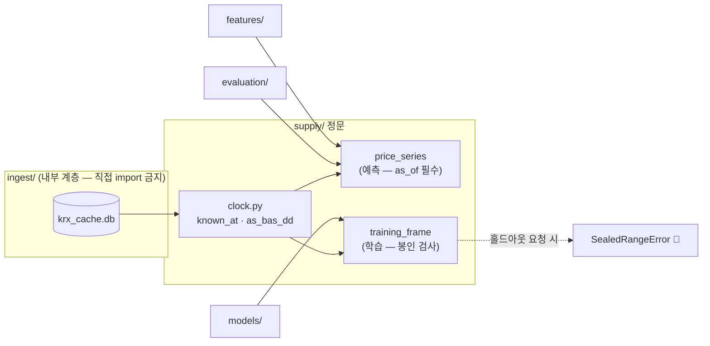

# 핵심코드 ③ — 공급 정문: `as_of` 가 미래를 막는 방법

> 줄 단위 해설입니다. 정본은 [`supply/`](../../../supply/__init__.py) 네 모듈입니다.
> 아키텍처에서의 위치: [아키텍처 v1.2](../../아키텍처/version1.2/아키텍처.md)

피처·모델·평가는 DB 를 직접 읽지 않고 **`supply/` 문 하나**를 지납니다.
이 문의 규칙은 단 하나입니다 — **`as_of`(언제 시점에서 보나)를 내지 않으면 열리지
않는다.** 왜 이렇게까지 하는지부터 봅니다.

## 0. 왜 문이 필요한가 — 미래는 예외를 던지지 않는다

저장소에는 **오늘까지의** 자료가 들어 있습니다. 2020년 폴드를 학습하면서 표를
그대로 쓰면 2021~2026년 값이 함께 들어가고, **아무 에러도 나지 않습니다.**
성능만 좋아집니다. 좋아 보이는 쪽으로 틀리는 버그는 사람이 못 잡습니다.
그래서 규칙을 문서에 적는 대신 **코드가 강제**합니다 — `as_of` 는 기본값이 없어서
빠뜨리면 그 자리에서 터집니다. 게다가 `features/`·`models/`·`evaluation/` 이
`ingest` 를 직접 import 하면 **테스트가 실패**합니다(`tests/test_supply_boundary.py`).

## 1. "언제부터 알 수 있었나" — `known_at`

정본: [`supply/clock.py`](../../../supply/clock.py)

```python
def known_at(bas_dd: str) -> datetime:
    """거래일 YYYYMMDD 의 시세를 언제부터 알 수 있었나."""
    if len(bas_dd) != 8 or not bas_dd.isdigit():
        raise ValueError(f"거래일은 YYYYMMDD 여야 한다: {bas_dd!r}")
    day = date(int(bas_dd[:4]), int(bas_dd[4:6]), int(bas_dd[6:]))
    return datetime.combine(day + timedelta(days=1), time.min, tzinfo=KST)
```

거래일 T 의 시세는 **T+1 의 0시(KST)부터** 알 수 있었다고 봅니다. 근거는 실측입니다 —
2026-08-26 에 장 마감(15:30) 40분 뒤인 16:10 에 당일 자료를 요청하니 **0행**이었습니다.
정확히 몇 시에 올라오는지는 재지 않았고, **재지 않은 값을 가정으로 쓰지 않으므로**
하루를 통째로 미룹니다. 이 선택은 항상 진실보다 늦은 쪽이라, 틀려도 성능을
부풀리는 방향으로는 틀리지 않습니다.

> ⚠️ 이 값을 앞당기고 싶으면 **실측부터** 합니다. 앞당기는 방향이 곧 누수 방향입니다.

## 2. 표기 함정 — 하이픈은 0 보다 작다

정본: [`supply/clock.py`](../../../supply/clock.py) 의 `as_bas_dd`

```python
min('2026-08-21', '20260825')   # → '2026-08-21'  (뜻과 무관하게 항상 하이픈 쪽이 이긴다)
```

`'-'`(0x2D)가 `'0'`(0x30)보다 작아서, ISO 표기와 `YYYYMMDD` 표기를 그냥 비교하면
**답이 표기 순으로 정해집니다.** 그 값이 `bas_dd <= ?` 에 들어가면 결과가 0행이
되는데 예외는 안 납니다 — 빈 표를 받은 쪽은 "그 구간에 자료가 없구나"로 읽습니다.
그래서 문에 들어오는 날짜는 전부 `as_bas_dd()` 로 `YYYYMMDD` 하나로 맞춥니다.
표기를 하나로 만들면 이 실수 자체가 불가능해집니다.

## 3. 문이 둘인 이유 — 예측 경로와 학습 경로

정본: [`supply/market.py`](../../../supply/market.py) · [`supply/training.py`](../../../supply/training.py)

| 문 | 언제 | 무엇이 다른가 |
|---|---|---|
| `price_series` · `index_series` | **예측할 때** | `as_of` 시점에 알 수 있었던 것만. 미래를 절대 안 준다 |
| `training_frame` | **학습할 때** | 라벨(미래 수익률)을 만들기 위해 **여기서만** 미래를 본다 |

처음엔 한 함수에 `include_future=True` 같은 손잡이를 두는 안이 있었는데,
**손잡이는 언젠가 켜진 채로 지나갑니다.** 그래서 함수 이름 자체를 갈랐습니다 —
코드 리뷰에서 `training_frame` 이 예측 경로에 있으면 이름만 보고 잡을 수 있습니다.

학습 경로 안에도 봉인이 있습니다. `training_frame(code, *, holdout_start=...)` 의
`holdout_start` 는 **키워드 전용이고 기본값이 없어서** 빠뜨리면 그 자리에서 터지고,
값을 주면 그 날짜 이후 행을 잘라낸 뒤 **몇 행을 잘랐는지**(`dropped["holdout"]`)를
함께 돌려줍니다. 전 구간이 필요하면 `holdout_start=None` 을 **명시적으로** 적어야
합니다 — "깜빡해서 전 구간"이 불가능한 모양입니다.

> ⚠️ 옛 문서(요구사항 F-04 · 데이터파트 v2.1)에는 봉인이 `SealedRangeError` 예외로
> 구현된 것처럼 적혀 있는데, **그 예외는 코드에 없습니다**(2026-09-02 grep 전수).
> 실물은 위의 "기본값 없는 키워드 인자 + 행 제거 + 제거량 보고" 방식입니다.

## 4. 흐름 한 장



## 5. 이 설계가 지키는 약속 (테스트가 못박은 것)

- `as_of` 없이 부르면 터진다 — `tests/test_supply_boundary.py`
- 상류 계층이 `ingest` 를 import 하면 테스트가 실패한다 — 같은 파일
- 빈 결과에도 컬럼 구조가 남는다 — `tests/test_supply_price.py`
  (빈 DataFrame 에 컬럼이 없으면 하류의 `df["close"]` 가 다른 이유로 터져 원인을 가린다)
