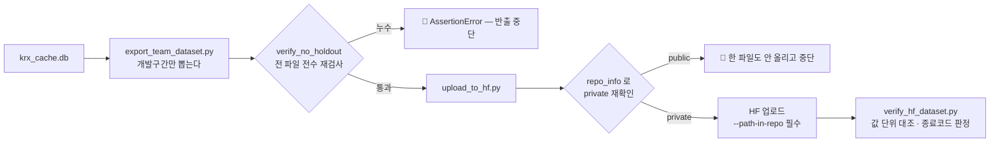

# 핵심코드 ④ — 반출과 HF 배포: 봉인을 두 번 잠그는 법

> 줄 단위 해설입니다. 정본:
> [`scripts/export_team_dataset.py`](../../../scripts/export_team_dataset.py) ·
> [`scripts/upload_to_hf.py`](../../../scripts/upload_to_hf.py) ·
> [`scripts/verify_hf_dataset.py`](../../../scripts/verify_hf_dataset.py) ·
> [`scripts/check_hf_access.py`](../../../scripts/check_hf_access.py)

팀원에게 자료를 건네는 길은 **HuggingFace private 데이터셋**입니다
(`qurious-quant/alphastack-krx-dev` · `alphastack-dart`). 파일은 HF 에 두고,
저장소에는 **만드는 방법**만 커밋합니다. 이 길에는 지켜야 할 봉인이 둘 있습니다 —
**홀드아웃**(모델 검증의 봉인)과 **private**(KRX 약관의 봉인).

---

## 1. 홀드아웃 봉인 — 각자 자르게 두지 않고 마지막에 전수 검사

정본: `export_team_dataset.py` 의 `verify_no_holdout`

```python
def verify_no_holdout(root: Path) -> int:
    """내보낸 모든 파일을 다시 열어 홀드아웃이 섞이지 않았는지 확인한다."""
    검사한 = 0
    for path in sorted(root.rglob("*")):              # ① 반출 폴더의 전 파일을
        if path.suffix == ".csv":
            df = pd.read_csv(path, usecols=["bas_dd"], dtype={"bas_dd": str})
        elif path.suffix == ".parquet":
            df = pd.read_parquet(path, columns=["bas_dd"])
        else:
            continue
        가장늦은 = str(df["bas_dd"].astype(str).max())  # ② 날짜 칸만 다시 읽어
        if 가장늦은 >= HOLDOUT_START:                   # ③ 경계와 대조한다
            raise AssertionError(f"🔴 홀드아웃 누수 — {path.name} ...")
        검사한 += 1
    return 검사한
```

- **왜 마지막에 다시 여나?** 반출물을 만드는 함수가 여럿이고 각자 자르게 두면,
  언젠가 한 곳이 빠집니다. 봉인 구간이 **한 번이라도** 팀원 손에 들어가면
  "미리 정해 두고 딱 한 번 열어본다"는 검증 프레이밍이 무너지고 되돌릴 수 없습니다.
  그래서 각 함수를 믿지 않고, 완성된 파일을 **전부 다시 열어** 검사합니다.
- **②** 파일 전체가 아니라 `bas_dd` 칸만 읽습니다 — 검사에 필요한 최소만 읽어
  수 GB 파일에서도 빠르게 돕니다.
- 경계 상수는 정본(`evaluation/horizon.py` 의 `HOLDOUT_START`)에서 **import** 합니다.
  반출 쪽에 `"20210831"` 같은 사본 상수를 두면 정본이 바뀔 때 사본이 낡은 채
  남습니다 — 실제로 그런 죽은 상수가 있어 PR #71 이 계산식으로 바꿨습니다.

## 2. private 봉인 — 만들었다고 믿지 않고 서버에 다시 묻는다

정본: `upload_to_hf.py`

```python
api.create_repo(repo_id=args.repo, repo_type="dataset", private=True, exist_ok=True)

# 🔴 만들었다고 믿지 않는다. 서버에 다시 물어본다.
info = api.repo_info(repo_id=args.repo, repo_type="dataset")
if not info.private:
    print("🔴 중단 — 이 데이터셋이 public 이다. KRX 원자료를 올릴 수 없다.")
    return 1
```

`private=True` 로 **만들었는데 왜 다시 확인하나?** `exist_ok=True` 라서, 이미 있는
레포에 붙을 때는 그 레포가 public 이어도 **그냥 성공**하기 때문입니다. 1번 줄이
실패하지 않았다는 것이 private 이라는 뜻이 아닙니다. KRX 이용약관 제11조 ②(제3자
제공 금지) 위반은 되돌릴 수 없으므로, 올리기 전에 서버의 실제 상태를 봅니다.

## 3. `--path-in-repo` — 루트를 덮어쓰지 않기

한 레포에 성격이 다른 반출(시세 · 재무 pit/bulk)이 함께 삽니다. `--path-in-repo` 를
안 주면 **루트에 올라가 기존 README.md·MANIFEST.json 을 덮어씁니다** — 실제로 겪고
회수한 사고라, 지금은 도움말에 🔴 로 박아 두었습니다.

## 4. 재배포 판정 — 사람이 아니라 스크립트가 답한다

정본: `verify_hf_dataset.py` — HF 파일을 받아 지금 DB·지금 코드와 값으로 대조하고
**종료코드로** 답합니다(0 = 이미 최신). 판정 기준은 코드에 못박혀 있습니다.

- **1 ULP 안쪽 차이는 표기의 한계** — CSV 가 float64 를 온전히 못 담아 생기는
  마지막 비트 차이는 "변화"가 아닙니다.
- **결측이 엇갈리면 크기와 무관하게 자료의 변화** — `NaN` 과 `0.0` 이 몇 ULP
  떨어져 있다고는 말할 수 없기 때문입니다.

재배포하는 경우는 셋뿐입니다 — ① 홀드아웃 경계 이동(#63·PR #71) ② 개발구간 값
변경(#51 수정주가) ③ 반출 규격 변경. **새 시세가 쌓였다는 것만으로는 올리지
않습니다** — 개발구간 상한이 있어 파일이 바뀌지 않기 때문입니다.

## 5. 팀원이 못 받을 때 — 진단도 코드로

정본: `check_hf_access.py` — 토큰 → 로그인 → 조직 멤버십 → 레포 접근 → 파일 존재를
**한 단계씩** 짚고, 막힌 자리에서 *무엇을 해야 하는지*까지 출력합니다.
`repo_type="dataset"` 누락과 경로 접두사 누락이 **둘 다 404 로 똑같이 보이기**
때문에, 사람이 에러 메시지만 보고는 원인을 가를 수 없습니다.

## 6. 흐름 한 장


