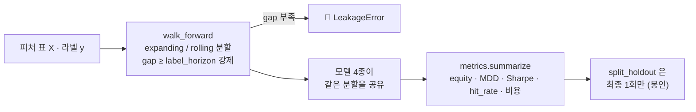

# 핵심코드 ⑦ — 평가: 레이블 지평만큼 띄우지 않으면 누수다

> 줄 단위 해설입니다. 정본: [`evaluation/`](../../../evaluation/__init__.py)
> (`walk_forward.py` · `metrics.py` · `horizon.py` · `baseline.py`).
> 백테스트 실무·성과지표 문서는 **강민석 님** 담당입니다
> ([backtest-features](../../../notebooks/05-백테스트·성과/) · PR #57·#68).
> 문서화 담당(이동원)이 코드를 *참고해* 쓴 해설이고, 코드는 건드리지 않습니다.

시계열 검증의 전부는 **"학습이 검증의 답을 미리 보지 않았는가"** 입니다.
`evaluation/` 은 그 규칙을 사람의 주의력이 아니라 **예외**로 지킵니다.

---

## 1. 인덱스가 안 겹쳐도 누수다 — `LeakageError`

정본: `evaluation/walk_forward.py`

```python
class LeakageError(RuntimeError):
    """학습 구간과 검증 구간이 **레이블을 통해** 겹칠 때 던진다."""
```

흔한 오해: *"학습은 1~100행, 검증은 101~120행이니 안 겹친다."*
그러나 **레이블이 미래를 보고 만들어집니다.** t=100 행의 레이블이 t+5 가격으로
만들어졌다면, 학습 마지막 행은 이미 t=105 를 알고 있습니다. 검증이 t=101 에서
시작하면 학습이 검증의 답을 본 것입니다.

그래서 폴드 사이에 **`gap`(간격)** 을 둡니다. 규칙은 셋뿐입니다.

```python
# 1. gap 을 안 주면 label_horizon 과 같게 둔다 (누수 없는 최솟값)
# 2. label_horizon 을 안 주면 horizon 으로 본다
# 3. gap < label_horizon 이면 LeakageError. allow_leakage=True 일 때만 통과
```

- **기본값이 안전한 쪽**입니다. 아무것도 모르고 호출해도 누수가 없고, 위험한
  쪽(`allow_leakage=True`)을 **원할 때만 명시**하게 만들었습니다 — 누수는 예외를
  내지 않고 성능만 올리므로, 설계가 기본값으로 막아야 합니다.
- ⚠️ `horizon`(한 폴드의 검증창 길이)과 `label_horizon`(레이블이 앞을 보는
  거리)은 **다른 값**입니다. 우리 프로젝트는 둘 다 5 라 헷갈리기 쉽습니다.

## 2. 확장창과 롤링창 — 둘 다 두는 이유

```python
expanding_splits(...)   # 학습 시작 고정, 끝만 앞으로 — 자료가 많을수록 좋다고 볼 때
rolling_splits(...)     # 학습 길이 고정, 창을 민다 — 옛 자료가 해롭다고 볼 때
```

`rolling_splits` 의 `train_size` 는 **그 자체가 실험 대상인 가정**입니다 — 시장
국면이 바뀌면 5년 전 관계는 지금과 다르므로, 값을 바꿔 가며 결과가 얼마나
흔들리는지 보는 것이 하나의 실험입니다.

## 3. 홀드아웃 경계 — 상수 하나가 정본

정본: `evaluation/horizon.py`

```python
#: 봉인 홀드아웃 시작일. 이 앞이 개발구간이다.
HOLDOUT_START = "20210901"      # ← PR #71 에서 "20240901" 로 변경 진행 중 (#63)

def split_dev(rows, holdout_start=HOLDOUT_START):
    """개발구간만 남긴다. 홀드아웃을 보려면 명시적으로 split_holdout 을 불러야 한다."""
```

- 경계는 **이 상수 한 곳**에만 삽니다. 반출(`export_team_dataset`)도 공급
  (`supply/training`)도 여기서 import 합니다. 사본 상수를 두면 정본이 바뀔 때
  사본이 낡습니다.
- 홀드아웃 5년은 재무 자료의 54.6%를 학습에서 빼는 과한 봉인이라는 실측(#63)으로
  **2년(20240901)으로 확정**됐고, 코드 반영이 PR #71 입니다.

## 4. 지표 — hit_rate 가 말해 주지 않는 것

정본: `evaluation/metrics.py` — `equity_curve` · `max_drawdown` · `sharpe_ratio` ·
`hit_rate` · `apply_cost` · `summarize`.

- `hit_rate(predicted, actual)` 는 **중립을 분모에서 뺍니다.** 라벨을 −1/0/+1 로
  쓰면 중립 38.69% 가 빠진 값이라, 52.64% 같은 숫자를 "정확도"로 읽으면
  안 됩니다 (이슈 #33). 이 함정이 평가축 재설계 논의의 출발점이었습니다.
- `apply_cost` — 포지션이 바뀔 때마다 거래비용을 뺍니다. 비용 없는 수익률 곡선은
  회전율이 높은 전략을 실제보다 좋게 보이게 합니다.
- `summarize` 가 위 지표를 한 번에 묶어, 모델 4종 비교표가 **같은 계산식**으로
  만들어지게 합니다.

## 5. 흐름 한 장


