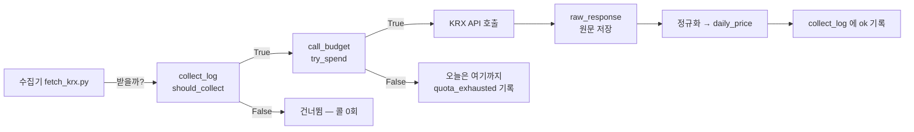

# 핵심코드 ① — 수집: 대장·예산·원문 보존

> 이 문서는 코드를 안 열어 본 팀원이 **줄 단위로 따라 읽을 수 있게** 쓴 해설입니다.
> 발췌는 실제 코드 그대로이고, 정본은 링크된 파일입니다 (v1.0 2026-09-02 · v1.1 2026-09-04 §2.5 추가 ·
> 🆕 v1.2 2026-09-07 §5 추가 — 지수 기본키에 시장).
> 전체 그림: [데이터파트 v3.9 명세서](../../데이터파트/version3.9/명세서.md)

수집 계층이 답하는 질문은 세 가지입니다.

1. **이걸 지금 받아야 하나?** → 수집 대장 `collect_log`
2. **오늘 더 불러도 되나?** → 호출 예산 `call_budget`
3. **나중에 규칙이 틀린 걸 알면?** → 응답 원문 `raw_response`

---

## 1. "이미 받은 것은 다시 받지 않는다" — `should_collect`

정본: [`ingest/store/collect_log.py`](../../../ingest/store/collect_log.py)

16년치 백필은 시장당 4,343콜입니다. 중간에 죽거나 한도에 걸려 다시 돌릴 때,
**받은 날짜를 다시 요청하면 한도만 낭비**됩니다. 그래서 모든 수집기는 요청 전에
이 함수에게 먼저 물어봅니다.

```python
def should_collect(source: str, target: str, *,
                   max_attempts: int = DEFAULT_MAX_ATTEMPTS,
                   empty_recheck_days: int = 0,
                   db_path: Optional[Path] = None) -> bool:
    row = entry(source, target, db_path=db_path)   # 대장에서 이 대상의 줄을 찾는다
    if row is None:
        return True                                # ① 한 번도 안 받았다 → 받는다

    status = row["status"]
    if status == EMPTY and empty_recheck_days > 0:
        if _days_since(row["last_attempted_at"]) < empty_recheck_days:
            return True                            # ② 최근의 0건은 아직 못 믿는다 → 다시
    if status in SETTLED:
        return False                               # ③ 답을 이미 들었다 → 안 받는다
    if status == ERROR:
        return int(row["attempts"] or 0) < max_attempts   # ④ 실패는 3회까지만
    return True                                    # ⑤ 한도 소진 — 예산이 풀리면 받는다
```

한 줄씩 풀면:

- **①** `row is None` — 대장에 줄이 없으면 시도한 적이 없는 것입니다. 받습니다.
- **②** 가 이 함수에서 가장 미묘한 줄입니다. `EMPTY`(받아 봤더니 0건)는 보통
  휴장일이라 다시 안 받는 게 맞는데, **장 마감 전에 받은 0건**은 휴장이 아니라
  "아직 안 올라온 것"일 수 있습니다. 그 0건을 영원한 휴장으로 굳히면 그날 자료가
  평생 비게 됩니다. `empty_recheck_days=1` 처럼 주면 최근 0건만 한 번 더 열어 봅니다.
- **③** `SETTLED` 는 `ok`(받았다) · `empty`(휴장 확정) · `out_of_range`(출처가 그
  기간을 안 준다)의 묶음입니다. 셋 다 **"다시 물어도 답이 같은"** 상태라 건너뜁니다.
- **④** 실패(`error`)만 재시도 대상이고 3회에서 끊습니다. 무한 재시도는 같은 벽을
  계속 두드리는 것이라, 3회 뒤에는 사람이 원인을 봐야 합니다.
- **⑤** `quota_exhausted`(한도 소진)는 **우리 잘못이 아니므로** 시도 횟수를 먹지
  않습니다. 예산이 다시 생기는 내일이 되면 그냥 받습니다.

> 💡 **왜 다섯 상태나 두나?** `empty` 와 `error` 를 하나로 합치면 휴장일마다 "실패니까
> 재시도"가 되어 매일 헛 호출이 나갑니다. 상태를 가르는 것이 곧 호출을 아끼는 것입니다.

---

## 2. "서버가 거절하기 전에 우리가 먼저 센다" — `try_spend`

정본: [`common/budget.py`](../../../common/budget.py)

KRX 는 인증키당 **하루 10,000회**입니다(이용약관 제8조 ④). 넘기면 그날 수집이
전부 막히므로, 서버 응답으로 아는 게 아니라 **우리 장부로 미리** 셉니다.

```python
def try_spend(source: str, n: int = 1, *, limit=None, db_path=None) -> bool:
    ...
    conn.execute("BEGIN IMMEDIATE")            # ① 잠금을 먼저 잡는다
    used, ceiling_db, warned_at = _row(conn, source, kst_date, ceiling)

    if used + n > ceiling:
        conn.execute("COMMIT")
        return False                           # ② 오늘은 여기까지 — 예외가 아니다

    after = used + n
    conn.execute("UPDATE call_budget SET used=? WHERE source=? AND kst_date=?",
                 (after, source, kst_date))    # ③ 부르기 전에 장부부터 쓴다
```

- **①** `BEGIN IMMEDIATE` 가 핵심입니다. 잠금 없이 "읽고 → 판단하고 → 쓰면",
  두 프로세스가 동시에 읽어 **둘 다 "여유 있다"고 판단**하고 한도를 넘깁니다.
  잠금을 먼저 잡으면 한 번에 한 프로세스만 장부를 만집니다.
- **②** 한도 도달은 `False` 반환이지 예외가 아닙니다. 실패가 아니라 *"오늘은
  여기까지"* 라는 정상 신호라서입니다. 호출하는 쪽은 루프를 얌전히 빠져나가고,
  대장에는 `quota_exhausted` 가 남아 내일 이어받습니다.
- **③** **부르기 전에** 셉니다. 부르고 나서 세면, 응답을 못 받고 프로세스가 죽었을 때
  이미 나간 호출이 장부에 안 남아 한도를 넘겨 쓰게 됩니다. 세고 나서 실제 호출이
  실패하면 손해는 1콜뿐 — 어느 쪽 오차가 싼지를 정한 것입니다.

---

### 2.5 🆕 같은 키는 같은 통 — 그리고 예탁결제원은 검사가 예산보다 먼저 (v1.1)

정본: [`common/budget.py`](../../../common/budget.py) 의 `LIMITS` ·
[`ingest/clients/ksd_data.py`](../../../ingest/clients/ksd_data.py) 의 `validate_params`

```python
LIMITS: Dict[str, int] = {
    "krx": 10_000,
    "dart": 20_000,
    "data_go_kr": 10_000,     # 금융위(1160100)와 예탁결제원(B552481)이 같은 키 → 같은 통
    ...
}
```

공공데이터포털은 서비스키 하나로 기관 여럿을 부릅니다. 금융위와 예탁결제원이 **한도를 나눠
쓰므로** 통도 하나(`data_go_kr`)입니다. 예전에는 호출부가 매번 `limit=10_000` 을 넘겼는데,
그러면 한도가 바뀔 때 호출부를 전부 찾아 고쳐야 합니다. 정본은 `LIMITS` 하나입니다.

```python
def fetch(self, op_name, params):
    op = OPERATIONS[op_name]
    self.validate_params(op, params)          # ① 선언 밖·필수 누락·numOfRows > 200 이면 KsdError
    if not try_spend("data_go_kr", 1):        # ② 그 다음에야 예산을 깎는다
        raise KsdError("오늘 한도를 다 썼다 …")
    return self._get(op.path, params)         # ③ 호출
```

순서가 **① 검사 ② 예산 ③ 호출** 인 이유: 예탁결제원은 선언 안 된 파라미터를 붙이면
`10 INVALID` 로 거절합니다(습관적으로 붙이는 `numOfRows`·`pageNo` 가 그렇습니다). 서버가
거절할 게 뻔한 호출에 하루 한도를 쓰지 않습니다. 시험이 *"선언 안 된 파라미터는 예산을 쓰지
않는다"* 를 따로 잠급니다 — 순서를 바꾸면 그 시험이 떨어집니다.

> 💡 §2 의 원칙("부르기 전에 센다")과 충돌하지 않습니다. 검사는 **우리 쪽에서 끝나는 일**이라
> 호출이 아닙니다. 검사를 통과한 뒤에는 여전히 "부르기 전에" 셉니다.

---

## 3. "다시 받지 않고 다시 만든다" — 원문 보존

정본: [`common/raw_store.py`](../../../common/raw_store.py) · 표 `raw_response`

정규화 규칙이 틀린 것은 꼭 **나중에** 발견됩니다. 그때 원문이 없으면 한도를 쓰며
다시 받아야 하고, 출처가 과거를 안 주면 되돌릴 수 없습니다. 그래서 모든 응답의
원문을 zstd 로 압축해 SHA-256 과 함께 남기고, 재정규화는 원문에서 다시 만듭니다.

⚠️ 한 번 밟은 함정: 초기 재정규화가 **수집 시각을 현재로 덮어썼습니다.** 그러면
대장이 "방금 받았다"고 말하는데 실제로는 며칠 전 자료입니다. 지금은 재정규화가
수집 시각을 건드리지 않습니다 — *"언제 받았나"* 는 받은 그 순간만이 알기 때문입니다.

---

## 4. 셋이 함께 도는 모습



순서가 중요합니다 — **대장 → 예산 → 호출 → 원문 → 정규화 → 대장.**
대장을 안 보면 헛 호출이 나가고, 예산을 안 보면 한도를 넘기고, 원문을 안 남기면
규칙 수정 때 다시 받아야 합니다.

---

## 5. 🆕 지수 기본키에 시장 — 답하는 것은 경고가 아니라 기본키다 (v1.2 · 2026-09-07)

정본: [`ingest/store/migrations.py`](../../../ingest/store/migrations.py) `_rebuild_index_price` (v13) ·
[`ingest/store/krx_index.py`](../../../ingest/store/krx_index.py) `_시장가드` · [ERD v2.4 §2.2](../../erd/version2.4/ERD.md) · PR #157 · 이슈 #144

수집 계층이 답하는 네 번째 질문이 생겼습니다 — **"이 자료를 넣으면 무엇을 덮나?"** 2026-09-07 아침,
KOSDAQ 업종지수를 받았더니 KOSPI 업종지수 **17종 × 40,324행**이 KOSDAQ 값으로 바뀌었습니다.
수집기는 정상 종료했고 오류도 없었습니다. `index_price` 의 옛 기본키가 `(bas_dd, index_name)` 이라
**시장이 없었고**, KOSPI 와 KOSDAQ 은 `건설`·`금속`·`화학` 같은 **같은 이름의 업종지수를 각각**
가지기 때문입니다. `INSERT OR REPLACE` 가 같은 키의 KOSPI 행을 조용히 덮었습니다.

🔴 **행 수로는 못 잡았습니다** — 오히려 늘었습니다(196,272 → 244,108). `index_class` 별로 세고서야
드러났습니다. 복구한 뒤 문을 **둘** 세웠습니다.

### 5.1 첫 번째 문 — 받기 전에 막는 가드

```python
def _시장가드(markets: Sequence[str], *, conn=None) -> None:
    """🔴 받아도 되는 시장인지 **받기 전에** 본다. 문이 둘이다.
    ## ① 구조 — 이 DB 의 기본키에 시장이 있나 (2026-09-07 에 자료를 잃고 세웠다)
    ## ② 정책 — `SAFE_MARKETS` 안인가 (하루 호출 한도)
    🔴 **두 문의 문구를 섞지 않는다.** 구조가 이미 풀렸는데 "자료를 덮어쓴다" 고 하면
       거짓말이고, 사람이 고칠 수 없는 것을 고치려 든다.
    """
```

검사는 덮어쓴 값을 되살리지 못하므로 막는 자리를 **"쓰기 전"** 으로 옮긴 것입니다. 그런데 가드는
경고이고, 경고는 언젠가 우회됩니다. 그래서 같은 날 오후 답을 **기본키**로 옮겼습니다.

### 5.2 두 번째 문 — 기본키 (v13)

```sql
CREATE TABLE {table} (
  bas_dd       TEXT    NOT NULL,   -- 기준일자 YYYYMMDD
  index_name   TEXT    NOT NULL,   -- 지수명 "코스피 200" (띄어쓰기 포함)
  index_class  TEXT    NOT NULL,   -- KOSPI / KOSDAQ 🔴 기본키의 일부다
  …
  -- 🔴 시장이 키에 있어야 한다. 두 시장이 같은 이름의 업종지수를 각각 갖는다.
  PRIMARY KEY (bas_dd, index_name, index_class)
)
```

SQLite 는 `ALTER TABLE` 로 기본키를 못 바꿉니다. 공식 문서가 권하는 절차 그대로 — **새 표 → 복사 →
기존 삭제 → 이름 변경 → 인덱스 재생성** 다섯을 `migrate()` 의 한 트랜잭션 안에서 합니다. 중간에
죽어도 반쪽이 안 남습니다. 함수는 세 경우를 가릅니다:

```python
    현재 = _index_price_pk(conn)
    if not 현재:
        return [INDEX_PRICE_SCHEMA_V13.format(table="index_price"), INDEX_PRICE_INDEX_SQL]
    if "index_class" in 현재:
        return None                                  # 이미 됐다
    빈시장 = conn.execute(
        "SELECT COUNT(*) FROM index_price WHERE index_class IS NULL OR index_class = ''"
    ).fetchone()[0]
    if 빈시장:
        raise MigrationError(
            f"index_price 에 index_class 가 빈 행이 {빈시장:,}개 있어 기본키에 넣을 수 없다.\n"
            "  왜 필요한가: 기본키에 시장이 없으면 KOSDAQ 업종지수가 같은 이름의 KOSPI\n"
            "               행을 덮어쓴다 (2026-09-07 에 40,324행을 잃었다).\n"
            "  할 일: 그 행들의 시장을 채우거나 지운 뒤 다시 실행한다.\n"
            …
        )
```

새 기본키는 `NOT NULL` 이라 빈 시장은 못 들어갑니다. 여기서 조용히 버리면 행이 사라지고, 말 없이
`NOT NULL` 위반으로 터지면 사람이 무엇을 해야 할지 모릅니다. **무엇을 해야 하는지까지 담아 세웁니다**
(우리 DB 는 0행이었습니다). 이 파일이 `krx_index` 를 import 하지 않는 것은 순환 때문입니다 — 그쪽이
`collect_log` 를 거쳐 이 파일을 부릅니다.

### 5.3 왜 가드를 남기나

*"코드가 v13 을 안다"* 와 *"이 DB 가 v13 이다"* 는 다른 사실입니다. 마이그레이션을 안 돌린 DB 에서는
여전히 막아야 합니다. 그리고 정책 문(②)은 구조와 무관합니다 — 시장당 4,343콜이라 둘을 켜면 8,686콜이고,
같은 날 종목 백필까지 돌리면 하루 10,000회 한도를 넘습니다. **두 문의 문구를 섞지 않는 것**이 이 함수의
요점입니다.

> 💡 이 사고에서 배운 것이 [데이터 품질 원장 설계 §2.4](../../데이터파트/version3.9/데이터_품질_원장_설계.md)
> 의 "중복" 축입니다 — 합계가 아니라 **키의 축마다** 셉니다.
