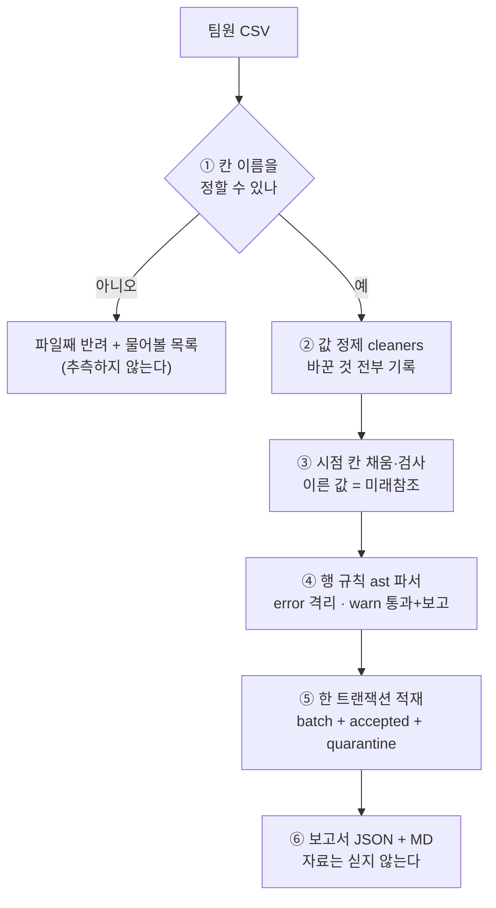

# 핵심코드 ② — 반입 엔진: 남이 준 파일을 어떻게 믿나

> 줄 단위 해설입니다. 정본은 [`ingest/inbox/`](../../../ingest/inbox/) 여섯 모듈이고,
> 규격 파일은 [`ingest/inbox/schemas/`](../../../ingest/inbox/schemas/) 에 있습니다.
> 기능 전체 명세: [기능명세 v1.2 반입 엔진](../../기능명세/version1.2/반입_엔진.md) ·
> 🆕 v1.2 (2026-09-07): §7 업종 스냅샷 36장 — KOSDAQ 18장이 같은 길을 지났다

팀원이나 외부에서 받은 CSV 를 **그대로 DB 에 넣지 않습니다.** 규격(JSON Schema 확장)에
비춰 행 단위로 판정하고, 합격은 `inbox_accepted` 로, 위반은 `inbox_quarantine` 으로,
판정 자체는 사람이 읽는 보고서로 나갑니다.

```
파일 → ① 칸 이름 맞추기 → ② 값 정제 → ③ 시점 칸 채움·검사 → ④ 행 규칙 → ⑤ 적재 → ⑥ 보고서
        (map_columns)     (cleaners)   (derive)              (rules)     (store)    (report)
```

---

## 1. 들머리 — `inspect_file` 이 순서를 정한다

정본: [`ingest/inbox/engine.py`](../../../ingest/inbox/engine.py)

```python
def inspect_file(path, kind: str, *, db_path=None) -> InboxResult:
    """파일 하나를 규격에 비춰 끝까지 검사한다."""
    spec = load_spec(kind)              # ① 규격을 읽는다 (ohlcv_stock 등 5종)
    raw = read_table(path)              # ② 인코딩을 추정하며 표로 읽는다
    ...
    mapping = map_columns(raw, spec)    # ③ 칸 이름을 규격 이름으로 맞춘다
    if mapping.rejected:
        ...
        return InboxResult(...)         # ④ 칸을 못 맞추면 행 판정 없이 파일째 반려
```

- **②** 손으로 받은 한국 CSV 는 십중팔구 `cp949` 입니다. 인코딩 후보를 순서대로
  시도하고, 무엇으로 읽었는지를 보고서에 남깁니다(`encoding_candidates`).
- **③** 칸 이름 맞추기는 **별칭 사전**으로 합니다. `종가`·`close`·`CLOSE` 가 전부
  `close` 로 모입니다. 단, **한 별칭이 두 칸에 속하면 규격 오류로 즉시 세웁니다**
  (`check_alias_invariant`) — 실제로 `수정종가` 가 `close` 의 별칭에 들어 있어서
  수정주가가 원주가로 합격하던 사고가 있었습니다(이슈 #44).
- **④** 파일째 반려는 "행을 골라 담을 수 없는" 문제일 때만입니다 — 필수 칸이
  아예 없거나, 어느 칸인지 **정할 수 없을** 때. 이때 추측하지 않고 사람에게
  물어볼 목록(`questions`)을 만들어 돌려보냅니다. **값을 봐서 추측하면 절반은
  틀리기 때문**입니다.

---

## 2. 행 규칙 — 문자열 치환이 아니라 파서

정본: [`ingest/inbox/rules.py`](../../../ingest/inbox/rules.py)

규격의 행 규칙은 이런 문자열입니다.

```json
{ "id": "high_ge_low", "expr": "high is null or high >= low", "severity": "error" }
```

이 `expr` 을 처음엔 `and`→`&` 문자열 치환으로 pandas 식에 옮겼는데, 파이썬에서
비트 연산자는 비교보다 **먼저** 묶여서 `a | b == 0` 이 `a | (b == 0)` 이 됩니다.
그 상태로 돌렸더니 920만 행 중 **892만 행이 위반**으로 나왔습니다 — 규격이 아니라
옮기는 쪽이 틀린 것입니다. 그래서 지금은 `ast` 파서로 식을 읽습니다. 우선순위는
파이썬 파서가 이미 옳게 알고 있으므로 그걸 빌립니다.

```python
tree = ast.parse(expr, mode="eval")     # 식을 문법 트리로
evaluator = _Evaluator(frame, ...)      # 트리를 걸어가며
result = evaluator.walk(tree.body)      #   우리가 허용한 연산만 수행한다
```

- `eval()` 은 쓰지 않습니다. 규격 파일은 사람이 손으로 고치는 것이라, 적힌 문자열을
  그대로 실행하면 **규격이 코드가 됩니다.** 허용 목록에 없는 구문은 `RuleSyntaxError`.
- ⚠️ **결측은 통과로 둡니다.** `high >= low` 에서 `high` 가 비어 있으면 참도 거짓도
  아닌데, 거짓으로 치면 "값이 없다"는 이유로 격리됩니다. 널 자체를 문제 삼으려면
  규칙에 `high is not null` 을 따로 씁니다. (이 기본값이 반대로 되어 있어서 규격이
  자기 자료를 격리하던 사고가 실제로 있었습니다 — PR #32 에서 고침)

---

## 3. 시점 칸 — 채우고, 검사하고, 이른 값은 격리

정본: [`ingest/inbox/derive.py`](../../../ingest/inbox/derive.py)

*"이 자료를 언제부터 쓸 수 있었나"*(`known_at` 류 칸)는 비어 있으면 규칙으로 채우고,
채워져 있으면 규칙과 맞는지 검사합니다. **규칙보다 이른 값은 미래참조라 격리합니다** —
거래일 T 의 시세를 T 당일부터 알 수 있었다고 적어 오면, 그 행으로 학습한 모델은
미래를 본 것입니다.

판정은 셋으로 가릅니다 — `filled`(우리가 채움) · `verified`(맞음) ·
`too_early`(이르다 → 격리) · `undecidable`(판정 불가 → 격리하지 않되 보고).
**"판정 불가"를 "통과"와 가르는 것**이 이 모듈의 요점입니다.

---

## 4. 적재 — 한 트랜잭션, 세 표

정본: [`ingest/inbox/store.py`](../../../ingest/inbox/store.py)

```python
with write_lock:
    conn.execute("BEGIN IMMEDIATE")
    conn.execute("INSERT OR REPLACE INTO inbox_batch ...")      # 묶음 요약
    conn.executemany("INSERT ... INTO inbox_accepted ...")      # 합격 행
    conn.executemany("INSERT ... INTO inbox_quarantine ...")    # 격리 행
    conn.execute("COMMIT")
```

- **셋을 한 트랜잭션에** 씁니다. 묶음만 남고 행이 안 들어가면 *"들였다고 적혀
  있는데 자료가 없는"* 상태가 되고, 다음 실행이 "이미 들였네" 하고 건너뛰어
  **조용히 굳습니다.**
- `batch_id` 는 `<끝난시각>-<파일 SHA-256 앞 12자>` 입니다. 시각만 쓰면 같은 초의
  두 파일이 겹치고, **지문만 쓰면 같은 파일을 규격 개정 뒤 다시 검사한 결과가
  앞의 것을 덮습니다.** 다시 검사한 이력이 곧 규격 개정의 근거라 남겨야 합니다.
- 🔴 **`daily_price` 는 건드리지 않습니다.** 우리가 받은 920만 행과 남이 준 자료를
  한 표에 섞으면 "이 값은 누가 가져왔나"를 되짚을 수 없게 됩니다.

---

## 5. 보고서 — 판정을 사람의 말로

정본: [`ingest/inbox/report.py`](../../../ingest/inbox/report.py)

보낸 팀원이 알고 싶은 것은 `{"rule": "high_ge_low", "rows": 3}` 이 아니라
*"내 파일 8행 중 3행이 안 들어갔고, 고가가 저가보다 낮아서"* 입니다. 그래서 JSON(기계용)과
마크다운(사람용)을 함께 내고, 격리 사유마다 규격의 설명문을 붙입니다.

🔴 보고서에 **자료를 싣지 않습니다.** 이 저장소는 Public 이고 시세는 KRX 약관이
제3자 제공을 금지합니다. 싣는 것은 판정과, 값이 바뀐 자리의 before/after 표본
20건까지입니다.

---

## 6. 전체 흐름



---

## 7. 🆕 업종 스냅샷 36장 — KOSDAQ 18장이 같은 길을 지났다 (v1.2 · 2026-09-07)

정본: [`scripts/normalize_manual.py`](../../../scripts/normalize_manual.py) `normalize_manual_sector` ·
[`ingest/inbox/schemas/sector.json`](../../../ingest/inbox/schemas/sector.json) ·
[`supply/sector.py`](../../../supply/sector.py) `resolve_duplicates` · PR #145 ·
[가이드 §8](../../데이터파트/version3.9/직접수집_가이드_업종분류현황.md)

반입 엔진이 처음 받은 **남의 자료가 아닌 우리 자료**가 업종 스냅샷입니다 — KRX 약관이 자동 수집을
금지해 사람이 화면에서 내려받은 CSV 를 이 길로 들입니다. v3.7 까지는 KOSPI 18장이었고, v3.8 에서
KOSDAQ 18장을 더해 **36장 40,874행**이 됐습니다. 받기 전에 시험 7건으로 "코드가 KOSDAQ 파일을
받는가" 를 먼저 쟀고, 받고 나서 예측이 그대로 맞았습니다 — 들임 18 · **격리 0** · 거부 0(행 24,224) ·
종가·시가총액·시장 전량 대조 어긋난 행 0.

| 층 | KOSDAQ 이 지나간 자리 |
|---|---|
| 판별 `infer_sector_date` | 파일에 날짜가 없어 **종가로 기준일을 되짚는다.** KOSDAQ 종가로도 기준일·시장이 맞고, 같은 날 KOSPI·KOSDAQ 파일은 시장으로 갈린다 |
| 변환본 `sector_text` | 시장구분 칸이 없어도 `KOSDAQ` 이 이름 앞에 붙는다 — `업종분류현황_KOSDAQ_YYYYMMDD` |
| 규격 `sector.json` | `market` enum 에 이미 `KOSDAQ` 이 있었다 |
| 공급 `industry_as_of` | 같은 날짜면 함께 · `market=` 으로 가른다. 🔴 날짜가 어긋나면 최근 스냅샷 하나만 — **그래서 같은 18개 날짜로 받았다** |

### 7.1 그러자 KOSPI 로는 안 보이던 것이 드러났다 — 한 종목이 업종 둘에

KRX 화면은 한 종목을 두 업종에 싣는 때가 있습니다. KOSPI 18장에는 0건이라 그동안 안 보였고, KOSDAQ 에서
**34행(17쌍) · 4종목**(글로웍스·해성산업·솔본·신라섬유)이 `부동산` 과 `일반서비스` 에 동시에 들어 있었습니다.
그냥 두면 `industry_as_of` 가 종목당 두 행을 내주고 `attach_industry` 의 `merge_asof` 는 둘 중 **아무거나**
집습니다 — 입력 순서에 따라 결과가 달라지는, 조용히 틀리는 종류입니다.

```python
def resolve_duplicates(snaps: pd.DataFrame) -> pd.DataFrame:
    """한 종목이 업종 둘에 실린 행을 **결정적으로** 하나로 줄이고 `ambiguous` 를 붙인다."""
    …
    out = snaps.copy()
    # 🔴 표시는 **줄이기 전에** 찍는다. 하나로 줄인 뒤에는 겹쳤던 흔적이 사라진다.
    겹친행 = out.duplicated(["bas_dd", "code"], keep=False)
    out["ambiguous"] = 겹친행
    if not 겹친행.any():
        return out.reset_index(drop=True)

    # 같은 스냅샷 안에서 그 업종에 종목이 몇인가. 이 수가 클수록 주류 업종이다.
    묶음 = out.groupby(["bas_dd", "market", "sector_nm"])["code"]
    out["_같은업종종목수"] = 묶음.transform("size")
    out = out.sort_values(
        ["bas_dd", "code", "_같은업종종목수", "sector_nm"],
        ascending=[True, True, False, True],   # 종목 수는 많은 쪽부터, 동수면 이름 사전순
    )
    out = out.drop_duplicates(["bas_dd", "code"], keep="first")
```

규칙은 두 단계입니다 — ① 같은 스냅샷(날짜·시장) 안에서 **종목이 많은 업종** → ② 동수면 업종명 **사전순**.
①이 그 스냅샷 안만 보므로 미래를 참조하지 않으면서, KRX 자신이 중복을 끝낸 2018-01-02 스냅샷의 정리
(`일반서비스`)와 **8개 스냅샷 8/8** 로 같은 답을 냅니다. 사전순만 쓰면 `부동산` 이 이겨 **0/8** 로 반대가
됩니다 — 그래서 사전순은 마지막 빗장으로만 둡니다. 2018 스냅샷을 **규칙에 쓰지는 않습니다** — 2010년
시점에서는 볼 수 없는 미래라, 규칙이 맞는지 확인하는 데만 썼습니다.

🔴 **표시는 줄이기 전에 찍습니다.** 고른 결과만 주고 고른 사실을 감추면 나중에 "왜 이 종목이 이 업종이지"
를 되짚을 수 없습니다. 그래서 반출 칸 `industry_ambiguous` 가 배포본까지 흘러갑니다(개발구간 True 4,065행 ·
`NaN` 은 "모호하지 않다" 가 아니라 "모른다").

> 💡 DART `sic_nm` 으로 정하는 안은 버렸습니다 — 커버리지 5.6% 이고, 해성산업 값은 `known_at` 2025-10-08
> 이라 2010년 판정에 쓰면 미래참조입니다. 업계 표준(GICS·ICB)도 회사마다 업종 하나만 주는데 매출 비중으로
> 정합니다. 우리에겐 매출 자료가 없어 위 대리 규칙을 씁니다.
