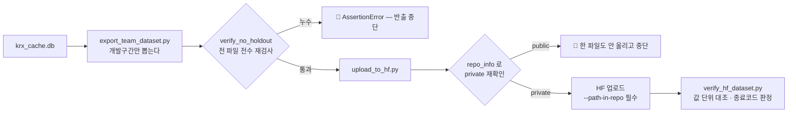
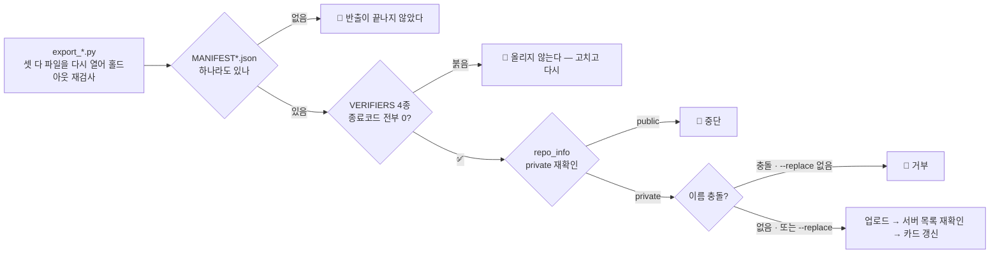

# 핵심코드 ④ — 반출과 HF 배포: 봉인을 두 번 잠그는 법

> 줄 단위 해설입니다. 정본:
> [`scripts/export_team_dataset.py`](../../../scripts/export_team_dataset.py) ·
> [`scripts/upload_to_hf.py`](../../../scripts/upload_to_hf.py) ·
> [`scripts/verify_hf_dataset.py`](../../../scripts/verify_hf_dataset.py) ·
> [`scripts/check_hf_access.py`](../../../scripts/check_hf_access.py) ·
> 🆕 v1.1: [`scripts/export_reference_dataset.py`](../../../scripts/export_reference_dataset.py) ·
> [`scripts/export_text_signal.py`](../../../scripts/export_text_signal.py) ·
> `scripts/verify_*.py` 4종 (§7) ·
> 🆕 v1.2 (2026-09-07): [`pipelines/refresh.py`](../../../pipelines/refresh.py) — 일곱 단계 (§8)

팀원에게 자료를 건네는 길은 **HuggingFace private 데이터셋**입니다
(`qurious-quant/alphastack-krx-dev` · `alphastack-dart`). 파일은 HF 에 두고,
저장소에는 **만드는 방법**만 커밋합니다. 이 길에는 지켜야 할 봉인이 둘 있습니다 —
**홀드아웃**(모델 검증의 봉인)과 **private**(KRX 약관의 봉인).

---

## 1. 홀드아웃 봉인 — 각자 자르게 두지 않고 마지막에 전수 검사

정본: `export_team_dataset.py` 의 `verify_no_holdout`

```python
def verify_no_holdout(root: Path) -> int:
    """내보낸 모든 파일을 다시 열어 홀드아웃이 섞이지 않았는지 확인한다."""
    검사한 = 0
    for path in sorted(root.rglob("*")):              # ① 반출 폴더의 전 파일을
        if path.suffix == ".csv":
            df = pd.read_csv(path, usecols=["bas_dd"], dtype={"bas_dd": str})
        elif path.suffix == ".parquet":
            df = pd.read_parquet(path, columns=["bas_dd"])
        else:
            continue
        가장늦은 = str(df["bas_dd"].astype(str).max())  # ② 날짜 칸만 다시 읽어
        if 가장늦은 >= HOLDOUT_START:                   # ③ 경계와 대조한다
            raise AssertionError(f"🔴 홀드아웃 누수 — {path.name} ...")
        검사한 += 1
    return 검사한
```

- **왜 마지막에 다시 여나?** 반출물을 만드는 함수가 여럿이고 각자 자르게 두면,
  언젠가 한 곳이 빠집니다. 봉인 구간이 **한 번이라도** 팀원 손에 들어가면
  "미리 정해 두고 딱 한 번 열어본다"는 검증 프레이밍이 무너지고 되돌릴 수 없습니다.
  그래서 각 함수를 믿지 않고, 완성된 파일을 **전부 다시 열어** 검사합니다.
- **②** 파일 전체가 아니라 `bas_dd` 칸만 읽습니다 — 검사에 필요한 최소만 읽어
  수 GB 파일에서도 빠르게 돕니다.
- 경계 상수는 정본(`evaluation/horizon.py` 의 `HOLDOUT_START`)에서 **import** 합니다.
  반출 쪽에 `"20210831"` 같은 사본 상수를 두면 정본이 바뀔 때 사본이 낡은 채
  남습니다 — 실제로 그런 죽은 상수가 있어 PR #71 이 계산식으로 바꿨습니다.

## 2. private 봉인 — 만들었다고 믿지 않고 서버에 다시 묻는다

정본: `upload_to_hf.py`

```python
api.create_repo(repo_id=args.repo, repo_type="dataset", private=True, exist_ok=True)

# 🔴 만들었다고 믿지 않는다. 서버에 다시 물어본다.
info = api.repo_info(repo_id=args.repo, repo_type="dataset")
if not info.private:
    print("🔴 중단 — 이 데이터셋이 public 이다. KRX 원자료를 올릴 수 없다.")
    return 1
```

`private=True` 로 **만들었는데 왜 다시 확인하나?** `exist_ok=True` 라서, 이미 있는
레포에 붙을 때는 그 레포가 public 이어도 **그냥 성공**하기 때문입니다. 1번 줄이
실패하지 않았다는 것이 private 이라는 뜻이 아닙니다. KRX 이용약관 제11조 ②(제3자
제공 금지) 위반은 되돌릴 수 없으므로, 올리기 전에 서버의 실제 상태를 봅니다.

## 3. `--path-in-repo` — 루트를 덮어쓰지 않기

한 레포에 성격이 다른 반출(시세 · 재무 pit/bulk)이 함께 삽니다. `--path-in-repo` 를
안 주면 **루트에 올라가 기존 README.md·MANIFEST.json 을 덮어씁니다** — 실제로 겪고
회수한 사고라, 지금은 도움말에 🔴 로 박아 두었습니다.

## 4. 재배포 판정 — 사람이 아니라 스크립트가 답한다

정본: `verify_hf_dataset.py` — HF 파일을 받아 지금 DB·지금 코드와 값으로 대조하고
**종료코드로** 답합니다(0 = 이미 최신). 판정 기준은 코드에 못박혀 있습니다.

- **1 ULP 안쪽 차이는 표기의 한계** — CSV 가 float64 를 온전히 못 담아 생기는
  마지막 비트 차이는 "변화"가 아닙니다.
- **결측이 엇갈리면 크기와 무관하게 자료의 변화** — `NaN` 과 `0.0` 이 몇 ULP
  떨어져 있다고는 말할 수 없기 때문입니다.

재배포하는 경우는 셋뿐입니다 — ① 홀드아웃 경계 이동(#63·PR #71) ② 개발구간 값
변경(#51 수정주가) ③ 반출 규격 변경. **새 시세가 쌓였다는 것만으로는 올리지
않습니다** — 개발구간 상한이 있어 파일이 바뀌지 않기 때문입니다.

## 5. 팀원이 못 받을 때 — 진단도 코드로

정본: `check_hf_access.py` — 토큰 → 로그인 → 조직 멤버십 → 레포 접근 → 파일 존재를
**한 단계씩** 짚고, 막힌 자리에서 *무엇을 해야 하는지*까지 출력합니다.
`repo_type="dataset"` 누락과 경로 접두사 누락이 **둘 다 404 로 똑같이 보이기**
때문에, 사람이 에러 메시지만 보고는 원인을 가를 수 없습니다.

## 6. 흐름 한 장



---

## 7. 🆕 봉인이 셋이 됐다 — 반출이 검증기를 스스로 돌린다 (v1.1 · 2026-09-04)

정본: `upload_to_hf.py` 의 `VERIFIERS` · `run_verifiers`

2026-09-03 에 "고쳤다" 와 "나갔다" 가 갈리는 일을 겪었습니다 — 수정주가 결함을 고쳤는데 반출
경로는 여전히 원가격이었습니다(#80). 그래서 세 번째 봉인을 뒀습니다: **반출 전에 검증기를
전수로 돌리고, 하나라도 붉으면 올리지 않는다** (품질 규약 7.1).

```python
VERIFIERS = (
    ("scripts/verify_identity.py",    "종목 식별 (법인번호·ISIN·상장일)"),
    ("scripts/verify_base_info.py",   "종목기본정보 (주권종류·자본변동·자리표시자)"),
    ("scripts/verify_sector.py",      "업종 스냅샷 (값 대조·지수 조인)"),
    ("scripts/verify_text_signal.py", "텍스트 신호 (해시·확률·known_at 규칙)"),
)

def run_verifiers(*, timeout=3600):
    결과 = []
    for 경로, 이름 in VERIFIERS:
        p = subprocess.run([sys.executable, 경로], capture_output=True, text=True, timeout=timeout)
        결과.append((경로, 이름, p.returncode, p.stdout[-800:]))   # ① 종료코드가 판정이다
    return 결과
```

- **①** 검증기는 사람이 읽는 출력과 함께 **종료코드**(0 = 이상 없음)로 답합니다. 업로드는
  네 개가 전부 0 일 때만 진행합니다. 출력을 사람이 읽고 판단하는 단계를 두면 언젠가 안 읽습니다.
- **등록하지 않으면 게이트가 보지 않습니다.** 텍스트 신호 검증기를 만들고 `VERIFIERS` 에 넣는
  것까지가 한 작업입니다. 검증기가 있는데 튜플에 없으면 "검사했다" 는 착각만 남습니다.
- **검증기가 안 보는 축을 주석에 적습니다.** 규격 검사는 "값이 규격에 맞나" 를 재지 "그 값이
  옳은가" 를 재지 못합니다. 텍스트 신호는 그래서 바깥 기준(카이제곱)을 따로 뒀습니다.

### 반출이 셋이고 대장도 셋이다

| 반출 | 스크립트 | 폴더 | 대장 |
|---|---|---|---|
| 시세·피처 | `export_team_dataset.py` | `full/` · `small/` | `MANIFEST.json` |
| 참조 자료 | `export_reference_dataset.py` | `identity/` `financial/` `macro/` `calendar/` | `MANIFEST_reference.json` |
| 텍스트 신호 | `export_text_signal.py` | `text/` | `MANIFEST_text.json` |

대장 이름이 셋인 이유: 한 이름이면 참조 반출이 시세 반출의 이력을 **덮습니다.** `upload_to_hf` 는
`MANIFEST*.json` 이 **하나라도** 있어야 올립니다 — 대장 없는 반출은 나중에 "이 파일이 무엇이고
어느 구간인가" 에 답할 수 없습니다.

```python
대장들 = sorted(root.glob("MANIFEST*.json"))
if not 대장들:
    print(f"{root} 에 MANIFEST*.json 이 없다. 반출이 끝나지 않았다")
    return 1
```

셋 다 **파일을 다시 열어** 홀드아웃을 재검사합니다(§1 과 같은 이유). 텍스트 신호는 접수일과
`known_at` **양쪽**을 봅니다 — 접수는 개발구간인데 다음 거래일이 봉인으로 넘어간 522행이 그래서
잡혔습니다.

### 이름 충돌은 `--replace` 없이 거부한다

참조 반출은 기존 파일과 이름이 같으면 **멈춥니다.** `--replace` 를 줘야 덮습니다. "올렸다" 가
"덮어썼다" 인 줄 모르고 지나가는 일을 막기 위해서입니다. 올린 뒤에는 서버 목록을 다시 읽어
파일이 실제로 있는지 확인합니다 — §2 의 private 재확인과 같은 태도입니다.



---

## 8. 🆕 일곱 단계 — 버튼 한 번으로 반출까지 (v1.2 · 2026-09-07)

정본: [`pipelines/refresh.py`](../../../pipelines/refresh.py) · 시험 `tests/test_pipelines_refresh.py` 28건 ·
[기능명세 v1.7](../../기능명세/version1.7/버튼_갱신_파이프라인.md) · PR #152

§1~§7 의 봉인들은 각자 스크립트였습니다. 2026-09-05 에 손으로 그 순서를 여섯 번 쳤고, 하나를 빠뜨려도
**아무 일도 일어나지 않았습니다** — 고친 코드를 좁은 범위에만 먹여서 저장소에는 고친 코드가 있는데 나간
자료는 안 고쳐진 채였습니다(#80 류). 그래서 한 명령으로 묶었습니다. 순서 자체가 코드입니다:

```python
STAGES = ("ingest", "calendar", "adj", "gate", "verify", "export", "upload")
```

| | 단계 | 통과 조건 | 실측 |
|---|---|---|---:|
| ① | `ingest` 수집 | 종료코드 0 | 18초 |
| ② | 🆕 `calendar` 거래일 달력 | 원가격 지문 앞뒤 일치 · **끄는 스위치 없음** | 19초 |
| ③ | `adj` 수정주가 | 🔴 기본 `skipped` — 조정 코드가 바뀐 날만 `--with-adj` | 13분 |
| ④ | `gate` 품질 게이트 | `check_data.py` error 0 | 106초 |
| ⑤ | `verify` 재배포 판정 | 0 최신 → 여기서 끝 · 2 필요 → 계속 | 152초 |
| ⑥ | `export` 반출 | §1 홀드아웃 재검사 | 185초 |
| ⑦ | `upload` 업로드 | §7 검증기 4종 · §2 private 재확인 | — |

### 8.1 달력이 왜 제 단계인가 — 값이 싼 일을 비싼 일 옆에 두면 같이 꺼진다

```python
#: `calendar` 가 `ingest` 바로 뒤이고 `adj` 와 **따로**인 까닭:
#: 거래일 달력은 시세를 세어 만드는 값이라 새 날짜가 들어오면 곧바로 낡는다. 그런데
#: 그걸 다시 까는 일은 13분짜리 수정주가 재계산과 한 스크립트에 들어 있었고, 수정주가는
#: 평소에 꺼 두는 단계다. 그래서 2026-09-02~04 사흘 동안 시세는 앞서 가고 달력만 뒤에
#: 남았다. 4,102행짜리 재적재는 19초라 끌 이유가 없었는데도 비싼 이웃과 운명을 같이한
#: 것이다. 값이 싸고 뒤따르는 단계가 전부 의존하는 일은 **제 단계로 세워 둔다** —
#: 그래야 `--only` 로 무엇을 빼는지도 눈에 보인다.
```

달력이 시세보다 뒤처지면 `next_session()` 이 `CalendarOutOfRange` 로 서고, 종목기본정보·식별·반입 자료의
`known_at` 계산이 통째로 멈춥니다. 답을 지어내지 않으니 조용히 틀리지는 않지만, 멈추는 자리가 한참
뒤라 원인이 여기라는 걸 알아보기 어렵습니다. `_단계_수정주가` 는 **한 줄도 안 바뀌었습니다.**

### 8.2 두 번 눌러도 한 번만 — 그리고 `busy` 에는 열쇠를

```python
    잠금 = FileLock(str(LOCK_PATH), timeout=0)
    try:
        잠금.acquire()
    except Timeout:
        진행중 = 진행중인_실행()
        열쇠 = 진행중["run_id"] if 진행중 else ""
        print("이미 돌고 있다. 두 번 눌러도 한 번만 돈다.")
        …
        return 0, {"run_id": 열쇠, "status": "busy", "stages": {}, "uploaded": False}
```

`timeout=0` 이라 두 번째 호출은 **기다리지 않습니다.** 열쇠(`run_id`) 없이 "돌고 있음" 만 돌려주면 화면은
무엇을 폴링해야 할지 모릅니다. 진행 상황은 `ingest_run` · `ingest_run_stage` 에 **시작할 때부터** 남기고
`args.pipeline` 값으로 수집 실행과 가릅니다.

### 8.3 여기서 멈추는 것이 `pipelines/ingest.py` 와 다른 점

```python
        except GateFailed as exc:
            …
            게이트막힘 = True
            멈춤 = True
        except Exception as exc:                          # noqa: BLE001
            …
            # 🔴 여기서 멈추는 것이 `pipelines/ingest.py` 와 다른 점이다.
            #    수집은 거시가 실패해도 시세는 받아야 하지만, 여기 단계들은 **앞의 결과를
            #    딛고 선다.** 수집이 실패한 채로 반출하면 반쪽짜리가 팀에 나간다.
            멈춤 = True
```

수집은 출처 하나가 실패해도 나머지를 받지만, 여기 단계들은 앞의 결과를 딛고 섭니다. `gate_failed` 와
`error` 를 가르는 이유는 **다시 눌러 소용이 있는지**가 다르기 때문입니다 — 게이트 실패는 다시 눌러도
같은 곳에서 막힙니다.

### 8.4 실제로 막은 기록 — 09-07 오후

| run_id | 무엇 | 결과 |
|---|---|---|
| `20260907-101640` | 아침 재배포 (전 단계) | ok · 20분 · 22파일 |
| `20260907-113105` | `--only calendar` | ok · 19초 |
| `20260907-132312` | 오후 재배포 (51종 재생성 뒤) | 🔴 **⑦에서 검증기가 막았다** — 종목기본정보 안 받은 (날짜,시장) 쌍 6 |
| `20260907-134654` | 받고 나서 `--only verify upload` | ok · 4 LFS 파일 |

"붉으면 안 올라간다"(§7)가 사람 손 없이 실제로 작동한 첫 기록입니다. 단계를 골라 다시 돌린 것은
`--only` 가 있어서입니다 — 처음부터 다시 도는 것도 4분 37초라 싸지만, 무엇을 뺐는지가 기록에 남는 쪽이
낫습니다.
