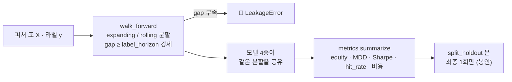

# 핵심코드 ⑦ — 평가: 레이블 지평만큼 띄우지 않으면 누수다

> 줄 단위 해설입니다. 정본: [`evaluation/`](../../../evaluation/__init__.py)
> (`walk_forward.py` · `metrics.py` · `horizon.py` · `baseline.py`).
> 백테스트 실무·성과지표 문서는 **강민석 님** 담당입니다
> ([backtest-features](../../../notebooks/05-백테스트·성과/) · PR #57·#68).
> 🆕 v1.2 (2026-09-07): §6 폴드별 적용 기준선 — 학습 최빈을 검증에 (ADR 0006 · 코드 오준영 님)
> 문서화 담당(이동원)이 코드를 *참고해* 쓴 해설이고, 코드는 건드리지 않습니다.

시계열 검증의 전부는 **"학습이 검증의 답을 미리 보지 않았는가"** 입니다.
`evaluation/` 은 그 규칙을 사람의 주의력이 아니라 **예외**로 지킵니다.

---

## 1. 인덱스가 안 겹쳐도 누수다 — `LeakageError`

정본: `evaluation/walk_forward.py`

```python
class LeakageError(RuntimeError):
    """학습 구간과 검증 구간이 **레이블을 통해** 겹칠 때 던진다."""
```

흔한 오해: *"학습은 1~100행, 검증은 101~120행이니 안 겹친다."*
그러나 **레이블이 미래를 보고 만들어집니다.** t=100 행의 레이블이 t+5 가격으로
만들어졌다면, 학습 마지막 행은 이미 t=105 를 알고 있습니다. 검증이 t=101 에서
시작하면 학습이 검증의 답을 본 것입니다.

그래서 폴드 사이에 **`gap`(간격)** 을 둡니다. 규칙은 셋뿐입니다.

```python
# 1. gap 을 안 주면 label_horizon 과 같게 둔다 (누수 없는 최솟값)
# 2. label_horizon 을 안 주면 horizon 으로 본다
# 3. gap < label_horizon 이면 LeakageError. allow_leakage=True 일 때만 통과
```

- **기본값이 안전한 쪽**입니다. 아무것도 모르고 호출해도 누수가 없고, 위험한
  쪽(`allow_leakage=True`)을 **원할 때만 명시**하게 만들었습니다 — 누수는 예외를
  내지 않고 성능만 올리므로, 설계가 기본값으로 막아야 합니다.
- ⚠️ `horizon`(한 폴드의 검증창 길이)과 `label_horizon`(레이블이 앞을 보는
  거리)은 **다른 값**입니다. 우리 프로젝트는 둘 다 5 라 헷갈리기 쉽습니다.

## 2. 확장창과 롤링창 — 둘 다 두는 이유

```python
expanding_splits(...)   # 학습 시작 고정, 끝만 앞으로 — 자료가 많을수록 좋다고 볼 때
rolling_splits(...)     # 학습 길이 고정, 창을 민다 — 옛 자료가 해롭다고 볼 때
```

`rolling_splits` 의 `train_size` 는 **그 자체가 실험 대상인 가정**입니다 — 시장
국면이 바뀌면 5년 전 관계는 지금과 다르므로, 값을 바꿔 가며 결과가 얼마나
흔들리는지 보는 것이 하나의 실험입니다.

## 3. 홀드아웃 경계 — 상수 하나가 정본

정본: `evaluation/horizon.py`

```python
#: 봉인 홀드아웃 시작일. 이 앞이 개발구간이다.
HOLDOUT_START = "20210901"      # ← PR #71 에서 "20240901" 로 변경 진행 중 (#63)

def split_dev(rows, holdout_start=HOLDOUT_START):
    """개발구간만 남긴다. 홀드아웃을 보려면 명시적으로 split_holdout 을 불러야 한다."""
```

- 경계는 **이 상수 한 곳**에만 삽니다. 반출(`export_team_dataset`)도 공급
  (`supply/training`)도 여기서 import 합니다. 사본 상수를 두면 정본이 바뀔 때
  사본이 낡습니다.
- 홀드아웃 5년은 재무 자료의 54.6%를 학습에서 빼는 과한 봉인이라는 실측(#63)으로
  **2년(20240901)으로 확정**됐고, 코드 반영이 PR #71 입니다.

## 4. 지표 — hit_rate 가 말해 주지 않는 것

정본: `evaluation/metrics.py` — `equity_curve` · `max_drawdown` · `sharpe_ratio` ·
`hit_rate` · `apply_cost` · `summarize`.

- `hit_rate(predicted, actual)` 는 **중립을 분모에서 뺍니다.** 라벨을 −1/0/+1 로
  쓰면 중립 38.69% 가 빠진 값이라, 52.64% 같은 숫자를 "정확도"로 읽으면
  안 됩니다 (이슈 #33). 이 함정이 평가축 재설계 논의의 출발점이었습니다.
- `apply_cost` — 포지션이 바뀔 때마다 거래비용을 뺍니다. 비용 없는 수익률 곡선은
  회전율이 높은 전략을 실제보다 좋게 보이게 합니다.
- `summarize` 가 위 지표를 한 번에 묶어, 모델 4종 비교표가 **같은 계산식**으로
  만들어지게 합니다.

## 5. 흐름 한 장



---

## 6. 🆕 폴드별 적용 기준선 — 학습 최빈을 검증에 적용한다 (v1.2 · 2026-09-07)

**코드 담당: 오준영 님** (`models/stock_experiment.py` · PR #161). 정본:
[`fold_classification_baselines`](../../../models/stock_experiment.py) ·
[ADR 0006](../../decisions/0006-개별종목-중립대와-평가기준선.md) · 이슈 #158

§4 가 "hit_rate 는 중립을 뺀다" 고 짚었듯, **기준선도 무엇을 보고 만들었는지**가 문제였습니다. 예전
보고서는 OOS 전체 정답에서 가장 많은 클래스의 비율 하나(0.3849)를 기준선으로 적었는데, 그것은 **검증
정답 분포를 미리 본 사후 통계**라 실제 예측 시점에는 쓸 수 없는 기준선입니다. 데이터 파트가 낸 연도별
기준선(35.62~45.22%)도 같은 함정이었습니다 — 오준영 님이 #158 에서 짚어 주셨고, 이 함수가 그 답입니다.

```python
def fold_classification_baselines(y_train, y_valid) -> dict[str, int | float]:
    """학습 최빈 기준선과 검증 분포의 사후 참고값을 서로 분리해 계산한다."""
    …
    train_counts = {label: int(np.sum(train == label)) for label in MAJORITY_TIE_BREAK}
    valid_counts = {label: int(np.sum(valid == label)) for label in MAJORITY_TIE_BREAK}
    train_majority = max(MAJORITY_TIE_BREAK, key=train_counts.__getitem__)
    valid_majority = max(MAJORITY_TIE_BREAK, key=valid_counts.__getitem__)
    return {
        "training_majority_class": train_majority,
        "training_majority_baseline_accuracy": float(np.mean(valid == train_majority)),
        # 이 값은 검증 정답 분포를 본 사후 통계다. 모델 비교 기준선으로 사용하지 않는다.
        "validation_majority_class": valid_majority,
        "validation_majority_oracle_accuracy": float(np.mean(valid == valid_majority)),
        …
    }
```

| 값 | 무엇 | 어디에 쓰나 |
|---|---|---|
| `training_majority_baseline_accuracy` | **학습구간** 최빈 클래스를 검증구간 전체에 예측했을 때의 정확도 | **비교 기준선** — 모델 정확도에서 이 값을 뺀 `accuracy_minus_training_majority_baseline` 을 폴드마다 적는다 |
| `validation_majority_oracle_accuracy` | 검증구간 자체의 최빈 비율 | 분포 설명용 **참고값**(`oracle`) — 모델 우위 판정에 쓰지 않는다 |
| `MAJORITY_TIE_BREAK` | 학습 클래스가 정확히 동률일 때 `중립 → 하락 → 상승` 고정 순서 | 검증 정답을 보지 않고 결정적으로 |

§1 의 `LeakageError` 가 **학습이 검증의 답을 미리 보지 않았는가**를 분할에서 지키듯, 이 함수는 같은
물음을 **기준선**에서 지킵니다. 두 값을 한 사전에 함께 돌려주되 이름으로 가르고, 주석으로 못박습니다.

### 6.1 실측 — 12폴드 · 조합 A 유효행 172,924행

데이터 파트가 같은 분할(`expanding_group_splits` · 최소학습 750 · 검증 60 · gap 5)을 재현해 셌습니다
(OOS 최빈 0.3851 vs 보고값 0.3849 — #132 필터 1건 차이로 같은 분할). 학습 최빈은 12폴드 전부 **중립**이고
적용 기준선은 폴드마다 **31.71~47.64% · 평균 38.54%** 입니다. 참고값(검증 최빈)이 학습 최빈과 다른 폴드가
다섯(3 · 8 · 10 · 11 · 12)이고 차이는 최대 **6.64%p**(8폴드 · 2020-05~08 상승장 · 상승 38.35 vs 중립 31.71)
— 이 다섯 폴드에서 사후 기준선을 쓰면 모델이 실제보다 나빠 보입니다. 조합 A 와 G 의 차이는 최대 0.01%p
— **기준선은 조합이 아니라 분할이 정합니다.**

> 💡 개별종목 중립대 ±2.0% 도 같은 ADR 에서 근거를 얻었습니다 — 표준 ADR 이 없는 값이었는데, 개별종목
> 5일 수익률 표준편차(5.277%)가 KOSPI200(2.404%)의 **2.195배**라 지수 ±1.0% × 2.195 = ±2.20% 와
> 일관됩니다. 클래스 균형을 위해 ±1.75% 로 바꾸는 안은 "모델 성능을 보고 목표를 조정하는" 순서라 버렸습니다.
