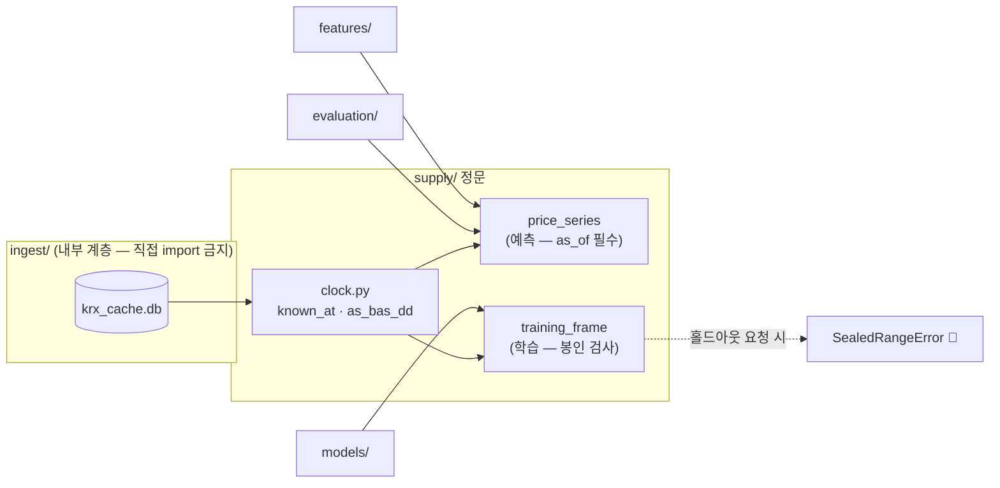

# 핵심코드 ③ — 공급 정문: `as_of` 가 미래를 막는 방법

> 줄 단위 해설입니다. 정본은 [`supply/`](../../../supply/__init__.py) 입니다.
> 아키텍처에서의 위치: [아키텍처 v1.2](../../아키텍처/version1.2/아키텍처.md) ·
> v1.2 (2026-09-07): §6 크기가 아니라 어긋남 — `supply.adj_quality` ·
> 🆕 **v1.4 (2026-09-11)**: §7 중기·장기 원천 정문 셋(재무·거시·공시 텍스트) ·
> §8 하루 누수 — 행마다의 경계는 그 행의 날짜 · §9 홀드아웃 입구 `supply.holdout`

피처·모델·평가는 DB 를 직접 읽지 않고 **`supply/` 문 하나**를 지납니다.
이 문의 규칙은 단 하나입니다 — **`as_of`(언제 시점에서 보나)를 내지 않으면 열리지
않는다.** 왜 이렇게까지 하는지부터 봅니다.

## 0. 왜 문이 필요한가 — 미래는 예외를 던지지 않는다

저장소에는 **오늘까지의** 자료가 들어 있습니다. 2020년 폴드를 학습하면서 표를
그대로 쓰면 2021~2026년 값이 함께 들어가고, **아무 에러도 나지 않습니다.**
성능만 좋아집니다. 좋아 보이는 쪽으로 틀리는 버그는 사람이 못 잡습니다.
그래서 규칙을 문서에 적는 대신 **코드가 강제**합니다 — `as_of` 는 기본값이 없어서
빠뜨리면 그 자리에서 터집니다. 게다가 `features/`·`models/`·`evaluation/` 이
`ingest` 를 직접 import 하면 **테스트가 실패**합니다(`tests/test_supply_boundary.py`).

## 1. "언제부터 알 수 있었나" — `known_at`

정본: [`supply/clock.py`](../../../supply/clock.py)

```python
def known_at(bas_dd: str) -> datetime:
    """거래일 YYYYMMDD 의 시세를 언제부터 알 수 있었나."""
    if len(bas_dd) != 8 or not bas_dd.isdigit():
        raise ValueError(f"거래일은 YYYYMMDD 여야 한다: {bas_dd!r}")
    day = date(int(bas_dd[:4]), int(bas_dd[4:6]), int(bas_dd[6:]))
    return datetime.combine(day + timedelta(days=1), time.min, tzinfo=KST)
```

거래일 T 의 시세는 **T+1 의 0시(KST)부터** 알 수 있었다고 봅니다. 근거는 실측입니다 —
2026-08-26 에 장 마감(15:30) 40분 뒤인 16:10 에 당일 자료를 요청하니 **0행**이었습니다.
정확히 몇 시에 올라오는지는 재지 않았고, **재지 않은 값을 가정으로 쓰지 않으므로**
하루를 통째로 미룹니다. 이 선택은 항상 진실보다 늦은 쪽이라, 틀려도 성능을
부풀리는 방향으로는 틀리지 않습니다.

> ⚠️ 이 값을 앞당기고 싶으면 **실측부터** 합니다. 앞당기는 방향이 곧 누수 방향입니다.

## 2. 표기 함정 — 하이픈은 0 보다 작다

정본: [`supply/clock.py`](../../../supply/clock.py) 의 `as_bas_dd`

```python
min('2026-08-21', '20260825')   # → '2026-08-21'  (뜻과 무관하게 항상 하이픈 쪽이 이긴다)
```

`'-'`(0x2D)가 `'0'`(0x30)보다 작아서, ISO 표기와 `YYYYMMDD` 표기를 그냥 비교하면
**답이 표기 순으로 정해집니다.** 그 값이 `bas_dd <= ?` 에 들어가면 결과가 0행이
되는데 예외는 안 납니다 — 빈 표를 받은 쪽은 "그 구간에 자료가 없구나"로 읽습니다.
그래서 문에 들어오는 날짜는 전부 `as_bas_dd()` 로 `YYYYMMDD` 하나로 맞춥니다.
표기를 하나로 만들면 이 실수 자체가 불가능해집니다.

## 3. 문이 둘인 이유 — 예측 경로와 학습 경로

정본: [`supply/market.py`](../../../supply/market.py) · [`supply/training.py`](../../../supply/training.py)

| 문 | 언제 | 무엇이 다른가 |
|---|---|---|
| `price_series` · `index_series` | **예측할 때** | `as_of` 시점에 알 수 있었던 것만. 미래를 절대 안 준다 |
| `training_frame` | **학습할 때** | 라벨(미래 수익률)을 만들기 위해 **여기서만** 미래를 본다 |

처음엔 한 함수에 `include_future=True` 같은 손잡이를 두는 안이 있었는데,
**손잡이는 언젠가 켜진 채로 지나갑니다.** 그래서 함수 이름 자체를 갈랐습니다 —
코드 리뷰에서 `training_frame` 이 예측 경로에 있으면 이름만 보고 잡을 수 있습니다.

학습 경로 안에도 봉인이 있습니다. `training_frame(code, *, holdout_start=...)` 의
`holdout_start` 는 **키워드 전용이고 기본값이 없어서** 빠뜨리면 그 자리에서 터지고,
값을 주면 그 날짜 이후 행을 잘라낸 뒤 **몇 행을 잘랐는지**(`dropped["holdout"]`)를
함께 돌려줍니다. 전 구간이 필요하면 `holdout_start=None` 을 **명시적으로** 적어야
합니다 — "깜빡해서 전 구간"이 불가능한 모양입니다.

> ⚠️ 옛 문서(요구사항 F-04 · 데이터파트 v2.1)에는 봉인이 `SealedRangeError` 예외로
> 구현된 것처럼 적혀 있는데, **그 예외는 코드에 없습니다**(2026-09-02 grep 전수).
> 실물은 위의 "기본값 없는 키워드 인자 + 행 제거 + 제거량 보고" 방식입니다.

## 4. 흐름 한 장



## 5. 이 설계가 지키는 약속 (테스트가 못박은 것)

- `as_of` 없이 부르면 터진다 — `tests/test_supply_boundary.py`
- 상류 계층이 `ingest` 를 import 하면 테스트가 실패한다 — 같은 파일
- 빈 결과에도 컬럼 구조가 남는다 — `tests/test_supply_price.py`
  (빈 DataFrame 에 컬럼이 없으면 하류의 `df["close"]` 가 다른 이유로 터져 원인을 가린다)

---

## 6. 🆕 크기가 아니라 어긋남 — `supply.adj_quality` (v1.2 · 2026-09-07)

정본: [`supply/adj_quality.py`](../../../supply/adj_quality.py) · PR #156 · 이슈 #132 ·
[품질 규약 §4.4 · §6.7](../../데이터파트/version3.9/데이터_품질_규약.md) ·
재현 [노트북 06/10](../../../notebooks/06-검토·발견/10.이상치는-크기가-아니라-어긋남으로-가른다.ipynb)

공급 정문에 문이 하나 더 생겼습니다. 이번 문은 시점이 아니라 **품질**을 묻습니다 — *"이 행의 수정주가를
믿어도 되나?"* 모델 파트가 개별종목 후보군에 `|adj_close 일간수익률| > 100%` 필터를 걸었더니 딱 한 행이
지워졌습니다(경남에너지 2016-05-11 · +153.66%). 그런데 KRX 가 그날 발표한 등락률도 정확히 +153.66%
였습니다 — 오류가 아니라 **실제로 그렇게 움직인 날**입니다. 반대로 신세계 2011-06-10 은 우리 수정주가
수익률이 −60.6% 인데 KRX 등락률은 +14.95% 입니다 — 인적분할 재상장일에 우리 조정계수가 틀린 것이고,
**크기 필터에는 걸리지 않습니다.**

"이상치" 라는 말은 **데이터 오류**와 **진짜 사건**을 섞습니다. 그래서 판별자를 크기에서 **독립 원천과의
어긋남**으로 바꿨습니다. KRX `change_rate` 는 거래소가 그날 기준가 대비로 낸 공식 수익률이라, 우리가 만든
수정주가를 검증할 독립 원천입니다.

```python
#: 행 플래그의 허용폭(%p). 이보다 크게 어긋나면 수정주가 오류 의심이다.
SUSPECT_GAP_TOLERANCE = 1.0
#: 극단 수익률의 경계(%). 가격제한폭(2015-06-15 이후 ±30%)과 같다.
EXTREME_RETURN_PCT = 30.0
#: 입력에 있어야 하는 열. HF 반출본 `daily_price_dev.parquet` 에 전부 있다.
REQUIRED_COLUMNS = ("bas_dd", "code", "close", "adj_close", "change_rate")
#: 돌려주는 열. 순서가 곧 계약이다.
FLAG_COLUMNS = ("adj_return_1d", "adj_change_rate_gap",
                "is_adj_suspect", "is_extreme_return")
```

| 칸 | 정의 |
|---|---|
| `adj_return_1d` | (`adj_close` / 전일 `adj_close` − 1) × 100 |
| `adj_change_rate_gap` | \|`adj_return_1d` − `change_rate`\| (%p) |
| `is_adj_suspect` | gap > 1%p → 수정주가 오류 의심 · **학습에서 뺀다** |
| `is_extreme_return` | \|r\| > 30% 이고 의심 아님 → 진짜 극단 사건 · **남긴다** |

### 6.1 왜 공급 정문에 있나 — 시점 규칙이 같기 때문

플래그는 그 종목의 **전날과 당일 값만** 봅니다. 뒤의 행을 잘라 내도 앞 행의 플래그는 같습니다(시험
`test_뒤_행을_잘라도_앞_행의_플래그는_같다`). 그래서 개발구간 학습과 개봉 뒤 홀드아웃 예측에 **같은
함수를 그대로** 씁니다 — §3 의 "문이 둘" 과 같은 태도입니다. T+1 이후에 극단값이 나왔다는 이유로 T 를
지우는 일은 여기서 일어날 수 없습니다. 수정주가 자체는 후방조정이지만 **이웃한 두 날의 비율**은 그 뒤에
무슨 분할이 오든 변하지 않습니다.

```python
def flag_adjustment_quality(daily_prices, *, gap_tolerance=SUSPECT_GAP_TOLERANCE,
                            extreme_pct=EXTREME_RETURN_PCT) -> pd.DataFrame:
    """행마다 칸 넷을 매긴다. **입력과 같은 인덱스·같은 순서**로 돌려준다.
    수익률은 종목의 전체 시계열에서 이웃한 두 날로 계산한다. 후보만 잘라 낸 뒤 계산하면
    후보에 안 뽑힌 전날이 빠져 며칠짜리 수익률이 되므로, 항상 원천 전체를 넘긴다.
    """
```

비교할 수 없는 행(종목의 첫 행 · 전일 adj 가 없거나 0 · 종가 0 · 등락률 없음)은 수익률·갭이 NaN 이고
두 플래그는 False 입니다 — **모르는 것을 오류로 치지 않습니다.**

### 6.2 허용폭이 `verify()` 와 다른 이유

`build_adj_prices.GAP_TOLERANCE` 는 0.15%p 입니다. 그것은 **전체 어긋남 비율이 1% 미만인가**를 보는 집계
게이트라 민감한 게 맞습니다. 행 플래그는 다릅니다 — 반올림 잡음을 오류로 표시하면 멀쩡한 저가주 행이
학습에서 빠집니다.

```
허용폭     전 시장 어긋남      후보군(업종 10 × 종목 5 · 176,705행) 교집합
0.15%p    13,677 (0.173%)     2
1.0%p      1,406 (0.018%)     2
30%p         144               2
```

0.15~1.0 사이 12,271행의 **94% 가 종가 5,000원 미만**입니다 — FDR 수정가격이 원 단위로 반올림되므로
저가주에서 0.2~0.5%p 는 반올림에서 나옵니다. 후보군에서는 허용폭이 무엇이든 같은 2행(둘 다 인적분할
재상장일)만 남습니다. 그 2행을 좇아 **재개일 규칙**을 고쳤고(규약 §6.7 · 51종 재생성), 고친 뒤 후보군
의심 행은 **0** 입니다.

### 6.3 쓰는 법 — 오준영 님 필터와 같은 서명

```python
from supply.adj_quality import attach_adjustment_quality
cand = attach_adjustment_quality(candidates, daily)   # 후보 프레임에 칸 넷이 붙는다
train = cand[~cand["is_adj_suspect"]]                 # 의심 행만 뺀다. 진짜 사건은 남는다
print(cand.attrs["adjustment_quality"])               # 몇 행을 왜 뺐는지 기록
```

`daily` 는 HF 반출본 `daily_price_dev.parquet` 그대로면 됩니다 — `adj_close` 와 `change_rate` 가 이미
들어 있어 재배포가 필요 없습니다. ⚠️ 거꾸로 말하면 **플래그 칸 넷은 반출본에 없습니다.** 팀원이 같은
함수를 돌려야 같은 표본이 됩니다. 그것을 게이트가 세어 카드에 게시하자는 것이
[품질 원장 설계](../../데이터파트/version3.9/데이터_품질_원장_설계.md)입니다.

---

## 7. 🆕 중기·장기 원천 정문 셋 — 재무 · 거시 · 공시 텍스트 (v1.4 · 2026-09-11)

정본: [`supply/financial.py`](../../../supply/financial.py) · [`supply/macro.py`](../../../supply/macro.py) ·
[`supply/text.py`](../../../supply/text.py) · [`supply/clock.py`](../../../supply/clock.py) ·
PR #243 · [기능명세 v1.9](../../기능명세/version1.9/중기장기_원천_정문.md)

재무 66만 · 거시 1.8만 · 공시 155만 행이 DB 에 있었는데 `features/` 에서 읽는 곳이 **0건**이었습니다.
정문이 없으면 쓰는 사람이 각자 시점을 맞추고, 각자 맞춘 시점은 조용히 갈라집니다.

### 7.1 규칙은 하나 — `known_at <= 행`

```python
def dart_known_at(rcept_dates, *, db_path=None):
    first, last = session_span(db_path)
    for day in rcept_dates:
        if day < first:
            out[day] = first                       # 진짜 다음 거래일보다 늦거나 같다 — 늦는 방향
        elif day >= last:
            out[day] = None                        # 다음 거래일을 모른다 — 지어내지 않고 행을 버린다
        else:
            out[day] = next_session(day, db_path)  # 날짜 계산이 아니라 실측 달력
```

재무와 공시 텍스트가 **이 함수 하나**를 씁니다. 같은 DART 접수일에 규칙이 둘이 되면 두 원천을 함께 쓸 때
하루씩 어긋나기 때문입니다. 이미 HF 에 나간 텍스트 반출(`scripts/export_text_signal.py`)과 이름·계산이
같은지는 시험이 대조합니다. 거시는 수집 때 계산해 담아 둔 `known_at` 을 그대로 씁니다.

한 날짜를 물을 때의 경계는 `row_day` 하나입니다 — `as_of` 보다 뒤의 날을 물으면 빈 표가 아니라 **세웁니다.**
빈 표는 *"그날 자료가 없었다"* 로 읽히기 때문입니다.

### 7.2 🔴 "가장 최근" 은 결산 순서 — `_timeline`

```python
for code, sub in ordered.groupby("code", sort=False):
    best = None
    for known, same_day in sub.groupby("known_at", sort=True):
        for r in same_day.itertuples(index=False):
            key = (int(r.bsns_year), int(r.report_order), str(r.known_at), str(r.rcept_no))
            if best is None or key > best:
                best = key
        rows.append((str(code), str(known), best[3]))
```

`merge_asof` 를 보고서 표에 **바로** 걸면 *"가장 최근에 알게 된 보고서"* 가 붙습니다. 재무 보고서의 26% 가
정정본이라 옛 해가 늦게 드러나고 — 현대자동차 FY2015 는 2022-02-17 — 그날 FY2020 자리를 FY2015 가
차지합니다. 예외는 안 납니다. 그래서 알게 된 순서대로 훑으며 **결산이 가장 늦은 것을 들고 가는 타임라인**을
먼저 만들고, `merge_asof` 는 그 타임라인에 겁니다.

### 7.3 거시 — 기간 순위의 누적 최대

```python
codes, uniques = pd.factorize(s["period"], sort=True)
s["_best"] = uniques[pd.Series(codes).cummax().to_numpy()]
last = s.groupby("known_at", sort=True).tail(1)
```

`known_at` 이 기간 순서와 역전된 곳은 실측 0건이라 지금은 *"가장 늦게 발표된 값"* 과 답이 같습니다. 그래도
규칙은 **기간**으로 둡니다 — 역전이 한 번 생기면 재무와 같은 자리에서 조용히 틀립니다. 경기 순환변동치는
과거 값이 개정되는 계열이라 `DEFAULT_INDICATORS` 에서 뺐고, `indicators=("leading",)` 로 **이름을 적어야** 나옵니다.

### 7.4 텍스트 — 날짜 없는 점수에 날짜를 준다

```sql
SELECT d.stock_code AS code, d.rcept_no, d.rcept_dt, d.report_nm,
       t.text_sha, t.model_id, t.revision, t.p_neg, t.p_neu, t.p_pos
FROM dart_disclosure d
LEFT JOIN text_signal t ON t.report_nm = d.report_nm AND t.model_id = ?
WHERE d.rcept_dt BETWEEN ? AND ?
```

`text_signal` 은 고유 제목마다 한 줄이라 시점이 없고, 시점은 **그 제목을 단 공시**에서 옵니다. `rm` 칸은 읽지
않습니다 — '정'·'철' 은 **나중에 붙는** 표시라 거르면 그 자체가 미래참조입니다. 공시가 없던 날은 `text_n = 0`
이지만 **수집 구간 밖**은 결측입니다.

### 7.5 음성 대조군 — 검사가 정문과 같은 계산을 쓰지 않는다

```python
def 다음거래일(day):                  # 정문의 dart_known_at 을 부르지 않고 따로 센다
    return 달력날[bisect.bisect_right(달력날, day)]

틀림 = 규칙으로_붙인다(패널(), 결산기끝)          # 시점 규칙만 바꾼 틀린 구현
assert len(샌_행(틀림)) > 0                        # 실제로 붉어지는가
assert 마지막날에_같은_보고서(옳음, 틀림)          # 다른 것은 시점 하나뿐인가
```

검사가 정문과 같은 `known_at` 을 쓰면 정문이 틀릴 때 검사도 같이 틀려 초록이 나옵니다. 그래서 검사는 달력을
따로 세고, 틀린 구현 셋(결산기 끝 · 접수일 당일 · 원본 접수일)을 **같은 자리에서** 돌려 붉어지는지 봅니다 —
시험에서 1,369행 · 정확히 6행 · 1,020행, 실제 팀 유니버스에서 23.2% · — · 9.1% 가 샜고 정문은 0 이었습니다.

---

## 8. 🆕 하루 누수 — 행마다의 경계는 그 행의 날짜 (v1.4)

정본: [`supply/sector.py`](../../../supply/sector.py) `attach_industry` ·
[`supply/universe.py`](../../../supply/universe.py) `attach_security_type` ·
[`scripts/verify_hf_dataset.py`](../../../scripts/verify_hf_dataset.py) `_attach_export_derived`

재무 정문을 행마다 `known_at <= 행` 으로 만들다가, 이미 있던 붙이기 둘이 **전역 `as_of` 하나로만** 자르고
날짜로 조인하는 것을 찾았습니다.

```python
# 고치기 전 — 스냅샷 날짜로 붙인다
right["_key"] = right["industry_bas_dd"].astype(str).astype(int)
merged = left.merge(right, on=["bas_dd", "code"], how="left")        # 주권종류: 같은 날짜 조인

# 고친 뒤 — 알게 된 날로 붙인다
right["_key"] = right["industry_known_at"].astype(str).astype(int)
merged = pd.merge_asof(left, right, on="_key", by="code", direction="backward")
```

`as_of` 는 *"지금 어디에 서 있나"* 입니다. 반출처럼 `as_of` 를 오늘로 주면 전 구간이 통과하고, 그러면
**행 T 가 T+1 에 알게 된 표**를 봅니다. 점 조회 `common_stocks` 는 처음부터 `known_by = latest_known_day(as_of)`
로 막았고 붙이기만 어긋나 있었습니다.

| | 새 정보를 하루 먼저 본 행 (실측 2026-09-11) |
|---|---|
| 업종 | 스냅샷 당일 40,857행 중 **5,300** |
| 주권종류 | 소속부 **6,276**(관리종목 지정 363 포함) · 상장 첫날 **3,677** |
| 팀 유니버스 | 스냅샷 날 15일 중 **12일** · 합계 **25종목** |

🔴 HF 판정기는 주권종류를 반출과 **다른 코드**로 붙이고 있었습니다. 반출만 고치면 판정기가 옛 규칙으로 남아
"같다/다르다" 판정 자체가 틀립니다 — 판정기도 같은 함수를 부르게 했습니다(④ §4 의 *"한 함수에 모은다"*).

---

## 9. 🆕 홀드아웃 입구 — `supply.holdout` (v1.4 · 이슈 #240)

정본: [`supply/holdout.py`](../../../supply/holdout.py) · [`scripts/unseal_holdout.py`](../../../scripts/unseal_holdout.py) ·
[홀드아웃 개봉 절차](../../데이터파트/version4.5/홀드아웃_개봉_절차.md) · ADR 0004 §1 · ADR 0009

개발본을 읽는 `supply.hf_model_data` 는 홀드아웃 행이 있으면 거부합니다. 그 **반대편**을 막는 문이 이것입니다 —
봉인 반출본은 `reports/unseal.log` 에 **정확히 한 줄**이 있고 그 줄의 지문이 반출본 대장과 같을 때만 열립니다.

```python
def append_unseal_row(row, path=UNSEAL_LOG):
    기존 = read_unseal_log(path)
    if 기존:                                        # 🔴 쓰기 전에 막는다 — 쓰고 나서 알리면 되돌릴 수 없다
        raise UnsealError("이미 개봉됐다 … 두 번째 줄을 쓰면 '홀드아웃 2회 개봉 — 확증 불가' 이다")
    ...

def verify_holdout_snapshot(root, *, log_path=UNSEAL_LOG):
    지문 = sha256_file(root / HOLDOUT_MANIFEST)
    rows = read_unseal_log(log_path)
    if len(rows) == 0:  raise UnsealError("개봉 기록이 없다")
    if len(rows) >= 2:  raise UnsealError("홀드아웃 n회 개봉 — 확증 불가")
    if rows[0]["snapshot_sha256"] != 지문:  raise UnsealError("기록 뒤에 반출본이 바뀌었다")
```

막는 것과 알리는 것을 둘 다 둡니다 — 두 번째 줄은 쓰는 쪽이 막고, 누가 손으로 적어 두 줄이 되면 읽는 쪽이
"확증 불가" 를 알립니다. 드라이런 기록(`reports/dryrun/unseal.log`)과 진짜 기록은 **섞이지 않게** 경로로 가릅니다 —
드라이런이 진짜 기록에 한 줄을 채우면 진짜 개봉이 두 번째가 되기 때문입니다.
