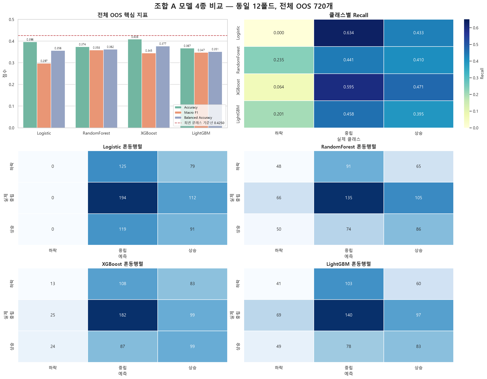

# 조합 A 모델 4종 비교

> 같은 피처, 같은 시간 구간, 같은 12폴드 워크포워드에서 모델 구조만 바꿨다.
> 숫자는 전체 OOS 720개 표본의 실측값이다.



## 실험 조건

| 항목 | 값 |
|---|---|
| 피처 | `rsi_14`, `bb_bandwidth`, `hv_20`, `vol_ratio_20` |
| 정답 | 미래 5거래일 방향: 하락 `-1`, 중립 `0`, 상승 `1` |
| 검증 | 시간순 확장형 워크포워드 12폴드 |
| 최초 학습 | 750개 |
| 폴드별 검증 | 60개 |
| 학습·검증 사이 gap | 5개 |
| 전체 OOS | 720개: 하락 204, 중립 306, 상승 210 |
| 하이퍼파라미터 | 각 모델 모듈의 고정된 기본값 |

학습 라벨이 미래 5거래일을 사용하므로 학습 마지막 행과 검증 첫 행 사이에서 5개를
제외했다. 네 모델의 검증 행과 실제 정답은 완전히 같다. 따라서 아래 차이는 피처나
검증 구간이 아니라 모델 구조 차이로 읽을 수 있다.

## 한눈에 보는 결과

| 모델 | Accuracy | Macro F1 | Balanced Accuracy | 하락 Recall | 중립 Recall | 상승 Recall |
|---|---:|---:|---:|---:|---:|---:|
| Logistic Regression | 0.3958 | 0.2971 | 0.3558 | 0.0000 | **0.6340** | 0.4333 |
| RandomForest | 0.3736 | **0.3585** | 0.3620 | **0.2353** | 0.4412 | 0.4095 |
| XGBoost | **0.4083** | 0.3446 | **0.3766** | 0.0637 | 0.5948 | **0.4714** |
| LightGBM | 0.3667 | 0.3471 | 0.3512 | 0.2010 | 0.4575 | 0.3952 |
| 최빈 클래스 기준선 | **0.4250** | 측정 대상 아님 | 측정 대상 아님 | 0.0000 | 1.0000 | 0.0000 |

### Accuracy만 보면 XGBoost가 1등이다

XGBoost의 Accuracy는 0.4083으로 네 모델 중 가장 높다. Logistic Regression보다
1.25%p 높지만, 중립만 예측하는 최빈 클래스 기준선 0.4250보다는 1.67%p 낮다.
따라서 “전체 정답 수”만으로는 네 모델 중 어느 것도 기준선을 이겼다고 말할 수 없다.

### 세 방향을 같은 비중으로 보면 RandomForest가 1등이다

RandomForest의 Macro F1은 0.3585로 가장 높다. 하락 Recall도 0.2353으로 가장 높아
실제 하락 204개 중 48개를 맞혔다. Logistic Regression은 하락을 한 번도 예측하지
않았으므로, 비선형 트리 구조가 하락 구분 가능성을 일부 되찾은 것은 확인된다.

다만 RandomForest의 Accuracy는 0.3736이다. 하락을 더 많이 예측하면서 클래스 균형은
나아졌지만 전체 정답 수는 줄었다. “하락 탐지”와 “전체 정확도” 사이의 교환관계가 있다.

### LightGBM은 RandomForest보다 우위가 없다

LightGBM의 하락 Recall은 0.2010으로 Logistic보다 낫지만 RandomForest의 0.2353보다
낮다. Accuracy와 Macro F1도 RandomForest 대비 동시에 우세하지 않다. 현재 기본
하이퍼파라미터에서는 LightGBM을 선택할 근거가 없다.

### Logistic Regression은 중립·상승에만 갇힌다

Logistic Regression은 720개 중 하락 예측이 0개다. 중립 Recall 0.6340 덕분에
Accuracy 0.3958을 얻었지만, 하락 F1이 0이어서 Macro F1은 0.2971까지 내려간다.
Accuracy만 보면 이 실패 형태가 가려진다.

## 혼동행렬에서 보이는 예측 성향

| 모델 | 하락 예측 수 | 중립 예측 수 | 상승 예측 수 | 가장 큰 쏠림 |
|---|---:|---:|---:|---|
| Logistic Regression | 0 | 438 | 282 | 하락을 전혀 예측하지 않음 |
| RandomForest | 164 | 300 | 256 | 네 모델 중 가장 고른 분포 |
| XGBoost | 62 | 377 | 281 | 중립 예측 비중이 큼 |
| LightGBM | 159 | 321 | 240 | RandomForest보다 중립 쏠림이 큼 |

RandomForest와 LightGBM은 하락을 각각 164개, 159개 예측했지만 실제 하락은 204개다.
하락 예측 수가 늘었다는 사실만으로 성능이 좋아졌다고 볼 수 없으므로 Precision과
Recall을 함께 봐야 한다. 하락 Precision은 RandomForest 0.2927, LightGBM 0.2579다.

## 현재 결론

1. **전체 Accuracy 우선이면 XGBoost**, 클래스 균형과 하락 탐지 우선이면
   **RandomForest**가 상대적으로 낫다.
2. 그러나 네 모델 모두 최빈 클래스 기준선 Accuracy 0.4250을 넘지 못했다.
3. 현재 결과는 기본 하이퍼파라미터 비교이며, 최종 모델 선정 결과가 아니다.
4. 다음 비교에서는 Accuracy 하나가 아니라 Macro F1, 하락 Recall, 거래비용 차감
   수익을 함께 통과 조건으로 두어야 한다.
5. 같은 OOS 구간에서 여러 모델을 비교했으므로 점수 차이를 독립 시행처럼 해석하면
   안 된다. 별도 홀드아웃을 열기 전까지는 개발구간 결과다.

## 시각화 재현 코드

아래 코드는 `matplotlib.pyplot`과 `seaborn`으로 핵심 지표, 클래스별 Recall,
혼동행렬을 그리는 구조다. 실제 그림은 각 실행 노트북에 저장된 실측값이 존재하는지
확인한 뒤 생성했다.

```python
import matplotlib.pyplot as plt
import pandas as pd
import seaborn as sns

results = {
    "Logistic": {
        "scores": [0.3958, 0.2971, 0.3558],
        "matrix": [[0, 125, 79], [0, 194, 112], [0, 119, 91]],
    },
    "RandomForest": {
        "scores": [0.3736, 0.3585, 0.3620],
        "matrix": [[48, 91, 65], [66, 135, 105], [50, 74, 86]],
    },
    "XGBoost": {
        "scores": [0.4083, 0.3446, 0.3766],
        "matrix": [[13, 108, 83], [25, 182, 99], [24, 87, 99]],
    },
    "LightGBM": {
        "scores": [0.3667, 0.3471, 0.3512],
        "matrix": [[41, 103, 60], [69, 140, 97], [49, 78, 83]],
    },
}

score_names = ["Accuracy", "Macro F1", "Balanced Accuracy"]
score_rows = [
    {"모델": model, "지표": score_name, "값": value}
    for model, result in results.items()
    for score_name, value in zip(score_names, result["scores"], strict=True)
]
score_df = pd.DataFrame(score_rows)

figure, axes = plt.subplots(1, 2, figsize=(16, 5))
sns.barplot(data=score_df, x="모델", y="값", hue="지표", ax=axes[0])
axes[0].axhline(0.4250, color="red", linestyle="--")

recall_rows = {}
for model, result in results.items():
    matrix = result["matrix"]
    recall_rows[model] = [
        matrix[index][index] / sum(matrix[index])
        for index in range(3)
    ]
recall_df = pd.DataFrame(recall_rows, index=["하락", "중립", "상승"]).T
sns.heatmap(recall_df, annot=True, fmt=".3f", cmap="YlGnBu", ax=axes[1])
plt.tight_layout()
plt.show()
```

## 원본 실험

- [Logistic Regression](01.LogisticRegression.ipynb)
- [RandomForest](02.RandomForest.ipynb)
- [XGBoost](03.XGBoost.ipynb)
- [LightGBM](04.LightGBM.ipynb)
